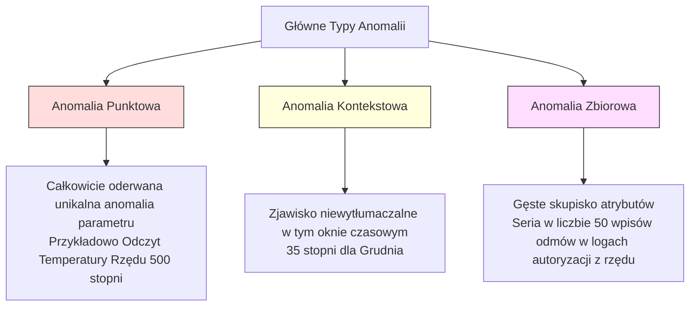

# Wykrywanie Anomalii

> Normalność jest niezwykle łatwa do zdefiniowania. Nienormalne jest po prostu wszystko to, co do niej nie pasuje.

**Typ:** Kompilacja
**Język:** Python
**Wymagania wstępne:** Faza 2, Lekcje 01-09
**Czas:** ~75 minut

## Cele edukacyjne

- Samodzielna implementacja (od zera) metod wykrywania anomalii opartych o Z-score, rozstęp ćwiartkowy (IQR) oraz algorytm Isolation Forest.
- Bezbłędne kategoryzowanie anomalii na punktowe, kontekstowe i zbiorowe oraz precyzyjne dopasowanie właściwego algorytmu badawczego.
- Zrozumienie, dlaczego profesjonalne wykrywanie anomalii definiuje się w dziedzinie ML jako precyzyjne modelowanie danych o profilu normalnym, a nie jako zadanie podążające szlakiem tradycyjnej klasyfikacji binarnej.
- Porównanie założeń merytorycznych klasyfikatorów bez nadzoru (unsupervised) z potokami klasyfikacji w pełni nadzorowanej (supervised) z uwzględnieniem optymalizacji odsetka nowych typów zagrożeń.

## Problem biznesowy

Karta kredytowa jest autoryzowana w Nowym Jorku o godzinie 14:00, a następnie raportuje użycie w Tokio zaledwie pięć minut później. Rejestrator termiczny czujnika z linii fabrycznej sygnalizuje temperaturę rzędu 150 stopni, podczas gdy bezpieczny dla urządzeń margines wynosi 80-120 stopni. Firmowy serwer niespodziewanie procesuje nagłą lawinę 50 000 odpytań w ciągu pojedynczej sekundy, mimo że dobowy standard nie przekracza kilkuset uderzeń.

Wszystkie te zdarzenia to tzw. anomalie. Szybkie i bezbłędne odnajdywanie takich zjawisk ma decydujący wpływ na biznes. Przemycone oszustwa uderzają na setki milionów. Drobne z pozoru awarie sprzętu zatrzymują całą linię, przynosząc straty produkcyjne. Ujawnienie włamania po czasie niesie rujnujące reperkusje.

Największe analityczne wyzwanie polega na tym, iż rzadko dysponujemy bogatym zbiorem danych w ujęciu badawczym opisującym takie zdarzenia. Oszustwa stanowią drobny ułamek, rzędu niespełna 0,1% dziennych transakcji. Usterki mechaniczne przytrafiają się zaledwie kilka razy do roku. Algorytm tradycyjnego klasyfikatora absolutnie zderzy się ze ścianą, ponieważ na klasę reprezentującą incydent "złośliwej anomalii" przypada po prostu krytycznie mała ilość wiedzy użytecznej dla pętli treningowych. Na domiar złego hakerzy codziennie projektują i ukrywają zupełnie zoptymalizowane taktyki włamań; jutrzejsza mutacja wektora oszustwa całkowicie i z założenia odbiegnie od formy wykrytej dzisiaj.

Stąd też dziedzina wykrywania anomalii radykalnie i skutecznie odwraca to wyzwanie. Zamiast z mozołem zmuszać sieć uogólniającą do poznania i detekcji nieskończonej palety zachowań określanych mianem wadliwych i patologicznych, bezwzględnie zlecamy modelowi precyzyjne wchłonięcie samej reguły i wzorca tego, co jest normą. Jakiekolwiek pojawiające się odchylenie w strumieniu obserwacji natychmiast uznajemy za zjawisko mocno podejrzane. Jest to bardzo eleganckie rozwiązanie działające sprawnie przy całkowitym braku oznakowanych danych i bez problemów zdolne wykrywać mutujące z czasem anomaliowe zjawiska na produkcji.

## Koncepcje teoretyczne

### Taksonomia i klasyfikacja anomalii

Pamiętaj, że nie wszystkie pojawiające się błędy w danych zaliczają się do tożsamego zjawiska:

- **Anomalie Punktowe (Point Anomalies).** Pojedynczy i osamotniony na tle historii punkt, ekstremalnie wykraczający poza typowy nawias. Temperatura uderzeniowa 500 stopni czy oszałamiający zakup na 50 000 zł ze studenckiego małego konta.
- **Anomalie Kontekstowe (Contextual Anomalies).** Punkt danych ewidentnie poprawny, ale tylko dla innego otoczenia lub czasu. Słoneczne 35 stopni jest jak najbardziej normą lipcową, niemniej ta sama wartość zanotowana po południu podczas mroźnego stycznia to ewidentna anomalia w tym specyficznym ujęciu. 
- **Anomalie Zbiorowe (Collective Anomalies).** Zwarta historyczna paczka punktów danych odstająca mocno formą i ułożeniem sekwencji od wyuczonego otoczenia, niezależnie od tego czy jakikolwiek wewnętrzny element analizowanej grupy odstawał sam. Pojedynczy nieudany login to normalka z racji przejęzyczenia; ale 50 błędów autoryzacji pod rząd to atak siłowy algorytmu Brute Force.

Znakomita większość znanych i sprawdzonych metod skupia optykę na anomaliach punktowych. Identyfikacja nieprawidłowości podążających pod kategoria kontekstowych ściśle wymaga domieszkowania i inżynierii pod względem cech takich jak położenie w czasie i miejscu, natomiast odłam usterek w zjawiskach zbiorowych nakłada absolutny obowiązek zaopatrzenia systemu w logikę głębokich algorytmów pamięciowych nałożonych pod postacią uogólniających okien (windows).



### Detekcja bez udziału Nauczyciela (Unsupervised Framing)

W komercyjnej klasyfikacji na co dzień wykorzystujemy twarde zjawiska znakowania pod zbiorem dwóch obiektywnych miar (etykietowanie klasy). Natomiast przy wnikliwym diagnozowaniu ukrytych anomalii bardzo szybko zauważasz powtarzalny komercyjny model uwarunkowań:

1. **Praca całkowicie nienadzorowana (Unsupervised).** Absolutny brak ujętych danych flagujących po incydencie. Dopasowujesz parametry statystyczne bezpośrednio pod absolutnie cały wymiar badanych danych bez uwzględnienia incydentów i pozostaje Ci wiara, że odsetek rzędu awarii jest na tyle drobnym ułamkiem dla środowiska modelu, iż model zachowuje ogólną poprawną i nienaruszalną definicję normy.
2. **Kompilacja na danych Częściowo Oznakowanych Nauczycielem.** Dysponujesz nienagannym poświadczonym ekspercko sterylnym wymiarem pozbawionym pomyłek dla próbki zachowań z normalnego przedziału. Modelujesz i wdrażasz optykę i filtry sieci jedynie po obrysach sterylnego zbioru i testujesz po wdrożeniu po pełnym zbiorze mieszanym.
3. **Konstrukcja Słabo Podatna na Nadzór.** Zdobyłeś bardzo znikome dla uogólnień dane oflagowane w historii, a na dodatek wysoce archaiczne w czasie. W tej sytuacji powstrzymaj system przed nieczystą pokusą klasyfikacyjną: ucz i definiuj bez nadzoru na uśrednionym wzorze normalnym, i wykorzystaj ubogi zbiór odciętych logów wyłącznie po stronie testowej jako pożyteczne mierniki dla F1, co ocala algorytm przed zafiksowaniem wyłącznie do przeszłych zdarzeń.

Oto co powinieneś fundamentalnie zanotować z lektury po tym etapie: Wykrywanie obcych incydentów to u fundamentów zupełnie inny gatunek analityki niż podziały binarne o obrysach. Tutaj skupiasz statystyczne zdolności modelujące bezpośrednio do uchwycenia sedna obrysu normalnej dystrybucji na terytorium bez wymiarów dla patologii.

### Nadzorowany vs Nienadzorowany Analizator

Jeżeli faktycznie zgromadziłeś dane oflagowane usterkami, to jaka zapadnie operacyjna wdrożeniowa ostateczna odpowiedź: klasyfikator binarny z wagą mniejszości czy potok do modelowania obrysu sterylnej normy?

**Wymiar Nadzorowany (Klasyfikator):**
- System chłonie precyzyjnie dotychczas zaobserwowane cechy z archaicznych wektorów oszustwa.
- System potęguje mierzalną na wykresach skuteczność dla oszustw bazujących rygorystycznie na starych i powtarzanych metodach.
- Z założenia ignoruje jakikolwiek wprowadzany najświeższy dotąd model nieudokumentowanej nowatorskiej usterki (False Negatives eksplodują).
- Kategorycznie uzależniony do stałych okresowych na nowo cyklów retreningowych wymuszonych przy nowo wymyślonych patologiach w rynkowym wektorze hakerów.

**Brak Nadzoru (Budowanie Wymiaru Normalności):**
- Łapie każde obiektywne na wykresie zdarzenie wyłamujące logikę wektora dystrybucji uwzględniając najnowsze wektory uderzenia od oszustów (Zero-Day Detection).
- Eliminuje kosztowne zatrudnianie analityków do ręcznego czasochłonnego znakowania ze sterty powtarzalnych alertów.
- Kosztem pozostaje jednak wprost nieuchronny lekki wyższy mierzalny w koszykach po wdrożeniowych margines błędu pomyłek do fałszywych alertów uderzających odchyleniem w zespół Security Operations Center (SOC).

Działania profesjonalne łączą obydwie wyżej ujęte metody, wdrażając niezawodne kaskady i potoki wykrywania niecodziennych zachowań z szerokiego promienia detekcji w nieodzownym duecie z opartymi i wyuczonymi modelami z klasyfikacji odseparowanymi operacyjnie dla odciążenia i ręcznej pracy inżynierów.

## Budowa Modelu w Pythonie

Kod towarzyszący do zajęć został umiejscowiony pod dedykowanym bezpiecznym zagnieżdżeniem w pliku `code/anomaly_detection.py`. Wprowadza do środowiska kod wyliczany ręcznie i implementowany matematycznie (from scratch) o ustandaryzowanych wzorcach obliczeń z odchyleń kwartylowych na Z-score czy bezkompromisowej rygorystycznej metodzie budowy drzew uderzających obrysem pod oskarżone osamotnione próby nazywane po tytule jako architektury uogólnienia lasów z nazwą Forest dla Isolation.

## Użycie 

Użyj scikit-learn, aby przyspieszyć swoją pracę po opanowaniu konceptów na niskim poziomie. Implementacje dla `IsolationForest` lub `LocalOutlierFactor` są tam dobrze zoptymalizowane pod kątem działania macierzowego.

```python
from sklearn.ensemble import IsolationForest
from sklearn.neighbors import LocalOutlierFactor

iso = IsolationForest(n_estimators=100, contamination=0.05, random_state=42)
iso.fit(X_train)
predictions = iso.predict(X_test)
```

Zauważ parametr `contamination` – ustawia odsetek obserwacji w zbiorze, które z góry będą przez algorytm flagowane jako anomalie i decyduje w efekcie o wdrożeniowym ostatecznym progu rzutującym wyniki w środowisku działania binarnie (1 i -1). Ustaw ten margines zgodnie z rynkową, rzeczywistą domeną i budżetem przewidzianym w organizacji na weryfikację alertów (tj. koszt False Positives).

## Do wysłania
Ta sesja da Ci niezbędne aktywa merytoryczne i kody:
- `outputs/skill-anomaly-detector.md`
- `code/anomaly_detection.py` (Z-score, IQR, Isolation Forest od zera)
