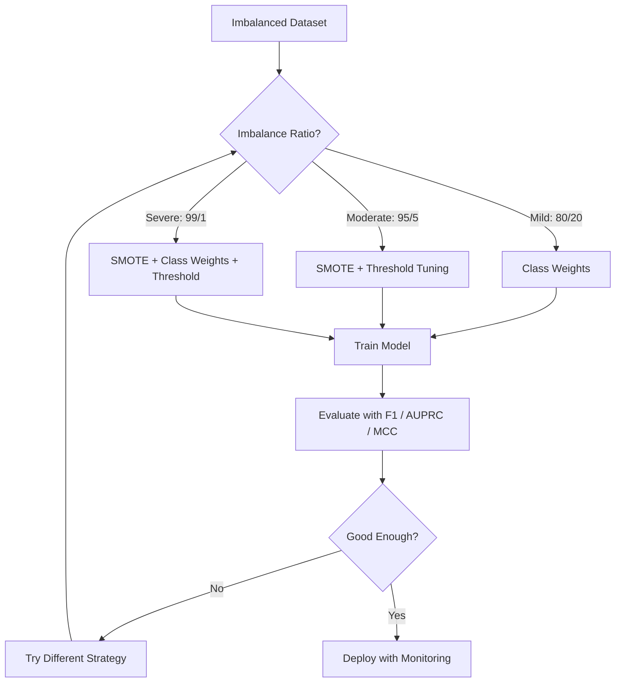
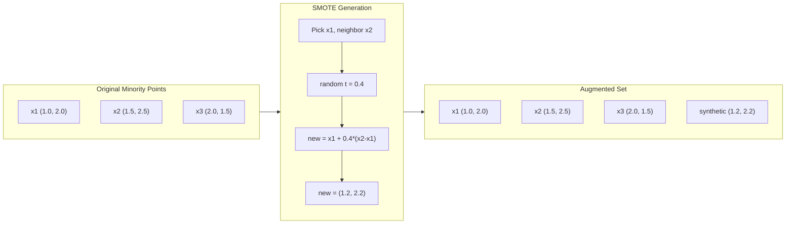
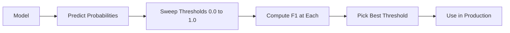
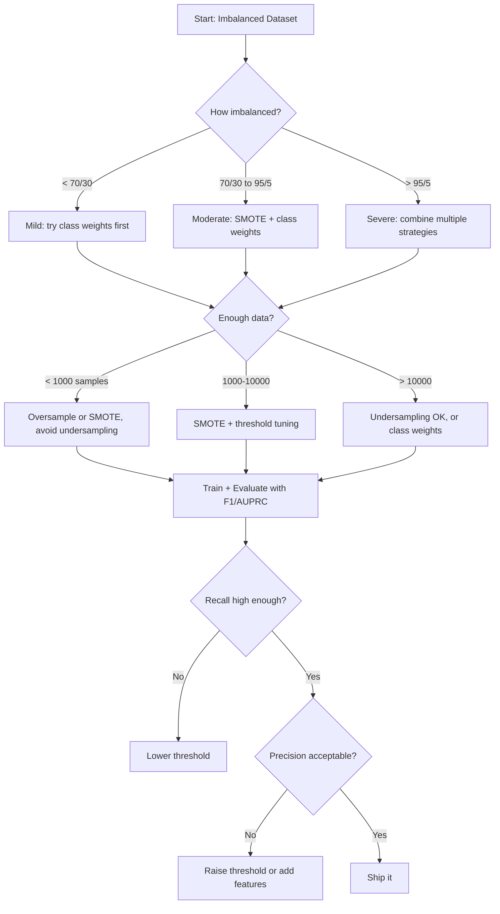

# Obsługa niezrównoważonych danych

> Kiedy 99% danych jest „normalnych”, dokładność jest kłamstwem.

**Typ:** Kompilacja
**Język:** Python
**Wymagania wstępne:** Faza 2, lekcje 01-09 (szczególnie metryki ewaluacyjne)
**Czas:** ~90 minut

## Cele nauczania

- Zaimplementuj SMOTE od podstaw i wyjaśnij, czym syntetyczne nadpróbkowanie różni się od losowej duplikacji
- Oceń niezrównoważone klasyfikatory, używając F1, AUPRC i współczynnika korelacji Matthewsa zamiast dokładności
- Porównaj ważenie klas, dostrajanie progów i strategie ponownego próbkowania i wybierz właściwe podejście dla danego współczynnika niezrównoważenia
- Zbuduj kompletny niezrównoważony potok danych, który łączy SMOTE, wagi klas i optymalizację progów

## Problem

Budujesz model wykrywania oszustw. Zapewnia dokładność na poziomie 99,9%. Świętujesz. Potem zdajesz sobie sprawę, że przewiduje „nie oszustwo” dla każdej pojedynczej transakcji.

To nie jest błąd. Jest to racjonalne rozwiązanie, gdy tylko 0,1% transakcji ma charakter oszustwa. Model uczy się, że zawsze zgadywanie klasy większościowej minimalizuje błąd ogólny. Jest technicznie poprawny i całkowicie bezużyteczny.

Dzieje się tak wszędzie tam, gdzie liczy się prawdziwa klasyfikacja. Diagnoza choroby: 1% wskaźnika pozytywnego. Włamanie do sieci: 0,01% ataków. Wady produkcyjne: 0,5% wadliwe. Filtrowanie spamu: 20% spamu. Prognoza rezygnacji: 5% osób, które odejdą. Im bardziej konsekwentna jest klasa mniejszościowa, tym jest ona rzadsza.

Dokładność zawodzi, ponieważ wszystkie prawidłowe przewidywania traktuje jednakowo. Prawidłowe oznaczenie legalnej transakcji i prawidłowe wykrycie oszustwa liczy się jako jeden punkt dokładności. Ale wyłapywanie oszustw to jedyny powód istnienia tego modelu. Potrzebujemy metryk, technik i strategii szkoleniowych, które zmuszą model do zwrócenia uwagi na rzadką, ale ważną klasę.

## Koncepcja

### Dlaczego dokładność zawodzi

Rozważmy zbiór danych zawierający 1000 próbek: 990 negatywnych, 10 pozytywnych. Model, który zawsze przewiduje negatyw:

|  | Przewidywany pozytywny | Przewidywany wynik negatywny |
|--|---|---|
| Właściwie pozytywne | 0 (TP) | 10 (FN) |
| Właściwie negatywne | 0 (FP) | 990 (TN) |

Dokładność = (0 + 990) / 1000 = 99,0%

Model nie łapie żadnych oszustw. Zerowa choroba. Zero wad. Ale dokładność mówi 99%. Dlatego dokładność jest niebezpieczna w przypadku niezrównoważonych problemów.

### Lepsze wskaźniki

**Precyzja** = TP / (TP + FP). Ze wszystkiego, co zostało oznaczone jako pozytywne, ile tak naprawdę jest? Wysoka precyzja oznacza niewielką liczbę fałszywych alarmów.

**Przypomnijmy** = TP / (TP + FN). Ze wszystkiego, co było naprawdę pozytywne, ile złowiliśmy? Wysoka pamięć oznacza niewiele pominiętych pozytywów.

**Wynik F1** = 2 * precyzja * przypomnienie / (precyzja + przypomnienie). Średnia harmoniczna. Karze za skrajny brak równowagi między precyzją i zapamiętywaniem bardziej niż średnia arytmetyczna.

**Wynik F-beta** = (1 + beta^2) * precyzja * przypomnienie / (beta^2 * precyzja + przypomnienie). Gdy beta > 1, przypomnienie ma większe znaczenie. Gdy beta < 1, precyzja ma większe znaczenie. F2 jest powszechny w wykrywaniu oszustw (brak oszustwa jest gorszy niż fałszywy alarm).

**AUPRC** (obszar pod krzywą przypomnienia precyzji). Podobnie jak AUC-ROC, ale zawiera więcej informacji w przypadku niezrównoważonych danych. Losowy klasyfikator ma AUPRC równy współczynnikowi klasy dodatniej (a nie 0,5 jak ROC). Dzięki temu łatwiej będzie dostrzec ulepszenia.

**Współczynnik korelacji Matthewsa** = (TP * TN - FP * FN) / sqrt((TP+FP)(TP+FN)(TN+FP)(TN+FN)). Zakres od -1 do +1. Daje wysoki wynik tylko wtedy, gdy model radzi sobie dobrze w obu klasach. Zrównoważony nawet wtedy, gdy klasy są bardzo różnej wielkości.

Dla powyższego modelu „zawsze przewidywaj ujemnie”: precyzja = 0/0 (nieokreślona, ​​często ustawiana na 0), przypominanie = 0/10 = 0, F1 = 0, MCC = 0. Metryki te prawidłowo identyfikują model jako bezwartościowy.

### Niezrównoważony potok danych



### SMOTE: Technika nadpróbkowania syntetycznej mniejszości

Losowe nadpróbkowanie duplikuje istniejące próbki mniejszości. Działa to, ale wiąże się z ryzykiem nadmiernego dopasowania, ponieważ model wielokrotnie widzi identyczne punkty.

SMOTE tworzy nowe syntetyczne próbki mniejszości, które są wiarygodne, ale nie są kopiami. Algorytm:

1. Dla każdej próbki mniejszościowej x znajdź k jej najbliższych sąsiadów spośród innych próbek mniejszościowych
2. Wybierz losowo jednego sąsiada
3. Utwórz nową próbkę na odcinku linii pomiędzy x i tym sąsiadem

Formuła: `new_sample = x + random(0, 1) * (neighbor - x)`

To interpoluje pomiędzy rzeczywistymi punktami mniejszościowymi, tworząc próbki w tym samym obszarze przestrzeni cech bez kopiowania istniejących danych.



### Porównanie strategii próbkowania

**Losowe nadpróbkowanie**: zduplikuj próbki mniejszości, aby dopasować liczbę większości.
- Plusy: proste, bez utraty informacji
- Wady: dokładne duplikaty powodują nadmierne dopasowanie, wydłużają czas szkolenia

**Losowe niedopróbkowanie**: usuń próbki większościowe, aby dopasować liczbę mniejszości.
- Plusy: szybki trening, prosty
- Wady: wyrzuca potencjalnie przydatne dane większościowe, większa wariancja

**SMOTE**: tworzenie syntetycznych próbek mniejszościowych poprzez interpolację.
- Plusy: generuje nowe punkty danych, zmniejsza nadmierne dopasowanie w porównaniu do losowego oversamplingu
- Wady: mogą tworzyć zaszumione próbki w pobliżu granicy decyzyjnej, nie uwzględniają rozkładu klas większościowych

| Strategia | Dane zmienione | Ryzyko | Kiedy stosować |
|---------|------------|------|------------|
| Nadpróbka | Mniejszość zduplikowana | Nadmierne dopasowanie | Małe zbiory danych, umiarkowana nierównowaga |
| Podpróbka | Większość usunięta | Utrata informacji | Duże zbiory danych, wymagają szybkiego szkolenia |
| PALENIE | Dodano mniejszość syntetyczną | Hałas graniczny | Umiarkowana nierównowaga, wystarczająca liczba próbek mniejszości dla k-NN |

### Wagi klas

Zamiast zmieniać dane, zmień sposób, w jaki model traktuje błędy. Przypisz większą wagę błędnej klasyfikacji klasy mniejszości.

Dla problemu binarnego z 950 próbkami negatywnymi i 50 pozytywnymi:
- Waga dla klasy ujemnej = n_samples / (2 * n_negative) = 1000 / (2 * 950) = 0,526
- Waga dla klasy dodatniej = n_samples / (2 * n_positive) = 1000 / (2 * 50) = 10,0

Klasa pozytywna otrzymuje 19-krotność wagi. Błędna klasyfikacja jednej próbki pozytywnej kosztuje tyle samo, co błędna klasyfikacja 19 próbek negatywnych. Model zmuszony jest zwrócić uwagę na klasę mniejszościową.

W regresji logistycznej modyfikuje to funkcję straty:

```
weighted_loss = -sum(w_i * [y_i * log(p_i) + (1-y_i) * log(1-p_i)])
```

gdzie w_i zależy od klasy próbki i.

Wagi klas są matematycznie równoważne nadpróbkowaniu w oczekiwaniu, ale bez tworzenia nowych punktów danych. Dzięki temu są one szybsze i pozwalają uniknąć ryzyka nadmiernego dopasowania w postaci zduplikowanych próbek.

### Strojenie progu

Większość klasyfikatorów podaje prawdopodobieństwo. Domyślny próg wynosi 0,5: jeśli P(dodatni) >= 0,5, należy przewidzieć wynik dodatni. Ale 0,5 jest arbitralne. Gdy klasy są niezrównoważone, optymalny próg jest zwykle znacznie niższy.

Proces:
1. Wytrenuj model
2. Uzyskaj przewidywane prawdopodobieństwa na zbiorze walidacyjnym
3. Progi przemiatania od 0,0 do 1,0
4. Oblicz F1 (lub wybraną metrykę) dla każdego progu
5. Wybierz próg, który maksymalizuje Twój wskaźnik



Model może wyprowadzić P(oszustwo) = 0,15 dla oszukańczej transakcji. Przy progu 0,5 nie jest to klasyfikowane jako oszustwo. Przy progu 0,10 jest prawidłowo złapany. Kalibracja prawdopodobieństwa ma mniejsze znaczenie niż ranking – dopóki prawdopodobieństwo oszustwa jest wyższe niż prawdopodobieństwa braku oszustwa, istnieje próg, który je oddziela.

### Nauka opłacalna

Uogólnienie wag klas. Zamiast kosztów jednolitych przypisz konkretne koszty błędnej klasyfikacji:

| | Przewiduj pozytywne | Przewiduj wynik negatywny |
|--|---|---|
| Właściwie pozytywne | 0 (poprawnie) | C_FN = 100 |
| Właściwie negatywne | C_FP = 1 | 0 (poprawnie) |

Przegapienie fałszywej transakcji (FN) kosztuje 100 razy więcej niż fałszywy alarm (FP). Model optymalizuje pod kątem całkowitego kosztu, a nie całkowitej liczby błędów.

Jest to podejście najbardziej oparte na zasadach, umożliwiające oszacowanie rzeczywistych kosztów. Pominięcie diagnozy raka wiąże się z zupełnie innymi kosztami niż fałszywy alarm prowadzący do dodatkowej biopsji. Wyraźne przedstawienie tych kosztów wymusza dokonanie właściwych kompromisów.

### Schemat podejmowania decyzji



## Zbuduj to

### Krok 1: Wygeneruj niezrównoważony zbiór danych

```python
import numpy as np

def make_imbalanced_data(n_majority=950, n_minority=50, seed=42):
    rng = np.random.RandomState(seed)

    X_maj = rng.randn(n_majority, 2) * 1.0 + np.array([0.0, 0.0])
    X_min = rng.randn(n_minority, 2) * 0.8 + np.array([2.5, 2.5])

    X = np.vstack([X_maj, X_min])
    y = np.concatenate([np.zeros(n_majority), np.ones(n_minority)])

    shuffle_idx = rng.permutation(len(y))
    return X[shuffle_idx], y[shuffle_idx]
```

### Krok 2: UDERZENIE od zera

```python
def euclidean_distance(a, b):
    return np.sqrt(np.sum((a - b) ** 2))

def find_k_neighbors(X, idx, k):
    distances = []
    for i in range(len(X)):
        if i == idx:
            continue
        d = euclidean_distance(X[idx], X[i])
        distances.append((i, d))
    distances.sort(key=lambda x: x[1])
    return [d[0] for d in distances[:k]]

def smote(X_minority, k=5, n_synthetic=100, seed=42):
    rng = np.random.RandomState(seed)
    n_samples = len(X_minority)
    k = min(k, n_samples - 1)
    synthetic = []

    for _ in range(n_synthetic):
        idx = rng.randint(0, n_samples)
        neighbors = find_k_neighbors(X_minority, idx, k)
        neighbor_idx = neighbors[rng.randint(0, len(neighbors))]
        t = rng.random()
        new_point = X_minority[idx] + t * (X_minority[neighbor_idx] - X_minority[idx])
        synthetic.append(new_point)

    return np.array(synthetic)
```

### Krok 3: Losowe nadpróbkowanie i podpróbkowanie

```python
def random_oversample(X, y, seed=42):
    rng = np.random.RandomState(seed)
    classes, counts = np.unique(y, return_counts=True)
    max_count = counts.max()

    X_resampled = list(X)
    y_resampled = list(y)

    for cls, count in zip(classes, counts):
        if count < max_count:
            cls_indices = np.where(y == cls)[0]
            n_needed = max_count - count
            chosen = rng.choice(cls_indices, size=n_needed, replace=True)
            X_resampled.extend(X[chosen])
            y_resampled.extend(y[chosen])

    X_out = np.array(X_resampled)
    y_out = np.array(y_resampled)
    shuffle = rng.permutation(len(y_out))
    return X_out[shuffle], y_out[shuffle]

def random_undersample(X, y, seed=42):
    rng = np.random.RandomState(seed)
    classes, counts = np.unique(y, return_counts=True)
    min_count = counts.min()

    X_resampled = []
    y_resampled = []

    for cls in classes:
        cls_indices = np.where(y == cls)[0]
        chosen = rng.choice(cls_indices, size=min_count, replace=False)
        X_resampled.extend(X[chosen])
        y_resampled.extend(y[chosen])

    X_out = np.array(X_resampled)
    y_out = np.array(y_resampled)
    shuffle = rng.permutation(len(y_out))
    return X_out[shuffle], y_out[shuffle]
```

### Krok 4: Regresja logistyczna z wagami klas

```python
def sigmoid(z):
    return 1.0 / (1.0 + np.exp(-np.clip(z, -500, 500)))

def logistic_regression_weighted(X, y, weights, lr=0.01, epochs=200):
    n_samples, n_features = X.shape
    w = np.zeros(n_features)
    b = 0.0

    for _ in range(epochs):
        z = X @ w + b
        pred = sigmoid(z)
        error = pred - y
        weighted_error = error * weights

        gradient_w = (X.T @ weighted_error) / n_samples
        gradient_b = np.mean(weighted_error)

        w -= lr * gradient_w
        b -= lr * gradient_b

    return w, b

def compute_class_weights(y):
    classes, counts = np.unique(y, return_counts=True)
    n_samples = len(y)
    n_classes = len(classes)
    weight_map = {}
    for cls, count in zip(classes, counts):
        weight_map[cls] = n_samples / (n_classes * count)
    return np.array([weight_map[yi] for yi in y])
```

### Krok 5: Strojenie progu

```python
def find_optimal_threshold(y_true, y_probs, metric="f1"):
    best_threshold = 0.5
    best_score = -1.0

    for threshold in np.arange(0.05, 0.96, 0.01):
        y_pred = (y_probs >= threshold).astype(int)
        tp = np.sum((y_pred == 1) & (y_true == 1))
        fp = np.sum((y_pred == 1) & (y_true == 0))
        fn = np.sum((y_pred == 0) & (y_true == 1))

        if metric == "f1":
            precision = tp / (tp + fp) if (tp + fp) > 0 else 0.0
            recall = tp / (tp + fn) if (tp + fn) > 0 else 0.0
            score = 2 * precision * recall / (precision + recall) if (precision + recall) > 0 else 0.0
        elif metric == "recall":
            score = tp / (tp + fn) if (tp + fn) > 0 else 0.0
        elif metric == "precision":
            score = tp / (tp + fp) if (tp + fp) > 0 else 0.0

        if score > best_score:
            best_score = score
            best_threshold = threshold

    return best_threshold, best_score
```

### Krok 6: Funkcje oceny

```python
def confusion_matrix_values(y_true, y_pred):
    tp = np.sum((y_pred == 1) & (y_true == 1))
    tn = np.sum((y_pred == 0) & (y_true == 0))
    fp = np.sum((y_pred == 1) & (y_true == 0))
    fn = np.sum((y_pred == 0) & (y_true == 1))
    return tp, tn, fp, fn

def compute_metrics(y_true, y_pred):
    tp, tn, fp, fn = confusion_matrix_values(y_true, y_pred)
    accuracy = (tp + tn) / (tp + tn + fp + fn)
    precision = tp / (tp + fp) if (tp + fp) > 0 else 0.0
    recall = tp / (tp + fn) if (tp + fn) > 0 else 0.0
    f1 = 2 * precision * recall / (precision + recall) if (precision + recall) > 0 else 0.0

    denom = np.sqrt(float((tp + fp) * (tp + fn) * (tn + fp) * (tn + fn)))
    mcc = (tp * tn - fp * fn) / denom if denom > 0 else 0.0

    return {
        "accuracy": accuracy,
        "precision": precision,
        "recall": recall,
        "f1": f1,
        "mcc": mcc,
    }
```

### Krok 7: Porównaj wszystkie podejścia

```python
X, y = make_imbalanced_data(950, 50, seed=42)
split = int(0.8 * len(y))
X_train, X_test = X[:split], X[split:]
y_train, y_test = y[:split], y[split:]

# Baseline: no treatment
w_base, b_base = logistic_regression_weighted(
    X_train, y_train, np.ones(len(y_train)), lr=0.1, epochs=300
)
probs_base = sigmoid(X_test @ w_base + b_base)
preds_base = (probs_base >= 0.5).astype(int)

# Oversampled
X_over, y_over = random_oversample(X_train, y_train)
w_over, b_over = logistic_regression_weighted(
    X_over, y_over, np.ones(len(y_over)), lr=0.1, epochs=300
)
preds_over = (sigmoid(X_test @ w_over + b_over) >= 0.5).astype(int)

# SMOTE
minority_mask = y_train == 1
X_minority = X_train[minority_mask]
synthetic = smote(X_minority, k=5, n_synthetic=len(y_train) - 2 * int(minority_mask.sum()))
X_smote = np.vstack([X_train, synthetic])
y_smote = np.concatenate([y_train, np.ones(len(synthetic))])
w_sm, b_sm = logistic_regression_weighted(
    X_smote, y_smote, np.ones(len(y_smote)), lr=0.1, epochs=300
)
preds_smote = (sigmoid(X_test @ w_sm + b_sm) >= 0.5).astype(int)

# Class weights
sample_weights = compute_class_weights(y_train)
w_cw, b_cw = logistic_regression_weighted(
    X_train, y_train, sample_weights, lr=0.1, epochs=300
)
probs_cw = sigmoid(X_test @ w_cw + b_cw)
preds_cw = (probs_cw >= 0.5).astype(int)

# Threshold tuning (tune on held-out validation set, not test set)
probs_val = sigmoid(X_val @ w_cw + b_cw)
best_thresh, best_f1 = find_optimal_threshold(y_val, probs_val, metric="f1")
preds_thresh = (probs_cw >= best_thresh).astype(int)
```

Plik kodu uruchamia to wszystko w jednym skrypcie i wyświetla wyniki.

## Użyj tego

W przypadku nauki scikit i uczenia się niezrównoważonego techniki te są jednowierszowe:

```python
from sklearn.linear_model import LogisticRegression
from sklearn.metrics import classification_report, f1_score
from sklearn.model_selection import train_test_split
from imblearn.over_sampling import SMOTE
from imblearn.under_sampling import RandomUnderSampler
from imblearn.pipeline import Pipeline

X_train, X_test, y_train, y_test = train_test_split(X, y, stratify=y)

model_weighted = LogisticRegression(class_weight="balanced")
model_weighted.fit(X_train, y_train)
print(classification_report(y_test, model_weighted.predict(X_test)))

smote = SMOTE(random_state=42)
X_resampled, y_resampled = smote.fit_resample(X_train, y_train)
model_smote = LogisticRegression()
model_smote.fit(X_resampled, y_resampled)
print(classification_report(y_test, model_smote.predict(X_test)))

pipeline = Pipeline([
    ("smote", SMOTE()),
    ("model", LogisticRegression(class_weight="balanced")),
])
pipeline.fit(X_train, y_train)
print(classification_report(y_test, pipeline.predict(X_test)))
```

Implementacje od podstaw pokazują dokładnie, co robi każda technika. SMOTE to po prostu interpolacja k-NN dla klasy mniejszości. Wagi klas mnożą stratę. Strojenie progowe to pętla for-over nad wartościami odcięcia. Żadnej magii.

## Wyślij to

Ta lekcja daje:
- `outputs/skill-imbalanced-data.md` – lista kontrolna decyzji do rozwiązywania problemów z niezrównoważoną klasyfikacją

## Ćwiczenia

1. **Borderline-SMOTE**: zmodyfikuj implementację SMOTE tak, aby generowała próbki syntetyczne tylko dla punktów mniejszości, które znajdują się w pobliżu granicy decyzyjnej (te, których k-najbliższych sąsiadów obejmuje próbki klasy większości). Porównaj wyniki ze standardowym SMOTE w zbiorze danych, w którym klasy się pokrywają.

2. **Optymalizacja macierzy kosztów**: wdrożenie uczenia się uwzględniającego koszty, gdzie macierz kosztów jest parametrem. Utwórz funkcję, która pobiera macierz kosztów i zwraca optymalne prognozy, które minimalizują oczekiwany koszt. Przetestuj przy różnych współczynnikach kosztów (1:10, 1:100, 1:1000) i wykreśl, jak zmienia się kompromis w zakresie precyzji.

3. **Kalibracja progowa**: zastosuj skalowanie Platta (dopasuj regresję logistyczną do surowych wyników modelu, aby uzyskać skalibrowane prawdopodobieństwa). Porównaj krzywą przypomnienia precyzji przed i po kalibracji. Pokaż, że kalibracja nie zmienia rankingu (AUC pozostaje takie samo), ale sprawia, że ​​prawdopodobieństwa są bardziej znaczące.

4. **Zestaw ze zrównoważonym pakowaniem**: trenuj wiele modeli, każdy na zrównoważonej próbce startowej (wszystkie mniejszości + losowy podzbiór większości). Uśrednij ich przewidywania. Porównaj to podejście z pojedynczym modelem z SMOTE. Mierz zarówno wydajność, jak i wariancję w różnych seriach.

5. **Eksperyment dotyczący współczynnika braku równowagi**: weź zrównoważony zbiór danych i stopniowo zwiększaj współczynnik braku równowagi (50/50, 70/30, 90/10, 95/5, 99/1). Dla każdego współczynnika trenuj ze SMOTE i bez. Wykres F1 w funkcji współczynnika niezrównoważenia dla obu podejść. W jakim stosunku SMOTE zaczyna robić znaczącą różnicę?

## Kluczowe terminy

| Termin | Co ludzie mówią | Co to właściwie oznacza |
|------|----------------|----------------------|
| Nierównowaga klas | „Jedna klasa ma znacznie więcej próbek” | Rozkład klas w zbiorze danych jest znacznie wypaczony, co powoduje, że modele faworyzują klasę większościową |
| PALENIE | „Syntetyczny oversampling” | Tworzy nowe próbki mniejszości poprzez interpolację pomiędzy istniejącymi próbkami mniejszości i ich k-najbliższymi sąsiadami mniejszości |
| Wagi klas | „Sprawianie, że błędy w rzadkich klasach stają się droższe” | Mnożenie funkcji straty przez wagi specyficzne dla klasy, aby model w większym stopniu karał błędną klasyfikację mniejszości |
| Strojenie progu | „Przesunięcie granicy decyzyjnej” | Zmiana punktu odcięcia prawdopodobieństwa klasyfikacji z domyślnego 0,5 na wartość optymalizującą żądaną metrykę |
| Kompromis w zakresie precyzji przywoływania | „Nie możesz mieć obu” | Obniżenie progu pozwala wychwycić więcej wyników pozytywnych (wyższa pamięć), ale także oznacza więcej wyników fałszywie dodatnich (mniejsza precyzja) i odwrotnie.
| AUPRC | „Obszar pod krzywą PR” | Podsumowuje krzywą precyzji przypomnienia w jednej liczbie; bardziej informacyjny niż AUC-ROC, gdy klasy są silnie niezrównoważone |
| Współczynnik korelacji Matthewsa | „Metryka zrównoważona” | Korelacja między przewidywanymi i rzeczywistymi etykietami, która daje wysoki wynik tylko wtedy, gdy model działa dobrze w obu klasach |
| Nauka uwzględniająca koszty | „Różne błędy kosztują różne kwoty” | Uwzględnienie rzeczywistych kosztów błędnej klasyfikacji w celu szkoleniowym, tak aby model optymalizował się pod kątem kosztów całkowitych, a nie liczby błędów |
| Losowe nadpróbkowanie | „Powiel mniejszość” | Powtarzanie próbek klas mniejszościowych w celu zrównoważenia liczebności klas; proste, ale ryzyko nadmiernego dopasowania do zduplikowanych punktów |

## Dalsze czytanie

- [SMOTE: Synthetic Minority Over-sampling Technique (Chawla et al., 2002)](https://arxiv.org/abs/1106.1813) – oryginalna praca SMOTE, wciąż najczęściej cytowana praca na temat niezrównoważonego uczenia się
– [Uczenie się na podstawie niezrównoważonych danych (He i Garcia, 2009)](https://ieeexplore.ieee.org/document/5128907) – kompleksowa ankieta obejmująca pobieranie próbek, podejście uwzględniające koszty i podejście algorytmiczne
– [dokumentacja imbalanced-learn](https://imbalanced-learn.org/stable/) – Biblioteka Pythona z wariantami SMOTE, strategiami undersamplingu i integracją potoków
– [Wykres przypomnienia precyzji jest bardziej pouczający niż wykres ROC (Saito i Rehmsmeier, 2015)](https://journals.plos.org/plosone/article?id=10.1371/journal.pone.0118432) – kiedy i dlaczego w przypadku niezrównoważonych problemów preferować krzywe PR zamiast krzywych ROC