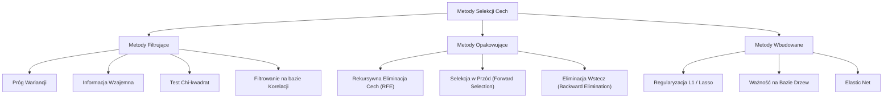
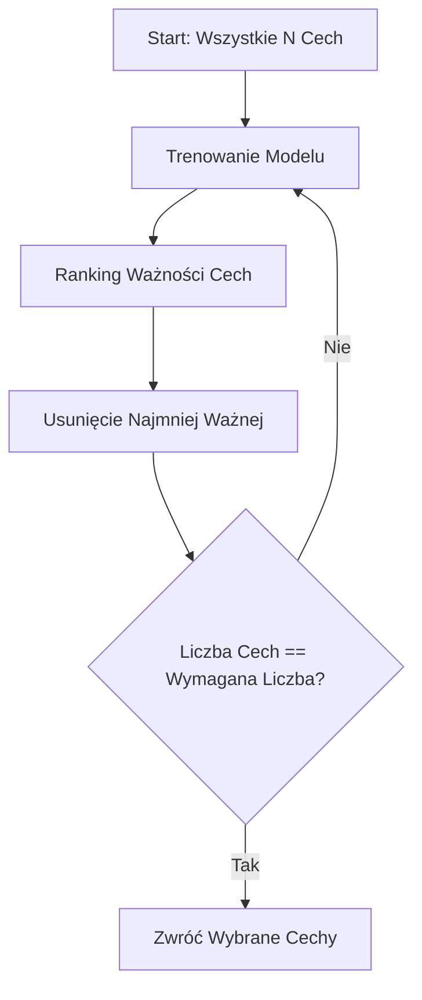
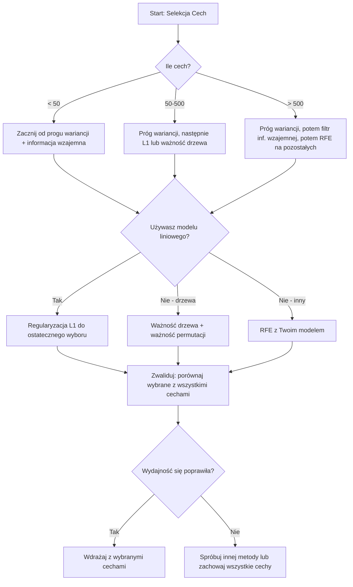

# Wybór cech (Feature Selection)

> Więcej cech nie znaczy lepiej. Odpowiednie cechy to jest to, co jest lepsze.

**Typ:** Budowa
**Język:** Python
**Wymagania wstępne:** Faza 2, Lekcje 01-09, 08 (inżynieria cech)
**Czas:** ~75 minut

## Cele nauczania

- Zaimplementowanie metod filtrujących (próg wariancji, informacja wzajemna, test chi-kwadrat) oraz metod opakowujących (RFE, selekcja w przód) od zera
- Wyjaśnienie, dlaczego informacja wzajemna wychwytuje nieliniowe relacje między cechą a zmienną docelową, które omija korelacja
- Porównanie regularyzacji L1 (metoda wbudowana) z RFE (metoda opakowująca) i ocena ich kompromisów obliczeniowych
- Zbudowanie potoku wyboru cech, który łączy wiele metod i demonstruje poprawę generalizacji na danych testowych

## Problem

Masz 500 cech. Twój model trenuje się powoli, nieustannie się przetrenowuje i nikt nie potrafi wyjaśnić, czego się nauczył. Dodajesz więcej cech w nadziei na poprawę wydajności. Sytuacja się pogarsza.

To jest "klątwa wymiarowości" w praktyce. Wraz ze wzrostem liczby cech, objętość przestrzeni cech eksploduje. Punkty danych stają się rozproszone. Odległości między punktami zbiegają się. Model potrzebuje wykładniczo więcej danych, aby znaleźć rzeczywiste wzorce. Cechy będące szumem zagłuszają cechy będące sygnałem. Przetrenowanie staje się domyślne.

Rozwiązaniem jest selekcja cech (feature selection). Odrzuć szum. Usuń nadmiarowość. Zachowaj cechy, które niosą rzeczywiste informacje o zmiennej docelowej. Rezultat: szybsze trenowanie, lepsza generalizacja i modele, które da się wyjaśnić.

Celem nie jest wykorzystanie wszystkich dostępnych informacji. Celem jest wykorzystanie właściwych informacji.

## Koncepcja

### Trzy kategorie metod selekcji cech

Każda metoda wyboru cech należy do jednej z trzech kategorii:



**Metody filtrujące (Filter methods)** oceniają każdą cechę niezależnie przy użyciu miar statystycznych. Nie wykorzystują one modelu. Są szybkie, ale nie dostrzegają interakcji między cechami.

**Metody opakowujące (Wrapper methods)** trenują model w celu oceny podzbiorów cech. Używają wydajności modelu jako oceny. Dają lepsze wyniki, ale są kosztowne pod względem obliczeniowym, ponieważ wymagają wielokrotnego przetrenowania modelu.

**Metody wbudowane (Embedded methods)** wybierają cechy jako część treningu modelu. Regularyzacja L1 sprowadza wagi do zera. Drzewa decyzyjne wykonują podziały na najbardziej użytecznych cechach. Wybór zachodzi podczas dopasowywania, a nie jako oddzielny krok.

### Próg wariancji (Variance Threshold)

Najprostszy filtr. Jeśli cecha ledwie się zmienia w różnych próbkach, nie niesie prawie żadnych informacji.

Rozważmy cechę, która ma wartość 0.0 dla 999 na 1000 próbek. Jej wariancja jest bliska zeru. Żaden model nie może jej użyć do rozróżnienia między klasami. Usuń ją.

```
variance(x) = mean((x - mean(x))^2)
```

Ustaw próg (np. 0.01). Odrzuć każdą cechę o wariancji poniżej niego. To usuwa stałe lub prawie stałe cechy bez sprawdzania zmiennej docelowej.

Kiedy używać: jako krok wstępnego przetwarzania przed innymi metodami. Wychwytuje oczywiście bezużyteczne cechy niemal bezkosztowo.

Ograniczenie: cecha może mieć wysoką wariancję i nadal być czystym szumem. Próg wariancji jest konieczny, ale niewystarczający.

### Informacja wzajemna (Mutual Information)

Informacja wzajemna mierzy, jak bardzo znajomość wartości cechy X zmniejsza niepewność co do zmiennej docelowej Y.

```
I(X; Y) = sum_x sum_y p(x, y) * log(p(x, y) / (p(x) * p(y)))
```

Jeśli X i Y są niezależne, p(x, y) = p(x) * p(y), więc wyrażenie pod logarytmem wynosi zero i I(X; Y) = 0. Im więcej X mówi ci o Y, tym wyższa informacja wzajemna.

Kluczowa przewaga nad korelacją: informacja wzajemna wychwytuje relacje nieliniowe. Cecha może mieć zerową korelację ze zmienną docelową, ale wysoką informację wzajemną, ponieważ relacja jest kwadratowa lub okresowa.

W przypadku cech ciągłych najpierw należy dokonać dyskretyzacji na koszyki (estymacja na bazie histogramu). Liczba koszyków wpływa na oszacowanie -- zbyt mało koszyków oznacza utratę informacji, zbyt wiele dodaje szum. Częsty wybór: sqrt(n) koszyków lub zasada Sturgesa (1 + log2(n)).


### Rekursywna Eliminacja Cech (RFE - Recursive Feature Elimination)

RFE jest metodą opakowującą. Używa własnej ważności cech modelu do iteracyjnego przycinania:

1. Wytrenuj model używając wszystkich cech
2. Uporządkuj cechy według ważności (współczynniki dla modeli liniowych, spadek zanieczyszczenia dla drzew)
3. Usuń najmniej ważną cechę (cechy)
4. Powtarzaj, aż pozostanie pożądana liczba cech



RFE uwzględnia interakcje cech, ponieważ model widzi wszystkie pozostałe cechy razem. Usunięcie jednej cechy zmienia ważność innych. To czyni ją bardziej dokładną niż metody filtrujące.

Koszt: trenujesz model N - target razy. Mając 500 cech i cel 10, oznacza to 490 przebiegów treningowych. W przypadku kosztownych modeli jest to powolne. Możesz to przyspieszyć, usuwając wiele cech w każdym kroku (np. usuń dolne 10% w każdej rundzie).

### Regularyzacja L1 (Lasso)

Regularyzacja L1 dodaje wartość bezwzględną wag do funkcji straty:

```
loss = prediction_error + alpha * sum(|w_i|)
```

Parametr alpha kontroluje, jak agresywnie cechy są przycinane. Wyższe alpha oznacza, że więcej wag staje się dokładnie równych zeru.

Dlaczego dokładnie zero? Kara L1 tworzy obszar ograniczeń w kształcie rombu w przestrzeni wag. Optymalne rozwiązanie ma tendencję do lądowania w rogu tego rombu, gdzie jedna lub więcej wag wynosi zero. Regularyzacja L2 (ridge) tworzy okrągłe ograniczenie, gdzie wagi maleją, ale rzadko osiągają zero.

Jest to wbudowana selekcja cech: model dowiaduje się podczas treningu, które cechy ignorować. Cechy o zerowej wadze są skutecznie usuwane.

Zalety: pojedynczy przebieg treningowy, obsługuje skorelowane cechy (wybiera jedną i zeruje pozostałe), wbudowane w większość implementacji modeli liniowych.

Ograniczenie: działa tylko z modelami liniowymi. Nie jest w stanie uchwycić nieliniowej ważności cech.

### Ważność Cech na Bazie Drzew (Tree-Based Feature Importance)

Drzewa decyzyjne i ich zespoły (lasy losowe, wzmacnianie gradientowe - gradient boosting) naturalnie klasyfikują cechy. Każdy podział zmniejsza zanieczyszczenie (Gini lub entropia dla klasyfikacji, wariancja dla regresji). Cechy, które powodują większe spadki zanieczyszczenia, są ważniejsze.

Dla lasu losowego z T drzewami:

```
importance(feature_j) = (1/T) * sum po wszystkich drzewach (
    sum po wszystkich węzłach dzielących wg feature_j (
        (n_samples * impurity_decrease)
    )
)
```

Daje to znormalizowany wynik ważności dla każdej cechy. Automatycznie obsługuje relacje nieliniowe i interakcje cech.

Ostrzeżenie: ważność na bazie drzew jest ukierunkowana na cechy o wielu unikalnych wartościach (wysoka kardynalność). Losowa kolumna z ID wydawałaby się ważna, ponieważ idealnie dzieli każdą próbkę. Użyj ważności na podstawie permutacji (permutation importance) jako kontroli poprawności.

### Ważność na Podstawie Permutacji (Permutation Importance)

Metoda niezależna od modelu:

1. Wytrenuj model i zanotuj podstawową wydajność na danych walidacyjnych
2. Dla każdej cechy: wymieszaj jej wartości losowo, zmierz spadek wydajności
3. Im większy spadek, tym ważniejsza jest cecha

Jeśli wymieszanie cechy nie obniża wydajności, model na niej nie polega. Jeśli wydajność drastycznie spada, ta cecha jest krytyczna.

Ważność na podstawie permutacji unika błędu kardynalności występującego w ważności opartej na drzewach. Ale jest wolna: jedna pełna ocena na cechę, powtarzana wielokrotnie w celu zapewnienia stabilności.

### Tabela Porównawcza

| Metoda | Typ | Szybkość | Nieliniowość | Interakcje Cech |
|--------|------|-------|-----------|---------------------|
| Próg wariancji | Filtrująca | Bardzo szybka | Nie | Nie |
| Informacja wzajemna | Filtrująca | Szybka | Tak | Nie |
| Filtr korelacji | Filtrująca | Szybka | Nie | Nie |
| RFE | Opakowująca | Wolna | Zależy od modelu | Tak |
| L1 / Lasso | Wbudowana | Szybka | Nie (liniowa) | Nie |
| Ważność drzewa | Wbudowana | Średnia | Tak | Tak |
| Ważność permutacji | Niezależna od modelu | Wolna | Tak | Tak |

### Schemat Blokowy Decyzji



## Zbuduj To

### Krok 1: Wygeneruj syntetyczne dane ze znaną strukturą cech

```python
import numpy as np


def make_feature_selection_data(n_samples=500, seed=42):
    rng = np.random.RandomState(seed)

    x1 = rng.randn(n_samples)
    x2 = rng.randn(n_samples)
    x3 = rng.randn(n_samples)
    x4 = x1 + 0.1 * rng.randn(n_samples)
    x5 = x2 + 0.1 * rng.randn(n_samples)

    informative = np.column_stack([x1, x2, x3, x4, x5])

    correlated = np.column_stack([
        x1 * 0.9 + 0.1 * rng.randn(n_samples),
        x2 * 0.8 + 0.2 * rng.randn(n_samples),
        x3 * 0.7 + 0.3 * rng.randn(n_samples),
        x1 * 0.5 + x2 * 0.5 + 0.1 * rng.randn(n_samples),
        x2 * 0.6 + x3 * 0.4 + 0.1 * rng.randn(n_samples),
    ])

    noise = rng.randn(n_samples, 10) * 0.5

    X = np.hstack([informative, correlated, noise])
    y = (2 * x1 - 1.5 * x2 + x3 + 0.5 * rng.randn(n_samples) > 0).astype(int)

    feature_names = (
        [f"info_{i}" for i in range(5)]
        + [f"corr_{i}" for i in range(5)]
        + [f"noise_{i}" for i in range(10)]
    )

    return X, y, feature_names
```

Znamy prawdę absolutną: cechy 0-4 są informatywne (plus 3 i 4 są skorelowanymi kopiami 0 i 1), cechy 5-9 są skorelowane z cechami informatywnymi, cechy 10-19 to czysty szum. Dobra metoda selekcji powinna dać cechom 0-4 najwyższe miejsca, a 10-19 najniższe.

### Krok 2: Próg wariancji

```python
def variance_threshold(X, threshold=0.01):
    variances = np.var(X, axis=0)
    mask = variances > threshold
    return mask, variances
```

### Krok 3: Informacja wzajemna (dyskretna)

```python
def discretize(x, n_bins=10):
    min_val, max_val = x.min(), x.max()
    if max_val == min_val:
        return np.zeros_like(x, dtype=int)
    bin_edges = np.linspace(min_val, max_val, n_bins + 1)
    binned = np.digitize(x, bin_edges[1:-1])
    return binned


def mutual_information(X, y, n_bins=10):
    n_samples, n_features = X.shape
    mi_scores = np.zeros(n_features)

    y_vals, y_counts = np.unique(y, return_counts=True)
    p_y = y_counts / n_samples

    for f in range(n_features):
        x_binned = discretize(X[:, f], n_bins)
        x_vals, x_counts = np.unique(x_binned, return_counts=True)
        p_x = dict(zip(x_vals, x_counts / n_samples))

        mi = 0.0
        for xv in x_vals:
            for yi, yv in enumerate(y_vals):
                joint_mask = (x_binned == xv) & (y == yv)
                p_xy = np.sum(joint_mask) / n_samples
                if p_xy > 0:
                    mi += p_xy * np.log(p_xy / (p_x[xv] * p_y[yi]))
        mi_scores[f] = mi

    return mi_scores
```

### Krok 4: Rekursywna Eliminacja Cech (RFE)

```python
def simple_logistic_importance(X, y, lr=0.1, epochs=100):
    n_samples, n_features = X.shape
    w = np.zeros(n_features)
    b = 0.0

    for _ in range(epochs):
        z = X @ w + b
        pred = 1.0 / (1.0 + np.exp(-np.clip(z, -500, 500)))
        error = pred - y
        w -= lr * (X.T @ error) / n_samples
        b -= lr * np.mean(error)

    return w, b


def rfe(X, y, n_features_to_select=5, lr=0.1, epochs=100):
    n_total = X.shape[1]
    remaining = list(range(n_total))
    rankings = np.ones(n_total, dtype=int)
    rank = n_total

    while len(remaining) > n_features_to_select:
        X_subset = X[:, remaining]
        w, _ = simple_logistic_importance(X_subset, y, lr, epochs)
        importances = np.abs(w)

        least_idx = np.argmin(importances)
        original_idx = remaining[least_idx]
        rankings[original_idx] = rank
        rank -= 1
        remaining.pop(least_idx)

    for idx in remaining:
        rankings[idx] = 1

    selected_mask = rankings == 1
    return selected_mask, rankings
```

### Krok 5: Wybór cech za pomocą L1

```python
def soft_threshold(w, alpha):
    return np.sign(w) * np.maximum(np.abs(w) - alpha, 0)


def l1_feature_selection(X, y, alpha=0.1, lr=0.01, epochs=500):
    n_samples, n_features = X.shape
    w = np.zeros(n_features)
    b = 0.0

    for _ in range(epochs):
        z = X @ w + b
        pred = 1.0 / (1.0 + np.exp(-np.clip(z, -500, 500)))
        error = pred - y

        gradient_w = (X.T @ error) / n_samples
        gradient_b = np.mean(error)

        w -= lr * gradient_w
        w = soft_threshold(w, lr * alpha)
        b -= lr * gradient_b

    selected_mask = np.abs(w) > 1e-6
    return selected_mask, w
```

### Krok 6: Ważność na bazie drzew (proste drzewo decyzyjne)

```python
def gini_impurity(y):
    if len(y) == 0:
        return 0.0
    classes, counts = np.unique(y, return_counts=True)
    probs = counts / len(y)
    return 1.0 - np.sum(probs ** 2)


def best_split(X, y, feature_idx):
    values = np.unique(X[:, feature_idx])
    if len(values) <= 1:
        return None, -1.0

    best_threshold = None
    best_gain = -1.0
    parent_gini = gini_impurity(y)
    n = len(y)

    for i in range(len(values) - 1):
        threshold = (values[i] + values[i + 1]) / 2.0
        left_mask = X[:, feature_idx] <= threshold
        right_mask = ~left_mask

        n_left = np.sum(left_mask)
        n_right = np.sum(right_mask)

        if n_left == 0 or n_right == 0:
            continue

        gain = parent_gini - (n_left / n) * gini_impurity(y[left_mask]) - (n_right / n) * gini_impurity(y[right_mask])

        if gain > best_gain:
            best_gain = gain
            best_threshold = threshold

    return best_threshold, best_gain


def tree_importance(X, y, n_trees=50, max_depth=5, seed=42):
    rng = np.random.RandomState(seed)
    n_samples, n_features = X.shape
    importances = np.zeros(n_features)

    for _ in range(n_trees):
        sample_idx = rng.choice(n_samples, size=n_samples, replace=True)
        feature_subset = rng.choice(n_features, size=max(1, int(np.sqrt(n_features))), replace=False)

        X_boot = X[sample_idx]
        y_boot = y[sample_idx]

        tree_imp = _build_tree_importance(X_boot, y_boot, feature_subset, max_depth)
        importances += tree_imp

    total = importances.sum()
    if total > 0:
        importances /= total

    return importances


def _build_tree_importance(X, y, feature_subset, max_depth, depth=0):
    n_features = X.shape[1]
    importances = np.zeros(n_features)

    if depth >= max_depth or len(np.unique(y)) <= 1 or len(y) < 4:
        return importances

    best_feature = None
    best_threshold = None
    best_gain = -1.0

    for f in feature_subset:
        threshold, gain = best_split(X, y, f)
        if gain > best_gain:
            best_gain = gain
            best_feature = f
            best_threshold = threshold

    if best_feature is None or best_gain <= 0:
        return importances

    importances[best_feature] += best_gain * len(y)

    left_mask = X[:, best_feature] <= best_threshold
    right_mask = ~left_mask

    importances += _build_tree_importance(X[left_mask], y[left_mask], feature_subset, max_depth, depth + 1)
    importances += _build_tree_importance(X[right_mask], y[right_mask], feature_subset, max_depth, depth + 1)

    return importances
```

### Krok 7: Uruchom wszystkie metody i porównaj

Plik z kodem uruchamia wszystkie pięć metod na tym samym syntetycznym zbiorze danych i drukuje tabelę porównawczą pokazującą, które cechy wybiera każda z metod.

## Użyj Tego

W scikit-learn wybór cech jest wbudowany w potok (pipeline):

```python
from sklearn.feature_selection import (
    VarianceThreshold,
    mutual_info_classif,
    RFE,
    SelectFromModel,
)
from sklearn.linear_model import Lasso, LogisticRegression
from sklearn.ensemble import RandomForestClassifier

vt = VarianceThreshold(threshold=0.01)
X_filtered = vt.fit_transform(X)

mi_scores = mutual_info_classif(X, y)
top_k = np.argsort(mi_scores)[-10:]

rfe_selector = RFE(LogisticRegression(), n_features_to_select=10)
rfe_selector.fit(X, y)
X_rfe = rfe_selector.transform(X)

lasso_selector = SelectFromModel(Lasso(alpha=0.01))
lasso_selector.fit(X, y)
X_lasso = lasso_selector.transform(X)

rf = RandomForestClassifier(n_estimators=100)
rf.fit(X, y)
importances = rf.feature_importances_
```

Implementacje od zera pokazują dokładnie, co dzieje się wewnątrz każdej metody. Próg wariancji to po prostu obliczenie `var(X, axis=0)` i zastosowanie maski. Informacja wzajemna to zliczanie częstości wspólnych i brzegowych w tablicy kontyngencji. RFE to pętla, która trenuje, klasyfikuje i przycina. L1 to spadek gradientowy z krokiem "miękkiego progowania" (soft-thresholding). Ważność na bazie drzew akumuluje redukcje zanieczyszczeń poprzez podziały. Żadnej magii -- tylko statystyka i pętle.

Wersje sklearn dodają niezawodność (np. `mutual_info_classif` wykorzystuje estymację gęstości k-NN zamiast tworzenia koszyków), szybkość (implementacje w C) i integrację z potokiem.

## Wdrażaj

Ta lekcja tworzy:
- `outputs/skill-feature-selector.md` -- podręczne drzewo decyzyjne do wyboru odpowiedniej metody selekcji cech

## Ćwiczenia

1. **Selekcja w przód (Forward selection)**: zaimplementuj przeciwieństwo RFE. Zacznij od zera cech. W każdym kroku dodaj cechę, która najbardziej poprawia wydajność modelu. Zatrzymaj się, gdy dodawanie cech nie przynosi już poprawy. Porównaj wybrane cechy z wynikami RFE. Co jest szybsze? Co daje lepsze rezultaty?

2. **Selekcja stabilna (Stability selection)**: uruchom selekcję cech L1 50 razy, za każdym razem na losowej 80% podpróbce danych, z nieco innymi wartościami alfa. Policz, jak często wybierana jest każda cecha. Cechy wybrane w > 80% przebiegów są "stabilne". Porównaj stabilne cechy z selekcją L1 z pojedynczego przebiegu. Co jest bardziej niezawodne?

3. **Wykrywanie współliniowości (Multicollinearity detection)**: oblicz macierz korelacji dla wszystkich cech. Zaimplementuj funkcję, która dla danego progu korelacji (np. 0.9) usuwa jedną cechę z każdej silnie skorelowanej pary (zachowując tę o wyższej informacji wzajemnej ze zmienną docelową). Przetestuj na syntetycznym zbiorze danych i sprawdź, czy usuwa nadmiarowe, skorelowane cechy.

4. **Potok wyboru cech (Feature selection pipeline)**: połącz próg wariancji, filtr informacji wzajemnej i RFE w jeden potok. Najpierw usuń cechy o wariancji bliskiej zeru, następnie zachowaj górne 50% według informacji wzajemnej, a następnie uruchom RFE na ocalałych. Porównaj ten potok z uruchomieniem RFE na wszystkich cechach. Czy potok jest szybszy? Czy jest równie dokładny?

5. **Ważność permutacji od zera**: zaimplementuj ważność na podstawie permutacji. Dla każdej cechy wymieszaj jej wartości 10 razy, zmierz średni spadek wyniku F1. Porównaj ranking z ważnością na bazie drzew. Znajdź przypadki, w których się nie zgadzają, i wyjaśnij dlaczego (wskazówka: skorelowane cechy).

## Kluczowe pojęcia

| Termin | Co mówią ludzie | Co to właściwie oznacza |
|------|----------------|----------------------|
| Metoda filtrująca (Filter method) | "Ocenianie cech niezależnie" | Podejście do wyboru cech, które klasyfikuje cechy za pomocą miary statystycznej bez trenowania modelu, oceniając każdą cechę w izolacji |
| Metoda opakowująca (Wrapper method) | "Wykorzystanie modelu do wyboru cech" | Podejście do selekcji cech, które ocenia podzbiory cech poprzez trenowanie modelu i używanie jego wydajności jako kryterium wyboru |
| Metoda wbudowana (Embedded method) | "Model wybiera cechy podczas trenowania" | Wybór cech, który odbywa się jako część dopasowywania modelu, np. regularyzacja L1 sprowadzająca wagi do zera |
| Informacja wzajemna (Mutual information) | "Ile jedna zmienna mówi o innej" | Miara redukcji niepewności co do Y przy znajomości X, wychwytująca zależności liniowe i nieliniowe |
| Rekursywna Eliminacja Cech (RFE) | "Trenuj, klasyfikuj, przycinaj, powtarzaj" | Iteracyjna metoda opakowująca, która trenuje model, usuwa najmniej ważną cechę (cechy) i powtarza to do osiągnięcia docelowej liczby |
| Regularyzacja L1 / Lasso | "Kara, która zabija cechy" | Dodanie sumy bezwzględnych wartości wag do funkcji straty, co powoduje zrównanie wag mało ważnych cech z dokładnie zerem |
| Próg wariancji (Variance threshold) | "Usuń stałe cechy" | Odrzucenie cech, których wariancja w próbkach spada poniżej określonego progu, odfiltrowując cechy nieniosące żadnych informacji |
| Ważność cech (Feature importance) | "Które cechy mają największe znaczenie" | Wynik wskazujący, jak bardzo każda cecha przyczynia się do przewidywań modelu, obliczany z zysków podziału (drzewa) lub wielkości współczynników (modele liniowe) |
| Ważność permutacji (Permutation importance) | "Wymieszaj i zmierz szkody" | Ocena ważności cechy poprzez losowe tasowanie wartości każdej cechy i pomiar wynikowego spadku wydajności modelu |
| Klątwa wymiarowości (Curse of dimensionality) | "Zbyt wiele cech, za mało danych" | Zjawisko, w którym dodawanie cech zwiększa objętość przestrzeni cech wykładniczo, sprawiając, że dane stają się rzadkie, a odległości tracą sens |

## Dalsza lektura

- [An Introduction to Variable and Feature Selection (Guyon & Elisseeff, 2003)](https://jmlr.org/papers/v3/guyon03a.html) -- podstawowy przegląd metod wyboru cech, do którego wciąż często się odwołuje
- [scikit-learn Feature Selection Guide](https://scikit-learn.org/stable/modules/feature_selection.html) -- praktyczne źródło wiedzy o metodach filtrujących, opakowujących i wbudowanych z przykładami kodu
- [Stability Selection (Meinshausen & Buhlmann, 2010)](https://arxiv.org/abs/0809.2932) -- łączy dobór podpróbek z wyborem cech dla solidnych, powtarzalnych wyników
- [Beware Default Random Forest Importances (Strobl et al., 2007)](https://bmcbioinformatics.biomedcentral.com/articles/10.1186/1471-2105-8-25) -- demonstruje problem z biasem kardynalności w domyślnej ważności drzew i proponuje jako alternatywę warunkową ważność