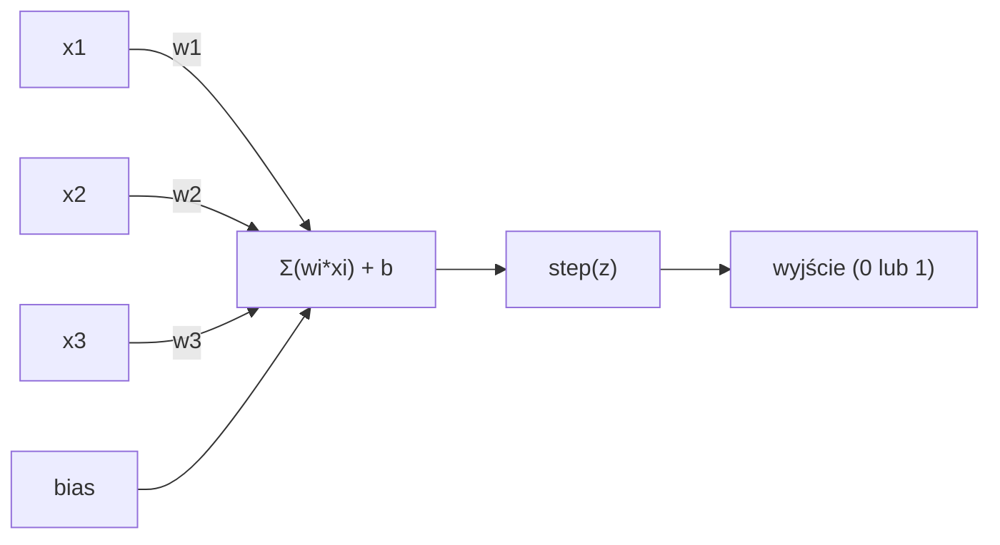
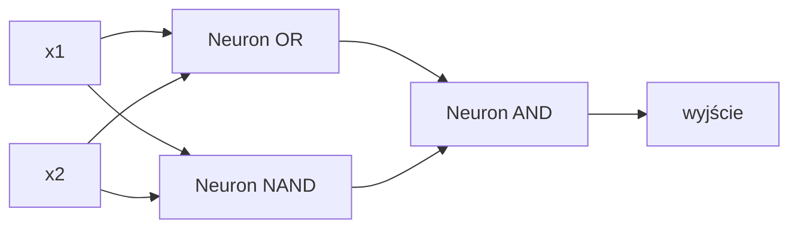

# Perceptron

> Perceptron to atom sieci neuronowych. Rozbij go na części, a znajdziesz wagi, obciążenie (bias) i decyzję.

**Typ:** Budowa
**Języki:** Python
**Wymagania wstępne:** Faza 1 (Intuicja Algebry Liniowej)
**Czas:** ~60 minut

## Cele nauczania

- Zaimplementowanie perceptronu od zera w Pythonie, w tym reguły aktualizacji wag i skokowej funkcji aktywacji
- Wyjaśnienie, dlaczego pojedynczy perceptron może rozwiązać tylko problemy liniowo separowalne oraz zaprezentowanie błędu dla problemu XOR
- Zbudowanie wielowarstwowego perceptronu (MLP) poprzez złożenie bramek OR, NAND i AND do rozwiązania problemu XOR
- Wytrenowanie dwuwarstwowej sieci z sigmoidalną funkcją aktywacji i algorytmem wstecznej propagacji (backpropagation) do automatycznego nauczenia się funkcji XOR

## Problem

Znasz wektory i iloczyny skalarne. Wiesz, że macierz przekształca wejścia na wyjścia. Ale w jaki sposób maszyna *uczy się*, którego przekształcenia użyć?

Perceptron odpowiada na to pytanie. Jest to najprostsza możliwa maszyna ucząca się: weź kilka wejść, pomnóż przez wagi, dodaj obciążenie (bias) i podejmij binarną decyzję. Następnie dostosuj. To wszystko. Każda sieć neuronowa, jaka kiedykolwiek powstała, to warstwy tego pomysłu ułożone jedna na drugiej.

Zrozumienie perceptronu oznacza zrozumienie, czym w rzeczywistości jest "uczenie się" w kodzie: dostosowywaniem liczb, aż wynik zacznie pasować do rzeczywistości.

## Koncepcja

### Jeden Neuron, Jedna Decyzja

Perceptron pobiera *n* wejść, mnoży każde przez wagę, sumuje je, dodaje obciążenie (bias) i przepuszcza wynik przez funkcję aktywacji.



Funkcja skokowa jest brutalna: jeśli suma ważona plus obciążenie (bias) jest >= 0, wypisuje 1. W przeciwnym razie, wypisuje 0.

```
step(z) = 1  jeśli z >= 0
           0  jeśli z < 0
```

Jest to klasyfikator liniowy. Wagi i bias definiują linię (lub hiperpłaszczyznę w wyższych wymiarach), która dzieli przestrzeń wejściową na dwa obszary.

### Granica Decyzyjna

Dla dwóch wejść perceptron rysuje linię w przestrzeni 2D:

```
  x2
  ┤
  │  Klasa 1        /
  │    (0)          /
  │                /
  │               / w1·x1 + w2·x2 + b = 0
  │              /
  │             /     Klasa 2
  │            /        (1)
  ┼───────────/──────────── x1
```

Wszystko po jednej stronie linii wyprowadza 0. Wszystko po drugiej stronie wyprowadza 1. Trening przesuwa tę linię, aż poprawnie oddzieli klasy.

### Reguła uczenia się

Reguła uczenia się perceptronu jest prosta:

```
Dla każdego przykładu treningowego (x, y_true):
    y_pred = predict(x)
    error = y_true - y_pred

    Dla każdej wagi:
        w_i = w_i + learning_rate * error * x_i
    bias = bias + learning_rate * error
```

Jeśli przewidywanie jest poprawne, błąd = 0, nic się nie zmienia. Jeśli model przewiduje 0, ale powinno być 1, wagi rosną. Jeśli przewiduje 1, ale powinno być 0, wagi maleją. Współczynnik uczenia się (learning rate) kontroluje, jak duża jest każda korekta.

### Problem XOR

Tutaj metoda się załamuje. Spójrz na te bramki logiczne:

```
Bramka AND:         Bramka OR:          Bramka XOR:
x1  x2  out         x1  x2  out         x1  x2  out
0   0   0           0   0   0           0   0   0
0   1   0           0   1   1           0   1   1
1   0   0           1   0   1           1   0   1
1   1   1           1   1   1           1   1   0
```

AND i OR są separowalne liniowo: można narysować pojedynczą linię oddzielającą 0 od 1. XOR taki nie jest. Żadna pojedyncza linia nie może oddzielić [0,1] i [1,0] od [0,0] i [1,1].

```
AND (separowalny):      XOR (nieseparowalny):

  x2                      x2
  1 ┤  0     1            1 ┤  1     0
    │     /                 │
  0 ┤  0 / 0              0 ┤  0     1
    ┼──/──────── x1         ┼──────────── x1
       linia działa!         żadna pojedyncza linia nie zadziała!
```

To jest fundamentalne ograniczenie. Pojedynczy perceptron może rozwiązać tylko problemy liniowo separowalne. Minsky i Papert udowodnili to w 1969 roku i prawie zabiło to badania nad sieciami neuronowymi na dekadę.

Rozwiązanie: nakładać perceptrony w warstwy. Wielowarstwowy perceptron (MLP) może rozwiązać XOR poprzez połączenie dwóch decyzji liniowych w jedną nieliniową.

## Zbuduj to

### Krok 1: Klasa Perceptron

```python
class Perceptron:
    def __init__(self, n_inputs, learning_rate=0.1):
        self.weights = [0.0] * n_inputs
        self.bias = 0.0
        self.lr = learning_rate

    def predict(self, inputs):
        total = sum(w * x for w, x in zip(self.weights, inputs))
        total += self.bias
        return 1 if total >= 0 else 0

    def train(self, training_data, epochs=100):
        for epoch in range(epochs):
            errors = 0
            for inputs, target in training_data:
                prediction = self.predict(inputs)
                error = target - prediction
                if error != 0:
                    errors += 1
                    for i in range(len(self.weights)):
                        self.weights[i] += self.lr * error * inputs[i]
                    self.bias += self.lr * error
            if errors == 0:
                print(f"Converged at epoch {epoch + 1}")
                return
        print(f"Did not converge after {epochs} epochs")
```

### Krok 2: Uczenie bramek logicznych

```python
and_data = [
    ([0, 0], 0),
    ([0, 1], 0),
    ([1, 0], 0),
    ([1, 1], 1),
]

or_data = [
    ([0, 0], 0),
    ([0, 1], 1),
    ([1, 0], 1),
    ([1, 1], 1),
]

not_data = [
    ([0], 1),
    ([1], 0),
]

print("=== Bramka AND ===")
p_and = Perceptron(2)
p_and.train(and_data)
for inputs, _ in and_data:
    print(f"  {inputs} -> {p_and.predict(inputs)}")

print("\n=== Bramka OR ===")
p_or = Perceptron(2)
p_or.train(or_data)
for inputs, _ in or_data:
    print(f"  {inputs} -> {p_or.predict(inputs)}")

print("\n=== Bramka NOT ===")
p_not = Perceptron(1)
p_not.train(not_data)
for inputs, _ in not_data:
    print(f"  {inputs} -> {p_not.predict(inputs)}")
```

### Krok 3: Obserwuj błąd z XOR

```python
xor_data = [
    ([0, 0], 0),
    ([0, 1], 1),
    ([1, 0], 1),
    ([1, 1], 0),
]

print("\n=== Bramka XOR (pojedynczy perceptron) ===")
p_xor = Perceptron(2)
p_xor.train(xor_data, epochs=1000)
for inputs, expected in xor_data:
    result = p_xor.predict(inputs)
    status = "OK" if result == expected else "WRONG"
    print(f"  {inputs} -> {result} (expected {expected}) {status}")
```

Nigdy nie zbiegnie do poprawnego rozwiązania. To twardy dowód na to, że pojedynczy perceptron nie jest w stanie nauczyć się operacji XOR.

### Krok 4: Rozwiąż XOR za pomocą dwóch warstw

Sposób: XOR = (x1 OR x2) AND NOT (x1 AND x2). Połącz trzy perceptrony:



```python
def xor_network(x1, x2):
    or_neuron = Perceptron(2)
    or_neuron.weights = [1.0, 1.0]
    or_neuron.bias = -0.5

    nand_neuron = Perceptron(2)
    nand_neuron.weights = [-1.0, -1.0]
    nand_neuron.bias = 1.5

    and_neuron = Perceptron(2)
    and_neuron.weights = [1.0, 1.0]
    and_neuron.bias = -1.5

    hidden1 = or_neuron.predict([x1, x2])
    hidden2 = nand_neuron.predict([x1, x2])
    output = and_neuron.predict([hidden1, hidden2])
    return output


print("\n=== Bramka XOR (sieć wielowarstwowa) ===")
for inputs, expected in xor_data:
    result = xor_network(inputs[0], inputs[1])
    print(f"  {inputs} -> {result} (expected {expected})")
```

Wszystkie cztery przypadki są prawidłowe. Układanie perceptronów w warstwy tworzy granice decyzyjne, których nie może wytworzyć żaden pojedynczy perceptron.

### Krok 5: Trenowanie sieci dwuwarstwowej

W kroku 4 wagi połączono "ręcznie". Działa to dla XOR, ale nie dla rzeczywistych problemów, gdzie poprawnych wag nie znamy z góry. Rozwiązanie: zamień funkcję skokową na sigmoidalną i ucz się wag automatycznie poprzez propagację wsteczną.

```python
class TwoLayerNetwork:
    def __init__(self, learning_rate=0.5):
        import random
        random.seed(0)
        self.w_hidden = [[random.uniform(-1, 1), random.uniform(-1, 1)] for _ in range(2)]
        self.b_hidden = [random.uniform(-1, 1), random.uniform(-1, 1)]
        self.w_output = [random.uniform(-1, 1), random.uniform(-1, 1)]
        self.b_output = random.uniform(-1, 1)
        self.lr = learning_rate

    def sigmoid(self, x):
        import math
        x = max(-500, min(500, x))
        return 1.0 / (1.0 + math.exp(-x))

    def forward(self, inputs):
        self.inputs = inputs
        self.hidden_outputs = []
        for i in range(2):
            z = sum(w * x for w, x in zip(self.w_hidden[i], inputs)) + self.b_hidden[i]
            self.hidden_outputs.append(self.sigmoid(z))
        z_out = sum(w * h for w, h in zip(self.w_output, self.hidden_outputs)) + self.b_output
        self.output = self.sigmoid(z_out)
        return self.output

    def train(self, training_data, epochs=10000):
        for epoch in range(epochs):
            total_error = 0
            for inputs, target in training_data:
                output = self.forward(inputs)
                error = target - output
                total_error += error ** 2

                d_output = error * output * (1 - output)

                saved_w_output = self.w_output[:]
                hidden_deltas = []
                for i in range(2):
                    h = self.hidden_outputs[i]
                    hd = d_output * saved_w_output[i] * h * (1 - h)
                    hidden_deltas.append(hd)

                for i in range(2):
                    self.w_output[i] += self.lr * d_output * self.hidden_outputs[i]
                self.b_output += self.lr * d_output

                for i in range(2):
                    for j in range(len(inputs)):
                        self.w_hidden[i][j] += self.lr * hidden_deltas[i] * inputs[j]
                    self.b_hidden[i] += self.lr * hidden_deltas[i]
```

```python
net = TwoLayerNetwork(learning_rate=2.0)
net.train(xor_data, epochs=10000)
for inputs, expected in xor_data:
    result = net.forward(inputs)
    predicted = 1 if result >= 0.5 else 0
    print(f"  {inputs} -> {result:.4f} (rounded: {predicted}, expected {expected})")
```

Dwie kluczowe różnice w stosunku do kroku 4. Po pierwsze, funkcja sigmoid zastępuje funkcję skokową -- jest gładka, więc istnieją gradienty. Po drugie, metoda `train` propaguje błąd wstecz od wyjścia do warstwy ukrytej, dostosowując każdą wagę proporcjonalnie do jej wkładu w błąd. To jest propagacja wsteczna (backpropagation) w 20 linijkach.

To jest most do Lekcji 03. Matematyka kryjąca się za `d_output` i `hidden_deltas` to reguła łańcuchowa zastosowana do grafu sieci. Dokładnie wyprowadzimy to właśnie tam.

## Użyj tego

Wszystko, co właśnie zbudowałeś od zera, występuje po jednym imporcie:

```python
from sklearn.linear_model import Perceptron as SkPerceptron
import numpy as np

X = np.array([[0,0],[0,1],[1,0],[1,1]])
y = np.array([0, 0, 0, 1])

clf = SkPerceptron(max_iter=100, tol=1e-3)
clf.fit(X, y)
print([clf.predict([x])[0] for x in X])
```

Pięć linii. Twoja 30-liniowa klasa `Perceptron` robi to samo. Wersja z sklearn dodaje sprawdzanie zbieżności, wiele funkcji straty i obsługę rzadkich danych wejściowych -- ale główna pętla jest identyczna: suma ważona, funkcja skokowa, aktualizacja wag na podstawie błędu.

Prawdziwa różnica pojawia się przy dużej skali. Co zmienia się w sieciach produkcyjnych:

- Funkcja skokowa staje się sigmoidalną, ReLU lub inną gładką aktywacją
- Wagi są uczone automatycznie poprzez propagację wsteczną (Lekcja 03)
- Warstwy stają się głębsze: 3, 10, ponad 100 warstw
- Główna zasada pozostaje taka sama: każda warstwa tworzy nowe cechy z wyjść poprzedniej warstwy

Pojedynczy perceptron może rysować tylko linie proste. Złóż je razem, a będziesz mógł narysować dowolny kształt.

## Wdrażaj

Ta lekcja tworzy:
- `outputs/skill-perceptron.md` - umiejętność opisującą, kiedy potrzebne są architektury jednowarstwowe w porównaniu do wielowarstwowych

## Ćwiczenia

1. Wytrenuj perceptron na bramce NAND (uniwersalna bramka logiczna - każdy obwód logiczny może być zbudowany z NAND). Sprawdź, czy jego wagi i bias tworzą prawidłową granicę decyzyjną.
2. Zmodyfikuj klasę Perceptron, aby śledzić granicę decyzyjną (w1*x1 + w2*x2 + b = 0) w każdej epoce. Wydrukuj, jak linia przesuwa się podczas uczenia bramki AND.
3. Zbuduj perceptron z 3 wejściami, który wyprowadza 1 tylko wtedy, gdy co najmniej 2 z 3 wejść wynoszą 1 (funkcja głosowania większościowego). Czy jest to liniowo separowalne? Dlaczego?

## Kluczowe pojęcia

| Termin | Co mówią ludzie | Co to właściwie oznacza |
|------|----------------|----------------------|
| Perceptron | "Sztuczny neuron" | Klasyfikator liniowy: iloczyn skalarny wejść i wag, plus obciążenie, przez funkcję skokową |
| Waga (Weight) | "Jak ważne jest wejście" | Mnożnik skalujący udział każdego wejścia w decyzji |
| Obciążenie (Bias) | "Próg" | Stała, która przesuwa granicę decyzyjną, pozwalając perceptronowi wystrzelić (aktywować się) nawet przy zerowych wejściach |
| Funkcja aktywacji | "Coś, co kompresuje wartości" | Funkcja stosowana po sumie ważonej - funkcja skokowa dla perceptronów, sigmoid/ReLU dla współczesnych sieci |
| Separowalne liniowo | "Możesz między nimi narysować linię" | Zbiór danych, w którym pojedyncza hiperpłaszczyzna może idealnie rozdzielić klasy |
| Problem XOR | "Rzecz, której perceptrony nie potrafią zrobić" | Dowód na to, że jednowarstwowe sieci nie potrafią nauczyć się funkcji, które nie są liniowo separowalne |
| Granica decyzyjna | "Miejsce, gdzie klasyfikator zmienia zdanie" | Hiperpłaszczyzna w*x + b = 0 dzieląca przestrzeń wejściową na dwie klasy |
| Perceptron wielowarstwowy | "Prawdziwa sieć neuronowa" | Perceptrony ułożone w warstwy, gdzie wyjście każdej warstwy zasila wejście następnej |

## Dalsza lektura

- Frank Rosenblatt, "The Perceptron: A Probabilistic Model for Information Storage and Organization in the Brain" (1958) -- oryginalna publikacja, która dała początek wszystkiemu
- Minsky & Papert, "Perceptrons" (1969) -- książka, która dowiodła, że XOR był nierozwiązywalny przez jednowarstwowe sieci i zamroziła badania nad perceptronem na dekadę
- Michael Nielsen, "Neural Networks and Deep Learning", Rozdział 1 (http://neuralnetworksanddeeplearning.com/) -- darmowe wydanie online, najlepsze wizualne wyjaśnienie tego, w jaki sposób perceptrony składają się w sieci