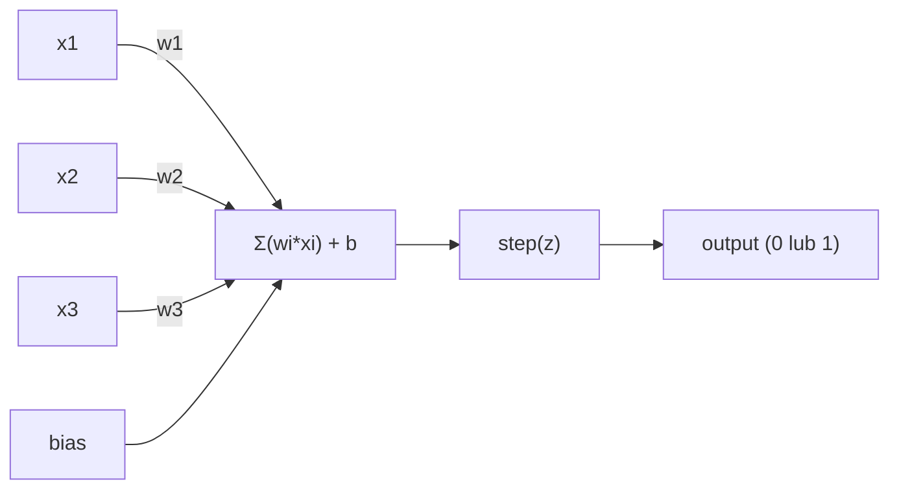
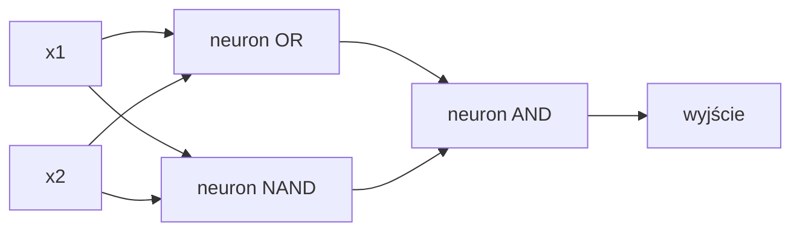

# Perceptron

> Perceptron to atom sieci neuronowych. Rozłóż go na części i znajdziesz wagi, bias i decyzję.

**Typ:** Build
**Języki:** Python
**Wymagania wstępne:** Faza 1 (Intuicja algebry liniowej)
**Czas:** ~60 minut

## Cele nauki

- Zaimplementowanie perceptronu od podstaw w Pythonie, włącznie z regułą aktualizacji wag i funkcją aktywacji schodkowej (step)
- Wyjaśnienie, dlaczego pojedynczy perceptron może rozwiązywać tylko problemy liniowo separowalne, oraz zademonstrowanie przypadku porażki na funkcji XOR
- Skonstruowanie wielowarstwowego perceptronu poprzez złożenie bram OR, NAND i AND w celu rozwiązania XOR
- Wytrenowanie dwuwarstwowej sieci z aktywacją sigmoidalną i propagacją wsteczną (backpropagation), aby automatycznie nauczyła się XOR

## Problem

Znasz wektory i iloczyny skalarne. Wiesz, że macierz przekształca wejścia na wyjścia. Ale jak maszyna *uczy się*, jakiej transformacji użyć?

Perceptron odpowiada na to pytanie. To najprostsza możliwa maszyna ucząca się: weź pewne wejścia, pomnóż je przez wagi, dodaj bias i podjmij decyzję binarną. Następnie dostosuj. To wszystko. Każda sieć neuronowa, jaka kiedykolwiek powstała, to warstwy tej idei złożone razem.

Zrozumienie perceptronu oznacza zrozumienie, co "uczenie się" tak naprawdę znaczy w kodzie: dostosowywanie liczb, aż wynik będzie odpowiadał rzeczywistości.

## Koncepcja

### Jeden neuron, jedna decyzja

Perceptron bierze n wejść, mnoży każde przez wagę, sumuje je, dodaje bias i przepuszcza wynik przez funkcję aktywacji.



Funkcja schodkowa (step) jest brutalna: jeśli suma ważona plus bias jest >= 0, wynikiem jest 1. W przeciwnym razie wynikiem jest 0.

```
step(z) = 1  jeśli z >= 0
           0  jeśli z < 0
```

To jest klasyfikator liniowy. Wagi i bias definiują linię (lub hiperpłaszczyznę w wyższych wymiarach), która dzieli przestrzeń wejściową na dwa regiony.

### Granica decyzyjna

Dla dwóch wejść perceptron rysuje linię w przestrzeni 2D:

```
  x2
  ┤
  │  Klasa 1        /
  │    (0)          /
  │                /
  │               / w1·x1 + w2·x2 + b = 0
  │              /
  │             /     Klasa 2
  │            /        (1)
  ┼───────────/──────────── x1
```

Wszystko po jednej stronie linii daje na wyjściu 0. Wszystko po drugiej stronie daje na wyjściu 1. Trenowanie przesuwa tę linię, aż prawidłowo rozdzieli klasy.

### Reguła uczenia

Reguła uczenia perceptronu jest prosta:

```
Dla każdego przykładu treningowego (x, y_true):
    y_pred = predict(x)
    error = y_true - y_pred

    Dla każdej wagi:
        w_i = w_i + learning_rate * error * x_i
    bias = bias + learning_rate * error
```

Jeśli predykcja jest poprawna, error = 0, nic się nie zmienia. Jeśli przewiduje 0, a powinno być 1, wagi się zwiększają. Jeśli przewiduje 1, a powinno być 0, wagi się zmniejszają. Współczynnik uczenia (learning rate) kontroluje, jak duża jest każda korekta.

### Problem XOR

Tutaj wszystko się psuje. Spójrz na te bramy logiczne:

```
Brama AND:          Brama OR:           Brama XOR:
x1  x2  out         x1  x2  out         x1  x2  out
0   0   0           0   0   0           0   0   0
0   1   0           0   1   1           0   1   1
1   0   0           1   0   1           1   0   1
1   1   1           1   1   1           1   1   0
```

AND i OR są liniowo separowalne: można narysować jedną linię oddzielającą 0 od 1. XOR nie jest. Żadna pojedyncza linia nie może oddzielić [0,1] i [1,0] od [0,0] i [1,1].

```
AND (separowalne):       XOR (nieseparowalne):

  x2                      x2
  1 ┤  0     1            1 ┤  1     0
    │     /                 │
  0 ┤  0 / 0              0 ┤  0     1
    ┼──/──────── x1         ┼──────────── x1
       linia działa!        żadna linia nie działa!
```

To fundamentalne ograniczenie. Pojedynczy perceptron może rozwiązywać tylko problemy liniowo separowalne. Minsky i Papert dowiedli tego w 1969 roku, co niemal zabiło badania nad sieciami neuronowymi na dekadę.

Rozwiązanie: ułożenie perceptronów w warstwy. Wielowarstwowy perceptron może rozwiązać XOR, łącząc dwie liniowe decyzje w jedną nieliniową.

## Zbuduj to

### Krok 1: Klasa Perceptron

```python
class Perceptron:
    def __init__(self, n_inputs, learning_rate=0.1):
        self.weights = [0.0] * n_inputs
        self.bias = 0.0
        self.lr = learning_rate

    def predict(self, inputs):
        total = sum(w * x for w, x in zip(self.weights, inputs))
        total += self.bias
        return 1 if total >= 0 else 0

    def train(self, training_data, epochs=100):
        for epoch in range(epochs):
            errors = 0
            for inputs, target in training_data:
                prediction = self.predict(inputs)
                error = target - prediction
                if error != 0:
                    errors += 1
                    for i in range(len(self.weights)):
                        self.weights[i] += self.lr * error * inputs[i]
                    self.bias += self.lr * error
            if errors == 0:
                print(f"Converged at epoch {epoch + 1}")
                return
        print(f"Did not converge after {epochs} epochs")
```

### Krok 2: Trenowanie na bramach logicznych

```python
and_data = [
    ([0, 0], 0),
    ([0, 1], 0),
    ([1, 0], 0),
    ([1, 1], 1),
]

or_data = [
    ([0, 0], 0),
    ([0, 1], 1),
    ([1, 0], 1),
    ([1, 1], 1),
]

not_data = [
    ([0], 1),
    ([1], 0),
]

print("=== AND Gate ===")
p_and = Perceptron(2)
p_and.train(and_data)
for inputs, _ in and_data:
    print(f"  {inputs} -> {p_and.predict(inputs)}")

print("\n=== OR Gate ===")
p_or = Perceptron(2)
p_or.train(or_data)
for inputs, _ in or_data:
    print(f"  {inputs} -> {p_or.predict(inputs)}")

print("\n=== NOT Gate ===")
p_not = Perceptron(1)
p_not.train(not_data)
for inputs, _ in not_data:
    print(f"  {inputs} -> {p_not.predict(inputs)}")
```

### Krok 3: Obserwuj porażkę XOR

```python
xor_data = [
    ([0, 0], 0),
    ([0, 1], 1),
    ([1, 0], 1),
    ([1, 1], 0),
]

print("\n=== XOR Gate (single perceptron) ===")
p_xor = Perceptron(2)
p_xor.train(xor_data, epochs=1000)
for inputs, expected in xor_data:
    result = p_xor.predict(inputs)
    status = "OK" if result == expected else "WRONG"
    print(f"  {inputs} -> {result} (expected {expected}) {status}")
```

Nigdy nie osiągnie zbieżności. To jest twardy dowód, że pojedynczy perceptron nie może nauczyć się XOR.

### Krok 4: Rozwiązanie XOR za pomocą dwóch warstw

Trik: XOR = (x1 OR x2) AND NOT (x1 AND x2). Połącz trzy perceptrony:



```python
def xor_network(x1, x2):
    or_neuron = Perceptron(2)
    or_neuron.weights = [1.0, 1.0]
    or_neuron.bias = -0.5

    nand_neuron = Perceptron(2)
    nand_neuron.weights = [-1.0, -1.0]
    nand_neuron.bias = 1.5

    and_neuron = Perceptron(2)
    and_neuron.weights = [1.0, 1.0]
    and_neuron.bias = -1.5

    hidden1 = or_neuron.predict([x1, x2])
    hidden2 = nand_neuron.predict([x1, x2])
    output = and_neuron.predict([hidden1, hidden2])
    return output


print("\n=== XOR Gate (multi-layer network) ===")
for inputs, expected in xor_data:
    result = xor_network(inputs[0], inputs[1])
    print(f"  {inputs} -> {result} (expected {expected})")
```

Wszystkie cztery przypadki są poprawne. Układanie perceptronów w warstwy tworzy granice decyzyjne, których żaden pojedynczy perceptron nie może wytworzyć.

### Krok 5: Trenowanie dwuwarstwowej sieci

Krok 4 ręcznie ustawił wagi. To działa dla XOR, ale nie dla rzeczywistych problemów, w których nie znasz właściwych wag z góry. Rozwiązanie: zamień funkcję schodkową na sigmoid i ucz wagi automatycznie poprzez propagację wsteczną.

```python
class TwoLayerNetwork:
    def __init__(self, learning_rate=0.5):
        import random
        random.seed(0)
        self.w_hidden = [[random.uniform(-1, 1), random.uniform(-1, 1)] for _ in range(2)]
        self.b_hidden = [random.uniform(-1, 1), random.uniform(-1, 1)]
        self.w_output = [random.uniform(-1, 1), random.uniform(-1, 1)]
        self.b_output = random.uniform(-1, 1)
        self.lr = learning_rate

    def sigmoid(self, x):
        import math
        x = max(-500, min(500, x))
        return 1.0 / (1.0 + math.exp(-x))

    def forward(self, inputs):
        self.inputs = inputs
        self.hidden_outputs = []
        for i in range(2):
            z = sum(w * x for w, x in zip(self.w_hidden[i], inputs)) + self.b_hidden[i]
            self.hidden_outputs.append(self.sigmoid(z))
        z_out = sum(w * h for w, h in zip(self.w_output, self.hidden_outputs)) + self.b_output
        self.output = self.sigmoid(z_out)
        return self.output

    def train(self, training_data, epochs=10000):
        for epoch in range(epochs):
            total_error = 0
            for inputs, target in training_data:
                output = self.forward(inputs)
                error = target - output
                total_error += error ** 2

                d_output = error * output * (1 - output)

                saved_w_output = self.w_output[:]
                hidden_deltas = []
                for i in range(2):
                    h = self.hidden_outputs[i]
                    hd = d_output * saved_w_output[i] * h * (1 - h)
                    hidden_deltas.append(hd)

                for i in range(2):
                    self.w_output[i] += self.lr * d_output * self.hidden_outputs[i]
                self.b_output += self.lr * d_output

                for i in range(2):
                    for j in range(len(inputs)):
                        self.w_hidden[i][j] += self.lr * hidden_deltas[i] * inputs[j]
                    self.b_hidden[i] += self.lr * hidden_deltas[i]
```

```python
net = TwoLayerNetwork(learning_rate=2.0)
net.train(xor_data, epochs=10000)
for inputs, expected in xor_data:
    result = net.forward(inputs)
    predicted = 1 if result >= 0.5 else 0
    print(f"  {inputs} -> {result:.4f} (rounded: {predicted}, expected {expected})")
```

Dwie kluczowe różnice względem Kroku 4. Pierwsza: sigmoid zastępuje funkcję schodkową -- jest gładka, więc gradienty istnieją. Druga: metoda `train` propaguje błąd wstecz od wyjścia do warstwy skrytej, dostosowując każdą wagę proporcjonalnie do jej wkładu w błąd. To jest propagacja wsteczna w 20 liniach.

To jest mostek do Lekcji 03. Matematyka stojąca za `d_output` i `hidden_deltas` to reguła łańcuchowa zastosowana do grafu sieci. Wyprowadzimy ją tam właściwie.

## Użyj tego

Wszystko, co właśnie zbudowałeś od podstaw, istnieje w jednym imporcie:

```python
from sklearn.linear_model import Perceptron as SkPerceptron
import numpy as np

X = np.array([[0,0],[0,1],[1,0],[1,1]])
y = np.array([0, 0, 0, 1])

clf = SkPerceptron(max_iter=100, tol=1e-3)
clf.fit(X, y)
print([clf.predict([x])[0] for x in X])
```

Pięć linii. Twoja 30-liniowa klasa `Perceptron` robi to samo. Wersja sklearn dodaje sprawdzanie zbieżności, wiele funkcji straty i wsparcie dla rzadkich wejść -- ale podstawowa pętla jest identyczna: suma ważona, funkcja schodkowa, aktualizacja wag na podstawie błędu.

Prawdziwa różnica pojawia się w skali. Co zmienia się w sieciach produkcyjnych:

- Funkcja schodkowa zmienia się na sigmoid, ReLU lub inne gładkie aktywacje
- Wagi są uczone automatycznie poprzez propagację wsteczną (Lekcja 03)
- Warstwy stają się głębsze: 3, 10, 100+ warstw
- Ta sama zasada obowiązuje: każda warstwa tworzy nowe cechy na podstawie wyjść poprzedniej warstwy

Pojedynczy perceptron może rysować tylko linie proste. Ułóż je w stos, a będziesz mógł narysować każdy kształt.

## Wypchnij to (Ship It)

Ta lekcja produkuje:
- `outputs/skill-perceptron.md` - skill opisujący, kiedy potrzebne są architektury jednowarstwowe, a kiedy wielowarstwowe

## Ćwiczenia

1. Wytrenuj perceptron na bramie NAND (bramie uniwersalnej - każdy obwód logiczny można zbudować z NAND). Zweryfikuj, że jego wagi i bias tworzą prawidłową granicę decyzyjną.
2. Zmodyfikuj klasę Perceptron, aby śledziła granicę decyzyjną (w1*x1 + w2*x2 + b = 0) w każdej epoce. Wypisz, jak linia przesuwa się podczas trenowania na bramie AND.
3. Zbuduj perceptron z 3 wejściami, który daje na wyjściu 1 tylko wtedy, gdy przynajmniej 2 z 3 wejść mają wartość 1 (funkcja głosowania większościowego). Czy to jest liniowo separowalne? Dlaczego?

## Kluczowe terminy

| Termin | Co się mówi | Co to faktycznie oznacza |
|------|----------------|----------------------|
| Perceptron | "Sztuczny neuron" | Klasyfikator liniowy: iloczyn skalarny wejść i wag, plus bias, przepuszczony przez funkcję schodkową |
| Waga (Weight) | "Jak ważne jest wejście" | Mnożnik skalujący wkład każdego wejścia w decyzję |
| Bias | "Próg" | Stała, która przesuwa granicę decyzyjną, pozwalając perceptronowi "odpalić" nawet przy zerowych wejściach |
| Funkcja aktywacji | "Coś, co ściska wartości" | Funkcja zastosowana po sumie ważonej - funkcja schodkowa dla perceptronów, sigmoid/ReLU dla nowoczesnych sieci |
| Liniowo separowalne | "Można narysować między nimi linię" | Zbiór danych, w którym jedna hiperpłaszczyzna może idealnie rozdzielić klasy |
| Problem XOR | "Coś, czego perceptrony nie umieją" | Dowód, że sieci jednowarstwowe nie mogą nauczyć się funkcji nieliniowo separowalnych |
| Granica decyzyjna | "Gdzie klasyfikator się przełącza" | Hiperpłaszczyzna w*x + b = 0, która dzieli przestrzeń wejściową na dwie klasy |
| Wielowarstwowy perceptron | "Prawdziwa sieć neuronowa" | Perceptrony ułożone w warstwy, gdzie wyjście każdej warstwy zasila wejście kolejnej warstwy |

## Dalsze materiały

- Frank Rosenblatt, "The Perceptron: A Probabilistic Model for Information Storage and Organization in the Brain" (1958) -- oryginalna praca, która zapoczątkowała wszystko
- Minsky & Papert, "Perceptrons" (1969) -- książka, która dowiodła, że XOR był nierozwiązywalny przez sieci jednowarstwowe, i zabiła badania nad perceptronami na dekadę
- Michael Nielsen, "Neural Networks and Deep Learning", Rozdział 1 (http://neuralnetworksanddeeplearning.com/) -- darmowy materiał online, najlepsze wizualne wyjaśnienie tego, jak perceptrony składają się w sieci
