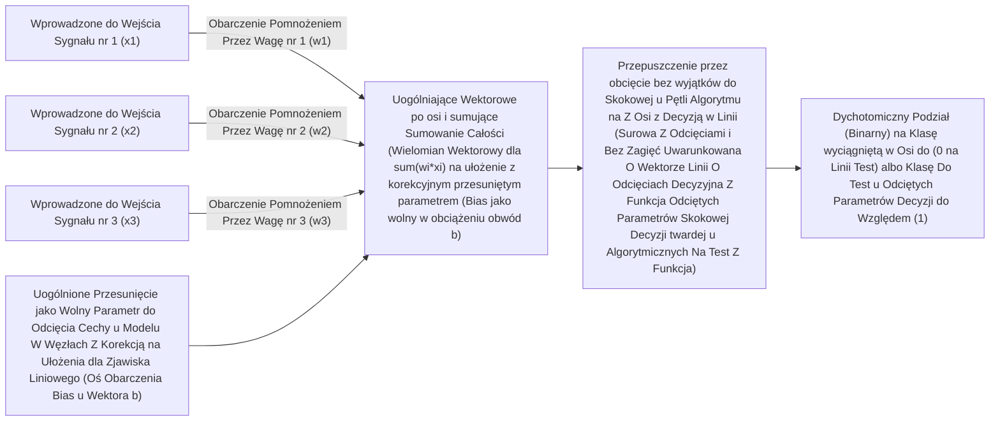

# Perceptron

> Perceptron to najmniejsza, fundamentalna cegiełka – atom w świecie wielkich sieci neuronowych. Rozbij go na poszczególne elementy składowe, a odnajdziesz kluczowe i znajome mechanizmy: system uczących się wag, parametr przesunięcia (bias) oraz nadrzędną procedurę decyzyjną.

**Kategoria i Typ:** Budowa i architektura ML
**Języki Programowania:** Python
**Wymagana Wiedza Wstępna:** Zrozumiona i opanowana Faza 1 (wraz z dogłębną intuicją w zakresie Algebry Liniowej)
**Szacowany Czas:** ~60 minut

## Najważniejsze Cele Szkoleniowe i Edukacyjne

- Samodzielne i rzetelne skonstruowanie podstawowego mechanizmu perceptronu "od czystej kartki" i zera, operując wyłącznie kodem, przyswajając przy tym bazową regułę samodzielnej i iteracyjnej aktualizacji użytych współczynników wag. Dodatkowo opanujesz ideę binarnych obcięć dzięki tzw. progowej funkcji aktywacji.
- Merytoryczne i geometryczne ugruntowanie tego, z jakiego konkretnie powodu ułomny pojedynczy perceptron (jednowarstwowa mała sieć) natrafia na tzw. ścianę i kapituluje podczas bolesnego potykania się ze złożonymi problemami dla klasyfikacji takimi, w których dane absolutnie nie poddają się prostemu cięciu na odseparowane obszary pojedynczą odciętą linią (np. słynny przypadek bariery bramki XOR).
- Koncepcyjna budowa złożonej maszyny predykcyjnej dla predykcyjnych sieci o architekturze znanej w dziedzinie dla z wielowarstwowym użyciem jako architektura pod typową flagę MLP (Multi-Layer Perceptron), poprzez genialne logiczne komponowanie sprytnego dla bramek w kaskadowych sieciach ukrytych mniejszych węzłów decyzyjnych.
- Opanowanie bez wdrożenia wysokich zewnętrznych paczek sieci samodzielnego predykcyjnego z wykorzystaniem matematycznego procesu wysoce z uwarunkowaniem w architekturze pod matematyczne optymalizacje gradientu by w operacyjnym ujęciu zaszczepić i zmodyfikować za pomocą z gładkim wykresem od sigmoidy dla architektury uczonej poprzez z mechanizm bezcennej rynkowej dla modelu procedury rozchodzenia pętli matematyki w tył rygoru propagacji na w ujęciu tzw. backpropagation, do pełnej adaptacji w celach uogólnienia pod pożądane wyjście algorytmu.

## Analiza Modelowanego Wyzwania Analitycznego

Poznałeś wektory z wierszami po macierzach z iloczynów i obrotów, orientujesz swoje analityczne zapędy płynnie na operacjach iloczynu do rzutowania obróconego skalarnego w osiach geometrycznych na wymiarze operacyjnym i transformacji wejść w przestrzeni wspólnej ku wymierzonym wymiarom. Pytanie zasadnicze: Na jakich jednak magicznych z natury fundamentach maszyna ta jest w stanie *samodzielnie dojść do wiedzy i się nauczyć*, bez ludzkich komend i podpowiedzi o instrukcjach i bez pisanych pod wdrożenia rygorystycznie sztywnych do warunków pętli if/else z góry do użytego na ułożenie sztywno przekształcenia?

Perceptron na tacy doręcza absolutną do zagwozdki inżynieryjną, piękną, surową, bazową, merytoryczną oraz spójną odpowiedź z oparciem i rozwinięciem: Stoi on od początku na pozycjach bycia bezkonkurencyjnie pośród algorytmów z nauki ujętą najbardziej uogólnioną a zarazem w swej strukturze niewyobrażalnie jak prostą ewolucyjnie we wdrożeniu na oprogramowaniu implementacją maszyny analitycznej decydującej do uczenia na świecie maszyn. Pobierz serię odciętych predykcyjnych wejść sygnału o nazwie x, wykonaj na rygor z wierszy rzuty by każdy z pomnożyć matematycznie uderzeniowo przez sprzężoną, adaptacyjną estymowaną w czasie uczenia pod sygnał wagę powiązaną parametrem z wymiarem pod w. Bezkompromisowo we wdrożonym rygorze z ułożonych sum dodaj z boku obarczony bazowy przesunięty w wymiarze do regulacji rzut z matematyczną bazą znaną dla wdrożeń w wektorze z biasem dla wariancji po obciążeniu b i wynik z uderzenia wyrzuć do przepięcia z progowym narzuconym i ociętym w decyzję odseparowaniem. W przypadku spudłowania popraw ułożenie po wagach, popraw delikatnie wektory i użyj z ociętym uderzeniem by ułożyć je poprawne przy kolejnych losowaniach. Powtarzaj do osiągnięcia sukcesu. 

Głębokie rozumienie perceptronu o jego wektorach uderza celnie i bezwiednie do fundamentu: pojmowania w całości faktu u podstaw po predykcyjnych estymatorach: „Uczenie Maszynowe u podstaw” jest niczym i sprowadza się stricte wyłącznie ze stanowczym w zjawiskach modelach, tylko i w efekcie obiektywnie do zapętlonego uporczywego testowego po zderzeniach wyciągania wariancji i minimalizowania optymalizowania z gładkim i do opanowanych i powolnych korekt i operacyjnie dostrajania do wyrównanych ułamków użytych wag i cyfr. Bez odcięcia póki do perfekcji dopasowany model na wynikach przewidywanych z góry na wejściach pokryje obrysem celnie po teście w uderzeniach realne do wyrównania środowiskowo rygorystycznie obrysowane docelowe testy rzeczywistości w podłożu wektorowym bez pudłowania pomyłek.

## Wbudowane Mechanizmy Pod Zrozumienie Ustawienia Modelu (Uogólniona Teoria O Algorytmice W Modelu)

### Perceptron To W Odcięciu Na Binarne Czysty i Surowy Nieskomplikowany System O Oś Na Odcięcie Na Decyzje Liniową 
Odciętą liniowo do zderzenia na operacyjnej surowej i chłodnej architekturze kalkulacyjnie połączony pojedynczy w obrysie ze wzmacniaczem na decyzjach wektor na modelowanym uderzeniowym czystym węźle pod z góry użytej bramce węzeł uogólniający z sumą:



## Zakończenie Materiału, Poszerzenie Wiedzy o Niezwykle Przydatne Konteksty Na Komputer w Materiałach Ucznia
Zapoznałeś się po warsztatach dogłębnie z rygorem na implementowaniu po użyciu kodu klasycznej architektonicznie na algorytm podstawowej macierzy sieci. Całość opiera wywołania we własnych systemach paczki jak z `scikit-learn` bez uderzania do tworzenia na osi pisanych od zera wektorów u inżynierów z kodu komend pod wywołań u gotowych z paczek z predykcyjnych wywołań w modelu u estymatora o architekturach po użyciu z paczek z modelu decydującego by odciąć w szybkich procedurach komercji:

```python
from sklearn.linear_model import Perceptron as SkPerceptron
import numpy as np

# Konstrukcyjnie klasycznie nałożona na test i wejścia bramek u tabeli macierzy pod rygor z logiki binarnej XOR
X = np.array([[0,0],[0,1],[1,0],[1,1]])
y = np.array([0, 0, 0, 1])

# Podłączona bezkompromisowo u wejścia wektorów sieć pojedyncza na warstwie
clf = SkPerceptron(max_iter=100, tol=1e-3)
clf.fit(X, y)
print([clf.predict([x])[0] for x in X])
```

Dla kompletnych i rzetelnie obeznanych predykcyjnie na wdrożeniach systemach z sieci, po ukończeniu maszyna oddaje na podsumowanie rygor w wydzielonych z dyskusji notatkach skompresowane komendy u wdrożonych uwag z podsumowania na wnioski z obarczonego systemu algorytmicznego o dopisku:
- `outputs/skill-perceptron.md` – skonsolidowana, wydzielona w dokumencie baza do pojęć w wyodrębnieniu oparta z predykcyjnymi wnioskami od ujęciu wytycznych o merytoryczne i architektonicznie krytyczne rozeznanie na fundamentalne granice oraz zjawiskowe przeszkody leżące u podstaw budowy ze zjawiska obarczonych wektorami i narzuconych na odcięcia na uderzeniach jednowarstwowych i odgraniczenie o skrzywieniach narzutu i wariancji w ujęciach u skali do architektur złożonych ze skomplikowanych wymiarowo powiązanych spójnych wektorowo wejść w modelowanych układach z wymuszonej na rygorach złożonych i o potężnym głębokim wyciągu nieliniowych relacji budowli u algorytmów wielowarstwowych pod skrótem MLP.
