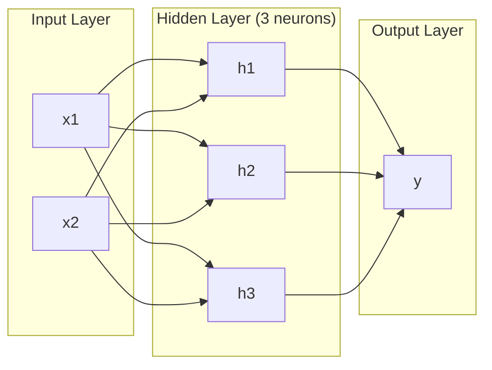
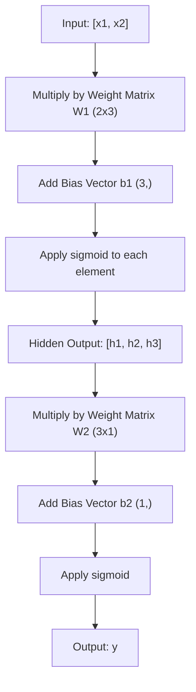
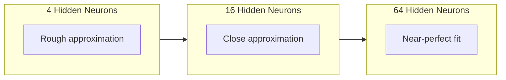

# Sieci wielowarstwowe i przejście w przód (Forward Pass)

> Jeden neuron rysuje linię. Ułóż je w warstwy i będziesz w stanie narysować wszystko.

**Typ:** Build
**Języki:** Python
**Wymagania wstępne:** Faza 01 (Podstawy matematyczne), Lekcja 03.01 (Perceptron)
**Czas:** ~90 minut

## Cele nauki

- Zbudować sieć wielowarstwową od podstaw, z klasami Layer i Network, wykonującymi pełne przejście w przód
- Śledzić wymiary macierzy w każdej warstwie sieci i identyfikować niezgodności kształtów
- Wyjaśnić, jak ułożenie nieliniowych funkcji aktywacji w warstwy pozwala sieci uczyć się zakrzywionych granic decyzyjnych
- Rozwiązać problem XOR za pomocą architektury 2-2-1 z ręcznie dostrojonymi wagami sigmoidalnymi

## Problem

Pojedynczy neuron rysuje linie. I tylko to. Jedna linia prosta przez Twoje dane. Każdy realny problem w AI -- rozpoznawanie obrazów, rozumienie języka, granie w Go -- wymaga krzywych. Ułożenie neuronów w warstwy to sposób, by zdobyć krzywe.

W 1969 roku Minsky i Papert udowodnili, że to ograniczenie jest fatalne: sieć jednowarstwowa nie może nauczyć się XOR. Nie "ma trudności z nauczeniem się" -- matematycznie nie może. Tabela prawdy XOR umieszcza [0,1] i [1,0] po jednej stronie, a [0,0] i [1,1] po drugiej. Żadna pojedyncza linia nie rozdzieli tych punktów.

To zabiło finansowanie sieci neuronowych na ponad dekadę. Rozwiązanie było oczywiste z perspektywy czasu: przestać używać jednej warstwy. Ułożyć neurony w warstwy. Pozwolić, by pierwsza warstwa podzieliła przestrzeń wejściową na nowe cechy, a druga warstwa skombinowała te cechy w decyzje, których żadna pojedyncza linia nie mogłaby podjąć.

Ten stos to sieć wielowarstwowa. Jest podstawą każdego modelu deep learning działającego dziś w produkcji. Przejście w przód -- przepływ danych od wejścia, przez warstwy skryte, do wyjścia -- jest pierwszą rzeczą, którą musisz zbudować, zanim cokolwiek innego zacznie działać.

## Koncepcja

### Warstwy: wejściowa, skryte, wyjściowa

Sieć wielowarstwowa ma trzy typy warstw:

**Warstwa wejściowa** -- to nie jest naprawdę warstwa. Przechowuje surowe dane. Dwie cechy oznaczają dwa węzły wejściowe. Tutaj nie zachodzą żadne obliczenia.

**Warstwy skryte** -- tutaj dzieje się praca. Każdy neuron pobiera każde wyjście z poprzedniej warstwy, stosuje wagi i bias, a następnie przepuszcza wynik przez funkcję aktywacji. "Skryte", bo nigdy nie widzisz tych wartości bezpośrednio w danych treningowych.

**Warstwa wyjściowa** -- ostateczna odpowiedź. Dla klasyfikacji binarnej -- jeden neuron z sigmoidem. Dla wieloklasowej -- jeden neuron na klasę.



To jest sieć 2-3-1. Dwa wejścia, trzy neurony skryte, jedno wyjście. Każde połączenie ma wagę. Każdy neuron (oprócz wejściowych) ma bias.

Każda warstwa produkuje wektor liczb zwany stanem skrytym (hidden state). Dla tekstu stany skryte zwiększają wymiarowość -- kodując słowo jako 768 liczb, by uchwycić znaczenie semantyczne. Dla obrazów zmniejszają wymiarowość -- kompresując miliony pikseli do możliwej do obsłużenia reprezentacji. Stan skryty to miejsce, w którym żyje uczenie.

### Neurony i funkcje aktywacji

Każdy neuron robi trzy rzeczy:

1. Mnoży każde wejście przez odpowiadającą mu wagę
2. Sumuje wszystkie produkty i dodaje bias
3. Przepuszcza sumę przez funkcję aktywacji

Na razie funkcją aktywacji jest sigmoid:

```
sigmoid(z) = 1 / (1 + e^(-z))
```

Sigmoid spłaszcza każdą liczbę do zakresu (0, 1). Duże dodatnie wejścia przesuwają wynik w stronę 1. Duże ujemne wejścia przesuwają go w stronę 0. Zero mapuje się na 0.5. Ta gładka krzywa jest tym, co umożliwia uczenie -- w przeciwieństwie do twardego skoku perceptronu, sigmoid ma gradient wszędzie.

### Przejście w przód: jak przepływają dane

Przejście w przód (forward pass) przepycha dane wejściowe przez sieć, warstwa po warstwie, aż dotrą do wyjścia. Podczas przejścia w przód nie zachodzi żadne uczenie. To czyste obliczenia: pomnóż, dodaj, aktywuj, powtórz.



W każdej warstwie zachodzą po kolei trzy operacje:

```
z = W * input + b       (transformacja liniowa)
a = sigmoid(z)           (aktywacja)
```

Wyjście jednej warstwy staje się wejściem dla następnej. To jest całe przejście w przód.

### Wymiary macierzy

Śledzenie wymiarów to najważniejsza umiejętność debugowania w deep learning. Oto sieć 2-3-1:

| Krok | Operacja | Wymiary | Kształt wyniku |
|------|-----------|------------|-------------|
| Wejście | x | -- | (2,) |
| Skryta liniowa | W1 * x + b1 | W1: (3, 2), b1: (3,) | (3,) |
| Skryta aktywacja | sigmoid(z1) | -- | (3,) |
| Wyjściowa liniowa | W2 * h + b2 | W2: (1, 3), b2: (1,) | (1,) |
| Wyjściowa aktywacja | sigmoid(z2) | -- | (1,) |

Zasada: macierz wag W w warstwie k ma kształt (neurony_w_warstwie_k, neurony_w_warstwie_k_minus_1). Wiersze odpowiadają obecnej warstwie. Kolumny odpowiadają poprzedniej warstwie. Jeśli kształty się nie zgadzają, masz błąd.

### Teoria aproksymacji uniwersalnej

W 1989 roku George Cybenko udowodnił coś niezwykłego: sieć neuronowa z jedną warstwą skrytą i wystarczającą liczbą neuronów może przybliżyć każdą funkcję ciągłą z dowolną dokładnością.

Nie znaczy to, że jedna warstwa skryta jest zawsze najlepsza. Znaczy to, że taka architektura jest teoretycznie zdolna. W praktyce głębsze sieci (więcej warstw, mniej neuronów na warstwę) uczą się tych samych funkcji przy znacznie mniejszej całkowitej liczbie parametrów niż sieci płaskie i szerokie. To właśnie dlaczego deep learning działa.

Intuicja: każdy neuron w warstwie skrytej uczy się jednego "wybrzuszenia" lub cechy. Wystarczająca liczba wybrzuszeń umieszczonych w odpowiednich miejscach może przybliżyć każdą gładką krzywą. Więcej neuronów, więcej wybrzuszeń, lepsza aproksymacja.



### Komponowalność

Sieci neuronowe są komponowalne. Możesz je układać w stosy, łączyć w łańcuchy, uruchamiać równolegle. Model Whisper używa sieci kodera do przetwarzania audio i odrębnej sieci dekodera do generowania tekstu. Współczesne LLM-y są dekoderowe (decoder-only). BERT jest koderowy (encoder-only). T5 jest koder-dekoder. Wybór architektury definiuje, co model może robić.

## Zbuduj to

Czysty Python. Bez numpy. Każda operacja na macierzach napisana od zera.

### Krok 1: Funkcja aktywacji sigmoid

```python
import math

def sigmoid(x):
    x = max(-500.0, min(500.0, x))
    return 1.0 / (1.0 + math.exp(-x))
```

Ograniczenie do [-500, 500] zapobiega przepełnieniu. `math.exp(500)` to duża, ale skończona liczba. `math.exp(1000)` to nieskończoność.

### Krok 2: Klasa Layer

Najważniejszą operacją w całym deep learning jest mnożenie macierzy. Każda warstwa, każda głowica uwagi, każde przejście w przód -- to mnożenia macierzy (matmuls) od początku do końca. Warstwa liniowa pobiera wektor wejściowy, mnoży go przez macierz wag i dodaje wektor biasu: y = Wx + b. To jedno równanie to 90% obliczeń w sieci neuronowej.

Warstwa przechowuje macierz wag i wektor biasu. Jej metoda forward pobiera wektor wejściowy i zwraca aktywowane wyjście.

```python
class Layer:
    def __init__(self, n_inputs, n_neurons, weights=None, biases=None):
        if weights is not None:
            self.weights = weights
        else:
            import random
            self.weights = [
                [random.uniform(-1, 1) for _ in range(n_inputs)]
                for _ in range(n_neurons)
            ]
        if biases is not None:
            self.biases = biases
        else:
            self.biases = [0.0] * n_neurons

    def forward(self, inputs):
        self.last_input = inputs
        self.last_output = []
        for neuron_idx in range(len(self.weights)):
            z = sum(
                w * x for w, x in zip(self.weights[neuron_idx], inputs)
            )
            z += self.biases[neuron_idx]
            self.last_output.append(sigmoid(z))
        return self.last_output
```

Macierz wag ma kształt (n_neurons, n_inputs). Każdy wiersz to wagi jednego neuronu dla wszystkich wejść. Metoda forward iteruje po neuronach, obliczając sumę ważoną plus bias, stosuje sigmoid i zbiera wyniki.

### Krok 3: Klasa Network

Sieć to lista warstw. Przejście w przód łączy je w łańcuch: wyjście warstwy k jest wejściem warstwy k+1.

```python
class Network:
    def __init__(self, layers):
        self.layers = layers

    def forward(self, inputs):
        current = inputs
        for layer in self.layers:
            current = layer.forward(current)
        return current
```

To jest całe przejście w przód. Cztery linie logiki. Dane wchodzą, przepływają przez każdą warstwę, wychodzą z drugiej strony.

### Krok 4: XOR z ręcznie dostrojonymi wagami

W Lekcji 01 rozwiązaliśmy XOR, kombinując perceptrony OR, NAND i AND. Teraz zrób to samo, używając naszych klas Layer i Network. Architektura 2-2-1: dwa wejścia, dwa neurony skryte, jedno wyjście.

```python
hidden = Layer(
    n_inputs=2,
    n_neurons=2,
    weights=[[20.0, 20.0], [-20.0, -20.0]],
    biases=[-10.0, 30.0],
)

output = Layer(
    n_inputs=2,
    n_neurons=1,
    weights=[[20.0, 20.0]],
    biases=[-30.0],
)

xor_net = Network([hidden, output])

xor_data = [
    ([0, 0], 0),
    ([0, 1], 1),
    ([1, 0], 1),
    ([1, 1], 0),
]

for inputs, expected in xor_data:
    result = xor_net.forward(inputs)
    predicted = 1 if result[0] >= 0.5 else 0
    print(f"  {inputs} -> {result[0]:.6f} (rounded: {predicted}, expected: {expected})")
```

Duże wagi (20, -20) powodują, że sigmoid działa jak funkcja skoku. Pierwszy neuron skryty przybliża OR. Drugi przybliża NAND. Neuron wyjściowy kombinuje je w AND, co daje XOR.

### Krok 5: Klasyfikacja okręgu

Trudniejszy problem: klasyfikacja punktów 2D jako leżących wewnątrz lub poza okręgiem o radiusie 0.5 wycentrowanym na początku układu współrzędnych. Wymaga to zakrzywionej granicy decyzyjnej -- niemożliwej dla pojedynczego perceptronu.

```python
import random
import math

random.seed(42)

data = []
for _ in range(200):
    x = random.uniform(-1, 1)
    y = random.uniform(-1, 1)
    label = 1 if (x * x + y * y) < 0.25 else 0
    data.append(([x, y], label))

circle_net = Network([
    Layer(n_inputs=2, n_neurons=8),
    Layer(n_inputs=8, n_neurons=1),
])
```

Przy losowych wagach sieć nie sklasyfikuje danych dobrze. Ale przejście w przód i tak się wykona. To jest cała rzecz -- przejście w przód to tylko obliczenia. Nauczenie się właściwych wag to backpropagation, omawiana w Lekcji 03.

```python
correct = 0
for inputs, expected in data:
    result = circle_net.forward(inputs)
    predicted = 1 if result[0] >= 0.5 else 0
    if predicted == expected:
        correct += 1

print(f"Accuracy with random weights: {correct}/{len(data)} ({100*correct/len(data):.1f}%)")
```

Losowe wagi dają słabą dokładność -- często gorszą niż zgadywanie klasy większościowej. Po treningu (Lekcja 03) ta sama architektura z 8 neuronami skrytymi narysuje zakrzywioną granicę, która oddzieli punkty wewnątrz od punktów na zewnątrz.

## Użyj tego

PyTorch robi wszystko powyższe w czterech liniach:

```python
import torch
import torch.nn as nn

model = nn.Sequential(
    nn.Linear(2, 8),
    nn.Sigmoid(),
    nn.Linear(8, 1),
    nn.Sigmoid(),
)

x = torch.tensor([[0.0, 0.0], [0.0, 1.0], [1.0, 0.0], [1.0, 1.0]])
output = model(x)
print(output)
```

`nn.Linear(2, 8)` to Twoja klasa Layer: macierz wag o kształcie (8, 2), wektor biasu o kształcie (8,). `nn.Sigmoid()` to Twoja funkcja sigmoid zastosowana element po elemencie. `nn.Sequential` to Twoja klasa Network: łączenie warstw w łańcuch w odpowiednim porządku.

Różnica polega na prędkości i skali. PyTorch działa na GPU, obsługuje partie (batche) milionów próbek i automatycznie oblicza gradienty dla propagacji wstecznej. Ale logika przejścia w przód jest identyczna z tą, którą właśnie zbudowałeś od zera.

## Wysyłka (Ship It)

Ta lekcja produkuje wielokrotnie używalny prompt do projektowania architektur sieci:

- `outputs/prompt-network-architect.md`

Użyj go, gdy musisz zdecydować, ile warstw, ile neuronów na warstwę i jakich funkcji aktywacji użyć dla danego problemu.

## Ćwiczenia

1. Zbuduj sieć 2-4-2-1 (dwie warstwy skryte) i wykonaj przejście w przód na danych XOR z losowymi wagami. Wypisz wyjścia pośrednich warstw skrytych, aby zobaczyć, jak reprezentacja zmienia się w każdej warstwie.

2. Zmień rozmiar warstwy skrytej w klasyfikatorze okręgu z 8 na 2, a następnie na 32. Każdorazowo wykonaj przejście w przód z losowymi wagami. Czy liczba neuronów skrytych zmienia zakres lub rozkład wyjścia? Czemu?

3. Zaimplementuj metodę `count_parameters` w klasie Network, która zwraca całkowitą liczbę trenowalnych wag i biasów. Przetestuj ją na sieci 784-256-128-10 (klasyczna architektura MNIST). Ile parametrów ma ta sieć?

4. Zbuduj przejście w przód dla sieci 3-4-4-2. Podaj jej wartości kolorów RGB (znormalizowane do 0-1) i zaobserwuj dwa wyjścia. To jest architektura prostego klasyfikatora kolorów z dwiema klasami.

5. Zastąp sigmoid funkcją "leaky step": zwróć 0.01 * z jeśli z < 0, w przeciwnym razie 1.0. Wykonaj przejście w przód na XOR z tymi samymi ręcznie dostrojonymi wagami z Kroku 4. Czy wciąż działa? Czemu gładki sigmoid jest preferowany ponad ostre cięcia (hard cutoffs)?

## Kluczowe terminy

| Termin | Co ludzie mówią | Co to faktycznie znaczy |
|------|----------------|----------------------|
| Forward pass (przejście w przód) | "Odpalenie modelu" | Przepuszczenie wejścia przez każdą warstwę -- pomnóż przez wagi, dodaj bias, aktywuj -- aby uzyskać wyjście |
| Hidden layer (warstwa skryta) | "Ta środkowa część" | Każda warstwa między wejściem a wyjściem, której wartości nie są bezpośrednio obserwowane w danych |
| Multi-layer network (sieć wielowarstwowa) | "Głęboka sieć neuronowa" | Warstwy neuronów ułożone sekwencyjnie, gdzie wyjście każdej warstwy zasila wejście następnej |
| Activation function (funkcja aktywacji) | "Ta nieliniowość" | Funkcja zastosowana po transformacji liniowej, która wprowadza krzywizny do granicy decyzyjnej |
| Sigmoid | "Krzywa S" | sigma(z) = 1/(1+e^(-z)), spłaszcza każdą liczbę rzeczywistą do (0,1), gładka i różniczkowalna wszędzie |
| Weight matrix (macierz wag) | "Parametry" | Macierz W o kształcie (neurony_obecnej_warstwy, neurony_poprzedniej_warstwy) zawierająca uczone siły połączeń |
| Bias vector (wektor biasu) | "Przesunięcie" | Wektor dodawany po mnożeniu macierzowym, który pozwala neuronom aktywować się nawet, gdy wszystkie wejścia są zerowe |
| Universal approximation (aproksymacja uniwersalna) | "Sieci neuronowe mogą się nauczyć wszystkiego" | Jedna warstwa skryta z wystarczającą liczbą neuronów może przybliżyć każdą funkcję ciągłą -- ale "wystarczająca" może oznaczać miliardy |
| Linear transformation (transformacja liniowa) | "Krok mnożenia macierzowego" | z = W * x + b, obliczenie przed aktywacją, które mapuje wejścia na nową przestrzeń |
| Decision boundary (granica decyzyjna) | "Tam, gdzie klasyfikator się przełącza" | Powierzchnia w przestrzeni wejściowej, gdzie wyjście sieci przekracza próg klasyfikacji |

## Dalsze materiały

- Michael Nielsen, "Neural Networks and Deep Learning", rozdziały 1-2 (http://neuralnetworksanddeeplearning.com/) -- najjaśniejsze darmowe wyjaśnienie przejść w przód i struktury sieci, z interaktywnymi wizualizacjami
- Cybenko, "Approximation by Superpositions of a Sigmoidal Function" (1989) -- oryginalna praca o teorii aproksymacji uniwersalnej, zaskakująco czytelna
- 3Blue1Brown, "But what is a neural network?" (https://www.youtube.com/watch?v=aircAruvnKk) -- 20-minutowe wizualne wprowadzenie do warstw, wag i przejść w przód, które buduje właściwy model mentalny
- Goodfellow, Bengio, Courville, "Deep Learning", rozdział 6 (https://www.deeplearningbook.org/) -- standardowe odniesienie dla sieci wielowarstwowych, darmowe online
