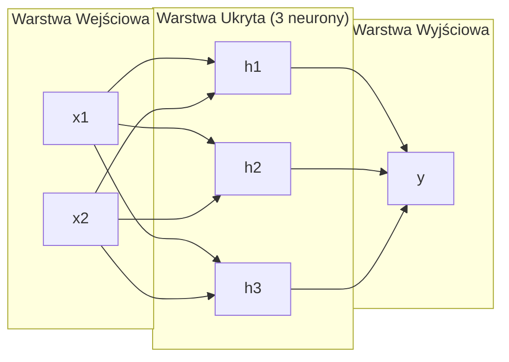
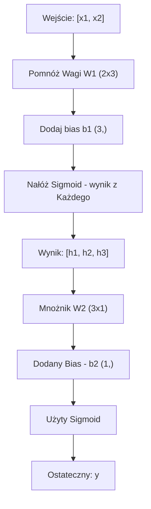

# Sieci Wielowarstwowe i Przebieg W Przód (Multi-Layer Networks and Forward Pass)

> Jeden neuron rysuje linię. Złóż je razem, a narysujesz wszystko.

**Typ:** Budowa
**Języki:** Python
**Wymagania wstępne:** Faza 01 (Podstawy Matematyczne), Lekcja 03.01 (Perceptron)
**Czas:** ~90 minut

## Cele nauczania

- Zbudowanie od zera sieci wielowarstwowej z klasami Layer (Warstwa) i Network (Sieć), która wykonuje pełny przebieg w przód (forward pass)
- Śledzenie wymiarów macierzy przez każdą warstwę sieci i identyfikowanie niezgodności kształtów
- Wyjaśnienie, jak złożenie nieliniowych funkcji aktywacji pozwala sieci uczyć się zakrzywionych granic decyzyjnych
- Rozwiązanie problemu XOR za pomocą architektury 2-2-1 z ręcznie dostrojonymi sigmoidalnymi wagami

## Problem

Pojedynczy neuron rysuje linię. To wszystko. Jedna prosta linia przechodząca przez Twoje dane. Każdy rzeczywisty problem w sztucznej inteligencji -- rozpoznawanie obrazów, rozumienie języka, granie w Go -- wymaga krzywych. Składanie neuronów w warstwy to sposób, w jaki zyskujesz krzywe.

W 1969 roku Minsky i Papert dowiedli, że to ograniczenie jest kluczowe: jednowarstwowa sieć nie jest w stanie nauczyć się funkcji XOR. Nie tyle "będzie z nią walczyć" -- tylko matematycznie jest to niemożliwe. Tabela prawdy dla XOR stawia wartości [0,1] i [1,0] z jednej strony, a [0,0] i [1,1] po drugiej. Żadna prosta linia nie jest w stanie ich przedzielić.

To "zabiło" finansowanie dla badań nad sieciami neuronowymi na dekadę. Z perspektywy czasu rozwiązanie było oczywiste - przestań korzystać z pojedynczej warstwy. Zbuduj z nich kilka warstw. Pierwsza warstwa podzieli wejście na nowe cechy, a druga weźmie te cechy i podejmie decyzje, jakich linia nigdy nie byłaby w stanie.

Taki stos jest nazywany siecią wielowarstwową. Jest to fundament, dla dzisiejszego działania praktycznie każdego głębokiego systemu nauczania (deep learning) z wdrożeniami na produkcję. Przejście danych w przód (Forward pass) – to moment, od przepływu wejścia po ukryte warstwy do samego finałowego wyniku, co w zasadzie powinieneś zbudować od początku.

## Koncepcja

### Warstwy: Wejściowa, Ukryte, Wyjściowa

Wielowarstwowa sieć posiada trzy rodzaje warstw:

**Warstwa wejściowa (Input layer)** -- nie do końca jest warstwą. Trzyma czyste dane (raw data). Mając dwie cechy, to mamy dwa wejścia i żaden proces nie dzieje się z nimi na tym etapie.

**Warstwy ukryte (Hidden layers)** -- tu gdzie wykonuje się praca. Neuron pobiera wszystko z wyjścia warstwy wyższej (poprzedniej) aplikuje odpowiednie wartości wag i biasu dla tego co nadeszło, a następnie przechodzi przez to funkcją aktywacyjną. "Ukryta", gdyż jej zachowanie (i wagi) nie jest widoczne na wierzchu w danych do modelowania (w treningowych danych).

**Warstwa wyjściowa (Output layer)** -- finalna odpowiedź. W celu utworzenia binarnej klasyfikacji stosowany będzie tu jeden neuron sigmoidalny. Jeśli wyjście polegać będzie na wyborze z pośród klas stosować tu należy odpowiednio po 1 węźle / neuronie dla opcji wyjścia.



Więc, tu powyżej widać model (sieć) 2-3-1, 2 pola na start, 3 warstwy (węzły) a także sam koniec mający 1 na końcu. Każde połączone łącze ma własną wartość a ponadto w systemie dla nie-wejściowych węzłów stosowany będzie parametr nazywany Bias.

Na koniec, zbiór wygenerowanych numerów to stan z warstwy (stan ukryty - hidden state), i podczas zapisu słowa wymiary rosną, generując 768 wartości mających ująć "sensowne słowo". Ale z drugiej strony przy grafikach (bitmapach), ten wymiar ulega zmianie, po prostu maleje, aż o całe pokolenia zmniejsza on objętość tego co w ogóle przetwarza z tak sporej ilości wejść. Ten wymiar przechowuje wyuczoną treść w nim.

### Neurony i aktywacje

Neuron ma po prostu działać:
1. Mnożyć własne dane mając dla tego swoją zaprogramowaną dla nich daną ("weight" wage)
2. Wszystkie wagi pomnożone przez dane mają się podsumować (Z sumować) po czym powinno być do sumy dopisane bias 
3. W tym punkcie wszystko jest wkładane ("przepuszczane") dla finalnego uzysku z tzw funcją aktywacji ("activation function").

My narazie bazujemy nad sigmoidalną aktywacją:

```
sigmoid(z) = 1 / (1 + e^(-z))
```

To funkcja ściska cyfry aby mieć zakres (0,1). Kiedy wpada spore "na +", wyjdzie mocno do jedynki. Minus, i mocno z tyłu? - Zbliżymy się do zera. Zero równe jest idealnemu stanowi: 0.5. To te płynne formy dają w ogóle radę cokolwiek zgadywać (i po co powstało uczenie), w opcji (tzn od klasycznego perceprona z brutalną barierą do sigmoidu widoczny jest gradient dla niego wszędzie tam) gdzie on działa.

### Bieg Do Przodu (Forward Pass): W Jaki Sposób Obliczane Są Te Wyniki

Wtedy kiedy wprawisz "prąd w ruch" i system sam przejdzie kolejne warianty to system uruchomi właśnie w tym momencie Bieg Do Przodu. Jest to kalkulacja kroków bez nauki.



Trzy akcje naraz:
```
z = W * input + b       (liniowa transformacja)
a = sigmoid(z)           (aktywacja)
```

Z jednego wejdzie na początek 2! I tak do finału!

### Wymiary Macierzy

Jeśli potrafisz liczyć "wymairy" – w deep learning masz 90% sukcesów naprawiania, np: sieć w przykładzie: (2-3-1):

| Krok | Działanie | Wymiary | Wynik Kształtu |
|------|-----------|------------|-------------|
| Start (Input)| x | -- | (2,) |
| Warstwa Lin| W1 * x + b1 | W1: (3, 2), b1: (3,) | (3,) |
| W. Aktyw.| sigmoid(z1) | -- | (3,) |
| Wyjścia Lin| W2 * h + b2 | W2: (1, 3), b2: (1,) | (1,) |
| Wyj Aktyw | sigmoid(z2) | -- | (1,) |

Tu W dla k, zawsze zawiera kształt (w_teraz, w_poprzednio). I nie ma tu odstępów. Jeśli te elementy są niezgodne ze sobą, w tym systemie siedzi i tkwi wielki i bolesny Bug.

### Uniwersalne Twierdzenie o Aproksymacji

W roku 1989 (George Cybenko), stwierdzono z wielką dobitką jeden genialny fakt dla tych modeli - Mając zaledwie jedną ukrytą warstwę da się uzyskać wszystkie i z niebywałą sprawnością "krzywe aproksymacje" przy czym sieć odgaduje każdą potrzebną funcję po podaniu dobrej liczby ukrytej. 

Niestety, szeroka 1 poziomowa to słabszy zamiennik z sieci "Deep" - W nich kilka jest i radzi lepiej mając małe uwarunkowania! To udowadnia jak sieci Głębokie działają. To ta funkcja (neuronów o danym rzucie na sieć) sprawi, i wygeneruje mniejsze zbiory do oceny parametru na warstwie.

### Składalność (Composability)

Sieci są łatwe w ułożeniu. Można nimi budować jak z klocków. Posiadają i ułożenie Enkodera np "Whisper" - robi na Tekst, po czym ma swój Dekoder! Tak można by i mieć, gdzie nowe np. "LLM" działają jako Dekoder-only, oraz BERT korzysta w tym na Enkoder-only. 

## Zbuduj To

Bez obcych paczek Pythona, takich jak numpy. Zbudujemy to po kolei wszystko sami.

### Krok 1: Aktywacja Sigmoidalna

```python
import math

def sigmoid(x):
    x = max(-500.0, min(500.0, x))
    return 1.0 / (1.0 + math.exp(-x))
```

Ograniczenie (clamp) od [-500, 500] nie wyleje błedu ze zbyt wielkich potęg na funkcjach (`math.exp(1000)` = BŁĄD, ∞ itp).

### Krok 2: Klasa warstwy (Layer)

Najpotężniejsze z tego systemu, to jak one pomnożą sobie to: Wszędzie po sieci działa i opiera na tym mnożenie macierzy! Gdy idzie coś liniowo: ( y = Wx + b ) i tak właśnie odbywają się niemal ze w 90% praca przy tym i to jest największa ilość urobionej pracy systemu tej aplikacji. 

Utrzymując (i zbierając na tej bazie i podstawie) ma "wagi" no i ma "bias". Do wywołania robi "forward" co pobiera sygnał na wierzch po aktywacji.

```python
class Layer:
    def __init__(self, n_inputs, n_neurons, weights=None, biases=None):
        if weights is not None:
            self.weights = weights
        else:
            import random
            self.weights = [
                [random.uniform(-1, 1) for _ in range(n_inputs)]
                for _ in range(n_neurons)
            ]
        if biases is not None:
            self.biases = biases
        else:
            self.biases = [0.0] * n_neurons

    def forward(self, inputs):
        self.last_input = inputs
        self.last_output = []
        for neuron_idx in range(len(self.weights)):
            z = sum(
                w * x for w, x in zip(self.weights[neuron_idx], inputs)
            )
            z += self.biases[neuron_idx]
            self.last_output.append(sigmoid(z))
        return self.last_output
```

I macierz i wagi – Kształt tego to: (n_neurons, n_inputs). Każdy rząd = to 1 sieć i neurony ułożone na każdy podany wymiar pod wejścia. Akcja idzie "Forward", sumuje plus przelicza ze swoimi bias, używając sigmoid a następnie przechowuje.

### Krok 3: Sieć (Network) i Warstwy (Layers)

Tu system zapisuje w 1 i używa warstw dla forward.

```python
class Network:
    def __init__(self, layers):
        self.layers = layers

    def forward(self, inputs):
        current = inputs
        for layer in self.layers:
            current = layer.forward(current)
        return current
```

Właśnie taki masz komplet. Przepływ poszedł i ma w całości te kilka wyżej wymienionych punktów po przejściu każdej z użytych sieci.

### Krok 4: XOR

To jak dla 01, z podanymi od 2 po przez wytyczne dla AND OR czy NAND! Architektura to ułożenie takie jak 2-2-1! 2 startowe (input), 2 to baza - to hidden, i wyjdzie ten 1 dla finalizacji.

```python
hidden = Layer(
    n_inputs=2,
    n_neurons=2,
    weights=[[20.0, 20.0], [-20.0, -20.0]],
    biases=[-10.0, 30.0],
)

output = Layer(
    n_inputs=2,
    n_neurons=1,
    weights=[[20.0, 20.0]],
    biases=[-30.0],
)

xor_net = Network([hidden, output])

xor_data = [
    ([0, 0], 0),
    ([0, 1], 1),
    ([1, 0], 1),
    ([1, 1], 0),
]

for inputs, expected in xor_data:
    result = xor_net.forward(inputs)
    predicted = 1 if result[0] >= 0.5 else 0
    print(f"  {inputs} -> {result[0]:.6f} (rounded: {predicted}, expected: {expected})")
```

Użyte wysokie -/+ wielkie parametry dla wag z bias działają teraz jak "Ściana". Ułatwia, jako ta aktywacyjna funkcja to samo działanie na układ: pierwszy udaje OR a drugi z "ukrytych" – jest po protu ułożonym układem z systemu NAND i ten ostatni ułoży go i ujednolici pod XOR (Z użyciem logiki AND na układ)!

### Krok 5: Granice i problem decyzyjny 

Trudniejszy dla tej sieci będzie proces dla kół. Poza oraz we wnętrzu o r=0.5 na środku (orign)? Złożone to dla perceprona który na starcie by uciekł z płaczem przy takim prostym dla ludzkiego oka pytaniu, bo perceprony radzą sobie jak wcześniej poinformowano za sprawą 1 wymiaru dla płaskich, a nie okrągłych rzutów na granicy.

```python
import random
import math

random.seed(42)

data = []
for _ in range(200):
    x = random.uniform(-1, 1)
    y = random.uniform(-1, 1)
    label = 1 if (x * x + y * y) < 0.25 else 0
    data.append(([x, y], label))

circle_net = Network([
    Layer(n_inputs=2, n_neurons=8),
    Layer(n_inputs=8, n_neurons=1),
])
```

Dla "Random" nie będzie dobrze. Choć wciąż pędzi dalej z liczeniem bez straty płynności (forward pędzi)! "Uczenieniem", i "nauczaniem" będziemy obierać u steru kurs, w procesie i to się tyczy "Backpropagation" w nr lekcji – "03".

```python
correct = 0
for inputs, expected in data:
    result = circle_net.forward(inputs)
    predicted = 1 if result[0] >= 0.5 else 0
    if predicted == expected:
        correct += 1

print(f"Accuracy with random weights: {correct}/{len(data)} ({100*correct/len(data):.1f}%)")
```

Random działa niemal tak złą i losową statystyką (Acz bywa to i po mimo że "mniej" w poprawności co do zasady zwykłego strzelania z głowy!). Lecz po lekcji 3 (szkolenie wag), te okrągłe rzuty pojdą mu lekko!


## Użyj Tego

PyTorch używa tego co my zbudowaliśmy tam na samej górze za pomocą tego małego polecenia! (Wystarczą 4 linie dla wykonania) 

```python
import torch
import torch.nn as nn

model = nn.Sequential(
    nn.Linear(2, 8),
    nn.Sigmoid(),
    nn.Linear(8, 1),
    nn.Sigmoid(),
)

x = torch.tensor([[0.0, 0.0], [0.0, 1.0], [1.0, 0.0], [1.0, 1.0]])
output = model(x)
print(output)
```

Wywołane tam w Python (`nn.Linear(2,8)`) – to jest klasa: Warstwy z Wag (Layer) w ułożeniu (8,2) ze statusem "bias" i jego ustawionym wektorem po ujęciu rzędu co da wymiaru - kształt na wskaźnik do (8,). My odniesiemy z tej PyTorch aktywację z sigmoidem – po użyciu (`nn.Sigmoid()`), i połączonej i sprawnie na końcu odwołanej przy okazji dla (`nn.Sequential`), jako Sieci (Więc też z odpytanym wywołaniem!).

Różnica tkwi w samej wydajności u GPU na obliczanie przy dziesiątkach dla tych co by chcieli mieć miliony lub tysiące i dla funkcji automatycznego procesu w generowaniu u wag z odwołania wstecz (backpropagation). Lecz tu - jest "czysta matematyka". Pedał i przyspieszenie bez różnic po zapleczach mechanicznych.

## Wdrażaj

Poniższe zajęcia, które dają szablony do określania budowy ułożenia wielkich układów sieci - to tu do utworzenia się podano i w to to zamieniono w system na produkcje:

- `outputs/prompt-network-architect.md`

Stosuj jako "Poradnik". Przypisuje on odpowiednie wymiary po czym radzi przy ustaleniu węzłów pod układ, oraz aktywacji pod zadane zadanie problematyczne.

## Ćwiczenia

1. Skonfiguruj 2-4-2-1 z ukrytym systemem pod (podwójnymi układami dla tego), aby to szło do tego naprzód przy funkcji XOR pod ten "losowy wariant".
2. Pobaw się ukrytą strefą - Zmień z 8 dla funkcji kół, pod - na początek 2, a potem dla 32. Używaj "W_przód" i rzucaj losowym. Po podmienianiu ukrytych ilości pod te ułożone układy, ma ta cała zmiana jakikolwiek ustrój i sens? Sprawdź i zapisz powody pod tego zmianę.
3. Utwórz funkcję - czyli z metod `count_parameters` "licznik pod parametry" z Systemów ("Z klasy - dla Sieci Network" – Co generuje całkowity ujęty zakres "wszystkich opcji dla wag po systemie uczenia). Sprawdź i dodaj 784-256-128-10. Czego ma to dotyczyć – no to słynne ułożenie – dla stref od MNIST. Podaj ich ilostan co do owych wyżej parametrów?
4. Przeprowadź z modelem ("Przepływ do Przodu") po strukturze (3-4-4-2). Skieruj je by jadło Kolory RGB z zakresów do normalizowanych z "od-do 0-1", patrz pod 2 ostatnie kanały i wyłuskuj klasyfikatorów dla "Kolorowych dwóch-klas" barwnych rzutów opcji pod to zadanie. 
5. Czym podmienisz te "miękkie wcięcie" i ten Sigmoid (leaky step): 0.01 z "jesli z zera, i daj" do - lub nie, to odrzuć do "1.0." – Wyślij z wariantem dla z przodu! Czy po zmianie ma jeszcze prawo "działać z użyciem na wyznaczony system u ręki wagi z Krok nr4 (XOR)" – "Czemu ten "gładki / soft" system Sigmoidalny wygrywa i ma sens z brutalnym i ostro rzucanym układem ucięcia przy aktywacjach układów tych ucięć dla odgrodzeń granicy?

## Kluczowe pojęcia

| Termin | Co mówią ludzie | Co to właściwie oznacza |
|------|----------------|----------------------|
| Przebieg w przód (Forward pass) | "Uruchamianie modelu" | Popychanie danych wejściowych przez każdą warstwę -- mnożenie przez wagi, dodawanie obciążenia, aktywacja -- w celu wyprodukowania wyniku |
| Warstwa ukryta (Hidden layer) | "Środkowa część" | Każda warstwa między wejściem a wyjściem, której wartości nie są bezpośrednio obserwowane w danych |
| Sieć wielowarstwowa (Multi-layer network) | "Głęboka sieć neuronowa" | Warstwy neuronów układane jedna po drugiej, gdzie wyjście każdej warstwy zasila wejście następnej |
| Funkcja aktywacji (Activation function) | "Nieliniowość" | Funkcja stosowana po liniowej transformacji, która wprowadza krzywe do granicy decyzyjnej |
| Sigmoid | "Krzywa w kształcie S" | sigma(z) = 1/(1+e^(-z)), "ściska" dowolną liczbę rzeczywistą do przedziału (0,1), gładka i różniczkowalna wszędzie |
| Macierz wag (Weight matrix) | "Parametry" | Macierz W o wymiarach (neurony_obecnej_warstwy, neurony_poprzedniej_warstwy) zawierająca możliwe do wyuczenia siły połączeń |
| Wektor obciążeń (Bias vector) | "Przesunięcie" | Wektor dodawany po mnożeniu macierzy, który pozwala neuronom aktywować się, nawet jeśli wszystkie wejścia wynoszą zero |
| Uniwersalna aproksymacja | "Sieci neuronowe mogą nauczyć się wszystkiego" | Jedna warstwa ukryta z wystarczającą liczbą neuronów może przybliżyć dowolną funkcję ciągłą -- ale "wystarczająca" może oznaczać miliardy |
| Transformacja liniowa | "Krok mnożenia macierzy" | z = W * x + b, obliczenia przed aktywacją, które mapują wejścia do nowej przestrzeni |
| Granica decyzyjna | "Gdzie klasyfikator przełącza" | Powierzchnia w przestrzeni wejściowej, gdzie wyjście sieci przekracza próg klasyfikacji |