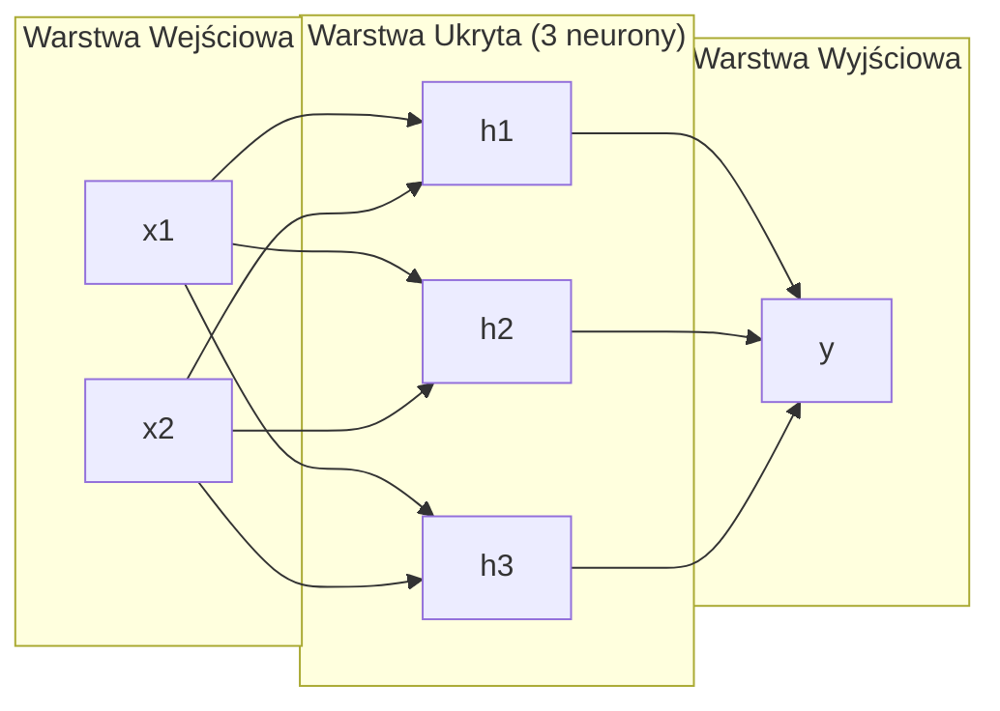
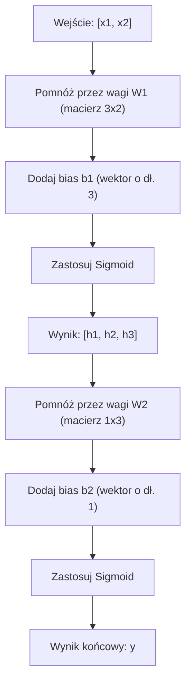

# Sieci wielowarstwowe i propagacja w przód (Multi-Layer Networks and Forward Pass)

> Pojedynczy neuron wykreśla linię prostą. Połącz je ze sobą, a narysujesz wszystko.

**Typ:** Budowa
**Języki:** Python
**Wymagania wstępne:** Faza 01 (Podstawy matematyczne), Lekcja 03.01 (Perceptron)
**Czas:** ~90 minut

## Cele nauczania

- Zbudowanie od podstaw sieci wielowarstwowej z klasami `Layer` (Warstwa) i `Network` (Sieć), która wykonuje pełną propagację w przód (forward pass).
- Śledzenie wymiarów macierzy na każdym etapie przetwarzania przez warstwy sieci i identyfikowanie niezgodności kształtów (wymiarów).
- Zrozumienie, w jaki sposób złożenie nieliniowych funkcji aktywacji pozwala sieci uczyć się nieliniowych (zakrzywionych) granic decyzyjnych.
- Rozwiązanie problemu XOR za pomocą architektury 2-2-1 z ręcznie dostrojonymi wagami i aktywacją sigmoidalną.

## Problem

Pojedynczy neuron wykreśla linię. To wszystko. Jedna prosta linia przechodząca przez Twoje dane. Niemal każdy rzeczywisty problem w sztucznej inteligencji – rozpoznawanie obrazów, rozumienie języka naturalnego, gra w Go – wymaga nieliniowych granic decyzyjnych (krzywych). Układanie neuronów w warstwy to sposób, w jaki te krzywe uzyskujemy.

W 1969 roku Minsky i Papert dowiedli, że ograniczenie perceptronu jest fundamentalne: jednowarstwowa sieć nie jest w stanie nauczyć się funkcji logicznej XOR. To nie kwestia "trudności" w uczeniu – jest to matematycznie niemożliwe. Tabela prawdy dla XOR umieszcza wartości [0,1] i [1,0] w jednej klasie, a [0,0] i [1,1] w drugiej. Żadna pojedyncza linia prosta nie jest w stanie ich rozdzielić.

Odkrycie to zamroziło finansowanie badań nad sieciami neuronowymi na ponad dekadę. Z dzisiejszej perspektywy rozwiązanie wydaje się oczywiste: należy zrezygnować z pojedynczej warstwy. Zbudować stos z kilku warstw. Pierwsza warstwa przekształci dane wejściowe w nowe cechy, a kolejna, korzystając z tych nowych cech, podejmie decyzję, której pojedyncza prosta nigdy by nie podjęła.

Taka struktura nazywana jest siecią wielowarstwową (multi-layer network). Stanowi ona fundament współczesnego uczenia głębokiego (deep learning) i leży u podstaw niemal każdego systemu wdrażanego obecnie na produkcję. Propagacja w przód (forward pass) – czyli przepływ danych od wejścia, przez warstwy ukryte, aż po wygenerowanie wyniku końcowego – to mechanizm, który zaraz zbudujesz od zera.

## Koncepcja

### Warstwy: Wejściowa, Ukryte, Wyjściowa

Wielowarstwowa sieć składa się z trzech rodzajów warstw:

**Warstwa wejściowa (Input layer)** – w rzeczywistości to nie jest pełnoprawna warstwa obliczeniowa. Stanowi punkt wejścia surowych danych (raw data). Mając dwie cechy wejściowe, otrzymujemy dwa węzły wejściowe; na tym etapie nie odbywa się jeszcze żadne przetwarzanie.

**Warstwy ukryte (Hidden layers)** – to tutaj wykonywana jest właściwa praca. Neurony w tej warstwie pobierają sygnały wyjściowe z warstwy poprzedniej, mnożą je przez wagi, dodają wyraz wolny (bias), a następnie przepuszczają wynik przez funkcję aktywacji. Nazywamy je "ukrytymi", ponieważ ich wewnętrzne stany i aktywacje nie są bezpośrednio widoczne w danych uczących, w przeciwieństwie do wejścia i pożądanego wyjścia.

**Warstwa wyjściowa (Output layer)** – dostarcza ostateczną odpowiedź sieci. W przypadku klasyfikacji binarnej stosuje się tutaj pojedynczy neuron z aktywacją sigmoidalną. Jeśli sieć ma dokonywać wyboru spośród wielu klas, warstwa ta powinna posiadać tyle neuronów wyjściowych, ile jest dostępnych klas.



Powyżej przedstawiono model (sieć) o architekturze 2-3-1: 2 wejścia, 1 warstwa ukryta z 3 neuronami oraz warstwa wyjściowa z 1 neuronem. Każde połączenie ma przypisaną własną wagę (weight), a ponadto każdy neuron (poza wejściowymi) posiada własny wyraz wolny (bias).

Zbiór wygenerowanych wartości to tzw. stan ukryty (hidden state) warstwy. Może on zmieniać swój wymiar: podczas przetwarzania słów reprezentacja może rosnąć, np. do 768 wartości przechowujących "znaczenie słowa". Z drugiej strony, przy analizie obrazów o wysokiej rozdzielczości wymiar reprezentacji stopniowo maleje wraz z głębokością sieci, kompresując informacje wejściowe do mniejszej, lecz bogatszej semantycznie postaci.

### Neurony i funkcje aktywacji

Zadaniem neuronu jest wykonanie trzech kroków:
1. Pomnożenie każdego sygnału wejściowego przez odpowiadającą mu wagę.
2. Zsumowanie tych iloczynów (w tym kroku do sumy dodawany jest również wyraz wolny - bias).
3. Przepuszczenie otrzymanej wartości (z) przez nieliniową funkcję aktywacji (activation function).

Obecnie skupimy się na funkcji aktywacji sigmoidalnej (sigmoid):

```
sigmoid(z) = 1 / (1 + e^(-z))
```

Funkcja ta ściska (normalizuje) dowolną wartość rzeczywistą, przyporządkowując jej wynik z przedziału (0,1). Kiedy suma ważona jest duża i dodatnia, wynik zbliża się do 1. Kiedy jest bardzo niska i ujemna, zbliża się do 0. Wartość zero zwraca równe 0.5. To właśnie te płynne i ciągłe przejścia umożliwiają proces uczenia się. W przeciwieństwie do klasycznego perceptronu z twardą, skokową funkcją progową, sigmoid posiada niezerowy gradient (pochodną) w całym przedziale użyteczności.

### Propagacja w przód (Forward Pass): Jak obliczane są wyniki sieci

Kiedy sieć otrzymuje dane wejściowe i przetwarza je warstwa po warstwie aż do wygenerowania ostatecznego wyniku, proces ten nazywamy propagacją w przód (forward pass). Są to po prostu obliczenia sieci w kierunku od wejścia do wyjścia, bez procesu uczenia.



Trzy operacje wykonywane jednocześnie (z wykorzystaniem rachunku macierzowego):
```
z = W * input + b       (transformacja liniowa)
a = sigmoid(z)           (aktywacja)
```

Dane przechodzą przez kolejne warstwy aż do uzyskania odpowiedzi sieci.

### Wymiary macierzy

Rozumienie "wymiarów" (kształtów tensorów) jest kluczem do sukcesu w deep learningu; to one odpowiadają za 90% błędów podczas implementacji. Rozważmy naszą przykładową sieć (2-3-1):

| Krok | Działanie | Wymiary Parametrów | Wymiar Wyniku |
|------|-----------|------------|-------------|
| Wejście (Input)| x | -- | (2,) |
| Warstwa liniowa 1 | W1 * x + b1 | W1: (3, 2), b1: (3,) | (3,) |
| Aktywacja 1 | sigmoid(z1) | -- | (3,) |
| Warstwa liniowa 2 | W2 * h + b2 | W2: (1, 3), b2: (1,) | (1,) |
| Aktywacja 2 | sigmoid(z2) | -- | (1,) |

Macierz wag (W) dla danej warstwy zawsze ma wymiary (liczba_neuronów_obecnej_warstwy, liczba_neuronów_poprzedniej_warstwy). Jeśli wymiary te (kształty) nie będą się zgadzać podczas mnożenia, w kodzie wystąpi trudny do znalezienia błąd.

### Twierdzenie o uniwersalnej aproksymacji (Universal Approximation Theorem)

W 1989 roku George Cybenko udowodnił niezwykle istotną właściwość sztucznych sieci neuronowych: sieć posiadająca zaledwie jedną warstwę ukrytą o odpowiednio dużej liczbie neuronów oraz nieliniową funkcję aktywacji, jest w stanie dowolnie dobrze aproksymować (przybliżać) każdą ciągłą funkcję. 

Niestety, szeroka, jednowarstwowa sieć jest często mało wydajna w porównaniu z sieciami "głębokimi" (Deep Neural Networks). Modele o większej liczbie warstw zazwyczaj radzą sobie z modelowaniem złożonych zależności znacznie lepiej, wymagając sumarycznie mniejszej liczby parametrów i optymalizując mniejsze fragmenty rozwiązania na każdym etapie przetwarzania.

### Składalność (Composability)

Sieci neuronowe buduje się modułowo. Są niczym klocki LEGO. Można stworzyć sieć pełniącą funkcję Enkodera (np. w systemie rozponawania mowy Whisper), która zamienia sygnał na wektor cech, a następnie dołączyć do niej sieć pełniącą funkcję Dekodera. Podobnie buduje się nowoczesne LLM (często opierające się wyłącznie na Dekoderze) oraz modele klasy BERT (bazujące wyłącznie na Enkoderze).

## Zbuduj to

Tym razem nie skorzystamy z gotowych bibliotek typu NumPy. Wszystko zaimplementujemy samodzielnie od zera.

### Krok 1: Aktywacja Sigmoidalna

```python
import math

def sigmoid(x):
    x = max(-500.0, min(500.0, x))
    return 1.0 / (1.0 + math.exp(-x))
```

Ograniczenie (clamp) zakresu do [-500, 500] zapobiega występowaniu błędów numerycznych związanych z przepełnieniem podczas potęgowania (`math.exp(1000)` = błąd `OverflowError`).

### Krok 2: Klasa warstwy (Layer)

Najcięższą obliczeniowo częścią jest mnożenie sum z wagami. Gdy sieć przeprowadza operację liniową ( y = Wx + b ), stanowi to niemal 90% całej pracy wykonywanej przez system. 

Poniższa klasa przechowuje "wagi" (weights) i "obciążenia" (biases). Wywołanie metody `forward` aplikuje wagi do danych wejściowych, po czym aktywuje wynik funkcją sigmoid.

```python
class Layer:
    def __init__(self, n_inputs, n_neurons, weights=None, biases=None):
        if weights is not None:
            self.weights = weights
        else:
            import random
            self.weights = [
                [random.uniform(-1, 1) for _ in range(n_inputs)]
                for _ in range(n_neurons)
            ]
        if biases is not None:
            self.biases = biases
        else:
            self.biases = [0.0] * n_neurons

    def forward(self, inputs):
        self.last_input = inputs
        self.last_output = []
        for neuron_idx in range(len(self.weights)):
            z = sum(
                w * x for w, x in zip(self.weights[neuron_idx], inputs)
            )
            z += self.biases[neuron_idx]
            self.last_output.append(sigmoid(z))
        return self.last_output
```

Wagi i warstwy są przechowywane jako macierze (listy list). Ich kształt to (n_neurons, n_inputs). Każdy rząd odpowiada wagom wejściowym jednego neuronu. Operacja "Forward" przetwarza te wejścia, wylicza sumę z dodanym obciążeniem (bias) i aktywuje ją sigmoidem.

### Krok 3: Sieć (Network)

Klasa ta spina warstwy w całość i wywołuje je sekwencyjnie.

```python
class Network:
    def __init__(self, layers):
        self.layers = layers

    def forward(self, inputs):
        current = inputs
        for layer in self.layers:
            current = layer.forward(current)
        return current
```

Oto i kompletny układ: przepływ danych w przód i z powrotem. Przechodzi przez każdą przypiętą warstwę.

### Krok 4: Rozwiązanie problemu XOR

Tak jak w Lekcji 01, dla funkcji logicznych AND, OR czy NAND. Budujemy architekturę 2-2-1! Dwa wejścia, ukryta warstwa z 2 węzłami oraz 1 węzeł wyjściowy.

```python
hidden = Layer(
    n_inputs=2,
    n_neurons=2,
    weights=[[20.0, 20.0], [-20.0, -20.0]],
    biases=[-10.0, 30.0],
)

output = Layer(
    n_inputs=2,
    n_neurons=1,
    weights=[[20.0, 20.0]],
    biases=[-30.0],
)

xor_net = Network([hidden, output])

xor_data = [
    ([0, 0], 0),
    ([0, 1], 1),
    ([1, 0], 1),
    ([1, 1], 0),
]

for inputs, expected in xor_data:
    result = xor_net.forward(inputs)
    predicted = 1 if result[0] >= 0.5 else 0
    print(f"  {inputs} -> {result[0]:.6f} (w zaokrągleniu: {predicted}, oczekiwane: {expected})")
```

Celowo dobrane "ekstremalne" wartości wag i biasów, w połączeniu z sigmoidalną funkcją aktywacji zachowują się niemal jak ostra "ściana" decyzyjna. Pierwszy ukryty neuron działa tu na zasadzie bramki OR, a drugi pełni rolę bramki NAND. Warstwa wyjściowa łączy te wartości logicznie funkcją AND, ostatecznie uzyskując pożądane wyjście XOR.

### Krok 5: Nieliniowe granice decyzyjne i problem koła

O wiele trudniejszym wyzwaniem dla sieci jest klasyfikacja punktów układających się w kształt koła – decydując, czy dany punkt leży wewnątrz czy na zewnątrz okręgu o promieniu 0.5 względem środka układu współrzędnych. Perceptron całkowicie by tu poległ z powodu niemożności wykreślenia nieliniowej granicy decyzyjnej.

```python
import random
import math

random.seed(42)

data = []
for _ in range(200):
    x = random.uniform(-1, 1)
    y = random.uniform(-1, 1)
    label = 1 if (x * x + y * y) < 0.25 else 0
    data.append(([x, y], label))

circle_net = Network([
    Layer(n_inputs=2, n_neurons=8),
    Layer(n_inputs=8, n_neurons=1),
])
```

Dla losowo zainicjalizowanych wag model nie będzie skuteczny, mimo że sama propagacja w przód działa bez zarzutu. Trenowanie i adaptację tych wag przeprowadzimy za pomocą algorytmu "wstecznej propagacji błędu" (Backpropagation) w kolejnej lekcji.

```python
correct = 0
for inputs, expected in data:
    result = circle_net.forward(inputs)
    predicted = 1 if result[0] >= 0.5 else 0
    if predicted == expected:
        correct += 1

print(f"Dokładność przy losowych wagach: {correct}/{len(data)} ({100*correct/len(data):.1f}%)")
```

Losowe wagi skutkują skutecznością bliską rzutowi monetą. Jednak po lekcji 3 (szkolenie wag), ten okrągły zbiór danych przestanie być dla sieci jakimkolwiek problemem!


## Zastosowanie w praktyce

Biblioteka PyTorch implementuje dokładnie te same koncepcje pod spodem, pozwalając na napisanie całego tego kodu w zaledwie kilku linijkach:

```python
import torch
import torch.nn as nn

model = nn.Sequential(
    nn.Linear(2, 8),
    nn.Sigmoid(),
    nn.Linear(8, 1),
    nn.Sigmoid(),
)

x = torch.tensor([[0.0, 0.0], [0.0, 1.0], [1.0, 0.0], [1.0, 1.0]])
output = model(x)
print(output)
```

Moduł `nn.Linear(2, 8)` to odpowiednik naszej klasy `Layer`, posiadający 2 wejścia, 8 neuronów oraz aktywne z definicji wyrazy wolne (bias). `nn.Sigmoid()` to nasza metoda aktywacji. Klasa `nn.Sequential` zachowuje się dokładnie tak jak nasza klasa `Network`, ułatwiając płynny przepływ i propagację w przód.

Prawdziwa różnica ujawnia się w ogromnej wydajności obliczeniowej na akceleratorach GPU oraz w posiadaniu natywnego systemu automatycznego różniczkowania (autograd) kluczowego dla algorytmu propagacji wstecznej. Matematyka pozostaje w obu przypadkach niezmienna.

## Narzędzia

Następujący plik zawiera prompt pełniący rolę architekta, podpowiadający wymiary warstw w wielowarstwowych sieciach na produkcję:

- `outputs/prompt-network-architect.md`

Traktuj to jako cenny poradnik przy doborze węzłów pod rozwiązanie określonych problemów biznesowych i dobieraniu funkcji aktywacji.

## Ćwiczenia

1. Zbuduj sieć o architekturze 2-4-2-1 z dwiema warstwami ukrytymi. Przetestuj jej propagację w przód dla wejść bramki XOR z losowymi wagami.
2. Poeksperymentuj z rozmiarem warstwy ukrytej. Zmień liczbę neuronów w problemie koła z 8 na 2, a następnie na 32. Czy ma to znaczący wpływ na wynik działania propagacji w przód w nienauczonej sieci? Zapisz swoje wnioski.
3. Utwórz metodę `count_parameters()` wewnątrz klasy `Network`, która zsumuje wszystkie podlegające uczeniu wagi i bias'y we wszystkich warstwach w sieci. Jaka jest łączna liczba parametrów w słynnej architekturze 784-256-128-10 (często wykorzystywanej do klasyfikacji zbioru MNIST)?
4. Przeprowadź propagację w przód na modelu (3-4-4-2). Skonfiguruj sieć tak, aby jako wejście odbierała kanały kolorów RGB w znormalizowanej postaci (0.0 - 1.0), by wyłonić prosty klasyfikator dwóch barw.
5. Czym byś zamienił "gładką" nieliniowość, jaką jest sigmoid, by przy mniejszych wartościach ucinał wszystko do zera? Jak zachowałaby się sieć?

## Kluczowe pojęcia

| Termin | Potocznie | Właściwe znaczenie |
|------|----------------|----------------------|
| Propagacja w przód (Forward pass) | "Uruchamianie modelu" | Popychanie danych wejściowych przez każdą warstwę -- mnożenie przez wagi, dodawanie obciążenia, aktywacja -- w celu wygenerowania wyniku |
| Warstwa ukryta (Hidden layer) | "Środkowa część sieci" | Każda warstwa znajdująca się między wejściem a wyjściem, której wartości nie są bezpośrednio obserwowane w zbiorze danych |
| Sieć wielowarstwowa (Multi-layer network) | "Głęboka sieć neuronowa" | Warstwy neuronów ułożone kaskadowo jedna po drugiej, gdzie wyjście poprzedniej staje się wejściem następnej |
| Funkcja aktywacji (Activation function) | "Nieliniowość" | Operacja nakładana na wynik transformacji liniowej, umożliwiająca modelowanie złożonych, nieliniowych granic decyzyjnych |
| Sigmoid | "Krzywa S" | Funkcja f(x) = 1/(1+e^(-x)), kompresująca każdą liczbę rzeczywistą do przedziału (0,1), ciągła i wszędzie różniczkowalna |
| Macierz wag (Weight matrix) | "Parametry" | Tabela W o wymiarach (neurony_obecnej_warstwy, neurony_poprzedniej_warstwy) zawierająca możliwe do wyuczenia siły połączeń |
| Wektor obciążeń (Bias vector) | "Przesunięcie" | Wektor wartości dodawany po mnożeniu przez macierz wag; zapobiega sytuacji wygenerowania wyjścia równego zero, gdy sygnały wejściowe są równe zero |
| Uniwersalna aproksymacja | "Sieci potrafią nauczyć się wszystkiego" | Twierdzenie o uniwersalnej aproksymacji mówi o tym, że pojedyncza warstwa ukryta potrafi aproksymować każdą ciągłą funkcję, o ile sieć jest odpowiednio wielka |
| Transformacja liniowa | "Operacja macierzowa" | Obliczenia postaci z = W*x + b dokonywane w obrębie neurona przed nałożeniem nieliniowej funkcji aktywacji |
| Granica decyzyjna (Decision boundary) | "Punkt decyzyjny klasyfikacji" | Powierzchnia lub przestrzeń w dziedzinie, która oddziela decyzje o przyporządkowaniu do klas i warunkuje punkt wyjścia |
