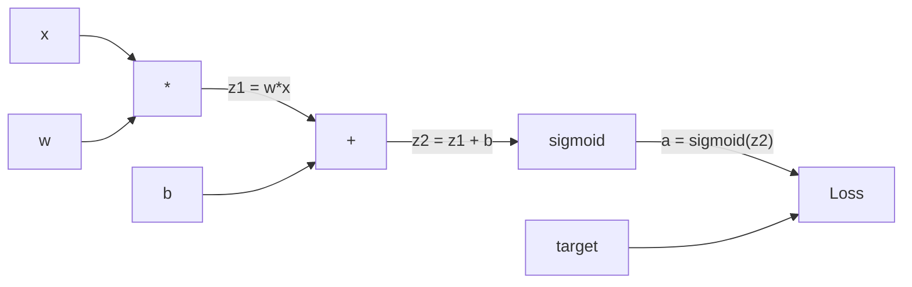
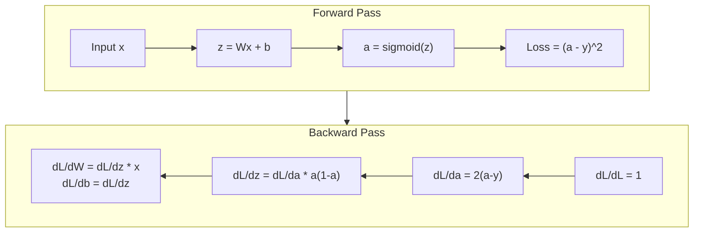
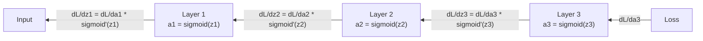

# Propagacja wsteczna od podstaw

> Propagacja wsteczna (backpropagation) jest algorytmem, który umożliwia uczenie się. Bez niej sieci neuronowe są tylko kosztownymi generatorami liczb losowych.

**Typ:** Build
**Języki:** Python
**Wymagania wstępne:** Lekcja 03.02 (Sieci wielowarstwowe)
**Czas:** ~120 minut

## Cele nauki

- Implementacja silnika autograd opartego na obiektach Value, który buduje graf obliczeniowy i wyznacza gradienty za pomocą sortowania topologicznego
- Wyprowadzenie przejścia wstecznego (backward pass) dla dodawania, mnożenia i sigmoidy za pomocą reguły łańcuchowej
- Trenowanie sieci wielowarstwowej na problemie XOR i klasyfikacji okręgu wyłącznie za pomocą własnego silnika propagacji wstecznej napisanego od zera
- Zidentyfikowanie problemu zanikającego gradientu w głębokich sieciach z sigmoidą i wyjaśnienie, dlaczego gradienty zmniejszają się wykładniczo

## Problem

Twoja sieć ma jedną warstwę skrytą z 768 wejściami i 3072 wyjściami. To 2 359 296 wag. Sieć dokonała błędnej predykcji. Które wagi spowodowały ten błąd? Testowanie każdej wagi indywidualnie wymagałoby 2,3 miliona przejść w przód (forward pass). Propagacja wsteczna oblicza wszystkie 2,3 miliona gradientów w jednym przejściu wstecznym. To nie jest optymalizacja. To różnica między tym, co da się wytrenować, a tym, co jest niemożliwe.

Naiwne podejście: weź jedną wagę, zmień ją o niewielką wartość, ponownie wykonaj przejście w przód i zmierz, czy strata wzrosła czy spadła. To daje gradient dla tej jednej wagi. Teraz zrób to dla każdej wagi w sieci. Pomnóż przez tysiące kroków treningowych i miliony punktów danych. Potrzebowałbyś czasu geologicznego, aby wytrenować coś użytecznego.

Propagacja wsteczna rozwiązuje ten problem. Jedno przejście w przód, jedno przejście wstecz, wszystkie gradienty obliczone. Sztuczka polega na regule łańcuchowej z analizy matematycznej, zastosowanej systematycznie do grafu obliczeniowego. To algorytm, który uczynił głębokie uczenie praktycznym. Bez niego wciąż utknęlibyśmy na problemach zabawkowych.

## Koncepcja

### Reguła łańcuchowa zastosowana do sieci

Reguła łańcuchowa była już omawiana w Fazie 01, Lekcji 05. Krótkie przypomnienie: jeśli y = f(g(x)), to dy/dx = f'(g(x)) * g'(x). Mnożysz pochodne wzdłuż łańcucha.

W sieci neuronowej "łańcuchem" jest sekwencja operacji od wejścia do straty (loss). Każda warstwa stosuje wagi, dodaje obciążenia (bias) i przechodzi przez funkcję aktywacji. Funkcja straty porównuje wynik końcowy z wartością docelową. Propagacja wsteczna przechodzi przez ten łańcuch w odwrotnym kierunku, obliczając, jak każda operacja przyczyniła się do błędu.

### Grafy obliczeniowe

Każde przejście w przód buduje graf. Każdy węzeł jest operacją (mnożenie, dodawanie, sigmoida). Każda krawędź przenosi wartość w przód i gradient w tył.



Przejście w przód: wartości przepływają od lewej do prawej. x i w produkują z1 = w*x. Dodanie b daje z2. Sigmoida daje aktywację a. Porównujemy a z wartością docelową y za pomocą funkcji straty.

Przejście wstecz: gradienty przepływają od prawej do lewej. Zaczynamy od dL/da (jak strata zmienia się względem aktywacji). Pomnóż przez da/dz2 (pochodna sigmoidy). To daje dL/dz2. Rozdzielamy na dL/db (które jest równe dL/dz2, ponieważ z2 = z1 + b) i dL/dz1. Następnie dL/dw = dL/dz1 * x oraz dL/dx = dL/dz1 * w.

Każdy węzeł w grafie ma jedno zadanie podczas przejścia wstecznego: weź gradient nadchodzący z góry, pomnóż przez swoją lokalną pochodną i przekaż go dalej.

### Przejście w przód a przejście wstecz



Przejście w przód zapisuje każdą wartość pośrednią: z, a, wejścia do każdej warstwy. Przejście wsteczne potrzebuje tych zapisanych wartości do obliczenia gradientów. To jest kompromis między pamięcią a obliczeniami leżący w samym centrum propagacji wstecznej. Wymieniasz pamięć (przechowywanie aktywacji) na szybkość (jedno przejście zamiast milionów).

### Przepływ gradientu przez sieć

Dla sieci 3-warstwowej gradienty przepływają łańcuchowo przez każdą warstwę:



W każdej warstwie gradient jest mnożony przez pochodną sigmoidy. Pochodna sigmoidy to a * (1 - a), która osiąga maksimum 0,25 (gdy a = 0,5). Po trzech warstwach gradient został pomnożony co najwyżej przez 0,25^3 = 0,0156. Po dziesięciu warstwach: 0,25^10 = 0,000001.

### Zanikające gradienty

To jest problem zanikającego gradientu (vanishing gradient). Sigmoida ściska swoje wyjście do przedziału między 0 i 1. Jej pochodna jest zawsze mniejsza niż 0,25. Ułóż w stos wystarczająco wiele warstw z sigmoidą i gradienty zanikną do zera. Wcześniejsze warstwy uczą się bardzo słabo, ponieważ otrzymują gradienty bliskie zeru.

```
sigmoid(z):     Output range [0, 1]
sigmoid'(z):    Max value 0.25 (at z = 0)

After 5 layers:   gradient * 0.25^5 = 0.001x original
After 10 layers:  gradient * 0.25^10 = 0.000001x original
```

Dlatego głębokie sieci z sigmoidą są praktycznie niemożliwe do wytrenowania. Naprawa -- ReLU i jego warianty -- jest tematem Lekcji 04. Na razie zrozum, że propagacja wsteczna działa idealnie. Problem leży w tym, przez co ona "przechodzi".

### Wyprowadzenie gradientów dla sieci 2-warstwowej

Konkretna matematyka dla sieci z wejściem x, warstwą skrytą z sigmoidą, warstwą wyjściową z sigmoidą i stratą MSE.

Przejście w przód:
```
z1 = W1 * x + b1
a1 = sigmoid(z1)
z2 = W2 * a1 + b2
a2 = sigmoid(z2)
L = (a2 - y)^2
```

Przejście wsteczne (zastosowanie reguły łańcuchowej krok po kroku):
```
dL/da2 = 2(a2 - y)
da2/dz2 = a2 * (1 - a2)
dL/dz2 = dL/da2 * da2/dz2 = 2(a2 - y) * a2 * (1 - a2)

dL/dW2 = dL/dz2 * a1
dL/db2 = dL/dz2

dL/da1 = dL/dz2 * W2
da1/dz1 = a1 * (1 - a1)
dL/dz1 = dL/da1 * da1/dz1

dL/dW1 = dL/dz1 * x
dL/db1 = dL/dz1
```

Każdy gradient jest iloczynem lokalnych pochodnych, śledzonych od straty w tył. To wszystko, czym jest propagacja wsteczna.

## Zbuduj to

### Krok 1: Węzeł Value

Każda liczba w naszych obliczeniach staje się obiektem Value. Przechowuje swoje dane, swój gradient oraz informację, jak został utworzony (dzięki czemu wie, jak obliczyć gradienty w tył).

```python
class Value:
    def __init__(self, data, children=(), op=''):
        self.data = data
        self.grad = 0.0
        self._backward = lambda: None
        self._children = set(children)
        self._op = op

    def __repr__(self):
        return f"Value(data={self.data:.4f}, grad={self.grad:.4f})"
```

Jeszcze bez gradientu (0.0). Jeszcze bez funkcji wstecznej (no-op). `_children` śledzi, które obiekty Value wyprodukowały ten obiekt, dzięki czemu możemy później topologicznie posortować graf.

### Krok 2: Operacje z funkcjami wstecznymi

Każda operacja tworzy nowy obiekt Value i definiuje, jak gradienty przepływają przez niego w tył.

```python
def __add__(self, other):
    other = other if isinstance(other, Value) else Value(other)
    out = Value(self.data + other.data, (self, other), '+')

    def _backward():
        self.grad += out.grad
        other.grad += out.grad

    out._backward = _backward
    return out

def __mul__(self, other):
    other = other if isinstance(other, Value) else Value(other)
    out = Value(self.data * other.data, (self, other), '*')

    def _backward():
        self.grad += other.data * out.grad
        other.grad += self.data * out.grad

    out._backward = _backward
    return out
```

Dla dodawania: d(a+b)/da = 1, d(a+b)/db = 1. Tak więc obie wartości wejściowe otrzymują gradient wyjścia bezpośrednio.

Dla mnożenia: d(a*b)/da = b, d(a*b)/db = a. Każde wejście otrzymuje wartość drugiego wejścia pomnożoną przez gradient wyjścia.

`+=` jest tu kluczowe. Dany obiekt Value może być użyty w wielu operacjach. Jego gradient jest sumą gradientów ze wszystkich ścieżek.

### Krok 3: Sigmoida i strata

```python
import math

def sigmoid(self):
    x = self.data
    x = max(-500, min(500, x))
    s = 1.0 / (1.0 + math.exp(-x))
    out = Value(s, (self,), 'sigmoid')

    def _backward():
        self.grad += (s * (1 - s)) * out.grad

    out._backward = _backward
    return out
```

Pochodna sigmoidy: sigmoid(x) * (1 - sigmoid(x)). Wartość sigmoid(x) = s obliczyliśmy już podczas przejścia w przód. Wykorzystujemy ją ponownie. Żadnej dodatkowej pracy.

```python
def mse_loss(predicted, target):
    diff = predicted + Value(-target)
    return diff * diff
```

MSE dla jednego wyjścia: (predicted - target)^2. Odejmowanie wyrażamy jako dodawanie z zanegowanym obiektem Value.

### Krok 4: Przejście wsteczne

Sortowanie topologiczne zapewnia, że przetwarzamy węzły w odpowiednim porządku -- gradient węzła jest w pełni zakumulowany, zanim go propagujemy dalej.

```python
def backward(self):
    topo = []
    visited = set()

    def build_topo(v):
        if v not in visited:
            visited.add(v)
            for child in v._children:
                build_topo(child)
            topo.append(v)

    build_topo(self)
    self.grad = 1.0
    for v in reversed(topo):
        v._backward()
```

Zaczynamy od straty (gradient = 1,0, ponieważ dL/dL = 1). Przechodzimy w tył przez posortowany graf. Funkcja `_backward` każdego węzła przekazuje gradienty do jego dzieci.

### Krok 5: Warstwa i sieć

```python
import random

class Neuron:
    def __init__(self, n_inputs):
        scale = (2.0 / n_inputs) ** 0.5
        self.weights = [Value(random.uniform(-scale, scale)) for _ in range(n_inputs)]
        self.bias = Value(0.0)

    def __call__(self, x):
        act = sum((wi * xi for wi, xi in zip(self.weights, x)), self.bias)
        return act.sigmoid()

    def parameters(self):
        return self.weights + [self.bias]


class Layer:
    def __init__(self, n_inputs, n_outputs):
        self.neurons = [Neuron(n_inputs) for _ in range(n_outputs)]

    def __call__(self, x):
        out = [n(x) for n in self.neurons]
        return out[0] if len(out) == 1 else out

    def parameters(self):
        params = []
        for n in self.neurons:
            params.extend(n.parameters())
        return params


class Network:
    def __init__(self, sizes):
        self.layers = []
        for i in range(len(sizes) - 1):
            self.layers.append(Layer(sizes[i], sizes[i + 1]))

    def __call__(self, x):
        for layer in self.layers:
            x = layer(x)
            if not isinstance(x, list):
                x = [x]
        return x[0] if len(x) == 1 else x

    def parameters(self):
        params = []
        for layer in self.layers:
            params.extend(layer.parameters())
        return params

    def zero_grad(self):
        for p in self.parameters():
            p.grad = 0.0
```

Neuron przyjmuje wejścia, oblicza ważoną sumę plus obciążenie (bias) i stosuje sigmoidę. Inicjalizacja wag jest skalowana przez sqrt(2/n_inputs), aby zapobiec saturacji sigmoidy w głębszych sieciach. Warstwa (Layer) jest listą neuronów. Sieć (Network) jest listą warstw. Metoda `parameters()` zbiera wszystkie uczące się obiekty Value, dzięki czemu możemy je aktualizować.

### Krok 6: Trenowanie na XOR

```python
random.seed(42)
net = Network([2, 4, 1])

xor_data = [
    ([0.0, 0.0], 0.0),
    ([0.0, 1.0], 1.0),
    ([1.0, 0.0], 1.0),
    ([1.0, 1.0], 0.0),
]

learning_rate = 1.0

for epoch in range(1000):
    total_loss = Value(0.0)
    for inputs, target in xor_data:
        x = [Value(i) for i in inputs]
        pred = net(x)
        loss = mse_loss(pred, target)
        total_loss = total_loss + loss

    net.zero_grad()
    total_loss.backward()

    for p in net.parameters():
        p.data -= learning_rate * p.grad

    if epoch % 100 == 0:
        print(f"Epoch {epoch:4d} | Loss: {total_loss.data:.6f}")

print("\nXOR Results:")
for inputs, target in xor_data:
    x = [Value(i) for i in inputs]
    pred = net(x)
    print(f"  {inputs} -> {pred.data:.4f} (expected {target})")
```

Obserwuj, jak strata maleje. Od losowych predykcji do prawidłowych wyjść XOR, kierowanych w całości przez propagację wsteczną obliczającą gradienty i przesuwającą wagi w odpowiednim kierunku.

### Krok 7: Klasyfikacja okręgu

W Lekcji 02 ręcznie dostrajałeś wagi dla klasyfikacji okręgu. Teraz pozwól sieci nauczyć się ich samodzielnie.

```python
random.seed(7)

def generate_circle_data(n=100):
    data = []
    for _ in range(n):
        x1 = random.uniform(-1.5, 1.5)
        x2 = random.uniform(-1.5, 1.5)
        label = 1.0 if x1 * x1 + x2 * x2 < 1.0 else 0.0
        data.append(([x1, x2], label))
    return data

circle_data = generate_circle_data(80)

circle_net = Network([2, 8, 1])
learning_rate = 0.5

for epoch in range(2000):
    random.shuffle(circle_data)
    total_loss_val = 0.0
    for inputs, target in circle_data:
        x = [Value(i) for i in inputs]
        pred = circle_net(x)
        loss = mse_loss(pred, target)
        circle_net.zero_grad()
        loss.backward()
        for p in circle_net.parameters():
            p.data -= learning_rate * p.grad
        total_loss_val += loss.data

    if epoch % 200 == 0:
        correct = 0
        for inputs, target in circle_data:
            x = [Value(i) for i in inputs]
            pred = circle_net(x)
            predicted_class = 1.0 if pred.data > 0.5 else 0.0
            if predicted_class == target:
                correct += 1
        accuracy = correct / len(circle_data) * 100
        print(f"Epoch {epoch:4d} | Loss: {total_loss_val:.4f} | Accuracy: {accuracy:.1f}%")
```

Używamy tu online SGD -- aktualizujemy wagi po każdej próbce, a nie po zakumulowaniu całej paczki danych (batch). To szybciej przełamuje symetrię i zapobiega saturacji sigmoidy na całym krajobrazie straty. Przemieszanie danych w każdej epoce zapobiega temu, by sieć zapamiętała ich kolejność.

Żadnego ręcznego dostrajania. Sieć sama odkrywa kołową granicę decyzyjną. To jest moc propagacji wstecznej: definiujesz architekturę, funkcję straty i dane. Algorytm sam wyznacza wagi.

## Wykorzystaj to

PyTorch robi wszystko powyższe w kilku liniach. Podstawowa idea jest identyczna -- autograd buduje graf obliczeniowy podczas przejścia w przód i przechodzi go w tył, aby obliczyć gradienty.

```python
import torch
import torch.nn as nn

model = nn.Sequential(
    nn.Linear(2, 4),
    nn.Sigmoid(),
    nn.Linear(4, 1),
    nn.Sigmoid(),
)
optimizer = torch.optim.SGD(model.parameters(), lr=1.0)
criterion = nn.MSELoss()

X = torch.tensor([[0,0],[0,1],[1,0],[1,1]], dtype=torch.float32)
y = torch.tensor([[0],[1],[1],[0]], dtype=torch.float32)

for epoch in range(1000):
    pred = model(X)
    loss = criterion(pred, y)
    optimizer.zero_grad()
    loss.backward()
    optimizer.step()

print("PyTorch XOR Results:")
with torch.no_grad():
    for i in range(4):
        pred = model(X[i])
        print(f"  {X[i].tolist()} -> {pred.item():.4f} (expected {y[i].item()})")
```

`loss.backward()` to twoje `total_loss.backward()`. `optimizer.step()` to twoje ręczne `p.data -= lr * p.grad`. `optimizer.zero_grad()` to twoje `net.zero_grad()`. Ten sam algorytm, implementacja klasy przemysłowej. PyTorch obsługuje akcelerację GPU, mieszaną precyzję, checkpointing gradientów i setki typów warstw. Ale przejście wsteczne to ta sama reguła łańcuchowa zastosowana do tego samego grafu obliczeniowego.

Trenowanie wykonuje przejście w przód, następnie przejście wsteczne, a potem aktualizuje wagi. Wnioskowanie (inference) wykonuje tylko przejście w przód. Bez gradientów, bez aktualizacji. To rozróżnienie jest istotne, ponieważ wnioskowanie jest tym, co dzieje się w produkcji. Kiedy wywołujesz API takie jak Claude czy GPT, wykonujesz wnioskowanie -- twój prompt przepływa w przód przez sieć, a tokeny wychodzą na drugim końcu. Żadne wagi się nie zmieniają. Zrozumienie propagacji wstecznej jest ważne, ponieważ to ona ukształtowała każdą wagę w tej sieci.

## Wypchnij to

Ta lekcja produkuje:
- `outputs/prompt-gradient-debugger.md` -- wielorazowy prompt do diagnozowania problemów z gradientami (zanikające, eksplodujące, NaN) w każdej sieci neuronowej

## Ćwiczenia

1. Dodaj metodę `__sub__` do klasy Value (a - b = a + (-1 * b)). Następnie zaimplementuj metodę `__neg__`. Zweryfikuj, że gradienty są prawidłowe, porównując je z ręcznymi obliczeniami dla prostego wyrażenia, takiego jak (a - b)^2.

2. Dodaj metodę `relu` do Value (wyjście max(0, x), pochodna to 1, jeśli x > 0, w przeciwnym razie 0). Zamień sigmoidę na relu w warstwach skrytych i wytrenuj sieć na XOR ponownie. Porównaj szybkość zbieżności. Powinieneś zobaczyć szybsze trenowanie -- to wprowadzenie do Lekcji 04.

3. Zaimplementuj metodę `__pow__` dla Value dla wykładników całkowitych. Użyj jej, aby zamienić `mse_loss` na właściwe wyrażenie `(predicted - target) ** 2`. Zweryfikuj, że gradienty są zgodne z oryginalną implementacją.

4. Dodaj przycinanie gradientów (gradient clipping) do pętli treningowej: po wywołaniu `backward()` przycinaj wszystkie gradienty do zakresu [-1, 1]. Wytrenuj głębszą sieć (4+ warstwy z sigmoidą) i porównaj krzywe straty z przycinaniem i bez niego. To jest twoja pierwsza linia obrony przed eksplodującymi gradientami.

5. Zbuduj wizualizację: po wytrenowaniu na XOR wypisz gradient każdego parametru w sieci. Zidentyfikuj, która warstwa ma najmniejsze gradienty. To demonstruje problem zanikającego gradientu, o którym przeczytałeś w sekcji Koncepcja.

## Kluczowe terminy

| Termin | Co się mówi | Co to faktycznie znaczy |
|------|----------------|----------------------|
| Backpropagation (propagacja wsteczna) | "Sieć się uczy" | Algorytm, który oblicza dL/dw dla każdej wagi, stosując regułę łańcuchową w tył przez graf obliczeniowy |
| Graf obliczeniowy | "Struktura sieci" | Skierowany graf acykliczny, w którym węzły są operacjami, a krawędzie przenoszą wartości (w przód) i gradienty (w tył) |
| Reguła łańcuchowa | "Mnożenie pochodnych" | Jeśli y = f(g(x)), to dy/dx = f'(g(x)) * g'(x) -- matematyczny fundament propagacji wstecznej |
| Gradient | "Kierunek najszybszego wzrostu" | Pochodna cząstkowa straty względem parametru -- mówi, jak zmienić ten parametr, aby zmniejszyć stratę |
| Zanikający gradient (vanishing gradient) | "Głębokie sieci się nie uczą" | Gradienty zmniejszają się wykładniczo, gdy propagują się przez warstwy z funkcjami aktywacji nasycającymi się, takimi jak sigmoida |
| Przejście w przód (forward pass) | "Uruchamianie sieci" | Obliczanie wyjścia z wejść poprzez sekwencyjne stosowanie operacji każdej warstwy i zapisywanie wartości pośrednich |
| Przejście wsteczne (backward pass) | "Obliczanie gradientów" | Przechodzenie przez graf obliczeniowy w odwrotnym kierunku, akumulowanie gradientów w każdym węźle za pomocą reguły łańcuchowej |
| Współczynnik uczenia (learning rate) | "Jak szybko się uczy" | Skalar kontrolujący wielkość kroku przy aktualizacji wag: w_new = w_old - lr * gradient |
| Sortowanie topologiczne | "Właściwy porządek" | Uporządkowanie węzłów grafu, w którym każdy węzeł występuje po wszystkich węzłach, od których zależy -- zapewnia, że gradienty są w pełni zakumulowane przed propagacją |
| Autograd | "Automatyczne różniczkowanie" | System, który buduje grafy obliczeniowe podczas obliczeń w przód i automatycznie obliczania gradienty -- to, co robi silnik PyTorch |

## Dalsze materiały

- Rumelhart, Hinton & Williams, "Learning representations by back-propagating errors" (1986) -- artykuł, który spopularyzował propagację wsteczną i otworzył drogę do trenowania sieci wielowarstwowych
- 3Blue1Brown, seria "Neural Networks" (https://www.youtube.com/playlist?list=PLZHQObOWTQDNU6R1_67000Dx_ZCJB-3pi) -- najlepsze wizualne wyjaśnienie propagacji wstecznej i przepływu gradientów przez sieci
</content>
