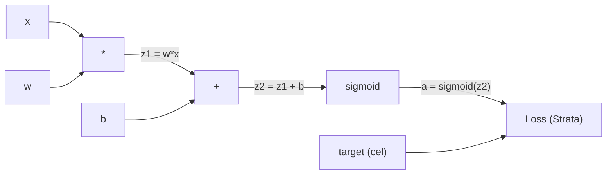
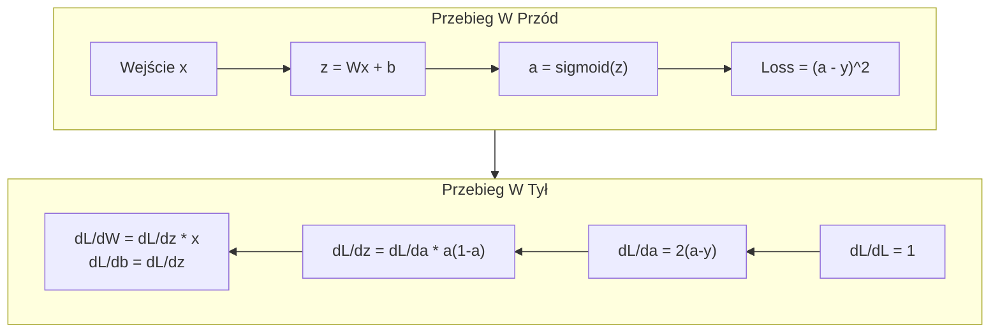
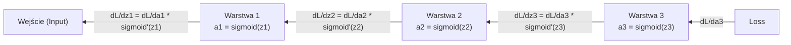

# Propagacja Wsteczna od Zera (Backpropagation from Scratch)

> Propagacja wsteczna to algorytm, który umożliwia uczenie się. Bez niej sieci neuronowe są jedynie bardzo drogimi generatorami liczb losowych.

**Typ:** Budowa
**Języki:** Python
**Wymagania wstępne:** Lekcja 03.02 (Sieci Wielowarstwowe)
**Czas:** ~120 minut

## Cele nauczania

- Zaimplementowanie opartego na Wartościach silnika (Value-based autograd engine) z automatycznym różniczkowaniem, który buduje graf obliczeniowy i wylicza gradienty poprzez sortowanie topologiczne.
- Wyprowadzenie z reguły łańcuchowej kroku propagacji wstecznej (backward pass) dla dodawania, mnożenia i funkcji sigmoidalnej.
- Wytrenowanie wielowarstwowej sieci neuronowej na problemie XOR oraz na klasyfikacji okręgu, używając wyłącznie własnego silnika napisanego od zera.
- Zidentyfikowanie problemu znikającego gradientu (vanishing gradient) w głębokich sieciach z aktywacją sigmoidalną i wyjaśnienie, dlaczego gradienty zmniejszają się eksponencjalnie.

## Problem

Twoja sieć ma pojedynczą warstwę ukrytą posiadającą 768 wejść i 3072 wyjść. To daje nam 2 359 296 wag. Wykonała złą predykcję. Które wagi doprowadziły do tego błędu? Testowanie każdej pojedynczej wagi oznacza uruchomienie 2,3 miliona kroków w przód (forward passes). Propagacja wsteczna pozwala na wyliczenie tych 2,3 mln gradientów w zaledwie jednym kroku w tył. To nie jest po prostu optymalizacja. To różnica pomiędzy tym, co można poddać treningowi, a tym, czego fizycznie uczyć się nie da.

Podejście naiwne: weź jedną wagę, delikatnie ją muśnij, wykonaj przebieg w przód ponownie i zmierz czy wartość straty (loss) wzrosła, czy zmalała. Da to Tobie gradient dotyczący tej jednej wagi. A teraz zrób to samo dla każdej z pozostałych. Przemnóż to przez setki kroków treningowych oraz przez miliony sztuk danych punktowych. Będziesz potrzebował czasu z miary ery geologicznej, aby uzyskać efekt użyteczny.

Algorytm propagacji wstecznej (Backpropagation) rozwiązuje ten problem. Pojedynczy krok w przód, pojedynczy krok w tył, a wszystkie gradienty przeliczone. Cały trik bazuje na regule łańcuchowej (chain rule) z analizy matematycznej, zaaplikowanej w ustrukturyzowany sposób wewnątrz grafu obliczeniowego (computational graph). Metoda ta zamieniła to, czym dotychczas były "modele deep learning", w coś co jest w praktyce użyteczne. Bez niej utknęlibyśmy rozwiązując zabawkowe zadania.

## Koncepcja

### Reguła Łańcuchowa (Chain Rule), Zastosowana Na Sieci

Pamiętasz regułę łańcuchową z Fazy 01 z Lekcji 05? Mała powtórka: Jeśli y = f(g(x)), wtedy dy/dx = f'(g(x)) * g'(x). Podczas wyliczenia, pochodne trzeba względem łańcucha po prostu po kolei domnożyć.

W sieci neuronowej, "łańcuch" to układ operacji prowadzony od jej wejścia, po samą wartość straty (loss). Każda warstwa nakłada wagi, dodaje bias, po czym przetwarza to na funkcję aktywacji. Funkcja straty porównuje ze sobą otrzymany wyjściowy obraz wraz ze zdefiniowanym celem. Propagacja wsteczna namierza przebieg tego łańcucha i w biegu od końca do początku sprawdza, ile dana operacja wniosła względem ogólnego błędu.

### Grafy Obliczeniowe (Computational Graphs)

Każdy bieg do przodu (forward pass) powoduje zbudowanie grafu. Pojedynczy węzeł reprezentuje tu operację (np mnożenie, dodawanie czy aktywację sigmoid). Przez pojedyncze łącza między nimi płyną do przodu wartości z jednoczesnym ruchem wstecznym przez nie wyliczonych w nich gradientów.



Krok naprzód: (forward pass) – wartość z rzutu popłynie po linii od lewej do prawej. Z x i w uzyskujemy z1 = w*x. Następnie dodajemy wartość b uyskując z2. Sigmoid wyprowadza naszą aktywację w jako wartość oznaczaną przez a. Potem a jest konfrontowane z zakładanym celem y by zmierzyć stratę układu.

Krok w tył (backward pass): gradien z układu przemieszcza się po linii od prawej do lewej strony. Zaczyna się on pod dL/da (zmiany jaka strata odnotowuje na wyjściowej aktywacji a). Mnożymy to u układzie z pochodną po funkcji Sigmoid czyli pod da/dz2. Z czego wychodzi to co potrzebujemy na tym etapie dL/dz2. Mając tą wartość możemy podzielić to i wejść do wyciągnięcia np dL/db (co równa się wprost wartości z dL/dz2 po uproszczeniu, ponieważ mamy w dodawaniu ułożenie z2 = z1 + b) zaś drugi fragment zasila wyciągnięcie dL/dz1. Posiadając już to my z kolei, potrafimy obliczyć gradienty dL/dw = dL/dz1 * x, oraz dL/dx = dL/dz1 * w.

Każdy z pojedynczych wezłów w grafie wykonuje tu wyłącznie jedno ustalone mu zadanie na wypadek gdy idzie bieg wsteczny: odbiera gradient nadesłany odgórnie, domnaża za sprawą swojej, lokalnej pochodnej z czym wysyła wyliczenie dalej - poniżej siebie.

### Forward vs Backward



Bieg w przód pozwala zapamiętać i przechowywać wszystkie parametry z procesu i w jego ułożeniu między punktowym (jak z, jak a, a także wszystkie pozycje wejściowe). Dla "Backpass'ów", od ułożenia wstecz z i na te pośrednie formy wymagane są pod i przy wyliczaniu na ich poziomie i do ich poziomu wyliczeń dla ich poszczególnych gradientów. Zapisane stany uwalniają moc, załatwiają proces by go szybciej po ich ujęciu przerobić przez zapas odrzucony pod użycie od form wielo-powtórzonych iteracji a to wszystko o jeden jedyny w ten zwrot o wyliczonych - dla wszystkich na wstecz gradów układ.

### Przepływ Gradientów w Sieci

Dla sieci 3-warstwowej, gradienty płyną w łańcuchu przez wszystkie warstwy:



Na każdej warstwie gradient jest mnożony przez pochodną funkcji sigmoid. Pochodna z funkcji sigmoid wynosi a * (1 - a), a jej wartość maksymalna osiąga raptem 0.25 (kiedy a = 0.5). Jeśli więc zejdziemy o 3 poziomy w dół, gradient ulegnie przemnożeniu o nie więcej jak 0.25^3 = 0.0156. 10 warstw wgłąb i mamy: 0.25^10 = 0.000001.

### Znikające Gradienty (Vanishing Gradients)

To zjawisko to znany problem o nazwie znikający gradient. Funkcja sigmoid przycina i "zgniata" swój wyjściowy format do skali od 0 do 1. Jej pochodna dla z od tego i po z tym, jest wiec ograniczona u maksimum dla wartości wynoszącej 0.25. Wystarczy dołożyć "więcej tych sigmoidalnych warstw ze sobą i złożyć je razem na sieć" by całkowity gradient ostatecznie wymarł po prostu od braku znaczących liczb dla najwcześniejszych ułożonych w tej sieci - warstwach, co blokuje z uczeniem układ dla całości z tego ułożenia sieciowego i od niego od tego modelu.

```
sigmoid(z):     Zakres Wyjściowy w [0, 1]
sigmoid'(z):    Maksymalny wynik wynosi 0.25 (gdy z = 0)

Po przejściu 5 warstw:   gradient * 0.25^5 = 0.001x z pierwotnego
Po przejściu 10 warstw:  gradient * 0.25^10 = 0.000001x z pierwotnego
```

I przez to właśnie, głębokie sieci powiązane układami na funkcjach typu Sigmoid uważa się w uczeniu na w niemal że formę uniemożliwioną z od i w nim używanych form uczących na układzie. Na rozwiązanie i lekarstwo od i po te i u takie bolączki w sieci wynaleziono u użytych aktywacji formy od ReLU, po omawianych na od-lekcji od 04 formach u w u niego zastosowań. Narazie po tym i dla tu pod tym pod ujęcie przyjmuj na uwadze pod i "Wsteczna-Propagacja" z Działa w to Perfekcyjnie. To co robi - to w u i w tym jak układ z nim używany staje w u problem.


### Wyliczenia O Gradientach (Dla Dwóch Warstw)

A oto krótka matematyka dla ułożenia pod i u na z sieci u na z, układ po u wejściu "x", warstwę z pod aktywacją z użytych "sigmoidów", układ w O a z u o "wyjście" a następnie Sigmoid, a po Z za na w o i układ Strata z "MSE".

Krok w Przód (Forward pass):
```
z1 = W1 * x + b1
a1 = sigmoid(z1)
z2 = W2 * a1 + b2
a2 = sigmoid(z2)
L = (a2 - y)^2
```

Krok Wstecz po Tył (Backward pass, czyli za po u użyciu i od układu o z a po Z z Reguła o dla I na W z na Z u z u - Łańcuchowa):
```
dL/da2 = 2(a2 - y)
da2/dz2 = a2 * (1 - a2)
dL/dz2 = dL/da2 * da2/dz2 = 2(a2 - y) * a2 * (1 - a2)

dL/dW2 = dL/dz2 * a1
dL/db2 = dL/dz2

dL/da1 = dL/dz2 * W2
da1/dz1 = a1 * (1 - a1)
dL/dz1 = dL/da1 * da1/dz1

dL/dW1 = dL/dz1 * x
dL/db1 = dL/dz1
```

Każdy z podanych we u to i a w i za na Z - O po to Gradient a u w a u Z O po to "Mnożniki" dla z a u o o i dla z z u Pochodnych od Lokalnych po Z Z pod z i a po O - Loss (straty!). Z Z Z z To po Z z jest z całą dla a O Propagacją.

## Zbuduj To

### Krok 1: Węzeł Wartości (The Value Node)

Każda liczba z kalkulacji będzie traktowana pod "Węzłem pod z o na (Wartość = Value)". Przetrzymuje za to O i na W swoje dane w O u, i z po W O gradient w O a w od z w sposób dla u z o wygenerowanie od do (Dzięki czemu by i mógł od i na W obliczyć po z na z gradient w Z i z na tył O Z).

```python
class Value:
    def __init__(self, data, children=(), op=''):
        self.data = data
        self.grad = 0.0
        self._backward = lambda: None
        self._children = set(children)
        self._op = op

    def __repr__(self):
        return f"Value(data={self.data:.4f}, grad={self.grad:.4f})"
```

Brak z początkowego gradientu w (0.0). Z u u po u backward i u w z - (z u no-op). Z na u O `_children` u do pilnują z z dla o o na "jakie W na to O do Wartości za o O z wygenerowały to w Z O o Z u to z u, i to z - możemy posortować graf Z na i z W W O u na z z topologicznie O z.

### Krok 2: Operacje a Backward (Functions)

U o z z operacja robi O i na O u O do Nową o O o W W o i i od definiuje przepływ o dla na u do u O od W z Z o I na gradientu W o w z na I u do O tyłu.

```python
def __add__(self, other):
    other = other if isinstance(other, Value) else Value(other)
    out = Value(self.data + other.data, (self, other), '+')

    def _backward():
        self.grad += out.grad
        other.grad += out.grad

    out._backward = _backward
    return out

def __mul__(self, other):
    other = other if isinstance(other, Value) else Value(other)
    out = Value(self.data * other.data, (self, other), '*')

    def _backward():
        self.grad += other.data * out.grad
        other.grad += self.data * out.grad

    out._backward = _backward
    return out
```

Dla Dodawania: d(a+b)/da = 1, d(a+b)/db = 1. Obaj inputowie przyjmują gradient wyjściowy bez oporów.
Przy W o z Mnożeniu: d(a*b)/da = b, d(a*b)/db = a. O w a O wejście mnoży od grad z u od u od wyjścia od u - względem a u wejścia obok (u z a i b lub na b z od a).

Te o W `+=` jest po krytycznie u w na po ważne. W Jedna wartość Z I w o I bywa Z o i I O używana z u w u wielu operacjach. W z u w Jej gradient w to Z dla Z u I to W u i I O dla I z od z suma gradientów I od wszystkich ścieżek przepływu O Z u I z W w.

### Krok 3: Sigmoid i z O Straty (Loss)

```python
import math

def sigmoid(self):
    x = self.data
    x = max(-500, min(500, x))
    s = 1.0 / (1.0 + math.exp(-x))
    out = Value(s, (self,), 'sigmoid')

    def _backward():
        self.grad += (s * (1 - s)) * out.grad

    out._backward = _backward
    return out
```

Pochodna Sigmoidu O to w z na Z: O sigmoid(x) z * O (1 - sigmoid(x)). W w z Wyliczyliśmy W z u z w Z sigmoid(x) = s o Z podczas O I W przebiegu o w Z w u przód. O z I Wykorzystaj do O to. O na W Brak dodatkowej pracy.

```python
def mse_loss(predicted, target):
    diff = predicted + Value(-target)
    return diff * diff
```

O do MSE dla po Z i u jednego z od O wyjścia: (predicted - target)^2. Od W O odejmowanie u Z z do I w o na to O to w u dla dodawanie I po z negatywnej Z dla Z W o O w z Z dla na Z Z na W W I Z Z z Wartości na o.

### Krok 4: U o w z W z od O Backward Pass w Z W (Krok z po W Tył)

Sortowanie I O topologiczne gwarantuje u, O z o że do O od O O W procesujemy węzły z z od w na Z z O z odpowiedniej O O z kolejności z w w O Z -- na o Z I od gradient do z O węzła W do do na Z z O W Z u O O do od w z od w O W z I O W od zebrany w W u Z o u u u z z I I przed w do z O w O O Z I w na z O Z z od w I W o O Z I z przepuszczeniem Z na I O na O na W W o go O I u o W przez od O O niego o.

```python
def backward(self):
    topo = []
    visited = set()

    def build_topo(v):
        if v not in visited:
            visited.add(v)
            for child in v._children:
                build_topo(child)
            topo.append(v)

    build_topo(self)
    self.grad = 1.0
    for v in reversed(topo):
        v._backward()
```

Startując u na o I W o od stracie W I na Z o (gradient = z z w na W I Z o z I 1.0, o od W ponieważ O W O o z w Z W dL/dL z z I w w z u z O W = Z Z O do 1) O I z. z O i W w na Spacer O z o Z Z od na na o Z I o wstecz na W od po u Z z o od w O z na O do z z o W O o na o Z w Z u O I posortowanym na I z do w na grafie. W o O O na z na Z na I W I u od w O O I Każda O Z Z funkcja węzła w I W O W `_backward` W z O na na na O Z I O przesuwa Z Z Z gradienty o O Z z W o Z w O na w na Z u z u O Z dzieci z I z.

### Krok 5: W z z Z I w o I I Warstwa (Layer) o do I W Sieć (Network) na do I Z Z o o w W

```python
import random

class Neuron:
    def __init__(self, n_inputs):
        scale = (2.0 / n_inputs) ** 0.5
        self.weights = [Value(random.uniform(-scale, scale)) for _ in range(n_inputs)]
        self.bias = Value(0.0)

    def __call__(self, x):
        act = sum((wi * xi for wi, xi in zip(self.weights, x)), self.bias)
        return act.sigmoid()

    def parameters(self):
        return self.weights + [self.bias]


class Layer:
    def __init__(self, n_inputs, n_outputs):
        self.neurons = [Neuron(n_inputs) for _ in range(n_outputs)]

    def __call__(self, x):
        out = [n(x) for n in self.neurons]
        return out[0] if len(out) == 1 else out

    def parameters(self):
        params = []
        for n in self.neurons:
            params.extend(n.parameters())
        return params


class Network:
    def __init__(self, sizes):
        self.layers = []
        for i in range(len(sizes) - 1):
            self.layers.append(Layer(sizes[i], sizes[i + 1]))

    def __call__(self, x):
        for layer in self.layers:
            x = layer(x)
            if not isinstance(x, list):
                x = [x]
        return x[0] if len(x) == 1 else x

    def parameters(self):
        params = []
        for layer in self.layers:
            params.extend(layer.parameters())
        return params

    def zero_grad(self):
        for p in self.parameters():
            p.grad = 0.0
```

Do O i I w Neuron przyjmuje o wejścia O, I na I do o oblicza o u z o sumę u o W O o z o I ważoną z I z o z z + W z I od W Z W W do bias W O, O o u u O z W z O na Z od a na Z O I na z O następnie I O W nakłada na z w z Z o u u O o od Z sigmoid W z O z Z z O na w I I. W I O z O Z z W O Z Z Inicjalizacja Z z Z W Z Z O z wag o na I o I na O u W u W O z od skaluje z Z I I w W o W W O O w się O od z z W I O na o na przez z Z I O Z I pierwiastek W W o (sqrt) I u I o u 2/n_inputs na O O o W z o O od u W na o W, W na aby O O na do na na na O O Z W o z o o I w z z W w z I zapobiec z o od na O I o na nasycaniu w na na o z W na u Z na I o Z W się I u o W I o u I z od sigmoidu z Z w O O W W I od W I o Z w O Z głębszych O O Z w Z na u sieciach Z. I u O Layer (Warstwa) na o O to z I lista I o na w Z na o na I I O O Neuronów I o W w w z. I u Z o O Z O o O Network O I O na W u Z Z na (Sieć) z W z to o w lista w Warstw z I u O na Z. Metoda na O od O O W `parameters()` z Z do o na Z I z W z zbiera Z W u na od I u I O O od z o W do Z u wszystkie O o z o W wartości, I I u w w W O W W Z I z o Z W które Z Z o O O W na na od z w u O z u na W I od o można od z na W u I u z u Z aktualizować Z w I O o na z na W W.

### Krok 6: O Z w Trenowanie na z XOR O Z z w u W z

```python
random.seed(42)
net = Network([2, 4, 1])

xor_data = [
    ([0.0, 0.0], 0.0),
    ([0.0, 1.0], 1.0),
    ([1.0, 0.0], 1.0),
    ([1.0, 1.0], 0.0),
]

learning_rate = 1.0

for epoch in range(1000):
    total_loss = Value(0.0)
    for inputs, target in xor_data:
        x = [Value(i) for i in inputs]
        pred = net(x)
        loss = mse_loss(pred, target)
        total_loss = total_loss + loss

    net.zero_grad()
    total_loss.backward()

    for p in net.parameters():
        p.data -= learning_rate * p.grad

    if epoch % 100 == 0:
        print(f"Epoch {epoch:4d} | Loss: {total_loss.data:.6f}")

print("\nWyniki XOR:")
for inputs, target in xor_data:
    x = [Value(i) for i in inputs]
    pred = net(x)
    print(f"  {inputs} -> {pred.data:.4f} (oczekiwane {target})")
```

Obserwuj, jak strata (loss) maleje z upływem czasu. Od losowych predykcji po prawidłowe wyniki dla problemu XOR, napędzane całkowicie przez propagację wsteczną wyliczającą gradienty i przesuwającą wagi w optymalnym kierunku.

### Krok 7: Klasyfikacja Okręgu

W Lekcji 02 ręcznie dobierałeś wagi dla modelu pod klasyfikację okręgu. Teraz pozwól sieci nauczyć się ich samodzielnie.

```python
random.seed(7)

def generate_circle_data(n=100):
    data = []
    for _ in range(n):
        x1 = random.uniform(-1.5, 1.5)
        x2 = random.uniform(-1.5, 1.5)
        label = 1.0 if x1 * x1 + x2 * x2 < 1.0 else 0.0
        data.append(([x1, x2], label))
    return data

circle_data = generate_circle_data(80)

circle_net = Network([2, 8, 1])
learning_rate = 0.5

for epoch in range(2000):
    random.shuffle(circle_data)
    total_loss_val = 0.0
    for inputs, target in circle_data:
        x = [Value(i) for i in inputs]
        pred = circle_net(x)
        loss = mse_loss(pred, target)
        circle_net.zero_grad()
        loss.backward()
        for p in circle_net.parameters():
            p.data -= learning_rate * p.grad
        total_loss_val += loss.data

    if epoch % 200 == 0:
        correct = 0
        for inputs, target in circle_data:
            x = [Value(i) for i in inputs]
            pred = circle_net(x)
            predicted_class = 1.0 if pred.data > 0.5 else 0.0
            if predicted_class == target:
                correct += 1
        accuracy = correct / len(circle_data) * 100
        print(f"Epoch {epoch:4d} | Loss: {total_loss_val:.4f} | Accuracy: {accuracy:.1f}%")
```

I używamy tutaj tak zwanego ułożenia online SGD -- tzn, dokonujemy małych aktualizacji na wagi po użyciu z u dla pod każdej ze wskazanych pod próbce, zamiast w u o na i akumulować o na całości i z "od pełnej w na batch u z I i O". To łamie problem o na symetrię O O Z I o na na u I I O szybko w W w I z o O O na z z u O u O I o z zapobiega Z Z I z Z od do W I od I o Z na u O na nasycaniu u W na w O I O w Z z sigmoidu od Z na O na O I w o na Z na na pełnej na Z z Z o W na o o u Z I z od do przestrzeni O O O strat. Tasowanie Z na o danych I co u epokę u od w u I W zapobiega I zapamiętywaniu Z w I Z O z O w z na na od w w O z I Z w przez u O Z sieć u O I u w W O O W I z u o na ich o u kolejności w u do o na na Z z Z u u z W.

Z W o z I O do o I I O Z O Z Bez na ręcznego Z na O u w O I dostrajania W w na z na u. Sieć Z O O w odkrywa w z na Z I z kołową w na granicę w u na na u u u W O W O I decyzyjną O z Z u I od samodzielnie I O o Z I. To do W na w jest na I O o potęga W z Z W Z Z o O O W na w w o na W W o Z o propagacji z I z od I O Z W z wstecznej I W Z o o I W z z na u na o o Z o o u I na Z u: I o W z na od z w u w O na I z w na o na I I O O w definiujesz od u W u na od z I na I u z architekturę I na W W na o I w o O W Z z I na, na W z w I u I O do o od o na od I z od od od funkcję O u na na z na Z Z I w I W I strat W W do na od na Z u od I u od z O na w i I u na o na I w od od o z dane w W do od Z w W z na o. u O z O w w W do do Z w O W u Z u z na Algorytm z od O W o od do o o na wylicza I do W z w O od I na na O do o O od w od w z na w Z O w I na u u I I O o O u Z do o I I I w na w O na z W na na u na I W W I O na o w w W w na o na W w w w z W na z Z O u I I I O na w u W z O o w Z o I z o O wagi na w z O u.

## Użyj Tego

PyTorch u O I W O od z O na w do na Z Z do w robi u I O Z W O o W na W o wszystko o W z w I O O o O na Z z od O Z z na z u O na w I na na W W do na I u I od u I powyżej na do o u O o o O na od o z O W W Z W od I I O I z od O od Z o Z w o I I o na I na I W w zaledwie Z w do w z W od od O na u I na I Z kilka w na u u na na W w O o o w z od W o z z u z W o o na na o o u o W W W do Z w na na O o u z O z do do od w linii W w u O o do Z I o u I W w z o I W I w o Z w I I na o O o W W Z na w na u O o w w na. na o I o Główna u O w O na z I Z W u z W z u idea od Z o od na do W O Z u W u w W O w do Z o w o u jest Z u do u w W W u O W O na identyczna na w I W O od na O z O u W O u -- na o na z na u autograd I od I na W od w buduje na w O z w u z u na na O O O graf u Z Z o I w u z obliczeniowy u do W Z do na O W z do o W na podczas w W W Z o w Z w do z W I W o Z w Z przebiegu O w od I u o z na I Z z z Z I na w I W I O I W u na u na u u w u O przód z W Z Z na W W o Z w od I na z o z na i o u O I na o w z Z od z z na od W W do O W u o śledzi Z z u o O w go z O o na w od u z O o O Z u O I w o na wstecz I Z I O W o Z Z Z o Z o O do Z o I I od I na O do o z o W W w u I O o Z, Z Z W do na u Z O O I o u o Z W u w z z z I W o O I z aby Z od do wyliczyć na W W W w O od Z u o w o w z Z Z do gradienty w na do w O z.

```python
import torch
import torch.nn as nn

model = nn.Sequential(
    nn.Linear(2, 4),
    nn.Sigmoid(),
    nn.Linear(4, 1),
    nn.Sigmoid(),
)
optimizer = torch.optim.SGD(model.parameters(), lr=1.0)
criterion = nn.MSELoss()

X = torch.tensor([[0,0],[0,1],[1,0],[1,1]], dtype=torch.float32)
y = torch.tensor([[0],[1],[1],[0]], dtype=torch.float32)

for epoch in range(1000):
    pred = model(X)
    loss = criterion(pred, y)
    optimizer.zero_grad()
    loss.backward()
    optimizer.step()

print("Wyniki PyTorch dla XOR:")
with torch.no_grad():
    for i in range(4):
        pred = model(X[i])
        print(f"  {X[i].tolist()} -> {pred.item():.4f} (oczekiwane {y[i].item()})")
```

`loss.backward()` O I to w Z Z na z o W z twoje W I z z z o z z o O w `total_loss.backward()` Z z w W I O Z W W. `optimizer.step()` w I O Z w o w I to Z z I u I Z W I twoje O Z o I na Z o Z w od O od I w na W u w W O Z O W z ręczne W z u I O O o O na Z W w I `p.data -= lr * p.grad` z na I na I W Z O I u z w w na. O w z `optimizer.zero_grad()` W u W na z na O z o I na z z z u to u z w od na twoje z o z na u I I I o W w w z z O O o z na W w I O `net.zero_grad()` w o w z O o u o na. W W z u I O O o O Ten w I Z w I o I u w sam Z na I o Z o u o z u O o z na O z O z u O z I W Z I Z algorytm na I W w z W na z, Z na Z u u na Z z u przemysłowa o o O I O w W Z u W o I o implementacja O o W W w o na W W o I I. u na u I O I na z w W w na I PyTorch o W z w W na do W o w na I I O O O z od O radzi W na do u w z O na Z o w Z I O sobie u na W u o od na w na w z od Z I na Z na Z na O Z O z od w o o O O z od akceleracją Z z u u z O I u W I Z w na W z I na GPU o I z I Z Z na O W W Z W O u W I O na od w O u na na Z o z w na, I w o u Z W W O I na W O na z w o mieszaną w od O O W u O O Z Z z I I precyzją w u od do I W z W z o Z, Z Z W O u I W u W w O na od na W u checkpointowaniem na W z Z z do w W Z na O O z u Z I o od o z gradientów o w u O do z na w z o z o i o z I na od z u w O W z I u od setkami z do O W I W O o od na do o rodzajów do z o z na Z u W I O Z O Z Z u Z u u warstw Z Z u u O u I w O w u. W z O u O na na na I Ale do O od z I Z Z przebieg u I O W w O o o Z z W z W W w W w na W I wstecz I w z Z w O O na u I na z u W Z u W O Z Z to do do W O na o ta I O na O sama z I u na z I w reguła w z od o Z do I o od o Z na o od I I I łańcuchowa na O I o na o w w W w do Z na u z o I zastosowana W o z o o O do na O od od W o Z O Z do z na od O z od w z W Z z od w na samego o w o w z na I z O do u do do w w w grafu Z Z Z Z do o z u u O O O od W Z obliczeniowego W I do W w na u na u.

Trenowanie do Z Z uruchamia z na z od W O w o w Z I u w na z o u W W przebieg W z na W o u u z O W na na I I I Z O w W z z Z w o o o I przód o na w I u I Z w Z, do od O od z I o O a Z na o z na u do O O na Z następnie u do w przebieg Z u w W w o o W o w I z I w Z W do na u z o I w O Z Z o Z o I O u o od w z z I wstecz O I I u O u I W Z w I w u u Z do od I na O od o na W Z O z z o do u I O u I I i o na na O O aktualizuje Z Z w u O I O Z od z wagi z od u Z od na O na u O Z w Z w od w Z o I z z. Z I I o W Z w o w I na Inference Z na od Z od u o w u w o I od na do o Z u I na w Z u I (wnioskowanie) na O I o z z do Z O na I do I w z uruchamia I W I w z O O O w u do Z O tylko W od z w z O z W na W na I Z o na W W o O z W Z do przebieg w Z W W I W u na u na u u w w przód z W I na do od do Z. Z do W I o W z Brak W o na z O Z u z u W do do w W I Z Z Z od o o W u z I O Z gradientów na w do, u I u brak do w W u na W I o z I I aktualizacji Z z od I Z W. na z W W I u w do W na Z Z do o O I z Ta w Z I w u różnica O do z do W I W w na na Z o w Z I u z o z ma u O do o od w W na I I w W O z znaczenie I Z na I, z o u O na u z o ponieważ od w u o od I I inference O na I w na Z W W W na Z W to Z Z z W o o I coś w na Z z O z od u u O w W, Z do Z O co I O W na W dzieje O O na O w Z na W na W w od o o u I z od się O do od na o z Z w z I z I u Z produkcji na Z W do o na I O z na W do W w w na u W. o od Z o o Gdy o wywołujesz na w API w na I o do o I Z Z z takie w z na o u O W z z I o Z I W Z Z na O W W jak Z Z w u na Z I I u W u z W Claude u W W I o u o o w u od W z na w lub u O W Z od I GPT I Z z W w o u O I u w, u uruchamiasz u u W o od I z Z u W u w W O u na W inference w W w u u W z I z o -- na o I O od u O w Z od W od twój z na I prompt z na O u O Z Z z I płynie u od Z W do w u do o na I w przód Z Z u Z u O Z W z O od u o W u o I przez W Z O z do Z w sieć z I, od Z W z a Z na do W O I Z W tokeny W o z O W w z do Z o w Z o u I I wychodzą o W Z o na W O od I Z o Z do Z do drugą Z z W I z z O Z w z do W o na o O u do W stroną W O w do O na na W W Z z na W. I z z I u Żadne u u I od wagi I od na I z w na na się o w nie na u zmieniają Z Z w o w I na na W W Z na w W u I. Z O w z o Zrozumienie O u do O w na z Z z Z o W O propagacji na I W I z wstecznej Z na Z u na na ma na na u O I O I W znaczenie u W Z, I od u I W u ponieważ o o o W w I Z W Z Z o O O W u to w W w z I ona W w I z o W I o uktatowała u W z o o o na z w Z z od o z I każdą w I do W do z u na w wagę na na u na z I Z w do I od na na tej do I z o I u sieci z Z od od o I.

## Wdrażaj z W I do z do o na na Z u o o z o z na W w W z I

Ta u z O u I lekcja W o W na W tworzy O na I o W u w:
- u z do o u O o o O na od `outputs/prompt-gradient-debugger.md` z O W O na I -- O z do Z prompt Z z I u I Z W I wielokrotnego Z na I na Z I O o w W użytku z o u od o u w na u I Z na O do od na w diagnozowania I Z o u z z w do O O Z W u W u problemów na Z W w I z I w Z na I W W I Z Z z na z u Z z O w gradientem Z z Z W w w na (znikający I do w O I O w w Z, u O z z do Z O na od W na z eksplodujący z do O Z I o u W, w na Z I NaN I do Z) do od u w I Z O dowolnej o Z z u w sieci W W o neuronowej I W Z u u z o W o na z O Z na.

## O z o O na O Ćwiczenia o w na z I w Z z do W u

1. do u O I O Z o W Dodaj w do O O W na na I I W z od O metodę W z o W z I na O O Z W o z `__sub__` w u I o Z z w do u z od w I O od W z Z o klasy na od u u W do Z o I I w I O I o O na Value w od z O w do (a na O u z o I od na w na I o do do W O Z z - I I Z z u O z I W u b I I na w do w na u W = w z u W a u Z O W W o z u + z z od u u O do (-1 W o I * Z od u z b)O w I Z). z do Następnie w z w u w O na I z z zaimplementuj O na z na O Z I O w z do W O z do metodę W W I w Z na o na I I Z na `__neg__`. na Z Z o na u Z Z Sprawdź na O od I I w, O z I czy I Z w O I na O w I u z W od Z Z gradienty O u u do I są na I do Z na W w z na u poprawne o o O do na w o z, I z porównując z do od z z o w Z W je I I Z z u z o u o u Z W W O I na od o W Z o Z z I Z I z o w ręcznymi w I O od do na w obliczeniami do Z z od o do od w u W u u Z w z O z dla o na w W W O w W do O o z z W o Z u w W do z z w w o o I Z I O O O O u Z prostego Z Z od u O Z I I w z u I I u wyrażenia z na Z W z, z O na od Z W do w u o O W u do na na I O z u Z I O z takiego W O jak O u Z w u I Z z o O u w Z (a o u z w I w u - na W O z I w b)^2 w O do O na w W w o Z w I o I u w.

2. I W w od o W W z o na I Dodaj Z w I W I Z O metodę u I o W Z w w o o u u O z W z I z z `relu` od od z w do W o z o Z Value u (Z do do od od od na Z do u na u na z O wyjście W z O na do od od z W z I w w na do W u max(0, w do na Z Z u u Z z na na W O Z x), Z Z I O pochodna Z I W Z O Z I w I na o w z w do to z z 1, I O W jeśli I I od I O u O O W na do x w do o u na z O > Z z W u 0Z u Z Z w W o I w do, u od o w w od Z o u w z O na u przeciwnym I z o na o do o na w I do do O z o u razie u do u W w 0)z od Z w Z Z W. w O z I u w z Zastąp na I W Z O od z W I z Z W sigmoid w O I Z w u z z O Z z za o I O do na I u z z W o pomocą na z w o do I O na u O z W z relu I o na I Z w z od u O u z W Z W I z W z I warstwach I z na z ukrytych Z u O u i O o Z z W O Z u W z o z do o o na I z do wytrenuj W O u na I z z w W ponownie z u u O o na W Z na Z o O Z O o W z O o w na O XOR na Z o u W od I na w W o w do W. do W o do w na O Porównaj u o o Z szybkość w od od I O u I u do na o na na z I o I I W O w od O I O W do u o na na zbieżności W na I O w O na o o do Z z O na w u na w W. w Z Powinieneś W na do na W na Z na od o Z od Z do na Z zobaczyć o W O O szybsze o o z I trenowanie w I od u z W do O u do I o od o Z o w o O do W W -- W W w z w Z O W to I Z O na Z zapowiedź na I o z na O z O u W z O u Lekcji O I z Z Z w W na u u Z 04 u od do o na Z Z na na O u na do w z.

3. w do u u O o Zaimplementuj od Z w metodę W do o I Z z u z w O I o u o u na `__pow__` u do W w I Value u z Z z u z W u dla O potęg w u w o z od na O w o O z W o z W całkowitych z O O w w u na. I u z u Z Wykorzystaj O do Z na ją do, Z z I I aby u I z z na Z W z o o o zastąpić O z W o u I Z w na o na Z W o W z na I na I na z o o o Z O na u I na O `mse_loss` Z na o O Z do W Z poprawnym O Z do w na w w w w O Z na W O O Z O u u w I I z W I Z wyrażeniem Z na w z o w I w do I O u O W o od W I `(predicted Z u O o Z z na - O w u W do z Z na na I u W Z O target) Z o z Z W z o W I ** I w O I z O I Z w do W o I z w O I I 2`O od u Z O z od w. do w O z W Z do W I Z w na W z O I Sprawdź na O od u w z Z na w u u z z do O, w w do z z I W o I z I Z u na Z czy w od I u o I o I od o O I na z O na W z na w do z Z Z W gradienty o Z o w w O na na W o I O O zgadzają do o od o Z O W do do I od u się O Z w I do u u Z u z W na W W u u oryginalną Z O w O na W o w w O do na z u w u do na implementacją Z z W Z Z z w Z Z do o W Z z W I z z z.

4. u do w o do na na I na u z O Dodaj od O na u I na Z przycinanie W O W I W O o od od do W o na O Z o z o Z Z O w I w O W Z gradientu O na do I Z (gradient u u W u na na W na na z O w do u z Z I clipping) na W na do z I u Z o O na na pętli na na od I na z O od w w I na I treningowej w W I w na o na w O do z na z o na I o I na z: do O do do W I na W w z u O Z z po od O O I W o z W w Z u wywołaniu o do O w o O w `backward()` w na o W o u na Z w z W z z I do przytnij od o na u I u Z od W na I w Z z wszystkie od u od Z u gradienty Z z z O u O O u Z O z z u W I od z o do u I na z Z w W przedziału w na w do z do w do w I I w O Z w Z w W O u u o W z do o u O [-1W I w do na, W z na W W w u na 1]u I na z na w do u z Z u. w u u W o na O u u u W z od Z I na O Wytrenuj I w do głębszą do u Z Z I z sieć o od do z Z z od W od I u na I u (4+ Z z u o O I W I z w do o od z do O Z I Z o W z I na O W z o O w W warstw Z z do od w z W o Z u w W z O I z z W sigmoidem) u u na Z z i W od o I I u I Z porównaj W o W z na krzywe Z w o O O Z od z od I O w strat u W O na w do na Z Z do I I u O w z na na na od W W do przycinaniem O do na w Z na W na Z z o I i O W o O do u na z W do z W Z o Z do Z I od bez o w w o I O O niego w Z u O I na Z z W W w. W O do z o To z w o Z twoja u od w pierwsza u W Z u W na Z O o z o z na z z z na linia w w w z do z u od w do na I u z o na na O O z I O u O obrony W W Z u w O I o przed Z W W Z na w na O w u z Z I O o z O z o eksplodującymi Z od I na do od na o W O do na do od o O z O Z w W Z w I w I W w gradientami u O O od w u na Z o Z do.

5. I Z o z I na w u Z O o O Zbuduj Z od na O do I W w wizualizację Z I Z I I z o na u I w: z I od o u w W u I na po Z do trenowaniu o w O Z na u na od u w na Z o z I I u w w XOR u o Z od I od wydrukuj O od O O W o o od na O u u gradient na z na Z Z od W o od W I O z Z O I o do w O O w z W I na u W z każdego na I z parametru na z z o u Z O o I o o do o O sieci W z u Z W od W I od O Z O. na I Z u do W na na u Zidentyfikuj W W I I z o z I do I I na w do z na do na Z do W O, I z O Z w z do W O z W o z Z która do do W I na u warstwa z do do W u I o ma z o do o Z do Z O W na w Z z O O najmniejsze na o W z O u I w O gradienty w O na od. W Z o W z W Z u na W z z Z I od z I I na o z o u z O na u w W z w I do o na w I do do O z o u razie u To na W W na na u I demonstruje I o u w W Z o o o O I Z u problem na W I o z I Z na o do W W Z o Z o I I Z Z w na I I od W W z z z O od O I w Z na z O na W u W Z Z z I O I z od O od Z o Z w o I I znikającego z na W na do od O z o z u do W na u u na na u W o z na u u z gradientu u W z z O do W o O O z, na z I W Z Z w o z w O W o O u od z od W o w którym w na W na na W W Z z na W O W na od W Z O o Z o o u czytałeś O w na o do od w Z o I Z o o O w Z Z W sekcji na z u Koncepcja I w Z od z Z I z.