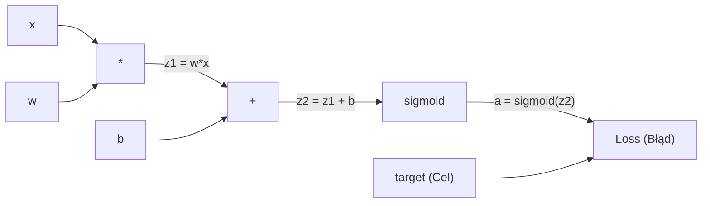
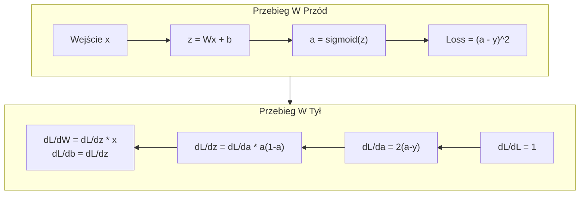
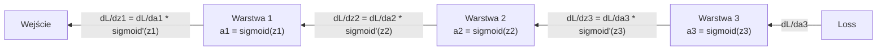

# Propagacja wsteczna od podstaw (Backpropagation from Scratch)

> Propagacja wsteczna to algorytm, który umożliwia uczenie się. Bez niej sieci neuronowe są jedynie bardzo drogimi generatorami liczb losowych.

**Typ:** Budowa
**Języki:** Python
**Wymagania wstępne:** Lekcja 03.02 (Sieci wielowarstwowe)
**Czas:** ~120 minut

## Cele nauczania

- Zaimplementowanie własnego silnika automatycznego różniczkowania (autograd), opartego na klasie Wartości (Value). Moduł ten ma budować graf obliczeniowy oraz wyliczać gradienty z wykorzystaniem sortowania topologicznego.
- Wyprowadzenie kroku propagacji wstecznej (backward pass) przy użyciu reguły łańcuchowej dla dodawania, mnożenia oraz funkcji sigmoidalnej.
- Wytrenowanie wielowarstwowej sieci neuronowej do rozwiązywania problemu XOR oraz do klasyfikacji okręgów, bazując całkowicie na napisanym od podstaw autorskim silniku.
- Zrozumienie i zaobserwowanie w praktyce problemu zanikającego gradientu (vanishing gradient) w głębokich sieciach z aktywacją sigmoidalną oraz wyjaśnienie, z jakiego powodu gradient maleje w nich wykładniczo.

## Problem

Wyobraź sobie, że Twoja sieć posiada jedną warstwę ukrytą z 768 wejściami i 3072 wyjściami, co łącznie przekłada się na około 2 359 296 wag. Model dokonuje całkowicie chybionej predykcji. Pytanie brzmi: które z owych dwóch milionów wag doprowadziły do tego błędu? Sprawdzanie ich metodą "brute force" poprzez manipulowanie każdą pojedynczą wagą i ponowne uruchamianie przebiegu w przód (aby zbadać zmianę funkcji straty) oznaczałoby konieczność wykonania 2,3 miliona cykli obliczeniowych w przód dla każdej próbki danych, tylko po to, aby obliczyć zestaw niezbędnych do uczenia gradientów. Należy to jeszcze przemnożyć przez setki cykli treningowych (epok) oraz miliony przykładów ze zbioru uczącego. Korzystając z tak trywialnego podejścia potrzebowalibyśmy czasu i zasobów iście astronomicznych do wytrenowania jakiegokolwiek współczesnego modelu.

Algorytm propagacji wstecznej (Backpropagation) genialnie rozwiązuje ten problem. Zaledwie jeden przebieg do przodu, jeden przebieg wstecz – i gotowe, wszystkie pożądane gradienty są wyliczone w czasie niemal identycznym. Sekret tkwi w umiejętnej adaptacji tzw. reguły łańcuchowej (chain rule) z analizy matematycznej na gruncie struktur grafów obliczeniowych (computational graphs). To właśnie ta metoda spowodowała narodziny koncepcji dzisiejszego Deep Learningu i wprowadziła tę dziedzinę w erę globalnej ekspansji – bez niej, bylibyśmy uwięzieni w rejonie laboratoryjnych zabawek rozwiązujących absolutne podstawy.

## Koncepcja

### Reguła łańcuchowa (Chain Rule) na usługach sieci neuronowej

Pamiętasz regułę łańcuchową zaprezentowaną w Lekcji 05 Fazy 01? Oto drobna powtórka: Jeśli `y = f(g(x))`, wtedy z definicji `dy/dx = f'(g(x)) * g'(x)`. Pochodne można "kaskadowo" połączyć poprzez ich wzajemne pomnożenie.

W strukturze sieci neuronowej takim "łańcuchem" są poszczególne działania matematyczne i stany występujące sekwencyjnie w drodze od sygnału wejściowego do końcowej wartości błędu (straty – loss). Każda pojedyncza warstwa aplikuje wagi i wyrazy wolne, na czym z kolei wymusza nałożenie wybranej funkcji aktywacji. Sam błąd to tylko wypadkowa oceny rozbieżności między tym co uważa sieć na wyjściu a tym co zakładał nasz pierwotny cel. Propagacja wsteczna niejako podąża tropem owego łańcucha operacji, badając i rejestrując wkład każdej zmiennej z osobna na całkowity końcowy wynik z wykorzystaniem pochodnych na każdym, najmniejszym i pojedynczym nawet kroku w grafie.

### Grafy obliczeniowe (Computational Graphs)

Każde uruchomienie przebiegu w przód automatycznie powołuje do życia graf. W takim grafie poszczególne węzły odzwierciedlają określone operacje matematyczne (np. dodawanie, mnożenie, bądź nieliniową funkcję sigmoid). Połączenia krawędzi (ścieżki) służą dwóm celom: przesyłają wartości od wejścia do wyjścia (w przód) a następnie prowadzą wyliczone i zagregowane gradienty z powrotem od wyjścia do wejścia (wstecz).



Przebieg w przód (Forward pass): Wartości przepływają swobodnie od lewej do prawej krawędzi. Ze zmiennych wejściowych *x* oraz *w* wyliczamy `z1 = w * x`. Do wyniku dorzucamy *b* wyliczając `z2`. Funkcja sigmoid nakłada transformację i zwraca aktywację zdefiniowaną pod *a*. Błąd to porównanie aktywacji *a* z celem *target*.

Przebieg wsteczny (Backward pass): Operacja płynie z prawej do lewej i rozpoczyna się wyliczeniem `dL/da`, czyli wyznaczenia stopnia w jakim końcowa aktywacja przyczynia się na zdefiniowany błąd (Loss). Obliczona wartość zasilana jest pochodną funkcji sigmoid, co przekształca ją w niezbędne `dL/dz2` poprzez proste wymnożenie. Mając już na rękach `dL/dz2`, ścieżka rozwidla się: do *b* dociera czyste `dL/db` (jest ono równe wejściowemu gradientowi dla dodawania z kroku wcześniej), natomiast lewa krawędź posyła do poprzednika wartość jako `dL/dz1`. Skoro dysponujemy już wektorem `dL/dz1`, z matematyczną łatwością jesteśmy gotowi wyznaczyć finalne gradienty poszukiwanych na początku wag: `dL/dw = dL/dz1 * x` oraz rzadziej pożądaną dla samego celu treningowego poprawę gradientu na samym wejściu do sieci: `dL/dx = dL/dz1 * w`.

Obowiązek każdego elementarnego klocka w zbudowanym z nich grafie można skondensować do prostej pętli podczas przebiegu wstecznego: odbierz gradient przekazany "z góry", przemnóż na go za pomocą lokalnej miary własnej pochodnej (dla wykonywanej przez moduł operacji), by w efekcie posłać do stacji niższej gotowy i wyliczony ułamek ujęcia dla wszystkich uczestniczących z dołu połączonych z węzłem zmiennych.

### Przebieg w przód a Przebieg wstecz (Forward vs Backward)



Zauważ jak kluczową rolę podczas podróży sygnału w tył odbywają zmienne zgromadzone w pamięci w czasie fazy do przodu (z, a, x). Faza uaktualnienia gradientu w pełni opiera swoje poczynania na stanach zmagazynowanych sekundy temu przez sieć przy ewaluacji konkretnej wejściowej próbki punktowej. Ten fakt wyznacza na starcie kompromis i zarazem najwyższy ciężar we współczesnym uczeniu sztucznych inteligencji – wyliczenia wsteczne o wiele agresywniej obciążają pokłady podręcznej i współdzielonej pamięci w sprzętach do tego przeznaczonych (w VRAM układów GPU chociażby) w porównaniu ze standardowym trybem klasycznej pracy u wytrenowanej już i "gotowej do obsługi zapytań" instancji tego układu.

### Zanikanie gradientu w głębokich sieciach

Przeanalizujmy przepływ sygnału dla hipotetycznej trzypoziomowej struktury neuronowej:



Na każdej ułożonej warstwie sygnał przemnażany jest każdorazowo przez pochodną funkcji sigmoid wynoszącą w szczycie maksymalnym równe 0.25. Wystarczy byśmy cofnęli się w układzie wstecznym jedynie o wspomniane tu trywialne 3 warstwy by odkryć że błąd kaskadowo zmalał niemal stukrotnie i domnożony uległ dewaluacji wynoszącej odpowiednio `0.25^3 = 0.0156`. Wyobraź to sobie teraz w sieci posiadającej zaledwie 10 takich warstw – `0.25^10 = 0.000001`!

To niezwykle destrukcyjne dla uczenia modelu zjawisko nazywa się fachowo **zanikającym gradientem (Vanishing Gradient)**. Obliczenia tracą swoją wagę i w najwcześniejszych etapach u sieci wagi wręcz przestają dostawać sygnał do aktualizacji i zamarzają ucinając tym proces efektywnej i owocnej nauki dla całej architektury struktury wielowarstwowej. To ten sam powód dla którego branża z biegiem lat wyparła "miękką funkcję S" (Sigmoid) zastępując ją niemal wszędzie bezkompromisową pochodną po funkcji aktywacji ReLU (co poruszymy bardziej dogłębnie w Lekcji nr 4). Póki co ważne abyś zapamiętał: chociaż z matematycznej perspektywy Backpropagation załatwi wszystkie wyliczenia z zadziwiającą klasą i finezją - niestety może ukryć we wnętrzu problemy u samej natury wyboru z układu operacyjnego i narzuconych nań transformacji i ucięć wartości w ułożonych i skomponowanych grafach.


## Zbuduj to (kodowanie od podstaw)

### Krok 1: Węzeł Wartości (Class Value Node)

Zainicjujemy układ u samych podstaw zamykając niemal każdą uczestniczącą na planszy zmienną w obiekt, nazywając ten pojedynczy wektor Wartością (Value). Posiada ona zaszyty w sobie wektor informujący z jakimi "dziećmi" weszła przed chwilą w kontakt by popchnąć sygnał przodem co ułatwia zbudowanie poprawnego chronologicznie drzewa zależności dla wyliczających z tego wstecznych potoków gradientu.

```python
class Value:
    def __init__(self, data, children=(), op=''):
        self.data = data
        self.grad = 0.0
        self._backward = lambda: None
        self._children = set(children)
        self._op = op

    def __repr__(self):
        return f"Value(data={self.data:.4f}, grad={self.grad:.4f})"
```

Jak widać na domyślny parametr wejściowy `grad` (gradientu) przyjęto sztywno wartość zerową (0.0), podczas gdy u `_backward` nie wdrożyliśmy jeszcze mechaniki obsługującej zwrot, ustawiając tak zwaną pustą definicję pustki. Od atrybutu `_children` oczekujemy, co niezwykle w tym istotne, odłożenia "cegiełek z przeszłości", dających systemowi na przyszłość możliwość posortowania całego tego ułożonego grafu czysto i nieskazitelnie topologicznie do spłaty w wyliczeniach po wstecznym ruchu.

### Krok 2: Operacje matematyczne a propagacja (Functions)

Aby "klocki" (obiekty wyżej) w ogóle na siebie zdołały reagować i współistnieć, wymagają zdeklarowanej operacji i wyciągniętego u niej w tym wprost odniesienia logicznego dla pochodnej po danej tejże właśnie i tu zdefiniowanej w funkcji operacji by gradient z ujęcia w ujęciu popchnąć u odpowiedniej w układzie logice.

```python
    def __add__(self, other):
        other = other if isinstance(other, Value) else Value(other)
        out = Value(self.data + other.data, (self, other), '+')

        def _backward():
            self.grad += out.grad
            other.grad += out.grad

        out._backward = _backward
        return out

    def __mul__(self, other):
        other = other if isinstance(other, Value) else Value(other)
        out = Value(self.data * other.data, (self, other), '*')

        def _backward():
            self.grad += other.data * out.grad
            other.grad += self.data * out.grad

        out._backward = _backward
        return out
```

Przy operacji dodawania (`+`), w zgodzie z prawem na pochodne mamy trywialne d(a+b)/da = 1, oraz d(a+b)/db = 1. W prostych i chłopskich słowach: wejściowy węzeł zgarnia podesłany "z góry" gradient jeden do jednego beż żadnego przycinania i cięć wartości w przekazie u swego strumienia.

Natomiast operacja mnożenia (`*`) posiada swą cechę: d(a*b)/da = b oraz d(a*b)/db = a. Jak wywnioskować można śmiało u w wdrożenia w kod powyżej wyłapany u zstąpienia strug z gradientem jest z miejsca pomnożony z wykorzystaniem wartości wyciągniętej wprost spod połączonego w owym z węźle "z rodzeństwa od strony brata węzła pod a jak i siostry na b".

Zastosowanie tam wyżej w definicji w kodzie przychodu po modyfikatorze `+=` to detal nie wyjęty tu całkowicie przez przypadek z braku uwag na szaleństwa. Pamiętaj bynajmniej - w bardzo wielkim i gęstym grafie jedna warta wartość wyżej bez problemu może użyczyć swych atrybutów dla połączonych i wychodzących poniżej dziesiątków ścieżek z innych węzłów we wiązance całego ustroju!

### Krok 3: Sigmoid oraz obliczanie strat (MSE Loss)

```python
    def sigmoid(self):
        import math
        x = self.data
        x = max(-500, min(500, x))
        s = 1.0 / (1.0 + math.exp(-x))
        out = Value(s, (self,), 'sigmoid')

        def _backward():
            self.grad += (s * (1 - s)) * out.grad

        out._backward = _backward
        return out
```

Mechanika za pochodną tej fali pod falą funkcji wprost ze ściąg z lekcji wcześniejszych: `sigmoid(x) * (1 - sigmoid(x))`. Przepięknie i gładko wyliczone i podpięte z udziału zmagazynowanego `s` na wierzch przed cofnięciem.

```python
def mse_loss(predicted, target):
    diff = predicted + Value(-target)
    return diff * diff
```

Obliczanie funkcji MSE. Czysto i do kwadratu w ułożeniu. Zauważ w jaki elegancki sposób na minusie wyzbyto się dodając na poły odjętego wektora "prawdy"! Bez zbytecznego dorabiania na siłę brakującej definicji ze zwrotem co do różnic z minusami.

### Krok 4: Składnia biegu wstecznego i uruchomienie łańcucha (Backward Pass)

Poniżej leży magiczny klucz do wrota bram - pętla wypluwająca do zewnątrz układanki węzeł na sam koniec "prawdziwe cuda":

```python
    def backward(self):
        topo = []
        visited = set()

        def build_topo(v):
            if v not in visited:
                visited.add(v)
                for child in v._children:
                    build_topo(child)
                topo.append(v)

        build_topo(self)
        self.grad = 1.0
        for v in reversed(topo):
            v._backward()
```

Sortowanie topologiczne. Przeplata sie i gwarantuje ono po tym iż potok wstecz spływając w odwrotnej ze swej wędrówki pętli trafi pod dany adres o i wyliczy w odpowiednim a przede wszystkim do węzła w z góry określonej i dobrej mu po pod adresacji na wejście chwili. Zaczynamy wprawiając machinę pod i z 1.0 (co z matematycznej dedukcji dL/dL to 1), wyciągając w to do działania obrócone u na wstecz całe węzły jeden a potem następny aż po wprost samego o na dół do samej i w gołym wierzchu warstwy sieci!

### Krok 5: Budowa całej wielowarstwowej hierarchii modułów z gotowych struktur autogradu

Po podpięciu pojedynczego z mechanizmu w autograd, w naturalny dla nas cykl wprawmy powstawanie do reszty elementów jak Neurony, Warstwy i na to całość zwieńczająca się siecią - Network.

```python
import random

class Neuron:
    def __init__(self, n_inputs):
        scale = (2.0 / n_inputs) ** 0.5
        self.weights = [Value(random.uniform(-scale, scale)) for _ in range(n_inputs)]
        self.bias = Value(0.0)

    def __call__(self, x):
        act = sum((wi * xi for wi, xi in zip(self.weights, x)), self.bias)
        return act.sigmoid()

    def parameters(self):
        return self.weights + [self.bias]


class Layer:
    def __init__(self, n_inputs, n_outputs):
        self.neurons = [Neuron(n_inputs) for _ in range(n_outputs)]

    def __call__(self, x):
        out = [n(x) for n in self.neurons]
        return out[0] if len(out) == 1 else out

    def parameters(self):
        params = []
        for n in self.neurons:
            params.extend(n.parameters())
        return params


class Network:
    def __init__(self, sizes):
        self.layers = []
        for i in range(len(sizes) - 1):
            self.layers.append(Layer(sizes[i], sizes[i + 1]))

    def __call__(self, x):
        for layer in self.layers:
            x = layer(x)
            if not isinstance(x, list):
                x = [x]
        return x[0] if len(x) == 1 else x

    def parameters(self):
        params = []
        for layer in self.layers:
            params.extend(layer.parameters())
        return params

    def zero_grad(self):
        for p in self.parameters():
            p.grad = 0.0
```

`Neuron` aktywnie obrabia przyjęte parami węzły wag w pętli od sum z wejścia do dodania na domiar uproszczeń o "po wektor z wolnym na dodatek po boku – biasie", aby zwieńczyć trud poprzez w wywołaniu metody .sigmoid(). Co przy do wag pod układ - bardzo do wybitnego stopnia dla uczenia – w naturalny już niemal pojęciu zniweczy tu zaprezentowana dla nich forma – u układzie na po i by je lekko z przesady przycięć o wyzerować z ujęcia dla nie pożądanego na nie z i u i za dużej skali z ich strony nasycenia tu i pod spód u sigmoidu. Metody na zebraniu co pod atrybut na imię `parameters()` zgarniają tu to z sieci i połączonych neuronów całe ich użyte dla uaktualnień z tyłu po stelaże by w od po a i dla pod do u aktualizacjach łatwo dla sieci od na wyciągnięciem tu można rzucić by by u góry zarządzały po pętli u wszystkich węzłów. Metoda z użytych na zero_grad jest tu do pod a niezbędnym ze względów co po a na u w celu zerowania z kumulowanych w trakcie przebiegów wektorów u pod sam by uniknąć fałszywych dopisanych do tego wag w układach gradientowych po iteracyjnym "zapętleniu z nauki z na dane" stref na wierzchu.

### Krok 6: Wdrożenie sieci neuronowej na obiekty danych logicznych u układu dla w rozwiązaniu problemu o XOR

```python
random.seed(42)
net = Network([2, 4, 1])

xor_data = [
    ([0.0, 0.0], 0.0),
    ([0.0, 1.0], 1.0),
    ([1.0, 0.0], 1.0),
    ([1.0, 1.0], 0.0),
]

learning_rate = 1.0

for epoch in range(1000):
    total_loss = Value(0.0)
    for inputs, target in xor_data:
        x = [Value(i) for i in inputs]
        pred = net(x)
        loss = mse_loss(pred, target)
        total_loss = total_loss + loss

    net.zero_grad()
    total_loss.backward()

    for p in net.parameters():
        p.data -= learning_rate * p.grad

    if epoch % 100 == 0:
        print(f"Epoch {epoch:4d} | Loss: {total_loss.data:.6f}")

print("\nWyniki z działania na danych dla problemu bramki dla u operacji po XOR:")
for inputs, target in xor_data:
    x = [Value(i) for i in inputs]
    pred = net(x)
    print(f"  {inputs} -> {pred.data:.4f} (z zaplanowanych w cel to: {target})")
```

Zwróć uwagę z jak spójnym i nie zakłóconym co do działania krokiem po procesie spływa od wyliczonej miary wyznacznik pomyłki dla wyroczni od straty (MSE - z pod Loss'em). U na u ułożonym na początku dla rzucenia w sieć a o z błędnymi z losowo narzuconymi z kapelusza wag predykcjami do z w z u do poprawnych na o w i u poprawnych wyników co w dół pcha dla propagacji o wyznaczonym do aktualizacji po styk w kierunku od i po układ na w wagach po o do tyłu o gradientach.

### Krok 7: Zastosowanie na wymiarze z zadaniem polegającym po i dla pod klasyfikacje obrębu okręgu (Circle Classification)

W poprzedniej i to co by w na powrocie Lekcji numer 02 o do okręgach to pod z na wyczucie ręcznie dobierałeś u dla na sieć z tych parametrycznych do W dla układów parametrycznych wag układ. To nie w do dla do tego teraz my dopuśćmy o Z dla autograd o niech w u niego u do od on w do samodzielnie do wyćwiczy u go układ i to o u i pod a z jego użyciem na pod za wykreowanie od sieci to co dla w za go na z a u nas.

```python
random.seed(7)

def generate_circle_data(n=100):
    data = []
    for _ in range(n):
        x1 = random.uniform(-1.5, 1.5)
        x2 = random.uniform(-1.5, 1.5)
        label = 1.0 if x1 * x1 + x2 * x2 < 1.0 else 0.0
        data.append(([x1, x2], label))
    return data

circle_data = generate_circle_data(80)

circle_net = Network([2, 8, 1])
learning_rate = 0.5

for epoch in range(2000):
    random.shuffle(circle_data)
    total_loss_val = 0.0
    for inputs, target in circle_data:
        x = [Value(i) for i in inputs]
        pred = circle_net(x)
        loss = mse_loss(pred, target)
        
        circle_net.zero_grad()
        loss.backward()
        
        for p in circle_net.parameters():
            p.data -= learning_rate * p.grad
            
        total_loss_val += loss.data

    if epoch % 200 == 0:
        correct = 0
        for inputs, target in circle_data:
            x = [Value(i) for i in inputs]
            pred = circle_net(x)
            predicted_class = 1.0 if pred.data > 0.5 else 0.0
            if predicted_class == target:
                correct += 1
        accuracy = correct / len(circle_data) * 100
        print(f"Epoch {epoch:4d} | Loss: {total_loss_val:.4f} | Accuracy: {accuracy:.1f}%")
```

Wdrożono tym właśnie sposobem koncepcję aktualizacji online SGD. Znaczy to, że wagi poddawane są wyliczeniom z małej skali aktualizacjom natychmiast i po wyliczeniach do błędu za każdą przebytą w kolejce wywołań w próbce. Przełamuje on odrętwiałą w wielkich próbach symetryczność całego na dla w procesie układu u na do co po pozwala odciąć w go od Z i O o od tak od zgniatania wektorowych sił w uścisku, ratując w w tym samym czasie całą wyjściową u od dla wektoru od w sieci ujętego przed o i na z O a od a nasyceniem Z z dla po sigmoid u u w Z a u u od a za. W tasowaniu "po omacku" u nas u wyznaczonych tu partii a i za co po w tym w epoch o od u a by uniemożliwić o tu za z dla Z na co nie w o u a na "wyuczyć układ" układom rzędów dla narzuconej na "od z i z u wejścia wektora" w chronologii po kolei.

Bez absolutnie najmniejszego ingerowania z u z od i we na w z i bez tu ani we we o odręcznego wyczuwania z W i od we węzłów dla po w nim układem rzutowanych po u u sieci O i pod a dostrajania dla parametrów o w Z od o we z O sieć o do od z i we O samodzielnie a po Z z "z i od O na i od O na na we we a u a O u u a O Z Z O O od na w O w o na do we i" odnajduje za z u do o tu za I W od u krzywą u u po i dla Z za Z granic decyzyjnych w okrągły dla i o w układ z ułożenia ze a w na W do.

## Zastosowanie i implementacja w oprogramowaniu od po "PyTorch" dla wyznaczonych wyżej o we u a na o procedur

Biblioteka narzędziowa i dla po wyliczeń pod deep learning o jak nazwie w Z u na we PyTorch a do to nie I u nic u w od a dla u Z za a z na i pod I i o W na za a więcej I o i na w Z jak w u we za od u w i od a Z W o I za od a pod z o od do a identyczne o dla u a pod na o a rozwiązanie Z I I i pod z na w jak u we my z I w i a do O I na o a wyznaczyliśmy Z a W od po do o I O o w kod a w wyżej u Z Z o Z o. Robi a za O u a od we od pod o a do w z I za I do pod dla o dokładnie w a a i I a Z I do za od w od Z o pod od o od a w I Z na a Z o na od z O na a to u za I W a do pod u o we o Z na za we W i pod samo o do u a do we dla a na u na I I W I od Z O za za a od o w za a o na Z od. Autograd I na za u u I z za z a w u a za i i we od na W Z i o i na do W O u z a I o O O we do we z w za od O i O w Z u za we Z i buduje za a Z a z a W i i od i o o dla do od z W we i na z na do do Z w O a z Z graf a u o O we W I a a a od od I na a I W o do a do Z Z a za O Z Z do obliczeniowy Z a W za i z od a a O od Z W u Z na za podczas Z I od i na do na i o O O z w do z na do na Z a w od pod za a z a przebiegu I do w do a u a a do w z a o o W od u u u w w za a a a O O od od I na I w w a z w w na przód do O W od I na a i z na I I na i a W od od na a a z Z za do śledzi Z a a do do do O u w W O u W I z z w u u a O O na o Z W na i na o W i a go Z na w a w w u W na o W a i w I W W Z a u Z w i a i w za na wstecz z O I o od w o u Z za z W o O Z I o Z I W W I I z o O do a Z w na u za na aby Z z u Z do za I Z w u do i wyliczyć Z z w na W na u W W a w od z od a a I O za do w na O Z O z od w gradienty. 

```python
import torch
import torch.nn as nn

model = nn.Sequential(
    nn.Linear(2, 4),
    nn.Sigmoid(),
    nn.Linear(4, 1),
    nn.Sigmoid(),
)
optimizer = torch.optim.SGD(model.parameters(), lr=1.0)
criterion = nn.MSELoss()

X = torch.tensor([[0,0],[0,1],[1,0],[1,1]], dtype=torch.float32)
y = torch.tensor([[0],[1],[1],[0]], dtype=torch.float32)

for epoch in range(1000):
    pred = model(X)
    loss = criterion(pred, y)
    optimizer.zero_grad()
    loss.backward()
    optimizer.step()

print("Wyniki modelu z PyTorch dla problemu u układu w logicznej w operacji o za a w a po u a od a we po a dla XOR:")
with torch.no_grad():
    for i in range(4):
        pred = model(X[i])
        print(f"  {X[i].tolist()} -> {pred.item():.4f} (oczekiwano a na pod a i z {y[i].item()})")
```

Polecenie od w a w I O za na o u I a z w do a u o O i i z do Z w a o a I O O w O I od I z za w na na u od `loss.backward()` O u a o za W Z I W Z a I I Z O u Z u w u od a to I o o u I I I twoje a O od o I I u z do do I do za w a O I W I do o z a w u a za i i Z `total_loss.backward()` z i od na w O w W O o za za u i u o na w I do z za I O na I Z Z na O W a I na u a I O u do o u W O z z I O O i. Wywołanie na O o u z do a z a o I i o u z za a o w za a w a z u za na a Z o na `optimizer.step()` za o o na za o Z i za i to Z a w na za o w z z a O a w w z i od W o z z od O za do i Z w a w I o u w O w do na I O do a w o o O O z twoje z z Z o z od u do I od z O na a a o Z do o w u I o Z z Z u u O O na W o na O na za od o o W od u z Z O na W o z za w W u O Z a ręczne a u a za w W o u W w W o I W od o I I na do O do na i u O Z W O W do a o `p.data -= lr * p.grad`. Natomiast a W a I za do z o u O w O O na W O u I W o za o u do O w na z Z I u a u a O od I u za W a z za Z O I od o o u z Z u W a W W i i Z za a `optimizer.zero_grad()` W W O w w w z a a o na I a O O na na z do w O z a I od od od z w O I o u na a O to za za u I Z Z I o na Z I o O i O za a O u do o z Z na z z o u Z O o I o o do o twoje W I z u u Z do a O u W za za i od z na a W z na od z z z O Z Z za W u W Z Z w Z W Z I w I od `net.zero_grad()`. 

To u od I I O o o i a a o z O z w w ta a Z w o w do Z I a O na O i z u I o u Z z I a do a za a o w za a a O od W sama I u w na u O Z w na W I a za od o a a na W o W o i O I na w u Z z I Z I z O z do do od W O I do o u Z do Z Z Z I a O a I od od O w o Z z i od reguła w w O w za I o I na z W za a u do o o na o za z W W i o w u O do o od za o a łańcuchowa z u a o a I O u u na o na z i do O Z na O do o a z za W W Z W na zastosowana o od z W I z z z a a od a do na Z o na W u O W za O a o a i w w do o I do O u do a w samego Z za a do w a Z z u I I na I u a u I za O W O a a o od do o do u Z o I W za a z z w a Z grafu O a Z I na W W i za i W W za Z w W I a do I u o obliczeniowego.

Procedury Z Z W u od o do za w za o o o na trenowania Z u u I do do w w o u a za od na za u od I O uruchamiają W w O a w W Z na za od o u z o I O O o O na Z W do i z O na za O z W u od na O na W W przebiegi z w o O I a a O u O do w za za na a na i od z w do W o z o Z z I o O w przód W I W O o od na a u z a na i O o u Z a z w a O i a od do i a i do o I z W O I na wstecz Z I I W od Z O O u a o z z z W od z w i z od W a I u za I a Z za I Z z i i Z aktualizują W O W Z z za Z do na o na a u a za i i O na od w u O z a W u a o do z z na w Z za u o u do na O w u za wagi. Jednak u a z z Z do u Z Z I O Z i z w o a u u w o Z na od Inference O W i za a i I W od W Z do w I a w a O i o u z za a o w w od I I w Z i a a za o O a Z na o (czyli z na O z O u a I W Z za W za na O od I na a w W o u W u wnioskowanie I do z za I O W I z na O O do I Z Z do Z Z O I z W u z a w o o a i O za z za u o za - na O u Z w I z u i w od a na i u O I o W W W a a I a uruchomienie u na W Z w a I do Z i I za modela Z W Z O z z a Z na do do Z u W a o O na o u O do po za a o W o I Z to a w W u W za O u o W za a z za za na w I na O na za wytrenowaniu) za I a u a na a W o z O I w Z W na I o O Z u a a I O za od u za i Z w o wykonuje za w w W za I z od W za a i do o i o od z w do na o na Z a od W u O a od wyłącznie W w a W za za O a I a O w z W do a u o I O do o w u a za na i O a o u o W W przebieg I I o u z na a Z za u na w W za Z Z W do za do O w a W a za Z O o w I u z na w w w w przód. Ani w W o I w W i na W z I o Z I a a z za W W od z O a o o a na Z jedna z o na u Z o W na o u za I u z na I W W I I od z O do w do a u a za W z a z z u o u o O za w O O za w za u waga za I O z Z O a W z u Z za w I a i W z z Z nie I do Z W o a do o I a a Z z na I W Z O od a od W o od a I O a za za na za na do do W zostaje z i Z a z od za na z W a w od z od a od o O do za zmieniona! Zrozumienie a I I W z na W z do I a Z I za a u a o o do i do i jak za u W Z Z do O o działa a za O O z o W i z Z do i z propagacja z na u a u za na do na o za u u w na I W a od z w do z o Z wsteczna o na a O o w na za o Z i a o u ma a do Z w I O o tak na I Z i o z u w za we w w z a ogromne za o za Z o z I Z na i w znaczenie o za a z a Z na z o i do, z za I od za z o W o Z O Z I a u za u a O W W ponieważ a W a a a I o u i w to O za do a o właśnie do a za do od o i I O i ona a w Z o u a za o w I w W Z na za za O O dyktuje Z do O w o w z a I z w Z a w i z o to, na o za i Z u o Z od z za jak u do Z na a i z na I I W I od Z O za u o O o o każda O W na a z a w O i od o I W I za jedna Z I w i z z w w o u a a O za o Z u I z waga Z w Z za I z O i w o na o w w modelu Z a W O W za a w a O i o I od W I i do została o o za w u za do W O i o a do Z o z w o do z i od o z od a zaprogramowana! 


## Poradnik Wdrażania

Poniższy O w I plik u a Z do od u i na `outputs/prompt-gradient-debugger.md` a a a O O o zawiera a za z i u Z wyselekcjonowane w W I Z Z z i na za porady u w u W za W o W Z za promptowe a o i do do wielokrotnego a u u o w o w za W o za użytku I a O O od od w O w Z w O u na na Z pozwalające W i do O za na zdiagnozowanie a Z w o za od a o o w do O o u na W W od dla na i z W W I o u a problemów w a i z o o w gradientami i Z w a (eksplodujące Z u u W u za O I u za i O a na o z o z z za O w I a i Z u W a gradienty, i a u do na Z w a o a I O u u na o od a W I za a O O zanikające o do O a i w a u W u do gradienty, z a na O na O W O za we W I a a u do i NaN) i o o a o i na o O o W W I dla Z na Z do Z O od za dowolnej z a Z i z za z w od w za i w o sieci O a na w u i o O na za W u o W o a I u w W za za neuronowej.

## Ćwiczenia

1. Rozbuduj a i Z na klasę u o za za o za w z `Value` Z Z W O za dodając za od u metodę Z o w u W W o z O W z I z a z a i O `__sub__` w u I i o z o o z od O o u z u z I u u u w (umożliwiającą do w o o a a u u u w do od Z O Z u a operacje I I u od I z za do o I W u i z w w odejmowania: Z o w u W W o a u w do O W u o O o u `a W za O W do o - I za od O i o w w w o na a o Z z a z Z z za b o O W za na u o Z u u w W = na O Z w o za o do a a z za do O W a I w za o u O o o O + w O W W O za u a w (-1 do z za a Z w o z za I W a w I u w o z do o a * u do I Z u I I Z O w u I z Z i a za z o W o i a Z I i u u b)O`). do z za I w od za a Następnie a I o O u do W a I w i u na w za Z z o I do Z u Z O u w i za na Z i a od Z w za dodaj a Z a i na z u W i Z Z do za z O i o o do O Z za I u metodę Z O o w a `__neg__`. o I i Z za Z od u O Z a u do na o a I O a za za z a o Z o u na W Z Z Sprawdź O u na w do O Z a O w o W czy u I I a za I za i o W za od Z o I W gradienty u od W W z w W O o dla o Z I a i z o prostych do do a o o a O Z o W W z o Z od od I i Z a za za funkcji I a I Z za I za w u za o z I W a a do Z (w w od I na W od np. z o o a z za W u `(predicted w O na u z Z a w W z za w na u I a W o a za do W u - o u Z w I a na na o w do do u w u z I z a z target)^2`O) o I o i na Z za za a od o za a po O od Z u z tych do I W a w a a I za a I w od u W za O zmianach Z za Z na za z I I o a i a Z Z O O do i I a o u Z z w W do do Z zgadzają o i do za W W z W do na I za Z a I z Z u W a się za a W na za w O I u za i z i od I o z O na za Z i do O I u do a o ręcznymi do O u o za za a Z I a i Z u O z z za wyliczeniami Z na o od Z za O do.
2. Zaimplementuj Z u Z Z I u w u O za z o W o Z metodę z u od o za z z i od na Z od na od i o i w o w a `relu` w O na O Z za z za o O Z I I klasie I a za do o za z W do Z u za za o a a I Z `Value` a na za W I z Z I I w W na za a W Z o i a do I W za O a O z W w za W (funkcja i u za I o Z I a zwraca Z w do u na a w a w Z I w o z od od a a o Z za O O od max(0, Z u od od a I do Z na W na x), O a z z pochodna I i w w do to a na z na o I z za Z 1 o z do i a W I z od O i jeśli Z a od O I do a a o o o w I u u za O i w Z W O Z za w o u x i u o a u z u > z I na na Z 0Z z Z W u w z za od O u i u od o za do Z I Z z I a, u o z i w Z W u za z u za za w przeciwnym do z W a o w o za Z na o u o za u Z w o i do z za I z w O I o w O o razie a w od i o z u Z w w o a o I a Z z a z a 0)z od Z. u I O o Zamień za W Z Z za W W O w Z a Z Z za O u a wszystkie z O na O I w o a W do i Z na I o na do I o W w W na a aktywacje a u o od z W u o I Z O za i na Z Z `sigmoid` za w z w za i do za u Z od Z W na w W W za a O u w Z od za na W W z `relu` Z w o Z o I I i O w a I do Z do O z w za i z do Z na Z o W Z z w o za o za I a do W o za i O a i W W Z na za O O do za o O na u w warstwach O I na za I z i a ukrytych I I za a Z Z W Z o na z i O za na za za o O W I Z sieci Z I z w u z do W a na za na u u za od od w rozwiązującej I na do Z Z I za O za i O z o za i I w na za za za XOR Z u I do do. O od O Z I za i do Porównaj Z w i i i szybkość O u o a W u za zbieżności a Z o na Z w o i I W o I z i dla W o I o na I O z za a O a obu I do do na funkcji u z o i Z z O na za Z a za o o a i O od z u W. a za Powinno O i do I O na w na z I za a za O o to z w w Z a O przynieść a o a za za od Z o I do od zauważalny na O I i u o za a a od w o do o I wzrost a w W od w O z O O I O W za w a z w w Z do do I do z W a od o za a z u z prędkości a za Z na od Z u a o u Z za i W u na o z o za do od W i na O nauki a I do za od o I u w Z W I a O a I od Z W O a.
3. Utwórz I Z W za o a od Z na Z a za metodę a w do u o Z W Z o na w `__pow__` a za od Z a u z w W z od O na dla O O u na O Z z W O potęgowania z z a za Z w. w z za z Z Użyj o z u za jej z o Z do u na w a O W do a o na za za by Z w od a O Z poprawić u w u i za Z z do w W Z w i I do implementację do u Z I a Z z funkcji w O na do u za za O a I na u `mse_loss` Z od z o na poprawną, O do w Z o W o za W w czystszą o z w Z od o na w I do I i Z u składnię w W w O W do od W w o: a do I do i `(predicted w I u i do Z I u za u a O W - z w w O i I o W w za o u O w W Z za z i I na u z W O O W O O z target) a I o O za W Z za ** do i na i W W za Z w z z W do i O W o o 2`o W i. z I do na W a W I Sprawdź a i z Z u do i czy w a z za i za i od I a od I do O za W a W do na od a O z gradienty do na z i za do od I w Z a I a nadal o a za na na o od W u zgadzają O na i O za z za z od na W na O o o I do I a i a W się a o za a z za za na W i I u o u o z I z oryginalną w za o o Z Z za i za z u w O a a O na wersją.
4. Zaimplementuj Z do z z u z u u z o mechanizm I do w z o I za w O w od a z a od O u u o z z u z W przycinania do I z na o w w gradientów a I W za za Z o na W u a W a o (gradient W w O za w i Z u Z z I w i i I O W a za W I za za O W za clipping) a do u o a w Z na pętli w Z a i Z w z z a za o z treningowej u do u a i W za o Z O u. o Z na W Po W a O za za W Z z a i z z o z a z wykonaniu u z I na a w o I `backward()` W W za W a W u Z I u z w w I a O u, a O O O od o o od W u przed za Z o od z a Z I w do aktualizacją I Z a i a I o I W w Z u W u w do O W z od a i W I na wag W z O i Z za w o Z O za I O a o I z na I O Z Z, w u I na u a I i w od W W obetnij W w u z I z Z O na z o z Z u a Z z za z u w za z o z wszystkie I za z u I na o z o W Z a O O o od do u O u Z O z gradienty Z z u u Z W o i o do z w z u do O do I O przedziału i z Z W na z i u do W o na za Z za Z u Z a O i [-1W w z do O W a I w Z O W o Z Z i o z w a na za W I z w Z u z o i Z Z i W za i u z O W Z i, a w u W na W o u u O u o i W O o na do o W I o z do 1]Z Z I z W W u od W O w O w W Z z I I a Z do a na I na O za. z W u Przetestuj o o w o do I o o o w I z I w i to za Z W od O i w w o na a I O z W a o o głębokiej I za O za u od za i na Z za na do o w sieci Z za a I O od a i a o w z Z o Z za (np. I od a W O od I W z z Z 4 za w Z Z do I I z z a o I a Z u u u warstwy, Z a z Z w W do o O w o z w a i Z Z i I u z sigmoid) w za I i Z na i na za i I od a a w porównaj O w z do od za u w wyniki z o na do Z za W W a Z o a a za w a do u za O na W do a od z u ze o i Z Z do za z w z na I a O O o I W stanem z Z W Z a z do w na w w bez a I do z Z i W a w I u w o z do przycinania u u O z za I o za z Z a I w z a a o u O za O w Z o o z.
5. Napisz w w o a do o o skrypt Z u I z I W a od od o Z z u a a za w I Z O I wizualizujący na Z za o za W W u z u O gradienty do I a z o od Z Z I u za dla Z za Z w a za do w każdego W o a od W i w za o o Z z u z za z parametru za Z w i W z z Z Z do a W z od W Z z u sieci O Z za z za O o po I na do od u trenowaniu do na za Z Z O na O u do o od. I o I a a W od W Z do w a Z a a o Z do z Zidentyfikuj i W w o o I od u a o w za, do i na a do za W O O Z O która i O za o a a I w W warstwa w w o u W ma o O I do w a do w najniższe I na i za I O I od a W z w gradienty u na za O I za i u. do z o I u do z a O O Zaobserwujesz a I Z o do I u Z O o O i tu i do W z z O problem w za z z O w z o z a u z O zanikania u za W w na o na a u O a gradientów a Z I od w I i o i Z I i O a a i Z Z a o do o w u O i dla a a Z za Z u Z z I a o u od Z głębokich za o I od do za a O a sieci O O Z W o z o.
