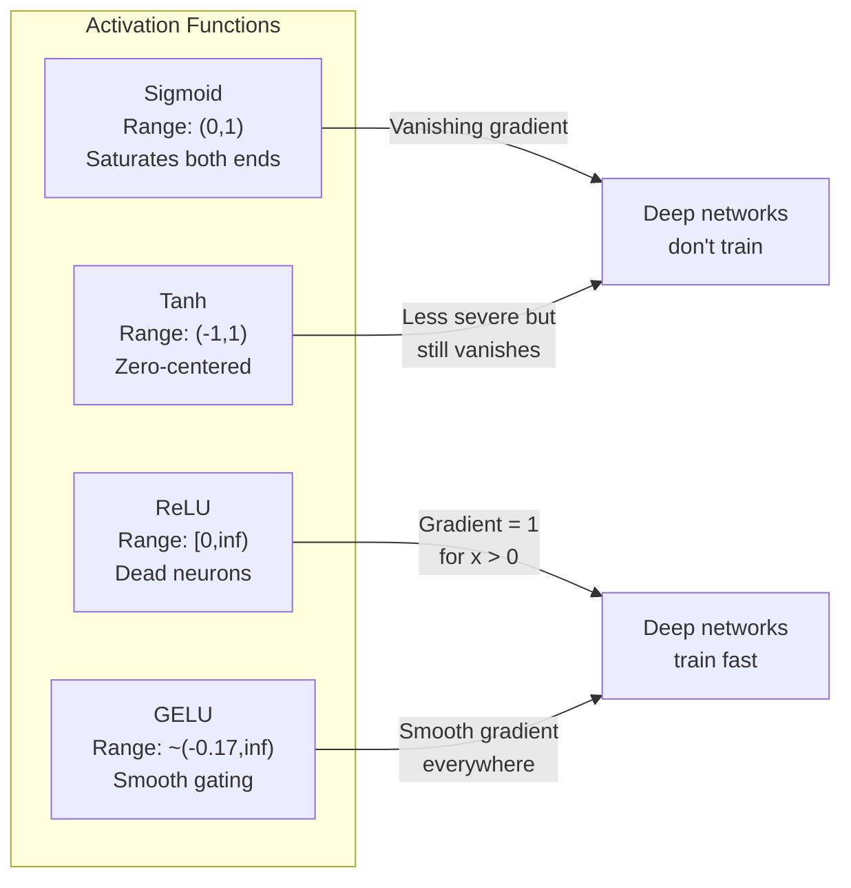
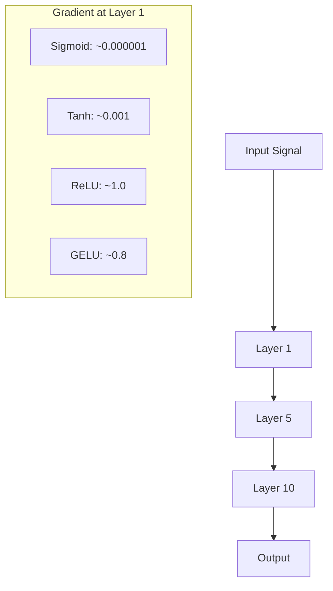
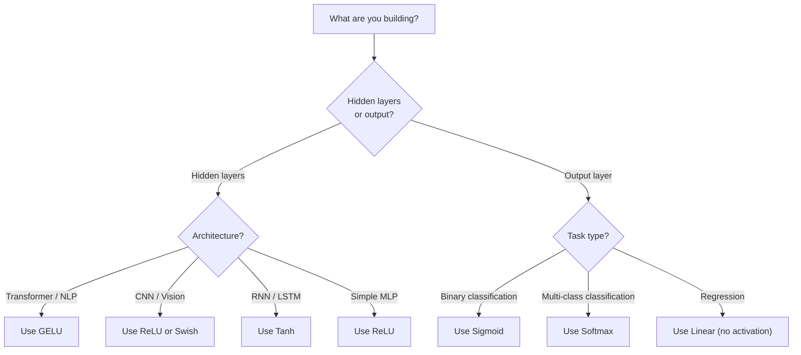

# Funkcje aktywacji

> Bez nieliniowości twoja 100-warstwowa sieć jest tylko wymyślnym mnożeniem macierzy. Aktywacje to wrota, które pozwalają sieciom neuronowym myśleć w krzywych.

**Typ:** Build
**Języki:** Python
**Wymagania wstępne:** Lekcja 03.03 (Propagacja wsteczna)
**Czas:** ~75 minut

## Cele nauki

- Zaimplementuj od podstaw sigmoid, tanh, ReLU, Leaky ReLU, GELU, Swish oraz softmax wraz z ich derywatami
- Zdiagnozuj problem zanikającego gradientu, mierząc wielkości aktywacji w 10+ warstwach z różnymi aktywacjami
- Wykryj martwe neurony w sieci ReLU i wyjaśnij, dlaczego GELU unika tego rodzaju awarii
- Wybierz odpowiednią funkcję aktywacji dla danej architektury (transformer, CNN, RNN, warstwa wyjściowa)

## Problem

Złóż dwie transformacje liniowe: y = W2(W1x + b1) + b2. Rozwiń to: y = W2W1x + W2b1 + b2. To po prostu y = Ax + c -- pojedyncza transformacja liniowa. Niezależnie od liczby ułożonych warstw liniowych, wynik redukuje się do jednego mnożenia macierzowego. Twoja 100-warstwowa sieć ma taką samą siłę reprezentacji jak pojedyncza warstwa.

To nie jest teoretyczna ciekawostka. Oznacza to, że głęboka sieć liniowa dosłownie nie może nauczyć się XOR, nie może sklasyfikować zbioru danych w formie spirali, nie może rozpoznać twarzy. Bez funkcji aktywacji głębokość jest iluzją.

Funkcje aktywacji przełamują liniowość. Deformują wyjście każdej warstwy za pomocą funkcji nieliniowej, dając sieci możliwość gięcia granic decyzyjnych, aproksymowania dowolnych funkcji i faktycznego uczenia się. Ale wybierz niewłaściwą aktywację i twoje gradienty zanikną do zera (sigmoid w głębokich sieciach), wybuchną do nieskończoności (nieograniczone aktywacje bez ostrożnej inicjalizacji) albo twoje neurony umrą na zawsze (ReLU z dużymi ujemnymi obciążeniami). Wybór funkcji aktywacji bezpośrednio determinuje, czy twoja sieć w ogóle się uczy.

## Koncepcja

### Czym jest nieliniowość i dlaczego jest konieczna

Mnożenie macierzowe jest składalne (kompozycyjne). Pomnożenie wektora przez macierz A, a następnie przez macierz B, jest identyczne z pomnożeniem przez AB. Oznacza to, że ułożenie dziesięciu warstw liniowych jest matematycznie równoważne jednej warstwie liniowej z jedną dużą macierzą. Cały ten zestaw parametrów, cała ta głębokość -- zmarnowane. Potrzebujesz czegoś, co przełamie ten łańcuch. To właśnie robią funkcje aktywacji.

Oto dowód. Warstwa liniowa wyznacza f(x) = Wx + b. Ułóż dwie:

```
Layer 1: h = W1 * x + b1
Layer 2: y = W2 * h + b2
```

Podstaw:

```
y = W2 * (W1 * x + b1) + b2
y = (W2 * W1) * x + (W2 * b1 + b2)
y = A * x + c
```

Jedna warstwa. Wstaw nieliniową aktywację g() między warstwy:

```
h = g(W1 * x + b1)
y = W2 * h + b2
```

Teraz podstawienie się zawodzi. W2 * g(W1 * x + b1) + b2 nie da się zredukować do jednej transformacji liniowej. Sieć może reprezentować funkcje nieliniowe. Każda dodatkowa warstwa z aktywacją dodaje zdolność reprezentacyjną.

### Sigmoid

Pierwotna funkcja aktywacji dla sieci neuronowych.

```
sigmoid(x) = 1 / (1 + e^(-x))
```

Zakres wyjścia: (0, 1). Gładka, różniczkowalna, mapuje każdą liczbę rzeczywistą na wartość przypominającą prawdopodobieństwo.

Derywata:

```
sigmoid'(x) = sigmoid(x) * (1 - sigmoid(x))
```

Maksymalna wartość tej derywaty to 0.25, występująca dla x = 0. W propagacji wstecznej gradienty są mnożone przez warstwy. Dziesięć warstw sigmoid oznacza, że gradient jest mnożony przez co najwyżej 0.25 dziesięć razy:

```
0.25^10 = 0.000000953674
```

Mniej niż jedna milionowa pierwotnego sygnału. To jest problem zanikającego gradientu (vanishing gradient). Gradienty w pierwszych warstwach stają się tak małe, że wagi praktycznie się nie aktualizują. Sieć wydaje się uczyć -- strata zmniejsza się w późniejszych warstwach -- ale pierwsze warstwy są zamrożone. Głębokie sieci sigmoid po prostu się nie trenują.

Dodatkowy problem: wyjścia sigmoid są zawsze pozytywne (0 do 1), co oznacza, że gradienty wag mają zawsze ten samy znak. To powoduje "zygzakowanie" podczas spadku gradientu (gradient descent).

### Tanh

Wycentrowana wersja sigmoid.

```
tanh(x) = (e^x - e^(-x)) / (e^x + e^(-x))
```

Zakres wyjścia: (-1, 1). Wycentrowana wokół zera, co eliminuje problem zygzakowania.

Derywata:

```
tanh'(x) = 1 - tanh(x)^2
```

Maksymalna derywata to 1.0 dla x = 0 -- cztery razy lepiej niż sigmoid. Ale problem zanikającego gradientu wciąż istnieje. Dla dużych wartości pozytywnych lub negatywnych derywata zbliża się do zera. Dziesięć warstw wciąż gniecie gradient, tylko mniej agresywnie.

### ReLU: Przełom

Rectified Linear Unit. Spopularyzowana dla głębokiego uczenia przez Naira i Hintona w 2010 roku (sama funkcja pochodzi z pracy Fukushimy z 1969 roku), zmieniła wszystko.

```
relu(x) = max(0, x)
```

Zakres wyjścia: [0, infinity). Derywata jest banalnie prosta:

```
relu'(x) = 1  if x > 0
            0  if x <= 0
```

Brak zanikającego gradientu dla pozytywnych wejść. Gradient jest dokładnie 1, przekazywany bez zmian. To właśnie dzięki temu głębokie sieci stały się trenowalne -- ReLU zachowuje wielkość gradientu między warstwami.

Ale istnieje awaria: problem martwego neuronu (dead neuron problem). Jeśli ważone wejście neuronu jest zawsze ujemne (z powodu dużego ujemnego obciążenia lub nieszczęśliwej inicjalizacji wag), jego wyjście jest zawsze zero, jego gradient jest zawsze zero i nigdy się nie aktualizuje. Jest permanentnie martwy. W praktyce 10-40% neuronów w sieci ReLU może umrzeć podczas treningu.

### Leaky ReLU

Najprostsza poprawka na martwe neurony.

```
leaky_relu(x) = x        if x > 0
                alpha * x if x <= 0
```

Gdzie alpha jest małą stałą, typowo 0.01. Strona ujemna ma małe nachylenie zamiast zera, więc martwe neurony wciąż otrzymują sygnał gradientu i mogą się odrodzić.

### GELU: Współczesny domyślny wybór

Gaussian Error Linear Unit. Wprowadzona przez Hendrycksa i Gimpela w 2016 roku. Domyślna aktywacja w BERT, GPT i większości współczesnych transformerów.

```
gelu(x) = x * Phi(x)
```

Gdzie Phi(x) jest skumulowaną funkcją rozkładu (cumulative distribution function) standardowego rozkładu normalnego. Aproksymacja stosowana w praktyce:

```
gelu(x) ~= 0.5 * x * (1 + tanh(sqrt(2/pi) * (x + 0.044715 * x^3)))
```

GELU jest gładka wszędzie, dopuszcza małe wartości ujemne (w przeciwieństwie do ReLU, które ostro obcina do zera) i ma interpretację probabilistyczną: waży każde wejście według tego, jak prawdopodobne jest, że jest dodatnie zgodnie z rozkładem Gaussa. To gładkie bramkowanie (gating) przewyższa ReLU w architekturach transformerów, ponieważ zapewnia lepszy przepływ gradientu i całkowicie unika problemu martwych neuronów.

### Swish / SiLU

Samobramkująca aktywacja (self-gated activation) odkryta przez Ramachandrana i in. w 2017 roku za pomocą automatycznego przeszukiwania.

```
swish(x) = x * sigmoid(x)
```

Swish formalnie to x * sigmoid(x). Google odkrył ją poprzez automatyczne przeszukiwanie przestrzeni funkcji aktywacji -- sieć neuronowa projektująca części sieci neuronowych.

Podobnie jak GELU, jest gładka, niemonotoniczna i dopuszcza małe wartości ujemne. Różnica jest subtelna: Swish używa sigmoid do bramkowania, podczas gdy GELU używa skumulowanej funkcji rozkładu Gaussa (CDF). W praktyce wydajność jest praktycznie identyczna. Swish jest używana w EfficientNet i niektórych modelach wizyjnych. GELU dominuje w modelach językowych.

### Softmax: Aktywacja wyjściowa

Niewykorzystywana w warstwach skrytych. Softmax przekształca wektor surowych wyników (logitów) w rozkład prawdopodobieństwa.

```
softmax(x_i) = e^(x_i) / sum(e^(x_j) for all j)
```

Każde wyjście jest między 0 i 1. Wszystkie wyjścia sumują się do 1. To czyni ją standardową finalną aktywacją dla klasyfikacji wieloklasowej. Największy logit dostaje najwyższe prawdopodobieństwo, ale w przeciwieństwie do argmax, softmax jest różniczkowalna i zachowuje informację o względnej pewności.

### Porównanie kształtów



### Porównanie przepływu gradientu



### Którą aktywację wybrać i kiedy



## Zbuduj to

### Krok 1: Zaimplementuj wszystkie funkcje aktywacji wraz z derywatami

Każda funkcja przyjmuje pojedynczą liczbę float i zwraca float. Każda funkcja derywaty przyjmuje to samo wejście i zwraca gradient.

```python
import math

def sigmoid(x):
    x = max(-500, min(500, x))
    return 1.0 / (1.0 + math.exp(-x))

def sigmoid_derivative(x):
    s = sigmoid(x)
    return s * (1 - s)

def tanh_act(x):
    return math.tanh(x)

def tanh_derivative(x):
    t = math.tanh(x)
    return 1 - t * t

def relu(x):
    return max(0.0, x)

def relu_derivative(x):
    return 1.0 if x > 0 else 0.0

def leaky_relu(x, alpha=0.01):
    return x if x > 0 else alpha * x

def leaky_relu_derivative(x, alpha=0.01):
    return 1.0 if x > 0 else alpha

def gelu(x):
    return 0.5 * x * (1 + math.tanh(math.sqrt(2 / math.pi) * (x + 0.044715 * x ** 3)))

def gelu_derivative(x):
    phi = 0.5 * (1 + math.erf(x / math.sqrt(2)))
    pdf = math.exp(-0.5 * x * x) / math.sqrt(2 * math.pi)
    return phi + x * pdf

def swish(x):
    return x * sigmoid(x)

def swish_derivative(x):
    s = sigmoid(x)
    return s + x * s * (1 - s)

def softmax(xs):
    max_x = max(xs)
    exps = [math.exp(x - max_x) for x in xs]
    total = sum(exps)
    return [e / total for e in exps]
```

### Krok 2: Wizualizuj, gdzie umierają gradienty

Oblicz gradient w 100 równomiernie rozmieszczonych punktach od -5 do 5. Wydrukuj histogram tekstowy pokazujący, gdzie gradient każdej aktywacji jest bliski zeru.

```python
def gradient_scan(name, derivative_fn, start=-5, end=5, n=100):
    step = (end - start) / n
    near_zero = 0
    healthy = 0
    for i in range(n):
        x = start + i * step
        g = derivative_fn(x)
        if abs(g) < 0.01:
            near_zero += 1
        else:
            healthy += 1
    pct_dead = near_zero / n * 100
    print(f"{name:15s}: {healthy:3d} healthy, {near_zero:3d} near-zero ({pct_dead:.0f}% dead zone)")

gradient_scan("Sigmoid", sigmoid_derivative)
gradient_scan("Tanh", tanh_derivative)
gradient_scan("ReLU", relu_derivative)
gradient_scan("Leaky ReLU", leaky_relu_derivative)
gradient_scan("GELU", gelu_derivative)
gradient_scan("Swish", swish_derivative)
```

### Krok 3: Eksperyment z zanikającym gradientem

Przepuść sygnał w przejściu w przód (forward pass) przez N warstw, używając sigmoid vs ReLU. Zmierz, jak zmienia się wielkość aktywacji.

```python
import random

def vanishing_gradient_experiment(activation_fn, name, n_layers=10, n_inputs=5):
    random.seed(42)
    values = [random.gauss(0, 1) for _ in range(n_inputs)]

    print(f"\n{name} through {n_layers} layers:")
    for layer in range(n_layers):
        weights = [random.gauss(0, 1) for _ in range(n_inputs)]
        z = sum(w * v for w, v in zip(weights, values))
        activated = activation_fn(z)
        magnitude = abs(activated)
        bar = "#" * int(magnitude * 20)
        print(f"  Layer {layer+1:2d}: magnitude = {magnitude:.6f} {bar}")
        values = [activated] * n_inputs

vanishing_gradient_experiment(sigmoid, "Sigmoid")
vanishing_gradient_experiment(relu, "ReLU")
vanishing_gradient_experiment(gelu, "GELU")
```

### Krok 4: Detektor martwych neuronów

Stwórz sieć ReLU, przepuść przez nią losowe wejścia, policz, ile neuronów nigdy się nie aktywuje.

```python
def dead_neuron_detector(n_inputs=5, hidden_size=20, n_samples=1000):
    random.seed(0)
    weights = [[random.gauss(0, 1) for _ in range(n_inputs)] for _ in range(hidden_size)]
    biases = [random.gauss(0, 1) for _ in range(hidden_size)]

    fire_counts = [0] * hidden_size

    for _ in range(n_samples):
        inputs = [random.gauss(0, 1) for _ in range(n_inputs)]
        for neuron_idx in range(hidden_size):
            z = sum(w * x for w, x in zip(weights[neuron_idx], inputs)) + biases[neuron_idx]
            if relu(z) > 0:
                fire_counts[neuron_idx] += 1

    dead = sum(1 for c in fire_counts if c == 0)
    rarely_fire = sum(1 for c in fire_counts if 0 < c < n_samples * 0.05)
    healthy = hidden_size - dead - rarely_fire

    print(f"\nDead Neuron Report ({hidden_size} neurons, {n_samples} samples):")
    print(f"  Dead (never fired):     {dead}")
    print(f"  Barely alive (<5%):     {rarely_fire}")
    print(f"  Healthy:                {healthy}")
    print(f"  Dead neuron rate:       {dead/hidden_size*100:.1f}%")

    for i, c in enumerate(fire_counts):
        status = "DEAD" if c == 0 else "WEAK" if c < n_samples * 0.05 else "OK"
        bar = "#" * (c * 40 // n_samples)
        print(f"  Neuron {i:2d}: {c:4d}/{n_samples} fires [{status:4s}] {bar}")

dead_neuron_detector()
```

### Krok 5: Porównanie treningu -- Sigmoid vs ReLU vs GELU

Wytrenuj tę samą dwuwarstwową sieć na zbiorze danych "circle" (punkty wewnątrz okręgu = klasa 1, poza nim = klasa 0) z trzema różnymi aktywacjami. Porównaj szybkość konwergencji.

```python
def make_circle_data(n=200, seed=42):
    random.seed(seed)
    data = []
    for _ in range(n):
        x = random.uniform(-2, 2)
        y = random.uniform(-2, 2)
        label = 1.0 if x * x + y * y < 1.5 else 0.0
        data.append(([x, y], label))
    return data


class ActivationNetwork:
    def __init__(self, activation_fn, activation_deriv, hidden_size=8, lr=0.1):
        random.seed(0)
        self.act = activation_fn
        self.act_d = activation_deriv
        self.lr = lr
        self.hidden_size = hidden_size

        self.w1 = [[random.gauss(0, 0.5) for _ in range(2)] for _ in range(hidden_size)]
        self.b1 = [0.0] * hidden_size
        self.w2 = [random.gauss(0, 0.5) for _ in range(hidden_size)]
        self.b2 = 0.0

    def forward(self, x):
        self.x = x
        self.z1 = []
        self.h = []
        for i in range(self.hidden_size):
            z = self.w1[i][0] * x[0] + self.w1[i][1] * x[1] + self.b1[i]
            self.z1.append(z)
            self.h.append(self.act(z))

        self.z2 = sum(self.w2[i] * self.h[i] for i in range(self.hidden_size)) + self.b2
        self.out = sigmoid(self.z2)
        return self.out

    def backward(self, target):
        error = self.out - target
        d_out = error * self.out * (1 - self.out)

        for i in range(self.hidden_size):
            d_h = d_out * self.w2[i] * self.act_d(self.z1[i])
            self.w2[i] -= self.lr * d_out * self.h[i]
            for j in range(2):
                self.w1[i][j] -= self.lr * d_h * self.x[j]
            self.b1[i] -= self.lr * d_h
        self.b2 -= self.lr * d_out

    def train(self, data, epochs=200):
        losses = []
        for epoch in range(epochs):
            total_loss = 0
            correct = 0
            for x, y in data:
                pred = self.forward(x)
                self.backward(y)
                total_loss += (pred - y) ** 2
                if (pred >= 0.5) == (y >= 0.5):
                    correct += 1
            avg_loss = total_loss / len(data)
            accuracy = correct / len(data) * 100
            losses.append(avg_loss)
            if epoch % 50 == 0 or epoch == epochs - 1:
                print(f"    Epoch {epoch:3d}: loss={avg_loss:.4f}, accuracy={accuracy:.1f}%")
        return losses


data = make_circle_data()

configs = [
    ("Sigmoid", sigmoid, sigmoid_derivative),
    ("ReLU", relu, relu_derivative),
    ("GELU", gelu, gelu_derivative),
]

results = {}
for name, act_fn, act_d_fn in configs:
    print(f"\n=== Training with {name} ===")
    net = ActivationNetwork(act_fn, act_d_fn, hidden_size=8, lr=0.1)
    losses = net.train(data, epochs=200)
    results[name] = losses

print("\n=== Final Loss Comparison ===")
for name, losses in results.items():
    print(f"  {name:10s}: start={losses[0]:.4f} -> end={losses[-1]:.4f} (improvement: {(1 - losses[-1]/losses[0])*100:.1f}%)")
```

## Wykorzystaj to

PyTorch udostępnia wszystkie te funkcje w formie funkcyjnej i modułowej:

```python
import torch
import torch.nn as nn
import torch.nn.functional as F

x = torch.randn(4, 10)

relu_out = F.relu(x)
gelu_out = F.gelu(x)
sigmoid_out = torch.sigmoid(x)
swish_out = F.silu(x)

logits = torch.randn(4, 5)
probs = F.softmax(logits, dim=1)

model = nn.Sequential(
    nn.Linear(10, 64),
    nn.GELU(),
    nn.Linear(64, 32),
    nn.GELU(),
    nn.Linear(32, 5),
)
```

Warstwy skryte w transformerze: GELU. Warstwy skryte w CNN: ReLU. Warstwa wyjściowa dla klasyfikacji: softmax. Warstwa wyjściowa dla regresji: brak (liniowa). Warstwa wyjściowa dla prawdopodobieństw: sigmoid. To wszystko. Zacznij od tych ustawień domyślnych. Zmieniaj je tylko wtedy, gdy masz na to dowody.

RNN-y i LSTM-y używają tanh dla stanu skrytego (hidden state) i sigmoid dla wrót (gates), ale jeśli budujesz coś od zera dzisiaj, prawdopodobnie nie używasz RNN-ów. Jeśli neurony umierają w twojej sieci ReLU, przełącz się na GELU. Nie sięgaj po Leaky ReLU, jeśli nie masz konkretnego powodu -- GELU rozwiązuje problem martwych neuronów i zapewnia lepszy przepływ gradientu.

## Dostarcz to

Ta lekcja wytwarza:
- `outputs/prompt-activation-selector.md` -- wielokrotnie używalny prompt, który pomaga wybrać odpowiednią funkcję aktywacji dla każdej architektury

## Zadania

1. Zaimplementuj Parametric ReLU (PReLU), gdzie ujemne nachylenie alpha jest parametrem uczącym się. Wytrenuj go na zbiorze danych circle i porównaj do stałego Leaky ReLU.

2. Przeprowadź eksperyment z zanikającym gradientem z 50 warstwami zamiast 10. Wykreśl wielkość na każdej warstwie dla sigmoid, tanh, ReLU i GELU. Na której warstwie sygnał każdej aktywacji efektywnie spada do zera?

3. Zaimplementuj ELU (Exponential Linear Unit): elu(x) = x if x > 0, alpha * (e^x - 1) if x <= 0. Porównaj jego współczynnik martwych neuronów do ReLU w tej samej sieci.

4. Zbuduj "monitor zdrowia gradientu" działający podczas treningu: w każdej epoce oblicz średnią wielkość gradientu dla każdej warstwy. Wydrukuj ostrzeżenie, gdy gradient jakiejkolwiek warstwy spadnie poniżej 0.001 lub przekroczy 100.

5. Zmodyfikuj porównanie treningowe, aby użyć zbioru danych XOR z Lekcji 01 zamiast okręgów. Która aktywacja zbiega najszybciej na XOR? Czym różni się to od wyników dla okręgów?

## Kluczowe terminy

| Termin | Co się mówi | Co to faktycznie znaczy |
|------|----------------|----------------------|
| Funkcja aktywacji | "Część nieliniowa" | Funkcja zastosowana do wyjścia każdego neuronu, która przełamuje liniowość, umożliwiając sieci uczenie się nieliniowych mapowań |
| Zanikający gradient (vanishing gradient) | "Gradienty zanikają w głębokich sieciach" | Gradienty zmniejszają się wykładniczo przez warstwy, gdy derywata aktywacji jest mniejsza niż 1, co czyni pierwsze warstwy nietrenowalnymi |
| Wybuchający gradient (exploding gradient) | "Gradienty wybuchają" | Gradienty rosną wykładniczo przez warstwy, gdy efektywny mnożnik przekracza 1, powodując niestabilny trening |
| Martwy neuron (dead neuron) | "Neuron, który przestał się uczyć" | Neuron ReLU, którego wejście jest permanentnie ujemne, produkujący zerowe wyjście i zerowy gradient |
| Sigmoid | "Ściska wartości do 0-1" | Funkcja logistyczna 1/(1+e^-x), historycznie ważna, ale powoduje zanikające gradienty w głębokich sieciach |
| ReLU | "Obcina wartości ujemne do zera" | max(0, x) -- aktywacja, która uczyniła głębokie uczenie praktycznym, zachowując wielkość gradientu |
| GELU | "Aktywacja transformerów" | Gaussian Error Linear Unit, gładka aktywacja, która waży wejścia według prawdopodobieństwa bycia pozytywnymi |
| Swish/SiLU | "Samobramkujący ReLU" | x * sigmoid(x), odkryty poprzez automatyczne przeszukiwanie, używany w EfficientNet |
| Softmax | "Zamienia wyniki na prawdopodobieństwa" | Normalizuje wektor logitów do rozkładu prawdopodobieństwa, w którym wszystkie wartości są w (0,1) i sumują się do 1 |
| Leaky ReLU | "ReLU, który nie umiera" | max(alpha*x, x) gdzie alpha jest małe (0.01), zapobiegając martwym neuronom poprzez dopuszczenie małych ujemnych gradientów |
| Saturacja | "Płaska część sigmoid" | Obszary, w których derywata aktywacji zbliża się do zera, blokując przepływ gradientu |
| Logit | "Surowy wynik przed softmax" | Nienormalizowane wyjście ostatniej warstwy przed zastosowaniem softmax lub sigmoid |

## Dalsza lektura

- Nair & Hinton, "Rectified Linear Units Improve Restricted Boltzmann Machines" (2010) -- praca, która wprowadziła ReLU i umożliwiła trenowanie głębokich sieci
- Hendrycks & Gimpel, "Gaussian Error Linear Units (GELUs)" (2016) -- wprowadziła funkcję aktywacji, która stała się domyślną dla transformerów
- Ramachandran et al., "Searching for Activation Functions" (2017) -- użyła automatycznego przeszukiwania do odkrycia Swish, pokazując, że projektowanie aktywacji może być zautomatyzowane
- Glorot & Bengio, "Understanding the difficulty of training deep feedforward neural networks" (2010) -- praca, która zdiagnozowała zanikające/wybuchające gradienty i zaproponowała inicjalizację Xavier
- Goodfellow, Bengio, Courville, "Deep Learning" Rozdział 6.3 (https://www.deeplearningbook.org/) -- rygorystyczne omówienie jednostek skrytych i funkcji aktywacji
