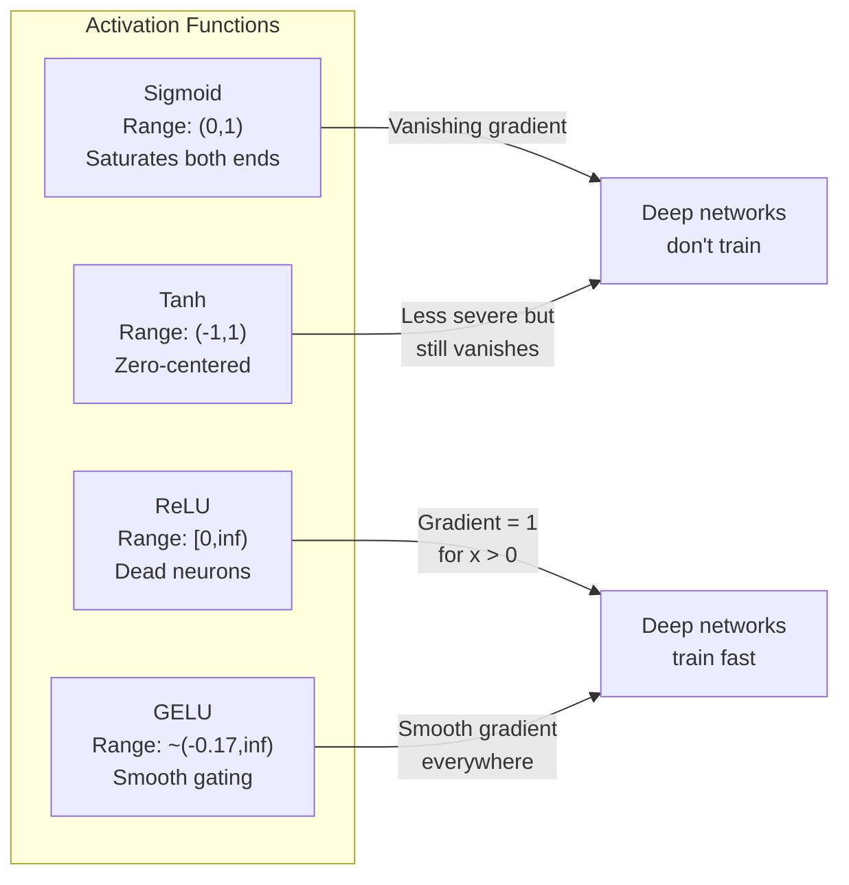
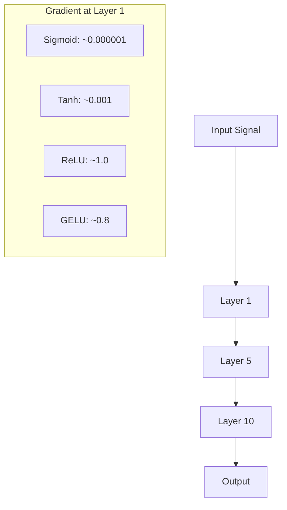
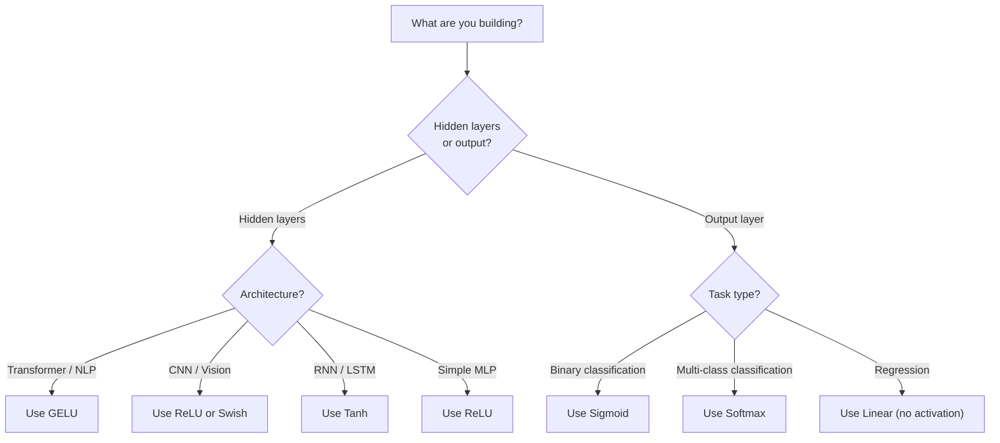

# Funkcje aktywacji

> Bez nieliniowości Twoja 100-warstwowa sieć jest fantazyjną mnożnikiem macierzy. Aktywacje to bramy, które pozwalają sieciom neuronowym myśleć po krzywych.

**Typ:** Kompilacja
**Języki:** Python
**Wymagania:** Lekcja 03.03 (Propagacja wsteczna)
**Czas:** ~75 minut

## Cele nauczania

- Implementuj od podstaw sigmoid, tanh, ReLU, Leaky ReLU, GELU, Swish i softmax z ich pochodnymi
- Zdiagnozuj problem zanikającego gradientu, mierząc wielkości aktywacji w ponad 10 warstwach z różnymi aktywacjami
- Wykryj martwe neurony w sieci ReLU i wyjaśnij, dlaczego GELU unika tego trybu awarii
- Wybierz odpowiednią funkcję aktywacji dla danej architektury (transformator, CNN, RNN, warstwa wyjściowa)

## Problem

Zestaw dwie transformacje liniowe: y = W2(W1x + b1) + b2. Rozwiń: y = W2W1x + W2b1 + b2. To po prostu y = Ax + c – pojedyncza transformacja liniowa. Bez względu na to, ile warstw liniowych ułożysz, wynik sprowadza się do jednej macierzy. Twoja 100-warstwowa sieć ma taką samą moc reprezentacyjną jak pojedyncza warstwa.

To nie jest ciekawostka teoretyczna. Oznacza to, że głęboka sieć liniowa dosłownie nie może nauczyć się XOR, nie może sklasyfikować spiralnego zbioru danych, nie może rozpoznać twarzy. Bez funkcji aktywacji głębia jest iluzją.

Funkcje aktywacji przełamują liniowość. Zniekształcają dane wyjściowe każdej warstwy poprzez funkcję nieliniową, dając sieci możliwość naginania granic decyzyjnych, przybliżania dowolnych funkcji i faktycznego uczenia się. Ale wybierz niewłaściwą aktywację, a twoje gradienty znikną do zera (esigmoida w głębokich sieciach), eksplodują do nieskończoności (nieograniczone aktywacje bez starannej inicjalizacji) lub twoje neurony umrą trwale (ReLU z dużymi ujemnymi odchyleniami). Wybór funkcji aktywacji bezpośrednio decyduje o tym, czy Twoja sieć w ogóle się uczy.

## Koncepcja

### Dlaczego nieliniowość jest konieczna

Mnożenie macierzy można składać. Mnożenie wektora przez macierz A, a następnie macierz B, jest identyczne z mnożeniem przez AB. Oznacza to, że ułożenie dziesięciu warstw liniowych jest matematycznie równoważne jednej warstwie liniowej z jedną dużą matrycą. Wszystkie te parametry, cała głębokość – zmarnowane. Potrzebujesz czegoś, żeby przerwać łańcuch. To właśnie robią funkcje aktywacyjne.

Oto dowód. Warstwa liniowa oblicza f(x) = Wx + b. Stos drugi:

```
Layer 1: h = W1 * x + b1
Layer 2: y = W2 * h + b2
```

Zastępca:

```
y = W2 * (W1 * x + b1) + b2
y = (W2 * W1) * x + (W2 * b1 + b2)
y = A * x + c
```

Jedna warstwa. Wstaw nieliniową aktywację g() pomiędzy warstwami:

```
h = g(W1 * x + b1)
y = W2 * h + b2
```

Teraz substytucja zostaje przerwana. W2 * g(W1 * x + b1) + b2 nie można sprowadzić do pojedynczej transformacji liniowej. Sieć może reprezentować funkcje nieliniowe. Każda dodatkowa warstwa z aktywacją zwiększa możliwości reprezentacyjne.

### Sigmoida

Autorska funkcja aktywacji sieci neuronowych.

```
sigmoid(x) = 1 / (1 + e^(-x))
```

Zakres wyjściowy: (0, 1). Gładka, różniczkowalna, odwzorowuje dowolną liczbę rzeczywistą na wartość przypominającą prawdopodobieństwo.

Pochodna:

```
sigmoid'(x) = sigmoid(x) * (1 - sigmoid(x))
```

Maksymalna wartość tej pochodnej wynosi 0,25 i występuje przy x = 0. W przypadku propagacji wstecznej gradienty mnożą się przez warstwy. Dziesięć warstw sigmoidy oznacza, że gradient zostaje pomnożony co najwyżej 0,25 dziesięć razy:

```
0.25^10 = 0.000000953674
```

Mniej niż jedna milionowa oryginalnego sygnału. Jest to problem zanikającego gradientu. Gradienty we wczesnych warstwach stają się tak małe, że wagi ledwo się aktualizują. Wygląda na to, że sieć się uczy – straty zmniejszają się w późniejszych warstwach – ale pierwsze warstwy są zamrożone. Głębokie sieci sigmoidalne po prostu nie trenują.

Dodatkowy problem: wyjścia sigmoidalne są zawsze dodatnie (0 do 1), co oznacza, że ​​gradienty ciężarków mają zawsze ten sam znak. Powoduje to zygzakowanie podczas opadania gradientowego.

### Tanh

Wyśrodkowana wersja esicy.

```
tanh(x) = (e^x - e^(-x)) / (e^x + e^(-x))
```

Zakres wyjściowy: (-1, 1). Wyśrodkowany zerowo, co eliminuje problem zygzaka.

Pochodna:

```
tanh'(x) = 1 - tanh(x)^2
```

Maksymalna pochodna wynosi 1,0 przy x = 0 — cztery razy lepiej niż sigmoida. Jednak problem znikającego gradientu nadal istnieje. W przypadku dużych dodatnich lub ujemnych danych wejściowych pochodna zbliża się do zera. Dziesięć warstw nadal niszczy gradient, tylko mniej agresywnie.

### ReLU: Przełom

Prostowana jednostka liniowa. Spopularyzowana do celów głębokiego uczenia się przez Naira i Hintona w 2010 r. (sama funkcja pochodzi z prac w Fukushimie z 1969 r.), zmieniła wszystko.

```
relu(x) = max(0, x)
```

Zakres wyjściowy: [0, nieskończoność). Pochodna jest banalnie prosta:

```
relu'(x) = 1  if x > 0
            0  if x <= 0
```

Brak gradientu zanikającego dla wejść dodatnich. Gradient wynosi dokładnie 1, przechodzi prosto. Właśnie dlatego głębokie sieci stały się możliwe do trenowania — ReLU zachowuje wielkość gradientu między warstwami.

Istnieje jednak tryb awaryjny: problem martwego neuronu. Jeśli ważony sygnał wejściowy neuronu jest zawsze ujemny (z powodu dużego ujemnego obciążenia lub niefortunnej inicjalizacji wagi), jego sygnał wyjściowy jest zawsze zerowy, jego gradient jest zawsze zerowy i nigdy się nie aktualizuje. Jest trwale martwy. W praktyce 10-40% neuronów w sieci ReLU może umrzeć podczas treningu.

### Nieszczelny ReLU

Najprostszy sposób na martwe neurony.

```
leaky_relu(x) = x        if x > 0
                alpha * x if x <= 0
```

Gdzie alfa jest małą stałą, zwykle 0,01. Strona ujemna ma małe nachylenie zamiast zera, więc martwe neurony nadal otrzymują sygnał gradientowy i mogą się zregenerować.

### GELU: Nowoczesne ustawienie domyślne

Jednostka liniowa błędu Gaussa. Wprowadzony przez Hendrycksa i Gimpela w 2016 roku. Domyślna aktywacja w BERT, GPT i większości nowoczesnych transformatorów.

```
gelu(x) = x * Phi(x)
```

Gdzie Phi(x) jest dystrybuantą standardowego rozkładu normalnego. Przybliżenie stosowane w praktyce:

```
gelu(x) ~= 0.5 * x * (1 + tanh(sqrt(2/pi) * (x + 0.044715 * x^3)))
```

GELU jest wszędzie gładki, dopuszcza małe wartości ujemne (w przeciwieństwie do ReLU, który przycina na stałe do zera) i ma interpretację probabilistyczną: waży każde wejście według prawdopodobieństwa, że ​​będzie dodatni w rozkładzie Gaussa. To gładkie bramkowanie przewyższa ReLU w architekturach transformatorów, ponieważ zapewnia lepszy przepływ gradientowy i całkowicie pozwala uniknąć problemu martwych neuronów.

### Świst / SiLU

Aktywacja samobramkowa odkryta przez Ramachandran i in. w 2017 r. poprzez automatyczne wyszukiwanie.

```
swish(x) = x * sigmoid(x)
```

Swish jest formalnie x * sigmoid(x). Google odkrył to poprzez automatyczne przeszukiwanie przestrzeni funkcji aktywacji – sieci neuronowej projektującej części sieci neuronowych.

Podobnie jak GELU, jest gładki, niemonotoniczny i dopuszcza małe wartości ujemne. Różnica jest subtelna: Swish używa sigmoidy do bramkowania, podczas gdy GELU używa Gaussa CDF. W praktyce wydajność jest prawie identyczna. Swish jest używany w EfficientNet i niektórych modelach wizyjnych. W modelach językowych dominuje GELU.

### Softmax: Aktywacja wyjścia

Nieużywane w ukrytych warstwach. Softmax konwertuje wektor surowych wyników (logitów) na rozkład prawdopodobieństwa.

```
softmax(x_i) = e^(x_i) / sum(e^(x_j) for all j)
```

Każde wyjście ma wartość od 0 do 1. Wszystkie wyjścia sumują się do 1. To sprawia, że jest to standardowa aktywacja końcowa dla klasyfikacji wieloklasowej. Największy logit uzyskuje najwyższe prawdopodobieństwo, ale w przeciwieństwie do argmax, softmax jest różniczkowalny i zachowuje informacje o względnej pewności.

### Porównanie kształtów



### Porównanie przepływu gradientowego



### Która aktywacja, kiedy



## Zbuduj to

### Krok 1: Zaimplementuj wszystkie funkcje aktywacji za pomocą instrumentów pochodnych

Każda funkcja pobiera pojedynczy element zmiennoprzecinkowy i zwraca wartość zmiennoprzecinkową. Każda funkcja pochodna pobiera te same dane wejściowe i zwraca gradient.

```python
import math

def sigmoid(x):
    x = max(-500, min(500, x))
    return 1.0 / (1.0 + math.exp(-x))

def sigmoid_derivative(x):
    s = sigmoid(x)
    return s * (1 - s)

def tanh_act(x):
    return math.tanh(x)

def tanh_derivative(x):
    t = math.tanh(x)
    return 1 - t * t

def relu(x):
    return max(0.0, x)

def relu_derivative(x):
    return 1.0 if x > 0 else 0.0

def leaky_relu(x, alpha=0.01):
    return x if x > 0 else alpha * x

def leaky_relu_derivative(x, alpha=0.01):
    return 1.0 if x > 0 else alpha

def gelu(x):
    return 0.5 * x * (1 + math.tanh(math.sqrt(2 / math.pi) * (x + 0.044715 * x ** 3)))

def gelu_derivative(x):
    phi = 0.5 * (1 + math.erf(x / math.sqrt(2)))
    pdf = math.exp(-0.5 * x * x) / math.sqrt(2 * math.pi)
    return phi + x * pdf

def swish(x):
    return x * sigmoid(x)

def swish_derivative(x):
    s = sigmoid(x)
    return s + x * s * (1 - s)

def softmax(xs):
    max_x = max(xs)
    exps = [math.exp(x - max_x) for x in xs]
    total = sum(exps)
    return [e / total for e in exps]
```

### Krok 2: Wyobraź sobie, gdzie umierają gradienty

Oblicz gradient w 100 równomiernie rozmieszczonych punktach od -5 do 5. Wydrukuj histogram tekstowy pokazujący, gdzie gradient każdej aktywacji jest bliski zeru.

```python
def gradient_scan(name, derivative_fn, start=-5, end=5, n=100):
    step = (end - start) / n
    near_zero = 0
    healthy = 0
    for i in range(n):
        x = start + i * step
        g = derivative_fn(x)
        if abs(g) < 0.01:
            near_zero += 1
        else:
            healthy += 1
    pct_dead = near_zero / n * 100
    print(f"{name:15s}: {healthy:3d} healthy, {near_zero:3d} near-zero ({pct_dead:.0f}% dead zone)")

gradient_scan("Sigmoid", sigmoid_derivative)
gradient_scan("Tanh", tanh_derivative)
gradient_scan("ReLU", relu_derivative)
gradient_scan("Leaky ReLU", leaky_relu_derivative)
gradient_scan("GELU", gelu_derivative)
gradient_scan("Swish", swish_derivative)
```

### Krok 3: Eksperyment ze znikającym gradientem

Przekaż sygnał w przód przez N warstw, używając sigmoidy vs ReLU. Zmierzyć, jak zmienia się wielkość aktywacji.

```python
import random

def vanishing_gradient_experiment(activation_fn, name, n_layers=10, n_inputs=5):
    random.seed(42)
    values = [random.gauss(0, 1) for _ in range(n_inputs)]

    print(f"\n{name} through {n_layers} layers:")
    for layer in range(n_layers):
        weights = [random.gauss(0, 1) for _ in range(n_inputs)]
        z = sum(w * v for w, v in zip(weights, values))
        activated = activation_fn(z)
        magnitude = abs(activated)
        bar = "#" * int(magnitude * 20)
        print(f"  Layer {layer+1:2d}: magnitude = {magnitude:.6f} {bar}")
        values = [activated] * n_inputs

vanishing_gradient_experiment(sigmoid, "Sigmoid")
vanishing_gradient_experiment(relu, "ReLU")
vanishing_gradient_experiment(gelu, "GELU")
```

### Krok 4: Detektor martwych neuronów

Utwórz sieć ReLU, przepuszczaj przez nią losowe dane wejściowe, policz, ile neuronów nigdy nie uruchamia się.

```python
def dead_neuron_detector(n_inputs=5, hidden_size=20, n_samples=1000):
    random.seed(0)
    weights = [[random.gauss(0, 1) for _ in range(n_inputs)] for _ in range(hidden_size)]
    biases = [random.gauss(0, 1) for _ in range(hidden_size)]

    fire_counts = [0] * hidden_size

    for _ in range(n_samples):
        inputs = [random.gauss(0, 1) for _ in range(n_inputs)]
        for neuron_idx in range(hidden_size):
            z = sum(w * x for w, x in zip(weights[neuron_idx], inputs)) + biases[neuron_idx]
            if relu(z) > 0:
                fire_counts[neuron_idx] += 1

    dead = sum(1 for c in fire_counts if c == 0)
    rarely_fire = sum(1 for c in fire_counts if 0 < c < n_samples * 0.05)
    healthy = hidden_size - dead - rarely_fire

    print(f"\nDead Neuron Report ({hidden_size} neurons, {n_samples} samples):")
    print(f"  Dead (never fired):     {dead}")
    print(f"  Barely alive (<5%):     {rarely_fire}")
    print(f"  Healthy:                {healthy}")
    print(f"  Dead neuron rate:       {dead/hidden_size*100:.1f}%")

    for i, c in enumerate(fire_counts):
        status = "DEAD" if c == 0 else "WEAK" if c < n_samples * 0.05 else "OK"
        bar = "#" * (c * 40 // n_samples)
        print(f"  Neuron {i:2d}: {c:4d}/{n_samples} fires [{status:4s}] {bar}")

dead_neuron_detector()
```

### Krok 5: Porównanie treningu – Sigmoid vs ReLU vs GELU

Trenuj tę samą sieć dwuwarstwową na zbiorze danych okręgu (punkty wewnątrz okręgu = klasa 1, na zewnątrz = klasa 0) za pomocą trzech różnych aktywacji. Porównaj prędkość konwergencji.

```python
def make_circle_data(n=200, seed=42):
    random.seed(seed)
    data = []
    for _ in range(n):
        x = random.uniform(-2, 2)
        y = random.uniform(-2, 2)
        label = 1.0 if x * x + y * y < 1.5 else 0.0
        data.append(([x, y], label))
    return data

class ActivationNetwork:
    def __init__(self, activation_fn, activation_deriv, hidden_size=8, lr=0.1):
        random.seed(0)
        self.act = activation_fn
        self.act_d = activation_deriv
        self.lr = lr
        self.hidden_size = hidden_size

        self.w1 = [[random.gauss(0, 0.5) for _ in range(2)] for _ in range(hidden_size)]
        self.b1 = [0.0] * hidden_size
        self.w2 = [random.gauss(0, 0.5) for _ in range(hidden_size)]
        self.b2 = 0.0

    def forward(self, x):
        self.x = x
        self.z1 = []
        self.h = []
        for i in range(self.hidden_size):
            z = self.w1[i][0] * x[0] + self.w1[i][1] * x[1] + self.b1[i]
            self.z1.append(z)
            self.h.append(self.act(z))

        self.z2 = sum(self.w2[i] * self.h[i] for i in range(self.hidden_size)) + self.b2
        self.out = sigmoid(self.z2)
        return self.out

    def backward(self, target):
        error = self.out - target
        d_out = error * self.out * (1 - self.out)

        for i in range(self.hidden_size):
            d_h = d_out * self.w2[i] * self.act_d(self.z1[i])
            self.w2[i] -= self.lr * d_out * self.h[i]
            for j in range(2):
                self.w1[i][j] -= self.lr * d_h * self.x[j]
            self.b1[i] -= self.lr * d_h
        self.b2 -= self.lr * d_out

    def train(self, data, epochs=200):
        losses = []
        for epoch in range(epochs):
            total_loss = 0
            correct = 0
            for x, y in data:
                pred = self.forward(x)
                self.backward(y)
                total_loss += (pred - y) ** 2
                if (pred >= 0.5) == (y >= 0.5):
                    correct += 1
            avg_loss = total_loss / len(data)
            accuracy = correct / len(data) * 100
            losses.append(avg_loss)
            if epoch % 50 == 0 or epoch == epochs - 1:
                print(f"    Epoch {epoch:3d}: loss={avg_loss:.4f}, accuracy={accuracy:.1f}%")
        return losses

data = make_circle_data()

configs = [
    ("Sigmoid", sigmoid, sigmoid_derivative),
    ("ReLU", relu, relu_derivative),
    ("GELU", gelu, gelu_derivative),
]

results = {}
for name, act_fn, act_d_fn in configs:
    print(f"\n=== Training with {name} ===")
    net = ActivationNetwork(act_fn, act_d_fn, hidden_size=8, lr=0.1)
    losses = net.train(data, epochs=200)
    results[name] = losses

print("\n=== Final Loss Comparison ===")
for name, losses in results.items():
    print(f"  {name:10s}: start={losses[0]:.4f} -> end={losses[-1]:.4f} (improvement: {(1 - losses[-1]/losses[0])*100:.1f}%)")
```

## Użyj tego

PyTorch zapewnia to wszystko w formie funkcjonalnej i modułowej:

```python
import torch
import torch.nn as nn
import torch.nn.functional as F

x = torch.randn(4, 10)

relu_out = F.relu(x)
gelu_out = F.gelu(x)
sigmoid_out = torch.sigmoid(x)
swish_out = F.silu(x)

logits = torch.randn(4, 5)
probs = F.softmax(logits, dim=1)

model = nn.Sequential(
    nn.Linear(10, 64),
    nn.GELU(),
    nn.Linear(64, 32),
    nn.GELU(),
    nn.Linear(32, 5),
)
```

Ukryte warstwy w transformatorze: GELU. Ukryte warstwy w CNN: ReLU. Warstwa wyjściowa do klasyfikacji: softmax. Warstwa wyjściowa dla regresji: brak (liniowa). Warstwa wyjściowa dla prawdopodobieństw: sigmoidalna. To wszystko. Zacznij od tych ustawień domyślnych. Zmieniaj je tylko wtedy, gdy masz dowody.

Sieci RNN i LSTM używają tanh dla stanu ukrytego i sigmoidy dla bramek, ale jeśli dzisiaj budujesz od zera, prawdopodobnie nie używasz RNN. Jeśli neurony w Twojej sieci ReLU umierają, przełącz się na GELU. Nie sięgaj po Leaky ReLU, jeśli nie masz konkretnego powodu – GELU rozwiązuje problem martwych neuronów i zapewnia lepszy przepływ gradientowy.

## Wyślij to

Ta lekcja daje:
- `outputs/prompt-activation-selector.md` — monit wielokrotnego użytku, który pomaga wybrać odpowiednią funkcję aktywacji dla dowolnej architektury

## Ćwiczenia

1. Zaimplementuj parametryczne ReLU (PReLU), gdzie ujemne nachylenie alfa jest parametrem, którego można się nauczyć. Wytrenuj go na zbiorze danych okręgu i porównaj z naprawionym Leaky ReLU.

2. Przeprowadź eksperyment ze znikającym gradientem z 50 warstwami zamiast 10. Narysuj wielkość w każdej warstwie dla sigmoidy, tanh, ReLU i GELU. W której warstwie sygnał każdej aktywacji skutecznie osiąga zero?

3. Zaimplementuj ELU (wykładniczą jednostkę liniową): elu(x) = x jeśli x > 0, alfa * (e^x - 1) jeśli x <= 0. Porównaj współczynnik martwych neuronów z ReLU w tej samej sieci.

4. Zbuduj „gradientowy monitor stanu”, który będzie działał podczas treningu: w każdej epoce oblicz średnią wielkość gradientu w każdej warstwie. Drukuj ostrzeżenie, gdy gradient dowolnej warstwy spadnie poniżej 0,001 lub przekroczy 100.

5. Zmodyfikuj porównanie szkoleniowe, aby zamiast okręgów używać zestawu danych XOR z lekcji 01. Która aktywacja najszybciej zbiega się z XOR? Dlaczego różni się to od wyników koła?

## Kluczowe terminy

| Termin | Co ludzie mówią | Co to właściwie oznacza |
|------|----------------|----------------------|
| Funkcja aktywacji | „Część nieliniowa” | Funkcja stosowana do wyjścia każdego neuronu, która łamie liniowość, umożliwiając sieci naukę mapowań nieliniowych
| Znikający gradient | „Gradienty znikają w głębokich sieciach” | Gradienty kurczą się wykładniczo w warstwach, gdy pochodna aktywacji jest mniejsza niż 1, co sprawia, że ​​wczesnych warstw nie da się trenować |
| Eksplodujący gradient | „Gradienty wybuchają” | Gradienty rosną wykładniczo przez warstwy, gdy efektywny mnożnik przekracza 1, powodując niestabilny trening |
| Martwy neuron | „Neuron, który przestał się uczyć” | Neuron ReLU, którego wejście jest trwale ujemne, wytwarzające zerowy sygnał wyjściowy i zerowy gradient |
| Sigmoida | „Zmniejsza wartości do 0-1” | Funkcja logistyczna 1/(1+e^-x), historycznie ważna, ale powodująca zanikanie gradientów w głębokich sieciach |
| ReLU | „Przycina negatywy do zera” | max(0, x) — aktywacja, która uczyniła głębokie uczenie się praktycznym poprzez zachowanie wielkości gradientu |
| ŻELU | „Zadziałanie transformatora” | Jednostka liniowa błędu Gaussa, płynna aktywacja, która waży dane wejściowe według prawdopodobieństwa, że ​​będą dodatnie |
| Swish/SiLU | „Samoblokujący ReLU” | x * sigmoid(x), odnaleziona w wyniku automatycznego wyszukiwania, używana w EfficientNet |
| Softmax | „Zamienia wyniki w prawdopodobieństwa” | Normalizuje wektor logitów do rozkładu prawdopodobieństwa, w którym wszystkie wartości mieszczą się w (0,1) i sumują się do 1 |
| Nieszczelny ReLU | „ReLU, który nie umiera” | max(alfa*x, x) gdzie alfa jest mała (0,01), zapobiegając martwym neuronom poprzez umożliwienie małych ujemnych gradientów |
| Nasycenie | „Płaska część esicy” | Regiony, w których pochodna aktywacji zbliża się do zera, blokując przepływ gradientu |
| Logit | „Surowy wynik przed softmaxem” | Nieznormalizowany wynik ostatniej warstwy przed nałożeniem softmax lub sigmoid |

## Dalsze czytanie

- Nair i Hinton, „Rectified Linear Units Improve Restricted Boltzmann Machines” (2010) — artykuł, który wprowadził ReLU i umożliwił szkolenie głębokich sieci
- Hendrycks & Gimpel, „Gaussian Error Linear Units (GELUs)” (2016) – wprowadzili funkcję aktywacji, która stała się domyślną funkcją dla transformatorów
– Ramachandran i in., „Searching for Activation Functions” (2017) – wykorzystali automatyczne wyszukiwanie, aby odkryć Swish, pokazując, że projektowanie aktywacji można zautomatyzować
- Glorot i Bengio, „Understanding the Hardstanding of Training deep Feedforward Neural Networks” (2010) – artykuł, w którym zdiagnozowano zanikające/eksplodujące gradienty i zaproponowano inicjalizację Xaviera
- Goodfellow, Bengio, Courville, „Deep Learning”, rozdział 6.3 (https://www.deeplearningbook.org/) – rygorystyczne traktowanie ukrytych jednostek i funkcji aktywacji