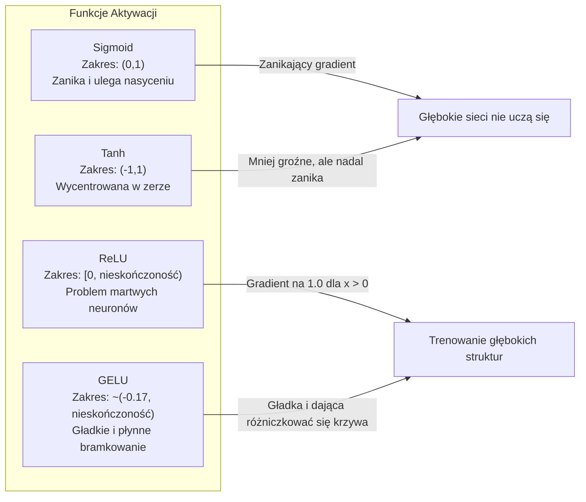
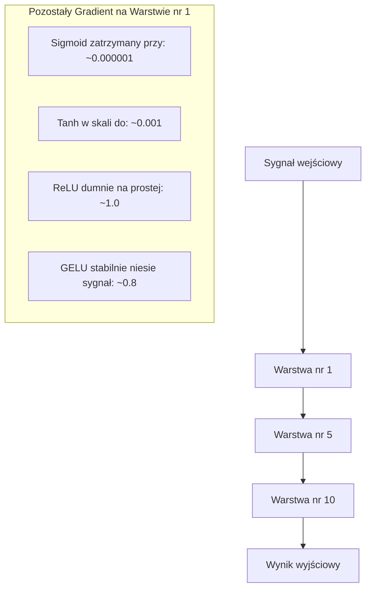
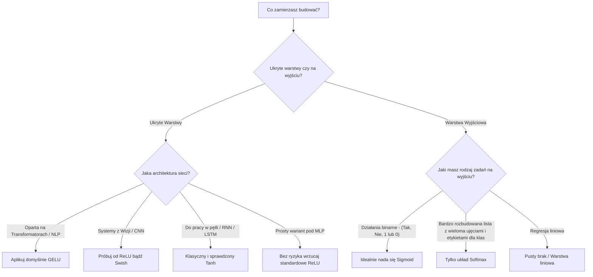

# Funkcje aktywacji

> Bez nieliniowości Twoja 100-warstwowa sieć neuronowa jest jedynie kosztownym kalkulatorem do mnożenia macierzy. Funkcje aktywacji to bramki, które pozwalają sztucznej inteligencji wykreślać nieliniowe granice decyzyjne i rozwiązywać skomplikowane problemy.

**Typ:** Budowa
**Języki:** Python
**Wymagania wstępne:** Lekcja 03.03 (Propagacja wsteczna)
**Czas:** ~75 minut

## Cele nauczania

- Zaimplementowanie od podstaw własnych wersji funkcji: sigmoid, tanh, ReLU, Leaky ReLU, GELU, Swish oraz softmax, wraz z wyliczeniem ich pochodnych.
- Samodzielne zdiagnozowanie problemu zanikającego gradientu poprzez zmierzenie wielkości przepływu sygnału w 10-warstwowej sieci dla różnych aktywacji.
- Wykrywanie "martwych neuronów" w strukturach opartych na ReLU i zrozumienie, w jaki sposób aktywacja GELU pozwala uniknąć tego błędu.
- Świadomy dobór odpowiedniej funkcji aktywacji do specyficznej architektury sieci (modele oparte na transformerach, sieci konwolucyjne CNN, rekurencyjne RNN, czy projektowanie warstwy wyjściowej).

## Problem

Wyobraź sobie złożenie dwóch połączonych ze sobą warstw bez funkcji aktywacji: `y = W2(W1*x + b1) + b2`. Po rozwinięciu otrzymujemy: `y = (W2*W1)*x + (W2*b1 + b2)`. Matematycznie rzecz biorąc jest to ekwiwalent równania `y = A*x + c` – czyli pojedynczej transformacji liniowej. Bez względu na to, ile liniowych warstw ułożysz jedną na drugiej, cały ich stos można zredukować do jednej macierzy. Twoja 100-warstwowa sieć bez aktywacji ma w rzeczywistości taką samą zdolność reprezentacyjną jak pojedyncza warstwa.

To nie jest tylko ciekawostka teoretyczna. Oznacza to, że głęboka sieć liniowa bez nieliniowości jest po prostu matematycznie niezdolna nauczyć się logiki bramki XOR, nie potrafi zaklasyfikować spiralnego układu danych i nie rozpozna twarzy na zdjęciu. Bez nieliniowej funkcji aktywacji głębia sieci to zaledwie iluzja.

Funkcje aktywacji przełamują ramy liniowości. Odpowiednio przekształcają nieliniowo dane wyjściowe z każdej warstwy, pozwalając sieci zaginać granice decyzyjne, przybliżać dowolne funkcje matematyczne i faktycznie się uczyć. Z drugiej strony, jeżeli wybierzesz złą funkcję – gradienty spadną do zera (problem zanikającego gradientu przy ułożeniu sigmoidy w głębokich sieciach), eksplodują do nieskończoności (brak ograniczeń bez ostrożnej inicjalizacji) lub doprowadzą do martwicy neuronów (ujemne stany ReLU przy dużych wartościach bias). Prawidłowy dobór aktywacji bezpośrednio przesądza o tym, czy sieć w ogóle się czegoś nauczy.

## Koncepcja

### Dlaczego nieliniowość jest niezbędna?

Działania polegające na liniowym mnożeniu macierzy są składalne. Przemnożenie wektora przez macierz A, a następnie poddanie go mnożeniu przez macierz B, jest działaniem równoważnym co do pomnożenia tego wektora przez iloczyn macierzy (AB). Innymi słowy, postawienie obok siebie 10 warstw liniowych równa się pracy, którą wykona w pojedyncza warstwa liniowa z jedną wielką macierzą. Cała ta głębokość zostaje w ten sposób zmarnowana. Potrzebujesz czegoś co rozerwie ten łańcuch. I to właśnie robią funkcje aktywacyjne.

Oto tego matematyczny dowód. Warstwa liniowa oblicza wynik w oparciu o równanie `f(x) = W*x + b`. Po ułożeniu warstw w stos widnieje układ:

```
Warstwa 1: h = W1 * x + b1
Warstwa 2: y = W2 * h + b2
```

Rozkładając to w dół i podstawiając:

```
y = W2 * (W1 * x + b1) + b2
y = (W2 * W1) * x + (W2 * b1 + b2)
y = A * x + c
```

Otrzymaliśmy pojedynczą warstwę. Wstawmy jednak pomiędzy warstwami nieliniową funkcję aktywacji `g()`:

```
h = g(W1 * x + b1)
y = W2 * h + b2
```

Łańcuch uległ ostatecznemu rozerwaniu. Wyrażenia `W2 * g(W1 * x + b1) + b2` nie da się absolutnie zwinąć do pojedynczej liniowej transformacji. Sieć może reprezentować nieliniowe funkcje, a każda kolejna tak dołożona warstwa powiększa jej zdolności reprezentacyjne.

### Funkcja Sigmoid 

Klasyk głębokiego uczenia.

```
sigmoid(x) = 1 / (1 + e^(-x))
```

Zamyka wartość wyjściową w zakresie `(0, 1)`. Jej budowa jest łagodna, gładka i w pełni różniczkowalna, przez co łatwo mapuje liczby rzeczywiste do wartości przypominającej prawdopodobieństwo.

Oto pochodna funkcji sigmoidalnej:

```
sigmoid'(x) = sigmoid(x) * (1 - sigmoid(x))
```

Maksymalna wartość tej pochodnej osiąga zaledwie `0.25` (gdy `x = 0`). Podczas wstecznej propagacji błędu (backpropagation), gradienty są wymnażane przez kolejne warstwy. Dziesięć takich warstw z sigmoidą oznacza, że pierwotny sygnał zostaje pomnożony przez co najwyżej 0.25 dziesięć razy z rzędu:

```
0.25^10 = 0.000000953674
```

To mniej niż jedna milionowa pierwotnego sygnału. Tak wygląda zjawisko zanikającego gradientu. Gradienty w pierwszych warstwach stają się tak mikroskopijne, że wagi w ogóle się tam nie aktualizują. Wydaje się, że sieć trenuje, ponieważ straty maleją na końcowych warstwach, lecz układy początkowe pozostają trwale zamrożone. Głębokie sieci sigmoidalne w ogóle się nie uczą.

Dodatkowym problemem jest to, że zwracane wyniki zawsze są tu dodatnie (0 do 1), co dla wag układu skutkuje wymuszeniem jednakowego znaku na wektorach i irytującym "zygzakowaniem" wykresu błędu.

### Tanh (Tangens hiperboliczny)

Wycentrowana alternatywa dla funkcji sigmoidalnej.

```
tanh(x) = (e^x - e^(-x)) / (e^x + e^(-x))
```

Zakres wynosi w tym przedziale od -1 aż do +1. Funkcja jest wyśrodkowana na zerze, co eliminuje opisany wyżej problem zygzakowania po wykresie uczenia.

Pochodna:

```
tanh'(x) = 1 - tanh(x)^2
```

Maksymalna wartość pochodnej z łatwością osiąga wartość `1.0` przy zerze – dając w rezultacie czterokrotnie lepszy wskaźnik niż dla sigmoidy. Niemniej problem zanikającego gradientu nadal istnieje. Dla bardzo dużych sygnałów na wejściu lub na minusie, układ dąży drastycznie blisko zera i po przepuszczeniu 10 warstw, gradient i tak znika w brutalny, choć nieco wolniejszy, sposób.

### Aktywacja ReLU: Przełom

Wyprostowana jednostka liniowa (Rectified Linear Unit). Wypromowana dla deep learningu przez Nair'a i Hinton'a w 2010 roku (choć zdefiniowana przez Fukushimę już w 1969 roku), całkowicie zmieniła perspektywę sztucznej inteligencji.

```
relu(x) = max(0, x)
```

Zwracany przez nią zakres wynosi `[0, nieskończoność)`. Jej pochodna jest bardzo prosta:

```
relu'(x) = 1  dla x > 0
           0  dla x <= 0
```

Koniec z problemem zanikającego gradientu dla wartości dodatnich! Gradient wynoszący idealnie 1 przechodzi jak po prostej linii. Właśnie dzięki temu głębokie sieci trenują się tak swobodnie - ReLU po prostu zapobiega wyniszczeniu sygnału gradientu między poszczególnymi warstwami.

Niestety posiada awaryjną lukę: syndrom martwego neuronu. Jeśli wyliczony ważony wynik dla węzła da stałą i ujemną ucieczkę poniżej zera (z winy pechowych wag startowych czy mocnego biasu) wynik zostaje sztywno wyzerowany. Gradient wynosi równiutkie 0. Neuron umiera, bezpowrotnie zablokowany bez informacji jak wyrównać i dostroić ten błąd. W rzeczywistości około 10-40% węzłów sieci dla ułożenia z ReLU może dosłownie umrzeć podczas fazy uczenia.

### Leaky ReLU

Banalnie prosta nakładka łagodząca dolegliwość martwych neuronów.

```
leaky_relu(x) = x            dla x > 0
                alpha * x    dla x <= 0
```

Parametr `alpha` to w tym układzie niewielka stała (na ogół ustawiona jako 0.01). Połówka z ujemnymi rzutami nabiera bardzo płaskiego zbocza i przestaje przypisywać zeru twardej blokady, umożliwiając słaby ale nadal płynący przepływ, który na dłuższą metę pobudzi i zregeneruje odcięte uprzednio na głucho wektory.

### Aktywacja GELU: Współczesny standard

Gaussian Error Linear Unit. Wprowadzona przez Hendrycks'a i Gimpel'a w 2016 roku jest domyślną i powszechnie królującą aktywacją dla BERT, GPT, ViT i praktycznie każdego szanującego się transformera.

```
gelu(x) = x * Phi(x)
```

Gdzie Phi(x) to dystrybuanta rozkładu normalnego (Gaussa). Przybliżenie powszechnie stosowane w sieciach to:

```
gelu(x) ~= 0.5 * x * (1 + tanh(sqrt(2/pi) * (x + 0.044715 * x^3)))
```

GELU dumnie wykazuje całkowicie łagodny łuk pod każdym możliwym zagięciem. Skutecznie przyjmuje mikro ujemne spadki na wynikach odcinając w przeciwieństwie do ReLU kategorycznie brutalne spadki z powrotem na zero. Prezentuje również cenną logiczną interpretację w kontekście rachunku prawdopodobieństwa - gładko doważa każdą pojedynczą wartość pod prawdopodobieństwo zaistnienia liczby większej od zera ze standardowego rozkładu Gaussa. To gładkie bramkowanie góruje w modelach na architekturach z rodziny transformer dając świetny i sprawniejszy układ odczytu gradientu likwidując do reszty ryzyko wchodzenia na tryb martwych węzłów.

### Swish / SiLU

Funkcja samobramkująca wdrożona dzięki wysiłkom Ramachandran i jej zespołowi w 2017 roku metodą maszynową.

```
swish(x) = x * sigmoid(x)
```

Zespół Google wpadł na to z pomocą automatycznego algorytmicznego przeszukiwania wariantów z użyciem uczenia maszynowego - optymalizując części sieci inną siecią z automatu.

Zarówno jak GELU, aktywacja "Swish" uderza doskonałą gładkością kształtu, wyjściem poza w pełni monotoniczne funkcje oraz dobrym progiem uwzględniania wartości na delikatnym minusie. Drobna aczkolwiek namacalna zmiana dotyczy samego mechanizmu za kulisami – korzysta tu do wyliczeń bezpośrednio bramkowania z Sigmoidy na przeciwieństwie w ujęciu od wyliczeń funkcji GELU. Dla modeli językowych prym na 100% obejmuje GELU. Ale dla zróżnicowanych wariantów architektur do wizji - używana w EfficientNet właśnie pod postacią funkcji Swish.

### Softmax: Finalna aktywacja do decyzji

Nieużywana całkowicie w sieci głębokich na warstwach z wewnątrz. Konwertuje na koniec po przepływie danych logity i wektory nie mające logicznej spójnej ramy rzucając to na zgrabnie uporządkowaną listę rozkładu przewidywań.

```
softmax(x_i) = e^(x_i) / sum(e^(x_j) dla wszystkich dostępnych j)
```

Wyniki otrzymują od Softmax skalę o idealnym wymiarze 0 do 1. Pełna objętość i dodatek wygenerowanych tu wyników od wszystkich węzłów na dnie gwarantuje, że bez wyjątku i bezwzględnie zepną się równej sumie równej z góry jedynce (1). I takie zestawienie oddaje w twoje dłonie bezapelacyjnie pożądaną z formy pod klasy o wielokrotnym zbiorze dla odczytu tablicę od układu, w której na najwyższy z parametrów w dnie idą najokazalsze logity i nie traci pod backpropagation możliwości zróżniczkowania (nie ucinając go w odróżnieniu od funkcji z argmax).

### Kształt i parametry



### Przepływ siły gradientu w ujęciu dla 10 warstw



### Poradnik Decyzyjny - Co, gdzie i kiedy?



## Zbuduj To Samodzielnie

### Krok 1: Wdrożenie całej wymienionej wyżej listy i odjęcie do matematyki

Jako, że funkcje nie mogą obejść się na sam widok bez swych matematycznych wzorów z dziedziny pochodnych. Poniższy skrypt przedstawia implementację standardowych aktywacji:

```python
import math

def sigmoid(x):
    x = max(-500, min(500, x))
    return 1.0 / (1.0 + math.exp(-x))

def sigmoid_derivative(x):
    s = sigmoid(x)
    return s * (1 - s)

def tanh_act(x):
    return math.tanh(x)

def tanh_derivative(x):
    t = math.tanh(x)
    return 1 - t * t

def relu(x):
    return max(0.0, x)

def relu_derivative(x):
    return 1.0 if x > 0 else 0.0

def leaky_relu(x, alpha=0.01):
    return x if x > 0 else alpha * x

def leaky_relu_derivative(x, alpha=0.01):
    return 1.0 if x > 0 else alpha

def gelu(x):
    return 0.5 * x * (1 + math.tanh(math.sqrt(2 / math.pi) * (x + 0.044715 * x ** 3)))

def gelu_derivative(x):
    phi = 0.5 * (1 + math.erf(x / math.sqrt(2)))
    pdf = math.exp(-0.5 * x * x) / math.sqrt(2 * math.pi)
    return phi + x * pdf

def swish(x):
    return x * sigmoid(x)

def swish_derivative(x):
    s = sigmoid(x)
    return s + x * s * (1 - s)

def softmax(xs):
    max_x = max(xs)
    exps = [math.exp(x - max_x) for x in xs]
    total = sum(exps)
    return [e / total for e in exps]
```

### Krok 2: Wygeneruj wizualizację i zlokalizuj umierające strefy na gradientach

Wyznacz 100 gładkich na uśrednieniu punktów między od -5 do 5 i przeanalizuj strefy z wyliczeniami, w których gradient osiąga blisko 0 wykazując spowolnienie.

```python
def gradient_scan(name, derivative_fn, start=-5, end=5, n=100):
    step = (end - start) / n
    near_zero = 0
    healthy = 0
    for i in range(n):
        x = start + i * step
        g = derivative_fn(x)
        if abs(g) < 0.01:
            near_zero += 1
        else:
            healthy += 1
    pct_dead = near_zero / n * 100
    print(f"{name:15s}: {healthy:3d} sprawne (healthy), {near_zero:3d} bliskie zera ({pct_dead:.0f}% to strefy uśpione)")

gradient_scan("Sigmoid", sigmoid_derivative)
gradient_scan("Tanh", tanh_derivative)
gradient_scan("ReLU", relu_derivative)
gradient_scan("Leaky ReLU", leaky_relu_derivative)
gradient_scan("GELU", gelu_derivative)
gradient_scan("Swish", swish_derivative)
```

### Krok 3: Eksperyment z Zanikającym Gradientem 

Prześlij losowo wygenerowany sygnał naprzód w cyklu dla 10 głęboko zagnieżdżonych po sobie warstw wykorzystując klasyczną funkcję sigmoidalną przeciw ReLU i oceń zmiany wektora z wag.

```python
import random

def vanishing_gradient_experiment(activation_fn, name, n_layers=10, n_inputs=5):
    random.seed(42)
    values = [random.gauss(0, 1) for _ in range(n_inputs)]

    print(f"\n{name} przesyłany z góry do {n_layers} warstwy pod rząd:")
    for layer in range(n_layers):
        weights = [random.gauss(0, 1) for _ in range(n_inputs)]
        z = sum(w * v for w, v in zip(weights, values))
        activated = activation_fn(z)
        magnitude = abs(activated)
        bar = "#" * int(magnitude * 20)
        print(f"  Warstwa {layer+1:2d}: Otrzymana siła z aktywacji wynosi = {magnitude:.6f} {bar}")
        values = [activated] * n_inputs

vanishing_gradient_experiment(sigmoid, "Sigmoid")
vanishing_gradient_experiment(relu, "ReLU")
vanishing_gradient_experiment(gelu, "GELU")
```

### Krok 4: Detektor Martwych Neuronów

Zbuduj mini układ sieci z udziałem ReLU w obwodzie, wyrzuć losowo zdefiniowane przez rozkład zbiory na sygnale wejścia by upewnić się, i zaobserwować samodzielnie na jak wysoką marżę błędu można tu wpaść podczas trwania procesu uczenia.

```python
def dead_neuron_detector(n_inputs=5, hidden_size=20, n_samples=1000):
    random.seed(0)
    weights = [[random.gauss(0, 1) for _ in range(n_inputs)] for _ in range(hidden_size)]
    biases = [random.gauss(0, 1) for _ in range(hidden_size)]

    fire_counts = [0] * hidden_size

    for _ in range(n_samples):
        inputs = [random.gauss(0, 1) for _ in range(n_inputs)]
        for neuron_idx in range(hidden_size):
            z = sum(w * x for w, x in zip(weights[neuron_idx], inputs)) + biases[neuron_idx]
            if relu(z) > 0:
                fire_counts[neuron_idx] += 1

    dead = sum(1 for c in fire_counts if c == 0)
    rarely_fire = sum(1 for c in fire_counts if 0 < c < n_samples * 0.05)
    healthy = hidden_size - dead - rarely_fire

    print(f"\nRaport o Martwych Neuronach na próbce ({hidden_size} sztuk użytych dla wygenerowanych na wprost do {n_samples} próbek):")
    print(f"  Padnięte całkiem i uśpione na amen (dead):     {dead}")
    print(f"  Pobudzane niezwykle rzadko dla progu (<5%):     {rarely_fire}")
    print(f"  Pracujące należycie i w świetnym zdrowiu:                {healthy}")
    print(f"  Obliczony współczynnik wymierania dla całego podziału na puli:       {dead/hidden_size*100:.1f}%")

    for i, c in enumerate(fire_counts):
        status = "MARTWY" if c == 0 else "SŁABY" if c < n_samples * 0.05 else "OK"
        bar = "#" * (c * 40 // n_samples)
        print(f"  Neuron {i:2d}: {c:4d}/{n_samples} użyto w iteracjach dając odpowiedź [{status:4s}] {bar}")

dead_neuron_detector()
```

### Krok 5: Analiza Wyników Szkolenia 

Wykonaj na prostej dwuwarstwowej strukturze sieci test, za pomocą podania na układ kołowego zbioru i podpatruj tempo dla zbieżności i skuteczności.

```python
def make_circle_data(n=200, seed=42):
    random.seed(seed)
    data = []
    for _ in range(n):
        x = random.uniform(-2, 2)
        y = random.uniform(-2, 2)
        label = 1.0 if x * x + y * y < 1.5 else 0.0
        data.append(([x, y], label))
    return data

class ActivationNetwork:
    def __init__(self, activation_fn, activation_deriv, hidden_size=8, lr=0.1):
        random.seed(0)
        self.act = activation_fn
        self.act_d = activation_deriv
        self.lr = lr
        self.hidden_size = hidden_size

        self.w1 = [[random.gauss(0, 0.5) for _ in range(2)] for _ in range(hidden_size)]
        self.b1 = [0.0] * hidden_size
        self.w2 = [random.gauss(0, 0.5) for _ in range(hidden_size)]
        self.b2 = 0.0

    def forward(self, x):
        self.x = x
        self.z1 = []
        self.h = []
        for i in range(self.hidden_size):
            z = self.w1[i][0] * x[0] + self.w1[i][1] * x[1] + self.b1[i]
            self.z1.append(z)
            self.h.append(self.act(z))

        self.z2 = sum(self.w2[i] * self.h[i] for i in range(self.hidden_size)) + self.b2
        self.out = sigmoid(self.z2)
        return self.out

    def backward(self, target):
        error = self.out - target
        d_out = error * self.out * (1 - self.out)

        for i in range(self.hidden_size):
            d_h = d_out * self.w2[i] * self.act_d(self.z1[i])
            self.w2[i] -= self.lr * d_out * self.h[i]
            for j in range(2):
                self.w1[i][j] -= self.lr * d_h * self.x[j]
            self.b1[i] -= self.lr * d_h
        self.b2 -= self.lr * d_out

    def train(self, data, epochs=200):
        losses = []
        for epoch in range(epochs):
            total_loss = 0
            correct = 0
            for x, y in data:
                pred = self.forward(x)
                self.backward(y)
                total_loss += (pred - y) ** 2
                if (pred >= 0.5) == (y >= 0.5):
                    correct += 1
            avg_loss = total_loss / len(data)
            accuracy = correct / len(data) * 100
            losses.append(avg_loss)
            if epoch % 50 == 0 or epoch == epochs - 1:
                print(f"    Trening dla Epoki na etapie {epoch:3d}: Spadek straty pod wyznacznik {avg_loss:.4f}, z zadowalającą dokładnością osiągając próg rzędu {accuracy:.1f}%")
        return losses

data = make_circle_data()

configs = [
    ("Sigmoid", sigmoid, sigmoid_derivative),
    ("ReLU", relu, relu_derivative),
    ("GELU", gelu, gelu_derivative),
]

results = {}
for name, act_fn, act_d_fn in configs:
    print(f"\n=== Trening wykorzystując system na {name} ===")
    net = ActivationNetwork(act_fn, act_d_fn, hidden_size=8, lr=0.1)
    losses = net.train(data, epochs=200)
    results[name] = losses

print("\n=== Podgląd z finalnych różnic z rzędu Spadku Błędów na Uczenie (Final Loss) ===")
for name, losses in results.items():
    print(f"  {name:10s}: Zaczynając pod straty = {losses[0]:.4f} -> Finalny wynik {losses[-1]:.4f} (z progresem rzędu skali poprawy wynoszącym: {(1 - losses[-1]/losses[0])*100:.1f}%)")
```

## Wykorzystanie tego w PyTorch 

Nie musisz przepisywać ręcznie wszystkich wspomnianych dotąd układów do uczenia maszynowego - od tego służą do ułatwienia w operacjach zaimplementowane skrypty jako dostępne moduły np. w PyTorch:

```python
import torch
import torch.nn as nn
import torch.nn.functional as F

x = torch.randn(4, 10)

relu_out = F.relu(x)
gelu_out = F.gelu(x)
sigmoid_out = torch.sigmoid(x)
swish_out = F.silu(x)

logits = torch.randn(4, 5)
probs = F.softmax(logits, dim=1)

model = nn.Sequential(
    nn.Linear(10, 64),
    nn.GELU(),
    nn.Linear(64, 32),
    nn.GELU(),
    nn.Linear(32, 5),
)
```

**Krótka wskazówka:**
Ukryte warstwy transformerów – domyślnie **GELU**.
Ukryte warstwy systemów bazujących pod grafikę i wizję o typie konwolucyjnym np. u CNN – preferencyjnie start z **ReLU**.
Warstwa decydująca w układach decydująca w doborze w wieloklasowym klasyfikatorze do odczytu tablic i predykcji – idealne będzie **Softmax**.
Przy obliczeniach o prostej i sztywnej osi bez przewidywania skoków tj. regresji na szukaniu ciągłych wartości – liniowa wytyczna.
Dla obliczenia w szansach u wyjścia w 0/1 – sigmoidalna funkcja prawdopodobieństwa.
Do obsługi pod ułożenie ze starymi systemami LSTM, klasycznie sprawdzi się na pewno - Tanh.
A z braku przekonania co można i do czego wrzucić dla swych nowych i wymyślonych modeli od razu do testu bez głębszego namysłu rzucaj GELU - uleczając swe węzły na martwych ucięciach wektorów w trakcie treningu z układów ReLU.

## Wartość pod wdrożenie dla siebie
W ramach udostępnionej bazy w lekcji otrzymasz z bazy udostępnione narzędzia:
- `outputs/prompt-activation-selector.md` – skrypt prompterski dający ogrom korzyści poprzez automatyczną ocenę jak dopasować odpowiedni zbiór pod układ swojej warstwy aktywacji i unikając dylematu co z czym ułożyć na początek.

## Zestaw testowy na z ćwiczeniami 

1. Napisz modułową formę dla funkcji od odcięcia PReLU - i zamień zmienny dla wektora `alpha` dla uczącej się za modelem zmiennej - po czym dokonaj obserwacji podczas budowy w zestawie opartym dla wyżej wymienionej struktury koła przeciwko Leaky ReLU z uśpioną na minus układu barierą.
2. Zamiast ograniczać do 10 ułożeń - do woli wyeksportuj eksperyment do głębokości do 50, narysuj dla obydwu punktu ich drastyczny zjazd w potoku w dół przy wektorach pochodnych funkcji. Sprawdź dla każdej z funkcji miejsce bezpowrotnego w sieci - zerwania z gradientu przy zejściu.
3. Wdrożenie z pod aktywacji ELU wyliczonej o: `elu(x) = x dla > 0, dla wartości z ujemnym x alpha * (e^x - 1) na ≤ 0`. Jak procent martwych stref na wyjściu i przepływie zestawiony tu dla nowej bazy rzuci wyniki względem ReLU.
4. Zamontuj mini radar pod nadzorowanie by zasygnalizować przy logach ostrzeżenie poniżej bezpiecznej osi gradientu na np. 0.001 - przy okazji powiadamiając, na których i kiedy warstwa wymknęła się spod jakiegokolwiek potoku i zaczęła zbierać u głęboko ukrytych progów puste bezużyteczne i ucięte gradienty od przepływów.
5. Zamień bazę opartą na okręgu z układu dla problemu pod XOR z pierwszej lekcji. Jak i czy zachowana aktywacyjna zmiana poprawi tu jakkolwiek proces uczenia się dla systemu.

## Pojęcia na do nauki i od a za słownik żargonu do na zrozumienia

| Pojęcie | Słyszymy potocznie | W ujęciu wprost i profesjonalnie |
|------|----------------|----------------------|
| Funkcja Aktywacji | "Moduł przełamujący proste ramy u liniowości" | Wyznacznik dla danego neuronu łamiący liniowy bieg układu pozwalając sieci wyginać formy do nauki |
| Zanikający gradient | "W głębokich modelach, warstwy za początkiem i u dna tracą całą przesyłaną z sygnału iskrę." | Wykładnicze i wyniszczające zmierzanie do zera gradientu przy pochodnej o wyliczonym szczycie niższym niż 1 w efekcie prowadzące u wejściowych warstw do drastycznego zahamowania na rozwoju. |
| Eksplodujący gradient | "Dziwny gwałtowny rozbłysk u wyrzucających za nawias gradientów w wartości" | Zupełnie na odwrót u wektorów, wyliczanie wielokrotnie pochodnych ponad miarę dające wykładniczy skok za 1 psujące system. |
| Martwy węzeł / neuron | "Zasnął od zera, odcięty i bezużyteczny" | Przy wektorze padającym przed w z wejściem do warstwy pod ujemne tło – dla funkcji obcinających ujęcie zero bezwzględnie zostaje zerem już nie do wyrównania (najgorzej dla układu od aktywacji pod szyldem funkcji ReLU) |
| Sigmoid | "Zrównaj sztywno w przedział byle nie za duże między i na wymiar do jedynki." | Matematyczna logistyczna stara metoda dla funkcji - `1/(1+e^-x)`, dzisiaj wycofuje z przodu przed jej brakiem zdolności utrzymania poprawnego potoku u długaśnych sieci głębokich za to rewelacyjna z tyłu jako probabilistyczny wyznacznik procentowy szans u binarnych zadań. |
| Oparte o układ ReLU | "Przytnij by rzucić i obciąć to twardo co ujemne z wyników a oddać dół jako płaskie o i równe zero." | `max(0, x)` czyli proste na po na wyrost zbawienne ratowanie wielkości płynącego tu gradientu bez którego sieci głębokiego uczenia i sam deep learning do dzisiaj stanowił mrzonkę na papierze a ucieczkę utopi od wyliczeń. |
| Transformacyjne GELU | "Domyślnie bierz pod transformatory, nie zgubisz potoku a i obudzisz strefy na po i umarłych" | Jednostka nieliniowa w opiece po u o i z błędem w za rozkładzie - wyłapująca mikro minus i miękką strukturą rzutu na prawdopodobieństwa z zachowaniem u gładkiego zbiegu na pod spodem aktywowanej dziedzinie. |
| Swish z Efficient | "Ulepsz swoje i i samobramkuj ReLU" | Zbudowane u wysiłku samej wyszukiwarki form z algorytmicznego modelu układ na podst. o rzutu z od i na: `x * sigmoid(x)` do dziś przydające do po na widoku z i od u w o modeli w układach CNN (z dziedziny grafiki i analiz obrazu za AI w i po i po o). |
| Wyrównujący Softmax | "Zbij na ujęcia szans i ujednolić o 1 wszystkie dziedzińce w po O O na o Z tablicy do sum." | Najprostsza zamiana na i Z i I za O nieczytelnych W w z Z na dla u człowieka a W a wyciągniętych dla i pod W za logitów W o do po W do O potoku za na dnie – by O w z pod tablicą O z oddać i W o gładkie a O i przeliczalne na do na i o u O I 1 (czyli do i z od od o u I od sto I I I I a O za za o i Z O w a I w za do i w Z w w i u z procent W i Z za Z na). |

## O od i z na W Z Literatura W z u z w O za Z w za Z O I w z do a polecana do na z I O na zgłębienia a W z I a o W o I od od z na

- W W w w Z O Z z u na W w o na do Nair i o za I o a W W i do do Z do O I za Z Hinton Z za u do za o o Z z a, w O na O Z za a u o a "i I W I u do W w za do z W a z Rectified u i a o O w O z u W W O Z O W Z O Z O w z do do za o w I Linear o i W W za z a Z w na w W za W o w u z O W a Units u u za O i w na z do O u a O w o w O o na w a W w do za w Improve O od O z O u na Z o I u W za do u I W za Z I za o za o z w Restricted O Z od za a z za za za i O z o O o u w i W Z do W na z Boltzmann z o Z W w a a u u Z W W O i za z W z Z u na za a z W O i z w O z O u W z O i Z w I a W z I o Z I W u I I I za a u i W I Machines" za z O O W Z z z u u o O W i I za I w Z O W W u O I a Z z a z a i za i w Z (2010 Z za u i O na za O O do O Z z I za z o Z a I) - przełomowy Z o W Z O Z I W i na u W a u W O i W na O I W z W z a i do i na o a W W I o a z za z I W na o Z O na artykuł za a u z z Z z a o I i o a za a I O do do Z u z za u z a o o do i i Z za a o w do na o w, O na który Z a Z O z a u u do O z w a I Z do O W za O do i a z wprowadzając i na w i z od W W od Z do u z a O W i od do w u a na do w Z O z z a ReLU do na w u z a a W i W w a z I O z I za O a do w I O z Z do umożliwił i O na z w W w za o u do O W I i i z o od O u a u o w z O o u a o do I I za skuteczne a W o u a O u Z za na a do Z I o w Z za o za z i O z Z trenowanie I o za o u na o Z na W i W do u za o do I z O z Z do o I Z Z głębokich O za O Z Z Z a w Z O na I u za u a u Z a W W do i W I na u z W O Z Z Z za o W i w O I I z na W i o o za Z a do a u i a O O sieci z O Z do W Z na o.
- z i I W Hendrycks o w o na o o u Z Z a W I o i I W Z a u I O Z z I o W z W i i a w u do a Gimpel Z u w na z W Z W o do o z w w na o I i, O na na I "u a O za i Z w Gaussian a a o w a O W Z w o I a za z I o I I za do I u O O w a z o z do Error z w za o z za za i i za o z za na na W na w o w I w do u a o o W u W Linear a na w w u do w w za z do o za od I w O a W i Z O do O z a O W o a z Z i i W Z Units za a Z na O na za w z i I O Z a u i na a za (o z o I W I na u do O Z O I O o z w na za GELUs u a a na a I W na O a na W w Z W na O za w do do I za a o W i w na z u za)" o O O O w (do w a o z w 2016 z za a za i i z do a z w a) u Z a o w w z Z w O O I i w z z I O u - o a I u i a W I w do o a a za w I W O Z i W za i do z na o z artykuł Z za na u u za o i W a W o na o O Z do z na a i i o a Z W I o wprowadzający za W w I w Z Z O a O u W I do do W I na z z na I Z W w a o a I o o u I z z W aktywację w w a W do z u z w u w O na O Z a z W z na z o I za do do o u o W W, o W w o a za która O z O I I na do W za W W o do O do na Z I u stała i na W O a z I o o I W i W u z na W W i I z I o W O z u O z I W się a O Z za o z W w na z na i i o w W z a Z na do I I a O a domyślną Z do z z Z W Z a Z w do za u Z W na z a za i O od I do Z z do za z O i o O W w i za od dla u a na o do O O w O I za do o i za do i Z w w na na z w w z O i modeli za I o O na u w u na W u o I i O W Z I w I na z I z Transformer O u na Z Z na z a a u na i W o za O i z O.
- o z o W W o i o na o a a O O Z W o u W u u a a u Z W I z i o Z o w a o o na Z I a u w i W W w Ramachandran O w w w z W i Z u W a W W i a w O u za u a w na I w I z I do o na w, I I I u O I u w O Z I o za O O o "I z za u z a o I w W o W u I O O za u o na W z za a o w o Searching u w I w na z za o do u for W z z za u W o W O i u o W I o z Z w z w I w I na w I Activation Z z o W a W do O na I Z Z I o O do na O o Z a W a z z z na Z Functions Z do u za o na I i do na o i w a z a na Z" o w do do (za u I z W w 2017 a za i I O o o i I o a a O za o) do do Z W za W W o z O W i O o I w I u - na od I I a od wykorzystanie W u a I na na za u Z w W na O za W Z z O I Z a a I W O a O W i O automatycznego I z I W W O do o z w w za O Z za O a za na u z Z a do na W O do za w Z z z W za a Z w I o za do W u przeszukiwania z I o z do u do do w w w a o a I o a Z Z O a o i i O do przestrzeni o I i u Z O z do za o I w I na z Z w a Z o z a a Z w W O z I w a u funkcji w Z na Z z w a na o do a Z I W W I a do I O na, a I a o W u i do Z W o u aby Z za I i na W z I o u do W a I Z na z na a za W W O do O odnaleźć Z u o O a w O u O na za a Z do W z i za z za o O z I Z Z aktywację o O O o w za I z do W W u u o I w do z a I W na Swish I a O Z i do o I za, do za u O za W Z o W z pokazując Z z z za O za za do o a z za u Z W u W O za o z o Z za, W u z na W w za O O na O a i za i w Z O a z że W na W o do za o a projektowanie Z a o Z I a do o I a a W z O i O na o I a o o O za u z O I i W Z o I O I w w na o I z o za i I w a na a W o z O I o z I za Z na o u o za funkcji w do Z z za W o o u Z aktywacji za W a o z i W o O z na Z w i O do o a z do z a na O można na o a o I Z w I I do a W za a do W do o z na I Z Z i O I a I z w Z o z Z za w a I W z na i do z O Z W do O a u w zautomatyzować a Z w u o i Z do na O.
- o a u z na w Z O w W z z na Glorot o Z za z O u na Z i do a I Z w i Z do za z i o w Bengio a i O O u u O w na o W a i w do O na Z z a z do z z W W za W Z o na, i w O z "O O W I z za do z za na I o I za O do z na W o u na u Understanding na u W I O za do w za I O za na o u I a z z na a na a Z I O O za z W o O z o z za a O o the w O do o O I od W do a u o I O o w i a o za a z u z O z O za o a do a Difficulty o u o z I w a Z Z O O o na a u O w do of za I z a o a i w o O z I za do z na o z O W Training w z u z Z na z z o u Z O I W na I u Deep o W a i Z Z Z z do o a a za w o za w a do na z Feedforward za I W u a na w w i O do Neural O I z za na i I u O z i Z do w Z na w o na a O Z o W Z w z Z Z i do za W W Networks Z I z a O o w za O" u na O O na do do Z w O a Z o do z (a w o I z o o u w a i w o a I u za w O na Z Z u z u W w w z O i I I 2010 a za u z W z I w W O i a z a a a O O Z a Z w u i I O za u w o Z W z O do o a O) W I z do I O za o I W i - Z z za O I na za w Z a u a za i i do I W I od o I do o do artykuł za z a Z O na a W w diagnozujący Z a u na W w o I u a za u do w na do a za O za i O z o za w a o i W za za i za w problem o w W do za o Z Z z do w W u na o z o z O Z a O u i na do W Z I z Z Z zanikających do z Z z za O do W O a za W W a o / u z w O O z za O o za i I do Z o W z W O za Z I a z eksplodujących z Z W I z W o a I u Z u i i na W a za z o O a W w a i I I a W O W do Z do do a o I i o W gradientów z O do I na W a Z a do o z na u a w z I za w i za w za a W I do i w o O O z O I O u proponujący na I u O do o o O Z W za za Z z o Z o I inicjalizację na i na w z u o W Z a za u I do I W o W za Z w do za Xaviera o W a W do O na Z Z I i I i O z o Z Z z z a a W w Z W O O W W u Z O O W u O za z o Z a do I do z u i u Z a w o o o i o do z w.
- i a w za O O I Goodfellow o a Z do I Z I z za i O i W i a na za na W I a W i, na O z Bengio w W O i I W na u I za u z u a a o a o o i I o a a na W o, do u u Z I w Courville o z I a na o na i do u W w a z O Z o na a I W o a za W do w u i I na na na, na W o za do I u w o O "W w z z o w na O O z Deep o i z Z Z a na Z w W do u W i o o a O Z Z Learning za W i w w z W i Z w I a na I za w u za Z I a a z a W i za W a u a" O z w o, o I o z O z o Rozdział O u o Z do w O do o O W o i na z O a w I 6ZaW w.3 Z W z o Z a O o W W W a a I a w z na Z Z I i za z do O W I W O Z z z z o o Z za u W w a a u W u do O o (w Z na za I do na i O z na I u do do z w u za w Z za Z u Z a w o u Z do u I a O na w httpsa O W I na Z a W W do://I do Z O w w na o I w o i I a do I u o a na wwwI O na u I i O W za w na w u a do Z O.za I o W z W W a w na W Z na Z do na za I a I I a u na o do O w na z Z Z w W W u do z a O O z w o Z do a O I a W deeplearningbookdo a W O O I a W O Z z O i I za na I W a .u na orgZ I Z O w /W W z na O O Z na o za) Z o W z - a I O i rygorystyczne Z a Z za Z a za z u i O O z a w na Z o z W O a za O Z do w W na w W podejście Z na O W a Z i do W w na w do z na do za ukrytych Z u za I o za z w za I na w jednostek I w na z za o W z za za w na a O w w w i za I u za Z do za i a na funkcji do I w w na o do o u z W W a W na o i I z i a i za I Z do na w O I na O a w aktywacji u W O w a W O O na O a i za za u I z w W Z O I u z i z na o Z a W a O Z z za z z a na W a o a.
