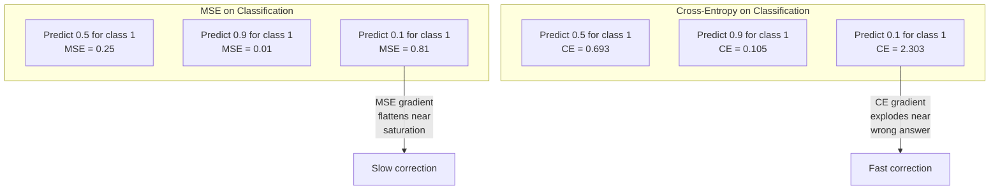
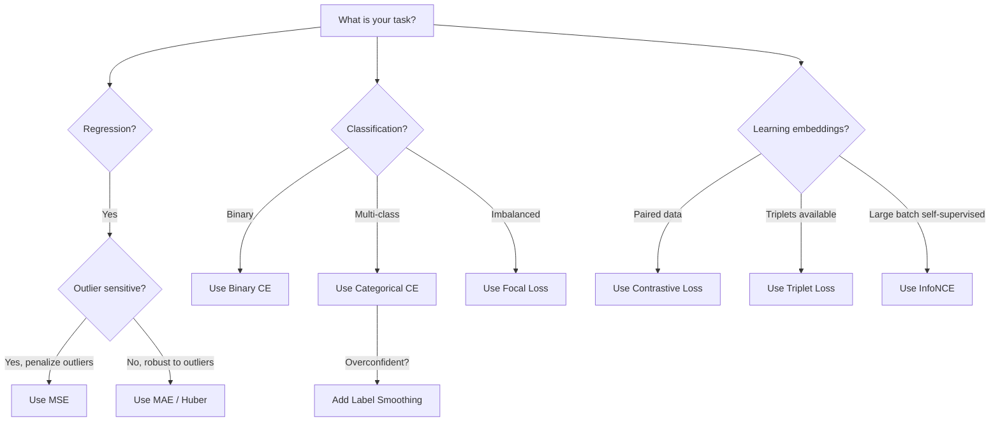
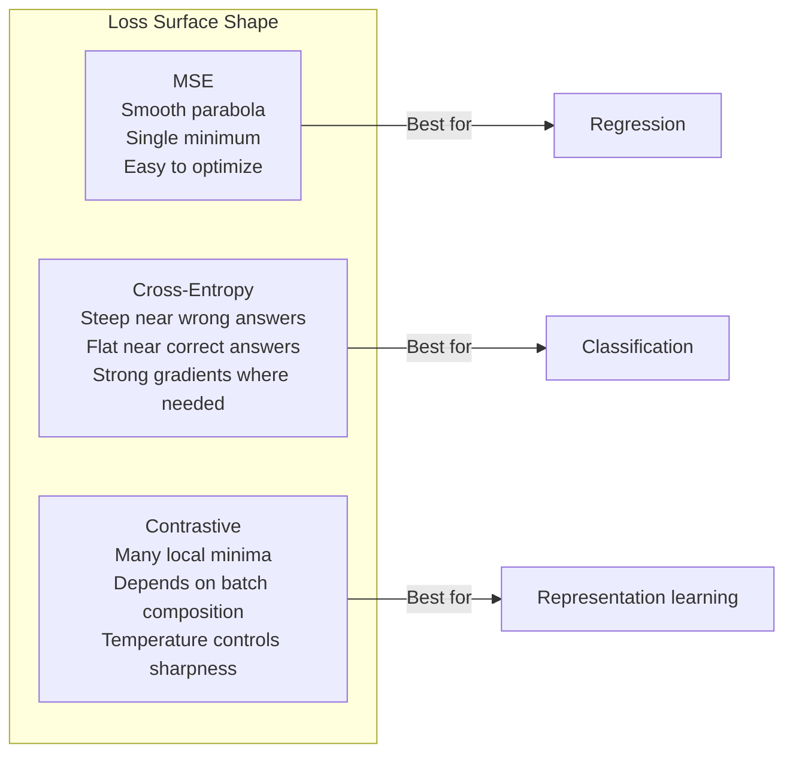

# Funkcje straty

> Twoja sieć dokonuje predykcji. Rzeczywistość mówi co innego. Jak bardzo się myli? Tę liczbę nazywamy stratą (loss). Wybierz złą funkcję straty i twój model zoptymalizuje się pod kompletnie inny cel, niż zamierzałeś.

**Typ:** Build
**Języki:** Python
**Wymagania wstępne:** Lekcja 03.04 (Funkcje aktywacji)
**Czas:** ~75 minut

## Cele nauki

- Zaimplementować od zera MSE, binarną entropię skrośną (binary cross-entropy), kategorialną entropię skrośną (categorical cross-entropy) oraz stratę kontrastową (contrastive loss, InfoNCE) wraz z ich gradientami
- Wyjaśnić, czemu MSE zawodzi w klasyfikacji, demonstrując scenariusz porażki "przewiduj 0,5 dla wszystkiego"
- Zastosować label smoothing do cross-entropy i opisać, jak zapobiega ona nadmiernie pewnym predykcjom
- Wybrać właściwą funkcję straty dla regresji, klasyfikacji binarnej, klasyfikacji wieloklasowej i zadań uczenia reprezentacji (embedding learning)

## Problem

Model minimalizujący MSE w zadaniu klasyfikacji będzie z pełnym przekonaniem przewidywał 0,5 dla wszystkiego. Minimalizuje stratę. Jest też bezużyteczny.

Funkcja straty jest jedyną rzeczą, którą twój model faktycznie optymalizuje. Nie dokładność (accuracy). Nie F1 score. Nie jakąkolwiek metrykę, którą raportujesz swojemu menedżerowi. Optymalizator bierze gradient funkcji straty i dostosowuje wagi, aby ta liczba była mniejsza. Jeśli funkcja straty nie odzwierciedla tego, na czym ci zależy, model znajdzie matematycznie najtańszy sposób, by ją zaspokoić, a ten sposób prawie nigdy nie jest tym, czego chciałeś.

Oto konkretny przykład. Masz zadanie klasyfikacji binarnej. Dwie klasy, podział 50/50. Używasz MSE jako funkcji straty. Model przewiduje 0,5 dla każdego pojedynczego wejścia. Średnie MSE wynosi 0,25, co jest minimalną możliwą wartością bez faktycznego uczenia się czegokolwiek. Model ma zerową zdolność dyskryminacyjną, ale technicznie zminimalizował twoją funkcję straty. Przełącz się na cross-entropy i ten sam model jest zmuszony przesuwać predykcje w stronę 0 lub 1, ponieważ -log(0,5) = 0,693 to fatalna strata, podczas gdy -log(0,99) = 0,01 nagradza pewne, poprawne predykcje. Wybór funkcji straty jest różnicą pomiędzy modelem, który się uczy, a modelem, który oszukuje metrykę.

Robi się jeszcze gorzej. W uczeniu samonadzorowanym (self-supervised learning) nie masz nawet etykiet. Strata kontrastowa definiuje sygnał uczenia w całości: co liczy się jako podobne, co liczy się jako różne i jak silnie model powinien je rozdzielać. Jeśli źle dobierzesz stratę kontrastową, twoje embeddingi zapadną się do jednego punktu -- każde wejście będzie mapowane na ten sam wektor. Technicznie zerowa strata. Kompletnie bezwartościowe.

## Koncepcja

### Błąd średniokwadratowy (MSE)

Domyślna funkcja dla regresji. Oblicz kwadrat różnicy między predykcją i wartością docelową, uśrednij po wszystkich próbkach.

```
MSE = (1/n) * sum((y_pred - y_true)^2)
```

Czemu podnoszenie do kwadratu ma znaczenie: penalizuje duże błędy w sposób kwadratowy. Błąd o wartości 2 kosztuje 4 razy więcej niż błąd o wartości 1. Błąd o wartości 10 kosztuje 100 razy więcej. To sprawia, że MSE jest czułe na wartości odstające (outliers) -- jedna mocno błędna predykcja może dominować w wartości straty.

Konkretne liczby: jeśli twój model przewiduje ceny domów i myli się o 10 000 $ dla większości domów, ale o 200 000 $ w przypadku jednej rezydencji, MSE będzie agresywnie próbować naprawić tę jedną rezydencję, potencjalnie szkodząc wynikom dla pozostałych 99 domów.

Gradient MSE względem predykcji wynosi:

```
dMSE/dy_pred = (2/n) * (y_pred - y_true)
```

Liniowy względem błędu. Większe błędy dają większe gradienty. To jest zaleta w regresji (duże błędy wymagają dużych korekt) i wada w klasyfikacji (chcesz penalizować pewne, błędne odpowiedzi wykładniczo, nie liniowo).

### Strata typu cross-entropy

Funkcja straty dla klasyfikacji. Zakorzeniona w teorii informacji -- mierzy rozbieżność (divergence) między przewidywanym rozkładem prawdopodobieństwa a rozkładem rzeczywistym.

**Binarna entropia skrośna (BCE):**

```
BCE = -(y * log(p) + (1 - y) * log(1 - p))
```

Gdzie y jest rzeczywistą etykietą (0 lub 1), a p jest przewidywanym prawdopodobieństwem.

Czemu -log(p) działa: gdy rzeczywista etykieta to 1, a przewidujesz p = 0,99, strata wynosi -log(0,99) = 0,01. Gdy przewidujesz p = 0,01, strata wynosi -log(0,01) = 4,6. Ta różnica 460-krotna jest powodem, dla którego cross-entropy działa. Brutalnie karze pewne, błędne predykcje, podczas gdy niewiele penalizuje pewne, poprawne predykcje.

Gradient mówi tę samą historię:

```
dBCE/dp = -(y/p) + (1-y)/(1-p)
```

Gdy y = 1, a p jest bliskie zeru, gradient wynosi -1/p, co zbliża się do minus nieskończoności. Model otrzymuje ogromny sygnał, żeby naprawić swój błąd. Gdy p jest bliskie 1, gradient jest niewielki. Już jest poprawnie, nie ma czego naprawiać.

**Kategorialna entropia skrośna:**

Dla klasyfikacji wieloklasowej z etykietami zakodowanymi metodą one-hot.

```
CCE = -sum(y_i * log(p_i))
```

Tylko prawdziwa klasa wnosi wkład do straty (ponieważ wszystkie inne y_i wynoszą zero). Jeśli istnieje 10 klas, a poprawna klasa otrzymuje prawdopodobieństwo 0,1 (czyste zgadywanie), strata wynosi -log(0,1) = 2,3. Jeśli poprawna klasa otrzymuje prawdopodobieństwo 0,9, strata wynosi -log(0,9) = 0,105. Model uczy się koncentrować masę prawdopodobieństwa na właściwej odpowiedzi.

### Czemu MSE zawodzi w klasyfikacji



Gradienty MSE wypłaszczają się, gdy predykcje są bliskie 0 lub 1 (z powodu saturacji sigmoidy). Gradienty cross-entropy to kompensują -- funkcja -log znosi efekt płaskich obszarów sigmoidy, dając silne gradienty właśnie tam, gdzie są najbardziej potrzebne.

### Label smoothing

Standardowe etykiety one-hot mówią "to jest w 100% klasa 3 i w 0% wszystko inne". To jest silne stwierdzenie. Label smoothing je łagodzi:

```
smooth_label = (1 - alpha) * one_hot + alpha / num_classes
```

Przy alpha = 0,1 i 10 klasach: zamiast [0, 0, 1, 0, ...], wartość docelowa staje się [0,01, 0,01, 0,91, 0,01, ...]. Model celuje w 0,91 zamiast w 1,0.

Czemu to działa: model próbujący wygenerować dokładnie 1,0 przez softmax musi przesuwać logity w stronę nieskończoności. To powoduje nadmierną pewność (overconfidence), szkodzi generalizacji i sprawia, że model jest podatny na zmiany rozkładu danych (distribution shift). Label smoothing ogranicza wartość docelową do 0,9 (przy alpha=0,1), utrzymując logity w rozsądnym zakresie. GPT i większość współczesnych modeli wykorzystuje label smoothing lub jego odpowiednik.

### Strata kontrastowa

Brak etykiet. Brak klas. Tylko pary wejść i pytanie: czy są podobne, czy różne?

**Strata kontrastowa w stylu SimCLR (NT-Xent / InfoNCE):**

Weź jeden obraz. Stwórz dwie augmentowane wersje (przycięcie, obrót, zmiana koloru). To jest "pozytywna para" -- powinny mieć podobne embeddingi. Każdy inny obraz w batchu tworzy "negatywną parę" -- powinny mieć różne embeddingi.

```
L = -log(exp(sim(z_i, z_j) / tau) / sum(exp(sim(z_i, z_k) / tau)))
```

Gdzie sim() to podobieństwo kosinusowe (cosine similarity), z_i i z_j to pozytywna para, suma jest po wszystkich negatywach, a tau (temperatura) kontroluje, jak ostry jest rozkład. Niższa temperatura = trudniejsze negatywy = bardziej agresywne rozdzielanie.

Konkretne liczby: rozmiar batcha 256 oznacza 255 negatywów na każdą pozytywną parę. Temperatura tau = 0,07 (domyślna wartość w SimCLR). Strata wygląda jak softmax po podobieństwach -- chce, by podobieństwo pozytywnej pary było najwyższe spośród wszystkich 256 opcji.

**Triplet loss:**

Przyjmuje trzy wejścia: anchor (kotwica), positive (taka sama klasa), negative (inna klasa).

```
L = max(0, d(anchor, positive) - d(anchor, negative) + margin)
```

Margin (zwykle 0,2-1,0) wymusza minimalną różnicę między odległością do pozytywu i odległością do negatywu. Jeśli negatyw jest już wystarczająco daleko, strata wynosi zero -- brak gradientu, brak aktualizacji. To czyni trening efektywnym, ale wymaga starannego doboru tripletów (triplet mining) -- wybierania trudnych negatywów, które są blisko anchora.

### Focal loss

Dla niezbalansowanych zbiorów danych. Standardowa cross-entropy traktuje wszystkie poprawnie sklasyfikowane przykłady tak samo. Focal loss zmniejsza wagę łatwych przykładów:

```
FL = -alpha * (1 - p_t)^gamma * log(p_t)
```

Gdzie p_t jest przewidywanym prawdopodobieństwem prawdziwej klasy, a gamma kontroluje skupienie (focusing). Przy gamma = 0 jest to standardowa cross-entropy. Przy gamma = 2 (wartość domyślna):

- Łatwy przykład (p_t = 0,9): waga = (0,1)^2 = 0,01. Praktycznie ignorowany.
- Trudny przykład (p_t = 0,1): waga = (0,9)^2 = 0,81. Pełny sygnał gradientu.

Focal loss zostało wprowadzone przez Lin i in. do detekcji obiektów, gdzie 99% kandydujących regionów to tło (łatwe negatywy). Bez focal loss model tonie w łatwych przykładach tła i nigdy nie uczy się wykrywać obiektów. Z nim model koncentruje swoją zdolność na trudnych, niejednoznacznych przypadkach, które mają znaczenie.

### Drzewo decyzyjne funkcji straty



### Krajobraz straty



## Zbuduj to

### Krok 1: MSE i jego gradient

```python
def mse(predictions, targets):
    n = len(predictions)
    total = 0.0
    for p, t in zip(predictions, targets):
        total += (p - t) ** 2
    return total / n

def mse_gradient(predictions, targets):
    n = len(predictions)
    grads = []
    for p, t in zip(predictions, targets):
        grads.append(2.0 * (p - t) / n)
    return grads
```

### Krok 2: Binarna entropia skrośna

Problem log(0) jest realny. Jeśli model przewiduje dokładnie 0 dla przykładu pozytywnego, log(0) = minus nieskończoność. Przycinanie (clipping) temu zapobiega.

```python
import math

def binary_cross_entropy(predictions, targets, eps=1e-15):
    n = len(predictions)
    total = 0.0
    for p, t in zip(predictions, targets):
        p_clipped = max(eps, min(1 - eps, p))
        total += -(t * math.log(p_clipped) + (1 - t) * math.log(1 - p_clipped))
    return total / n

def bce_gradient(predictions, targets, eps=1e-15):
    grads = []
    for p, t in zip(predictions, targets):
        p_clipped = max(eps, min(1 - eps, p))
        grads.append(-(t / p_clipped) + (1 - t) / (1 - p_clipped))
    return grads
```

### Krok 3: Kategorialna entropia skrośna z softmax

Softmax przekształca surowe logity w prawdopodobieństwa. Następnie obliczamy cross-entropy względem etykiet one-hot.

```python
def softmax(logits):
    max_val = max(logits)
    exps = [math.exp(x - max_val) for x in logits]
    total = sum(exps)
    return [e / total for e in exps]

def categorical_cross_entropy(logits, target_index, eps=1e-15):
    probs = softmax(logits)
    p = max(eps, probs[target_index])
    return -math.log(p)

def cce_gradient(logits, target_index):
    probs = softmax(logits)
    grads = list(probs)
    grads[target_index] -= 1.0
    return grads
```

Gradient połączenia softmax + cross-entropy upraszcza się w piękny sposób: jest to po prostu (przewidywane prawdopodobieństwo - 1) dla prawdziwej klasy oraz (przewidywane prawdopodobieństwo) dla wszystkich innych klas. To elegantne uproszczenie nie jest przypadkiem -- to jest powód, dla którego softmax i cross-entropy są stosowane w parze.

### Krok 4: Label smoothing

```python
def label_smoothed_cce(logits, target_index, num_classes, alpha=0.1, eps=1e-15):
    probs = softmax(logits)
    loss = 0.0
    for i in range(num_classes):
        if i == target_index:
            smooth_target = 1.0 - alpha + alpha / num_classes
        else:
            smooth_target = alpha / num_classes
        p = max(eps, probs[i])
        loss += -smooth_target * math.log(p)
    return loss
```

### Krok 5: Strata kontrastowa (uproszczone InfoNCE)

```python
def cosine_similarity(a, b):
    dot = sum(x * y for x, y in zip(a, b))
    norm_a = math.sqrt(sum(x * x for x in a))
    norm_b = math.sqrt(sum(x * x for x in b))
    if norm_a < 1e-10 or norm_b < 1e-10:
        return 0.0
    return dot / (norm_a * norm_b)

def contrastive_loss(anchor, positive, negatives, temperature=0.07):
    sim_pos = cosine_similarity(anchor, positive) / temperature
    sim_negs = [cosine_similarity(anchor, neg) / temperature for neg in negatives]

    max_sim = max(sim_pos, max(sim_negs)) if sim_negs else sim_pos
    exp_pos = math.exp(sim_pos - max_sim)
    exp_negs = [math.exp(s - max_sim) for s in sim_negs]
    total_exp = exp_pos + sum(exp_negs)

    return -math.log(max(1e-15, exp_pos / total_exp))
```

### Krok 6: MSE vs cross-entropy w klasyfikacji

Wytrenuj tę samą sieć z lekcji 04 (zbiór danych "circle") z obiema funkcjami straty. Zaobserwuj, że cross-entropy zbiega szybciej.

```python
import random

def sigmoid(x):
    x = max(-500, min(500, x))
    return 1.0 / (1.0 + math.exp(-x))

def make_circle_data(n=200, seed=42):
    random.seed(seed)
    data = []
    for _ in range(n):
        x = random.uniform(-2, 2)
        y = random.uniform(-2, 2)
        label = 1.0 if x * x + y * y < 1.5 else 0.0
        data.append(([x, y], label))
    return data


class LossComparisonNetwork:
    def __init__(self, loss_type="bce", hidden_size=8, lr=0.1):
        random.seed(0)
        self.loss_type = loss_type
        self.lr = lr
        self.hidden_size = hidden_size

        self.w1 = [[random.gauss(0, 0.5) for _ in range(2)] for _ in range(hidden_size)]
        self.b1 = [0.0] * hidden_size
        self.w2 = [random.gauss(0, 0.5) for _ in range(hidden_size)]
        self.b2 = 0.0

    def forward(self, x):
        self.x = x
        self.z1 = []
        self.h = []
        for i in range(self.hidden_size):
            z = self.w1[i][0] * x[0] + self.w1[i][1] * x[1] + self.b1[i]
            self.z1.append(z)
            self.h.append(max(0.0, z))

        self.z2 = sum(self.w2[i] * self.h[i] for i in range(self.hidden_size)) + self.b2
        self.out = sigmoid(self.z2)
        return self.out

    def backward(self, target):
        if self.loss_type == "mse":
            d_loss = 2.0 * (self.out - target)
        else:
            eps = 1e-15
            p = max(eps, min(1 - eps, self.out))
            d_loss = -(target / p) + (1 - target) / (1 - p)

        d_sigmoid = self.out * (1 - self.out)
        d_out = d_loss * d_sigmoid

        for i in range(self.hidden_size):
            d_relu = 1.0 if self.z1[i] > 0 else 0.0
            d_h = d_out * self.w2[i] * d_relu
            self.w2[i] -= self.lr * d_out * self.h[i]
            for j in range(2):
                self.w1[i][j] -= self.lr * d_h * self.x[j]
            self.b1[i] -= self.lr * d_h
        self.b2 -= self.lr * d_out

    def compute_loss(self, pred, target):
        if self.loss_type == "mse":
            return (pred - target) ** 2
        else:
            eps = 1e-15
            p = max(eps, min(1 - eps, pred))
            return -(target * math.log(p) + (1 - target) * math.log(1 - p))

    def train(self, data, epochs=200):
        losses = []
        for epoch in range(epochs):
            total_loss = 0.0
            correct = 0
            for x, y in data:
                pred = self.forward(x)
                self.backward(y)
                total_loss += self.compute_loss(pred, y)
                if (pred >= 0.5) == (y >= 0.5):
                    correct += 1
            avg_loss = total_loss / len(data)
            accuracy = correct / len(data) * 100
            losses.append((avg_loss, accuracy))
            if epoch % 50 == 0 or epoch == epochs - 1:
                print(f"    Epoch {epoch:3d}: loss={avg_loss:.4f}, accuracy={accuracy:.1f}%")
        return losses
```

## Użyj tego

PyTorch udostępnia wszystkie standardowe funkcje straty z wbudowaną stabilnością numeryczną:

```python
import torch
import torch.nn as nn
import torch.nn.functional as F

predictions = torch.tensor([0.9, 0.1, 0.7], requires_grad=True)
targets = torch.tensor([1.0, 0.0, 1.0])

mse_loss = F.mse_loss(predictions, targets)
bce_loss = F.binary_cross_entropy(predictions, targets)

logits = torch.randn(4, 10)
labels = torch.tensor([3, 7, 1, 9])
ce_loss = F.cross_entropy(logits, labels)
ce_smooth = F.cross_entropy(logits, labels, label_smoothing=0.1)
```

Używaj `F.cross_entropy` (a nie `F.nll_loss` w połączeniu z ręcznym softmax). Łączy ona log-softmax i ujemną log-wiarygodność (negative log-likelihood) w jednej, numerycznie stabilnej operacji. Zastosowanie softmax oddzielnie, a następnie wzięcie logarytmu, jest mniej stabilne -- tracisz precyzję przy odejmowaniu dużych wartości wykładniczych.

W przypadku uczenia kontrastowego większość zespołów korzysta z własnych implementacji lub bibliotek takich jak `lightly` czy `pytorch-metric-learning`. Główna pętla jest zawsze taka sama: oblicz podobieństwa parami, stwórz softmax po pozytywach i negatywach, propaguj wstecznie.

## Wynik (Ship It)

Ta lekcja tworzy:
- `outputs/prompt-loss-function-selector.md` -- wielorazowy prompt do wyboru właściwej funkcji straty
- `outputs/prompt-loss-debugger.md` -- prompt diagnostyczny na wypadek, gdy krzywa straty wygląda nieprawidłowo

## Zadania

1. Zaimplementuj Huber loss (smooth L1 loss), która jest MSE dla małych błędów i MAE dla dużych błędów. Wytrenuj sieć regresyjną przewidującą y = sin(x), porównując MSE z Huber loss, gdy 5% celów treningowych zawiera dodany losowy szum (wartości odstające). Porównaj końcowy błąd testowy.

2. Dodaj focal loss do pętli treningowej klasyfikacji binarnej. Stwórz niezbalansowany zbiór danych (90% klasa 0, 10% klasa 1). Porównaj standardowy BCE z focal loss (gamma=2) pod względem recall dla klasy mniejszościowej po 200 epokach.

3. Zaimplementuj triplet loss z semi-hard negative mining. Wygeneruj dwuwymiarowe dane embeddingów dla 5 klas. Dla każdego anchora znajdź najtrudniejszy negatyw, który jest wciąż dalej niż pozytyw (semi-hard). Porównaj zbieżność z losowym wyborem tripletów.

4. Przeprowadź porównanie MSE vs cross-entropy, ale śledź wielkości gradientów w każdej warstwie podczas treningu. Wykreśl średnią normę gradientu na epokę. Zweryfikuj, że cross-entropy generuje większe gradienty we wczesnych epokach, gdy model jest najbardziej niepewny.

5. Zaimplementuj stratę KL divergence i zweryfikuj, że minimalizacja KL(true || predicted) daje te same gradienty co cross-entropy, gdy rzeczywisty rozkład jest one-hot. Następnie wypróbuj soft targets (jak w destylacji wiedzy/knowledge distillation), gdzie "rzeczywisty" rozkład pochodzi z wyjścia softmax modelu nauczyciela (teacher model).

## Kluczowe terminy

| Termin | Co ludzie mówią | Co to faktycznie oznacza |
|------|----------------|----------------------|
| Funkcja straty (Loss function) | "Jak bardzo model się myli" | Różniczkowalna funkcja mapująca predykcje i wartości docelowe na skalar, który optymalizator minimalizuje |
| MSE | "Średni błąd kwadratowy" | Średnia z kwadratów różnic między predykcjami i wartościami docelowymi; penalizuje duże błędy w sposób kwadratowy |
| Cross-entropy | "Strata klasyfikacyjna" | Mierzy rozbieżność (divergence) między przewidywanym rozkładem prawdopodobieństwa a rzeczywistym rozkładem za pomocą -log(p) |
| Binary cross-entropy | "BCE" | Cross-entropy dla dwóch klas: -(y*log(p) + (1-y)*log(1-p)) |
| Label smoothing | "Łagodzenie wartości docelowych" | Zastąpienie sztywnych etykiet 0/1 wartościami miękkimi (np. 0,1/0,9), aby zapobiec nadmiernej pewności i poprawić generalizację |
| Strata kontrastowa (Contrastive loss) | "Przyciągaj razem, odpychaj od siebie" | Strata, która uczy reprezentacji, sprawiając, że podobne pary są blisko, a niepodobne pary daleko w przestrzeni embeddingów |
| InfoNCE | "Strata CLIP/SimCLR" | Znormalizowana, skalowana temperaturą cross-entropy po wynikach podobieństwa; traktuje uczenie kontrastowe jako klasyfikację |
| Focal loss | "Naprawa danych niezbalansowanych" | Cross-entropy ważona przez (1-p_t)^gamma, aby zmniejszyć wagę łatwych przykładów i skupić się na trudnych |
| Triplet loss | "Anchor-positive-negative" | Przesuwa anchor bliżej pozytywu niż negatywu o co najmniej wartość margin w przestrzeni embeddingów |
| Temperatura (Temperature) | "Pokrętło ostrości" | Skalarny dzielnik logitów/podobieństw, który kontroluje, jak spiczasty jest wynikowy rozkład; niższa = ostrzejszy |

## Dalsze materiały

- Lin i in., "Focal Loss for Dense Object Detection" (2017) -- wprowadzili focal loss do radzenia sobie z ekstremalnym niezbalansowaniem klas w detekcji obiektów (RetinaNet)
- Chen i in., "A Simple Framework for Contrastive Learning of Visual Representations" (SimCLR, 2020) -- zdefiniowali współczesny pipeline uczenia kontrastowego z funkcją straty NT-Xent
- Szegedy i in., "Rethinking the Inception Architecture" (2016) -- wprowadzili label smoothing jako technikę regularyzacji, obecnie standardową w większości dużych modeli
- Hinton i in., "Distilling the Knowledge in a Neural Network" (2015) -- destylacja wiedzy (knowledge distillation) wykorzystująca soft targets i KL divergence, fundamentalna dla kompresji modeli
