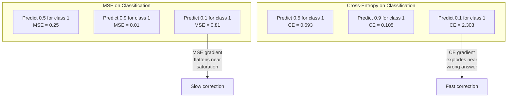
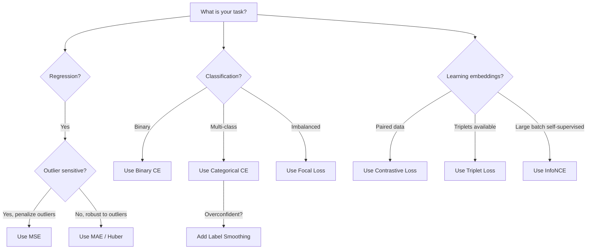
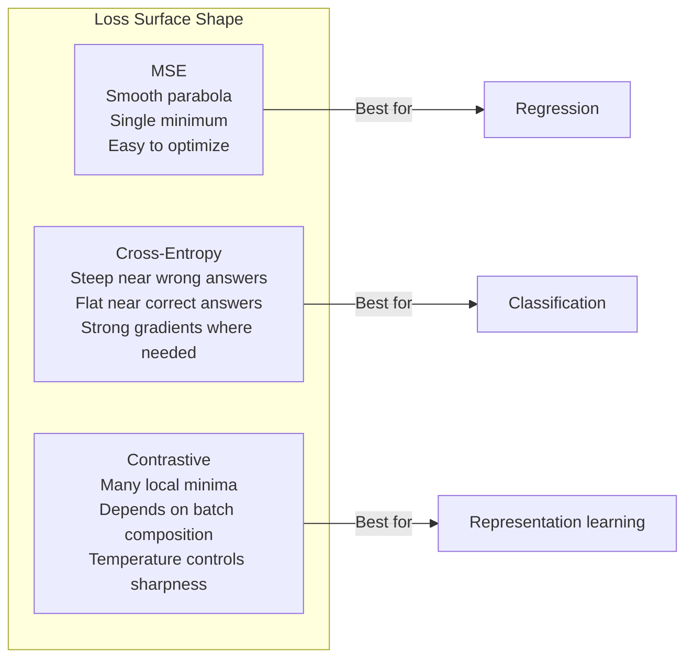

# Funkcje straty

> Twoja sieć dokonuje prognozy. Podstawowa prawda mówi inaczej. Jak bardzo jest to błędne? Ta liczba to strata. Wybierz niewłaściwą funkcję straty, a Twój model zoptymalizuje się pod kątem całkowicie niewłaściwej rzeczy.

**Typ:** Kompilacja
**Języki:** Python
**Wymagania:** Lekcja 03.04 (Funkcje aktywacji)
**Czas:** ~75 minut

## Cele nauczania

- Implementuj od podstaw MSE, binarną entropię krzyżową, kategoryczną entropię krzyżową i stratę kontrastową (InfoNCE) od podstaw z ich gradientami
- Wyjaśnij, dlaczego MSE nie spełnia wymagań klasyfikacji, demonstrując tryb awarii „przewiduj 0,5 dla wszystkiego”.
- Zastosuj wygładzanie etykiet do entropii krzyżowej i opisz, w jaki sposób zapobiega to zbyt pewnym przewidywaniom
- Wybierz właściwą funkcję straty dla regresji, klasyfikacji binarnej, klasyfikacji wieloklasowej i osadzania zadań edukacyjnych

## Problem

Model minimalizujący MSE w przypadku problemu klasyfikacji z pewnością przewidzi 0,5 dla wszystkiego. To minimalizowanie strat. To też jest bezużyteczne.

Funkcja straty jest jedyną rzeczą, którą faktycznie optymalizuje Twój model. Nie dokładność. Nie wynik F1. Nie jakikolwiek wskaźnik, który raportujesz swojemu menadżerowi. Optymalizator przyjmuje gradient funkcji straty i dostosowuje wagi, aby zmniejszyć tę liczbę. Jeśli funkcja straty nie odzwierciedla tego, na czym Ci zależy, model znajdzie matematycznie najtańszy sposób jej spełnienia, a ten sposób prawie nigdy nie jest tym, czego chciałeś.

Oto konkretny przykład. Masz zadanie klasyfikacji binarnej. Dwie klasy, podział 50/50. Traktujesz MSE jako swoją stratę. Model przewiduje 0,5 dla każdego pojedynczego wejścia. Średnie MSE wynosi 0,25 i jest to minimum możliwe bez uczenia się czegokolwiek. Model ma zerową zdolność dyskryminacyjną, ale technicznie zminimalizował funkcję straty. Przełącz na entropię krzyżową i ten sam model jest zmuszony popchnąć przewidywania w kierunku 0 lub 1, ponieważ -log(0,5) = 0,693 to straszliwa strata, podczas gdy -log(0,99) = 0,01 nagradza pewne, prawidłowe przewidywania. Wybór funkcji straty stanowi różnicę między modelem, który się uczy, a modelem, który wykorzystuje metrykę.

Jest coraz gorzej. W uczeniu się samonadzorowanym nie masz nawet etykiet. Strata kontrastowa całkowicie definiuje sygnał uczenia się: co liczy się jako podobne, co liczy się jako różne i jak mocno model powinien je od siebie odsunąć. Jeśli źle zastosujesz stratę kontrastową, Twoje osadzenia zwiną się do jednego punktu — każde wejście jest odwzorowywane na ten sam wektor. Technicznie zero strat. Całkowicie bezwartościowe.

## Koncepcja

### Średni błąd kwadratowy (MSE)

Wartość domyślna dla regresji. Oblicz kwadratową różnicę między prognozą a wartością docelową, średnią ze wszystkich próbek.

```
MSE = (1/n) * sum((y_pred - y_true)^2)
```

Dlaczego kwadratura ma znaczenie: karze kwadratowo duże błędy. Błąd 2 kosztuje 4 razy więcej niż błąd 1. Błąd 10 kosztuje 100 razy. To sprawia, że ​​MSE jest wrażliwe na wartości odstające – pojedyncza, całkowicie błędna prognoza dominuje nad stratą.

Liczby rzeczywiste: jeśli Twój model przewiduje ceny mieszkań i w przypadku jednej rezydencji różni się o $10,000 on most houses but off by $200 000, firma MSE będzie agresywnie próbowała naprawić tę jedną rezydencję, potencjalnie pogarszając wydajność pozostałych 99 domów.

Gradient MSE względem przewidywania wynosi:

```
dMSE/dy_pred = (2/n) * (y_pred - y_true)
```

Liniowy w błędzie. Większe błędy powodują większe gradienty. Jest to funkcja regresji (duże błędy wymagają dużych poprawek) i błąd klasyfikacji (chcesz karać pewne błędne odpowiedzi wykładniczo, a nie liniowo).

### Strata między entropią

Funkcja straty dla klasyfikacji. Zakorzeniony w teorii informacji - mierzy rozbieżność między przewidywanym rozkładem prawdopodobieństwa a rozkładem rzeczywistym.

**Binarna entropia krzyżowa (BCE):**

```
BCE = -(y * log(p) + (1 - y) * log(1 - p))
```

Gdzie y to prawdziwa etykieta (0 lub 1), a p to przewidywane prawdopodobieństwo.

Dlaczego -log(p) działa: gdy prawdziwa etykieta wynosi 1 i przewidujesz p = 0,99, strata wynosi -log(0,99) = 0,01. Kiedy przewidujesz p = 0,01, strata wynosi -log(0,01) = 4,6. Ta 460-krotna różnica jest powodem, dla którego działa entropia krzyżowa. Brutalnie karze pewne błędne przewidywania, ledwo karząc te, które są pewne i prawidłowe.

Gradient opowiada tę samą historię:

```
dBCE/dp = -(y/p) + (1-y)/(1-p)
```

Gdy y = 1 i p jest bliskie zeru, gradient wynosi -1/p, co zbliża się do ujemnej nieskończoności. Modelka dostaje ogromny sygnał, żeby naprawić swój błąd. Gdy p jest bliskie 1, gradient jest niewielki. Już poprawne, nie ma co poprawiać.

**Kategoryczna entropia krzyżowa:**

Do klasyfikacji wieloklasowej z jednokrotnie zakodowanymi celami.

```
CCE = -sum(y_i * log(p_i))
```

Tylko prawdziwa klasa przyczynia się do straty (ponieważ wszystkie inne y_i wynoszą zero). Jeśli jest 10 klas i prawdopodobieństwo prawidłowej klasy wynosi 0,1 (losowe zgadywanie), strata wynosi -log(0,1) = 2,3. Jeśli prawdopodobieństwo prawidłowej klasy wynosi 0,9, strata wynosi -log(0,9) = 0,105. Model uczy się koncentrować masę prawdopodobieństwa na właściwej odpowiedzi.

### Dlaczego MSE nie przechodzi klasyfikacji



Gradienty MSE spłaszczają się, gdy przewidywania są bliskie 0 lub 1 (z powodu nasycenia esicy). Kompensują to gradienty entropii krzyżowej — opcja -log anuluje płaskie obszary sigmoidy, dając silne gradienty dokładnie tam, gdzie są najbardziej potrzebne.

### Wygładzanie etykiet

Standardowe etykiety typu one-hot mówią „to jest w 100% klasa 3 i 0% wszystko inne”. To mocne twierdzenie. Wygładzanie etykiet zmiękcza je:

```
smooth_label = (1 - alpha) * one_hot + alpha / num_classes
```

Przy alfa = 0,1 i 10 klasach: zamiast [0, 0, 1, 0, ...] celem staje się [0,01, 0,01, 0,91, 0,01, ...]. Model docelowy wynosi 0,91 zamiast 1,0.

Dlaczego to działa: model próbujący wyprowadzić dokładnie 1,0 przez softmax, musi przesuwać logity do nieskończoności. Powoduje to nadmierną pewność, szkodzi uogólnieniom i sprawia, że ​​model jest podatny na zmiany rozkładu. Wygładzanie etykiet ogranicza cel do 0,9 (przy alfa = 0,1), utrzymując logity w rozsądnym zakresie. GPT i większość nowoczesnych modeli wykorzystuje wygładzanie etykiet lub jego odpowiednik.

### Strata kontrastowa

Brak etykiet. Żadnych zajęć. Tylko pary wejść i pytanie: czy są podobne czy różne?

**Utrata kontrastu w stylu SimCLR (NT-Xent / InfoNCE):**

Zrób jedno zdjęcie. Utwórz dwa rozszerzone widoki (przytnij, obróć, drgania kolorów). Są to „para dodatnia” – powinny mieć podobne osadzenie. Każdy inny obraz w partii tworzy „parę ujemną” — powinny mieć różne osadzenia.

```
L = -log(exp(sim(z_i, z_j) / tau) / sum(exp(sim(z_i, z_k) / tau)))
```

Gdzie sim() jest cosinusem podobieństwa, z_i i z_j są parą dodatnią, suma obejmuje wszystkie ujemne, a tau (temperatura) kontroluje ostrość rozkładu. Niższa temperatura = twardsze negatywy = bardziej agresywna separacja.

Liczby rzeczywiste: wielkość partii 256 oznacza 255 negatywów na parę dodatnią. Temperatura tau = 0,07 (domyślnie SimCLR). Strata wygląda jak softmax względem podobieństw – chce, aby podobieństwo pary dodatniej było najwyższe spośród wszystkich 256 opcji.

**Strata potrójna:**

Pobiera trzy dane wejściowe: kotwicę, dodatnią (ta sama klasa), ujemną (inna klasa).

```
L = max(0, d(anchor, positive) - d(anchor, negative) + margin)
```

Margines (zwykle 0,2-1,0) wymusza minimalną przerwę między odległościami dodatnimi i ujemnymi. Jeśli negatyw jest już wystarczająco daleko, strata wynosi zero – brak gradientu, brak aktualizacji. Dzięki temu trening jest skuteczny, ale wymaga ostrożnego wydobywania trójek (wybieranie twardych negatywów znajdujących się blisko kotwicy).

### Utrata ogniskowa

W przypadku niezrównoważonych zbiorów danych. Standardowa entropia krzyżowa traktuje jednakowo wszystkie poprawnie sklasyfikowane przykłady. Utrata ogniskowa zmniejsza wagę prostych przykładów:

```
FL = -alpha * (1 - p_t)^gamma * log(p_t)
```

Gdzie p_t jest przewidywanym prawdopodobieństwem prawdziwej klasy, a gamma kontroluje ogniskowanie. Przy gamma = 0 jest to standardowa entropia krzyżowa. Przy gamma = 2 (domyślnie):

- Łatwy przykład (p_t = 0,9): waga = (0,1)^2 = 0,01. Skutecznie ignorowane.
- Trudny przykład (p_t = 0,1): waga = (0,9)^2 = 0,81. Pełny sygnał gradientowy.

Utratę ogniskową wprowadzili Lin i in. do wykrywania obiektów, gdzie 99% obszarów kandydujących to tło (łatwe negatywy). Bez utraty ogniskowej model tonie w łatwych przykładach tła i nigdy nie uczy się wykrywać obiektów. Dzięki niemu model koncentruje swoje możliwości na trudnych, niejednoznacznych przypadkach, które mają znaczenie.

### Drzewo decyzyjne funkcji straty



### Krajobraz strat



## Zbuduj to

### Krok 1: MSE i jego gradient

```python
def mse(predictions, targets):
    n = len(predictions)
    total = 0.0
    for p, t in zip(predictions, targets):
        total += (p - t) ** 2
    return total / n

def mse_gradient(predictions, targets):
    n = len(predictions)
    grads = []
    for p, t in zip(predictions, targets):
        grads.append(2.0 * (p - t) / n)
    return grads
```

### Krok 2: Binarna entropia krzyżowa

Problem log(0) jest prawdziwy. Jeśli model przewiduje dokładnie 0 dla przykładu dodatniego, log(0) = ujemna nieskończoność. Obcinanie zapobiega temu.

```python
import math

def binary_cross_entropy(predictions, targets, eps=1e-15):
    n = len(predictions)
    total = 0.0
    for p, t in zip(predictions, targets):
        p_clipped = max(eps, min(1 - eps, p))
        total += -(t * math.log(p_clipped) + (1 - t) * math.log(1 - p_clipped))
    return total / n

def bce_gradient(predictions, targets, eps=1e-15):
    grads = []
    for p, t in zip(predictions, targets):
        p_clipped = max(eps, min(1 - eps, p))
        grads.append(-(t / p_clipped) + (1 - t) / (1 - p_clipped))
    return grads
```

### Krok 3: Kategoryczna entropia krzyżowa za pomocą Softmax

Softmax konwertuje surowe logity na prawdopodobieństwa. Następnie obliczamy entropię krzyżową względem jednego gorącego celu.

```python
def softmax(logits):
    max_val = max(logits)
    exps = [math.exp(x - max_val) for x in logits]
    total = sum(exps)
    return [e / total for e in exps]

def categorical_cross_entropy(logits, target_index, eps=1e-15):
    probs = softmax(logits)
    p = max(eps, probs[target_index])
    return -math.log(p)

def cce_gradient(logits, target_index):
    probs = softmax(logits)
    grads = list(probs)
    grads[target_index] -= 1.0
    return grads
```

Gradient softmax + entropia krzyżowa pięknie się upraszcza: jest to po prostu (przewidywane prawdopodobieństwo - 1) dla prawdziwej klasy i (przewidywane prawdopodobieństwo) dla wszystkich innych klas. To eleganckie uproszczenie nie jest dziełem przypadku — właśnie dlatego połączono softmax i cross-entropię.

### Krok 4: Wygładzanie etykiet

```python
def label_smoothed_cce(logits, target_index, num_classes, alpha=0.1, eps=1e-15):
    probs = softmax(logits)
    loss = 0.0
    for i in range(num_classes):
        if i == target_index:
            smooth_target = 1.0 - alpha + alpha / num_classes
        else:
            smooth_target = alpha / num_classes
        p = max(eps, probs[i])
        loss += -smooth_target * math.log(p)
    return loss
```

### Krok 5: Utrata kontrastu (uproszczone InfoNCE)

```python
def cosine_similarity(a, b):
    dot = sum(x * y for x, y in zip(a, b))
    norm_a = math.sqrt(sum(x * x for x in a))
    norm_b = math.sqrt(sum(x * x for x in b))
    if norm_a < 1e-10 or norm_b < 1e-10:
        return 0.0
    return dot / (norm_a * norm_b)

def contrastive_loss(anchor, positive, negatives, temperature=0.07):
    sim_pos = cosine_similarity(anchor, positive) / temperature
    sim_negs = [cosine_similarity(anchor, neg) / temperature for neg in negatives]

    max_sim = max(sim_pos, max(sim_negs)) if sim_negs else sim_pos
    exp_pos = math.exp(sim_pos - max_sim)
    exp_negs = [math.exp(s - max_sim) for s in sim_negs]
    total_exp = exp_pos + sum(exp_negs)

    return -math.log(max(1e-15, exp_pos / total_exp))
```

### Krok 6: MSE kontra entropia krzyżowa w klasyfikacji

Trenuj tę samą sieć z lekcji 04 (zbiór danych okręgu) z obiema funkcjami straty. Obserwuj, jak entropia krzyżowa zbiega się szybciej.

```python
import random

def sigmoid(x):
    x = max(-500, min(500, x))
    return 1.0 / (1.0 + math.exp(-x))

def make_circle_data(n=200, seed=42):
    random.seed(seed)
    data = []
    for _ in range(n):
        x = random.uniform(-2, 2)
        y = random.uniform(-2, 2)
        label = 1.0 if x * x + y * y < 1.5 else 0.0
        data.append(([x, y], label))
    return data

class LossComparisonNetwork:
    def __init__(self, loss_type="bce", hidden_size=8, lr=0.1):
        random.seed(0)
        self.loss_type = loss_type
        self.lr = lr
        self.hidden_size = hidden_size

        self.w1 = [[random.gauss(0, 0.5) for _ in range(2)] for _ in range(hidden_size)]
        self.b1 = [0.0] * hidden_size
        self.w2 = [random.gauss(0, 0.5) for _ in range(hidden_size)]
        self.b2 = 0.0

    def forward(self, x):
        self.x = x
        self.z1 = []
        self.h = []
        for i in range(self.hidden_size):
            z = self.w1[i][0] * x[0] + self.w1[i][1] * x[1] + self.b1[i]
            self.z1.append(z)
            self.h.append(max(0.0, z))

        self.z2 = sum(self.w2[i] * self.h[i] for i in range(self.hidden_size)) + self.b2
        self.out = sigmoid(self.z2)
        return self.out

    def backward(self, target):
        if self.loss_type == "mse":
            d_loss = 2.0 * (self.out - target)
        else:
            eps = 1e-15
            p = max(eps, min(1 - eps, self.out))
            d_loss = -(target / p) + (1 - target) / (1 - p)

        d_sigmoid = self.out * (1 - self.out)
        d_out = d_loss * d_sigmoid

        for i in range(self.hidden_size):
            d_relu = 1.0 if self.z1[i] > 0 else 0.0
            d_h = d_out * self.w2[i] * d_relu
            self.w2[i] -= self.lr * d_out * self.h[i]
            for j in range(2):
                self.w1[i][j] -= self.lr * d_h * self.x[j]
            self.b1[i] -= self.lr * d_h
        self.b2 -= self.lr * d_out

    def compute_loss(self, pred, target):
        if self.loss_type == "mse":
            return (pred - target) ** 2
        else:
            eps = 1e-15
            p = max(eps, min(1 - eps, pred))
            return -(target * math.log(p) + (1 - target) * math.log(1 - p))

    def train(self, data, epochs=200):
        losses = []
        for epoch in range(epochs):
            total_loss = 0.0
            correct = 0
            for x, y in data:
                pred = self.forward(x)
                self.backward(y)
                total_loss += self.compute_loss(pred, y)
                if (pred >= 0.5) == (y >= 0.5):
                    correct += 1
            avg_loss = total_loss / len(data)
            accuracy = correct / len(data) * 100
            losses.append((avg_loss, accuracy))
            if epoch % 50 == 0 or epoch == epochs - 1:
                print(f"    Epoch {epoch:3d}: loss={avg_loss:.4f}, accuracy={accuracy:.1f}%")
        return losses
```

## Użyj tego

PyTorch zapewnia wszystkie standardowe funkcje utraty z wbudowaną stabilnością numeryczną:

```python
import torch
import torch.nn as nn
import torch.nn.functional as F

predictions = torch.tensor([0.9, 0.1, 0.7], requires_grad=True)
targets = torch.tensor([1.0, 0.0, 1.0])

mse_loss = F.mse_loss(predictions, targets)
bce_loss = F.binary_cross_entropy(predictions, targets)

logits = torch.randn(4, 10)
labels = torch.tensor([3, 7, 1, 9])
ce_loss = F.cross_entropy(logits, labels)
ce_smooth = F.cross_entropy(logits, labels, label_smoothing=0.1)
```

Użyj `F.cross_entropy` (nie `F.nll_loss` i ręcznego softmax). Łączy log-softmax i ujemną logarytm wiarygodności w jednej numerycznie stabilnej operacji. Stosowanie softmax oddzielnie, a następnie wzięcie logu jest mniej stabilne - tracisz precyzję w odejmowaniu dużych wykładników.

W przypadku uczenia się kontrastowego większość zespołów korzysta z niestandardowych implementacji lub bibliotek, takich jak `lightly` lub `pytorch-metric-learning`. Główna pętla jest zawsze taka sama: oblicza podobieństwa parami, tworzy softmax na plusach i minusach, propaguje wstecznie.

## Wyślij to

Ta lekcja daje:
- `outputs/prompt-loss-function-selector.md` – monit wielokrotnego użytku umożliwiający wybranie właściwej funkcji straty
- `outputs/prompt-loss-debugger.md` – monit diagnostyczny, gdy krzywa strat wygląda nieprawidłowo

## Ćwiczenia

1. Zaimplementuj stratę Hubera (płynną stratę L1), która wynosi MSE dla małych błędów i MAE dla dużych błędów. Trenuj sieć regresyjną przewidującą y = sin(x) za pomocą MSE vs Huber, gdy 5% celów szkoleniowych ma dodany losowy szum (wartości odstające). Porównaj końcowy błąd testu.

2. Dodaj utratę ogniskową do pętli treningowej klasyfikacji binarnej. Utwórz niezrównoważony zbiór danych (90% klasa 0, 10% klasa 1). Porównaj standard BCE ze stratą ogniskową (gamma = 2) w przypadku przypominania sobie klas mniejszościowych po 200 epokach.

3. Zaimplementuj stratę tripletową przy użyciu półtwardego wydobycia ujemnego. Wygeneruj dane osadzania 2D dla 5 klas. Dla każdej kotwicy znajdź najtwardszy negatyw, który jest jeszcze dalej od pozytywu (półtwardy). Porównaj zbieżność z losowym wyborem trójek.

4. Przeprowadź porównanie MSE i entropii krzyżowej, ale podczas treningu śledź wielkość gradientu w każdej warstwie. Wykreśl średnią normę gradientu na epokę. Sprawdź, czy entropia krzyżowa wytwarza większe gradienty we wczesnych epokach, gdy model jest najbardziej niepewny.

5. Zaimplementuj utratę dywergencji KL i sprawdź, czy minimalizacja KL(true || przewidywana) daje takie same gradienty jak entropia krzyżowa, gdy prawdziwy rozkład jest jeden gorący. Następnie wypróbuj miękkie cele (takie jak destylacja wiedzy), gdzie „prawdziwa” dystrybucja pochodzi z wyjścia softmax modelu nauczyciela.

## Kluczowe terminy

| Termin | Co ludzie mówią | Co to właściwie oznacza |
|------|----------------|----------------------|
| Funkcja straty | „Jak błędny jest model” | Funkcja różniczkowalna odwzorowująca przewidywania i wartości docelowe na skalar, który optymalizator minimalizuje |
| MSE | „Średni kwadrat błędu” | Średnia kwadratów różnic między przewidywaniami i wartościami docelowymi; karze kwadratowo duże błędy |
| Entropia krzyżowa | „Utrata klasyfikacji” | Mierzy rozbieżność między przewidywanym rozkładem prawdopodobieństwa a rozkładem rzeczywistym za pomocą opcji -log(p) |
| Binarna entropia krzyżowa | „p.n.e.” | Entropia krzyżowa dla dwóch klas: -(y*log(p) + (1-y)*log(1-p)) |
| Wygładzanie etykiet | „Zmiękczanie celów” | Zastąpienie twardych celów 0/1 miękkimi wartościami (np. 0,1/0,9), aby zapobiec nadmiernej pewności i poprawić uogólnianie |
| Kontrastowa strata | „Ściągnij razem, rozsuń” | Strata, która uczy się reprezentacji, tworząc pary podobne blisko i pary odmienne daleko w przestrzeni osadzania |
| InformacjeNCE | „Strata CLIP/SimCLR” | Znormalizowana entropia krzyżowa skalowana temperaturowo w oparciu o wyniki podobieństwa; traktuje uczenie się kontrastowe jako klasyfikację |
| Utrata ogniskowej | „Poprawka niezrównoważonych danych” | Entropia krzyżowa ważona przez (1-p_t)^gamma w celu zmniejszenia wagi łatwych przykładów i skupienia się na trudnych |
| Strata potrójna | „Kotwica-pozytywna-negatywna” | Przesuwa kotwicę bliżej wartości dodatniej niż ujemnej przynajmniej o pewien margines przestrzeni osadzania |
| Temperatura | „Pokrętło ostrości” | Dzielnik skalarny logitów/podobieństw, który kontroluje szczyt wynikowego rozkładu; niższy = ostrzejszy |

## Dalsze czytanie

– Lin i in., „Focal Loss for Dense Object Detection” (2017) – wprowadzili utratę ogniskowej do obsługi ekstremalnej nierównowagi klas w wykrywaniu obiektów (RetinaNet)
– Chen i in., „A Simple Framework for Contrastive Learning of Visual Representations” (SimCLR, 2020) – zdefiniowali nowoczesny proces uczenia się kontrastowego z utratą NT-Xent
- Szegedy i in., „Rethinking the Inception Architecture” (2016) – wprowadzili wygładzanie etykiet jako technikę regularyzacji, obecnie standardową w większości dużych modeli
- Hinton i in., „Distilling the Knowledge in a Neural Network” (2015) – destylacja wiedzy przy użyciu celów miękkich i dywergencji KL, podstawa kompresji modelu