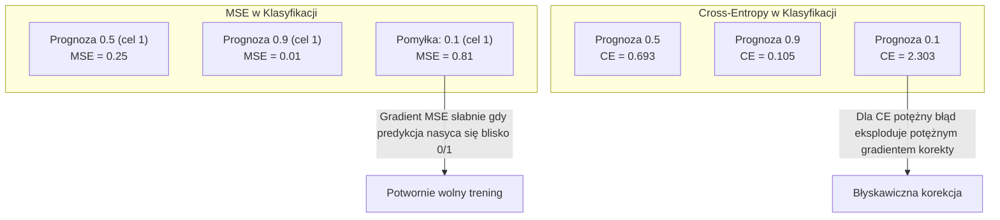
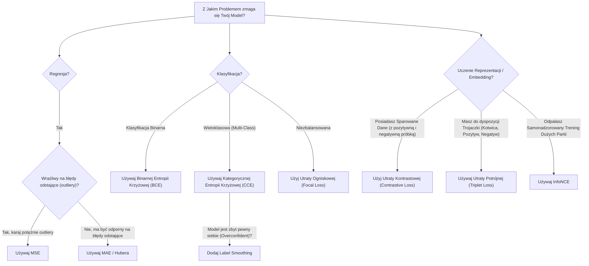

# Funkcje straty (Loss Functions)

> Twój model dokonuje pewnej predykcji. Prawda (etykieta) mówi jednak co innego. Jak bardzo model się myli? Ta liczbowa różnica to właśnie "strata" (loss). Jeśli dobierzesz niewłaściwą funkcję straty, Twój model perfekcyjnie zoptymalizuje się pod kątem całkowicie niewłaściwego zadania.

**Typ:** Budowa
**Języki:** Python
**Wymagania wstępne:** Lekcja 03.04 (Funkcje aktywacji)
**Czas:** ~75 minut

## Cele nauczania

- Wdrożenie od zera (wraz z ich gradientami) kluczowych metryk błędu: MSE (Błąd Średniokwadratowy), binarnej entropii krzyżowej (BCE), kategorycznej entropii krzyżowej (CCE) oraz straty kontrastowej (InfoNCE).
- Zrozumienie, dlaczego funkcja MSE całkowicie nie nadaje się do klasyfikacji, poparte symulacją trybu awaryjnego "dla wszystkiego przewiduj 0.5".
- Implementacja techniki wygładzania etykiet (label smoothing) dla entropii krzyżowej i zrozumienie, w jaki sposób zapobiega ona nadmiernej pewności siebie (overconfidence) modelu.
- Świadomy dobór właściwej funkcji straty do konkretnych zadań: regresji, klasyfikacji binarnej, klasyfikacji wieloklasowej oraz treningu przestrzeni osadzeń (embeddings).

## Problem

Jeśli zbudujesz model klasyfikatora rozwiązującego problem zero-jedynkowy (podział 50/50) i wskażesz mu optymalizowanie MSE (Błędu Średniokwadratowego), najprawdopodobniej zwróci on prognozę 0.5 dla każdej próbki. Wynik ten technicznie matematycznie daje najniższą globalną stratę. Jest jednak kompletnie bezużyteczny.

Funkcja straty to jedyny mierzalny cel, który Twój model poddaje optymalizacji. Nie optymalizuje on ogólnej celności (accuracy). Nie optymalizuje wskaźnika F1. Nie dba o żadną czytelną metrykę biznesową. Optymalizator odbiera wyliczony przez funkcję straty gradient i jedynie dostosowuje na jego podstawie wagi. Jeżeli Twoja funkcja straty nie odwzorowuje trafnie Twoich rzeczywistych oczekiwań, model brutalnie odnajdzie najtańszą matematyczną drogę, by ją zminimalizować – a ta obrana przez niego droga na ogół minie się z celem.

Dla konkretnego przykładu: Masz zadanie klasyfikacji binarnej. Dwie klasy, w zbalansowanym rozkładzie 50/50. Wykorzystujesz błąd MSE jako swoją stratę. Twój model z lenistwa przewiduje idealne 0.5 dla każdego możliwego na wejściu wariantu. Średnie MSE wynosi 0.25 i jest to absolutne dno graniczne do osiągnięcia bez podejmowania trudu uczenia się w ogóle czegokolwiek. Model w tym momencie dysponuje zerową zdolnością do klasyfikowania próbek, aczkolwiek w pełni wzorowo zminimalizował nałożoną stratę. 
Jeżeli zmienisz jednak funkcję na krzyżową entropię (Cross-Entropy), ten sam model błyskawicznie poczuje presję, aby zacząć spychać swoje werdykty do rzetelnego zera lub idealnej jedynki, ponieważ bezpieczne przewidywanie `-log(0.5) = 0.693` da surową karę na tle bardzo trafnych i pewnych decyzji typu `-log(0.99) = 0.01`. Odpowiedni dobór w tym miejscu sprawia potężną różnicę pomiędzy modelem omijającym zasady, a układem który chłonie realną wiedzę.

W przypadku uczenia samonadzorowanego (self-supervised learning) ten błąd kosztuje znacznie więcej. Nie dysponujesz w nim jawnymi etykietami. Strata kontrastowa całkowicie bierze w swoje ręce losy sygnału uczenia, definicję co uznać za odmienne a co za spójne z próbką, oraz na jak dużą odległość odpychać te wektory w wirtualnej przestrzeni. Błędnie skonstruowana utrata kontrastowa natychmiast zaowocuje tzw. załamaniem reprezentacji (representation collapse) — model wrzuci absolutnie każdy element z Twoich danych do tego samego punktu w wygenerowanej przestrzeni, osiągając matematyczne zero strat. Techniczny sukces i całkowicie wrakowy bezwartościowy model.

## Koncepcja

### Błąd Średniokwadratowy (MSE - Mean Squared Error)

To idealne, bezpieczne ustawienie domyślne do problemów regresji. Opiera się na wyliczeniu uśrednionych kwadratów od różnic pomiędzy oczekiwanym celem a próbką podaną na model.

```
MSE = (1/n) * sum((y_pred - y_true)^2)
```

Dlaczego decydujemy się akurat na kwadraty? Taka operacja podnosi proporcjonalną karę za te największe odstępstwa. Zwykły błąd rzędu 2 punktów, będzie równał się karze wynoszącej 4, zaś błędne pudło rzędu dziesięciu z automatu nałoży na wynik potężną karę 100. Pociąga to za sobą bardzo istotny niuans u funkcji MSE: jej potężną wrażliwość na tzw. wartości odstające (outliers). Pojedyncza, potężnie zmylona predykcja może całkowicie zachwiać obrazem wyliczonej straty.

Na przykładach z życia wziętych: jeżeli trenujesz model szacujący cenę nieruchomości i przy 99 udanych oszacowaniach myli się on jedynie o drobne 10,000$, ale przy jednej trafionej rezydencji przestrzelił cenę i pomylił się o potężne 200,000$, wówczas strata MSE zapędzi model do agresywnej korekty dla wyłącznego dobra tego jednego trafienia, często kompletnie dewastując rzetelnie nauczone statystyki szacowania dla reszty budynków.

Pochodna dla wyliczonego MSE to:

```
dMSE/dy_pred = (2/n) * (y_pred - y_true)
```

Zauważ jej absolutnie liniowy układ dla wielkości popełnianego błędu (im błąd jest większy w różnicy z pierwotną wartością docelową, tym silniejszy uderza gradient do wag). Jest to typowa funkcja służąca w regresji, a jednocześnie fatalny dobór do systemu opartego na klasyfikacjach, dla których zależy nam raczej by nakładać karę wykładniczo bez ucinania pewności na predykcji.

### Entropia Krzyżowa (Cross-Entropy Loss)

Główna, domyślna funkcja straty używana przy zadaniach opartych na klasyfikatorze. Opiera się o podwaliny zaawansowanej wiedzy z teorii informacji, sprawdzając finalną dywergencję/rozbieżność wymierzonego na predykcji rozkładu prawdopodobieństwa w stosunku do rzeczywistego.

**Binarna Entropia Krzyżowa (BCE - Binary Cross-Entropy):**

```
BCE = -(y * log(p) + (1 - y) * log(1 - p))
```

Gdzie `y` zawsze przyjmuje wartość faktycznej odczytywanej etykiety (1 lub 0), a parametr `p` to zwrócone przez model prawdopodobieństwo.

Dlaczego używamy matematycznego `-log(p)`? 
Jeżeli docelowa etykieta to 1, a Ty uzyskasz wynik bliski ideałowi p = 0.99, funkcja ocenia stratę bardzo łagodnie jako: `-log(0.99) = 0.01`. Jeżeli jednak zwrócisz błędne 0.01 - zostaniesz ukarany potężnym wynikiem rzędu `4.6`. Taki rozstrzał sprawia, że cross-entropy jest idealnym panaceum na szkolenie modelu. Surowo karze rażące pomyłki przy ledwo wyczuwalnej korekcie za prawidłowe i pewne wybory.

Oto gradient:

```
dBCE/dp = -(y/p) + (1-y)/(1-p)
```

Gdy prawdziwy parametr to 1, a rzut `p` bliski jest 0, gradient ujemny zmierza do absolutnej nieskończoności! Sieć błyskawicznie koryguje takie skrajne błędy.

**Kategoryczna Entropia Krzyżowa (Categorical Cross-Entropy):**

Używana stricte we flagowym starciu z systemem wieloklasowym. Wspomagana kodowaniem One-Hot.

```
CCE = -sum(y_i * log(p_i))
```

Dla ogółu liczy się wyłącznie logarytm predykcji dla poprawnej klasy.

### Dlaczego dla Klasyfikacji MSE jest złym pomysłem



Gradient oparty o MSE staje się płaski i bliski zeru u skrajności sigmoidy. Entropia krzyżowa skutecznie niweluje te strefy rzucając silne gradienty tam, gdzie w układzie wagi trzeba mocno aktualizować.

### Technika Wygładzania Etykiet (Label Smoothing)

Klasyczne kodowanie One-Hot krzyczy: "Ta klasa ma 100% pewności, reszta to absolutne 0%". To dość pewna siebie opinia. Label Smoothing nieco łagodzi te twarde zera i jedynki:

```
smooth_label = (1 - alpha) * one_hot + alpha / num_classes
```

Dla `alpha = 0.1` w 10-klasowym problemie, zamiast `[0, 0, 1, 0, ...]`, uzyskasz gładkie `[0.01, 0.01, 0.91, 0.01, ...]`. Cel do trafienia zamiast 1 równa się 0.91. 

Dlaczego to działa? Model dążący bez smoothing do uzyskania prawdopodobieństwa idealnego `1.0` w softmax uczy się pompować logity w nieskończoność. To prowadzi do nadmiernej pewności siebie i braku elastyczności, model gorzej radzi sobie na nieznanych danych. Label smoothing po prostu zapobiega temu szkodliwemu trendowi nieskończonej pewności.

### Utrata Kontrastowa (Contrastive Loss)

Brak etykiet. Rozróżniamy tylko podobieństwa i różnice.

**InfoNCE (Strata w stylu SimCLR):**

Generujemy pary obrazów (np. 2 warianty obrotu tego samego zdjęcia). To jest tzw. para pozytywna — odległość ich wektorów osadzeń powinna być mała. Inne zdjęcia w partii (batchu) tworzą pary negatywne i te powinny być od siebie oddalone.

```
L = -log(exp(sim(z_i, z_j) / tau) / sum(exp(sim(z_i, z_k) / tau)))
```

Gdzie `sim()` to podobieństwo kosinusowe wektorów. Zmienna `tau` to temperatura. Dla 256 rozmiaru batcha mamy 255 negatywów dla pary. Zmniejszenie temperatury usztywnia kary.

**Strata Potrójna (Triplet Loss):**

Korzysta z trzech punktów: Kotwicy (Anchor), Pozytywu i Negatywu.

```
L = max(0, d(anchor, positive) - d(anchor, negative) + margin)
```

Margines wymusza utrzymanie minimalnego dystansu różnicy między bliskością pozytywu a odległością negatywu. Gdy ten próg jest spełniony, strata osiąga zero i nie poprawia układu — dlatego mądrze trzeba dobierać "trudne negatywy", aby nie robić bezsensownych wyliczeń do aktualizacji.

### Utrata Ogniskowa (Focal Loss)

Dedykowana zbiorom wysoce niezbalansowanym.

```
FL = -alpha * (1 - p_t)^gamma * log(p_t)
```

Waga dla prostych przykładów jest obniżana przez czynnik z potęgą `gamma`. Oznacza to, że trudne przypadki mają o wiele większe przełożenie i ratują model przed pójściem na skróty przy ocenianiu mniejszości.

### Drzewo Decyzyjne



## Zbuduj To Samodzielnie

### Krok 1: MSE oraz jego gradient

```python
def mse(predictions, targets):
    n = len(predictions)
    total = 0.0
    for p, t in zip(predictions, targets):
        total += (p - t) ** 2
    return total / n

def mse_gradient(predictions, targets):
    n = len(predictions)
    grads = []
    for p, t in zip(predictions, targets):
        grads.append(2.0 * (p - t) / n)
    return grads
```

### Krok 2: Binarna Entropia Krzyżowa

```python
import math

def binary_cross_entropy(predictions, targets, eps=1e-15):
    n = len(predictions)
    total = 0.0
    for p, t in zip(predictions, targets):
        p_clipped = max(eps, min(1 - eps, p))
        total += -(t * math.log(p_clipped) + (1 - t) * math.log(1 - p_clipped))
    return total / n

def bce_gradient(predictions, targets, eps=1e-15):
    grads = []
    for p, t in zip(predictions, targets):
        p_clipped = max(eps, min(1 - eps, p))
        grads.append(-(t / p_clipped) + (1 - t) / (1 - p_clipped))
    return grads
```

### Krok 3: Kategoryczna Entropia Krzyżowa przy użyciu Softmaxu

```python
def softmax(logits):
    max_val = max(logits)
    exps = [math.exp(x - max_val) for x in logits]
    total = sum(exps)
    return [e / total for e in exps]

def categorical_cross_entropy(logits, target_index, eps=1e-15):
    probs = softmax(logits)
    p = max(eps, probs[target_index])
    return -math.log(p)

def cce_gradient(logits, target_index):
    probs = softmax(logits)
    grads = list(probs)
    grads[target_index] -= 1.0
    return grads
```

### Krok 4: Wygładzanie Etykiet (Label Smoothing)

```python
def label_smoothed_cce(logits, target_index, num_classes, alpha=0.1, eps=1e-15):
    probs = softmax(logits)
    loss = 0.0
    for i in range(num_classes):
        if i == target_index:
            smooth_target = 1.0 - alpha + alpha / num_classes
        else:
            smooth_target = alpha / num_classes
        p = max(eps, probs[i])
        loss += -smooth_target * math.log(p)
    return loss
```

### Krok 5: Utrata Kontrastowa (Uproszczone InfoNCE)

```python
def cosine_similarity(a, b):
    dot = sum(x * y for x, y in zip(a, b))
    norm_a = math.sqrt(sum(x * x for x in a))
    norm_b = math.sqrt(sum(x * x for x in b))
    if norm_a < 1e-10 or norm_b < 1e-10:
        return 0.0
    return dot / (norm_a * norm_b)

def contrastive_loss(anchor, positive, negatives, temperature=0.07):
    sim_pos = cosine_similarity(anchor, positive) / temperature
    sim_negs = [cosine_similarity(anchor, neg) / temperature for neg in negatives]

    max_sim = max(sim_pos, max(sim_negs)) if sim_negs else sim_pos
    exp_pos = math.exp(sim_pos - max_sim)
    exp_negs = [math.exp(s - max_sim) for s in sim_negs]
    total_exp = exp_pos + sum(exp_negs)

    return -math.log(max(1e-15, exp_pos / total_exp))
```

### Krok 6: MSE vs Entropia Krzyżowa dla klasyfikacji

```python
import random

def sigmoid(x):
    x = max(-500, min(500, x))
    return 1.0 / (1.0 + math.exp(-x))

def make_circle_data(n=200, seed=42):
    random.seed(seed)
    data = []
    for _ in range(n):
        x = random.uniform(-2, 2)
        y = random.uniform(-2, 2)
        label = 1.0 if x * x + y * y < 1.5 else 0.0
        data.append(([x, y], label))
    return data

class LossComparisonNetwork:
    def __init__(self, loss_type="bce", hidden_size=8, lr=0.1):
        random.seed(0)
        self.loss_type = loss_type
        self.lr = lr
        self.hidden_size = hidden_size

        self.w1 = [[random.gauss(0, 0.5) for _ in range(2)] for _ in range(hidden_size)]
        self.b1 = [0.0] * hidden_size
        self.w2 = [random.gauss(0, 0.5) for _ in range(hidden_size)]
        self.b2 = 0.0

    def forward(self, x):
        self.x = x
        self.z1 = []
        self.h = []
        for i in range(self.hidden_size):
            z = self.w1[i][0] * x[0] + self.w1[i][1] * x[1] + self.b1[i]
            self.z1.append(z)
            self.h.append(max(0.0, z))

        self.z2 = sum(self.w2[i] * self.h[i] for i in range(self.hidden_size)) + self.b2
        self.out = sigmoid(self.z2)
        return self.out

    def backward(self, target):
        if self.loss_type == "mse":
            d_loss = 2.0 * (self.out - target)
        else:
            eps = 1e-15
            p = max(eps, min(1 - eps, self.out))
            d_loss = -(target / p) + (1 - target) / (1 - p)

        d_sigmoid = self.out * (1 - self.out)
        d_out = d_loss * d_sigmoid

        for i in range(self.hidden_size):
            d_relu = 1.0 if self.z1[i] > 0 else 0.0
            d_h = d_out * self.w2[i] * d_relu
            self.w2[i] -= self.lr * d_out * self.h[i]
            for j in range(2):
                self.w1[i][j] -= self.lr * d_h * self.x[j]
            self.b1[i] -= self.lr * d_h
        self.b2 -= self.lr * d_out

    def compute_loss(self, pred, target):
        if self.loss_type == "mse":
            return (pred - target) ** 2
        else:
            eps = 1e-15
            p = max(eps, min(1 - eps, pred))
            return -(target * math.log(p) + (1 - target) * math.log(1 - p))

    def train(self, data, epochs=200):
        losses = []
        for epoch in range(epochs):
            total_loss = 0.0
            correct = 0
            for x, y in data:
                pred = self.forward(x)
                self.backward(y)
                total_loss += self.compute_loss(pred, y)
                if (pred >= 0.5) == (y >= 0.5):
                    correct += 1
            avg_loss = total_loss / len(data)
            accuracy = correct / len(data) * 100
            losses.append((avg_loss, accuracy))
            if epoch % 50 == 0 or epoch == epochs - 1:
                print(f"    Epoka {epoch:3d}: Strata ={avg_loss:.4f}, Dokładność ={accuracy:.1f}%")
        return losses
```

## Wykorzystaj to w PyTorch

PyTorch dostarcza wszystkie standardowe funkcje straty z wbudowaną stabilnością numeryczną:

```python
import torch
import torch.nn as nn
import torch.nn.functional as F

predictions = torch.tensor([0.9, 0.1, 0.7], requires_grad=True)
targets = torch.tensor([1.0, 0.0, 1.0])

mse_loss = F.mse_loss(predictions, targets)
bce_loss = F.binary_cross_entropy(predictions, targets)

logits = torch.randn(4, 10)
labels = torch.tensor([3, 7, 1, 9])
ce_loss = F.cross_entropy(logits, labels)
ce_smooth = F.cross_entropy(logits, labels, label_smoothing=0.1)
```

**Krótka wskazówka:** Używaj `F.cross_entropy` (nie `F.nll_loss` w połączeniu ręcznym `softmax`). Łączy to `log-softmax` z ujemną wiarygodnością logarytmu (NLL) w jednej, bardzo stabilnej numerycznie operacji. Stosowanie `softmax` i osobno wyciąganie z niego logarytmu jest znacznie mniej stabilne — tracisz cenną precyzję przy odejmowaniu dużych wykładników.

Dla zadań opartych o uczenie kontrastowe większość zespołów korzysta z własnych autorskich implementacji lub gotowych bibliotek, takich jak `lightly` lub `pytorch-metric-learning`.

## Do użycia

Lekcja zapewnia Ci gotowe narzędzia do pracy:
- `outputs/prompt-loss-function-selector.md` – prompt pomocniczy do doboru właściwej funkcji straty do każdego problemu.
- `outputs/prompt-loss-debugger.md` – prompt diagnostyczny dla błędnie wyglądających zachowań krzywych straty.

## Pojęcia Kluczowe

| Termin | Co Mówi się Potocznie | Co To oznacza w Rzeczywistości |
|------|----------------|----------------------|
| Funkcja Straty | "Jak bardzo myli się model" | Funkcja różniczkowalna, która mapuje przewidywania i wartości docelowe na skalar, który optymalizator stara się zminimalizować. |
| MSE | "Średni Błąd Kwadratowy" | Średnia kwadratów różnic między przewidywaniami a wartościami docelowymi; karze kwadratowo duże błędy. |
| Entropia Krzyżowa | "Strata Klasyfikacji" | Mierzy rozbieżność między przewidywanym rozkładem prawdopodobieństwa a rzeczywistym rozkładem. |
| Binarna Entropia Krzyżowa | "BCE" | Entropia krzyżowa dla dwóch klas: `- (y * log(p) + (1 - y) * log(1 - p))` |
| Wygładzanie Etykiet | "Zmiękczanie Celów" | Zastąpienie twardych celów (0/1) miękkimi wartościami (np. 0.1/0.9), aby zapobiec nadmiernej pewności siebie i poprawić generalizację. |
| Utrata Kontrastowa | "Przyciągnij podobne, odepchnij odmienne" | Strata, która uczy się reprezentacji, tworząc pary podobne blisko siebie i pary odmienne daleko od siebie w przestrzeni osadzenia. |
| InfoNCE | "Strata CLIP / SimCLR" | Znormalizowana entropia krzyżowa skalowana temperaturą na podstawie wyników podobieństwa; traktuje uczenie kontrastowe jak klasyfikację. |
| Utrata Ogniskowa | "Poprawka dla niezbalansowanych danych" | Entropia krzyżowa ważona przez `(1 - p_t)^gamma` w celu zmniejszenia wagi łatwych przykładów i skupienia się na trudnych. |
| Strata Potrójna | "Kotwica - Pozytyw - Negatyw" | Przesuwa kotwicę bliżej pozytywu niż negatywu, zachowując przynajmniej pewien margines w przestrzeni osadzenia. |
| Temperatura | "Pokrętło Ostrości" | Dzielnik skalarowy dla logitów/podobieństw, który kontroluje szczyt wynikowego rozkładu; im niższa, tym ostrzejszy. |
