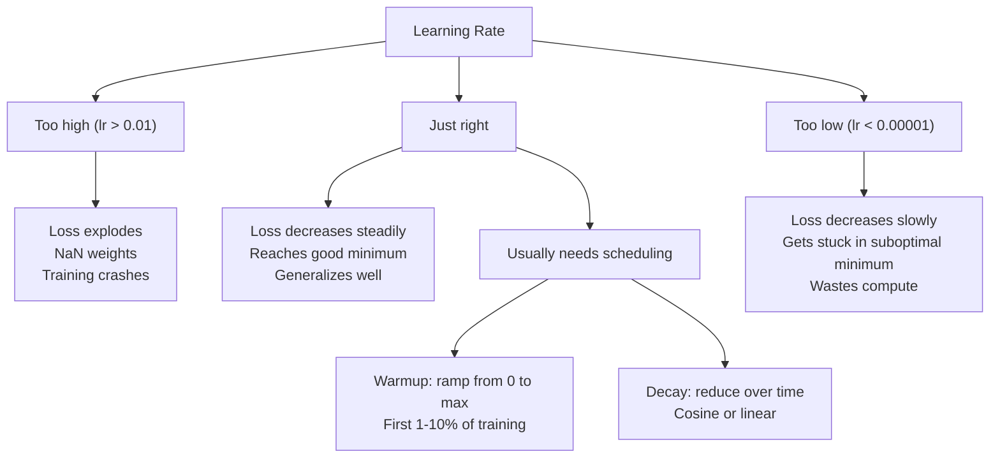
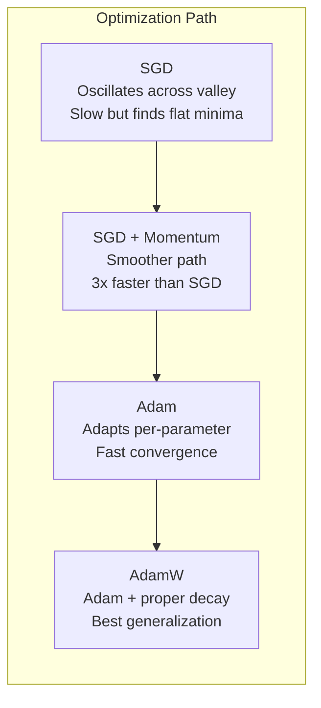
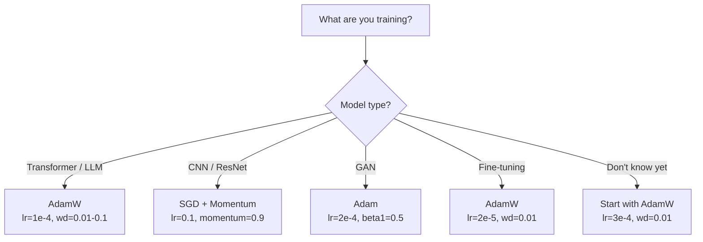

# Optymalizatory

> Zniżanie gradientowe informuje, w którym kierunku się poruszać. Nie mówi nic o tym, jak daleko i jak szybko. SGD to kompas. Adam ma GPS z danymi o ruchu drogowym.

**Typ:** Kompilacja
**Języki:** Python
**Wymagania wstępne:** Lekcja 03.05 (Funkcje straty)
**Czas:** ~75 minut

## Cele nauczania

- Zaimplementuj od podstaw optymalizatory SGD, SGD z pędem, Adam i AdamW w Pythonie
- Wyjaśnij, w jaki sposób korekcja odchylenia Adama kompensuje początkowe szacunki momentu zerowego we wczesnych etapach uczenia
- Wykazać, dlaczego AdamW daje lepsze uogólnienie niż Adam z regularyzacją L2 w tym samym zadaniu
- Wybierz odpowiedni optymalizator i domyślne hiperparametry dla transformatorów, CNN, GAN i dostrajania

## Problem

Obliczyłeś gradienty. Wiesz, że waga nr 4721 powinna zostać zmniejszona o 0,003, aby zmniejszyć stratę. Ale 0,003 w jakich jednostkach? Skalowane według czego? Czy w kroku 1 należy przenieść tę samą kwotę, co w kroku 1000?

Waniliowe zejście gradientowe stosuje tę samą szybkość uczenia się do każdego parametru na każdym kroku: w = w - lr * gradient. Stwarza to trzy problemy, które w praktyce sprawiają, że szkolenie sieci neuronowych jest bolesne.

Po pierwsze, oscylacja. Krajobraz strat rzadko ma kształt gładkiej miski. To raczej długa i wąska dolina. Nachylenie wskazuje w poprzek doliny (kierunek stromy), a nie wzdłuż niej (kierunek płytki). Zejście gradientowe odbija się w tę i z powrotem w wąskim wymiarze, robiąc niewielki postęp w użytecznym. Widziałeś to: strata szybko spada, a następnie osiąga plateau, nie dlatego, że model się zbiegł, ale dlatego, że się waha.

Po drugie, jedna szybkość uczenia się dla wszystkich parametrów jest błędna. Niektóre wagi wymagają dużych aktualizacji (są na wczesnym etapie niedopasowania). Inni potrzebują drobnych aktualizacji (są blisko optymalnej wartości). Tempo uczenia się, które działa w przypadku pierwszego, niszczy drugie i odwrotnie.

Po trzecie, punkty siodłowe. W przypadku dużych wymiarów krajobraz strat obejmuje rozległe, płaskie obszary, w których gradient jest bliski zeru. Waniliowy SGD czołga się przez nie z prędkością nachylenia, która w rzeczywistości wynosi zero. Model wygląda na unieruchomiony. Nie utknął – znajduje się na płaskim obszarze z przydatnym zejściem po drugiej stronie. Ale SGD nie ma mechanizmu, który mógłby to przeforsować.

Adam rozwiązuje wszystkie trzy. Utrzymuje dwie średnie bieżące dla każdego parametru – gradient średni (pęd, obsługuje oscylacje) i gradient średniokwadratowy (szybkość adaptacyjna, obsługuje różne skale). W połączeniu z korekcją odchylenia w pierwszych kilku krokach daje to pojedynczy optymalizator, który działa w przypadku 80% problemów z domyślnymi hiperparametrami. W tej lekcji opracujemy go od podstaw, abyś dokładnie wiedział, kiedy i dlaczego zawodzi w pozostałych 20%.

## Koncepcja

### Stochastyczne zejście gradientowe (SGD)

Najprostszy optymalizator. Oblicz gradient dla mini-partii i wykonaj krok w przeciwnym kierunku.

```
w = w - lr * gradient
```

„Stochastyczny” oznacza, że ​​do oszacowania gradientu używasz losowego podzbioru (minipartii) danych, a nie pełnego zbioru danych. Ten szum jest naprawdę przydatny - pomaga uniknąć ostrych lokalnych minimów. Ale hałas powoduje również oscylacje.

Jedynym pokrętłem jest szybkość uczenia się. Za wysoka: strata jest zróżnicowana. Za niski: trening trwa wiecznie. Optymalna wartość zależy od architektury, danych, wielkości partii i bieżącego etapu szkolenia. W przypadku waniliowego SGD w nowoczesnych sieciach typowe wartości wahają się od 0,01 do 0,1. Jednak nawet w ciągu jednego cyklu treningowego idealne tempo uczenia się ulega zmianie.

### Pęd

Analogia toczenia się piłki w dół jest nadużywana, ale trafna. Zamiast poruszać się po samym nachyleniu, utrzymujesz prędkość, która kumuluje się po przebytych nachyleniach.

```
m_t = beta * m_{t-1} + gradient
w = w - lr * m_t
```

Beta (zwykle 0,9) kontroluje ilość przechowywanej historii. Przy beta = 0,9 pęd jest w przybliżeniu średnią z ostatnich 10 gradientów (1 / (1 - 0,9) = 10).

Dlaczego to naprawia oscylacje: gromadzą się gradienty skierowane w tym samym kierunku. Gradienty zmieniające kierunek znoszą się. W tej wąskiej dolinie element „w poprzek” odwraca znak przy każdym stopniu i zostaje wytłumiony. Komponent „wzdłuż” pozostaje spójny i ulega wzmocnieniu. Rezultatem jest płynne przyspieszenie w użytecznym kierunku.

Liczby rzeczywiste: sama SGD w źle uwarunkowanym krajobrazie strat może wymagać 10 000 kroków. SGD z pędem (beta = 0,9) zwykle wymaga 3 000–5 000 kroków w przypadku tego samego problemu. Przyspieszenie nie jest marginalne.

###RMSProp

Pierwsza metoda adaptacyjnego współczynnika uczenia się według parametrów, która faktycznie zadziałała. Zaproponowane przez Hintona w wykładzie Coursera (nigdy formalnie nieopublikowane).

```
s_t = beta * s_{t-1} + (1 - beta) * gradient^2
w = w - lr * gradient / (sqrt(s_t) + epsilon)
```

s_t śledzi średnią bieżącą kwadratów gradientów. Parametry o stale dużych gradientach są dzielone przez dużą liczbę (mniejszy efektywny współczynnik uczenia). Parametry z małymi gradientami są dzielone przez małą liczbę (większy efektywny współczynnik uczenia).

Rozwiązuje to problem „jednej szybkości uczenia się dla wszystkich parametrów”. Waga, która już otrzymywała duże aktualizacje, prawdopodobnie jest blisko celu – zwolnij ją. Ciężar, który otrzymywał drobne aktualizacje, może być niedostatecznie wytrenowany — przyspiesz go.

Epsilon (zwykle 1e-8) zapobiega dzieleniu przez zero, gdy parametr nie został zaktualizowany.

### Adam: Pęd + RMSProp

Adam łączy oba pomysły. Utrzymuje dwie wykładnicze średnie kroczące na parametr:

```
m_t = beta1 * m_{t-1} + (1 - beta1) * gradient        (first moment: mean)
v_t = beta2 * v_{t-1} + (1 - beta2) * gradient^2       (second moment: variance)
```

**Korekta odchylenia** to kluczowy szczegół pomijany w większości wyjaśnień. W kroku 1 m_1 = (1 - beta1) * gradient. Przy beta1 = 0,9 jest to gradient 0,1 * — dziesięć razy za mały. Średnia ruchoma jeszcze się nie ociepliła. Korekta odchylenia kompensuje:

```
m_hat = m_t / (1 - beta1^t)
v_hat = v_t / (1 - beta2^t)
```

W kroku 1 z beta1 = 0,9: m_hat = m_1 / (1 - 0,9) = m_1 / 0,1 = rzeczywisty gradient. W kroku 100: (1 - 0,9^100) wynosi w przybliżeniu 1,0, więc korekcja znika. Korekta odchylenia ma znaczenie dla pierwszych ~10 kroków i nie ma znaczenia po ~50.

Aktualizacja:

```
w = w - lr * m_hat / (sqrt(v_hat) + epsilon)
```

Domyślne wartości Adama: lr = 0,001, beta1 = 0,9, beta2 = 0,999, epsilon = 1e-8. Te ustawienia domyślne działają w przypadku 80% problemów. Jeśli tak się nie stanie, najpierw zmień lr. Następnie beta2. Prawie nigdy nie zmieniaj beta1 ani epsilon.

### AdamW: Spadek wagi wykonany prawidłowo

Regularyzacja L2 dodaje lambda * w^2 do straty. W waniliowym SGD jest to równoważne zanikowi masy (odejmowanie lambda * w od masy na każdym kroku). W Adamie ta równoważność zostaje przerwana.

Spostrzeżenie Loschilova i Huttera: kiedy do straty dodamy L2, a następnie Adam przetworzy gradient, adaptacyjna szybkość uczenia się również skaluje składnik regularyzacji. Parametry o dużej wariancji gradientu uzyskują mniejszą regularyzację. Parametry o małej wariancji dostają więcej. Nie tego chcesz — chcesz jednolitej regularyzacji niezależnie od statystyk gradientu.

AdamW rozwiązuje ten problem, stosując spadek masy bezpośrednio do ciężarków po aktualizacji Adama:

```
w = w - lr * m_hat / (sqrt(v_hat) + epsilon) - lr * lambda * w
```

Termin zaniku masy (lr * lambda * w) nie jest skalowany według współczynnika adaptacyjnego Adama. Każdy parametr uzyskuje taki sam proporcjonalny skurcz.

Wydaje się, że to drobny szczegół. To nie jest. AdamW zbliża się do lepszych rozwiązań niż regularyzacja Adam + L2 w praktycznie każdym zadaniu. Jest to domyślny optymalizator w PyTorch do szkolenia transformatorów, modeli dyfuzyjnych i większości nowoczesnych architektur. BERT, GPT, LLaMA, Stable Diffusion – wszyscy przeszkoleni z AdamemW.

### Szybkość uczenia się: najważniejszy hiperparametr



Jeśli dostroisz jeden hiperparametr, dostosuj szybkość uczenia się. 10-krotna zmiana w szybkości uczenia się ma większe znaczenie niż jakakolwiek decyzja dotycząca architektury, jaką podejmiesz. Typowe ustawienia domyślne:

- SGD: lr = 0,01 do 0,1
- Adam/AdamW: lr = 1e-4 do 3e-4
- Dostrajanie wstępnie wyszkolonych modeli: lr = 1e-5 do 5e-5
- Rozgrzewka szybkości uczenia się: liniowa rampa przez pierwsze 1-10% kroków

### Porównanie optymalizatora



### Gdy każdy optymalizator wygrywa



## Zbuduj to

### Krok 1: Waniliowy SGD

```python
class SGD:
    def __init__(self, lr=0.01):
        self.lr = lr

    def step(self, params, grads):
        for i in range(len(params)):
            params[i] -= self.lr * grads[i]
```

### Krok 2: SGD z Momentum

```python
class SGDMomentum:
    def __init__(self, lr=0.01, beta=0.9):
        self.lr = lr
        self.beta = beta
        self.velocities = None

    def step(self, params, grads):
        if self.velocities is None:
            self.velocities = [0.0] * len(params)
        for i in range(len(params)):
            self.velocities[i] = self.beta * self.velocities[i] + grads[i]
            params[i] -= self.lr * self.velocities[i]
```

### Krok 3: Adam

```python
import math

class Adam:
    def __init__(self, lr=0.001, beta1=0.9, beta2=0.999, epsilon=1e-8):
        self.lr = lr
        self.beta1 = beta1
        self.beta2 = beta2
        self.epsilon = epsilon
        self.m = None
        self.v = None
        self.t = 0

    def step(self, params, grads):
        if self.m is None:
            self.m = [0.0] * len(params)
            self.v = [0.0] * len(params)

        self.t += 1

        for i in range(len(params)):
            self.m[i] = self.beta1 * self.m[i] + (1 - self.beta1) * grads[i]
            self.v[i] = self.beta2 * self.v[i] + (1 - self.beta2) * grads[i] ** 2

            m_hat = self.m[i] / (1 - self.beta1 ** self.t)
            v_hat = self.v[i] / (1 - self.beta2 ** self.t)

            params[i] -= self.lr * m_hat / (math.sqrt(v_hat) + self.epsilon)
```

### Krok 4: AdamW

```python
class AdamW:
    def __init__(self, lr=0.001, beta1=0.9, beta2=0.999, epsilon=1e-8, weight_decay=0.01):
        self.lr = lr
        self.beta1 = beta1
        self.beta2 = beta2
        self.epsilon = epsilon
        self.weight_decay = weight_decay
        self.m = None
        self.v = None
        self.t = 0

    def step(self, params, grads):
        if self.m is None:
            self.m = [0.0] * len(params)
            self.v = [0.0] * len(params)

        self.t += 1

        for i in range(len(params)):
            self.m[i] = self.beta1 * self.m[i] + (1 - self.beta1) * grads[i]
            self.v[i] = self.beta2 * self.v[i] + (1 - self.beta2) * grads[i] ** 2

            m_hat = self.m[i] / (1 - self.beta1 ** self.t)
            v_hat = self.v[i] / (1 - self.beta2 ** self.t)

            params[i] -= self.lr * m_hat / (math.sqrt(v_hat) + self.epsilon)
            params[i] -= self.lr * self.weight_decay * params[i]
```

### Krok 5: Porównanie treningów

Wytrenuj tę samą sieć dwuwarstwową na zbiorze danych okręgu z lekcji 05 przy użyciu wszystkich czterech optymalizatorów. Porównaj zbieżność.

```python
import random

def sigmoid(x):
    x = max(-500, min(500, x))
    return 1.0 / (1.0 + math.exp(-x))

def make_circle_data(n=200, seed=42):
    random.seed(seed)
    data = []
    for _ in range(n):
        x = random.uniform(-2, 2)
        y = random.uniform(-2, 2)
        label = 1.0 if x * x + y * y < 1.5 else 0.0
        data.append(([x, y], label))
    return data

class OptimizerTestNetwork:
    def __init__(self, optimizer, hidden_size=8):
        random.seed(0)
        self.hidden_size = hidden_size
        self.optimizer = optimizer

        self.w1 = [[random.gauss(0, 0.5) for _ in range(2)] for _ in range(hidden_size)]
        self.b1 = [0.0] * hidden_size
        self.w2 = [random.gauss(0, 0.5) for _ in range(hidden_size)]
        self.b2 = 0.0

    def get_params(self):
        params = []
        for row in self.w1:
            params.extend(row)
        params.extend(self.b1)
        params.extend(self.w2)
        params.append(self.b2)
        return params

    def set_params(self, params):
        idx = 0
        for i in range(self.hidden_size):
            for j in range(2):
                self.w1[i][j] = params[idx]
                idx += 1
        for i in range(self.hidden_size):
            self.b1[i] = params[idx]
            idx += 1
        for i in range(self.hidden_size):
            self.w2[i] = params[idx]
            idx += 1
        self.b2 = params[idx]

    def forward(self, x):
        self.x = x
        self.z1 = []
        self.h = []
        for i in range(self.hidden_size):
            z = self.w1[i][0] * x[0] + self.w1[i][1] * x[1] + self.b1[i]
            self.z1.append(z)
            self.h.append(max(0.0, z))

        self.z2 = sum(self.w2[i] * self.h[i] for i in range(self.hidden_size)) + self.b2
        self.out = sigmoid(self.z2)
        return self.out

    def compute_grads(self, target):
        eps = 1e-15
        p = max(eps, min(1 - eps, self.out))
        d_loss = -(target / p) + (1 - target) / (1 - p)
        d_sigmoid = self.out * (1 - self.out)
        d_out = d_loss * d_sigmoid

        grads = [0.0] * (self.hidden_size * 2 + self.hidden_size + self.hidden_size + 1)
        idx = 0
        for i in range(self.hidden_size):
            d_relu = 1.0 if self.z1[i] > 0 else 0.0
            d_h = d_out * self.w2[i] * d_relu
            grads[idx] = d_h * self.x[0]
            grads[idx + 1] = d_h * self.x[1]
            idx += 2

        for i in range(self.hidden_size):
            d_relu = 1.0 if self.z1[i] > 0 else 0.0
            grads[idx] = d_out * self.w2[i] * d_relu
            idx += 1

        for i in range(self.hidden_size):
            grads[idx] = d_out * self.h[i]
            idx += 1

        grads[idx] = d_out
        return grads

    def train(self, data, epochs=300):
        losses = []
        for epoch in range(epochs):
            total_loss = 0.0
            correct = 0
            for x, y in data:
                pred = self.forward(x)
                grads = self.compute_grads(y)
                params = self.get_params()
                self.optimizer.step(params, grads)
                self.set_params(params)

                eps = 1e-15
                p = max(eps, min(1 - eps, pred))
                total_loss += -(y * math.log(p) + (1 - y) * math.log(1 - p))
                if (pred >= 0.5) == (y >= 0.5):
                    correct += 1
            avg_loss = total_loss / len(data)
            accuracy = correct / len(data) * 100
            losses.append((avg_loss, accuracy))
            if epoch % 75 == 0 or epoch == epochs - 1:
                print(f"    Epoch {epoch:3d}: loss={avg_loss:.4f}, accuracy={accuracy:.1f}%")
        return losses
```

## Użyj tego

Optymalizatory PyTorch obsługują grupy parametrów, przycinanie gradientów i planowanie szybkości uczenia się:

```python
import torch
import torch.optim as optim

model = torch.nn.Sequential(
    torch.nn.Linear(784, 256),
    torch.nn.ReLU(),
    torch.nn.Linear(256, 10),
)

optimizer = optim.AdamW(model.parameters(), lr=3e-4, weight_decay=0.01)

scheduler = optim.lr_scheduler.CosineAnnealingLR(optimizer, T_max=100)

for epoch in range(100):
    optimizer.zero_grad()
    output = model(torch.randn(32, 784))
    loss = torch.nn.functional.cross_entropy(output, torch.randint(0, 10, (32,)))
    loss.backward()
    torch.nn.utils.clip_grad_norm_(model.parameters(), max_norm=1.0)
    optimizer.step()
    scheduler.step()
```

Wzór jest zawsze następujący: zero_grad, do przodu, strata, do tyłu, (klips), krok, (harmonogram). Zapamiętaj tę kolejność. Błędne wykonanie zadania (np. wywołanie funkcji Scheduler.step() przed optymalizatorem.step()) jest częstym źródłem subtelnych błędów.

W przypadku CNN wielu praktyków nadal preferuje SGD + pęd (lr = 0,1, pęd = 0,9, waga_decay = 1e-4) z harmonogramem krokowym lub cosinusowym. SGD znajduje bardziej płaskie minima, które często lepiej uogólniają. W przypadku transformatorów i LLM uniwersalnym ustawieniem domyślnym jest AdamW z rozgrzewaniem i zanikiem cosinusa. Nie walcz z konsensusem bez wyważonego powodu.

## Wyślij to

Ta lekcja daje:
- `outputs/prompt-optimizer-selector.md` – zachęta do podjęcia decyzji o wyborze odpowiedniego optymalizatora i szybkości uczenia się dla dowolnej architektury

## Ćwiczenia

1. Zaimplementuj pęd Niestierowa, obliczając gradient w pozycji „lookahead” (w - lr * beta * v) zamiast w bieżącej pozycji. Porównaj zbieżność ze standardowym pędem w zbiorze danych okręgu.

2. Wprowadź harmonogram rozgrzewki szybkości uczenia się: liniowa rampa od 0 do max_lr przez pierwsze 10% kroków treningowych, następnie spadek cosinusa do 0. Trenuj z Adamem + rozgrzewka vs Adam bez rozgrzewki. Zmierz, ile epok potrzeba, aby osiągnąć 90% dokładności w zbiorze danych okręgu.

3. Śledź efektywną szybkość uczenia się każdego parametru podczas treningu Adama. Efektywna stopa wynosi lr * m_hat / (sqrt(v_hat) + eps). Narysuj rozkład współczynników efektywnych po 10, 50 i 200 krokach. Czy wszystkie parametry są aktualizowane z tą samą szybkością?

4. Zaimplementuj obcinanie gradientu (przycinanie według normy globalnej). Ustaw maksymalną normę gradientu na 1,0. Trenuj z przycinaniem i bez, korzystając z wysokiego współczynnika uczenia się (lr=0,01 dla Adama). Policz, ile przebiegów jest rozbieżnych (strata przypada na NaN) z obcięciem i bez obcięcia 10 losowych nasion.

5. Porównaj Adam vs AdamW w sieci o dużych wagach. Zainicjuj wszystkie wagi do losowych wartości w [-5, 5] (znacznie większych niż normalnie). Trenuj przez 200 epok z Weight_decay=0,1. Narysuj normę L2 dotyczącą ciężarów podczas treningu dla obu optymalizatorów. AdamW powinien wykazywać szybszy spadek wagi.

## Kluczowe terminy

| Termin | Co ludzie mówią | Co to właściwie oznacza |
|------|----------------|----------------------|
| Szybkość uczenia się | „Rozmiar kroku” | Mnożnik skalarny w aktualizacji gradientu; pojedynczy hiperparametr o największym wpływie w treningu |
| SGD | „Podstawowe zejście gradientowe” | Zejście w gradiencie stochastycznym: aktualizacja wag poprzez odejmowanie lr * gradientu, obliczone dla małej partii |
| Pęd | „Analogia toczącej się piłki” | Wykładnicza średnia krocząca z poprzednich gradientów; tłumi oscylacje i przyspiesza w stałych kierunkach |
| RMSProp | „Adaptacyjny współczynnik uczenia się” | Dzieli gradient każdego parametru przez bieżącą wartość RMS jego ostatnich gradientów; wyrównuje tempo uczenia się |
| Adama | „Domyślny optymalizator” | Łączy pęd (pierwszy moment) i RMSProp (drugi moment) z korektą odchylenia dla początkowych kroków |
| AdamW | „Adam zrobił dobrze” | Adam z oddzielonym spadkiem masy; stosuje regularyzację bezpośrednio do wag, a nie poprzez gradient |
| Korekta odchylenia | „Rozgrzewka do średnich biegowych” | Dzielenie przez (1 - beta^t) w celu skompensowania zerowej inicjalizacji oszacowań momentu Adama |
| Spadek wagi | „Zmniejsz ciężary” | Odejmowanie ułamka wartości masy na każdym kroku; regularizer, który karze duże wagi |
| Harmonogram kursów nauki | „Zmiana lr w czasie” | Funkcja dostosowująca tempo uczenia się podczas treningu; rozgrzewka + zanik cosinusa to współczesna opcja domyślna |
| Przycinanie gradientu | „Ograniczenie normy gradientu” | Zmniejszanie wektora gradientu, gdy jego norma przekracza próg; zapobiega eksplodującym aktualizacjom gradientów |

## Dalsze czytanie

- Kingma & Ba, "Adam: A Method for Stochastic Optimization" (2014) - oryginalna praca Adama z analizą zbieżności i wyprowadzeniem korekcji odchylenia
- Loshchilov i Hutter, „Decoupled Weight Decay Regularization” (2017) – udowodnili, że regularyzacja L2 i spadek masy ciała nie są równoważne u Adama i zaproponowali AdamW
– Smith, „Cyclical Learning Rates for Training Neural Networks” (2017) – przedstawił test zakresu LR i harmonogramy cykliczne, które eliminują potrzebę dostrajania stałego współczynnika uczenia się
— Ruder, „An Review of Gradient Descent Optimization Algorithms” (2016) — najlepsze pojedyncze badanie wszystkich wariantów optymalizatorów, zawierające jasne porównania i intuicje