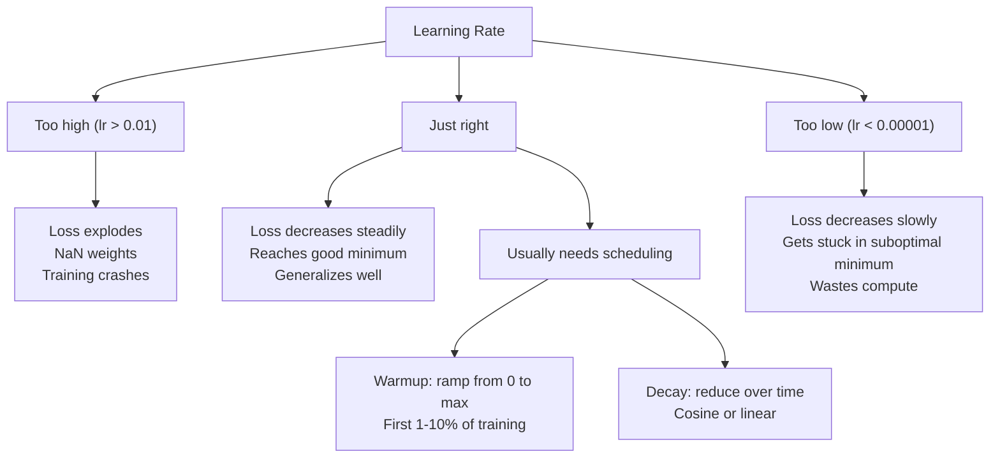
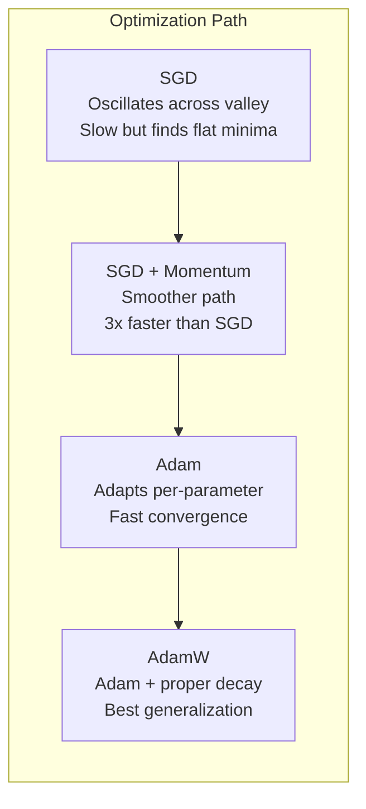
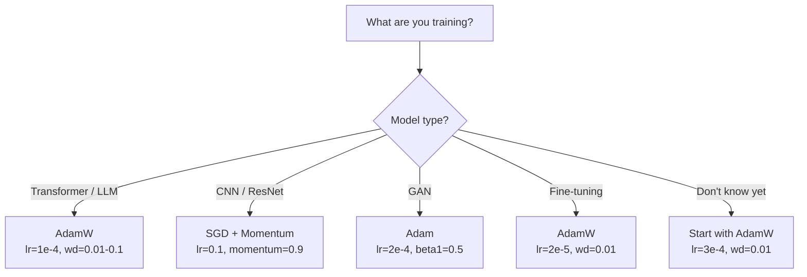

# Optymalizatory

> Gradient prosty mówi, w którą stronę się ruszyć. Nie mówi nic o tym, jak daleko i jak szybko. SGD to kompas. Adam to GPS z danymi o ruchu drogowym.

**Typ:** Budowa
**Języki:** Python
**Wymagania wstępne:** Lekcja 03.05 (Funkcje straty)
**Czas:** ~75 minut

## Cele nauki

- Zaimplementuj od podstaw w Pythonie optymalizatory SGD, SGD z momentum, Adam oraz AdamW
- Wyjaśnij, jak korekta obciążenia (bias correction) w Adamie kompensuje wyzerowane oszacowania momentów we wczesnych krokach treningu
- Wykaż, dlaczego AdamW daje lepszą generalizację niż Adam z regularyzacją L2 na tym samym zadaniu
- Wybierz odpowiedni optymalizator i domyślne hiperparametry dla transformerów, sieci CNN, GAN-ów oraz dostrajania (fine-tuning)

## Problem

Obliczyłeś gradienty. Wiesz, że waga #4721 powinna zmniejszyć się o 0,003, aby zredukować stratę. Ale 0,003 w jakich jednostkach? Przeskalowane przez co? I czy powinieneś przesunąć się o tę samą wartość w kroku 1, jak i w kroku 1000?

Zwykły gradient prosty stosuje tę samą szybkość uczenia (learning rate) dla każdego parametru w każdym kroku: w = w - lr * gradient. To tworzy trzy problemy, które w praktyce czynią trenowanie sieci neuronowych bolesnym.

Po pierwsze, oscylacje. Krajobraz straty rzadko ma kształt gładkiej misy. Częściej przypomina długą, wąską dolinę. Gradient wskazuje w poprzek doliny (kierunek stromy), a nie wzdłuż niej (kierunek płaski). Gradient prosty odbija się tam i z powrotem w wąskim wymiarze, czyniąc minimalne postępy w użytecznym wymiarze. Widziałeś to już: strata szybko spada, a potem osiada na plateau, nie dlatego że model się zbiegł, ale dlatego że oscyluje.

Po drugie, jedna szybkość uczenia dla wszystkich parametrów jest błędna. Niektóre wagi wymagają dużych aktualizacji (są we wczesnym etapie, niedopasowane). Inne wymagają drobnych aktualizacji (są blisko optymalnej wartości). Szybkość uczenia, która działa dla pierwszych, niszczy drugie, i na odwrót.

Po trzecie, punkty siodłowe (saddle points). W wysokich wymiarach krajobraz straty ma ogromne płaskie regiony, w których gradient jest bliski zeru. Zwykły SGD pełza przez nie z prędkością gradientu, czyli praktycznie zerową. Model wygląda na zablokowany. Nie jest zablokowany -- jest w płaskim regionie, za którym czeka użyteczny spadek. Ale SGD nie ma mechanizmu, by się przez to przebić.

Adam rozwiązuje wszystkie trzy problemy. Utrzymuje dwie biegnące średnie na parametr -- średni gradient (momentum, radzi sobie z oscylacjami) i średni kwadrat gradientu (adaptacyjna szybkość, radzi sobie z różnymi skalami). W połączeniu z korektą obciążenia dla pierwszych kroków daje to jeden optymalizator, który działa na 80% problemów z domyślnymi hiperparametrami. Ta lekcja budujesz go od podstaw, abyś dokładnie rozumiał, kiedy i dlaczego zawodzi na pozostałych 20%.

## Koncepcja

### Stochastyczny gradient prosty (SGD)

Najprostszy optymalizator. Oblicz gradient na mini-batchu i wykonaj krok w przeciwnym kierunku.

```
w = w - lr * gradient
```

"Stochastyczny" oznacza, że używasz losowego podzbioru danych (mini-batcha) do oszacowania gradientu, zamiast całego zbioru danych. Ten szum jest faktycznie użyteczny -- pomaga uciec z ostrych minimów lokalnych. Ale ten sam szum powoduje oscylacje.

Szybkość uczenia jest jedynym pokrętłem. Zbyt wysoka: strata rozbiega się (diverges). Zbyt niska: trening trwa wiecznie. Optymalna wartość zależy od architektury, danych, rozmiaru batcha i aktualnego etapu treningu. Dla zwykłego SGD w nowoczesnych sieciach typowe wartości to od 0,01 do 0,1. Ale nawet w ramach jednego przebiegu treningu idealna szybkość uczenia się zmienia.

### Momentum

Analogia z piłką skaczącą po pochyłości jest nadużywana, ale dokładna. Zamiast wykonywać kroki wyłącznie na podstawie gradientu, utrzymujesz prędkość (velocity), która kumuluje poprzednie gradienty.

```
m_t = beta * m_{t-1} + gradient
w = w - lr * m_t
```

Beta (typowo 0,9) kontroluje, jak dużo historii zachować. Przy beta = 0,9 momentum to z grubsza średnia z ostatnich 10 gradientów (1 / (1 - 0,9) = 10).

Dlaczego to naprawia oscylacje: gradienty wskazujące w tym samym kierunku kumulują się. Gradienty zmieniające kierunek wzajemnie się znoszą. W tej wąskiej dolinie składowa "w poprzek" zmienia znak na każdym kroku i zostaje stłumiona. Składowa "wzdłuż" pozostaje konsekwentna i zostaje wzmocniona. Wynikiem jest gładka akceleracja w użytecznym kierunku.

Realne liczby: sam SGD na słabo skondycjonowanym krajobrazie straty może potrzebować 10 000 kroków. SGD z momentum (beta=0,9) typowo potrzebuje 3000-5000 kroków na tym samym problemie. Przyspieszenie nie jest marginalne.

### RMSProp

Pierwsza metoda adaptacyjnej szybkości uczenia per-parametr, która faktycznie zadziałała. Zaproponowana przez Hintona w wykładzie na Coursera (nigdy formalnie nie opublikowana).

```
s_t = beta * s_{t-1} + (1 - beta) * gradient^2
w = w - lr * gradient / (sqrt(s_t) + epsilon)
```

s_t śledzi biegnącą średnią kwadratów gradientów. Parametry z konsekwentnie dużymi gradientami są dzielone przez dużą liczbę (mniejsza efektywna szybkość uczenia). Parametry z małymi gradientami są dzielone przez małą liczbę (większa efektywna szybkość uczenia).

To rozwiązuje problem "jednej szybkości uczenia dla wszystkich parametrów". Waga, która już otrzymywała duże aktualizacje, prawdopodobnie jest blisko swojej wartości docelowej -- zwolnij ją. Waga, która otrzymywała drobne aktualizacje, może być niedotrenowana -- przyspiesz ją.

Epsilon (typowo 1e-8) zapobiega dzieleniu przez zero, gdy parametr nie był jeszcze aktualizowany.

### Adam: Momentum + RMSProp

Adam łączy obie idee. Utrzymuje dwie wykładnicze biegnące średnie na parametr:

```
m_t = beta1 * m_{t-1} + (1 - beta1) * gradient        (pierwszy moment: średnia)
v_t = beta2 * v_{t-1} + (1 - beta2) * gradient^2       (drugi moment: wariancja)
```

**Korekta obciążenia (bias correction)** to kluczowy szczegół, który większość wyjaśnień pomija. W kroku 1, m_1 = (1 - beta1) * gradient. Przy beta1 = 0,9 to 0,1 * gradient -- dziesięć razy za mało. Biegnąca średnia jeszcze się nie "rozgrzała". Korekta obciążenia to kompensuje:

```
m_hat = m_t / (1 - beta1^t)
v_hat = v_t / (1 - beta2^t)
```

W kroku 1 przy beta1 = 0,9: m_hat = m_1 / (1 - 0,9) = m_1 / 0,1 = rzeczywisty gradient. W kroku 100: (1 - 0,9^100) wynosi w przybliżeniu 1,0, więc korekta zanika. Korekta obciążenia ma znaczenie dla pierwszych ~10 kroków i jest nieistotna po ~50.

Aktualizacja:

```
w = w - lr * m_hat / (sqrt(v_hat) + epsilon)
```

Domyślne wartości Adama: lr = 0,001, beta1 = 0,9, beta2 = 0,999, epsilon = 1e-8. Te wartości domyślne działają dla 80% problemów. Kiedy nie działają, najpierw zmień lr. Potem beta2. Praktycznie nigdy nie zmieniaj beta1 ani epsilon.

### AdamW: Weight Decay zrobiony dobrze

Regularyzacja L2 dodaje lambda * w^2 do straty. W zwykłym SGD jest to równoważne weight decay (odejmowaniu lambda * w od wagi w każdym kroku). W Adamie ta równoważność się zrywa.

Spostrzeżenie Loshchilova i Huttera: gdy dodasz L2 do straty, a potem Adam przetworzy gradient, adaptacyjna szybkość uczenia skaluje również człon regularyzacyjny. Parametry o dużej wariancji gradientu otrzymują mniejszą regularyzację. Parametry o małej wariancji otrzymują większą. To nie jest to, czego chcesz -- chcesz jednolitej regularyzacji niezależnie od statystyk gradientu.

AdamW naprawia to, stosując weight decay bezpośrednio do wag, po aktualizacji Adama:

```
w = w - lr * m_hat / (sqrt(v_hat) + epsilon) - lr * lambda * w
```

Człon weight decay (lr * lambda * w) nie jest skalowany przez adaptacyjny czynnik Adama. Każdy parametr otrzymuje to samo proporcjonalne zmniejszenie.

To wygląda jak drobny szczegół. Nie jest. AdamW zbiega do lepszych rozwiązań niż Adam + regularyzacja L2 na praktycznie każdym zadaniu. Jest domyślnym optymalizatorem w PyTorch do trenowania transformerów, modeli dyfuzyjnych i większości nowoczesnych architektur. BERT, GPT, LLaMA, Stable Diffusion -- wszystkie trenowane z AdamW.

### Szybkość uczenia: najważniejszy hiperparametr



Jeśli masz dostroić jeden hiperparametr, dostrój szybkość uczenia. 10-krotna zmiana szybkości uczenia ma większe znaczenie niż jakakolwiek decyzja architektoniczna, którą podejmiesz. Typowe wartości domyślne:

- SGD: lr = 0,01 do 0,1
- Adam/AdamW: lr = 1e-4 do 3e-4
- Dostrajanie (fine-tuning) wstępnie wytrenowanych modeli: lr = 1e-5 do 5e-5
- Warmup szybkości uczenia: liniowy narost w pierwszych 1-10% kroków

### Porównanie optymalizatorów



### Kiedy który optymalizator wygrywa



## Zbuduj to

### Krok 1: Zwykły SGD

```python
class SGD:
    def __init__(self, lr=0.01):
        self.lr = lr

    def step(self, params, grads):
        for i in range(len(params)):
            params[i] -= self.lr * grads[i]
```

### Krok 2: SGD z momentum

```python
class SGDMomentum:
    def __init__(self, lr=0.01, beta=0.9):
        self.lr = lr
        self.beta = beta
        self.velocities = None

    def step(self, params, grads):
        if self.velocities is None:
            self.velocities = [0.0] * len(params)
        for i in range(len(params)):
            self.velocities[i] = self.beta * self.velocities[i] + grads[i]
            params[i] -= self.lr * self.velocities[i]
```

### Krok 3: Adam

```python
import math

class Adam:
    def __init__(self, lr=0.001, beta1=0.9, beta2=0.999, epsilon=1e-8):
        self.lr = lr
        self.beta1 = beta1
        self.beta2 = beta2
        self.epsilon = epsilon
        self.m = None
        self.v = None
        self.t = 0

    def step(self, params, grads):
        if self.m is None:
            self.m = [0.0] * len(params)
            self.v = [0.0] * len(params)

        self.t += 1

        for i in range(len(params)):
            self.m[i] = self.beta1 * self.m[i] + (1 - self.beta1) * grads[i]
            self.v[i] = self.beta2 * self.v[i] + (1 - self.beta2) * grads[i] ** 2

            m_hat = self.m[i] / (1 - self.beta1 ** self.t)
            v_hat = self.v[i] / (1 - self.beta2 ** self.t)

            params[i] -= self.lr * m_hat / (math.sqrt(v_hat) + self.epsilon)
```

### Krok 4: AdamW

```python
class AdamW:
    def __init__(self, lr=0.001, beta1=0.9, beta2=0.999, epsilon=1e-8, weight_decay=0.01):
        self.lr = lr
        self.beta1 = beta1
        self.beta2 = beta2
        self.epsilon = epsilon
        self.weight_decay = weight_decay
        self.m = None
        self.v = None
        self.t = 0

    def step(self, params, grads):
        if self.m is None:
            self.m = [0.0] * len(params)
            self.v = [0.0] * len(params)

        self.t += 1

        for i in range(len(params)):
            self.m[i] = self.beta1 * self.m[i] + (1 - self.beta1) * grads[i]
            self.v[i] = self.beta2 * self.v[i] + (1 - self.beta2) * grads[i] ** 2

            m_hat = self.m[i] / (1 - self.beta1 ** self.t)
            v_hat = self.v[i] / (1 - self.beta2 ** self.t)

            params[i] -= self.lr * m_hat / (math.sqrt(v_hat) + self.epsilon)
            params[i] -= self.lr * self.weight_decay * params[i]
```

### Krok 5: Porównanie treningów

Wytrenuj tę samą dwuwarstwową sieć na zbiorze danych "circle" z lekcji 05 przy użyciu wszystkich czterech optymalizatorów. Porównaj zbieżność.

```python
import random

def sigmoid(x):
    x = max(-500, min(500, x))
    return 1.0 / (1.0 + math.exp(-x))

def make_circle_data(n=200, seed=42):
    random.seed(seed)
    data = []
    for _ in range(n):
        x = random.uniform(-2, 2)
        y = random.uniform(-2, 2)
        label = 1.0 if x * x + y * y < 1.5 else 0.0
        data.append(([x, y], label))
    return data


class OptimizerTestNetwork:
    def __init__(self, optimizer, hidden_size=8):
        random.seed(0)
        self.hidden_size = hidden_size
        self.optimizer = optimizer

        self.w1 = [[random.gauss(0, 0.5) for _ in range(2)] for _ in range(hidden_size)]
        self.b1 = [0.0] * hidden_size
        self.w2 = [random.gauss(0, 0.5) for _ in range(hidden_size)]
        self.b2 = 0.0

    def get_params(self):
        params = []
        for row in self.w1:
            params.extend(row)
        params.extend(self.b1)
        params.extend(self.w2)
        params.append(self.b2)
        return params

    def set_params(self, params):
        idx = 0
        for i in range(self.hidden_size):
            for j in range(2):
                self.w1[i][j] = params[idx]
                idx += 1
        for i in range(self.hidden_size):
            self.b1[i] = params[idx]
            idx += 1
        for i in range(self.hidden_size):
            self.w2[i] = params[idx]
            idx += 1
        self.b2 = params[idx]

    def forward(self, x):
        self.x = x
        self.z1 = []
        self.h = []
        for i in range(self.hidden_size):
            z = self.w1[i][0] * x[0] + self.w1[i][1] * x[1] + self.b1[i]
            self.z1.append(z)
            self.h.append(max(0.0, z))

        self.z2 = sum(self.w2[i] * self.h[i] for i in range(self.hidden_size)) + self.b2
        self.out = sigmoid(self.z2)
        return self.out

    def compute_grads(self, target):
        eps = 1e-15
        p = max(eps, min(1 - eps, self.out))
        d_loss = -(target / p) + (1 - target) / (1 - p)
        d_sigmoid = self.out * (1 - self.out)
        d_out = d_loss * d_sigmoid

        grads = [0.0] * (self.hidden_size * 2 + self.hidden_size + self.hidden_size + 1)
        idx = 0
        for i in range(self.hidden_size):
            d_relu = 1.0 if self.z1[i] > 0 else 0.0
            d_h = d_out * self.w2[i] * d_relu
            grads[idx] = d_h * self.x[0]
            grads[idx + 1] = d_h * self.x[1]
            idx += 2

        for i in range(self.hidden_size):
            d_relu = 1.0 if self.z1[i] > 0 else 0.0
            grads[idx] = d_out * self.w2[i] * d_relu
            idx += 1

        for i in range(self.hidden_size):
            grads[idx] = d_out * self.h[i]
            idx += 1

        grads[idx] = d_out
        return grads

    def train(self, data, epochs=300):
        losses = []
        for epoch in range(epochs):
            total_loss = 0.0
            correct = 0
            for x, y in data:
                pred = self.forward(x)
                grads = self.compute_grads(y)
                params = self.get_params()
                self.optimizer.step(params, grads)
                self.set_params(params)

                eps = 1e-15
                p = max(eps, min(1 - eps, pred))
                total_loss += -(y * math.log(p) + (1 - y) * math.log(1 - p))
                if (pred >= 0.5) == (y >= 0.5):
                    correct += 1
            avg_loss = total_loss / len(data)
            accuracy = correct / len(data) * 100
            losses.append((avg_loss, accuracy))
            if epoch % 75 == 0 or epoch == epochs - 1:
                print(f"    Epoch {epoch:3d}: loss={avg_loss:.4f}, accuracy={accuracy:.1f}%")
        return losses
```

## Wykorzystaj to

Optymalizatory PyTorch obsługują grupy parametrów, przycinanie gradientu (gradient clipping) i harmonogramowanie szybkości uczenia:

```python
import torch
import torch.optim as optim

model = torch.nn.Sequential(
    torch.nn.Linear(784, 256),
    torch.nn.ReLU(),
    torch.nn.Linear(256, 10),
)

optimizer = optim.AdamW(model.parameters(), lr=3e-4, weight_decay=0.01)

scheduler = optim.lr_scheduler.CosineAnnealingLR(optimizer, T_max=100)

for epoch in range(100):
    optimizer.zero_grad()
    output = model(torch.randn(32, 784))
    loss = torch.nn.functional.cross_entropy(output, torch.randint(0, 10, (32,)))
    loss.backward()
    torch.nn.utils.clip_grad_norm_(model.parameters(), max_norm=1.0)
    optimizer.step()
    scheduler.step()
```

Wzorzec jest zawsze taki: zero_grad, forward, loss, backward, (clip), step, (schedule). Zapamiętaj ten porządek. Pomylenie go (np. wywołanie scheduler.step() przed optimizer.step()) jest częstym źródłem subtelnych błędów.

Dla sieci CNN wielu praktyków wciąż preferuje SGD + momentum (lr=0,1, momentum=0,9, weight_decay=1e-4) z harmonogramem step lub cosine. SGD znajduje płaskie minima, które często lepiej generalizują. Dla transformerów i LLM-ów AdamW z warmupem + cosine decay jest uniwersalnym standardem. Nie walcz z konsensusem bez zmierzonego powodu.

## Wyślij to

Ta lekcja produkuje:
- `outputs/prompt-optimizer-selector.md` -- prompt decyzyjny do wyboru właściwego optymalizatora i szybkości uczenia dla każdej architektury

## Ćwiczenia

1. Zaimplementuj momentum Nesterova, w którym obliczasz gradient w pozycji "lookahead" (w - lr * beta * v) zamiast w pozycji aktualnej. Porównaj zbieżność ze standardowym momentum na zbiorze danych "circle".

2. Zaimplementuj harmonogram warmup szybkości uczenia: liniowy narost od 0 do max_lr w pierwszych 10% kroków treningu, a następnie cosine decay do 0. Trenuj z Adamem + warmup vs Adamem bez warmupu. Zmierz, ile epok potrzeba, aby osiągnąć 90% dokładności na zbiorze danych "circle".

3. Śledź efektywną szybkość uczenia dla każdego parametru podczas treningu Adamem. Efektywna szybkość to lr * m_hat / (sqrt(v_hat) + eps). Narysuj rozkład efektywnych szybkości po 10, 50 i 200 krokach. Czy wszystkie parametry są aktualizowane z tą samą prędkością?

4. Zaimplementuj przycinanie gradientu (gradient clipping) według globalnej normy. Ustaw maksymalną normę gradientu na 1,0. Trenuj z przycinaniem i bez niego, używając wysokiej szybkości uczenia (lr=0,01 dla Adama). Zlicz, ile przebiegów się rozbiega (strata przechodzi w NaN) z przycinaniem i bez niego na 10 losowych seedach.

5. Porównaj Adama vs AdamW na sieci z dużymi wagami. Zainicjalizuj wszystkie wagi losowymi wartościami z [-5, 5] (znacznie większymi niż normalnie). Trenuj przez 200 epok z weight_decay=0,1. Narysuj normę L2 wag w czasie treningu dla obu optymalizatorów. AdamW powinien wykazywać szybsze zmniejszanie się wag.

## Kluczowe terminy

| Termin | Co się mówi | Co to faktycznie znaczy |
|------|----------------|----------------------|
| Learning rate | "Rozmiar kroku" | Skalarny mnożnik aktualizacji gradientowej; pojedynczy hiperparametr o największym wpływie na trening |
| SGD | "Podstawowy gradient prosty" | Stochastyczny gradient prosty: aktualizacja wag poprzez odjęcie lr * gradient, obliczonego na mini-batchu |
| Momentum | "Analogia z kulą" | Wykładnicza biegnąca średnia poprzednich gradientów; tłumi oscylacje i przyspiesza konsekwentne kierunki |
| RMSProp | "Adaptacyjna szybkość uczenia" | Dzieli gradient każdego parametru przez biegnące RMS jego niedawnych gradientów; wyrównuje szybkości uczenia |
| Adam | "Domyślny optymalizator" | Łączy momentum (pierwszy moment) i RMSProp (drugi moment) z korektą obciążenia dla początkowych kroków |
| AdamW | "Adam zrobiony dobrze" | Adam z rozdzielonym (decoupled) weight decay; stosuje regularyzację bezpośrednio do wag, a nie przez gradient |
| Bias correction (korekta obciążenia) | "Warmup dla biegnących średnich" | Dzielenie przez (1 - beta^t), aby skompensować wyzerowaną inicjalizację oszacowań momentów Adama |
| Weight decay | "Zmniejszanie wag" | Odejmowanie ułamka wartości wagi w każdym kroku; regularyzator karzący duże wagi |
| Learning rate schedule (harmonogram szybkości uczenia) | "Zmiana lr w czasie" | Funkcja dostosowująca szybkość uczenia podczas treningu; warmup + cosine decay to nowoczesny standard |
| Gradient clipping (przycinanie gradientu) | "Ograniczanie normy gradientu" | Skalowanie wektora gradientu w dół, gdy jego norma przekracza próg; zapobiega eksplozji aktualizacji gradientowych |

## Dalsze materiały

- Kingma & Ba, "Adam: A Method for Stochastic Optimization" (2014) -- oryginalny artykuł o Adamie z analizą zbieżności i wyprowadzeniem korekty obciążenia
- Loshchilov & Hutter, "Decoupled Weight Decay Regularization" (2017) -- udowodnił, że regularyzacja L2 i weight decay nie są równoważne w Adamie, i zaproponował AdamW
- Smith, "Cyclical Learning Rates for Training Neural Networks" (2017) -- wprowadził LR range test i cykliczne harmonogramy, które usuwają potrzebę dostrajania ustalonej szybkości uczenia
- Ruder, "An Overview of Gradient Descent Optimization Algorithms" (2016) -- najlepszy pojedynczy przegląd wszystkich wariantów optymalizatorów, z jasnymi porównaniami i intuicjami
