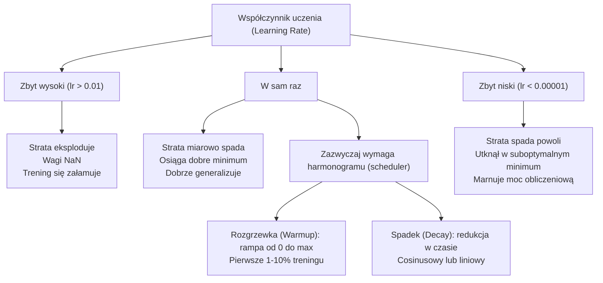
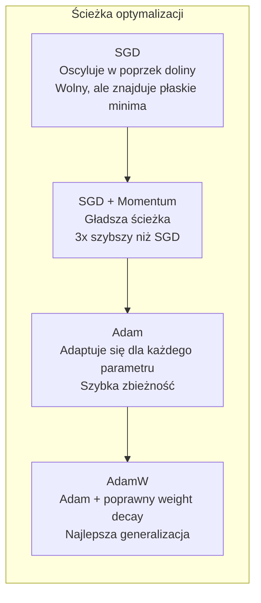
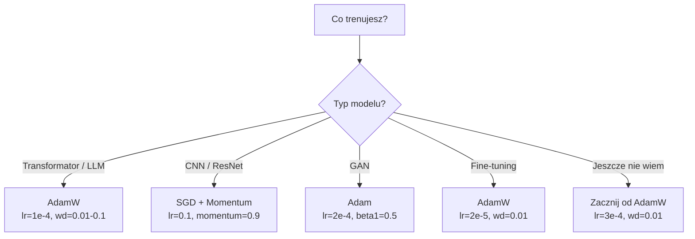

# Optymalizatory

> Spadek gradientu informuje, w którym kierunku się poruszać. Nie mówi jednak nic o tym, jak daleko i jak szybko. SGD to kompas. Adam ma GPS z danymi o ruchu drogowym.

**Typ:** Kompilacja
**Języki:** Python
**Wymagania wstępne:** Lekcja 03.05 (Funkcje straty)
**Czas:** ~75 minut

## Cele nauczania

- Zaimplementuj od podstaw optymalizatory SGD, SGD z momentum, Adam i AdamW w Pythonie.
- Wyjaśnij, w jaki sposób korekcja obciążenia (bias correction) w Adamie kompensuje początkowe (zerowe) szacunki momentów we wczesnych etapach uczenia.
- Wykaż, dlaczego AdamW zapewnia lepszą generalizację niż Adam z regularyzacją L2 w tym samym zadaniu.
- Wybierz odpowiedni optymalizator i domyślne hiperparametry dla architektur takich jak transformatory, CNN, GAN oraz do fine-tuningu (dostrajania).

## Problem

Obliczyłeś gradienty. Wiesz, że waga nr 4721 powinna zostać zmniejszona o 0,003, aby zminimalizować stratę. Ale 0,003 w jakich jednostkach? W stosunku do czego? Czy w kroku 1 należy wykonać przesunięcie o taką samą wartość, co w kroku 1000?

Klasyczny spadek gradientu (vanilla gradient descent) stosuje ten sam współczynnik uczenia (learning rate) do każdego parametru w każdym kroku: `w = w - lr * gradient`. Stwarza to trzy problemy, które w praktyce sprawiają, że trenowanie sieci neuronowych bywa uciążliwe.

Po pierwsze, oscylacje. Krajobraz funkcji straty rzadko przypomina idealnie gładką misę. Częściej jest to długa i wąska dolina. Wektor gradientu wskazuje w poprzek doliny (stromy spadek), a nie wzdłuż niej (łagodny spadek). Spadek gradientu odbija się od ścian tej wąskiej doliny, robiąc jedynie niewielkie postępy we właściwym kierunku. Na pewno to widziałeś: strata szybko spada, a następnie osiąga plateau – nie dlatego, że model zbiegł do minimum, ale dlatego, że oscyluje.

Po drugie, jeden współczynnik uczenia dla wszystkich parametrów to złe podejście. Niektóre wagi wymagają dużych aktualizacji (są wczesnym etapie uczenia i są niedopasowane). Inne potrzebują tylko drobnych korekt (są bliskie wartości optymalnej). Współczynnik uczenia, który sprawdza się w pierwszym przypadku, niszczy drugi – i na odwrót.

Po trzecie, punkty siodłowe (saddle points). W przestrzeniach o dużej liczbie wymiarów krajobraz straty obfituje w rozległe, płaskie obszary, w których gradient jest bliski zeru. Klasyczny SGD pełza przez nie z prędkością proporcjonalną do nachylenia, które w rzeczywistości wynosi zero. Model wydaje się tkwić w martwym punkcie. W rzeczywistości wcale nie utknął – po prostu znajduje się na płaskim obszarze, za którym może znajdować się spadek. Niestety, SGD nie ma mechanizmu, który pozwoliłby mu ten płaski obszar szybko pokonać.

Adam rozwiązuje wszystkie trzy problemy. Utrzymuje dwie średnie kroczące (running averages) dla każdego parametru – średni gradient (pierwszy moment - momentum, tłumi oscylacje) oraz średni kwadrat gradientu (drugi moment - adaptacyjny współczynnik, radzi sobie z różnymi skalami). W połączeniu z korekcją obciążenia w pierwszych kilku krokach, daje to pojedynczy optymalizator, który działa dobrze dla 80% problemów przy domyślnych hiperparametrach. W tej lekcji napiszemy go od podstaw, abyś dokładnie wiedział, kiedy i dlaczego zawodzi w pozostałych 20%.

## Koncepcja

### Stochastyczny spadek gradientu (SGD)

Najprostszy optymalizator. Obliczasz gradient dla mini-partii (mini-batch) i wykonujesz krok w przeciwnym kierunku.

```python
w = w - lr * gradient
```

Słowo "stochastyczny" oznacza, że ​​do oszacowania gradientu używasz losowego podzbioru danych (mini-partii), a nie pełnego zbioru danych. Wprowadzany w ten sposób szum jest w rzeczywistości bardzo przydatny - pomaga uniknąć utknięcia w ostrych minimach lokalnych. Jednak ten sam szum jest też powodem oscylacji.

Jedynym parametrem kontrolnym jest współczynnik uczenia (learning rate). Zbyt wysoki: wartość straty staje się rozbieżna (diverges). Zbyt niski: trening trwa w nieskończoność. Optymalna wartość zależy od architektury, danych, wielkości partii i obecnego etapu szkolenia. W przypadku klasycznego SGD w nowoczesnych sieciach typowe wartości wahają się od 0,01 do 0,1. Pamiętaj jednak, że nawet w trakcie jednego cyklu treningowego optymalna wartość współczynnika uczenia ulega zmianie.

### Momentum

Analogia staczającej się kuli jest często nadużywana, ale w tym przypadku wyjątkowo trafna. Zamiast poruszać się w kierunku wskazywanym wyłącznie przez obecne nachylenie, utrzymujesz "prędkość" (momentum), która kumuluje historię poprzednich gradientów.

```python
m_t = beta * m_{t-1} + gradient
w = w - lr * m_t
```

Parametr `beta` (zwykle 0,9) kontroluje ilość uwzględnianej historii. Przy `beta = 0,9`, momentum jest w przybliżeniu średnią z ostatnich 10 gradientów (1 / (1 - 0,9) = 10).

Dlaczego to eliminuje oscylacje? Gradienty wskazujące w tym samym kierunku kumulują się. Gradienty, które nieustannie zmieniają znak (oscylują), znoszą się nawzajem. W wąskiej dolinie składowa wektora wskazująca "w poprzek" odwraca znak w każdym kroku i ulega wytłumieniu. Składowa skierowana "wzdłuż" doliny pozostaje spójna i zostaje wzmocniona. Rezultatem jest płynne przyspieszenie w użytecznym kierunku.

Realne liczby: Sam SGD w źle uwarunkowanym krajobrazie straty może wymagać 10 000 kroków. SGD z momentum (beta = 0,9) zwykle wymaga 3 000–5 000 kroków dla tego samego problemu. Przyspieszenie z pewnością nie jest marginalne.

### RMSProp

Pierwsza metoda adaptacyjnego współczynnika uczenia dla każdego parametru, która faktycznie zadziałała. Została zaproponowana przez Geoffreya Hintona na wykładzie w ramach kursu Coursera (nigdy nie została formalnie opublikowana jako artykuł naukowy).

```python
s_t = beta * s_{t-1} + (1 - beta) * gradient^2
w = w - lr * gradient / (sqrt(s_t) + epsilon)
```

Zmienna `s_t` śledzi wykładniczą średnią kroczącą kwadratów gradientów. Parametry o stale dużych gradientach są dzielone przez dużą liczbę (co daje mniejszy efektywny współczynnik uczenia). Parametry o małych gradientach są dzielone przez małą liczbę (większy efektywny współczynnik uczenia).

Rozwiązuje to problem "jednego współczynnika uczenia dla wszystkich parametrów". Waga, która już wcześniej otrzymywała duże aktualizacje, prawdopodobnie zbliża się do celu – należy ją zwolnić. Waga, która otrzymywała tylko drobne aktualizacje, może być niedotrenowana — trzeba ją przyspieszyć.

Parametr `epsilon` (zwykle 1e-8) zapobiega błędom dzielenia przez zero w przypadku, gdy parametr nie był wcześniej aktualizowany.

### Adam: Momentum + RMSProp

Adam płynnie łączy oba te pomysły. Utrzymuje dwie wykładnicze średnie kroczące dla każdego parametru:

```python
m_t = beta1 * m_{t-1} + (1 - beta1) * gradient        (pierwszy moment: średnia)
v_t = beta2 * v_{t-1} + (1 - beta2) * gradient^2      (drugi moment: nieucentrowana wariancja)
```

**Korekcja obciążenia (bias correction)** to kluczowy szczegół pomijany w większości wyjaśnień. W kroku 1 mamy `m_1 = (1 - beta1) * gradient`. Przy `beta1 = 0,9`, jest to równe `0,1 * gradient` — czyli wartość dziesięciokrotnie zaniżona. Średnia krocząca jeszcze się nie "rozgrzała". Korekcja obciążenia kompensuje ten efekt:

```python
m_hat = m_t / (1 - beta1^t)
v_hat = v_t / (1 - beta2^t)
```

W kroku 1 przy `beta1 = 0,9`: `m_hat = m_1 / (1 - 0,9) = m_1 / 0,1 = rzeczywisty gradient`. W kroku 100 wyrażenie `(1 - 0,9^100)` wynosi w przybliżeniu 1,0, więc efekt korekcji zanika. Korekcja obciążenia ma znaczenie przez pierwsze ~10 kroków i staje się nieistotna po ~50 krokach.

Aktualizacja:

```python
w = w - lr * m_hat / (sqrt(v_hat) + epsilon)
```

Domyślne wartości dla optymalizatora Adam: `lr = 0,001`, `beta1 = 0,9`, `beta2 = 0,999`, `epsilon = 1e-8`. Te ustawienia sprawdzają się w 80% problemów. Jeśli tak nie jest, najpierw zmień `lr`. Następnie spróbuj zmienić `beta2`. Prawie nigdy nie powinieneś zmieniać `beta1` ani `epsilon`.

### AdamW: Zanik wag (Weight Decay) zrobiony dobrze

Regularyzacja L2 dodaje termin `lambda * w^2` do funkcji straty. W klasycznym SGD jest to matematycznie równoważne zanikowi wag (odejmowaniu `lambda * w` od wagi w każdym kroku). W Adamie ta równoważność znika.

Spostrzeżenie Loschilova i Huttera: kiedy dodasz karę L2 do straty, a następnie Adam przetworzy gradient, adaptacyjny współczynnik uczenia przeskaluje również człon regularyzacji. Parametry o dużej wariancji gradientu otrzymają słabszą regularyzację. Parametry o małej wariancji otrzymają silniejszą. Nie tego oczekujemy — chcemy przecież jednolitej regularyzacji, niezależnej od statystyk gradientu.

AdamW rozwiązuje ten problem, stosując zanik wag bezpośrednio do parametrów po wykonaniu aktualizacji Adama:

```python
w = w - lr * m_hat / (sqrt(v_hat) + epsilon) - lr * lambda * w
```

Człon związany z zanikiem wag (`lr * lambda * w`) nie jest skalowany przez adaptacyjny współczynnik Adama. Każdy parametr doświadcza takiego samego proporcjonalnego "kurczenia się".

Może się to wydawać drobnym szczegółem. Wcale nim nie jest. AdamW zbiega do znacznie lepszych rozwiązań niż Adam + regularyzacja L2 w praktycznie każdym zadaniu. Jest to domyślny optymalizator w PyTorch używany do trenowania transformatorów, modeli dyfuzyjnych i większości nowoczesnych architektur. BERT, GPT, LLaMA, Stable Diffusion – wszystkie te modele były trenowane przy użyciu AdamW.

### Współczynnik uczenia: najważniejszy hiperparametr



Jeśli masz zamiar dostroić tylko jeden hiperparametr, niech to będzie współczynnik uczenia. Zmiana współczynnika uczenia o rząd wielkości (10x) ma znacznie większy wpływ na wyniki niż jakakolwiek decyzja architektoniczna. Typowe ustawienia domyślne to:

- SGD: lr = 0,01 do 0,1
- Adam/AdamW: lr = 1e-4 do 3e-4
- Fine-tuning (dostrajanie wstępnie wytrenowanych modeli): lr = 1e-5 do 5e-5
- Rozgrzewka współczynnika uczenia (warmup): liniowy wzrost przez pierwsze 1-10% kroków.

### Porównanie optymalizatorów



### Kiedy który optymalizator wygrywa



## Zbuduj to

### Krok 1: Klasyczny SGD

```python
class SGD:
    def __init__(self, lr=0.01):
        self.lr = lr

    def step(self, params, grads):
        for i in range(len(params)):
            params[i] -= self.lr * grads[i]
```

### Krok 2: SGD z Momentum

```python
class SGDMomentum:
    def __init__(self, lr=0.01, beta=0.9):
        self.lr = lr
        self.beta = beta
        self.velocities = None

    def step(self, params, grads):
        if self.velocities is None:
            self.velocities = [0.0] * len(params)
        for i in range(len(params)):
            self.velocities[i] = self.beta * self.velocities[i] + grads[i]
            params[i] -= self.lr * self.velocities[i]
```

### Krok 3: Adam

```python
import math

class Adam:
    def __init__(self, lr=0.001, beta1=0.9, beta2=0.999, epsilon=1e-8):
        self.lr = lr
        self.beta1 = beta1
        self.beta2 = beta2
        self.epsilon = epsilon
        self.m = None
        self.v = None
        self.t = 0

    def step(self, params, grads):
        if self.m is None:
            self.m = [0.0] * len(params)
            self.v = [0.0] * len(params)

        self.t += 1

        for i in range(len(params)):
            self.m[i] = self.beta1 * self.m[i] + (1 - self.beta1) * grads[i]
            self.v[i] = self.beta2 * self.v[i] + (1 - self.beta2) * grads[i] ** 2

            m_hat = self.m[i] / (1 - self.beta1 ** self.t)
            v_hat = self.v[i] / (1 - self.beta2 ** self.t)

            params[i] -= self.lr * m_hat / (math.sqrt(v_hat) + self.epsilon)
```

### Krok 4: AdamW

```python
class AdamW:
    def __init__(self, lr=0.001, beta1=0.9, beta2=0.999, epsilon=1e-8, weight_decay=0.01):
        self.lr = lr
        self.beta1 = beta1
        self.beta2 = beta2
        self.epsilon = epsilon
        self.weight_decay = weight_decay
        self.m = None
        self.v = None
        self.t = 0

    def step(self, params, grads):
        if self.m is None:
            self.m = [0.0] * len(params)
            self.v = [0.0] * len(params)

        self.t += 1

        for i in range(len(params)):
            self.m[i] = self.beta1 * self.m[i] + (1 - self.beta1) * grads[i]
            self.v[i] = self.beta2 * self.v[i] + (1 - self.beta2) * grads[i] ** 2

            m_hat = self.m[i] / (1 - self.beta1 ** self.t)
            v_hat = self.v[i] / (1 - self.beta2 ** self.t)

            params[i] -= self.lr * m_hat / (math.sqrt(v_hat) + self.epsilon)
            params[i] -= self.lr * self.weight_decay * params[i]
```

### Krok 5: Porównanie treningów

Wytrenuj tę samą dwuwarstwową sieć na zbiorze danych z okręgiem (z lekcji 05) przy użyciu wszystkich czterech optymalizatorów. Porównaj ich konwergencję.

```python
import random

def sigmoid(x):
    x = max(-500, min(500, x))
    return 1.0 / (1.0 + math.exp(-x))

def make_circle_data(n=200, seed=42):
    random.seed(seed)
    data = []
    for _ in range(n):
        x = random.uniform(-2, 2)
        y = random.uniform(-2, 2)
        label = 1.0 if x * x + y * y < 1.5 else 0.0
        data.append(([x, y], label))
    return data

class OptimizerTestNetwork:
    def __init__(self, optimizer, hidden_size=8):
        random.seed(0)
        self.hidden_size = hidden_size
        self.optimizer = optimizer

        self.w1 = [[random.gauss(0, 0.5) for _ in range(2)] for _ in range(hidden_size)]
        self.b1 = [0.0] * hidden_size
        self.w2 = [random.gauss(0, 0.5) for _ in range(hidden_size)]
        self.b2 = 0.0

    def get_params(self):
        params = []
        for row in self.w1:
            params.extend(row)
        params.extend(self.b1)
        params.extend(self.w2)
        params.append(self.b2)
        return params

    def set_params(self, params):
        idx = 0
        for i in range(self.hidden_size):
            for j in range(2):
                self.w1[i][j] = params[idx]
                idx += 1
        for i in range(self.hidden_size):
            self.b1[i] = params[idx]
            idx += 1
        for i in range(self.hidden_size):
            self.w2[i] = params[idx]
            idx += 1
        self.b2 = params[idx]

    def forward(self, x):
        self.x = x
        self.z1 = []
        self.h = []
        for i in range(self.hidden_size):
            z = self.w1[i][0] * x[0] + self.w1[i][1] * x[1] + self.b1[i]
            self.z1.append(z)
            self.h.append(max(0.0, z))

        self.z2 = sum(self.w2[i] * self.h[i] for i in range(self.hidden_size)) + self.b2
        self.out = sigmoid(self.z2)
        return self.out

    def compute_grads(self, target):
        eps = 1e-15
        p = max(eps, min(1 - eps, self.out))
        d_loss = -(target / p) + (1 - target) / (1 - p)
        d_sigmoid = self.out * (1 - self.out)
        d_out = d_loss * d_sigmoid

        grads = [0.0] * (self.hidden_size * 2 + self.hidden_size + self.hidden_size + 1)
        idx = 0
        for i in range(self.hidden_size):
            d_relu = 1.0 if self.z1[i] > 0 else 0.0
            d_h = d_out * self.w2[i] * d_relu
            grads[idx] = d_h * self.x[0]
            grads[idx + 1] = d_h * self.x[1]
            idx += 2

        for i in range(self.hidden_size):
            d_relu = 1.0 if self.z1[i] > 0 else 0.0
            grads[idx] = d_out * self.w2[i] * d_relu
            idx += 1

        for i in range(self.hidden_size):
            grads[idx] = d_out * self.h[i]
            idx += 1

        grads[idx] = d_out
        return grads

    def train(self, data, epochs=300):
        losses = []
        for epoch in range(epochs):
            total_loss = 0.0
            correct = 0
            for x, y in data:
                pred = self.forward(x)
                grads = self.compute_grads(y)
                params = self.get_params()
                self.optimizer.step(params, grads)
                self.set_params(params)

                eps = 1e-15
                p = max(eps, min(1 - eps, pred))
                total_loss += -(y * math.log(p) + (1 - y) * math.log(1 - p))
                if (pred >= 0.5) == (y >= 0.5):
                    correct += 1
            avg_loss = total_loss / len(data)
            accuracy = correct / len(data) * 100
            losses.append((avg_loss, accuracy))
            if epoch % 75 == 0 or epoch == epochs - 1:
                print(f"    Epoka {epoch:3d}: strata={avg_loss:.4f}, dokładność={accuracy:.1f}%")
        return losses
```

## Użyj tego

Optymalizatory w PyTorch natywnie obsługują grupy parametrów, przycinanie gradientów (gradient clipping) i harmonogramy współczynnika uczenia (learning rate schedulers):

```python
import torch
import torch.optim as optim

model = torch.nn.Sequential(
    torch.nn.Linear(784, 256),
    torch.nn.ReLU(),
    torch.nn.Linear(256, 10),
)

optimizer = optim.AdamW(model.parameters(), lr=3e-4, weight_decay=0.01)

scheduler = optim.lr_scheduler.CosineAnnealingLR(optimizer, T_max=100)

for epoch in range(100):
    optimizer.zero_grad()
    output = model(torch.randn(32, 784))
    loss = torch.nn.functional.cross_entropy(output, torch.randint(0, 10, (32,)))
    loss.backward()
    torch.nn.utils.clip_grad_norm_(model.parameters(), max_norm=1.0)
    optimizer.step()
    scheduler.step()
```

Schemat postępowania jest zawsze następujący: `zero_grad`, faza forward, obliczenie `loss`, `backward`, (ew. `clip`), `step`, (ew. `scheduler`). Zapamiętaj tę kolejność. Zmiana kolejności (np. wywołanie `scheduler.step()` przed `optimizer.step()`) jest częstym źródłem subtelnych, trudnych do wykrycia błędów.

W przypadku CNN wielu praktyków nadal preferuje kombinację SGD + momentum (lr = 0,1, momentum = 0,9, weight_decay = 1e-4) połączoną z harmonogramem krokowym (step) lub cosinusowym. SGD znajduje szersze, bardziej płaskie minima, które często skutkują lepszą generalizacją na nowych danych. Z kolei w przypadku transformatorów i modeli LLM powszechnie przyjętym standardem jest AdamW z rozgrzewką (warmup) i zanikiem cosinusowym (cosine decay). Nie walcz z konsensusem bez wyraźnego powodu.

## Wyślij to

Ta lekcja zawiera:
- `outputs/prompt-optimizer-selector.md` – prompt (podpowiedź) ułatwiający wybór odpowiedniego optymalizatora i współczynnika uczenia dla dowolnej architektury.

## Ćwiczenia

1. Zaimplementuj momentum Niestierowa (Nesterov momentum), obliczając gradient w pozycji wyprzedzającej – tzw. "lookahead" (`w - lr * beta * v`), zamiast w bieżącej pozycji. Porównaj zbieżność ze standardowym momentum na zbiorze danych z okręgiem.

2. Wprowadź harmonogram z rozgrzewką współczynnika uczenia (warmup): liniowy wzrost od 0 do `max_lr` przez pierwsze 10% kroków treningowych, a następnie cosinusowy spadek do 0. Przetestuj wariant Adam + rozgrzewka kontra sam Adam (bez rozgrzewki). Zmierz, ile epok potrzeba, aby osiągnąć 90% dokładności na zbiorze danych z okręgiem.

3. Śledź efektywny współczynnik uczenia dla każdego parametru podczas treningu z użyciem Adama. Efektywny współczynnik to `lr * m_hat / (sqrt(v_hat) + eps)`. Narysuj rozkład tych efektywnych współczynników po 10, 50 i 200 krokach. Czy wszystkie parametry są aktualizowane z tą samą szybkością?

4. Zaimplementuj obcinanie gradientów (gradient clipping wg globalnej normy). Ustaw maksymalną normę gradientu na 1,0. Wykonaj trening z obcinaniem i bez niego, stosując bardzo wysoki współczynnik uczenia (np. `lr=0,01` dla Adama). Sprawdź, dla ilu spośród 10 losowych inicjalizacji (losowych ziaren) trening jest rozbieżny (strata wynosi NaN) z obcinaniem oraz bez niego.

5. Porównaj Adam i AdamW na małej sieci ze znacznie zawyżonymi wagami początkowymi. Zainicjuj wszystkie wagi losowymi wartościami z przedziału `[-5, 5]` (znacznie większymi niż normalnie). Trenuj sieć przez 200 epok z parametrem `weight_decay=0,1`. Śledź i wykreśl normę L2 dla wszystkich wag podczas treningu w przypadku obu optymalizatorów. AdamW powinien skutkować zauważalnie szybszym zanikiem wag (weight decay).

## Kluczowe terminy

| Termin | Co mówią ludzie | Co to właściwie oznacza |
|------|----------------|----------------------|
| Współczynnik uczenia (Learning Rate) | „Rozmiar kroku” | Skalarny mnożnik określający rozmiar aktualizacji gradientu; pojedynczy hiperparametr o największym wpływie na trening. |
| SGD | „Klasyczny spadek gradientu” | Stochastyczny spadek gradientu (Stochastic Gradient Descent): aktualizacja wag polegająca na odjęciu `lr * gradient` obliczonego dla małej partii (mini-batch). |
| Momentum | „Analogia staczającej się kuli” | Wykładnicza średnia krocząca (EMA) poprzednich gradientów; skutecznie tłumi oscylacje i przyspiesza konwergencję w stałych kierunkach. |
| RMSProp | „Adaptacyjny współczynnik uczenia” | Dzieli gradient każdego parametru przez bieżącą wartość RMS jego ostatnich gradientów; wyrównuje tempo uczenia dla wszystkich wag. |
| Adam | „Domyślny optymalizator” | Łączy momentum (pierwszy moment) i RMSProp (drugi moment) wraz z korekcją obciążenia (bias correction) dla wczesnych kroków. |
| AdamW | „Adam zrobiony dobrze” | Adam z oddzielonym (decoupled) zanikiem wag; aplikuje regularyzację bezpośrednio do samych wag, a nie pośrednio poprzez modyfikację gradientu. |
| Korekcja obciążenia (Bias correction) | „Rozgrzewka dla średnich kroczących” | Dzielenie wartości przez `(1 - beta^t)` w celu zrekompensowania zerowej inicjalizacji estymatorów momentów w optymalizatorze Adam. |
| Zanik wag (Weight Decay) | „Zmniejszanie wag” | Zmniejszanie wartości każdej wagi o określony ułamek w każdym kroku optymalizacji; forma regularyzacji, która karze zbyt duże wagi. |
| Harmonogram LR (LR Schedule) | „Zmiana lr w czasie” | Funkcja adaptacyjnie dostosowująca współczynnik uczenia w trakcie treningu; "warmup" (rozgrzewka) + cosinusowy spadek to dzisiejszy złoty standard. |
| Przycinanie gradientu (Gradient Clipping) | „Ograniczanie normy gradientu” | Odpowiednie skalowanie w dół całego wektora gradientu w sytuacji, gdy jego norma przekracza ustalony próg; zapobiega destrukcyjnym, eksplodującym aktualizacjom gradientów. |

## Dalsza lektura

- Kingma & Ba, "Adam: A Method for Stochastic Optimization" (2014) - Oryginalna praca wprowadzająca Adama z dokładną analizą zbieżności i matematycznym wyprowadzeniem korekcji obciążenia.
- Loshchilov i Hutter, „Decoupled Weight Decay Regularization” (2017) – Autorzy udowodnili, że regularyzacja L2 i zanik wag nie są matematycznie tożsame w Adamie i zaproponowali optymalizator AdamW.
- Smith, „Cyclical Learning Rates for Training Neural Networks” (2017) – Artykuł wprowadza technikę "LR range test" oraz cykliczne harmonogramy, które w dużym stopniu eliminują potrzebę żmudnego dostrajania stałego współczynnika uczenia.
- Ruder, „An Overview of Gradient Descent Optimization Algorithms” (2016) — Najlepszy, kompleksowy przegląd wszelkich wariantów optymalizatorów, z doskonałymi porównaniami i cennymi intuicjami.
