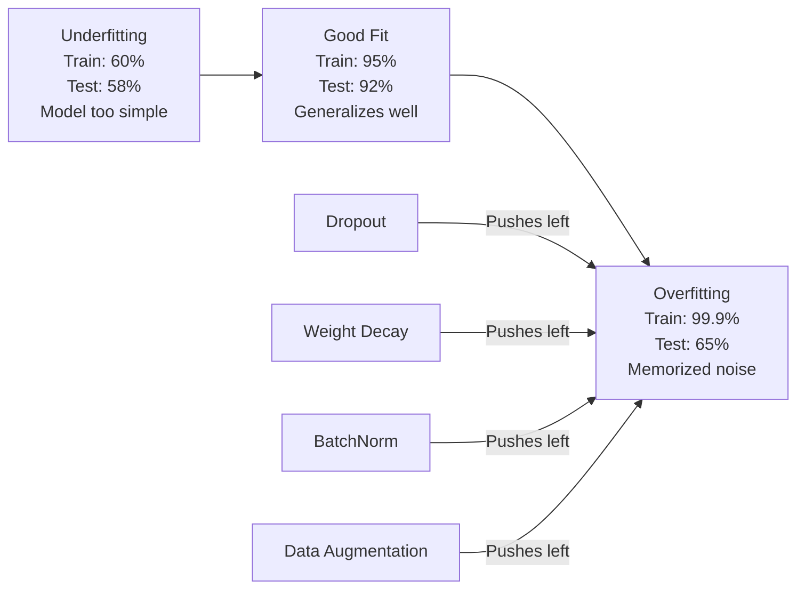
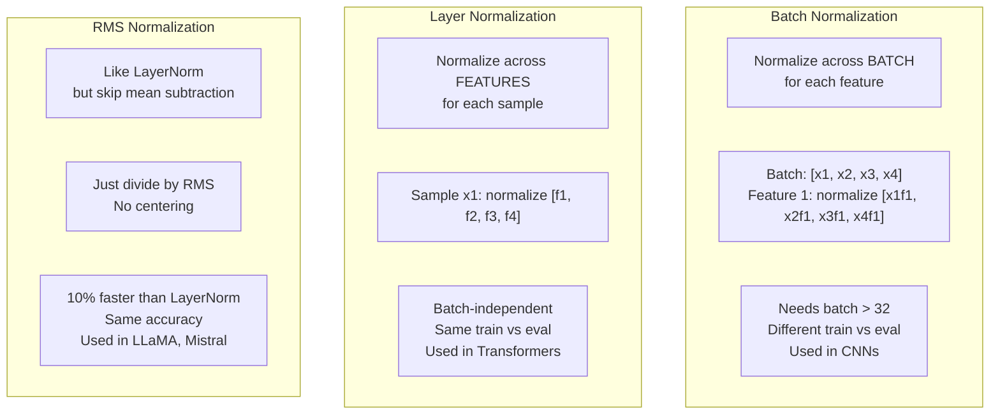
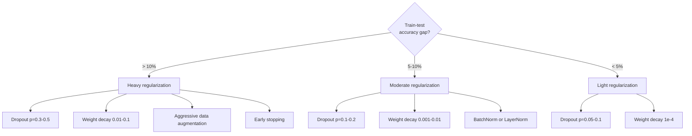

# Regularyzacja

> Twój model uzyskuje 99% danych treningowych i 60% danych testowych. Zapamiętywał zamiast się uczyć. Regularyzacja to podatek nakładany na złożoność, aby wymusić uogólnienie.

**Typ:** Kompilacja
**Języki:** Python
**Wymagania wstępne:** Lekcja 03.06 (Optymalizatory)
**Czas:** ~75 minut

## Cele nauczania

- Zaimplementuj porzucenie z odwróconym skalowaniem, zanikiem masy L2, normalizacją wsadową, normalizacją warstw i RMSNorm od zera
- Zmierzyć lukę w dokładności testu pociągu i zdiagnozować nadmierne dopasowanie za pomocą eksperymentów regularyzacyjnych
- Wyjaśnij, dlaczego transformatory używają LayerNorm zamiast BatchNorm i dlaczego nowoczesne LLM wolą RMSNorm
- Zastosuj właściwą kombinację technik regularyzacji w oparciu o stopień nadmiernego dopasowania

## Problem

Sieć neuronowa o wystarczających parametrach może zapamiętać dowolny zbiór danych. To nie jest hipoteza – Zhang i in. (2017) udowodnili to, ucząc standardowe sieci w ImageNet za pomocą losowych etykiet. Sieci osiągnęły niemal zerowe straty szkoleniowe przy całkowicie losowych przypisaniach etykiet. Zapamiętali milion losowych par wejście-wyjście bez żadnego wzorca do nauczenia się. Strata treningowa była doskonała. Dokładność testu była zerowa.

Jest to problem nadmiernego dopasowania, który nasila się w miarę powiększania się modeli. GPT-3 ma 175 miliardów parametrów. Zestaw szkoleniowy zawiera około 500 miliardów tokenów. Przy tak wielu parametrach model ma wystarczającą pojemność, aby dosłownie zapamiętać znaczące fragmenty danych szkoleniowych. Bez regularyzacji zamiast uczyć się wzorców, które można uogólnić, po prostu powtarzalibyśmy przykłady szkoleniowe.

Luka pomiędzy wynikami treningu a wynikami testów to luka w zakresie nadmiernego dopasowania. Każda technika opisana w tej lekcji atakuje tę lukę pod innym kątem. Rezygnacja powoduje, że sieć nie opiera się na żadnym pojedynczym neuronie. Zanik masy ciała zapobiega nadmiernemu wzrostowi pojedynczego ciężaru. Normalizacja wsadowa wygładza krajobraz strat, dzięki czemu optymalizator znajduje bardziej płaskie minima, które można uogólnić. Normalizacja warstw robi to samo, ale działa tam, gdzie zawodzi normalizacja wsadowa (małe partie, sekwencje o zmiennej długości). RMSNorm robi to 10% szybciej, pomijając obliczenia średniej. Każda technika jest prosta. Razem stanowią różnicę między modelem, który zapamiętuje, a modelem, który uogólnia.

## Koncepcja

### Spektrum nadmiernego dopasowania

Każdy model mieści się gdzieś w spektrum od niedopasowania (zbyt prostego, aby uchwycić wzór) do nadmiernego dopasowania (tak złożonego, że wychwytuje szum). Najlepszy punkt znajduje się pośrodku, a regularyzacja popycha modele w jego stronę ze strony nadmiernego dopasowania.



### Rezygnacja

Najprostsza technika regularyzacji z najbardziej elegancką interpretacją. Podczas uczenia losowo ustaw wyjście każdego neuronu na zero z prawdopodobieństwem p.

```
output = activation(z) * mask    where mask[i] ~ Bernoulli(1 - p)
```

Przy p = 0,5 połowa neuronów jest zerowana przy każdym przejściu do przodu. Sieć musi uczyć się reprezentacji nadmiarowych, ponieważ nie jest w stanie przewidzieć, które neurony będą dostępne. Zapobiega to koadaptacji – neurony uczą się polegać na obecności określonych innych neuronów.

Interpretacja zespołowa: sieć z N neuronami i przerwami tworzy 2^N możliwych podsieci (każda kombinacja neuronów włączonych lub wyłączonych). Trening z porzuceniem pociąga w przybliżeniu wszystkie podsieci 2^N jednocześnie, każdą w różnych minipartiach. W czasie testu używasz wszystkich neuronów (bez utraty) i skalujesz wyniki o (1 - p), aby dopasować oczekiwaną wartość podczas treningu. Jest to równoznaczne z uśrednieniem przewidywań dla podsieci 2^N – ogromnego zestawu z jednego modelu.

W praktyce skalowanie stosuje się podczas szkolenia, a nie podczas testów (odwrócony dropout):

```
During training:  output = activation(z) * mask / (1 - p)
During testing:   output = activation(z)   (no change needed)
```

Jest to czystsze, ponieważ kod testowy w ogóle nie musi wiedzieć o porzuceniu.

Stawki domyślne: p = 0,1 dla transformatorów, p = 0,5 dla MLP, p = 0,2-0,3 dla CNN. Większy odsetek rezygnacji = silniejsza regularyzacja = większe ryzyko niedopasowania.

### Spadek masy ciała (regularyzacja L2)

Dodaj kwadrat wielkości wszystkich ciężarów do straty:

```
total_loss = task_loss + (lambda / 2) * sum(w_i^2)
```

Gradient składnika regularyzacyjnego wynosi lambda * w. Oznacza to, że na każdym kroku każda waga jest zmniejszana do zera o ułamek proporcjonalny do jej wielkości. Duże ciężary są karane bardziej. Model jest spychany w stronę rozwiązań, w których nie dominuje żaden pojedynczy ciężar.

Dlaczego pomaga to w uogólnianiu: modele z nadmiernym dopasowaniem mają zwykle duże wagi, które wzmacniają szum w danych uczących. Spadek masy powoduje, że ciężary są małe, co ogranicza efektywną wydajność modelu i zmusza go do polegania na solidnych, możliwych do uogólnienia cechach, a nie na zapamiętanych dziwactwach.

Hiperparametr lambda kontroluje siłę. Typowe wartości:

- 0,01 dla AdamaW na transformatorach
- 1e-4 dla SGD w CNN
- 0,1 dla modeli mocno przetrenowanych

Jak omówiono w lekcji 06: zanik masy i regularyzacja L2 są równoważne w SGD, ale nie w Adamie. Podczas treningu z Adamem zawsze używaj AdamW (oddzielny rozkład masy).

### Normalizacja wsadowa

Normalizuj dane wyjściowe każdej warstwy w minipartii przed przekazaniem jej do następnej warstwy.

W przypadku mini-partii aktywacji na jakiejś warstwie:

```
mu = (1/B) * sum(x_i)           (batch mean)
sigma^2 = (1/B) * sum((x_i - mu)^2)   (batch variance)
x_hat = (x_i - mu) / sqrt(sigma^2 + eps)   (normalize)
y = gamma * x_hat + beta        (scale and shift)
```

Gamma i beta to parametry, których można się nauczyć i które pozwalają sieci cofnąć normalizację, jeśli jest to optymalne. Bez nich zmuszono by do uzyskania na wyjściu każdej warstwy średniej zerowej wariancji jednostkowej, co mogłoby nie być zgodne z oczekiwaniami sieci.

**Podział treningu a wnioskowanie:** Podczas uczenia mu i sigma pochodzą z bieżącej mini-partii. Podczas wnioskowania korzystasz ze średnich bieżących zgromadzonych podczas treningu (wykładnicza średnia krocząca z momentem = 0,1, co oznacza 90% starych + 10% nowych).

Dlaczego BatchNorm działa, jest wciąż przedmiotem dyskusji. W oryginalnym artykule stwierdzono, że zmniejsza to „wewnętrzne przesunięcie współzmiennej” (rozkład danych wejściowych warstw zmienia się wraz z aktualizacją wcześniejszych warstw). Santurkar i in. (2018) wykazali, że to wyjaśnienie jest błędne. Prawdziwy powód: BatchNorm sprawia, że ​​krajobraz strat staje się płynniejszy. Gradienty są bardziej przewidywalne, stałe Lipschitza są mniejsze, a optymalizator może bezpiecznie wykonywać większe kroki. Właśnie dlatego BatchNorm umożliwia szybsze uczenie się i konwergencję.

BatchNorm ma podstawowe ograniczenie: zależy od statystyk partii. W przypadku partii o wielkości 1 średnia i wariancja nie mają znaczenia. W przypadku małych partii (< 32) statystyki są zaszumione i pogarszają wydajność. Ma to znaczenie w przypadku zadań takich jak wykrywanie obiektów (gdzie pamięć ogranicza rozmiar partii) i modelowanie języka (gdzie różne długości sekwencji).

### Normalizacja warstw

Normalizuj między funkcjami, a nie w całej partii. Dla pojedynczej próbki:

```
mu = (1/D) * sum(x_j)           (feature mean)
sigma^2 = (1/D) * sum((x_j - mu)^2)   (feature variance)
x_hat = (x_j - mu) / sqrt(sigma^2 + eps)
y = gamma * x_hat + beta
```

D jest wymiarem cechy. Każda próbka jest normalizowana niezależnie – bez zależności od wielkości partii. Właśnie dlatego transformatory używają LayerNorm zamiast BatchNorm. Sekwencje mają zmienną długość, rozmiary partii są często małe (lub 1 podczas generowania), a obliczenia są identyczne w przypadku uczenia i wnioskowania.

LayerNorm w transformatorach jest stosowany po każdym bloku samouważności i każdym bloku sprzężenia zwrotnego (Post-LN) lub przed nimi (Pre-LN, który jest bardziej stabilny w przypadku treningu).

###RMSNorm

LayerNorm bez odejmowania średniej. Zaproponowane przez Zhanga i Sennricha (2019).

```
rms = sqrt((1/D) * sum(x_j^2))
y = gamma * x / rms
```

To wszystko. Żadnych średnich obliczeń, żadnego parametru beta. Obserwacja: ponowne centrowanie (odejmowanie średniej) w LayerNorm ma bardzo niewielki wpływ na wydajność modelu, ale kosztuje obliczenia. Usunięcie go zapewnia tę samą dokładność przy około 10% mniejszym narzucie.

LLaMA, LLaMA 2, LLaMA 3, Mistral i większość nowoczesnych LLM używają RMSNorm zamiast LayerNorm. W skali miliardów parametrów i bilionów tokenów te 10% oszczędności jest znaczące.

### Porównanie normalizacji



### Powiększanie danych jako regularyzacja

Nie modyfikacja modelu, ale modyfikacja danych. Przekształcaj dane wejściowe do szkolenia, zachowując etykiety:

- Obrazy: losowe przycinanie, odwracanie, obracanie, drgania kolorów, wycinanie
- Tekst: zamiana synonimów, tłumaczenie wsteczne, losowe usunięcie
- Dźwięk: rozciąganie w czasie, zmiana wysokości tonu, dodawanie szumu

Efekt jest identyczny z regularyzacją: zwiększa efektywny rozmiar zbioru uczącego, utrudniając modelowi zapamiętanie konkretnych przykładów. Model, który widzi każdy obraz w oryginalnej formie tylko raz, może go zapamiętać. Model, który widzi 50 rozszerzonych wersji każdego obrazu, jest zmuszony nauczyć się niezmiennej struktury.

### Wcześniejsze zatrzymanie

Najprostszy regularyzator: przestań trenować, gdy utrata walidacji zacznie rosnąć. Model nie jest jeszcze w tym momencie przetrenowany. W praktyce śledzisz utratę walidacji w każdej epoce, zapisujesz najlepszy model i kontynuujesz szkolenie przez okno „cierpliwości” (zwykle 5–20 epok). Jeśli utrata walidacji nie ulegnie poprawie w oknie cierpliwości, zatrzymasz i wczytasz najlepiej zapisany model.

### Kiedy co zastosować



## Zbuduj to

### Krok 1: Rezygnacja (tryb szkolenia i oceny)

```python
import random
import math

class Dropout:
    def __init__(self, p=0.5):
        self.p = p
        self.training = True
        self.mask = None

    def forward(self, x):
        if not self.training:
            return list(x)
        self.mask = []
        output = []
        for val in x:
            if random.random() < self.p:
                self.mask.append(0)
                output.append(0.0)
            else:
                self.mask.append(1)
                output.append(val / (1 - self.p))
        return output

    def backward(self, grad_output):
        grads = []
        for g, m in zip(grad_output, self.mask):
            if m == 0:
                grads.append(0.0)
            else:
                grads.append(g / (1 - self.p))
        return grads
```

### Krok 2: Spadek masy L2

```python
def l2_regularization(weights, lambda_reg):
    penalty = 0.0
    for w in weights:
        penalty += w * w
    return lambda_reg * 0.5 * penalty

def l2_gradient(weights, lambda_reg):
    return [lambda_reg * w for w in weights]
```

### Krok 3: Normalizacja wsadowa

```python
class BatchNorm:
    def __init__(self, num_features, momentum=0.1, eps=1e-5):
        self.gamma = [1.0] * num_features
        self.beta = [0.0] * num_features
        self.eps = eps
        self.momentum = momentum
        self.running_mean = [0.0] * num_features
        self.running_var = [1.0] * num_features
        self.training = True
        self.num_features = num_features

    def forward(self, batch):
        batch_size = len(batch)
        if self.training:
            mean = [0.0] * self.num_features
            for sample in batch:
                for j in range(self.num_features):
                    mean[j] += sample[j]
            mean = [m / batch_size for m in mean]

            var = [0.0] * self.num_features
            for sample in batch:
                for j in range(self.num_features):
                    var[j] += (sample[j] - mean[j]) ** 2
            var = [v / batch_size for v in var]

            for j in range(self.num_features):
                self.running_mean[j] = (1 - self.momentum) * self.running_mean[j] + self.momentum * mean[j]
                self.running_var[j] = (1 - self.momentum) * self.running_var[j] + self.momentum * var[j]
        else:
            mean = list(self.running_mean)
            var = list(self.running_var)

        self.x_hat = []
        output = []
        for sample in batch:
            normalized = []
            out_sample = []
            for j in range(self.num_features):
                x_h = (sample[j] - mean[j]) / math.sqrt(var[j] + self.eps)
                normalized.append(x_h)
                out_sample.append(self.gamma[j] * x_h + self.beta[j])
            self.x_hat.append(normalized)
            output.append(out_sample)
        return output
```

### Krok 4: Normalizacja warstw

```python
class LayerNorm:
    def __init__(self, num_features, eps=1e-5):
        self.gamma = [1.0] * num_features
        self.beta = [0.0] * num_features
        self.eps = eps
        self.num_features = num_features

    def forward(self, x):
        mean = sum(x) / len(x)
        var = sum((xi - mean) ** 2 for xi in x) / len(x)

        self.x_hat = []
        output = []
        for j in range(self.num_features):
            x_h = (x[j] - mean) / math.sqrt(var + self.eps)
            self.x_hat.append(x_h)
            output.append(self.gamma[j] * x_h + self.beta[j])
        return output
```

### Krok 5: Norma RMS

```python
class RMSNorm:
    def __init__(self, num_features, eps=1e-6):
        self.gamma = [1.0] * num_features
        self.eps = eps
        self.num_features = num_features

    def forward(self, x):
        rms = math.sqrt(sum(xi * xi for xi in x) / len(x) + self.eps)
        output = []
        for j in range(self.num_features):
            output.append(self.gamma[j] * x[j] / rms)
        return output
```

### Krok 6: Trening z regularyzacją i bez

```python
def sigmoid(x):
    x = max(-500, min(500, x))
    return 1.0 / (1.0 + math.exp(-x))

def make_circle_data(n=200, seed=42):
    random.seed(seed)
    data = []
    for _ in range(n):
        x = random.uniform(-2, 2)
        y = random.uniform(-2, 2)
        label = 1.0 if x * x + y * y < 1.5 else 0.0
        data.append(([x, y], label))
    return data

class RegularizedNetwork:
    def __init__(self, hidden_size=16, lr=0.05, dropout_p=0.0, weight_decay=0.0):
        random.seed(0)
        self.hidden_size = hidden_size
        self.lr = lr
        self.dropout_p = dropout_p
        self.weight_decay = weight_decay
        self.dropout = Dropout(p=dropout_p) if dropout_p > 0 else None

        self.w1 = [[random.gauss(0, 0.5) for _ in range(2)] for _ in range(hidden_size)]
        self.b1 = [0.0] * hidden_size
        self.w2 = [random.gauss(0, 0.5) for _ in range(hidden_size)]
        self.b2 = 0.0

    def forward(self, x, training=True):
        self.x = x
        self.z1 = []
        self.h = []
        for i in range(self.hidden_size):
            z = self.w1[i][0] * x[0] + self.w1[i][1] * x[1] + self.b1[i]
            self.z1.append(z)
            self.h.append(max(0.0, z))

        if self.dropout and training:
            self.dropout.training = True
            self.h = self.dropout.forward(self.h)
        elif self.dropout:
            self.dropout.training = False
            self.h = self.dropout.forward(self.h)

        self.z2 = sum(self.w2[i] * self.h[i] for i in range(self.hidden_size)) + self.b2
        self.out = sigmoid(self.z2)
        return self.out

    def backward(self, target):
        eps = 1e-15
        p = max(eps, min(1 - eps, self.out))
        d_loss = -(target / p) + (1 - target) / (1 - p)
        d_sigmoid = self.out * (1 - self.out)
        d_out = d_loss * d_sigmoid

        for i in range(self.hidden_size):
            d_relu = 1.0 if self.z1[i] > 0 else 0.0
            d_h = d_out * self.w2[i] * d_relu
            self.w2[i] -= self.lr * (d_out * self.h[i] + self.weight_decay * self.w2[i])
            for j in range(2):
                self.w1[i][j] -= self.lr * (d_h * self.x[j] + self.weight_decay * self.w1[i][j])
            self.b1[i] -= self.lr * d_h
        self.b2 -= self.lr * d_out

    def evaluate(self, data):
        correct = 0
        total_loss = 0.0
        for x, y in data:
            pred = self.forward(x, training=False)
            eps = 1e-15
            p = max(eps, min(1 - eps, pred))
            total_loss += -(y * math.log(p) + (1 - y) * math.log(1 - p))
            if (pred >= 0.5) == (y >= 0.5):
                correct += 1
        return total_loss / len(data), correct / len(data) * 100

    def train_model(self, train_data, test_data, epochs=300):
        history = []
        for epoch in range(epochs):
            total_loss = 0.0
            correct = 0
            for x, y in train_data:
                pred = self.forward(x, training=True)
                self.backward(y)
                eps = 1e-15
                p = max(eps, min(1 - eps, pred))
                total_loss += -(y * math.log(p) + (1 - y) * math.log(1 - p))
                if (pred >= 0.5) == (y >= 0.5):
                    correct += 1
            train_loss = total_loss / len(train_data)
            train_acc = correct / len(train_data) * 100
            test_loss, test_acc = self.evaluate(test_data)
            history.append((train_loss, train_acc, test_loss, test_acc))
            if epoch % 75 == 0 or epoch == epochs - 1:
                gap = train_acc - test_acc
                print(f"    Epoch {epoch:3d}: train_acc={train_acc:.1f}%, test_acc={test_acc:.1f}%, gap={gap:.1f}%")
        return history
```

## Użyj tego

PyTorch zapewnia całą normalizację i regularyzację jako moduły:

```python
import torch
import torch.nn as nn

model = nn.Sequential(
    nn.Linear(784, 256),
    nn.BatchNorm1d(256),
    nn.ReLU(),
    nn.Dropout(0.3),
    nn.Linear(256, 128),
    nn.BatchNorm1d(128),
    nn.ReLU(),
    nn.Dropout(0.3),
    nn.Linear(128, 10),
)

model.train()
out_train = model(torch.randn(32, 784))

model.eval()
out_test = model(torch.randn(1, 784))
```

Przełącznik `model.train()` / `model.eval()` ma kluczowe znaczenie. Włącza/wyłącza porzucanie i informuje BatchNorm, aby używał statystyk wsadowych w porównaniu ze statystykami bieżącymi. Zapominanie `model.eval()` przed wnioskowaniem jest jednym z najczęstszych błędów głębokiego uczenia się. Dokładność Twojego testu będzie się zmieniać losowo, ponieważ rezygnacja z testu jest nadal aktywna, a BatchNorm korzysta ze statystyk mini-partii.

W przypadku transformatorów wzór jest inny:

```python
class TransformerBlock(nn.Module):
    def __init__(self, d_model=512, nhead=8, dropout=0.1):
        super().__init__()
        self.attention = nn.MultiheadAttention(d_model, nhead, dropout=dropout)
        self.norm1 = nn.LayerNorm(d_model)
        self.ff = nn.Sequential(
            nn.Linear(d_model, d_model * 4),
            nn.GELU(),
            nn.Linear(d_model * 4, d_model),
            nn.Dropout(dropout),
        )
        self.norm2 = nn.LayerNorm(d_model)
        self.dropout = nn.Dropout(dropout)

    def forward(self, x):
        attended, _ = self.attention(x, x, x)
        x = self.norm1(x + self.dropout(attended))
        x = self.norm2(x + self.ff(x))
        return x
```

LayerNorm, a nie BatchNorm. Rezygnacja p=0,1, a nie p=0,5. Są to ustawienia domyślne transformatora.

## Wyślij to

Ta lekcja daje:
- `outputs/prompt-regularization-advisor.md` – podpowiedź diagnozująca nadmierne dopasowanie i zalecająca właściwą strategię regularyzacji

## Ćwiczenia

1. Zaimplementuj usuwanie przestrzenne dla danych 2D: zamiast usuwać pojedyncze neurony, usuwaj całe kanały cech. Zasymuluj to, traktując grupy kolejnych obiektów jako kanały i usuwając całe grupy. Porównaj lukę w teście pociągu ze standardowym porzuceniem w zbiorze danych okręgu z ukrytym_rozmiarem=32.

2. Zaimplementuj wygładzanie etykiet z lekcji 05 w połączeniu z rezygnacją z tej lekcji. Trenuj z czterema konfiguracjami: żadna, tylko porzucenie, tylko wygładzanie etykiet, obie. Zmierz dla każdego z nich ostateczną lukę w dokładności testu pociągu. Która kombinacja daje najmniejszą lukę?

3. Dodaj warstwę BatchNorm pomiędzy warstwą ukrytą a aktywacją w sieci zbioru danych okręgu. Trenuj z BatchNorm i bez niego przy szybkościach uczenia się 0,01, 0,05 i 0,1. BatchNorm powinien umożliwiać stabilne szkolenie przy wyższych szybkościach uczenia się tam, gdzie sieć podstawowa jest rozbieżna.

4. Wprowadź wczesne zatrzymanie: śledź utratę testów w każdej epoce, zapisz najlepsze wagi i zatrzymaj, jeśli utrata testów nie poprawiła się przez 20 epok. Uruchom uregulowaną sieć na 1000 epok. Zgłoś, która epoka miała najlepszą dokładność testu i ile epok obliczeń zaoszczędziłeś.

5. Porównaj LayerNorm i RMSNorm w sieci 4-warstwowej (a nie tylko 2). Zainicjuj oba z tymi samymi wagami. Trenuj przez 200 epok i porównuj końcową dokładność, szybkość uczenia (czas na epokę) i wielkości gradientu w pierwszej warstwie. Sprawdź, czy RMSNorm jest szybszy i ma tę samą dokładność.

## Kluczowe terminy

| Termin | Co ludzie mówią | Co to właściwie oznacza |
|------|----------------|----------------------|
| Nadmierne dopasowanie | „Model zapamiętał dane” | Kiedy wydajność uczenia modelu znacznie przekracza wydajność testu, oznacza to, że nauczył się hałasu, a nie sygnału |
| Regularyzacja | „Zapobieganie nadmiernemu dopasowaniu” | Dowolna technika ograniczająca złożoność modelu w celu poprawy uogólnienia: porzucenie, spadek wagi, normalizacja, wzmocnienie |
| Rezygnacja | „Losowe usunięcie neuronu” | Zerowanie losowych neuronów podczas uczenia z prawdopodobieństwem p, wymuszanie redundantnych reprezentacji; odpowiednik szkolenia zespołu |
| Spadek wagi | „Kara L2” | Zmniejszanie wszystkich wag do zera poprzez odejmowanie lambda * w w każdym kroku; penalizuje złożoność poprzez wielkość wagi |
| Normalizacja wsadowa | „Normalizuj na partię” | Normalizowanie wyników warstwy w wymiarze wsadowym przy użyciu statystyk wsadowych podczas uczenia i średnich bieżących podczas wnioskowania |
| Normalizacja warstw | „Normalizuj na próbkę” | Normalizowanie cech w każdej próbce; niezależny od partii, stosowany w transformatorach, gdzie wielkość partii jest zmienna |
| Norma RMS | „LayerNorm bez średniej” | Normalizacja średniokwadratowa; zmniejsza średnie odejmowanie od LayerNorm dla 10% przyspieszenia z równą dokładnością |
| Wczesne zatrzymanie | „Zatrzymaj przed przeuczeniem” | Zatrzymanie szkolenia, gdy utrata walidacji przestaje się poprawiać; najprostszy regularizer, często używany razem z innymi |
| Zwiększanie danych | „Więcej danych za mniej” | Przekształcanie danych wejściowych do szkolenia (odwracanie, kadrowanie, szum) w celu zwiększenia efektywnego rozmiaru zbioru danych i uczenia się niezmienności siły |
| Luka w uogólnieniu | „Podział pociąg-test” | Różnica między wynikami szkolenia i testów; regularyzacja ma na celu zminimalizowanie tej luki |

## Dalsze czytanie

- Srivastava i in., „Dropout: A Simple Way to Prevent Neural Networks from Overfitting” (2014) – oryginalny artykuł dotyczący osób porzucających naukę z interpretacją zespołową i obszernymi eksperymentami
— Ioffe i Szegedy, „Batch Normalization: Accelerating Deep Network Training by Reducing Internal Covariate Shift” (2015) — przedstawili BatchNorm i jego procedurę szkoleniową, jedną z najczęściej cytowanych publikacji dotyczących głębokiego uczenia się
— Zhang i Sennrich, „Root Mean Square Layer Normalization” (2019) — wykazali, że RMSNorm odpowiada dokładności LayerNorm przy zmniejszonych obliczeniach; przyjęte przez LLaMA i Mistral
– Zhang i in., „Understanding Deep Learning Requires Rethinking Generalization” (2017) – przełomowy artykuł pokazujący, że sieci neuronowe potrafią zapamiętywać losowe etykiety, kwestionując tradycyjne poglądy na temat generalizacji