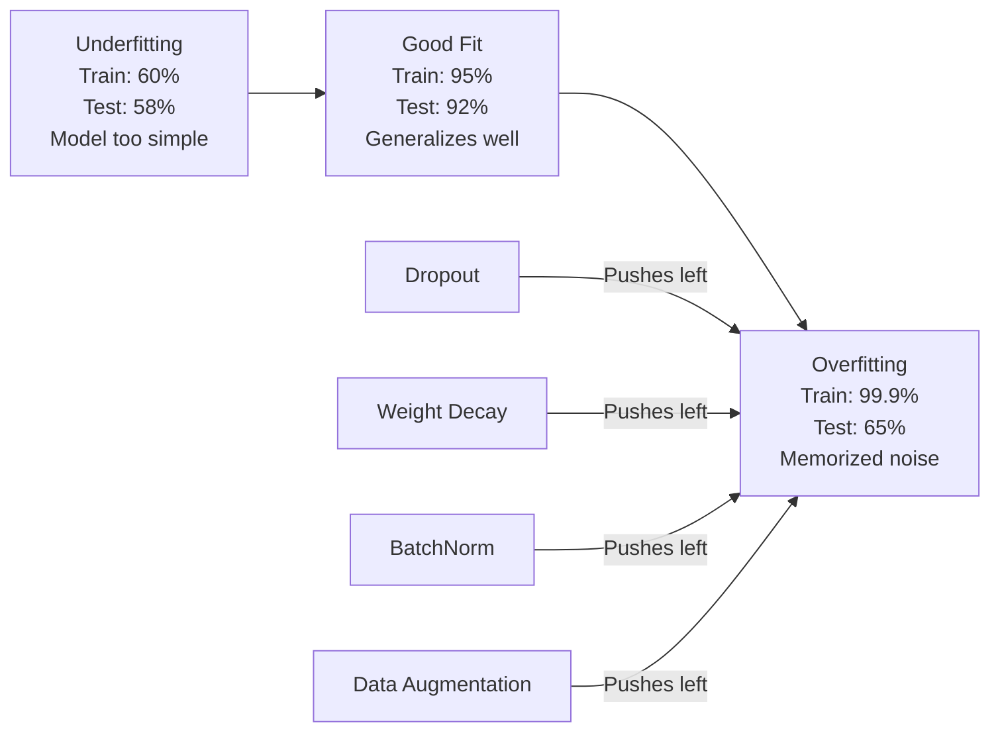
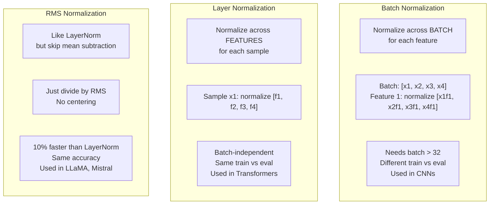
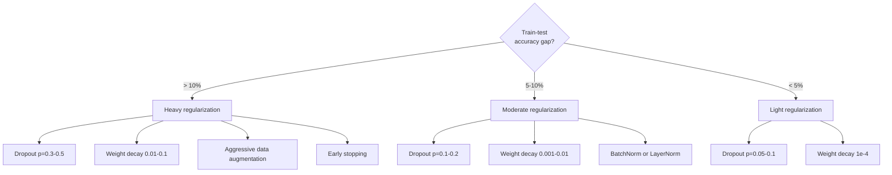

# Regularyzacja

> Twój model osiąga 99% na danych treningowych i 60% na danych testowych. Zamiast się nauczyć, zapamiętał. Regularyzacja to podatek, który nakładasz na złożoność, aby wymusić generalizację.

**Typ:** Build
**Języki:** Python
**Wymagania wstępne:** Lekcja 03.06 (Optymalizatory)
**Czas:** ~75 minut

## Cele nauki

- Zaimplementuj od podstaw dropout z odwróconym skalowaniem, regularyzację wag L2 (weight decay), batch normalization, layer normalization oraz RMSNorm
- Zmierz różnicę dokładności między danymi treningowymi i testowymi oraz zdiagnozuj przeuczenie za pomocą eksperymentów z regularyzacją
- Wyjaśnij, czemu transformery używają LayerNorm zamiast BatchNorm i czemu współczesne LLM-y preferują RMSNorm
- Zastosuj właściwą kombinację technik regularyzacji w zależności od stopnia przeuczenia

## Problem

Sieć neuronowa z wystarczającą liczbą parametrów może zapamiętać każdy zbiór danych. To nie jest hipoteza -- Zhang i in. (2017) udowodnili to, trenując standardowe sieci na ImageNet z losowymi etykietami. Sieci osiągnęły bliską zeru stratę treningową na całkowicie losowych przypisaniach etykiet. Zapamiętały milion losowych par wejście-wyjście, w których nie było żadnego wzorca do nauczenia. Strata treningowa była idealna. Dokładność na danych testowych wynosiła zero.

To jest problem przeuczenia (overfitting) i pogłębia się on, gdy modele stają się większe. GPT-3 ma 175 miliardów parametrów. Zbiór treningowy zawiera około 500 miliardów tokenów. Z taką liczbą parametrów model ma wystarczającą pojemność, by zapamiętać znaczne fragmenty danych treningowych słowo w słowo. Bez regularyzacji model po prostu odtwarzałby przykłady treningowe, zamiast uczyć się generalizowalnych wzorców.

Różnica między wydajnością na danych treningowych a wydajnością na danych testowych to tzw. generalization gap (różnica generalizacji). Każda technika w tej lekcji atakuje tę różnicę z innej strony. Dropout zmusza sieć, by nie polegała na jednym konkretnym neuronie. Weight decay zapobiega temu, by jakakolwiek waga rosła zbyt duża. Batch normalization wygładza krajobraz funkcji straty, dzięki czemu optymalizator znajduje płaskie, bardziej generalizowalne minima. Layer normalization robi to samo, ale działa tam, gdzie batch normalization zawodzi (małe batche, sekwencje o zmiennej długości). RMSNorm robi to 10% szybciej, pomijając obliczanie średniej. Każda z tych technik jest prosta. Razem stanowią różnicę między modelem, który zapamiętuje, a modelem, który generalizuje.

## Koncepcja

### Spektrum przeuczenia

Każdy model znajduje się gdzieś na spektrum od niedouczenia (underfitting -- model jest zbyt prosty, by uchwycić wzorzec) do przeuczenia (overfitting -- model jest tak złożony, że uchwytuje szum). Optymalny punkt leży pomiędzy nimi, a regularyzacja przesuwa modele w jego stronę od strony przeuczenia.



### Dropout

Najprostsza technika regularyzacji o najbardziej elegantnej interpretacji. W trakcie treningu losowo zerujemy wyjście każdego neuronu z prawdopodobieństwem p.

```
output = activation(z) * mask    where mask[i] ~ Bernoulli(1 - p)
```

Przy p = 0.5 połowa neuronów jest zerowana w każdym przebiegu w przód. Sieć musi nauczyć się nadmiarowych reprezentacji, ponieważ nie może przewidzieć, które neurony będą dostępne. Zapobiega to koadaptacji -- sytuacji, w której neurony uczą się polegać na obecności konkretnych innych neuronów.

Interpretacja zespołowa (ensemble): sieć z N neuronami i dropoutem tworzy 2^N możliwych podsieci (każda kombinacja włączonych/wyłączonych neuronów). Trenowanie z dropoutem w przybliżeniu trenuje wszystkie 2^N podsieci jednocześnie, każdą na innych mini-batchach. W czasie testu używasz wszystkich neuronów (bez dropoutu) i skalujesz wyjścia przez (1 - p), aby odpowiadały wartości oczekiwanej podczas treningu. Jest to równoważne uśrednianiu predykcji 2^N podsieci -- gigantyczny zespół (ensemble) z jednego modelu.

W praktyce skalowanie jest stosowane podczas treningu, a nie podczas testu (odwrócony dropout, inverted dropout):

```
During training:  output = activation(z) * mask / (1 - p)
During testing:   output = activation(z)   (no change needed)
```

Jest to czystsze rozwiązanie, ponieważ kod testowy nie musi w ogóle wiedzieć o istnieniu dropoutu.

Domyślne wartości: p = 0.1 dla transformerów, p = 0.5 dla MLP, p = 0.2-0.3 dla CNN. Wyższy dropout = silniejsza regularyzacja = większe ryzyko niedouczenia.

### Weight Decay (regularyzacja L2)

Dodajemy kwadrat wielkości wszystkich wag do funkcji straty:

```
total_loss = task_loss + (lambda / 2) * sum(w_i^2)
```

Gradient członu regularyzacyjnego to lambda * w. Oznacza to, że w każdym kroku każda waga jest zmniejszana w kierunku zera o część proporcjonalną do jej wielkości. Duże wagi są karane bardziej. Model jest popychany w stronę rozwiązań, w których żadna pojedyncza waga nie dominuje.

Czemu to pomaga w generalizacji: przeuczone modele mają tendencję do posiadania dużych wag, które wzmacniają szum w danych treningowych. Weight decay utrzymuje wagi małe, co ogranicza efektywną pojemność modelu i zmusza go do polegania na solidnych, generalizowalnych cechach, a nie na zapamiętanych dziwactwach (quirks).

Hiperparametr lambda kontroluje siłę regularyzacji. Typowe wartości:

- 0.01 dla AdamW na transformerach
- 1e-4 dla SGD na CNN
- 0.1 dla silnie przeuczonych modeli

Jak omówiono w lekcji 06: weight decay i regularyzacja L2 są równoważne w SGD, ale nie w Adamie. Zawsze używaj AdamW (decoupled weight decay) podczas treningu z Adamem.

### Batch Normalization

Normalizuje wyjście każdej warstwy w ramach mini-batcha, przed przekazaniem go do następnej warstwy.

Dla mini-batcha aktywacji w pewnej warstwie:

```
mu = (1/B) * sum(x_i)           (batch mean)
sigma^2 = (1/B) * sum((x_i - mu)^2)   (batch variance)
x_hat = (x_i - mu) / sqrt(sigma^2 + eps)   (normalize)
y = gamma * x_hat + beta        (scale and shift)
```

Gamma i beta to parametry uczone, które pozwalają sieci odwrócić normalizację, jeśli jest to dla niej optymalne. Bez nich wymuszałbyś, by wyjście każdej warstwy miało zerową średnią i wariancję jednostkową, co nie musi być tym, czego sieć potrzebuje.

**Podział na trening i wnioskowanie:** Podczas treningu mu i sigma pochodzą z aktualnego mini-batcha. Podczas wnioskowania używasz uśrednionych wartości akumulowanych w trakcie treningu (wykładnicza średnia ruchoma z momentum = 0.1, czyli 90% wartości starych + 10% nowych).

Wciąż dyskutuje się, czemu BatchNorm działa. Oryginalna praca twierdziła, że redukuje on "internal covariate shift" (zmianę rozkładu wejść warstwy w wyniku aktualizacji wcześniejszych warstw). Santurkar i in. (2018) wykazali, że to wyjaśnienie jest błędne. Prawdziwy powód: BatchNorm wygładza krajobraz funkcji straty. Gradienty są bardziej przewidywalne, stałe Lipschitza są mniejsze, a optymalizator może bezpiecznie wykonywać większe kroki. Dlatego BatchNorm pozwala na używanie wyższych learning rate i szybszą zbieżność.

BatchNorm ma fundamentalne ograniczenie: zależy od statystyk batcha. Przy rozmiarze batcha 1 średnia i wariancja są bez znaczenia. Przy małych batchach (< 32) statystyki są zaszumione i pogarszają wydajność. Ma to znaczenie dla zadań takich jak detekcja obiektów (gdzie pamięć ogranicza rozmiar batcha) i modelowanie języka (gdzie długości sekwencji są różne).

### Layer Normalization

Normalizuje cechy (features) zamiast wymiaru batcha. Dla pojedynczej próbki:

```
mu = (1/D) * sum(x_j)           (feature mean)
sigma^2 = (1/D) * sum((x_j - mu)^2)   (feature variance)
x_hat = (x_j - mu) / sqrt(sigma^2 + eps)
y = gamma * x_hat + beta
```

D to wymiar cech (feature dimension). Każda próbka jest normalizowana niezależnie -- brak zależności od rozmiaru batcha. To właśnie dlatego transformery używają LayerNorm zamiast BatchNorm. Sekwencje mają zmienne długości, rozmiary batchy są często małe (lub równe 1 podczas generacji), a obliczenia są identyczne podczas treningu i wnioskowania.

LayerNorm w transformerach jest stosowany po każdym bloku self-attention i każdym bloku feed-forward (Post-LN) albo przed nimi (Pre-LN, które jest bardziej stabilne podczas treningu).

### RMSNorm

LayerNorm bez odejmowania średniej. Zaproponowany przez Zhang & Sennrich (2019).

```
rms = sqrt((1/D) * sum(x_j^2))
y = gamma * x / rms
```

I to wszystko. Brak obliczania średniej, brak parametru beta. Obserwacja: ponowne centrowanie (odejmowanie średniej) w LayerNorm wnosi bardzo mało do wydajności modelu, ale kosztuje obliczeniowo. Usunięcie go daje tę samą dokładność przy około 10% mniejszym narzucie (overhead).

LLaMA, LLaMA 2, LLaMA 3, Mistral i większość współczesnych LLM-ów używa RMSNorm zamiast LayerNorm. Przy skali miliardów parametrów i bilionów tokenów te 10% oszczędności mają duże znaczenie.

### Porównanie metod normalizacji



### Augmentacja danych jako regularyzacja

Nie jest to modyfikacja modelu, lecz modyfikacja danych. Transformujemy wejścia treningowe, zachowując etykiety:

- Obrazy: losowe przycinanie (crop), odbicie (flip), rotacja, zmiana kolorów (color jitter), cutout
- Tekst: zamiana synonimów, tłumaczenie zwrotne (back-translation), losowe usuwanie
- Audio: rozciąganie czasu, zmiana wysokości tonu, dodawanie szumu

Efekt jest identyczny jak przy regularyzacji: zwiększa efektywny rozmiar zbioru treningowego, co utrudnia modelowi zapamiętanie konkretnych przykładów. Model, który widzi każdy obraz tylko raz w jego oryginalnej formie, może go zapamiętać. Model, który widzi 50 zaugmentowanych wersji każdego obrazu, jest zmuszony do nauczenia się niezmiennej struktury.

### Early Stopping (wczesne zatrzymanie)

Najprostszy regularizator: zatrzymaj trening, gdy strata walidacyjna zaczyna wzrastać. W tym momencie model jeszcze się nie przeuczył. W praktyce śledzisz stratę walidacyjną co epokę, zapisujesz najlepszy model i kontynuujesz trening w ramach okna "patience" (typowo 5-20 epok). Jeśli strata walidacyjna nie poprawi się w oknie patience, zatrzymujesz trening i wczytujesz najlepszy zapisany model.

### Kiedy co zastosować



## Zbuduj to

### Krok 1: Dropout (tryb treningowy i ewaluacyjny)

```python
import random
import math


class Dropout:
    def __init__(self, p=0.5):
        self.p = p
        self.training = True
        self.mask = None

    def forward(self, x):
        if not self.training:
            return list(x)
        self.mask = []
        output = []
        for val in x:
            if random.random() < self.p:
                self.mask.append(0)
                output.append(0.0)
            else:
                self.mask.append(1)
                output.append(val / (1 - self.p))
        return output

    def backward(self, grad_output):
        grads = []
        for g, m in zip(grad_output, self.mask):
            if m == 0:
                grads.append(0.0)
            else:
                grads.append(g / (1 - self.p))
        return grads
```

### Krok 2: Weight decay L2

```python
def l2_regularization(weights, lambda_reg):
    penalty = 0.0
    for w in weights:
        penalty += w * w
    return lambda_reg * 0.5 * penalty

def l2_gradient(weights, lambda_reg):
    return [lambda_reg * w for w in weights]
```

### Krok 3: Batch Normalization

```python
class BatchNorm:
    def __init__(self, num_features, momentum=0.1, eps=1e-5):
        self.gamma = [1.0] * num_features
        self.beta = [0.0] * num_features
        self.eps = eps
        self.momentum = momentum
        self.running_mean = [0.0] * num_features
        self.running_var = [1.0] * num_features
        self.training = True
        self.num_features = num_features

    def forward(self, batch):
        batch_size = len(batch)
        if self.training:
            mean = [0.0] * self.num_features
            for sample in batch:
                for j in range(self.num_features):
                    mean[j] += sample[j]
            mean = [m / batch_size for m in mean]

            var = [0.0] * self.num_features
            for sample in batch:
                for j in range(self.num_features):
                    var[j] += (sample[j] - mean[j]) ** 2
            var = [v / batch_size for v in var]

            for j in range(self.num_features):
                self.running_mean[j] = (1 - self.momentum) * self.running_mean[j] + self.momentum * mean[j]
                self.running_var[j] = (1 - self.momentum) * self.running_var[j] + self.momentum * var[j]
        else:
            mean = list(self.running_mean)
            var = list(self.running_var)

        self.x_hat = []
        output = []
        for sample in batch:
            normalized = []
            out_sample = []
            for j in range(self.num_features):
                x_h = (sample[j] - mean[j]) / math.sqrt(var[j] + self.eps)
                normalized.append(x_h)
                out_sample.append(self.gamma[j] * x_h + self.beta[j])
            self.x_hat.append(normalized)
            output.append(out_sample)
        return output
```

### Krok 4: Layer Normalization

```python
class LayerNorm:
    def __init__(self, num_features, eps=1e-5):
        self.gamma = [1.0] * num_features
        self.beta = [0.0] * num_features
        self.eps = eps
        self.num_features = num_features

    def forward(self, x):
        mean = sum(x) / len(x)
        var = sum((xi - mean) ** 2 for xi in x) / len(x)

        self.x_hat = []
        output = []
        for j in range(self.num_features):
            x_h = (x[j] - mean) / math.sqrt(var + self.eps)
            self.x_hat.append(x_h)
            output.append(self.gamma[j] * x_h + self.beta[j])
        return output
```

### Krok 5: RMSNorm

```python
class RMSNorm:
    def __init__(self, num_features, eps=1e-6):
        self.gamma = [1.0] * num_features
        self.eps = eps
        self.num_features = num_features

    def forward(self, x):
        rms = math.sqrt(sum(xi * xi for xi in x) / len(x) + self.eps)
        output = []
        for j in range(self.num_features):
            output.append(self.gamma[j] * x[j] / rms)
        return output
```

### Krok 6: Trening z regularyzacją i bez niej

```python
def sigmoid(x):
    x = max(-500, min(500, x))
    return 1.0 / (1.0 + math.exp(-x))


def make_circle_data(n=200, seed=42):
    random.seed(seed)
    data = []
    for _ in range(n):
        x = random.uniform(-2, 2)
        y = random.uniform(-2, 2)
        label = 1.0 if x * x + y * y < 1.5 else 0.0
        data.append(([x, y], label))
    return data


class RegularizedNetwork:
    def __init__(self, hidden_size=16, lr=0.05, dropout_p=0.0, weight_decay=0.0):
        random.seed(0)
        self.hidden_size = hidden_size
        self.lr = lr
        self.dropout_p = dropout_p
        self.weight_decay = weight_decay
        self.dropout = Dropout(p=dropout_p) if dropout_p > 0 else None

        self.w1 = [[random.gauss(0, 0.5) for _ in range(2)] for _ in range(hidden_size)]
        self.b1 = [0.0] * hidden_size
        self.w2 = [random.gauss(0, 0.5) for _ in range(hidden_size)]
        self.b2 = 0.0

    def forward(self, x, training=True):
        self.x = x
        self.z1 = []
        self.h = []
        for i in range(self.hidden_size):
            z = self.w1[i][0] * x[0] + self.w1[i][1] * x[1] + self.b1[i]
            self.z1.append(z)
            self.h.append(max(0.0, z))

        if self.dropout and training:
            self.dropout.training = True
            self.h = self.dropout.forward(self.h)
        elif self.dropout:
            self.dropout.training = False
            self.h = self.dropout.forward(self.h)

        self.z2 = sum(self.w2[i] * self.h[i] for i in range(self.hidden_size)) + self.b2
        self.out = sigmoid(self.z2)
        return self.out

    def backward(self, target):
        eps = 1e-15
        p = max(eps, min(1 - eps, self.out))
        d_loss = -(target / p) + (1 - target) / (1 - p)
        d_sigmoid = self.out * (1 - self.out)
        d_out = d_loss * d_sigmoid

        for i in range(self.hidden_size):
            d_relu = 1.0 if self.z1[i] > 0 else 0.0
            d_h = d_out * self.w2[i] * d_relu
            self.w2[i] -= self.lr * (d_out * self.h[i] + self.weight_decay * self.w2[i])
            for j in range(2):
                self.w1[i][j] -= self.lr * (d_h * self.x[j] + self.weight_decay * self.w1[i][j])
            self.b1[i] -= self.lr * d_h
        self.b2 -= self.lr * d_out

    def evaluate(self, data):
        correct = 0
        total_loss = 0.0
        for x, y in data:
            pred = self.forward(x, training=False)
            eps = 1e-15
            p = max(eps, min(1 - eps, pred))
            total_loss += -(y * math.log(p) + (1 - y) * math.log(1 - p))
            if (pred >= 0.5) == (y >= 0.5):
                correct += 1
        return total_loss / len(data), correct / len(data) * 100

    def train_model(self, train_data, test_data, epochs=300):
        history = []
        for epoch in range(epochs):
            total_loss = 0.0
            correct = 0
            for x, y in train_data:
                pred = self.forward(x, training=True)
                self.backward(y)
                eps = 1e-15
                p = max(eps, min(1 - eps, pred))
                total_loss += -(y * math.log(p) + (1 - y) * math.log(1 - p))
                if (pred >= 0.5) == (y >= 0.5):
                    correct += 1
            train_loss = total_loss / len(train_data)
            train_acc = correct / len(train_data) * 100
            test_loss, test_acc = self.evaluate(test_data)
            history.append((train_loss, train_acc, test_loss, test_acc))
            if epoch % 75 == 0 or epoch == epochs - 1:
                gap = train_acc - test_acc
                print(f"    Epoch {epoch:3d}: train_acc={train_acc:.1f}%, test_acc={test_acc:.1f}%, gap={gap:.1f}%")
        return history
```

## Zastosuj to

PyTorch udostępnia wszystkie metody normalizacji i regularyzacji jako moduły:

```python
import torch
import torch.nn as nn

model = nn.Sequential(
    nn.Linear(784, 256),
    nn.BatchNorm1d(256),
    nn.ReLU(),
    nn.Dropout(0.3),
    nn.Linear(256, 128),
    nn.BatchNorm1d(128),
    nn.ReLU(),
    nn.Dropout(0.3),
    nn.Linear(128, 10),
)

model.train()
out_train = model(torch.randn(32, 784))

model.eval()
out_test = model(torch.randn(1, 784))
```

Przełącznik `model.train()` / `model.eval()` jest kluczowy. Włącza/wyłącza dropout i informuje BatchNorm, czy ma używać statystyk batcha, czy statystyk uśrednionych (running statistics). Zapomnienie o `model.eval()` przed wnioskowaniem to jeden z najczęstszych błędów w deep learningu. Dokładność na danych testowych będzie się losowo wahać, ponieważ dropout wciąż jest aktywny, a BatchNorm korzysta ze statystyk mini-batcha.

Dla transformerów wzorzec jest inny:

```python
class TransformerBlock(nn.Module):
    def __init__(self, d_model=512, nhead=8, dropout=0.1):
        super().__init__()
        self.attention = nn.MultiheadAttention(d_model, nhead, dropout=dropout)
        self.norm1 = nn.LayerNorm(d_model)
        self.ff = nn.Sequential(
            nn.Linear(d_model, d_model * 4),
            nn.GELU(),
            nn.Linear(d_model * 4, d_model),
            nn.Dropout(dropout),
        )
        self.norm2 = nn.LayerNorm(d_model)
        self.dropout = nn.Dropout(dropout)

    def forward(self, x):
        attended, _ = self.attention(x, x, x)
        x = self.norm1(x + self.dropout(attended))
        x = self.norm2(x + self.ff(x))
        return x
```

LayerNorm, nie BatchNorm. Dropout p=0.1, nie p=0.5. To są domyślne ustawienia dla transformerów.

## Ship It

Ta lekcja tworzy:
- `outputs/prompt-regularization-advisor.md` -- prompt, który diagnozuje przeuczenie i rekomenduje właściwą strategię regularyzacji

## Ćwiczenia

1. Zaimplementuj spatial dropout dla danych 2D: zamiast usuwać pojedyncze neurony, usuwaj całe kanały cech. Symuluj to, traktując grupy kolejnych cech jako kanały i usuwając całe grupy. Porównaj różnicę train-test ze standardowym dropoutem na zbiorze danych "circle" z hidden_size=32.

2. Zaimplementuj label smoothing z lekcji 05 w połączeniu z dropoutem z tej lekcji. Wytrenuj cztery konfiguracje: bez żadnego z nich, tylko dropout, tylko label smoothing, oba razem. Zmierz końcową różnicę dokładności train-test dla każdej z nich. Która kombinacja daje najmniejszą różnicę?

3. Dodaj warstwę BatchNorm między warstwą skrytą a funkcją aktywacji w swojej sieci dla zbioru danych "circle". Wytrenuj z BatchNorm i bez niego przy learning rate 0.01, 0.05 i 0.1. BatchNorm powinien umożliwić stabilny trening przy wyższych learning rate, przy których sieć bazowa się rozbiega.

4. Zaimplementuj early stopping: śledź stratę testową co epokę, zapisuj najlepsze wagi i zatrzymaj trening, jeśli strata testowa nie poprawiła się przez 20 epok. Wytrenuj zregularyzowaną sieć przez 1000 epok. Podaj, w której epoce była najlepsza dokładność testowa i ile epok obliczeń zaoszczędziłeś.

5. Porównaj LayerNorm z RMSNorm na sieci 4-warstwowej (nie tylko 2-warstwowej). Zainicjalizuj obie tymi samymi wagami. Wytrenuj przez 200 epok i porównaj końcową dokładność, szybkość treningu (czas na epokę) oraz wielkości gradientów w pierwszej warstwie. Zweryfikuj, że RMSNorm jest szybszy przy tej samej dokładności.

## Kluczowe terminy

| Termin | Co się mówi | Co to faktycznie oznacza |
|------|----------------|----------------------|
| Overfitting (przeuczenie) | "Model zapamiętał dane" | Sytuacja, gdy wydajność modelu na danych treningowych znacznie przewyższa wydajność na danych testowych, co wskazuje, że model nauczył się szumu, a nie sygnału |
| Regularization (regularyzacja) | "Zapobieganie przeuczeniu" | Każda technika, która ogranicza złożoność modelu w celu poprawy generalizacji: dropout, weight decay, normalizacja, augmentacja |
| Dropout | "Losowe usuwanie neuronów" | Zerowanie losowych neuronów podczas treningu z prawdopodobieństwem p, co wymusza nadmiarowe reprezentacje; równoważne treningowi zespołu (ensemble) |
| Weight decay | "Kara L2" | Zmniejszanie wszystkich wag w stronę zera poprzez odjęcie lambda * w w każdym kroku; karze złożoność poprzez wielkość wag |
| Batch normalization | "Normalizacja na poziomie batcha" | Normalizacja wyjść warstwy w wymiarze batcha za pomocą statystyk batcha podczas treningu i uśrednionych statystyk podczas wnioskowania |
| Layer normalization | "Normalizacja na poziomie próbki" | Normalizacja w wymiarze cech dla każdej próbki; niezależna od batcha, używana w transformerach, gdzie rozmiar batcha jest zmienny |
| RMSNorm | "LayerNorm bez średniej" | Normalizacja przez pierwiastek ze średniej kwadratów (root mean square); pomija odejmowanie średniej z LayerNorm, co daje 10% przyspieszenie przy tej samej dokładności |
| Early stopping | "Zatrzymanie przed przeuczeniem" | Przerwanie treningu, gdy strata walidacyjna przestaje się poprawiać; najprostszy regularizator, często stosowany razem z innymi |
| Data augmentation (augmentacja danych) | "Więcej danych z mniejszej liczby danych" | Transformowanie danych wejściowych treningu (odbicie, przycinanie, szum) w celu zwiększenia efektywnego rozmiaru zbioru danych i wymuszenia uczenia się niezmienników |
| Generalization gap (różnica generalizacji) | "Podział train-test" | Różnica między wydajnością na danych treningowych i testowych; regularyzacja ma na celu zminimalizowanie tej różnicy |

## Dalsze materiały

- Srivastava i in., "Dropout: A Simple Way to Prevent Neural Networks from Overfitting" (2014) -- oryginalna praca o dropoucie z interpretacją zespołową (ensemble) i obszernymi eksperymentami
- Ioffe & Szegedy, "Batch Normalization: Accelerating Deep Network Training by Reducing Internal Covariate Shift" (2015) -- wprowadziła BatchNorm i procedurę jego treningu, jedna z najczęściej cytowanych prac z zakresu deep learningu
- Zhang & Sennrich, "Root Mean Square Layer Normalization" (2019) -- wykazała, że RMSNorm osiąga dokładność LayerNorm przy mniejszym koszcie obliczeniowym; przyjęta przez LLaMA i Mistral
- Zhang i in., "Understanding Deep Learning Requires Rethinking Generalization" (2017) -- przełomowa praca pokazująca, że sieci neuronowe mogą zapamiętywać losowe etykiety, co podważa tradycyjne poglądy na generalizację
