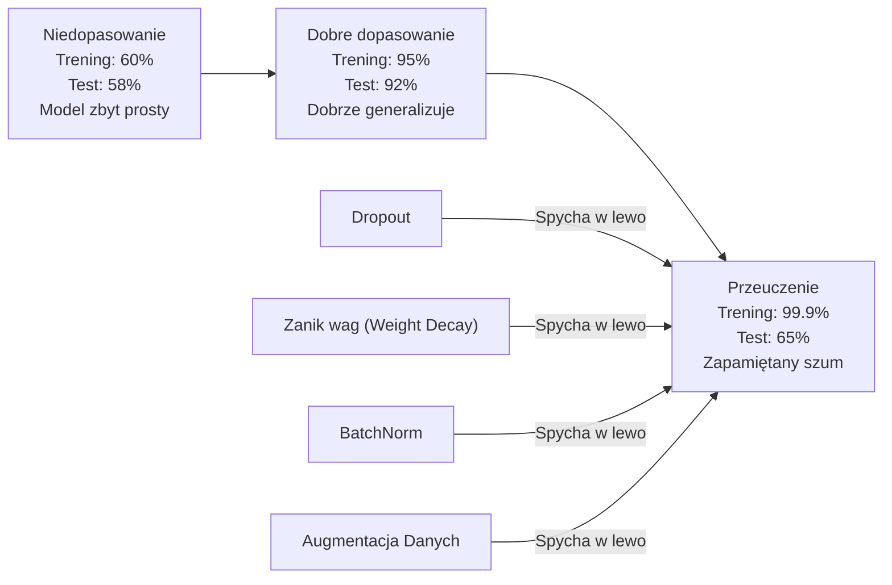
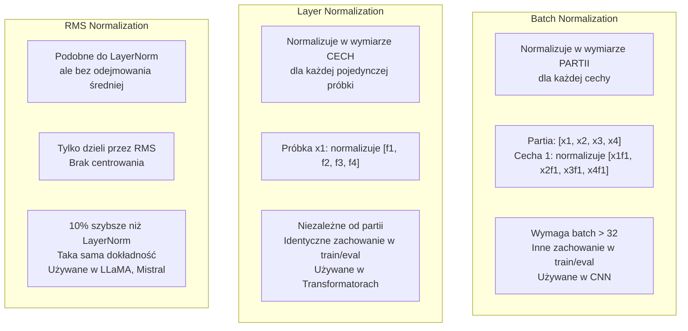
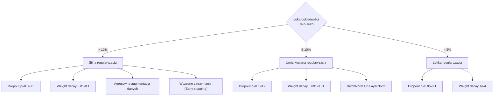

# Regularyzacja

> Twój model uzyskuje 99% na danych treningowych i 60% na danych testowych. Zamiast się uczyć, model zapamiętywał. Regularyzacja to "podatek" nakładany na złożoność, aby wymusić generalizację.

**Typ:** Kompilacja
**Języki:** Python
**Wymagania wstępne:** Lekcja 03.06 (Optymalizatory)
**Czas:** ~75 minut

## Cele nauczania

- Zaimplementuj od zera odwrócony dropout (inverted dropout), zanik wag L2 (weight decay), Batch Normalization, Layer Normalization oraz RMSNorm.
- Zmierz lukę pomiędzy dokładnością treningową a testową (train-test gap) i diagnozuj przeuczenie (overfitting) za pomocą eksperymentów z regularyzacją.
- Wyjaśnij, dlaczego transformatory używają LayerNorm zamiast BatchNorm i dlaczego w nowoczesnych LLM preferowany jest RMSNorm.
- Zastosuj odpowiednią kombinację technik regularyzacyjnych w oparciu o stopień przeuczenia modelu.

## Problem

Sieć neuronowa o wystarczającej liczbie parametrów jest w stanie zapamiętać dowolny zbiór danych. To nie jest tylko hipoteza – Zhang i in. (2017) udowodnili to, trenując standardowe sieci na zbiorze ImageNet z losowo przypisanymi etykietami. Sieci osiągnęły niemal zerową stratę treningową pomimo całkowicie losowych przypisań etykiet. Zapamiętały milion losowych par wejście-wyjście, nie mając żadnego rzeczywistego wzorca do nauczenia się. Strata treningowa była doskonała. Dokładność na zbiorze testowym wynosiła zero.

Jest to problem przeuczenia (overfittingu), który nasila się w miarę powiększania się modeli. GPT-3 ma 175 miliardów parametrów. Zestaw treningowy zawierał około 500 miliardów tokenów. Przy tak ogromnej liczbie parametrów model ma wystarczającą pojemność (capacity), aby dosłownie zapamiętać znaczące fragmenty danych treningowych. Bez regularyzacji, zamiast uczyć się uniwersalnych wzorców, które można by uogólnić na nowe dane, model po prostu powtarzałby przykłady zapamiętane ze szkolenia.

Luka pomiędzy wynikami na zbiorze treningowym a wynikami testowymi to miara przeuczenia. Każda technika opisana w tej lekcji atakuje tę lukę pod innym kątem. Dropout sprawia, że sieć nie może zbytnio polegać na żadnym pojedynczym neuronie. Zanik wag (weight decay) zapobiega nadmiernemu wzrostowi wartości pojedynczej wagi. Normalizacja wsadowa (Batch Normalization) wygładza krajobraz funkcji straty, dzięki czemu optymalizator łatwiej znajduje płaskie, lepiej generalizujące minima. Normalizacja warstwowa (Layer Normalization) robi to samo, ale działa tam, gdzie zawodzi normalizacja wsadowa (małe partie, sekwencje o zmiennej długości). Z kolei RMSNorm robi to o 10% szybciej, pomijając obliczanie średniej. Każda z tych technik w izolacji jest prosta. Razem stanowią różnicę między modelem, który tylko zapamiętuje, a modelem, który uogólnia.

## Koncepcja

### Spektrum dopasowania

Każdy model mieści się gdzieś w spektrum od niedopasowania (underfitting - model zbyt prosty, aby uchwycić wzorzec) do przeuczenia (overfitting - model tak złożony, że wychwytuje i zapamiętuje szum). Punkt optymalny znajduje się pośrodku, a regularyzacja spycha modele w jego stronę ze strony przeuczenia.



### Dropout (Porzucanie)

To najprostsza technika regularyzacyjna z najbardziej elegancką interpretacją. Podczas treningu losowo wyzeruj wyjście każdego neuronu z prawdopodobieństwem `p`.

```python
output = activation(z) * mask    # gdzie mask[i] ~ Bernoulli(1 - p)
```

Przy `p = 0,5`, połowa neuronów jest zerowana podczas każdego przejścia w przód (forward pass). Sieć zmuszona jest do uczenia się redundantnych reprezentacji, ponieważ nie może przewidzieć, które neurony będą dostępne. Zapobiega to koadaptacji – sytuacji, w której neurony uczą się zbytnio polegać na obecności konkretnych, innych neuronów.

Interpretacja zespołowa (ensemble): sieć z `N` neuronami i warstwą dropout w praktyce tworzy `2^N` możliwych podsieci (każda to inna kombinacja włączonych lub wyłączonych neuronów). Trening z dropoutem trenuje w przybliżeniu wszystkie te `2^N` podsieci jednocześnie, każdą w innej mini-partii. Podczas inferencji (testu) używasz wszystkich neuronów (bez porzucania) i skalujesz ich wyjścia o `(1 - p)`, aby dopasować wartość oczekiwaną ze szkolenia. Jest to równoznaczne z uśrednieniem przewidywań dla całego zespołu `2^N` podsieci – ogromnego zestawu, a wszystko z jednego modelu.

W praktyce skalowanie stosuje się podczas treningu, a nie testowania (jest to tzw. odwrócony dropout - inverted dropout):

```python
Podczas treningu:  output = activation(z) * mask / (1 - p)
Podczas testowania:   output = activation(z)   (nie wymaga zmian)
```

Jest to znacznie czystsze rozwiązanie, ponieważ kod obsługujący fazę inferencji nie musi w ogóle wiedzieć o istnieniu warstwy dropout.

Domyślne wartości: `p = 0,1` dla transformatorów, `p = 0,5` dla sieci MLP, `p = 0,2-0,3` dla sieci CNN. Większe prawdopodobieństwo porzucenia = silniejsza regularyzacja = większe ryzyko wejścia w stan niedopasowania.

### Zanik wag (Regularyzacja L2 / Weight Decay)

Dodaj sumę kwadratów wielkości wszystkich wag do funkcji straty:

```python
total_loss = task_loss + (lambda / 2) * sum(w_i^2)
```

Gradient członu regularyzacyjnego wynosi `lambda * w`. Oznacza to, że w każdym kroku optymalizacji każda waga jest sztucznie zmniejszana w stronę zera o ułamek proporcjonalny do jej własnej wielkości. Duże wagi są karane bardziej. Model jest popychany w stronę rozwiązań, w których nie dominuje żadna pojedyncza waga.

Dlaczego to pomaga w uogólnianiu? Przeuczone modele mają zazwyczaj nienaturalnie duże wagi, które wzmacniają szum z danych treningowych. Zanik wag zmusza model do utrzymywania niewielkich wartości wag, co ogranicza efektywną pojemność modelu i zmusza go do polegania na solidnych, uniwersalnych cechach, a nie na zapamiętanych szumach i anomaliach.

Hiperparametr `lambda` kontroluje siłę zaniku. Typowe wartości to:

- 0,01 dla AdamW w transformatorach
- 1e-4 dla SGD w CNN
- 0,1 dla modeli bardzo silnie przetrenowanych

Jak omówiono w Lekcji 06: zanik wag i regularyzacja L2 są równoważne w przypadku używania SGD, ale nie są tożsame w Adamie. Podczas treningu z użyciem Adama i zaniku wag, zawsze używaj wariantu AdamW (odseparowany zanik wag - decoupled weight decay).

### Normalizacja wsadowa (Batch Normalization)

Normalizuje aktywacje w warstwie wyliczając statystyki na podstawie danej mini-partii (mini-batch), zanim przekaże je do następnej warstwy.

Dla mini-partii aktywacji na pewnej warstwie:

```python
mu = (1/B) * sum(x_i)           (średnia partii)
sigma^2 = (1/B) * sum((x_i - mu)^2)   (wariancja partii)
x_hat = (x_i - mu) / sqrt(sigma^2 + eps)   (normalizacja)
y = gamma * x_hat + beta        (skalowanie i przesunięcie)
```

`Gamma` i `beta` to parametry, których model może się uczyć, co pozwala sieci nawet całkowicie cofnąć normalizację, jeśli uzna to za optymalne. Bez nich model byłby zmuszony do utrzymywania zerowej średniej i jednostkowej wariancji na wyjściu każdej warstwy, co nie zawsze jest pożądane.

**Różnica między treningiem a wnioskowaniem:** Podczas treningu wartości `mu` i `sigma` pochodzą bezpośrednio z bieżącej mini-partii. Podczas wnioskowania (inferencji) korzystasz ze średnich kroczących zgromadzonych podczas treningu (wykładnicza średnia krocząca z momentum = 0,1, co oznacza 90% starej wartości + 10% nowej).

Dokładne przyczyny skuteczności BatchNorm są nadal przedmiotem debaty. W oryginalnym artykule naukowym stwierdzono, że redukuje ona „wewnętrzne przesunięcie współzmiennej” (rozkład danych wejściowych w warstwach zmienia się wraz z aktualizacją wcześniejszych warstw). Santurkar i in. (2018) wykazali, że to wyjaśnienie jest nie do końca poprawne. Prawdziwy powód tkwi w tym, że BatchNorm sprawia, iż krajobraz straty staje się znacznie gładszy. Gradienty są bardziej przewidywalne, a optymalizator może bezpiecznie wykonywać większe kroki (wyższe learning rates). To dlatego BatchNorm umożliwia szybsze uczenie się i konwergencję.

BatchNorm ma jednak pewne podstawowe ograniczenie: silnie zależy od statystyk partii. W przypadku partii o wielkości 1 (batch_size=1), średnia i wariancja nie mają sensu. W przypadku małych partii (< 32), statystyki są bardzo zaszumione, co pogarsza wydajność. Stanowi to duży problem w przypadku zadań takich jak detekcja obiektów (gdzie duże obrazy ograniczają rozmiar partii w pamięci) i modelowanie języka (gdzie mamy do czynienia z sekwencjami o zmiennej długości).

### Normalizacja warstwowa (Layer Normalization)

Normalizuje wzdłuż wymiaru cech (features), a nie w całej partii. Dla pojedynczej próbki:

```python
mu = (1/D) * sum(x_j)           (średnia cech w próbce)
sigma^2 = (1/D) * sum((x_j - mu)^2)   (wariancja cech w próbce)
x_hat = (x_j - mu) / sqrt(sigma^2 + eps)
y = gamma * x_hat + beta
```

Gdzie `D` jest wymiarem cechy. Każda pojedyncza próbka jest normalizowana całkowicie niezależnie – bez żadnej zależności od innych próbek w partii (batch_size). Właśnie z tego powodu transformatory używają LayerNorm zamiast BatchNorm. Sekwencje mają zmienną długość, rozmiary partii są często bardzo małe (często używa się batch_size równego 1 podczas generowania tekstu), a same obliczenia są identyczne w fazie treningu i inferencji.

W transformatorach LayerNorm aplikuje się po każdym bloku uwag (attention) i bloku feed-forward (tzw. Post-LN) lub przed nimi (tzw. Pre-LN, który jest bardziej stabilny podczas treningu).

### RMSNorm (Root Mean Square Normalization)

To wariant LayerNorm, ale bez odejmowania średniej. Zaproponowany przez Zhanga i Sennricha (2019).

```python
rms = sqrt((1/D) * sum(x_j^2) + eps)
y = gamma * x / rms
```

I to wszystko. Żadnego obliczania średniej, żadnego dodatkowego parametru `beta`. Główna obserwacja: ponowne centrowanie (odejmowanie średniej) w klasycznym LayerNorm ma bardzo znikomy wpływ na ostateczną wydajność modelu, a wymaga dodatkowych obliczeń. Usunięcie tego kroku zapewnia taką samą dokładność przy około 10% mniejszym narzucie obliczeniowym.

Modele z rodziny LLaMA, Mistral i większość nowoczesnych modeli LLM używają RMSNorm zamiast LayerNorm. W skali miliardów parametrów i bilionów trenowanych tokenów takie 10% oszczędności czasu ma gigantyczne znaczenie.

### Porównanie technik normalizacji



### Augmentacja danych jako regularyzacja

To podejście polega na modyfikowaniu danych bez modyfikowania samego modelu. Przekształcasz wejściowe dane treningowe w locie, zachowując przy tym niezmienione etykiety:

- Obrazy: losowe kadrowanie (crop), odwracanie, obracanie, zmiana kolorów (color jitter), wycinanie (cutout).
- Tekst: zamiana synonimów, tłumaczenie wsteczne (back-translation), losowe usuwanie słów.
- Dźwięk: rozciąganie w czasie, zmiana wysokości tonu (pitch shift), wstrzykiwanie szumu.

Efekt końcowy jest identyczny jak w przypadku bezpośredniej regularyzacji: drastycznie zwiększa to efektywny rozmiar zbioru treningowego, znacznie utrudniając modelowi zapamiętanie konkretnych, wyizolowanych przykładów. Model, który widzi każdy obraz w oryginalnej formie tylko raz, może go po prostu zapamiętać. Model, który widzi 50 za każdym razem nieco innych, rozszerzonych wersji każdego obrazu, jest zmuszony nauczyć się niezmiennej i uniwersalnej struktury obiektów.

### Wczesne zatrzymanie (Early Stopping)

To w zasadzie najprostszy z możliwych regularyzatorów: przestań trenować, gdy strata walidacyjna (validation loss) zacznie rosnąć. Jeśli to zrobisz, masz pewność, że model w tym punkcie nie jest jeszcze przetrenowany. W praktyce śledzisz stratę walidacyjną w każdej epoce, zapisujesz najlepszy model i kontynuujesz szkolenie przez pewne okno "cierpliwości" (zwykle 5–20 epok). Jeśli w oknie tym strata na zbiorze walidacyjnym nie ulegnie poprawie, zatrzymujesz trening i przywracasz najlepszy, zapisany punkt kontrolny modelu.

### Kiedy zastosować którą metodę



## Zbuduj to

### Krok 1: Dropout (Tryb treningu i ewaluacji)

```python
import random
import math

class Dropout:
    def __init__(self, p=0.5):
        self.p = p
        self.training = True
        self.mask = None

    def forward(self, x):
        if not self.training:
            return list(x)
        self.mask = []
        output = []
        for val in x:
            if random.random() < self.p:
                self.mask.append(0)
                output.append(0.0)
            else:
                self.mask.append(1)
                # Skalowanie w odwróconym dropoucie
                output.append(val / (1 - self.p))
        return output

    def backward(self, grad_output):
        grads = []
        for g, m in zip(grad_output, self.mask):
            if m == 0:
                grads.append(0.0)
            else:
                grads.append(g / (1 - self.p))
        return grads
```

### Krok 2: Zanik wag L2 (Weight Decay)

```python
def l2_regularization(weights, lambda_reg):
    penalty = 0.0
    for w in weights:
        penalty += w * w
    return lambda_reg * 0.5 * penalty

def l2_gradient(weights, lambda_reg):
    return [lambda_reg * w for w in weights]
```

### Krok 3: Batch Normalization

```python
class BatchNorm:
    def __init__(self, num_features, momentum=0.1, eps=1e-5):
        self.gamma = [1.0] * num_features
        self.beta = [0.0] * num_features
        self.eps = eps
        self.momentum = momentum
        self.running_mean = [0.0] * num_features
        self.running_var = [1.0] * num_features
        self.training = True
        self.num_features = num_features

    def forward(self, batch):
        batch_size = len(batch)
        if self.training:
            mean = [0.0] * self.num_features
            for sample in batch:
                for j in range(self.num_features):
                    mean[j] += sample[j]
            mean = [m / batch_size for m in mean]

            var = [0.0] * self.num_features
            for sample in batch:
                for j in range(self.num_features):
                    var[j] += (sample[j] - mean[j]) ** 2
            var = [v / batch_size for v in var]

            for j in range(self.num_features):
                self.running_mean[j] = (1 - self.momentum) * self.running_mean[j] + self.momentum * mean[j]
                self.running_var[j] = (1 - self.momentum) * self.running_var[j] + self.momentum * var[j]
        else:
            mean = list(self.running_mean)
            var = list(self.running_var)

        self.x_hat = []
        output = []
        for sample in batch:
            normalized = []
            out_sample = []
            for j in range(self.num_features):
                x_h = (sample[j] - mean[j]) / math.sqrt(var[j] + self.eps)
                normalized.append(x_h)
                out_sample.append(self.gamma[j] * x_h + self.beta[j])
            self.x_hat.append(normalized)
            output.append(out_sample)
        return output
```

### Krok 4: Layer Normalization

```python
class LayerNorm:
    def __init__(self, num_features, eps=1e-5):
        self.gamma = [1.0] * num_features
        self.beta = [0.0] * num_features
        self.eps = eps
        self.num_features = num_features

    def forward(self, x):
        mean = sum(x) / len(x)
        var = sum((xi - mean) ** 2 for xi in x) / len(x)

        self.x_hat = []
        output = []
        for j in range(self.num_features):
            x_h = (x[j] - mean) / math.sqrt(var + self.eps)
            self.x_hat.append(x_h)
            output.append(self.gamma[j] * x_h + self.beta[j])
        return output
```

### Krok 5: RMSNorm

```python
class RMSNorm:
    def __init__(self, num_features, eps=1e-6):
        self.gamma = [1.0] * num_features
        self.eps = eps
        self.num_features = num_features

    def forward(self, x):
        rms = math.sqrt(sum(xi * xi for xi in x) / len(x) + self.eps)
        output = []
        for j in range(self.num_features):
            output.append(self.gamma[j] * x[j] / rms)
        return output
```

### Krok 6: Trening z i bez regularyzacji

```python
def sigmoid(x):
    x = max(-500, min(500, x))
    return 1.0 / (1.0 + math.exp(-x))

def make_circle_data(n=200, seed=42):
    random.seed(seed)
    data = []
    for _ in range(n):
        x = random.uniform(-2, 2)
        y = random.uniform(-2, 2)
        label = 1.0 if x * x + y * y < 1.5 else 0.0
        data.append(([x, y], label))
    return data

class RegularizedNetwork:
    def __init__(self, hidden_size=16, lr=0.05, dropout_p=0.0, weight_decay=0.0):
        random.seed(0)
        self.hidden_size = hidden_size
        self.lr = lr
        self.dropout_p = dropout_p
        self.weight_decay = weight_decay
        self.dropout = Dropout(p=dropout_p) if dropout_p > 0 else None

        self.w1 = [[random.gauss(0, 0.5) for _ in range(2)] for _ in range(hidden_size)]
        self.b1 = [0.0] * hidden_size
        self.w2 = [random.gauss(0, 0.5) for _ in range(hidden_size)]
        self.b2 = 0.0

    def forward(self, x, training=True):
        self.x = x
        self.z1 = []
        self.h = []
        for i in range(self.hidden_size):
            z = self.w1[i][0] * x[0] + self.w1[i][1] * x[1] + self.b1[i]
            self.z1.append(z)
            self.h.append(max(0.0, z))

        if self.dropout and training:
            self.dropout.training = True
            self.h = self.dropout.forward(self.h)
        elif self.dropout:
            self.dropout.training = False
            self.h = self.dropout.forward(self.h)

        self.z2 = sum(self.w2[i] * self.h[i] for i in range(self.hidden_size)) + self.b2
        self.out = sigmoid(self.z2)
        return self.out

    def backward(self, target):
        eps = 1e-15
        p = max(eps, min(1 - eps, self.out))
        d_loss = -(target / p) + (1 - target) / (1 - p)
        d_sigmoid = self.out * (1 - self.out)
        d_out = d_loss * d_sigmoid

        for i in range(self.hidden_size):
            d_relu = 1.0 if self.z1[i] > 0 else 0.0
            d_h = d_out * self.w2[i] * d_relu
            # Aplikacja weight decay (zaniku wag)
            self.w2[i] -= self.lr * (d_out * self.h[i] + self.weight_decay * self.w2[i])
            for j in range(2):
                self.w1[i][j] -= self.lr * (d_h * self.x[j] + self.weight_decay * self.w1[i][j])
            self.b1[i] -= self.lr * d_h
        self.b2 -= self.lr * d_out

    def evaluate(self, data):
        correct = 0
        total_loss = 0.0
        for x, y in data:
            pred = self.forward(x, training=False)
            eps = 1e-15
            p = max(eps, min(1 - eps, pred))
            total_loss += -(y * math.log(p) + (1 - y) * math.log(1 - p))
            if (pred >= 0.5) == (y >= 0.5):
                correct += 1
        return total_loss / len(data), correct / len(data) * 100

    def train_model(self, train_data, test_data, epochs=300):
        history = []
        for epoch in range(epochs):
            total_loss = 0.0
            correct = 0
            for x, y in train_data:
                pred = self.forward(x, training=True)
                self.backward(y)
                eps = 1e-15
                p = max(eps, min(1 - eps, pred))
                total_loss += -(y * math.log(p) + (1 - y) * math.log(1 - p))
                if (pred >= 0.5) == (y >= 0.5):
                    correct += 1
            train_loss = total_loss / len(train_data)
            train_acc = correct / len(train_data) * 100
            test_loss, test_acc = self.evaluate(test_data)
            history.append((train_loss, train_acc, test_loss, test_acc))
            if epoch % 75 == 0 or epoch == epochs - 1:
                gap = train_acc - test_acc
                print(f"    Epoka {epoch:3d}: train_acc={train_acc:.1f}%, test_acc={test_acc:.1f}%, luka={gap:.1f}%")
        return history
```

## Użyj tego

PyTorch zapewnia wszystkie omówione tu mechanizmy normalizacji i regularyzacji jako wbudowane moduły:

```python
import torch
import torch.nn as nn

model = nn.Sequential(
    nn.Linear(784, 256),
    nn.BatchNorm1d(256),
    nn.ReLU(),
    nn.Dropout(0.3),
    nn.Linear(256, 128),
    nn.BatchNorm1d(128),
    nn.ReLU(),
    nn.Dropout(0.3),
    nn.Linear(128, 10),
)

# Bardzo ważne podczas treningu
model.train()
out_train = model(torch.randn(32, 784))

# Bardzo ważne przed inferencją!
model.eval()
out_test = model(torch.randn(1, 784))
```

Przełączanie stanów przez `model.train()` / `model.eval()` jest absolutnie kluczowe. Włącza/wyłącza ono mechanizm dropoutu i informuje BatchNorm, czy ma używać statystyk z bieżącej partii, czy wyuczonych średnich kroczących. Zapomnienie wywołania `model.eval()` przed testowaniem/inferencją to jeden z najczęstszych błędów początkujących. Jeśli to pominiesz, wyniki będą losowo fluktuować (dropout jest nadal aktywny), a BatchNorm będzie bez sensu używać statystyk z małej, testowej mini-partii.

Dla transformatorów przyjęto inny wzorzec projektowy:

```python
class TransformerBlock(nn.Module):
    def __init__(self, d_model=512, nhead=8, dropout=0.1):
        super().__init__()
        self.attention = nn.MultiheadAttention(d_model, nhead, dropout=dropout)
        self.norm1 = nn.LayerNorm(d_model)
        self.ff = nn.Sequential(
            nn.Linear(d_model, d_model * 4),
            nn.GELU(),
            nn.Linear(d_model * 4, d_model),
            nn.Dropout(dropout),
        )
        self.norm2 = nn.LayerNorm(d_model)
        self.dropout = nn.Dropout(dropout)

    def forward(self, x):
        attended, _ = self.attention(x, x, x)
        # Pre-LN pattern, stabilniejszy w transformatorach
        x = self.norm1(x + self.dropout(attended))
        x = self.norm2(x + self.ff(x))
        return x
```

Używa się tu LayerNorm, a nie BatchNorm. Typowy dropout wynosi tu p=0,1 (zamiast powszechnego p=0,5 dla MLP). Są to branżowe ustawienia domyślne dla architektur typu transformator.

## Wyślij to

Dzięki tej lekcji powstał:
- `outputs/prompt-regularization-advisor.md` – prompt pomocny w diagnozowaniu problemów z przeuczeniem (overfittingiem) i rekomendowaniu odpowiednich technik regularyzacji.

## Ćwiczenia

1. Zaimplementuj tzw. spatial dropout (porzucanie przestrzenne) dla danych 2D: zamiast wyzerowywać pojedyncze neurony, wyzeruj całe kanały cech. Zasymuluj to zjawisko, traktując grupy kolejnych obiektów jako kanały i wymuszając opuszczanie całych grup naraz. Porównaj lukę pociąg-test (train-test gap) ze standardowym dropoutem na zbiorze z okręgiem przy użyciu `hidden_size=32`.

2. Zaimplementuj wygładzanie etykiet (label smoothing) z lekcji 05 i połącz go z mechanizmem dropout z tej lekcji. Przeprowadź trening dla czterech konfiguracji: brak regularyzacji, tylko dropout, tylko wygładzanie etykiet, obie metody jednocześnie. Zmierz końcową lukę testową (train-test gap) dla każdej z nich. Która konfiguracja skutkuje najmniejszą luką?

3. Dodaj warstwę BatchNorm pomiędzy warstwą ukrytą a funkcją aktywacji w prostej sieci testowanej na zbiorze okręgu. Przeprowadź eksperyment z BatchNorm i bez, stosując przy tym współczynniki uczenia (learning rate): 0,01, 0,05 oraz 0,1. Użycie BatchNorm powinno umożliwić w miarę stabilny trening nawet przy wyższych współczynnikach uczenia tam, gdzie oryginalna, bazowa sieć staje się bardzo niestabilna lub całkowicie rozbieżna.

4. Wprowadź mechanizm wczesnego zatrzymania (early stopping): monitoruj stratę testową (validation loss) w każdej epoce, zachowaj w pamięci wagi najlepszego modelu i przerwij trening, jeśli strata nie spadła przez 20 kolejnych epok. Uruchom silnie regularyzowaną sieć na 1000 epok. Zaraportuj, na której epoce znajdował się najlepszy pod względem precyzji model oraz ile czasu obliczeniowego (epok) udało się dzięki temu oszczędzić.

5. Porównaj działanie LayerNorm i RMSNorm w sieci składającej się z 4 warstw. Skonfiguruj obie sieci w taki sam sposób. Przeprowadź 200 epok treningowych dla każdej sieci i zanotuj w tabeli wyniki dokładności, czas trwania operacji w epoce oraz zmierz wielkość wektorów gradientów w obrębie pierwszej warstwy. Upewnij się, że RMSNorm działa szybciej przy zachowaniu w przybliżeniu tej samej dokładności.

## Kluczowe terminy

| Termin | Co mówią ludzie | Co to właściwie oznacza |
|------|----------------|----------------------|
| Przeuczenie (Overfitting) | „Model zapamiętał dane” | Sytuacja, w której dokładność treningowa drastycznie przewyższa dokładność na zbiorze walidacyjnym; oznacza to, że model nauczył się bezużytecznego szumu, a nie pożądanego sygnału. |
| Regularyzacja | „Zapobieganie przeuczeniu” | Każda modyfikacja, której celem jest ograniczenie złożoności (pojemności) modelu i w rezultacie zwiększenie generalizacji, np. dropout, zanik wag, augmentacja. |
| Dropout | „Losowe wyłączanie neuronów” | Maskowanie i wymuszanie wyzerowania części neuronów (prawdopodobieństwo p) podczas operacji w przód. Metoda ta wymusza tworzenie redundantnych i silnych reprezentacji (odpowiednik trenowania zespołu podsieci). |
| Zanik wag (Weight decay) | „Kara L2 / L2 penalty” | Modyfikacja wymuszająca zmniejszanie wszystkich parametrów modelu. Karze za zbyt duże wagi w każdej epoce poprzez odpowiednie skalowanie wartości wag podczas procesu optymalizacji. |
| Batch Normalization | „BatchNorm” | Normalizowanie cech w oparciu o statystyki mini-partii. Metoda często używana w architekturach CNN; wymaga przełączania trybu na ewaluacyjny. |
| Layer Normalization | „LayerNorm” | Normalizowanie cech danej pojedynczej próbki; proces niezależny od rozmiaru partii i używany często np. w architekturach NLP/Transformatorów. |
| RMSNorm | „LayerNorm bez centrowania” | Odpowiednik LayerNorm, ale nie uwzględniający wyliczania i odejmowania średniej; około 10% wydajniejsza obliczeniowo metoda z identyczną skutecznością działania. Używana w LLaMA i Mistral. |
| Wczesne zatrzymanie (Early stopping) | „Zatrzymaj przed przeuczeniem” | Metoda polegająca na kończeniu treningu w momencie, kiedy jakość wyników ewaluacyjnych (testowych) zaczyna się drastycznie i nieodwracalnie pogarszać. |
| Augmentacja danych | „Generowanie dodatkowych danych” | Działanie poprawiające dokładność i niezawodność, poprzez wstrzykiwanie zmodyfikowanych wariantów znanych już danych. Utrudnia przeuczenie poprzez drastyczny wzrost bazy danych do nauczenia się. |
| Luka generalizacji | „Luka pociąg-test / Train-test gap” | Różnica w mierzonej precyzji działania i przewidywań algorytmu na znanych danych treningowych, w stosunku do niewidzianych wcześniej i niezależnych danych walidacyjnych lub testowych. |

## Dalsza lektura

- Srivastava i in., „Dropout: A Simple Way to Prevent Neural Networks from Overfitting” (2014) – Oryginalny, klasyczny artykuł dotyczący mechanizmu dropout z interpretacją zespołową oraz obszernymi danymi i opisem eksperymentów.
- Ioffe i Szegedy, „Batch Normalization: Accelerating Deep Network Training by Reducing Internal Covariate Shift” (2015) — Autorzy przedstawili w nim koncepcję BatchNorm oraz uargumentowali, dlaczego jest on tak skuteczny (jedna z najczęściej cytowanych publikacji Deep Learning w historii).
- Zhang i Sennrich, „Root Mean Square Layer Normalization” (2019) — Skutecznie wykazali, że zredukowany o odejmowanie średniej RMSNorm doskonale odpowiada parametrom uzyskiwanym na LayerNorm, znacznie redukując koszt obliczeń (zaadaptowane przez twórców LLaMA).
- Zhang i in., „Understanding Deep Learning Requires Rethinking Generalization” (2017) – Przełomowy dokument wykazujący wprost na to, że nawet bardzo proste sieci neuronowe potrafią precyzyjnie zapamiętać całkowicie losowe etykiety (kwestionując dotychczasowe, tradycyjne poglądy naukowe na ogólny model ich generalizacji i zasady ich działania).
