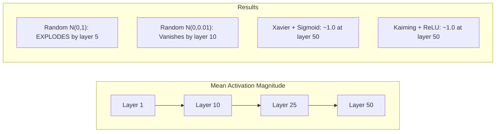

# Inicjalizacja wag i stabilność treningu

> Zainicjalizuj źle i trening nigdy nie zacznie się. Zainicjalizuj dobrze i 50 warstw trenuje się tak płynnie jak 3.

**Typ:** Build
**Języki:** Python
**Wymagania wstępne:** Lekcja 03.04 (Funkcje aktywacji), Lekcja 03.07 (Regularyzacja)
**Czas:** ~90 minut

## Cele nauki

- Zaimplementuj strategie inicjalizacji: zerową, losową, Xavier/Glorot oraz Kaiming/He i zmierz ich wpływ na wielkość aktywacji w 50 warstwach
- Wyprowadź, dlaczego inicjalizacja Xavier używa Var(w) = 2/(fan_in + fan_out), a Kaiming używa Var(w) = 2/fan_in
- Zademonstruj problem symetrii przy inicjalizacji zerowej i wyjaśnij, czemu sama skala losowości nie wystarcza
- Dopasuj właściwą strategię inicjalizacji do funkcji aktywacji: Xavier dla sigmoid/tanh, Kaiming dla ReLU/GELU

## Problem

Zainicjalizuj wszystkie wagi na zero. Nic się nie uczy. Każdy neuron oblicza tę samą funkcję, otrzymuje ten sam gradient i aktualizuje się identycznie. Po 10 000 epok twoja warstwa skryta o 512 neuronach to wciąż 512 kopii tego samego neuronu. Zapłaciłeś za 512 parametrów, a otrzymałeś 1.

Zainicjalizuj je za dużymi wartościami. Aktywacje eksplodują w sieci. W warstwie 10 wartości sięgają 1e15. W warstwie 20 przekraczają zakres reprezentacji do nieskończoności. Gradienty przebywają tę samą trajektorię w odwrotną stronę.

Zainicjalizuj je losowo z rozkładu normalnego standardowego. Działa dla 3 warstw. Przy 50 warstwach sygnał zapada się do zera albo detonuje do nieskończoności, w zależności od tego, czy losowa skala była odrobinę zbyt mała, czy zbyt duża. Granica między „działa” i „nie działa” jest niezwykle wąska.

Inicjalizacja wag to najbardziej niedoceniana decyzja w deep learningu. Architektura dostaje publikacje. Optymalizatory dostają wpisy na blogach. Inicjalizacja dostaje przypis. Ale jeśli ją zepsujesz, nic innego nie ma znaczenia -- twoja sieć jest martwa, zanim trening się zacznie.

## Koncepcja

### Problem symetrii

Każdy neuron w warstwie ma taką samą strukturę: mnoży wejścia przez wagi, dodaje bias, stosuje funkcję aktywacji. Jeśli wszystkie wagi zaczynają od tej samej wartości (zero to ekstremalny przypadek), każdy neuron obliczy to samo wyjście. Podczas propagacji wstecznej każdy neuron otrzymuje ten sam gradient. Podczas aktualizacji każdy neuron zmienia się o tę samą wartość.

Jesteś w impasie. Sieć ma setki parametrów, ale wszystkie poruszają się w jednym takcie. Nazywa się to symetrią, a inicjalizacja losowa to brutalny sposób jej przełamania. Każdy neuron startuje z innego punktu w przestrzeni wag, więc każdy uczy się innej cechy.

Ale „losowo” nie wystarczy. *Skala* losowości decyduje o tym, czy sieć się wytrenuje.

### Propagacja wariancji przez warstwy

Rozważ pojedynczą warstwę z fan_in wejściami:

```
z = w1*x1 + w2*x2 + ... + w_n*x_n
```

Jeśli każda waga wi jest losowana z rozkładu o wariancji Var(w), a każde wejście xi ma wariancję Var(x), wariancja wyjścia wynosi:

```
Var(z) = fan_in * Var(w) * Var(x)
```

Jeśli Var(w) = 1 i fan_in = 512, wariancja wyjścia jest 512 razy większa niż wariancja wejścia. Po 10 warstwach: 512^10 = 1.2e27. Twój sygnał eksplodował.

Jeśli Var(w) = 0.001, wariancja wyjścia kurczy się o 0.001 * 512 = 0.512 na warstwę. Po 10 warstwach: 0.512^10 = 0.00013. Twój sygnał zniknął.

Cel: wybrać Var(w) tak, by Var(z) = Var(x). Wielkość sygnału pozostaje stała przez wszystkie warstwy.

### Inicjalizacja Xavier/Glorot

Glorot i Bengio (2010) wyprowadzili rozwiązanie dla funkcji aktywacji sigmoid i tanh. Aby zachować stałą wariancję zarówno w przejściu w przód, jak i w propagacji wstecznej:

```
Var(w) = 2 / (fan_in + fan_out)
```

W praktyce wagi są losowane z:

```
w ~ Uniform(-limit, limit)  where limit = sqrt(6 / (fan_in + fan_out))
```

albo:

```
w ~ Normal(0, sqrt(2 / (fan_in + fan_out)))
```

Działa to dlatego, że sigmoid i tanh są w przybliżeniu liniowe w okolicy zera, gdzie żyją prawidłowo zainicjalizowane aktywacje. Wariancja pozostaje stabilna przez dziesiątki warstw.

### Inicjalizacja Kaiming/He

ReLU zabija połowę wyjść (wszystko, co jest ujemne, staje się zerem). Efektywne fan_in zostaje zmniejszone o połowę, bo średnio połowa wejść jest wyzerowana. Inicjalizacja Xavier nie uwzględnia tego -- niedoszacowuje potrzebnej wariancji.

He i in. (2015) zmodyfikowali formułę:

```
Var(w) = 2 / fan_in
```

Wagi są losowane z:

```
w ~ Normal(0, sqrt(2 / fan_in))
```

Czynnik 2 kompensuje wyzerowanie połowy aktywacji przez ReLU. Bez niego sygnał kurczy się o ~0.5x na warstwę. Przy 50 warstwach: 0.5^50 = 8.8e-16. Inicjalizacja Kaiming temu zapobiega.

### Inicjalizacja w transformerach

GPT-2 wprowadził inny wzorzec. Połączenia rezydualne (residual) dodają wyjście każdej podwarstwy do jej wejścia:

```
x = x + sublayer(x)
```

Każde dodanie zwiększa wariancję. Przy N warstwach rezydualnych wariancja rośnie proporcjonalnie do N. GPT-2 skaluje wagi warstw rezydualnych przez 1/sqrt(2N), gdzie N to liczba warstw. Dzięki temu skumulowana wielkość sygnału pozostaje stabilna.

Llama 3 (405B parametrów, 126 warstw) używa podobnego schematu. Bez tego skalowania strumień rezydualny rósłby bez ograniczeń przez 126 warstw bloków attention i feedforward.

```mermaid
flowchart TD
    subgraph "Zero Init"
        Z1["Layer 1<br/>All weights = 0"] --> Z2["Layer 2<br/>All neurons identical"]
        Z2 --> Z3["Layer 3<br/>Still identical"]
        Z3 --> ZR["Result: 1 effective neuron<br/>regardless of width"]
    end

    subgraph "Xavier Init"
        X1["Layer 1<br/>Var = 2/(fan_in+fan_out)"] --> X2["Layer 2<br/>Signal stable"]
        X2 --> X3["Layer 50<br/>Signal stable"]
        X3 --> XR["Result: Trains with<br/>sigmoid/tanh"]
    end

    subgraph "Kaiming Init"
        K1["Layer 1<br/>Var = 2/fan_in"] --> K2["Layer 2<br/>Signal stable"]
        K2 --> K3["Layer 50<br/>Signal stable"]
        K3 --> KR["Result: Trains with<br/>ReLU/GELU"]
    end
```



### Wielkość aktywacji przez 50 warstw



### Wybór właściwej inicjalizacji

```mermaid
flowchart TD
    Start["What activation?"] --> Act{"Activation type?"}

    Act -->|"Sigmoid / Tanh"| Xavier["Xavier/Glorot<br/>Var = 2/(fan_in + fan_out)"]
    Act -->|"ReLU / Leaky ReLU"| Kaiming["Kaiming/He<br/>Var = 2/fan_in"]
    Act -->|"GELU / Swish"| Kaiming2["Kaiming/He<br/>(same as ReLU)"]
    Act -->|"Transformer residual"| GPT["Scale by 1/sqrt(2N)<br/>N = num layers"]

    Xavier --> Check["Verify: activation magnitudes<br/>stay between 0.5 and 2.0<br/>through all layers"]
    Kaiming --> Check
    Kaiming2 --> Check
    GPT --> Check
```



## Zbuduj to

### Krok 1: Strategie inicjalizacji

Cztery sposoby inicjalizacji macierzy wag. Każdy zwraca listę list (macierz 2D) z fan_in kolumnami i fan_out wierszami.

```python
import math
import random


def zero_init(fan_in, fan_out):
    return [[0.0 for _ in range(fan_in)] for _ in range(fan_out)]


def random_init(fan_in, fan_out, scale=1.0):
    return [[random.gauss(0, scale) for _ in range(fan_in)] for _ in range(fan_out)]


def xavier_init(fan_in, fan_out):
    std = math.sqrt(2.0 / (fan_in + fan_out))
    return [[random.gauss(0, std) for _ in range(fan_in)] for _ in range(fan_out)]


def kaiming_init(fan_in, fan_out):
    std = math.sqrt(2.0 / fan_in)
    return [[random.gauss(0, std) for _ in range(fan_in)] for _ in range(fan_out)]
```

### Krok 2: Funkcje aktywacji

Potrzebujemy sigmoid, tanh i ReLU, aby przetestować każdą strategię inicjalizacji z jej docelową funkcją aktywacji.

```python
def sigmoid(x):
    x = max(-500, min(500, x))
    return 1.0 / (1.0 + math.exp(-x))


def tanh_act(x):
    return math.tanh(x)


def relu(x):
    return max(0.0, x)
```

### Krok 3: Przejście w przód przez 50 warstw

Przepuść losowe dane przez głęboką sieć i zmierz średnią wielkość aktywacji w każdej warstwie.

```python
def forward_deep(init_fn, activation_fn, n_layers=50, width=64, n_samples=100):
    random.seed(42)
    layer_magnitudes = []

    inputs = [[random.gauss(0, 1) for _ in range(width)] for _ in range(n_samples)]

    for layer_idx in range(n_layers):
        weights = init_fn(width, width)
        biases = [0.0] * width

        new_inputs = []
        for sample in inputs:
            output = []
            for neuron_idx in range(width):
                z = sum(weights[neuron_idx][j] * sample[j] for j in range(width)) + biases[neuron_idx]
                output.append(activation_fn(z))
            new_inputs.append(output)
        inputs = new_inputs

        magnitudes = []
        for sample in inputs:
            magnitudes.append(sum(abs(v) for v in sample) / width)
        mean_mag = sum(magnitudes) / len(magnitudes)
        layer_magnitudes.append(mean_mag)

    return layer_magnitudes
```

### Krok 4: Eksperyment

Uruchom wszystkie kombinacje: inicjalizacja zerowa, losowa N(0,1), losowa N(0,0.01), Xavier z sigmoid, Xavier z tanh, Kaiming z ReLU. Wypisz wielkość w kluczowych warstwach.

```python
def run_experiment():
    configs = [
        ("Zero init + Sigmoid", lambda fi, fo: zero_init(fi, fo), sigmoid),
        ("Random N(0,1) + ReLU", lambda fi, fo: random_init(fi, fo, 1.0), relu),
        ("Random N(0,0.01) + ReLU", lambda fi, fo: random_init(fi, fo, 0.01), relu),
        ("Xavier + Sigmoid", xavier_init, sigmoid),
        ("Xavier + Tanh", xavier_init, tanh_act),
        ("Kaiming + ReLU", kaiming_init, relu),
    ]

    print(f"{'Strategy':<30} {'L1':>10} {'L5':>10} {'L10':>10} {'L25':>10} {'L50':>10}")
    print("-" * 80)

    for name, init_fn, act_fn in configs:
        mags = forward_deep(init_fn, act_fn)
        row = f"{name:<30}"
        for idx in [0, 4, 9, 24, 49]:
            val = mags[idx]
            if val > 1e6:
                row += f" {'EXPLODED':>10}"
            elif val < 1e-6:
                row += f" {'VANISHED':>10}"
            else:
                row += f" {val:>10.4f}"
        print(row)
```

### Krok 5: Demonstracja symetrii

Pokaż, że inicjalizacja zerowa tworzy identyczne neurony.

```python
def symmetry_demo():
    random.seed(42)
    weights = zero_init(2, 4)
    biases = [0.0] * 4

    inputs = [0.5, -0.3]
    outputs = []
    for neuron_idx in range(4):
        z = sum(weights[neuron_idx][j] * inputs[j] for j in range(2)) + biases[neuron_idx]
        outputs.append(sigmoid(z))

    print("\nSymmetry Demo (4 neurons, zero init):")
    for i, out in enumerate(outputs):
        print(f"  Neuron {i}: output = {out:.6f}")
    all_same = all(abs(outputs[i] - outputs[0]) < 1e-10 for i in range(len(outputs)))
    print(f"  All identical: {all_same}")
    print(f"  Effective parameters: 1 (not {len(weights) * len(weights[0])})")
```

### Krok 6: Raport wielkości warstwa po warstwie

Wypisz wizualny wykres słupkowy wielkości aktywacji przez 50 warstw.

```python
def magnitude_report(name, magnitudes):
    print(f"\n{name}:")
    for i, mag in enumerate(magnitudes):
        if i % 5 == 0 or i == len(magnitudes) - 1:
            if mag > 1e6:
                bar = "X" * 50 + " EXPLODED"
            elif mag < 1e-6:
                bar = "." + " VANISHED"
            else:
                bar_len = min(50, max(1, int(mag * 10)))
                bar = "#" * bar_len
            print(f"  Layer {i+1:3d}: {bar} ({mag:.6f})")
```

## Zastosuj to

PyTorch udostępnia te metody jako wbudowane funkcje:

```python
import torch
import torch.nn as nn

layer = nn.Linear(512, 256)

nn.init.xavier_uniform_(layer.weight)
nn.init.xavier_normal_(layer.weight)

nn.init.kaiming_uniform_(layer.weight, nonlinearity='relu')
nn.init.kaiming_normal_(layer.weight, nonlinearity='relu')

nn.init.zeros_(layer.bias)
```

Gdy wywołasz `nn.Linear(512, 256)`, PyTorch domyślnie używa inicjalizacji Kaiming uniform. Dlatego większość prostych sieci „po prostu działa” -- PyTorch już dokonał właściwego wyboru. Ale gdy budujesz własne architektury albo idziesz głębiej niż 20 warstw, musisz rozumieć, co się dzieje, i potencjalnie nadpisać wartość domyślną.

Dla transformerów modele HuggingFace zwykle obsługują inicjalizację w metodzie `_init_weights`. Implementacja GPT-2 skaluje projekcje rezydualne przez 1/sqrt(N). Jeśli budujesz transformer od zera, musisz dodać to samodzielnie.

## Wypchnij to

Ta lekcja produkuje:
- `outputs/prompt-init-strategy.md` -- prompt diagnozujący problemy z inicjalizacją wag i rekomendujący właściwą strategię

## Ćwiczenia

1. Dodaj inicjalizację LeCun (Var = 1/fan_in, zaprojektowaną dla funkcji aktywacji SELU). Uruchom eksperyment z 50 warstwami z inicjalizacją LeCun + tanh i porównaj z Xavier + tanh.

2. Zaimplementuj skalowanie rezydualne z GPT-2: pomnóż wyjście każdej warstwy przez 1/sqrt(2*N) przed dodaniem do strumienia rezydualnego. Uruchom 50 warstw ze skalowaniem i bez niego, zmierz, jak szybko rośnie wielkość rezyduum.

3. Stwórz funkcję „init health check”, która przyjmuje wymiary warstw sieci i typ funkcji aktywacji, a następnie rekomenduje właściwą inicjalizację i ostrzega, jeśli obecna inicjalizacja spowoduje problemy.

4. Uruchom eksperyment z fan_in = 16 oraz fan_in = 1024. Xavier i Kaiming adaptują się do fan_in, ale inicjalizacja losowa nie. Pokaż, jak różnica między „działa” i „nie działa” poszerza się dla większych warstw.

5. Zaimplementuj inicjalizację ortogonalną (wygeneruj losową macierz, oblicz jej SVD, użyj macierzy ortogonalnej U). Porównaj z Kaiming dla sieci ReLU przy 50 warstwach.

## Kluczowe terminy

| Termin | Co mówią ludzie | Co to faktycznie znaczy |
|------|----------------|----------------------|
| Inicjalizacja wag (Weight initialization) | „Ustaw startowe wagi losowo” | Strategia wyboru początkowych wartości wag, która decyduje, czy sieć w ogóle może się wytrenować |
| Przełamywanie symetrii (Symmetry breaking) | „Sprawić, by neurony były różne” | Użycie losowej inicjalizacji, aby zapewnić, że neurony uczą się odrębnych cech, a nie obliczają identycznych funkcji |
| Fan-in | „Liczba wejść do neuronu” | Liczba połączeń wejściowych, która decyduje o tym, jak wariancja wejścia kumuluje się w sumie ważonej |
| Fan-out | „Liczba wyjść z neuronu” | Liczba połączeń wyjściowych, istotna dla zachowania wariancji gradientu podczas propagacji wstecznej |
| Inicjalizacja Xavier/Glorot | „Inicjalizacja dla sigmoid” | Var(w) = 2/(fan_in + fan_out), zaprojektowana, aby zachować wariancję przez aktywacje sigmoid i tanh |
| Inicjalizacja Kaiming/He | „Inicjalizacja dla ReLU” | Var(w) = 2/fan_in, uwzględnia wyzerowanie połowy aktywacji przez ReLU |
| Propagacja wariancji (Variance propagation) | „Jak sygnały rosną lub kurczą się przez warstwy” | Matematyczna analiza tego, jak wariancja aktywacji zmienia się warstwa po warstwie w zależności od skali wag |
| Skalowanie rezydualne (Residual scaling) | „Sztuczka inicjalizacyjna GPT-2” | Skalowanie wag połączeń rezydualnych przez 1/sqrt(2N), aby zapobiec wzrostowi wariancji przez N warstw transformera |
| Martwa sieć (Dead network) | „Nic się nie trenuje” | Sieć, w której słaba inicjalizacja powoduje, że wszystkie gradienty są zerowe albo wszystkie aktywacje są nasycone |
| Eksplodujące aktywacje (Exploding activations) | „Wartości idą do nieskończoności” | Gdy wariancja wag jest za wysoka, co powoduje wykładniczy wzrost wielkości aktywacji przez warstwy |

## Dalsza lektura

- Glorot & Bengio, "Understanding the difficulty of training deep feedforward neural networks" (2010) -- oryginalna praca o inicjalizacji Xavier z analizą wariancji
- He i in., "Delving Deep into Rectifiers" (2015) -- wprowadziła inicjalizację Kaiming dla sieci ReLU
- Radford i in., "Language Models are Unsupervised Multitask Learners" (2019) -- praca o GPT-2 ze skalowaniem rezydualnym przy inicjalizacji
- Mishkin & Matas, "All You Need is a Good Init" (2016) -- inicjalizacja sekwencyjna warstwa po warstwie o jednostkowej wariancji, empiryczna alternatywa dla formuł analitycznych
