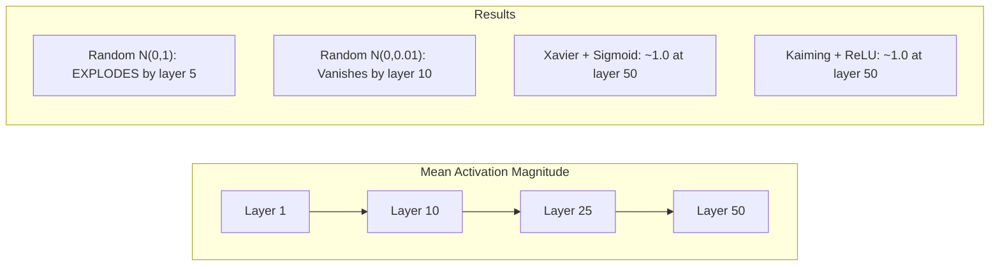
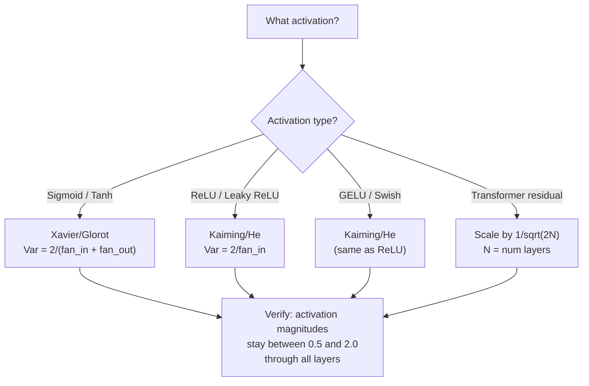

```mermaid
flowchart TD
    subgraph "Zero Init"
        Z1["Layer 1<br/>All weights = 0"] --> Z2["Layer 2<br/>All neurons identical"]
        Z2 --> Z3["Layer 3<br/>Still identical"]
        Z3 --> ZR["Result: 1 effective neuron<br/>regardless of width"]
    end

    subgraph "Xavier Init"
        X1["Layer 1<br/>Var = 2/(fan_in+fan_out)"] --> X2["Layer 2<br/>Signal stable"]
        X2 --> X3["Layer 50<br/>Signal stable"]
        X3 --> XR["Result: Trains with<br/>sigmoid/tanh"]
    end

    subgraph "Kaiming Init"
        K1["Layer 1<br/>Var = 2/fan_in"] --> K2["Layer 2<br/>Signal stable"]
        K2 --> K3["Layer 50<br/>Signal stable"]
        K3 --> KR["Result: Trains with<br/>ReLU/GELU"]
    end
```

# Inicjalizacja ciężaru i stabilność treningu

> Zainicjuj źle, a trening nigdy się nie rozpocznie. Zainicjuj w prawo, a 50 warstw będzie trenowanych tak płynnie, jak 3.

**Typ:** Kompilacja
**Języki:** Python
**Wymagania wstępne:** Lekcja 03.04 (Funkcje aktywacyjne), Lekcja 03.07 (Regularyzacja)
**Czas:** ~90 minut

## Cele nauczania

- Zaimplementuj strategie inicjalizacji zerowej, losowej, Xaviera/Glorota i Kaiminga/He i zmierz ich wpływ na wielkości aktywacji w 50 warstwach
- Wyprowadź, dlaczego Xavier init używa Var(w) = 2/(fan_in + fan_out), a Kaiming używa Var(w) = 2/fan_in
- Zademonstrować problem symetrii przy inicjalizacji zera i wyjaśnić, dlaczego sama skala losowa nie wystarczy
- Dopasuj prawidłową strategię inicjalizacji do funkcji aktywacji: Xavier dla sigmoid/tanh, Kaiming dla ReLU/GELU

## Problem

Zainicjuj wszystkie wagi do zera. Nic się nie uczy. Każdy neuron oblicza tę samą funkcję, otrzymuje ten sam gradient i aktualizuje się w identyczny sposób. Po 10 000 epok warstwa ukryta złożona z 512 neuronów nadal składa się z 512 kopii tego samego neuronu. Zapłaciłeś za 512 parametrów i otrzymałeś 1.

Zainicjuj je za duże. Aktywacje eksplodują w sieci. W warstwie 10 wartości osiągają 1e15. W warstwie 20 przelewają się do nieskończoności. Gradienty podążają tą samą trajektorią w odwrotnej kolejności.

Zainicjuj je losowo ze standardowego rozkładu normalnego. Działa przez 3 warstwy. Przy 50 warstwach sygnał zanika do zera lub eksploduje do nieskończoności, w zależności od tego, czy skala losowa była nieco za mała, czy też nieco za duża. Granica między „dziełami” a „zepsutymi” jest cienka jak brzytwa.

Inicjalizacja wagi jest najbardziej niedocenianą decyzją w głębokim uczeniu się. Architektura dostaje papiery. Optymalizatory otrzymują wpisy na blogu. Inicjalizacja otrzymuje przypis. Ale zrozum to źle i nic innego nie będzie się liczyło – Twoja sieć będzie martwa przed rozpoczęciem uczenia.

## Koncepcja

### Problem symetrii

Każdy neuron w warstwie ma tę samą strukturę: pomnóż dane wejściowe przez wagi, dodaj odchylenie, zastosuj aktywację. Jeśli wszystkie wagi zaczynają się od tej samej wartości (zero jest skrajnym przypadkiem), każdy neuron oblicza ten sam wynik. Podczas propagacji wstecznej każdy neuron otrzymuje ten sam gradient. Podczas etapu aktualizacji każdy neuron zmienia się w tym samym stopniu.

Utknąłeś. Sieć ma setki parametrów, ale wszystkie poruszają się krok po kroku. Nazywa się to symetrią, a losowa inicjalizacja to brutalny sposób na jej złamanie. Każdy neuron zaczyna w innym punkcie przestrzeni wagowej, więc każdy uczy się innej cechy.

Ale „losowe” nie wystarczy. *Skala* losowości określa, czy sieć się szkoli.

### Propagacja wariancji przez warstwy

Rozważ pojedynczą warstwę z wejściami fan_in:

```
z = w1*x1 + w2*x2 + ... + w_n*x_n
```

Jeśli każda waga wi zostanie narysowana z rozkładu o wariancji Var(w) i każde wejście xi ma wariancję Var(x), wariancja wyjściowa wynosi:

```
Var(z) = fan_in * Var(w) * Var(x)
```

Jeśli Var(w) = 1 i fan_in = 512, wariancja wyjściowa jest 512-krotnością wariancji wejściowej. Po 10 warstwach: 512^10 = 1,2e27. Twój sygnał eksplodował.

Jeśli Var(w) = 0,001, wariancja wyjściowa zmniejsza się o 0,001 * 512 = 0,512 na warstwę. Po 10 warstwach: 0,512^10 = 0,00013. Twój sygnał zniknął.

Cel: wybrać Var(w) tak, aby Var(z) = Var(x). Wielkość sygnału pozostaje stała we wszystkich warstwach.

### Inicjalizacja Xaviera/Glorota

Glorot i Bengio (2010) wyprowadzili rozwiązanie aktywacji esicy i tanh. Aby utrzymać stałą wariancję zarówno przy podaniu do przodu, jak i do tyłu:

```
Var(w) = 2 / (fan_in + fan_out)
```

W praktyce wagi pobiera się z:

```
w ~ Uniform(-limit, limit)  where limit = sqrt(6 / (fan_in + fan_out))
```

lub:

```
w ~ Normal(0, sqrt(2 / (fan_in + fan_out)))
```

Działa to, ponieważ sigmoid i tanh są w przybliżeniu liniowe w pobliżu zera, gdzie żyją odpowiednio zainicjowane aktywacje. Wariancja pozostaje stabilna przez dziesiątki warstw.

### Inicjalizacja Kaiminga/He

ReLU zabija połowę wyjść (wszystko ujemne staje się zerem). Efektywna wartość fan_in jest zmniejszona o połowę, ponieważ średnio połowa wejść jest zerowana. Funkcja Xavier init nie uwzględnia tego — niedoszacowuje potrzebną wariancję.

On i in. (2015) dostosowali wzór:

```
Var(w) = 2 / fan_in
```

Wagi pobierane są z:

```
w ~ Normal(0, sqrt(2 / fan_in))
```

Współczynnik 2 kompensuje zerowanie ReLU połowy aktywacji. Bez tego sygnał kurczy się o ~0,5x na warstwę. Przy 50 warstwach: 0,5^50 = 8,8e-16. Kaiming init zapobiega temu.

### Inicjalizacja transformatora

GPT-2 wprowadził inny wzór. Połączenia resztkowe dodają wyjście każdej podwarstwy do jej wejścia:

```
x = x + sublayer(x)
```

Każde dodanie zwiększa wariancję. W przypadku N pozostałych warstw wariancja rośnie proporcjonalnie do N. GPT-2 skaluje wagi pozostałych warstw o ​​1/sqrt(2N), gdzie N to liczba warstw. Dzięki temu wielkość zgromadzonego sygnału jest stabilna.

Podobny schemat wykorzystuje Lama 3 (parametry 405B, 126 warstw). Bez tego skalowania strumień resztkowy rósłby nieograniczony przez 126 warstw uwagi i bloków wyprzedzających.



### Siła aktywacji w 50 warstwach



### Wybór odpowiedniego init



## Zbuduj to

### Krok 1: Strategie inicjalizacji

Cztery sposoby inicjowania macierzy wag. Każda zwraca listę list (macierz 2D) z kolumnami fan_in i wierszami fan_out.

```python
import math
import random

def zero_init(fan_in, fan_out):
    return [[0.0 for _ in range(fan_in)] for _ in range(fan_out)]

def random_init(fan_in, fan_out, scale=1.0):
    return [[random.gauss(0, scale) for _ in range(fan_in)] for _ in range(fan_out)]

def xavier_init(fan_in, fan_out):
    std = math.sqrt(2.0 / (fan_in + fan_out))
    return [[random.gauss(0, std) for _ in range(fan_in)] for _ in range(fan_out)]

def kaiming_init(fan_in, fan_out):
    std = math.sqrt(2.0 / fan_in)
    return [[random.gauss(0, std) for _ in range(fan_in)] for _ in range(fan_out)]
```

### Krok 2: Funkcje aktywacji

Potrzebujemy sigmoida, tanh i ReLU, aby przetestować każdą strategię inicjującą z zamierzoną aktywacją.

```python
def sigmoid(x):
    x = max(-500, min(500, x))
    return 1.0 / (1.0 + math.exp(-x))

def tanh_act(x):
    return math.tanh(x)

def relu(x):
    return max(0.0, x)
```

### Krok 3: Przejdź do przodu przez 50 warstw

Przepuszczaj losowe dane przez głęboką sieć i mierz średnią wielkość aktywacji w każdej warstwie.

```python
def forward_deep(init_fn, activation_fn, n_layers=50, width=64, n_samples=100):
    random.seed(42)
    layer_magnitudes = []

    inputs = [[random.gauss(0, 1) for _ in range(width)] for _ in range(n_samples)]

    for layer_idx in range(n_layers):
        weights = init_fn(width, width)
        biases = [0.0] * width

        new_inputs = []
        for sample in inputs:
            output = []
            for neuron_idx in range(width):
                z = sum(weights[neuron_idx][j] * sample[j] for j in range(width)) + biases[neuron_idx]
                output.append(activation_fn(z))
            new_inputs.append(output)
        inputs = new_inputs

        magnitudes = []
        for sample in inputs:
            magnitudes.append(sum(abs(v) for v in sample) / width)
        mean_mag = sum(magnitudes) / len(magnitudes)
        layer_magnitudes.append(mean_mag)

    return layer_magnitudes
```

### Krok 4: Eksperyment

Uruchom wszystkie kombinacje: zero init, losowe N(0,1), losowe N(0,0,01), Xavier z sigmoidem, Xavier z tanh, Kaiming z ReLU. Wydrukuj wielkość w kluczowych warstwach.

```python
def run_experiment():
    configs = [
        ("Zero init + Sigmoid", lambda fi, fo: zero_init(fi, fo), sigmoid),
        ("Random N(0,1) + ReLU", lambda fi, fo: random_init(fi, fo, 1.0), relu),
        ("Random N(0,0.01) + ReLU", lambda fi, fo: random_init(fi, fo, 0.01), relu),
        ("Xavier + Sigmoid", xavier_init, sigmoid),
        ("Xavier + Tanh", xavier_init, tanh_act),
        ("Kaiming + ReLU", kaiming_init, relu),
    ]

    print(f"{'Strategy':<30} {'L1':>10} {'L5':>10} {'L10':>10} {'L25':>10} {'L50':>10}")
    print("-" * 80)

    for name, init_fn, act_fn in configs:
        mags = forward_deep(init_fn, act_fn)
        row = f"{name:<30}"
        for idx in [0, 4, 9, 24, 49]:
            val = mags[idx]
            if val > 1e6:
                row += f" {'EXPLODED':>10}"
            elif val < 1e-6:
                row += f" {'VANISHED':>10}"
            else:
                row += f" {val:>10.4f}"
        print(row)
```

### Krok 5: Demonstracja symetrii

Pokaż, że zero init daje identyczne neurony.

```python
def symmetry_demo():
    random.seed(42)
    weights = zero_init(2, 4)
    biases = [0.0] * 4

    inputs = [0.5, -0.3]
    outputs = []
    for neuron_idx in range(4):
        z = sum(weights[neuron_idx][j] * inputs[j] for j in range(2)) + biases[neuron_idx]
        outputs.append(sigmoid(z))

    print("\nSymmetry Demo (4 neurons, zero init):")
    for i, out in enumerate(outputs):
        print(f"  Neuron {i}: output = {out:.6f}")
    all_same = all(abs(outputs[i] - outputs[0]) < 1e-10 for i in range(len(outputs)))
    print(f"  All identical: {all_same}")
    print(f"  Effective parameters: 1 (not {len(weights) * len(weights[0])})")
```

### Krok 6: Raport wielkości warstwa po warstwie

Wydrukuj wizualny wykres słupkowy wielkości aktywacji w 50 warstwach.

```python
def magnitude_report(name, magnitudes):
    print(f"\n{name}:")
    for i, mag in enumerate(magnitudes):
        if i % 5 == 0 or i == len(magnitudes) - 1:
            if mag > 1e6:
                bar = "X" * 50 + " EXPLODED"
            elif mag < 1e-6:
                bar = "." + " VANISHED"
            else:
                bar_len = min(50, max(1, int(mag * 10)))
                bar = "#" * bar_len
            print(f"  Layer {i+1:3d}: {bar} ({mag:.6f})")
```

## Użyj tego

PyTorch udostępnia je jako funkcje wbudowane:

```python
import torch
import torch.nn as nn

layer = nn.Linear(512, 256)

nn.init.xavier_uniform_(layer.weight)
nn.init.xavier_normal_(layer.weight)

nn.init.kaiming_uniform_(layer.weight, nonlinearity='relu')
nn.init.kaiming_normal_(layer.weight, nonlinearity='relu')

nn.init.zeros_(layer.bias)
```

Kiedy wywołujesz `nn.Linear(512, 256)`, PyTorch domyślnie używa jednolitej inicjalizacji Kaiming. Dlatego większość prostych sieci „po prostu działa” — PyTorch już dokonał właściwego wyboru. Ale kiedy budujesz niestandardowe architektury lub wchodzisz głębiej niż 20 warstw, musisz zrozumieć, co się dzieje i potencjalnie zastąpić ustawienie domyślne.

W przypadku transformatorów modele HuggingFace zazwyczaj obsługują inicjalizację w swojej metodzie `_init_weights`. Implementacja GPT-2 skaluje prognozy rezydualne o 1/sqrt(N). Jeśli budujesz transformator od zera, musisz dodać to samodzielnie.

## Wyślij to

Ta lekcja daje:
- `outputs/prompt-init-strategy.md` – monit diagnozujący problemy z inicjalizacją wagi i zalecający właściwą strategię

## Ćwiczenia

1. Dodaj inicjalizację LeCun (Var = 1/fan_in, przeznaczony do aktywacji SELU). Przeprowadź eksperyment z 50 warstwami za pomocą LeCun init + tanh i porównaj z Xavier + tanh.

2. Zaimplementuj skalowanie resztkowe GPT-2: pomnóż wynik każdej warstwy przez 1/sqrt(2*N) przed dodaniem do strumienia resztkowego. Uruchom 50 warstw ze skalowaniem i bez, zmierz, jak szybko rośnie wielkość resztkowa.

3. Utwórz funkcję „kontroli stanu inicjowania”, która pobiera wymiary warstwy sieci i typ aktywacji, a następnie zaleca prawidłową inicjalizację i ostrzega, jeśli bieżąca inicjacja spowoduje problemy.

4. Przeprowadź eksperyment z fan_in = 16 vs fan_in = 1024. Xavier i Kaiming dostosowują się do fan_in, ale losowa inicjacja nie. Pokaż, jak odstęp między „działa” a „przerwami” zwiększa się wraz z większymi warstwami.

5. Zaimplementować inicjalizację ortogonalną (wygenerować macierz losową, obliczyć jej SVD, skorzystać z macierzy ortogonalnej U). Porównaj z Kaiming dla sieci ReLU przy 50 warstwach.

## Kluczowe terminy

| Termin | Co ludzie mówią | Co to właściwie oznacza |
|------|----------------|----------------------|
| Inicjalizacja wagi | „Ustaw losowo ciężary początkowe” | Strategia wyboru początkowych wartości wag decydujących o tym, czy sieć w ogóle może trenować |
| Łamanie symetrii | „Uczyń neurony innymi” | Używanie losowej inicjalizacji, aby zapewnić, że neurony uczą się odrębnych cech, zamiast obliczać identyczne funkcje |
| Wachlarz | „Liczba wejść do neuronu” | Liczba połączeń przychodzących, która określa, w jaki sposób wariancja danych wejściowych kumuluje się w sumie ważonej |
| Wentylacja | „Liczba wyjść z neuronu” | Liczba połączeń wychodzących, istotna dla utrzymania wariancji gradientu podczas propagacji wstecznej |
| Inicjacja Xaviera/Glorota | „Inicjalizacja sigmoidalna” | Var(w) = 2/(fan_in + fan_out), zaprojektowane w celu zachowania wariancji poprzez aktywacje sigmoidalne i tanh |
| Kaiming/On inicjuje | „Inicjalizacja ReLU” | Var(w) = 2/fan_in, odpowiada zerowaniu ReLU połowy aktywacji |
| Propagacja wariancji | „Jak sygnały rosną lub kurczą się poprzez warstwy” | Analiza matematyczna zmiany wariancji aktywacji warstwa po warstwie w oparciu o skalę wagową |
| Skalowanie resztkowe | „Sztuczka inicjująca GPT-2” | Skalowanie pozostałych wag połączeń o 1/sqrt(2N), aby zapobiec wzrostowi wariancji przez N warstw transformatora |
| Martwa sieć | „Nic nie trenuje” | Sieć, w której słaba inicjalizacja powoduje, że wszystkie gradienty wynoszą zero lub wszystkie aktywacje stają się nasycone
| Eksplodujące aktywacje | „Wartości dążą do nieskończoności” | Gdy wariancja wagi jest zbyt duża, powoduje to wykładniczy wzrost wielkości aktywacji w warstwach |

## Dalsze czytanie

- Glorot i Bengio, „Understanding the Trudność treningu głębokich sieci neuronowych ze sprzężeniem zwrotnym” (2010) – oryginalny dokument inicjujący Xaviera z analizą wariancji
- He i in., „Delving Deep in Rectifiers” (2015) – wprowadzili inicjalizację Kaiminga dla sieci ReLU
– Radford i in., „Language Models are Unsupervised Multitask Learners” (2019) – artykuł GPT-2 z inicjalizacją skalowania resztkowego
- Mishkin i Matas, „All You Need is a Good Init” (2016) – inicjalizacja jednostkowej wariancji po warstwie, empiryczna alternatywa dla formuł analitycznych