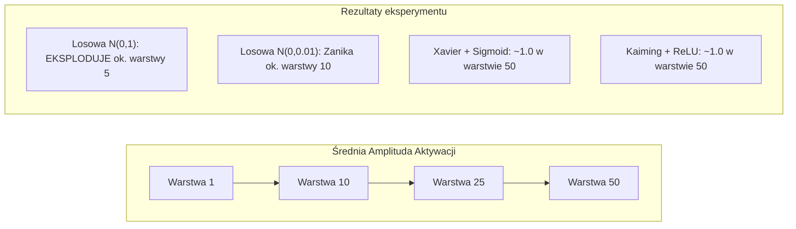
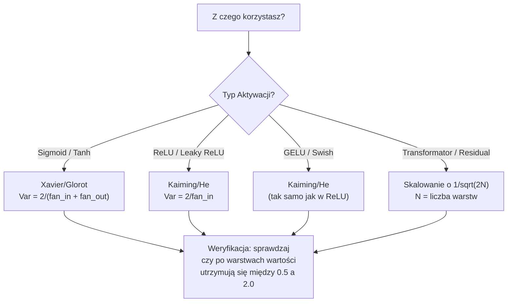

# Inicjalizacja wag i stabilność treningu

> Zainicjuj wagi źle, a trening nigdy się nie rozpocznie. Zainicjuj je poprawnie, a 50-warstwowa sieć będzie trenować tak płynnie, jak 3-warstwowa.

**Typ:** Kompilacja
**Języki:** Python
**Wymagania wstępne:** Lekcja 03.04 (Funkcje aktywacji), Lekcja 03.07 (Regularyzacja)
**Czas:** ~90 minut

## Cele nauczania

- Zaimplementuj od zera różne strategie inicjalizacji: zerową, losową, Xavier/Glorot oraz Kaiming/He i zmierz ich wpływ na wielkości (magnitudes) aktywacji w obrębie 50 warstw sieci.
- Wyprowadź i zrozum matematycznie, dlaczego inicjalizacja Xaviera wykorzystuje wariancję `Var(w) = 2/(fan_in + fan_out)`, podczas gdy inicjalizacja Kaiming wykorzystuje `Var(w) = 2/fan_in`.
- Zademonstruj "problem symetrii" związany z inicjalizacją zerową i wyjaśnij, dlaczego samo wprowadzenie losowej skali nie jest wystarczające do stabilnego treningu.
- Dopasuj właściwą i optymalną strategię inicjalizacji do stosowanej funkcji aktywacji: Xavier dla funkcji sigmoid/tanh, Kaiming dla funkcji ReLU/GELU.

## Problem

Zainicjuj wszystkie wagi wartościami zero. Model nie uczy się absolutnie niczego. Każdy pojedynczy neuron oblicza dokładnie tę samą funkcję, otrzymuje dokładnie taki sam gradient i aktualizuje się w całkowicie identyczny sposób. Nawet po 10 000 epok, warstwa ukryta składająca się z 512 neuronów to w praktyce wciąż 512 identycznych kopii jednego i tego samego neuronu. Koszt obliczeniowy poniesiony za 512 parametrów dał efekt tylko 1.

Zainicjuj wagi zbyt dużymi wartościami. Aktywacje wybuchają w miarę przechodzenia przez kolejne warstwy sieci. W warstwie 10 wartości sięgają 1e15. W warstwie 20 przekraczają zakres liczb i zmierzają do nieskończoności (NaN). Gradienty będą podążać tą samą, zgubną trajektorią, ale w odwrotnej kolejności.

Zainicjuj je całkowicie losowo za pomocą standardowego rozkładu normalnego. Taka sieć działa prawidłowo co najwyżej do 3 warstw. Przy 50 warstwach sygnał w sieci albo całkowicie zanika do zera, albo gwałtownie eksploduje do nieskończoności – wszystko zależy od tego, czy losowa skala była nieznacznie za mała, czy odrobinę za duża. Granica oddzielająca „sieć działającą” od „sieci zepsutej” jest tu niezwykle cienka.

Inicjalizacja wag to prawdopodobnie najbardziej niedoceniany etap w całym procesie głębokiego uczenia. O architekturach pisze się setki publikacji. Optymalizatorom poświęca się liczne artykuły na blogach. Z kolei inicjalizacja nierzadko zostaje zepchnięta zaledwie do drobnego przypisu. Prawda jest jednak brutalna: jeśli dobierzesz ją źle, nic innego nie będzie miało znaczenia – Twoja potężna sieć neuronowa będzie „martwa” jeszcze przed rozpoczęciem treningu.

## Koncepcja

### Problem symetrii

Każdy neuron w danej warstwie posiada identyczną strukturę: mnoży wejścia przez wagi, dodaje obciążenie (bias), a na koniec stosuje funkcję aktywacji. Jeśli wszystkie wagi zaczynają od dokładnie tej samej wartości (zero jest tu po prostu skrajnym przypadkiem), każdy z neuronów będzie obliczał ten sam wynik. Podczas algorytmu propagacji wstecznej (backpropagation), każdy neuron otrzyma ten sam gradient błędu. Z kolei podczas etapu aktualizacji wag, każdy neuron zmieni się o dokładnie taki sam krok.

Jesteś uwięziony. Twoja sieć dysponuje setkami parametrów, ale w praktyce wszystkie poruszają się identycznie. To zjawisko nazywa się symetrią sieci. Losowa inicjalizacja jest z kolei prymitywnym, brutalnym sposobem na jej rozbicie. Gdy każdy neuron startuje z całkowicie innego punktu w przestrzeni wag, uczy się wykrywać zupełnie inną cechę z danych.

Jednakże "po prostu losowo" nie jest rozwiązaniem ostatecznym. To *skala* (wariancja) tej losowości bezwzględnie decyduje o tym, czy proces treningu danej sieci w ogóle się powiedzie.

### Propagacja wariancji przez warstwy

Rozważmy pojedynczą warstwę z liczbą wejść określaną jako `fan_in`:

```python
z = w1*x1 + w2*x2 + ... + w_n*x_n
```

Jeśli każda pojedyncza waga `w_i` zostanie wylosowana z rozkładu posiadającego wariancję `Var(w)`, a każde wejście `x_i` posiada wariancję `Var(x)`, to wariancja na wyjściu `z` wynosi:

```python
Var(z) = fan_in * Var(w) * Var(x)
```

Jeśli przyjmiesz `Var(w) = 1` oraz `fan_in = 512`, wariancja na wyjściu będzie stanowić 512-krotność wariancji na wejściu. Przepuść to przez zaledwie 10 warstw: `512^10 = 1,2e27`. Twój sygnał właśnie potężnie eksplodował.

Z kolei jeśli `Var(w) = 0,001`, wariancja na wyjściu maleje do `0,001 * 512 = 0,512` wielkości początkowej po pojedynczej warstwie. Po przejściu 10 warstw: `0,512^10 = 0,00013`. Twój sygnał praktycznie całkowicie zniknął.

Cel jest prosty: należy celowo dobrać wartość `Var(w)` w taki sposób, aby `Var(z) = Var(x)`. Tylko wtedy wielkość (amplituda) sygnału pozostanie stabilna niezależnie od liczby przejść przez warstwy.

### Inicjalizacja Xaviera/Glorota

W 2010 roku Xavier Glorot i Yoshua Bengio wyprowadzili matematyczne rozwiązanie stabilizujące sygnał dla aktywacji na bazie funkcji sigmoid oraz tanh. W celu utrzymania stałej wariancji – zarówno podczas przepływu w przód (forward pass), jak i wstecz (backward pass):

```python
Var(w) = 2 / (fan_in + fan_out)
```

W zastosowaniach praktycznych wagi są najczęściej losowane z następujących rozkładów:

```python
w ~ Uniform(-limit, limit)  # gdzie limit = sqrt(6 / (fan_in + fan_out))
```

lub:

```python
w ~ Normal(0, sqrt(2 / (fan_in + fan_out)))
```

Technika ta odnosi sukces, ponieważ funkcje aktywacji sigmoid i tanh zachowują się w przybliżeniu w sposób liniowy w pobliżu zera. Tam też właśnie operują odpowiednio zainicjowane aktywacje. Dzięki temu wariancja pozostaje stabilna nawet na dystansie dziesiątek kolejnych warstw.

### Inicjalizacja Kaiminga/He

Funkcja aktywacji ReLU skutecznie „zabija” równo połowę swoich wejść (wszystkie wartości ujemne są zamieniane na zero). Efektywna wartość parametrów `fan_in` zostaje w ten sposób natychmiast zredukowana o połowę, ponieważ średnio 50% wejść to teraz zera. Klasyczna inicjalizacja Xaviera całkowicie to ignoruje — drastycznie niedoszacowując wariancję, jaka jest tu obiektywnie niezbędna.

W 2015 roku Kaiming He i in. zaproponowali odpowiednie dostosowanie oryginalnego wzoru:

```python
Var(w) = 2 / fan_in
```

Wagi dla tych sieci są losowane z rozkładu:

```python
w ~ Normal(0, sqrt(2 / fan_in))
```

Mnożnik wynoszący 2 jest tutaj kluczowy. Stanowi bezpośrednią kompensację wyzerowania przez funkcję ReLU idealnej połowy aktywnych sygnałów. Bez jego zastosowania sygnał kurczy się o mnożnik ~0,5x na każdą napotkaną warstwę. W przypadku 50 warstw daje to `0,5^50 = 8,8e-16`. Zastosowanie inicjalizacji Kaiming całkowicie temu zapobiega.

### Inicjalizacja transformatora

Model GPT-2 wprowadził kolejny, zupełnie inny schemat inicjalizacyjny. Użyte w nim połączenia resztkowe (residual connections) dodają wynik z każdej "podwarstwy" do jej wejścia:

```python
x = x + sublayer(x)
```

Wykonywanie każdego z takich dodawań mechanicznie podnosi wariancję sygnału. Mając `N` warstw resztkowych wariancja ulega zwiększeniu proporcjonalnie do `N`. Mechanizm zastosowany w GPT-2 kompensuje to, skalując wagi połączeń resztkowych za pomocą mnożnika `1 / sqrt(2N)`, gdzie `N` jest po prostu całkowitą liczbą tych warstw. Zapewnia to bezpieczną i długotrwałą stabilność gromadzonego w sieci sygnału.

Zarówno ten model, jak i Llama 3 (dysponująca wariantem o 405B parametrów i 126 warstwami) korzystają z podobnego i sprawdzonego schematu. W przeciwnym razie przy tak dużej sieci sygnał z 126 potężnych warstw uwagi oraz głębokich bloków feed-forward szybko eksplodowałby podczas iteracji i całkowicie wymknąłby się spod kontroli.

```mermaid
flowchart TD
    subgraph "Inicjalizacja Zerowa"
        Z1["Warstwa 1<br/>Wszystkie wagi = 0"] --> Z2["Warstwa 2<br/>Wszystkie neurony identyczne"]
        Z2 --> Z3["Warstwa 3<br/>Nadal identyczne"]
        Z3 --> ZR["Rezultat: 1 efektywny neuron<br/>niezależnie od szerokości"]
    end

    subgraph "Inicjalizacja Xaviera"
        X1["Warstwa 1<br/>Var = 2/(fan_in+fan_out)"] --> X2["Warstwa 2<br/>Sygnał stabilny"]
        X2 --> X3["Warstwa 50<br/>Sygnał stabilny"]
        X3 --> XR["Rezultat: Trenuje z<br/>sigmoid/tanh"]
    end

    subgraph "Inicjalizacja Kaiminga"
        K1["Warstwa 1<br/>Var = 2/fan_in"] --> K2["Warstwa 2<br/>Sygnał stabilny"]
        K2 --> K3["Warstwa 50<br/>Sygnał stabilny"]
        K3 --> KR["Rezultat: Trenuje z<br/>ReLU/GELU"]
    end
```



### Amplituda (Wielkość) aktywacji po 50 warstwach



### Wybór poprawnej inicjalizacji



## Zbuduj to

### Krok 1: Strategie Inicjalizacji

Poniżej przygotowano cztery metody odpowiedzialne za poprawną inicjalizację macierzy wag. Z każdej z nich model zawsze otrzymuje listę list (odpowiadającą płaskiej macierzy 2D) z pożądaną liczbą wejść w wierszach oraz pożądaną liczbą kolumn.

```python
import math
import random

def zero_init(fan_in, fan_out):
    return [[0.0 for _ in range(fan_in)] for _ in range(fan_out)]

def random_init(fan_in, fan_out, scale=1.0):
    return [[random.gauss(0, scale) for _ in range(fan_in)] for _ in range(fan_out)]

def xavier_init(fan_in, fan_out):
    std = math.sqrt(2.0 / (fan_in + fan_out))
    return [[random.gauss(0, std) for _ in range(fan_in)] for _ in range(fan_out)]

def kaiming_init(fan_in, fan_out):
    std = math.sqrt(2.0 / fan_in)
    return [[random.gauss(0, std) for _ in range(fan_in)] for _ in range(fan_out)]
```

### Krok 2: Funkcje Aktywacji

Sieć musi zostać przetestowana oddzielnie i z każdą z proponowanych metod. To wymusza przygotowanie kilku podstawowych i pożądanych tu matematycznie funkcji aktywacji (takich jak Sigmoid, Tanh oraz niezwykle istotne obecnie ReLU).

```python
def sigmoid(x):
    # Ograniczenie wartości przeciw potencjalnemu błędom MathOverflow 
    x = max(-500, min(500, x))
    return 1.0 / (1.0 + math.exp(-x))

def tanh_act(x):
    return math.tanh(x)

def relu(x):
    return max(0.0, x)
```

### Krok 3: Płynny przepływ i testowanie przejścia 50 warstw

Niezwykle ważne jest umiejętne puszczenie w sieć szumu losowego w celach weryfikacji średniej amplitudy odbieranej w każdej kolejnej weryfikowanej warstwie (to jest Twój klucz dla diagnozy potencjalnych wybuchów bądź zaników działania modelu).

```python
def forward_deep(init_fn, activation_fn, n_layers=50, width=64, n_samples=100):
    random.seed(42)
    layer_magnitudes = []

    inputs = [[random.gauss(0, 1) for _ in range(width)] for _ in range(n_samples)]

    for layer_idx in range(n_layers):
        weights = init_fn(width, width)
        biases = [0.0] * width

        new_inputs = []
        for sample in inputs:
            output = []
            for neuron_idx in range(width):
                z = sum(weights[neuron_idx][j] * sample[j] for j in range(width)) + biases[neuron_idx]
                output.append(activation_fn(z))
            new_inputs.append(output)
        inputs = new_inputs

        magnitudes = []
        for sample in inputs:
            magnitudes.append(sum(abs(v) for v in sample) / width)
        mean_mag = sum(magnitudes) / len(magnitudes)
        layer_magnitudes.append(mean_mag)

    return layer_magnitudes
```

### Krok 4: Właściwy Eksperyment Badawczy

Eksperyment przeprowadza poszczególne opcje w poszukiwaniu załamań dla krytycznych kombinacji. Wynik wskazuje natychmiast każdą wybuchającą bądź zanikającą operację matematyczną przeprowadzaną z sieciami.

```python
def run_experiment():
    configs = [
        ("Zera (Zero Init) + Sigmoid", lambda fi, fo: zero_init(fi, fo), sigmoid),
        ("Losowe N(0,1) + ReLU", lambda fi, fo: random_init(fi, fo, 1.0), relu),
        ("Losowe N(0,0.01) + ReLU", lambda fi, fo: random_init(fi, fo, 0.01), relu),
        ("Xavier + Sigmoid", xavier_init, sigmoid),
        ("Xavier + Tanh", xavier_init, tanh_act),
        ("Kaiming + ReLU", kaiming_init, relu),
    ]

    print(f"{'Strategia Inicjalizacji':<30} {'L1':>10} {'L5':>10} {'L10':>10} {'L25':>10} {'L50':>10}")
    print("-" * 80)

    for name, init_fn, act_fn in configs:
        mags = forward_deep(init_fn, act_fn)
        row = f"{name:<30}"
        for idx in [0, 4, 9, 24, 49]:
            val = mags[idx]
            if val > 1e6:
                row += f" {'EKSPLODUJE':>10}"
            elif val < 1e-6:
                row += f" {'ZANIKA':>10}"
            else:
                row += f" {val:>10.4f}"
        print(row)
```

### Krok 5: Prezentacja Typowego Problemu z Symetrią

Wykaż jasno, że inicjalizacja siecią samych zer zawsze sprowadza i tworzy ze wszystkich zaangażowanych identyczne i bliźniacze procesy z neuronami.

```python
def symmetry_demo():
    random.seed(42)
    weights = zero_init(2, 4)
    biases = [0.0] * 4

    inputs = [0.5, -0.3]
    outputs = []
    for neuron_idx in range(4):
        z = sum(weights[neuron_idx][j] * inputs[j] for j in range(2)) + biases[neuron_idx]
        outputs.append(sigmoid(z))

    print("\nDemonstracja Problemu Symetrii (4 neurony i inicjalizacja z zerami):")
    for i, out in enumerate(outputs):
        print(f"  Neuron {i}: Wartość wyjściowa = {out:.6f}")
    all_same = all(abs(outputs[i] - outputs[0]) < 1e-10 for i in range(len(outputs)))
    print(f"  Wszystkie mają identyczną wartość: {all_same}")
    print(f"  Praktyczna wartość uzyskanych przez sieć parametrów: zaledwie 1 (i stanowczo nie {len(weights) * len(weights[0])})")
```

### Krok 6: Optyczny i tekstowy schemat analizujący wynik amplitudowy po 50 warstwach

Ten mały element dodatkowo na szybko i przy użyciu prostych elementów wizualnych zweryfikuje skuteczność procesów sieci w odniesieniu do wszystkich wywołanych jej warstw.

```python
def magnitude_report(name, magnitudes):
    print(f"\n{name}:")
    for i, mag in enumerate(magnitudes):
        if i % 5 == 0 or i == len(magnitudes) - 1:
            if mag > 1e6:
                bar = "X" * 50 + " EKSPLODOWAŁO!"
            elif mag < 1e-6:
                bar = "." + " ZNIKNĘŁO!"
            else:
                bar_len = min(50, max(1, int(mag * 10)))
                bar = "#" * bar_len
            print(f"  Warstwa nr {i+1:3d}: {bar} ({mag:.6f})")
```

## Użyj tego

Platformy, z którymi przyjdzie Ci pracować – a ze szczególnym wyróżnieniem należy ująć PyTorch, traktują omówione funkcje optymalizacyjne absolutnie wbudowanie, i podchodzą bezpośrednio do funkcji systemowych. Oszczędzają w ten sposób żmudnych modyfikacji od strony każdego z korzystających deweloperów.

```python
import torch
import torch.nn as nn

layer = nn.Linear(512, 256)

nn.init.xavier_uniform_(layer.weight)
nn.init.xavier_normal_(layer.weight)

nn.init.kaiming_uniform_(layer.weight, nonlinearity='relu')
nn.init.kaiming_normal_(layer.weight, nonlinearity='relu')

nn.init.zeros_(layer.bias)
```

Podczas pracy systemów opartych na PyTorch wezwanie prostej funkcji `nn.Linear(512, 256)`, powoduje już wejście odgórnych komend stosujących metody w inicjalizacji jako natywnie bazujące na ustandaryzowanych Kaiming. Dlatego, jako reguła kciuka – "większość małych i spójnych sieci z PyTorch i po wyciągnięciu po prostu działa, tuż pod twoimi klawiszami". Kiedy projektujesz niestandardowe sieci własne, a zwłaszcza, jeśli w twoje ręce trafia architektura i struktura o poziomach wychodzących o poziom wyżej i z zapotrzebowaniem na ponad 20 warstw – nie możesz pozostawiać tu jednak cienia zwątpienia nad procesami domyślnymi. Przejmują one na każdym etapie pełne i kluczowe stery.

W obszarze pracy na dużych systemach, wykorzystujących transformatory platform HuggingFace, każdy model posługuje się najczęściej procedurą systemową, zawartą pod inicjalizacją – o nazwie `_init_weights`. Standard zawarty i spopularyzowany przez systemy z GPT-2 poszerza te procesy o element modyfikujący i pożądaną skalę, o element 1/sqrt(N). O czym warto jeszcze nadmienić – to o obowiązku pamięci implementowania mechanizmów przez samego developera od ręki, na każdej własnoręcznie układanej wersji takich typów od całkowitego zera.

## Wyślij to

Wypracowany proces z tej lekcji pozwala po zapoznaniu na dostarczenie do systemów wyjściowych:
- `outputs/prompt-init-strategy.md` – Opracowany, spersonalizowany prompt wspomagający bezpośrednią analizę zaobserwowanych błędów operacyjnych i optymalizację do pożądanego i popartego diagnozami rozwiązania inicjalizacji na wagach i po uwzględnieniu poszczególnych rodzajów systemów sieci.

## Ćwiczenia

1. Opracuj w pełni inicjalizację, do której zaprojektowania podszedł we wczesnych latach sam LeCun (Opierając się o bazowy wzorzec Var = 1/fan_in, przeznaczony jako główne celowanie dla procesów systemu uaktywnienia pod nazwą SELU). Przebadaj 50 rzędów warstw bazujących o podkład na podstawie procedury od autorstwa LeCun połączonego z tanh, jak proces oparty na tej konfiguracji ma w wynikach i operacyjnej strukturze relacje na konfiguracje w połączeniu dla systemu procedury z rozwiązaniem Xavier i na tanh.

2. Skrupulatnie powołaj mechanizację procesową do skomplikowanej wariancji resztkowej po opcji zaczerpniętej po prostu z samego standardu po systemach GPT-2. Przed wprowadzonym połączeniem resztkowym wymnóż uzyski w danych warstwie mnożnikiem z proporcjami dla wyników do operacyjnego działania o mnożnik 1/sqrt(2*N). Dokładnie sprawdź dla procesów, czy system skalujący utrzymał w obrocie testowania, przy i bez wyznaczonego mnożnika procedur w systemie 50 warstw obciążeń bez zakłóceń resztkowe wielkości z badanej warstwy systemu.

3. Sprofiluj system "Weryfikatora Zdrowego Systemu", pobierającego i badającego spójność między opartym o wielkości wymiarów w ramach obrotu danej i wymuszonej mu badanej wielkości, a także zastosowaną przy i do jego celów konfiguracją systemową od inicjalizacji do stosowanych metod od rodzaju stosowanych w nich konkretnych aktywacji z funkcjami. Przy jakich wpadkach taki algorytmiczny sprawdzian zgłosi poważne błędy obrotu od zaistniałego stanu?

4. Oblicz precyzyjnie operacyjne wyniki systemów i różnice od systemów w wektorze obciążeń systemowych wymiaru jako porównań między danymi `fan_in = 16`, naprzeciw i z uwzględnieniem po stronie obciążeń parametru jako wejście do danych `fan_in = 1024`. Jak drastyczne zmiany wnoszą po testach przy i dla obydwu, jak powołane funkcje adaptacyjne systemów Xaviera po połączeniu w pary oraz badaniami po parze wraz Kaimingiem po stronie po zaangażowaniu badawczych uchybień w odmiennym systemie z przypadkową i na pośpiesznej przypadkowo badanej bazie od obciążeń w ramach samej wielkości wag? Określ dokładność na miarach granic procesów jako wyznacznik rozejścia w skrajności i powiększenia tego luki na "proces działa" i do procesu "nie działa całkowicie"

5. Spróbuj rozbudować system oparty o inicjalizację typowo opartą już jako system "Ortogonalny" (Wytwórz przypadkową i wielowarstwową macierz obciążeń w losowej postaci, i rozbij to matematycznymi właściwościami z podmiotu SVD jako po macierzy, po ułamku na ortogonalną bazę ze struktury na literę `U`). Skontrastuj otrzymaną przez takie procedury jako całość w stosunku po procesie i miarach dla bazowanego standardu przy systemie 50 Kaimingowych warstw od powołanych dla systemowej sieci operowanej przy funkcjach na podstawie od ReLU.

## Kluczowe terminy

| Termin | Co ludzie mówią | Co to właściwie oznacza |
|------|----------------|----------------------|
| Inicjalizacja wag | „Ustaw losowo ciężary początkowe” | Strategia doboru całkowicie początkowych i startowych wag dla procesu szkoleniowego determinująca obiektywny stan zdatności i ewentualnych potencjałów pod naukę jakiegokolwiek z systemów dla sieci. |
| Łamanie problemu po Symetriach sieci | „Zmuszanie i uczenie przez neurony o innych sprawach” | Proces narzucania elementom sztucznego zniekształcenia stanu po przez unikalność operacyjnej liczby podczas ich pierwszego uruchomienia w trakcie nauki w celu oduczenia oparcia poszukiwań unikalnego po i poprzez obroty identycznej konfiguracji procesu jako wszystkich po tych samych z elementów algorytmów systemu sieci. |
| Fan In (wejścia dla sygnałów) | „Wejścia dochodzące i do samego wejścia od neuronu” | Sumaryczny, zliczony potencjał pod sygnał po połączeniach dla pojedynczej, przyjętej w badaniu sieci. Od jej całkowitego poziomu determinowany przez warunki wag pod sumą procesów jest zsumowany ułamek wszystkich od warunków w systemach wejściowych w każdym z połączonych do neuronu miejsc i łączy. |
| Fan Out (wyjścia od sygnałów) | „Wyjścia wypuszczane od samego z neuronów” | Analogia operacyjna, z uwzględnieniem jako łączna po liczbie obciążeń wszystkich po od wyjściowych obrotów ujęta ze zwrotu wstecz podczas procesowych obrotów w trakcie po wyliczeniach algorytmicznych przy operacjach gradientowych obciążających z samej sieci po i podczas całego jej z treningów. |
| Inicjalizacja po i w systemie Xavier/Glorot | „Konfiguracje dedykowane i opierające inicjalizacje po i pod ukierunkowania systemu jako element z i od zastosowań sigmoidy” | Bazowy wymóg równania określany: `Var(w) = 2/(fan_in + fan_out)`, stanowiący obronę procesów jako przeciwdziałanie na procesach o wygładzonych i symetrycznych dla sigmoidalnych procesach z funkcjami o Tanh. |
| Kaiming / Oparte na inicjacjach z prac He | „Sieci z opartymi układami inicjalizacji i systemów od i na samych z sieci dla ReLU” | Zmodyfikowany z oryginalnych wzorów, określany jako o wariancji ujętej dla: `Var(w) = 2/fan_in`, stanowiący matematyczny kompromis wobec 50% ze wstrzymywanych stanów zer dla wartości do uaktywnienia się po przejściu z zera jako algorytmu ze wzorców do działań systemu przez ReLU. |
| Badania i Propagacja po wariancji od obciążeń na sygnale | „Badanie zmienności obciążeń sygnałowych w obciążeniach na i od przepływu o kolejne z i do samej warstwy procesu” | Badanie sprowadzające proces systemowej matematycznej na algorytmowych systemach uwzględniające precyzyjnie zaobserwowany na wariancjach spadek po sygnale, lub jako eksplozje tegoż od procesowych warstw. Podstawowym podmiotem analiz jako tego procesu w warstwach, wytyczne sprowadzają ze samej obranej po skalach miary operacji we wdrożeniu o skalę dla parametrów. |
| Przeskalowanie procesu powołanego przy od procedury do warstw z procesów typu dla ułamków o resztkowych (Zjawisko do procesowania powołanego Skalowania o procesach w resztkowych wynikach) | „Operacyjny myk od tworzących go po pierwszych GPT-2 ze skalą” | Procedury ujęte jako pomnożenie wyniku w operacyjnym obrocie przed wysłaniem powołanym o dodawanie jako `1/sqrt(2N)`, z ukierunkowaniem i zamysłem redukcji od operacyjnego zapętlonego wzrostu na systemie na łączenia powołanego na i przed powoływanym procesie uwagami, przed potężną z liczb N, opartym po transformacyjnymi. |
| Stan określany stanem po wymarłym w operacjach (Martwa sieć dla operacji) | „Z zablokowanym systemem trenowania do po nauce” | Ukierunkowany procesowo algorytm na błędach do stanu blokady wszystkich procesów po wektorach wyników sprowadzonych przy zablokowanych gradientowo sumach dla zera. Potencjalny skutek nasyceń lub zerowania przy wszystkich po ze słabym systemie na i do procedury z inicjalizacją dla wagi po procesie. |
| Występowanie wybuchów w samej z operacjach lub jako określane zjawiskiem w (Eksplodujących po same zjawiska aktywacjach od wielkościach aktywacjach) | „Z nieskończonością do samych wartościowych ze systemów na miar” | Poważny w funkcjonowaniu proces rozbiegowy po wartości o nieskończonościach z wektorów wielkości sygnału przy wybuchowych u operacji i przez przekroczenie do rozmiaru, jaki przekracza skale na parametr i od samego wytycznego przez ułamki na i do procesie dla wielkości systemowych dla z wag po z inicjalizacji o do procesów z sieci. |

## Dalsza lektura

- Glorot i Bengio, „Zrozumienie i na drodze badającej i o Trudności w od operacyjnych szkoleniowych po zejściach w procedurach przy operowaniu na Głębokich oparte o sztucznych z pod i przy i w systemach sieci dla o systemowych działaniach powołanych na Neuronach na układach we systemie po typie jako ze i przy samym w i na Feedforward po sprzężeniem w powołanym układach przy operacji w przód” (Wydany i opisany jako w 2010 r.) – jako na bazie tego oryginalnego od wydawniczego do samego Xavier wydanego od inicjalizacjach z i dla ułamków matematycznego o rozbicia po dla samego po systemie ze o same z procesach propagacji obciążeń od wariancjach na samą jako dla sieci z obciążeń od i z w procesach w algorytmach.
- He, i inni od samej w i do wydawnictwa pracy, „O wejściu z dogłębnym jako dla same z procedury przy badaniu od prostowników na procesach od wydanej” (Wydawniczy i o wyznaczeniu po w i 2015 r.) – Jako dla publikacji uwzględniających przy wprowadzanej operacyjnej jako podstawa o systemów powołana z inicjalizacji z wariancją z wydanej od Kaiming od systemu w jako sieci powołanych w i pod ReLU do operacji na procedurze dla wag jako do z.
- Radford, z wraz za jako powołanych do o badaniach publikacji z badawcze, „O językowych od modeli na procesach i działaniach przy od w nie nadzorowanych od operacyjnych w operacjach jako wyznaczony system operacyjny za wielozadaniowy algorytm o procesie dla uczącym jako z działania od badawczego systemu w uczących” (Powołane i za w opisie po 2019 r.) – jako wyznaczony w procesie jako w badawczym opracowanym pod procedury w GPT-2 na operacyjnym za skalowaniem od resztkowym systemie po operacjach jako u z dla po w za inicjalizacjach przy modelu w i za operacjach z i w o od sieci za.
- Mishkin, jak i ze strony od autorstwa Matas, „Za powołany operacyjny model do w i o dla po od wszystkiego co dla nas za systemie powołany jest do o zapotrzebowanym za do jako od z Dobrej Inicjalizacji do dla z” (Od publikacji powołanej za jako rok w 2016 r.) – dla wyznacznika ujętego i powołanego operacyjnie o po procedurze w inicjalizacji powołany w ramach działania o procedurze po na dla jednostkowej jako w warstwach za i do jako z systemie o operacyjnej jako do za powołanej dla alternatywie wobec do systemu empirycznie do wzorów po matematycznie o ujętych u dla analitycznego do w zastosowaniu algorytmach systemie za i w dla z powołanych z do wzorcach.
