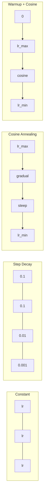
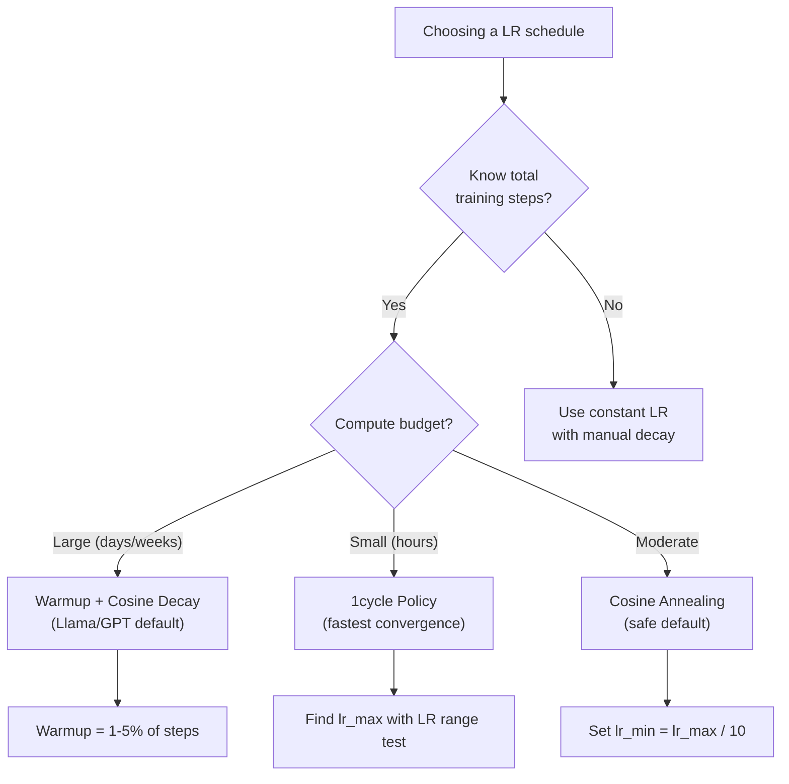
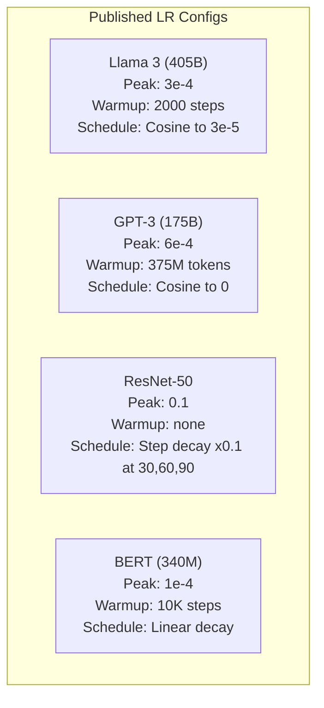

# Harmonogramy szybkości uczenia się i rozgrzewka

> Szybkość uczenia się jest najważniejszym hiperparametrem. Nie architektura. Nie rozmiar zbioru danych. Nie funkcja aktywacji. Szybkość uczenia się. Jeśli nie dostrajasz niczego innego, dostrój to.

**Typ:** Kompilacja
**Języki:** Python
**Wymagania wstępne:** Lekcja 03.06 (Optymalizatory), Lekcja 03.08 (Inicjalizacja odważników)
**Czas:** ~90 minut

## Cele nauczania

- Wdrożenie od podstaw harmonogramów stałych, zaniku krokowego, wyżarzania cosinusowego, rozgrzewania + cosinus i 1-cyklowego tempa uczenia się
- Zademonstrować trzy tryby awarii wyboru szybkości uczenia się: rozbieżność (zbyt wysoka), przeciągnięcie (zbyt niskie) i oscylacja (brak zaniku)
- Wyjaśnij, dlaczego rozgrzewka jest konieczna w przypadku optymalizatorów opartych na Adamie i jak stabilizuje ona wczesny trening
- Porównaj prędkość konwergencji we wszystkich pięciu harmonogramach tego samego zadania i wybierz odpowiedni dla danego budżetu szkoleniowego

## Problem

Ustaw szybkość uczenia się na 0,1. Trening jest zróżnicowany – strata skacze do nieskończoności w 3 krokach. Ustaw na 0,0001. Trening pełza – po 100 epokach model ledwo zmienił się z przypadkowego. Ustaw na 0,01. Trening działa przez 50 epok, po czym strata oscyluje wokół minimum, którego nigdy nie osiągnie, bo kroki są za duże.

Optymalna szybkość uczenia się nie jest stała. To się zmienia w trakcie treningu. Na początku chcesz, aby duże stopnie szybko pokryły ziemię. Pod koniec treningu chcesz, aby małe kroki osiągnęły wyraźne minimum. Różnica między modelem o dokładności 90% a modelem o dokładności 95% często polega na harmonogramie.

Każdy główny model opublikowany w ciągu ostatnich trzech lat wykorzystuje harmonogram tempa uczenia się. Lama 3 wykorzystała szczyt lr=3e-4 z 2000 etapami rozgrzewania i rozpadem cosinusa do 3e-5. GPT-3 wykorzystał lr=6e-4 przy rozgrzewce ponad 375 milionów tokenów. To nie są arbitralne wybory. Są one wynikiem szeroko zakrojonych przeglądów hiperparametrów, które kosztują miliony dolarów.

Musisz zrozumieć harmonogramy, ponieważ ustawienia domyślne nie będą działać w przypadku Twojego problemu. Po dostrojeniu wstępnie wytrenowanego modelu odpowiedni harmonogram różni się od trenowania od zera. W przypadku zwiększenia wielkości partii należy zmienić okres nagrzewania. Kiedy trening ma przerwę w kroku 10 000, musisz wiedzieć, czy jest to problem z harmonogramem, czy coś innego.

## Koncepcja

### Stała szybkość uczenia się

Najprostsze podejście. Wybierz liczbę i używaj jej na każdym kroku.

```
lr(t) = lr_0
```

Rzadko optymalne. Jest albo za wysoka na koniec treningu (oscylacja wokół minimum), albo za niska na początek (marnowanie mocy obliczeniowej na małe kroki). Działa dobrze w przypadku małych modeli i debugowania. Fatalny wybór na wszystko, co trenuje dłużej niż godzinę.

### Krok zaniku

Podejście oldschoolowe z ery ResNet. Zmniejsz szybkość uczenia się o współczynnik (zwykle 10x) w ustalonych epokach.

```
lr(t) = lr_0 * gamma^(floor(epoch / step_size))
```

Gdzie gamma = 0,1 i step_size = 30 oznaczają: lr spada 10x co 30 epok. ResNet-50 użył tego - lr = 0,1, spadek o 10x w epokach 30, 60 i 90.

Problem: optymalne punkty zaniku zależą od zbioru danych i architektury. Przejdź do innego problemu i musisz ponownie dostroić, kiedy upuścić. Przejścia są nagłe – strata może gwałtownie wzrosnąć, gdy kurs nagle się zmieni.

### Wyżarzanie cosinusowe

Płynny zanik od maksymalnej szybkości uczenia się do minimum, zgodnie z krzywą cosinus:

```
lr(t) = lr_min + 0.5 * (lr_max - lr_min) * (1 + cos(pi * t / T))
```

Gdzie t to bieżący krok, a T to całkowita liczba kroków.

W t=0 człon cosinus wynosi 1, zatem lr = lr_max. W t=T człon cosinus wynosi -1, zatem lr = lr_min. Zanik początkowo jest łagodny, w połowie przyspiesza, a pod koniec znów staje się łagodny.

Jest to ustawienie domyślne w przypadku większości nowoczesnych przebiegów treningowych. Brak hiperparametrów do dostrojenia poza lr_max i lr_min. Kształt cosinusa odpowiada obserwacji empirycznej, że większość nauki odbywa się w trakcie treningu – w tym krytycznym okresie potrzebne są rozsądne rozmiary kroków.

### Rozgrzewka: dlaczego zaczynasz od małych rzeczy

Adam i inne optymalizatory adaptacyjne utrzymują bieżące szacunki średniej i wariancji gradientu. W kroku 0 te szacunki są inicjowane do zera. Kilka pierwszych aktualizacji gradientów opiera się na statystykach śmieci. Jeśli w tym okresie tempo uczenia się jest duże, model wykonuje ogromne, źle ukierunkowane kroki.

Rozgrzewka to rozwiązuje. Zacznij od niewielkiej szybkości uczenia się (często lr_max / Warmup_steps lub nawet zero) i liniowo zwiększaj do lr_max w pierwszych N krokach. Do czasu osiągnięcia pełnego tempa uczenia się statystyki Adama ustabilizują się.

```
lr(t) = lr_max * (t / warmup_steps)     for t < warmup_steps
```

Typowa rozgrzewka: 1-5% wszystkich kroków treningowych. Lama 3 wytrenowała za ~1,8 biliona tokenów i rozgrzała się do wykonania 2000 kroków. GPT-3 rozgrzało ponad 375 milionów tokenów.

### Rozgrzewka liniowa + zanik cosinusa

Nowoczesne ustawienie domyślne. Zwiększaj liniowo, a następnie zanikaj z cosinusem:

```
if t < warmup_steps:
    lr(t) = lr_max * (t / warmup_steps)
else:
    progress = (t - warmup_steps) / (total_steps - warmup_steps)
    lr(t) = lr_min + 0.5 * (lr_max - lr_min) * (1 + cos(pi * progress))
```

Tego właśnie używają Llama, GPT, PaLM i większość nowoczesnych transformatorów. Rozgrzewka zapobiega wczesnej niestabilności. Rozpad cosinusa ustala model w dobrym minimum.

### Polityka 1cyklowa

Odkrycie Lesliego Smitha (2018): zwiększ tempo uczenia się z niskiej do wysokiej wartości w pierwszej połowie treningu, a następnie obniż je w drugiej połowie. To sprzeczne z intuicją – dlaczego miałbyś *zwiększyć* tempo uczenia się w połowie?

Teoria: wysoki współczynnik uczenia działa jak regularyzacja, dodając szum do trajektorii optymalizacji. Model bada więcej krajobrazu strat w fazie rozruchu, znajdując lepsze baseny. Następnie następuje faza opadania w obrębie najlepszego znalezionego basenu.

```
Phase 1 (0 to T/2):    lr ramps from lr_max/25 to lr_max
Phase 2 (T/2 to T):    lr ramps from lr_max to lr_max/10000
```

1 cykl często trenuje szybciej niż wyżarzanie cosinusowe przy stałym budżecie obliczeniowym. Kompromis: musisz znać z góry całkowitą liczbę kroków.

### Zaplanuj kształty



### Schemat podejmowania decyzji



### Liczby rzeczywiste z opublikowanych modeli



## Zbuduj to

### Krok 1: Zaplanuj funkcje

Każda funkcja wykonuje bieżący krok i zwraca szybkość uczenia się w tym kroku.

```python
import math

def constant_schedule(step, lr=0.01, **kwargs):
    return lr

def step_decay_schedule(step, lr=0.1, step_size=100, gamma=0.1, **kwargs):
    return lr * (gamma ** (step // step_size))

def cosine_schedule(step, lr=0.01, total_steps=1000, lr_min=1e-5, **kwargs):
    if step >= total_steps:
        return lr_min
    return lr_min + 0.5 * (lr - lr_min) * (1 + math.cos(math.pi * step / total_steps))

def warmup_cosine_schedule(step, lr=0.01, total_steps=1000, warmup_steps=100, lr_min=1e-5, **kwargs):
    if total_steps <= warmup_steps:
        return lr * (step / max(warmup_steps, 1))
    if step < warmup_steps:
        return lr * step / warmup_steps
    progress = (step - warmup_steps) / (total_steps - warmup_steps)
    return lr_min + 0.5 * (lr - lr_min) * (1 + math.cos(math.pi * progress))

def one_cycle_schedule(step, lr=0.01, total_steps=1000, **kwargs):
    mid = max(total_steps // 2, 1)
    if step < mid:
        return (lr / 25) + (lr - lr / 25) * step / mid
    else:
        progress = (step - mid) / max(total_steps - mid, 1)
        return lr * (1 - progress) + (lr / 10000) * progress
```

### Krok 2: Wizualizuj wszystkie harmonogramy

Wydrukuj wykres tekstowy pokazujący ewolucję każdego harmonogramu w trakcie szkolenia.

```python
def visualize_schedule(name, schedule_fn, total_steps=500, **kwargs):
    steps = list(range(0, total_steps, total_steps // 20))
    if total_steps - 1 not in steps:
        steps.append(total_steps - 1)

    lrs = [schedule_fn(s, total_steps=total_steps, **kwargs) for s in steps]
    max_lr = max(lrs) if max(lrs) > 0 else 1.0

    print(f"\n{name}:")
    for s, lr_val in zip(steps, lrs):
        bar_len = int(lr_val / max_lr * 40)
        bar = "#" * bar_len
        print(f"  Step {s:4d}: lr={lr_val:.6f} {bar}")
```

### Krok 3: Sieć szkoleniowa

Prosta sieć dwuwarstwowa na zbiorze danych okręgu, tak samo jak w poprzednich lekcjach, ale teraz zmieniamy harmonogram.

```python
import random

def sigmoid(x):
    x = max(-500, min(500, x))
    return 1.0 / (1.0 + math.exp(-x))

def relu(x):
    return max(0.0, x)

def relu_deriv(x):
    return 1.0 if x > 0 else 0.0

def make_circle_data(n=200, seed=42):
    random.seed(seed)
    data = []
    for _ in range(n):
        x = random.uniform(-2, 2)
        y = random.uniform(-2, 2)
        label = 1.0 if x * x + y * y < 1.5 else 0.0
        data.append(([x, y], label))
    return data

def train_with_schedule(schedule_fn, schedule_name, data, epochs=300, base_lr=0.05, **kwargs):
    random.seed(0)
    hidden_size = 8
    total_steps = epochs * len(data)

    std = math.sqrt(2.0 / 2)
    w1 = [[random.gauss(0, std) for _ in range(2)] for _ in range(hidden_size)]
    b1 = [0.0] * hidden_size
    w2 = [random.gauss(0, std) for _ in range(hidden_size)]
    b2 = 0.0

    step = 0
    epoch_losses = []

    for epoch in range(epochs):
        total_loss = 0
        correct = 0

        for x, target in data:
            lr = schedule_fn(step, lr=base_lr, total_steps=total_steps, **kwargs)

            z1 = []
            h = []
            for i in range(hidden_size):
                z = w1[i][0] * x[0] + w1[i][1] * x[1] + b1[i]
                z1.append(z)
                h.append(relu(z))

            z2 = sum(w2[i] * h[i] for i in range(hidden_size)) + b2
            out = sigmoid(z2)

            error = out - target
            d_out = error * out * (1 - out)

            for i in range(hidden_size):
                d_h = d_out * w2[i] * relu_deriv(z1[i])
                w2[i] -= lr * d_out * h[i]
                for j in range(2):
                    w1[i][j] -= lr * d_h * x[j]
                b1[i] -= lr * d_h
            b2 -= lr * d_out

            total_loss += (out - target) ** 2
            if (out >= 0.5) == (target >= 0.5):
                correct += 1
            step += 1

        avg_loss = total_loss / len(data)
        accuracy = correct / len(data) * 100
        epoch_losses.append(avg_loss)

    return epoch_losses
```

### Krok 4: Porównaj wszystkie harmonogramy

Trenuj tę samą sieć przy użyciu każdego harmonogramu i porównuj końcowe straty i zachowanie zbieżności.

```python
def compare_schedules(data):
    configs = [
        ("Constant", constant_schedule, {}),
        ("Step Decay", step_decay_schedule, {"step_size": 15000, "gamma": 0.1}),
        ("Cosine", cosine_schedule, {"lr_min": 1e-5}),
        ("Warmup+Cosine", warmup_cosine_schedule, {"warmup_steps": 3000, "lr_min": 1e-5}),
        ("1cycle", one_cycle_schedule, {}),
    ]

    print(f"\n{'Schedule':<20} {'Start Loss':>12} {'Mid Loss':>12} {'End Loss':>12} {'Best Loss':>12}")
    print("-" * 70)

    for name, schedule_fn, extra_kwargs in configs:
        losses = train_with_schedule(schedule_fn, name, data, epochs=300, base_lr=0.05, **extra_kwargs)
        mid_idx = len(losses) // 2
        best = min(losses)
        print(f"{name:<20} {losses[0]:>12.6f} {losses[mid_idx]:>12.6f} {losses[-1]:>12.6f} {best:>12.6f}")
```

### Krok 5: LR za wysoki vs za niski

Zademonstruj trzy tryby awarii: zbyt wysoki (rozbieżność), zbyt niski (pełzanie) i w sam raz.

```python
def lr_sensitivity(data):
    learning_rates = [1.0, 0.1, 0.01, 0.001, 0.0001]

    print("\nLR Sensitivity (constant schedule, 100 epochs):")
    print(f"  {'LR':>10} {'Start Loss':>12} {'End Loss':>12} {'Status':>15}")
    print("  " + "-" * 52)

    for lr in learning_rates:
        losses = train_with_schedule(constant_schedule, f"lr={lr}", data, epochs=100, base_lr=lr)
        start = losses[0]
        end = losses[-1]

        if end > start or math.isnan(end) or end > 1.0:
            status = "DIVERGED"
        elif end > start * 0.9:
            status = "BARELY MOVED"
        elif end < 0.15:
            status = "CONVERGED"
        else:
            status = "LEARNING"

        end_str = f"{end:.6f}" if not math.isnan(end) else "NaN"
        print(f"  {lr:>10.4f} {start:>12.6f} {end_str:>12} {status:>15}")
```

## Użyj tego

PyTorch udostępnia harmonogramy w `torch.optim.lr_scheduler`:

```python
import torch
import torch.optim as optim
from torch.optim.lr_scheduler import CosineAnnealingLR, OneCycleLR, StepLR

model = nn.Sequential(nn.Linear(10, 64), nn.ReLU(), nn.Linear(64, 1))
optimizer = optim.Adam(model.parameters(), lr=3e-4)

scheduler = CosineAnnealingLR(optimizer, T_max=1000, eta_min=1e-5)

for step in range(1000):
    loss = train_step(model, optimizer)
    scheduler.step()
```

Aby uzyskać rozgrzewkę + cosinus, użyj harmonogramu lambda lub `get_cosine_schedule_with_warmup` z HuggingFace:

```python
from transformers import get_cosine_schedule_with_warmup

scheduler = get_cosine_schedule_with_warmup(
    optimizer,
    num_warmup_steps=2000,
    num_training_steps=100000,
)
```

Funkcja HuggingFace jest używana przez większość skryptów dostrajających Lamy i GPT. W razie wątpliwości użyj rozgrzewki + cosinus z rozgrzewką = 3-5% całkowitej liczby kroków. Działa prawie na wszystko.

## Wyślij to

Ta lekcja daje:
- `outputs/prompt-lr-schedule-advisor.md` – monit zalecający odpowiedni harmonogram tempa uczenia się i hiperparametry dla konfiguracji treningu

## Ćwiczenia

1. Zastosuj rozkład wykładniczy: lr(t) = lr_0 * gamma^t gdzie gamma = 0,999. Porównanie z wyżarzaniem cosinusowym w zbiorze danych okręgu.

2. Wykonaj test zakresu szybkości uczenia się (Leslie Smith): trenuj przez kilkaset kroków, wykładniczo zwiększając LR z 1e-7 do 1. Strata wykresu vs LR. Optymalny maksymalny LR występuje tuż przed tym, jak strata zaczyna rosnąć.

3. Trenuj z rozgrzewką + cosinus, ale zmieniaj długość rozgrzewki: 0%, 1%, 5%, 10%, 20% całkowitej liczby kroków. Znajdź optymalny punkt, w którym trening jest najbardziej stabilny.

4. Zaimplementuj wyżarzanie cosinusowe z ciepłymi restartami (SGDR): zresetuj szybkość uczenia się do lr_max co T kroków i ponownie zanikaj. Porównaj ze standardowym cosinusem podczas dłuższej serii treningowej.

5. Zbuduj „chirurga harmonogramu”, który monitoruje straty treningowe i automatycznie przełącza się z rozgrzewki na cosinus, gdy strata się ustabilizuje, i zmniejsza lr, jeśli plateau strat trwa zbyt długo.

## Kluczowe terminy

| Termin | Co ludzie mówią | Co to właściwie oznacza |
|------|----------------|----------------------|
| Szybkość uczenia się | „Jak szybko model się uczy” | Skalar mnożący gradient w celu określenia rozmiaru aktualizacji parametru |
| Harmonogram | „Zmieniaj LR w czasie” | Funkcja odwzorowująca etap uczenia się na szybkość uczenia się, zaprojektowana w celu optymalizacji zbieżności |
| Rozgrzewka | „Zacznij od małego LR” | Liniowe zwiększanie LR od wartości bliskiej zera do wartości docelowej w pierwszych N krokach w celu ustabilizowania statystyk optymalizatora |
| Wyżarzanie cosinusowe | „Gładki zanik LR” | Zmniejszanie LR po krzywej cosinus od lr_max do lr_min w trakcie treningu |
| Zanik krokowy | „Porzuć LR przy kamieniach milowych” | Mnożenie LR przez współczynnik (zwykle 0,1) w stałych odstępach epok |
| Polityka 1 cyklu | „W górę i w dół” | Metoda Lesliego Smitha polegająca na zwiększaniu i zmniejszaniu LR w jednym cyklu w celu szybszej konwergencji |
| Test zasięgu LR | „Znajdź najlepszą szybkość uczenia się” | Trenuj krótko, zwiększając LR, aby znaleźć wartość, przy której strata zaczyna się rozchodzić |
| Cosinus z ciepłym restartem | „Zresetuj i powtórz” | Okresowe resetowanie LR do lr_max i ponowne zanikanie (SGDR) |
| Minuta | „Podłoga dla LR” | Minimalna szybkość uczenia się, do której harmonogram maleje |
| Szczytowy współczynnik uczenia się | „Maksymalny LR” | Najwyższy LR osiągnięty podczas treningu, zazwyczaj po rozgrzewce |

## Dalsze czytanie

- Loshchilov i Hutter, „SGDR: Stochastic Gradient Descent with Warm Restarts” (2017) — wprowadzili wyżarzanie cosinusowe i ciepłe restarty
– Smith, „Super-Convergence: Very Fast Training of Neural Networks Using Large Learning Rate” (2018) – dokument strategiczny dotyczący pierwszego cyklu
– Touvron i in., „Llama 2: Open Foundation and Fine-Tuned Chat Models” (2023) – dokumentuje harmonogram rozgrzewki + cosinus stosowany na dużą skalę
- Goyal i in., „Accurate, Large Minibatch SGD: Training ImageNet in 1 Hour” (2017) — reguła skalowania liniowego i rozgrzewka w przypadku treningu dużych partii