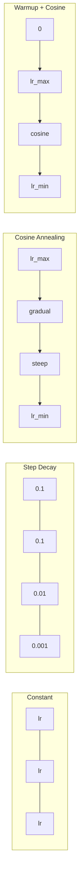
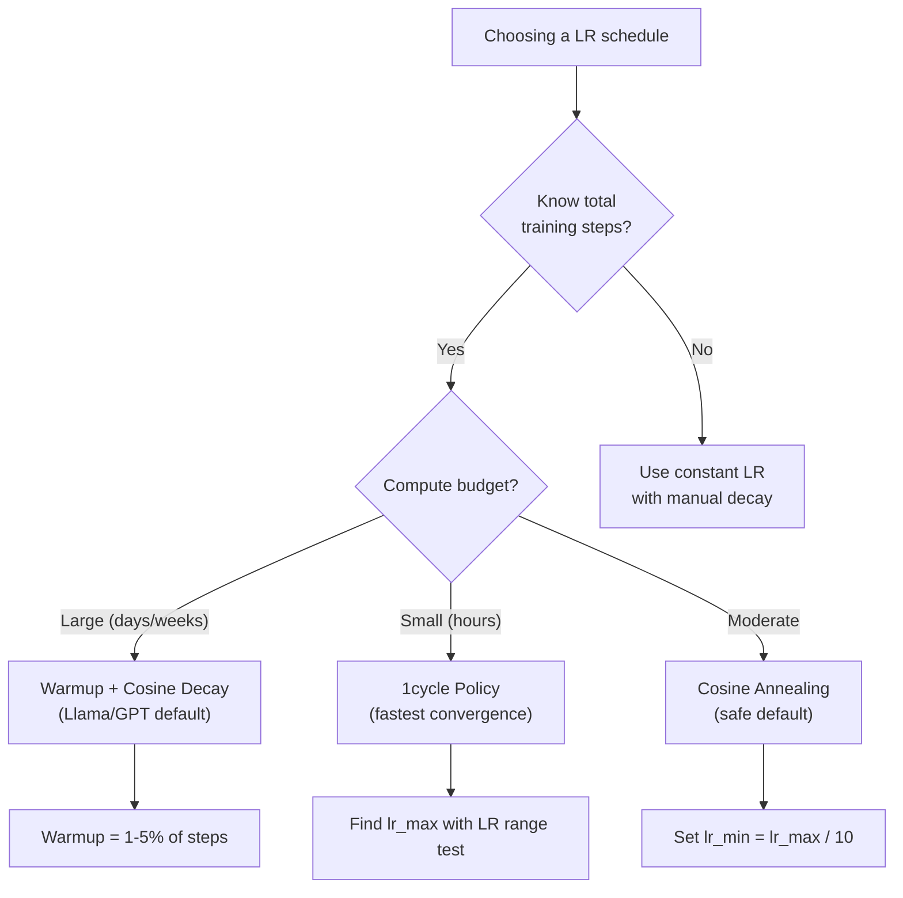
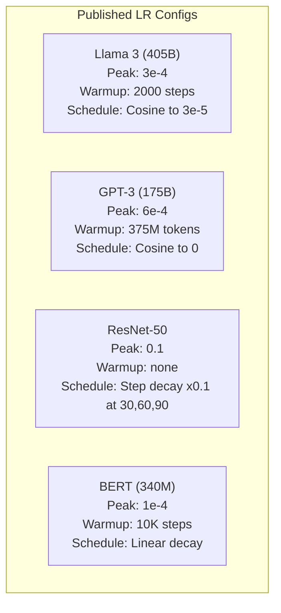

# Harmonogramy współczynnika uczenia i rozgrzewka (warmup)

> Współczynnik uczenia (learning rate) jest najważniejszym pojedynczym hiperparametrem. Nie architektura. Nie rozmiar zbioru danych. Nie funkcja aktywacji. Współczynnik uczenia. Jeśli nie dostroisz nic innego, dostrój właśnie to.

**Typ:** Build
**Języki:** Python
**Wymagania wstępne:** Lekcja 03.06 (Optymalizatory), Lekcja 03.08 (Inicjalizacja wag)
**Czas:** ~90 minut

## Cele nauki

- Zaimplementuj od podstaw harmonogramy stałego współczynnika uczenia, step decay, cosine annealing, warmup + cosine oraz 1cycle
- Zademonstruj trzy modi awarii doboru współczynnika uczenia: dywergencja (zbyt wysoki), zastój (zbyt niski) oraz oscylacje (brak zanikania)
- Wyjaśnij, dlaczego warmup jest niezbędny dla optymalizatorów typu Adam i jak stabilizuje wczesny trening
- Porównaj szybkość zbieżności wszystkich pięciu harmonogramów na tym samym zadaniu i wybierz odpowiedni dla danego budżetu treningowego

## Problem

Ustaw współczynnik uczenia na 0.1. Trening rozjeżdża się -- strata skacze do nieskończoności w 3 krokach. Ustaw go na 0.0001. Trening pełznie -- po 100 epokach model zaledwie ruszył się od stanu losowego. Ustaw go na 0.01. Trening działa przez 50 epok, a potem strata oscyluje wokół minimum, którego nigdy nie osiągnie, bo kroki są za duże.

Optymalny współczynnik uczenia nie jest wartością stałą. Zmienia się w trakcie treningu. Na początku chcesz dużych kroków, by szybko pokryć przestrzeń. Pod koniec treningu chcesz drobnych kroków, by osiąść w ostrym minimum. Różnica między modelem o dokładności 90% a modelem o dokładności 95% to często właśnie harmonogram.

Każdy główny model opublikowany w ostatnich trzech latach korzysta z harmonogramu współczynnika uczenia. Llama 3 użyła szczytowego lr=3e-4 z 2000 krokami warmup i zanikaniem kosinusowym do 3e-5. GPT-3 użył lr=6e-4 z warmup na przestrzeni 375 milionów tokenów. To nie są arbitralne wybory. Są wynikiem rozległych przeszukiwań hiperparametrów, które kosztowały miliony dolarów.

Musisz rozumieć harmonogramy, ponieważ wartości domyślne nie zadziałają w Twoim problemie. Gdy douczasz wstępnie wytrenowany model (fine-tuning), właściwy harmonogram jest inny niż w treningu od zera. Gdy zwiększasz rozmiar batcha, okres warmup musi się zmienić. Gdy trening psuje się w kroku 10 000, musisz wiedzieć, czy to problem harmonogramu, czy coś innego.

## Koncepcja

### Stały współczynnik uczenia

Najprostsze podejście. Wybierz liczbę, używaj jej w każdym kroku.

```
lr(t) = lr_0
```

Rzadko jest optymalny. Albo jest zbyt wysoki na koniec treningu (oscylacje wokół minimum), albo zbyt niski na początek (zmarnowane obliczenia na drobne kroki). Działa dobrze dla małych modeli i debugowania. Okropny wybór dla wszystkiego, co trenuje się dłużej niż godzinę.

### Step Decay

Podejście ze starej szkoły, z ery ResNet. Zmniejsz współczynnik uczenia o pewny czynnik (zwykle 10x) w ustalonych epokach.

```
lr(t) = lr_0 * gamma^(floor(epoch / step_size))
```

Gdzie gamma = 0.1 i step_size = 30 oznacza: lr spada 10x co 30 epok. ResNet-50 używał tego -- lr=0.1, spadek 10x w epokach 30, 60 i 90.

Problem: optymalne momenty zanikania zależą od zbioru danych i architektury. Przejdź do innego problemu i musisz na nowo dostroić, kiedy zmniejszać. Przejścia są nagłe -- strata może wystrzelić, gdy współczynnik nagle się zmienia.

### Cosine Annealing

Płynne zanikanie od maksymalnego współczynnika uczenia do minimalnego, zgodnie z krzywą kosinusową:

```
lr(t) = lr_min + 0.5 * (lr_max - lr_min) * (1 + cos(pi * t / T))
```

Gdzie t to aktualny krok, a T to całkowita liczba kroków.

Przy t=0 wartość kosinusa to 1, więc lr = lr_max. Przy t=T wartość kosinusa to -1, więc lr = lr_min. Zanikanie jest na początku łagodne, przyspiesza w środku i ponownie staje się łagodne pod koniec.

To domyślny wybór dla większości nowoczesnych przebiegów treningowych. Brak hiperparametrów do dostrojenia poza lr_max i lr_min. Kształt kosinusa odpowiada empirycznej obserwacji, że większość uczenia odbywa się w środkowej części treningu -- chcesz rozsądnych rozmiarów kroków w tym kluczowym okresie.

### Warmup: dlaczego zaczynasz od małych wartości

Adam i inne adaptacyjne optymalizatory utrzymują bieżące estymaty średniej i wariancji gradientu. W kroku 0 te estymaty są zainicjowane na zero. Pierwsze kilka aktualizacji gradientu opiera się na bezwartościowych statystykach. Jeśli Twój współczynnik uczenia jest duży w tym okresie, model wykonuje ogromne, słabo ukierunkowane kroki.

Warmup to naprawia. Zacznij od minimalnego współczynnika uczenia (często lr_max / warmup_steps lub nawet zero) i liniowo zwiększaj go do lr_max przez pierwsze N kroków. Gdy dojdziesz do pełnego współczynnika uczenia, statystyki Adama już się ustabilizowały.

```
lr(t) = lr_max * (t / warmup_steps)     dla t < warmup_steps
```

Typowy warmup: 1-5% całkowitych kroków treningu. Llama 3 trenowała na ~1.8 bilionie tokenów i miała warmup na 2000 kroków. GPT-3 miał warmup na przestrzeni 375 milionów tokenów.

### Liniowy Warmup + zanikanie kosinusowe

Nowoczesny standard. Liniowy wzrost, następnie zanikanie kosinusowe:

```
if t < warmup_steps:
    lr(t) = lr_max * (t / warmup_steps)
else:
    progress = (t - warmup_steps) / (total_steps - warmup_steps)
    lr(t) = lr_min + 0.5 * (lr_max - lr_min) * (1 + cos(pi * progress))
```

Tego używają Llama, GPT, PaLM i większość nowoczesnych transformerów. Warmup zapobiega wczesnej niestabilności. Zanikanie kosinusowe osadza model w dobrym minimum.

### Polityka 1cycle

Odkrycie Leslie Smitha (2018): zwiększaj współczynnik uczenia od niskiej do wysokiej wartości w pierwszej połowie treningu, a następnie zmniejszaj go w drugiej połowie. Sprzeczne z intuicją -- czemu *zwiększać* współczynnik uczenia w połowie treningu?

Teoria: wysoki współczynnik uczenia działa jako regularyzacja, dodając szum do trajektorii optymalizacji. Model eksploruje większą część krajobrazu funkcji straty w fazie narastania, znajdując lepsze baseny. Faza opadania następnie dopracowuje wynik w najlepszym znalezionym basenie.

```
Faza 1 (0 do T/2):    lr narasta od lr_max/25 do lr_max
Faza 2 (T/2 do T):    lr opada od lr_max do lr_max/10000
```

1cycle często trenuje szybciej niż cosine annealing przy ustalonym budżecie obliczeniowym. Kompromis: musisz znać całkowitą liczbę kroków z wyprzedzeniem.

### Kształty harmonogramów



### Schemat decyzyjny



### Rzeczywiste liczby z opublikowanych modeli



## Zbuduj to

### Krok 1: Funkcje harmonogramów

Każda funkcja przyjmuje aktualny krok i zwraca współczynnik uczenia w tym kroku.

```python
import math


def constant_schedule(step, lr=0.01, **kwargs):
    return lr


def step_decay_schedule(step, lr=0.1, step_size=100, gamma=0.1, **kwargs):
    return lr * (gamma ** (step // step_size))


def cosine_schedule(step, lr=0.01, total_steps=1000, lr_min=1e-5, **kwargs):
    if step >= total_steps:
        return lr_min
    return lr_min + 0.5 * (lr - lr_min) * (1 + math.cos(math.pi * step / total_steps))


def warmup_cosine_schedule(step, lr=0.01, total_steps=1000, warmup_steps=100, lr_min=1e-5, **kwargs):
    if total_steps <= warmup_steps:
        return lr * (step / max(warmup_steps, 1))
    if step < warmup_steps:
        return lr * step / warmup_steps
    progress = (step - warmup_steps) / (total_steps - warmup_steps)
    return lr_min + 0.5 * (lr - lr_min) * (1 + math.cos(math.pi * progress))


def one_cycle_schedule(step, lr=0.01, total_steps=1000, **kwargs):
    mid = max(total_steps // 2, 1)
    if step < mid:
        return (lr / 25) + (lr - lr / 25) * step / mid
    else:
        progress = (step - mid) / max(total_steps - mid, 1)
        return lr * (1 - progress) + (lr / 10000) * progress
```

### Krok 2: Wizualizacja wszystkich harmonogramów

Wypisz tekstowy wykres pokazujący, jak każdy harmonogram zmienia się w trakcie treningu.

```python
def visualize_schedule(name, schedule_fn, total_steps=500, **kwargs):
    steps = list(range(0, total_steps, total_steps // 20))
    if total_steps - 1 not in steps:
        steps.append(total_steps - 1)

    lrs = [schedule_fn(s, total_steps=total_steps, **kwargs) for s in steps]
    max_lr = max(lrs) if max(lrs) > 0 else 1.0

    print(f"\n{name}:")
    for s, lr_val in zip(steps, lrs):
        bar_len = int(lr_val / max_lr * 40)
        bar = "#" * bar_len
        print(f"  Step {s:4d}: lr={lr_val:.6f} {bar}")
```

### Krok 3: Sieć treningowa

Prosta dwuwarstwowa sieć na zbiorze danych "circle", taki jak w poprzednich lekcjach, ale teraz zmieniamy harmonogram.

```python
import random


def sigmoid(x):
    x = max(-500, min(500, x))
    return 1.0 / (1.0 + math.exp(-x))


def relu(x):
    return max(0.0, x)


def relu_deriv(x):
    return 1.0 if x > 0 else 0.0


def make_circle_data(n=200, seed=42):
    random.seed(seed)
    data = []
    for _ in range(n):
        x = random.uniform(-2, 2)
        y = random.uniform(-2, 2)
        label = 1.0 if x * x + y * y < 1.5 else 0.0
        data.append(([x, y], label))
    return data


def train_with_schedule(schedule_fn, schedule_name, data, epochs=300, base_lr=0.05, **kwargs):
    random.seed(0)
    hidden_size = 8
    total_steps = epochs * len(data)

    std = math.sqrt(2.0 / 2)
    w1 = [[random.gauss(0, std) for _ in range(2)] for _ in range(hidden_size)]
    b1 = [0.0] * hidden_size
    w2 = [random.gauss(0, std) for _ in range(hidden_size)]
    b2 = 0.0

    step = 0
    epoch_losses = []

    for epoch in range(epochs):
        total_loss = 0
        correct = 0

        for x, target in data:
            lr = schedule_fn(step, lr=base_lr, total_steps=total_steps, **kwargs)

            z1 = []
            h = []
            for i in range(hidden_size):
                z = w1[i][0] * x[0] + w1[i][1] * x[1] + b1[i]
                z1.append(z)
                h.append(relu(z))

            z2 = sum(w2[i] * h[i] for i in range(hidden_size)) + b2
            out = sigmoid(z2)

            error = out - target
            d_out = error * out * (1 - out)

            for i in range(hidden_size):
                d_h = d_out * w2[i] * relu_deriv(z1[i])
                w2[i] -= lr * d_out * h[i]
                for j in range(2):
                    w1[i][j] -= lr * d_h * x[j]
                b1[i] -= lr * d_h
            b2 -= lr * d_out

            total_loss += (out - target) ** 2
            if (out >= 0.5) == (target >= 0.5):
                correct += 1
            step += 1

        avg_loss = total_loss / len(data)
        accuracy = correct / len(data) * 100
        epoch_losses.append(avg_loss)

    return epoch_losses
```

### Krok 4: Porównanie wszystkich harmonogramów

Wytrenuj tę samą sieć z każdym harmonogramem i porównaj końcową stratę oraz zachowanie zbieżności.

```python
def compare_schedules(data):
    configs = [
        ("Constant", constant_schedule, {}),
        ("Step Decay", step_decay_schedule, {"step_size": 15000, "gamma": 0.1}),
        ("Cosine", cosine_schedule, {"lr_min": 1e-5}),
        ("Warmup+Cosine", warmup_cosine_schedule, {"warmup_steps": 3000, "lr_min": 1e-5}),
        ("1cycle", one_cycle_schedule, {}),
    ]

    print(f"\n{'Schedule':<20} {'Start Loss':>12} {'Mid Loss':>12} {'End Loss':>12} {'Best Loss':>12}")
    print("-" * 70)

    for name, schedule_fn, extra_kwargs in configs:
        losses = train_with_schedule(schedule_fn, name, data, epochs=300, base_lr=0.05, **extra_kwargs)
        mid_idx = len(losses) // 2
        best = min(losses)
        print(f"{name:<20} {losses[0]:>12.6f} {losses[mid_idx]:>12.6f} {losses[-1]:>12.6f} {best:>12.6f}")
```

### Krok 5: Współczynnik uczenia za wysoki vs za niski

Zademonstruj trzy modi awarii: za wysoki (dywergencja), za niski (pełznięcie) i właściwy.

```python
def lr_sensitivity(data):
    learning_rates = [1.0, 0.1, 0.01, 0.001, 0.0001]

    print("\nLR Sensitivity (constant schedule, 100 epochs):")
    print(f"  {'LR':>10} {'Start Loss':>12} {'End Loss':>12} {'Status':>15}")
    print("  " + "-" * 52)

    for lr in learning_rates:
        losses = train_with_schedule(constant_schedule, f"lr={lr}", data, epochs=100, base_lr=lr)
        start = losses[0]
        end = losses[-1]

        if end > start or math.isnan(end) or end > 1.0:
            status = "DIVERGED"
        elif end > start * 0.9:
            status = "BARELY MOVED"
        elif end < 0.15:
            status = "CONVERGED"
        else:
            status = "LEARNING"

        end_str = f"{end:.6f}" if not math.isnan(end) else "NaN"
        print(f"  {lr:>10.4f} {start:>12.6f} {end_str:>12} {status:>15}")
```

## Użyj tego

PyTorch udostępnia harmonogramy w `torch.optim.lr_scheduler`:

```python
import torch
import torch.optim as optim
from torch.optim.lr_scheduler import CosineAnnealingLR, OneCycleLR, StepLR

model = nn.Sequential(nn.Linear(10, 64), nn.ReLU(), nn.Linear(64, 1))
optimizer = optim.Adam(model.parameters(), lr=3e-4)

scheduler = CosineAnnealingLR(optimizer, T_max=1000, eta_min=1e-5)

for step in range(1000):
    loss = train_step(model, optimizer)
    scheduler.step()
```

Dla warmup + cosine użyj harmonogramu typu lambda lub funkcji `get_cosine_schedule_with_warmup` z HuggingFace:

```python
from transformers import get_cosine_schedule_with_warmup

scheduler = get_cosine_schedule_with_warmup(
    optimizer,
    num_warmup_steps=2000,
    num_training_steps=100000,
)
```

Funkcja z HuggingFace jest tym, co wykorzystuje większość skryptów fine-tuningu Llama i GPT. Jeśli nie jesteś pewien, użyj warmup + cosine z warmup = 3-5% wszystkich kroków. Działa to w prawie każdym przypadku.

## Wypchnij to

Ta lekcja wytwarza:
- `outputs/prompt-lr-schedule-advisor.md` -- prompt, który zaleca właściwy harmonogram współczynnika uczenia i hiperparametry dla Twojej konfiguracji treningowej

## Ćwiczenia

1. Zaimplementuj zanikanie wykładnicze: lr(t) = lr_0 * gamma^t, gdzie gamma = 0.999. Porównaj z cosine annealing na zbiorze danych "circle".

2. Zaimplementuj test zakresu współczynnika uczenia (LR range test) (Leslie Smith): trenuj przez kilkaset kroków, wykładniczo zwiększając LR od 1e-7 do 1. Wykreśl stratę w funkcji LR. Optymalny maksymalny LR to wartość tuż przed momentem, gdy strata zaczyna rosnąć.

3. Trenuj z warmup + cosine, ale zmieniaj długość warmup: 0%, 1%, 5%, 10%, 20% wszystkich kroków. Znajdź punkt optymalny, w którym trening jest najbardziej stabilny.

4. Zaimplementuj cosine annealing z ciepłymi restartami (SGDR): resetuj współczynnik uczenia do lr_max co T kroków i ponownie zanikaj. Porównaj ze standardowym cosine na dłuższym przebiegu treningowym.

5. Zbuduj "chirurga harmonogramów" (schedule surgeon), który monitoruje stratę treningową i automatycznie przełącza z warmup na cosine, gdy strata się stabilizuje, oraz zmniejsza lr, jeśli strata zbyt długo stoi w miejscu (plateau).

## Kluczowe terminy

| Termin | Co się mówi | Co to faktycznie znaczy |
|------|----------------|----------------------|
| Learning rate (współczynnik uczenia) | "Jak szybko model się uczy" | Skalar, który mnoży gradient, aby określić wielkość aktualizacji parametrów |
| Schedule (harmonogram) | "Zmiana LR w czasie" | Funkcja mapująca krok treningu na współczynnik uczenia, zaprojektowana w celu optymalizacji zbieżności |
| Warmup (rozgrzewka) | "Zacznij od małego LR" | Liniowe zwiększanie LR od wartości bliskiej zeru do wartości docelowej w pierwszych N krokach, aby ustabilizować statystyki optymalizatora |
| Cosine annealing | "Płynne zanikanie LR" | Zmniejszanie LR zgodnie z krzywą kosinusową od lr_max do lr_min w trakcie treningu |
| Step decay | "Zmniejszanie LR w wybranych punktach" | Mnożenie LR przez czynnik (zwykle 0.1) w ustalonych odstępach epok |
| Polityka 1cycle | "Najpierw w górę, potem w dół" | Metoda Leslie Smitha polegająca na zwiększaniu LR, a następnie zmniejszaniu w ramach jednego cyklu, dla szybszej zbieżności |
| LR range test | "Znajdź najlepszy współczynnik uczenia" | Krótki trening ze zwiększaniem LR w celu znalezienia wartości, przy której strata zaczyna rozjeżdżać się (dywergować) |
| Cosine z ciepłymi restartami | "Resetuj i powtarzaj" | Okresowe resetowanie LR do lr_max i ponowne zanikanie (SGDR) |
| Eta min | "Dolna granica LR" | Minimalny współczynnik uczenia, do którego zanika harmonogram |
| Peak learning rate (szczytowy współczynnik uczenia) | "Maksymalny LR" | Najwyższy LR osiągany w trakcie treningu, zazwyczaj po warmup |

## Dalsze materiały

- Loshchilov & Hutter, "SGDR: Stochastic Gradient Descent with Warm Restarts" (2017) -- wprowadza cosine annealing i ciepłe restarty
- Smith, "Super-Convergence: Very Fast Training of Neural Networks Using Large Learning Rates" (2018) -- praca o polityce 1cycle
- Touvron et al., "Llama 2: Open Foundation and Fine-Tuned Chat Models" (2023) -- dokumentuje harmonogram warmup + cosine używany w dużej skali
- Goyal et al., "Accurate, Large Minibatch SGD: Training ImageNet in 1 Hour" (2017) -- reguła liniowego skalowania i warmup dla treningu z dużymi batchami
