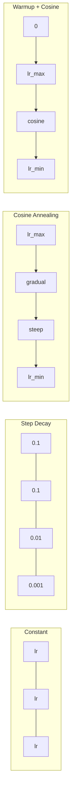
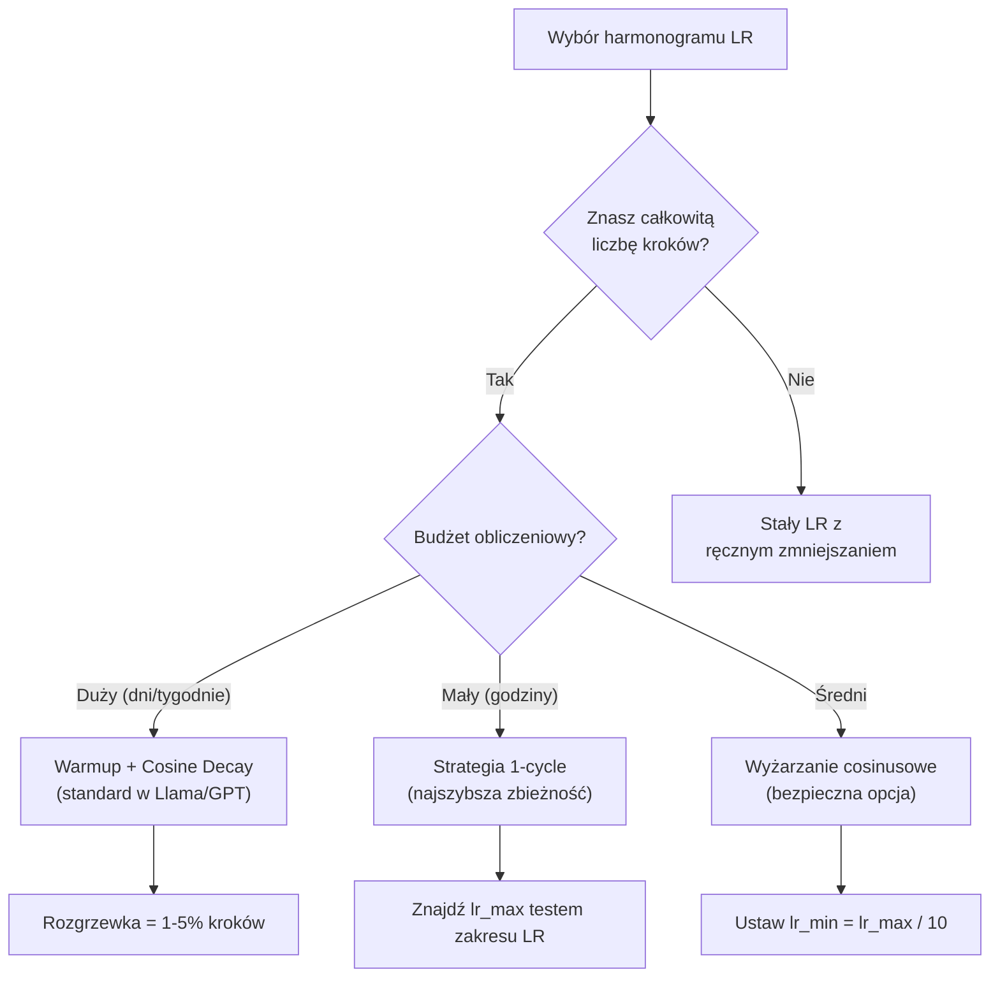
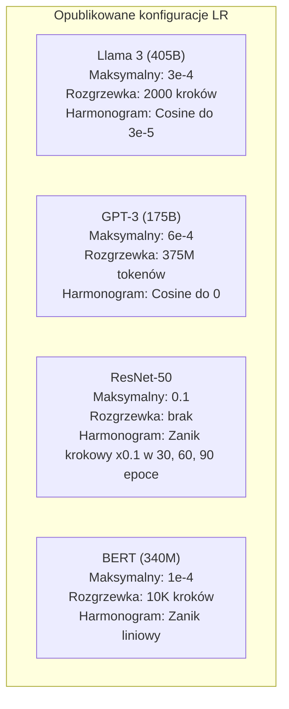

# Harmonogramy współczynnika uczenia się i rozgrzewka (Warmup)

> Współczynnik uczenia się jest najważniejszym hiperparametrem. Nie architektura. Nie rozmiar zbioru danych. Nie funkcja aktywacji. Współczynnik uczenia się. Jeśli nie dostrajasz niczego innego, dostrój właśnie go.

**Typ:** Kompilacja  
**Języki:** Python  
**Wymagania wstępne:** Lekcja 03.06 (Optymalizatory), Lekcja 03.08 (Inicjalizacja wag)  
**Czas:** ~90 minut  

## Cele kształcenia

- Implementacja od zera różnych harmonogramów współczynnika uczenia się: stałego, zaniku krokowego (step decay), wyżarzania cosinusowego (cosine annealing), rozgrzewki z zanikiem cosinusowym (warmup + cosine) oraz strategii jednoetapowej (1-cycle policy).
- Zademonstrowanie trzech typów błędów przy wyborze współczynnika uczenia się: rozbieżności (zbyt wysoki), utknięcia w miejscu (zbyt niski) i oscylacji (brak zaniku).
- Wyjaśnienie, dlaczego rozgrzewka (warmup) jest niezbędna w przypadku optymalizatorów opartych na Adamie i jak stabilizuje ona wczesny etap treningu.
- Porównanie szybkości zbieżności dla wszystkich pięciu harmonogramów w tym samym zadaniu i wybór odpowiedniego dla danego budżetu obliczeniowego.

## Problem

Ustawiasz współczynnik uczenia się (learning rate, LR) na 0,1. Trening staje się rozbieżny – strata rośnie do nieskończoności w zaledwie 3 krokach. Ustawiasz na 0,0001. Trening ledwo się posuwa – po 100 epokach model prawie nie różni się od stanu losowego. Ustawiasz na 0,01. Trening przebiega pomyślnie przez 50 epok, po czym strata zaczyna oscylować wokół minimum, którego model nigdy nie osiągnie, ponieważ kroki są zbyt duże.

Optymalny współczynnik uczenia się nie jest stały. Powinien zmieniać się w trakcie treningu. Na początku potrzebne są duże kroki, aby szybko pokryć przestrzeń parametrów. Pod koniec treningu kroki powinny być małe, aby precyzyjnie trafić w minimum. Różnica między modelem o dokładności 90% a 95% często sprowadza się właśnie do harmonogramu LR.

Każdy liczący się model opublikowany w ciągu ostatnich trzech lat wykorzystuje harmonogram współczynnika uczenia się. Llama 3 używała maksymalnego LR o wartości 3e-4 z 2000 kroków rozgrzewki i zaniku cosinusowego (cosine decay) do poziomu 3e-5. GPT-3 wykorzystywał LR 6e-4 z rozgrzewką trwającą ponad 375 milionów tokenów. To nie są przypadkowe decyzje. Są one wynikiem kosztownych (często wycenianych na miliony dolarów) procesów strojenia hiperparametrów.

Musisz zrozumieć harmonogramy, ponieważ domyślne ustawienia rzadko sprawdzają się w konkretnych zastosowaniach. Podczas dostrajania (fine-tuning) wstępnie wytrenowanego modelu odpowiedni harmonogram różni się od tego stosowanego przy trenowaniu od zera. W przypadku zwiększenia rozmiaru partii (batch size) należy dostosować okres rozgrzewki. Gdy trening zatrzymuje się w kroku 10 000, musisz wiedzieć, czy to problem z harmonogramem, czy też z innym elementem sieci.

## Koncepcja

### Stały współczynnik uczenia się (Constant Learning Rate)

Najprostsze podejście. Wybierz jedną wartość i używaj jej na każdym kroku.

```
lr(t) = lr_0
```

Rzadko optymalny. Jest albo za wysoki pod koniec treningu (oscylacja wokół minimum), albo za niski na początku (marnowanie mocy obliczeniowej na małe kroki). Sprawdza się dobrze w przypadku małych modeli i podczas debugowania. Fatalny wybór dla każdego procesu trwającego dłużej niż godzinę.

### Zanik krokowy (Step Decay)

Tradycyjne podejście z ery ResNet. Zmniejsz współczynnik uczenia się o określony czynnik (zwykle 10x) w ustalonych epokach.

```
lr(t) = lr_0 * gamma^(floor(epoch / step_size))
```

Gdzie gamma = 0,1, a step_size = 30 oznacza, że lr spada 10-krotnie co 30 epok. ResNet-50 używał tego podejścia – lr = 0,1, z 10-krotnym spadkiem w epokach 30, 60 i 90.

Problem: optymalne punkty spadku zależą od zbioru danych i architektury. W nowym problemie musisz na nowo dostrajać momenty redukcji. Przejścia są nagłe – strata może chwilowo gwałtownie wzrosnąć w momencie nagłej zmiany współczynnika.

### Wyżarzanie cosinusowe (Cosine Annealing)

Płynny zanik od maksymalnego do minimalnego współczynnika uczenia się według krzywej cosinusowej:

```
lr(t) = lr_min + 0.5 * (lr_max - lr_min) * (1 + cos(pi * t / T))
```

Gdzie t to bieżący krok, a T to całkowita liczba kroków.

Dla t=0 człon cosinusowy wynosi 1, więc lr = lr_max. Dla t=T człon cosinusowy wynosi -1, więc lr = lr_min. Zanik początkowo jest łagodny, w połowie przyspiesza, a pod koniec znów staje się łagodny.

Jest to domyślna opcja w większości nowoczesnych procesów treningowych. Poza lr_max i lr_min nie wymaga dodatkowego strojenia hiperparametrów. Kształt cosinusa odpowiada empirycznej obserwacji, że większość procesu uczenia zachodzi w środkowej fazie treningu – w tym krytycznym okresie potrzebne są stabilne, umiarkowane rozmiary kroków.

### Rozgrzewka (Warmup): dlaczego zaczynamy od małych wartości

Adam i inne optymalizatory adaptacyjne utrzymują bieżące szacunki średniej (pierwszy moment) i wariancji (drugi moment) gradientu. W kroku 0 szacunki te są inicjowane zerami. Pierwsze aktualizacje gradientów opierają się na mało wiarygodnych statystykach. Jeśli w tym okresie współczynnik uczenia się będzie wysoki, model wykona ogromne, błędne kroki w przestrzeni parametrów.

Rozgrzewka rozwiązuje ten problem. Zaczynamy od bardzo małego współczynnika uczenia się (często lr_max / warmup_steps lub nawet od zera) i liniowo zwiększamy go do wartości lr_max w pierwszych N krokach. Do czasu osiągnięcia pełnej wartości LR, statystyki Adama zdążą się ustabilizować.

```
lr(t) = lr_max * (t / warmup_steps)     dla t < warmup_steps
```

Typowa rozgrzewka obejmuje 1-5% wszystkich kroków treningowych. Llama 3 była trenowana na ~1,8 biliona tokenów i miała 2000 kroków rozgrzewki. GPT-3 rozgrzewał się przez pierwsze 375 milionów tokenów.

### Rozgrzewka liniowa + zanik cosinusowy (Warmup + Cosine Decay)

Nowoczesny standard. Najpierw liniowy wzrost współczynnika, a następnie jego płynne zmniejszanie według krzywej cosinusowej:

```
if t < warmup_steps:
    lr(t) = lr_max * (t / warmup_steps)
else:
    progress = (t - warmup_steps) / (total_steps - warmup_steps)
    lr(t) = lr_min + 0.5 * (lr_max - lr_min) * (1 + cos(pi * progress))
```

To podejście stosowane jest w Llama, GPT, PaLM i większości nowoczesnych transformerów. Rozgrzewka zapobiega początkowej niestabilności, a zanik cosinusowy pozwala modelowi precyzyjnie osiągnąć optymalne minimum.

### Strategia 1-cycle (One-Cycle Policy)

Odkrycie Lesliego Smitha (2018): zwiększaj współczynnik uczenia się od niskiej do wysokiej wartości w pierwszej połowie treningu, a następnie drastycznie go zmniejsz w drugiej połowie. Może brzmieć to nieintuicyjnie – dlaczego mielibyśmy zwiększać tempo uczenia się w trakcie treningu?

Teoria: wysoki współczynnik uczenia działa jak regularyzacja, wprowadzając szum do trajektorii optymalizacji. Model bada większy obszar funkcji straty w fazie wzrostu LR, co ułatwia znalezienie lepszych minimów lokalnych. Następnie następuje faza schodzenia w głąb najlepszego znalezionego obszaru.

```
Faza 1 (od 0 do T/2):    lr rośnie od lr_max/25 do lr_max
Faza 2 (od T/2 do T):    lr spada od lr_max do lr_max/10000
```

Polityka 1-cycle pozwala na szybszą zbieżność niż wyżarzanie cosinusowe przy tym samym budżecie obliczeniowym. Wymaga jednak wcześniejszego zdefiniowania całkowitej liczby kroków.

### Kształty harmonogramów



### Schemat decyzyjny



### Przykłady konfiguracji ze znanych modeli



## Implementacja krok po kroku

### Krok 1: Definicje funkcji harmonogramów

Każda funkcja przyjmuje bieżący krok i zwraca odpowiednią wartość współczynnika uczenia się.

```python
import math

def constant_schedule(step, lr=0.01, **kwargs):
    return lr

def step_decay_schedule(step, lr=0.1, step_size=100, gamma=0.1, **kwargs):
    return lr * (gamma ** (step // step_size))

def cosine_schedule(step, lr=0.01, total_steps=1000, lr_min=1e-5, **kwargs):
    if step >= total_steps:
        return lr_min
    return lr_min + 0.5 * (lr - lr_min) * (1 + math.cos(math.pi * step / total_steps))

def warmup_cosine_schedule(step, lr=0.01, total_steps=1000, warmup_steps=100, lr_min=1e-5, **kwargs):
    if total_steps <= warmup_steps:
        return lr * (step / max(warmup_steps, 1))
    if step < warmup_steps:
        return lr * step / warmup_steps
    progress = (step - warmup_steps) / (total_steps - warmup_steps)
    return lr_min + 0.5 * (lr - lr_min) * (1 + math.cos(math.pi * progress))

def one_cycle_schedule(step, lr=0.01, total_steps=1000, **kwargs):
    mid = max(total_steps // 2, 1)
    if step < mid:
        return (lr / 25) + (lr - lr / 25) * step / mid
    else:
        progress = (step - mid) / max(total_steps - mid, 1)
        return lr * (1 - progress) + (lr / 10000) * progress
```

### Krok 2: Wizualizacja harmonogramów w terminalu

Funkcja generująca uproszczony wykres tekstowy przedstawiający zmiany wartości LR w czasie.

```python
def visualize_schedule(name, schedule_fn, total_steps=500, **kwargs):
    steps = list(range(0, total_steps, total_steps // 20))
    if total_steps - 1 not in steps:
        steps.append(total_steps - 1)

    lrs = [schedule_fn(s, total_steps=total_steps, **kwargs) for s in steps]
    max_lr = max(lrs) if max(lrs) > 0 else 1.0

    print(f"\n{name}:")
    for s, lr_val in zip(steps, lrs):
        bar_len = int(lr_val / max_lr * 40)
        bar = "#" * bar_len
        print(f"  Krok {s:4d}: lr={lr_val:.6f} {bar}")
```

### Krok 3: Pętla treningowa sieci neuronowej

Wykorzystamy prostą, dwuwarstwową sieć uczącą się na zbiorze punktów w kształcie koła (analogicznie do poprzednich lekcji), dynamicznie modyfikując współczynnik uczenia się.

```python
import random

def sigmoid(x):
    x = max(-500, min(500, x))
    return 1.0 / (1.0 + math.exp(-x))

def relu(x):
    return max(0.0, x)

def relu_deriv(x):
    return 1.0 if x > 0 else 0.0

def make_circle_data(n=200, seed=42):
    random.seed(seed)
    data = []
    for _ in range(n):
        x = random.uniform(-2, 2)
        y = random.uniform(-2, 2)
        label = 1.0 if x * x + y * y < 1.5 else 0.0
        data.append(([x, y], label))
    return data

def train_with_schedule(schedule_fn, schedule_name, data, epochs=300, base_lr=0.05, **kwargs):
    random.seed(0)
    hidden_size = 8
    total_steps = epochs * len(data)

    std = math.sqrt(2.0 / 2)
    w1 = [[random.gauss(0, std) for _ in range(2)] for _ in range(hidden_size)]
    b1 = [0.0] * hidden_size
    w2 = [random.gauss(0, std) for _ in range(hidden_size)]
    b2 = 0.0

    step = 0
    epoch_losses = []

    for epoch in range(epochs):
        total_loss = 0
        correct = 0

        for x, target in data:
            lr = schedule_fn(step, lr=base_lr, total_steps=total_steps, **kwargs)

            z1 = []
            h = []
            for i in range(hidden_size):
                z = w1[i][0] * x[0] + w1[i][1] * x[1] + b1[i]
                z1.append(z)
                h.append(relu(z))

            z2 = sum(w2[i] * h[i] for i in range(hidden_size)) + b2
            out = sigmoid(z2)

            error = out - target
            d_out = error * out * (1 - out)

            for i in range(hidden_size):
                d_h = d_out * w2[i] * relu_deriv(z1[i])
                w2[i] -= lr * d_out * h[i]
                for j in range(2):
                    w1[i][j] -= lr * d_h * x[j]
                b1[i] -= lr * d_h
            b2 -= lr * d_out

            total_loss += (out - target) ** 2
            if (out >= 0.5) == (target >= 0.5):
                correct += 1
            step += 1

        avg_loss = total_loss / len(data)
        accuracy = correct / len(data) * 100
        epoch_losses.append(avg_loss)

    return epoch_losses
```

### Krok 4: Porównanie harmonogramów

Uruchomienie procesu uczenia tej samej sieci z różnymi harmonogramami w celu porównania ostatecznej straty i dynamiki zbieżności.

```python
def compare_schedules(data):
    configs = [
        ("Constant", constant_schedule, {}),
        ("Step Decay", step_decay_schedule, {"step_size": 15000, "gamma": 0.1}),
        ("Cosine", cosine_schedule, {"lr_min": 1e-5}),
        ("Warmup+Cosine", warmup_cosine_schedule, {"warmup_steps": 3000, "lr_min": 1e-5}),
        ("1cycle", one_cycle_schedule, {}),
    ]

    print(f"\n{'Harmonogram':<20} {'Strata pocz.':>12} {'Strata środk.':>12} {'Strata końc.':>12} {'Najlepsza str.':>12}")
    print("-" * 70)

    for name, schedule_fn, extra_kwargs in configs:
        losses = train_with_schedule(schedule_fn, name, data, epochs=300, base_lr=0.05, **extra_kwargs)
        mid_idx = len(losses) // 2
        best = min(losses)
        print(f"{name:<20} {losses[0]:>12.6f} {losses[mid_idx]:>12.6f} {losses[-1]:>12.6f} {best:>12.6f}")
```

### Krok 5: Analiza wrażliwości (za wysoki vs za niski LR)

Demonstracja trzech typowych zachowań: rozbieżności, zablokowania w miejscu oraz prawidłowej zbieżności.

```python
def lr_sensitivity(data):
    learning_rates = [1.0, 0.1, 0.01, 0.001, 0.0001]

    print("\nWrażliwość na LR (harmonogram stały, 100 epok):")
    print(f"  {'LR':>10} {'Strata pocz.':>12} {'Strata końc.':>12} {'Status':>15}")
    print("  " + "-" * 52)

    for lr in learning_rates:
        losses = train_with_schedule(constant_schedule, f"lr={lr}", data, epochs=100, base_lr=lr)
        start = losses[0]
        end = losses[-1]

        if end > start or math.isnan(end) or end > 1.0:
            status = "ROZBIEŻNY"
        elif end > start * 0.9:
            status = "BRAK ZMIAN"
        elif end < 0.15:
            status = "ZBIEŻNY"
        else:
            status = "UCZY SIĘ"

        end_str = f"{end:.6f}" if not math.isnan(end) else "NaN"
        print(f"  {lr:>10.4f} {start:>12.6f} {end_str:>12} {status:>15}")
```

## Wykorzystanie w bibliotece PyTorch

PyTorch udostępnia gotowe harmonogramy w module `torch.optim.lr_scheduler`:

```python
import torch
import torch.optim as optim
from torch.optim.lr_scheduler import CosineAnnealingLR, OneCycleLR, StepLR

model = nn.Sequential(nn.Linear(10, 64), nn.ReLU(), nn.Linear(64, 1))
optimizer = optim.Adam(model.parameters(), lr=3e-4)

# Konfiguracja wyżarzania cosinusowego
scheduler = CosineAnnealingLR(optimizer, T_max=1000, eta_min=1e-5)

for step in range(1000):
    loss = train_step(model, optimizer)
    scheduler.step()
```

Do realizacji rozgrzewki połączonej z zanikiem cosinusowym najwygodniej użyć funkcji `get_cosine_schedule_with_warmup` z biblioteki HuggingFace:

```python
from transformers import get_cosine_schedule_with_warmup

scheduler = get_cosine_schedule_with_warmup(
    optimizer,
    num_warmup_steps=2000,
    num_training_steps=100000,
)
```

Funkcja ta jest standardem w większości skryptów dostrajających modele Llama czy GPT. W razie wątpliwości wybierz rozgrzewkę + cosinus z okresem rozgrzewki wynoszącym 3-5% całkowitej liczby kroków – to uniwersalne i bezpieczne rozwiązanie.

## Zadania do samodzielnego wykonania

1. **Zanik wykładniczy:** Zaimplementuj harmonogram wykładniczy: $lr(t) = lr_0 \cdot \gamma^t$, gdzie $\gamma = 0,999$. Porównaj go z wyżarzaniem cosinusowym na zbiorze punktów w kształcie koła.
2. **Test zakresu współczynnika uczenia się (LR range test):** Zgodnie z metodą Lesliego Smitha, trenuj sieć przez kilkaset kroków, wykładniczo zwiększając LR od 1e-7 do 1. Wykreśl zależność straty od LR. Optymalna maksymalna wartość LR znajduje się tuż przed punktem, w którym strata zaczyna gwałtownie rosnąć.
3. **Analiza długości rozgrzewki:** Przetestuj rozgrzewkę z zanikiem cosinusowym, zmieniając długość rozgrzewki: 0%, 1%, 5%, 10%, 20% całkowitej liczby kroków. Znajdź optymalny punkt zapewniający największą stabilność procesu uczenia.
4. **Wyżarzanie cosinusowe z restartami (SGDR):** Zaimplementuj wyżarzanie cosinusowe z tzw. ciepłymi restartami – resetuj LR do wartości lr_max co T kroków i ponownie rozpoczynaj zanik. Porównaj z tradycyjnym wyżarzaniem w dłuższym treningu.
5. **Dynamiczny regulator harmonogramu:** Stwórz prosty algorytm monitorujący stratę treningową. Powinien on automatycznie przejść z fazy rozgrzewki do zaniku cosinusowego po ustabilizowaniu straty, a także zmniejszyć LR w przypadku wykrycia plateau.

## Słownik kluczowych pojęć

| Termin | Potoczne określenie | Co to dokładnie oznacza |
| :--- | :--- | :--- |
| **Współczynnik uczenia się (Learning Rate)** | „Jak szybko model się uczy” | Mnożnik gradientu określający wielkość aktualizacji wag na każdym kroku |
| **Harmonogram (Scheduler)** | „Zmiana LR w czasie” | Funkcja określająca wartość LR w zależności od numeru kroku treningowego w celu optymalizacji zbieżności |
| **Rozgrzewka (Warmup)** | „Rozgrzanie modelu małym LR” | Liniowe zwiększanie LR od wartości bliskiej zeru do wartości docelowej w pierwszych N krokach w celu stabilizacji statystyk optymalizatora |
| **Wyżarzanie cosinusowe (Cosine Annealing)** | „Gładki zanik LR” | Stopniowa redukcja LR według krzywej cosinusowej od lr_max do lr_min |
| **Zanik krokowy (Step Decay)** | „Stopniowe obniżanie LR” | Pomnożenie LR przez określony współczynnik (zwykle 0,1) po upływie zdefiniowanej liczby epok |
| **Strategia 1-cycle (One-Cycle Policy)** | „Najpierw w górę, potom w dół” | Metoda Lesliego Smitha polegająca na jednokrotnym zwiększeniu i późniejszym zmniejszeniu LR w celu przyspieszenia zbieżności |
| **Test zakresu LR (LR Range Test)** | „Szukanie optymalnego LR” | Krótki trening próbny z rosnącym LR mający na celu znalezienie momentu, w którym strata zaczyna drastycznie rosnąć |
| **Cosinus z ciepłym restartem** | „Reset i od nowa” | Okresowe przywracanie LR do wartości maksymalnej i ponowne wyżarzanie cosinusowe (SGDR) |
| **lr_min** | „Dolny próg LR” | Minimalny współczynnik uczenia się, do którego dąży harmonogram |
| **Szczytowy współczynnik uczenia się** | „Maksymalny LR” | Najwyższa wartość LR osiągana w trakcie uczenia (zazwyczaj tuż po zakończeniu fazy rozgrzewki) |

## Literatura uzupełniająca

- Loshchilov & Hutter, *„SGDR: Stochastic Gradient Descent with Warm Restarts”* (2017) – artykuł wprowadzający wyżarzanie cosinusowe i ciepłe restarty.
- Smith, *„Super-Convergence: Very Fast Training of Neural Networks Using Large Learning Rates”* (2018) – kluczowa publikacja dotycząca strategii 1-cycle.
- Touvron i in., *„Llama 2: Open Foundation and Fine-Tuned Chat Models”* (2023) – szczegółowy opis harmonogramu rozgrzewki i zaniku cosinusowego stosowanego w modelach wielkoskalowych.
- Goyal i in., *„Accurate, Large Minibatch SGD: Training ImageNet in 1 Hour”* (2017) – omówienie reguły liniowego skalowania oraz roli rozgrzewki przy dużych rozmiarach partii.
