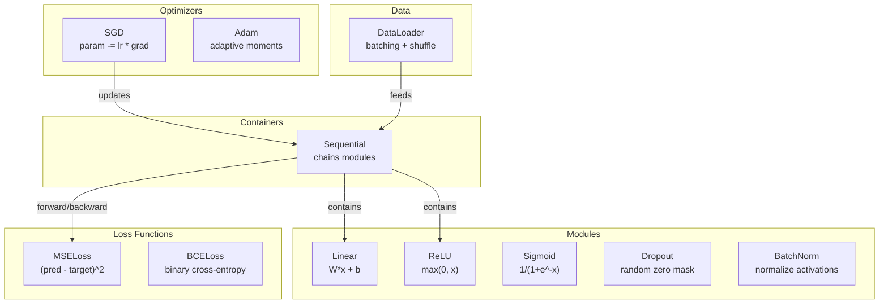
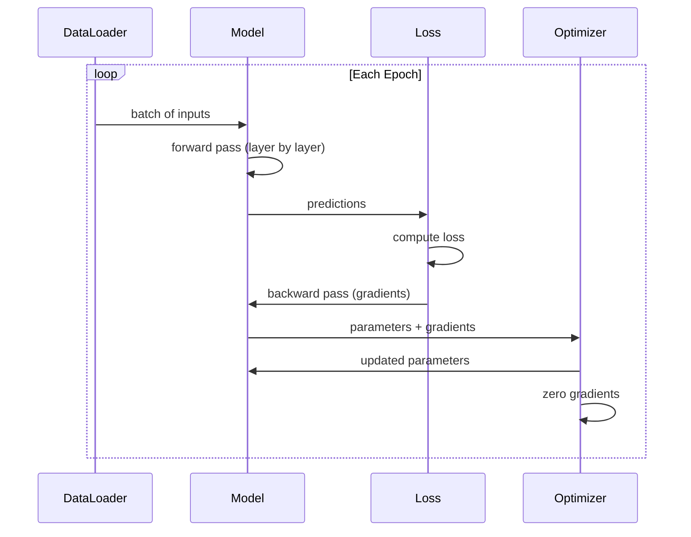
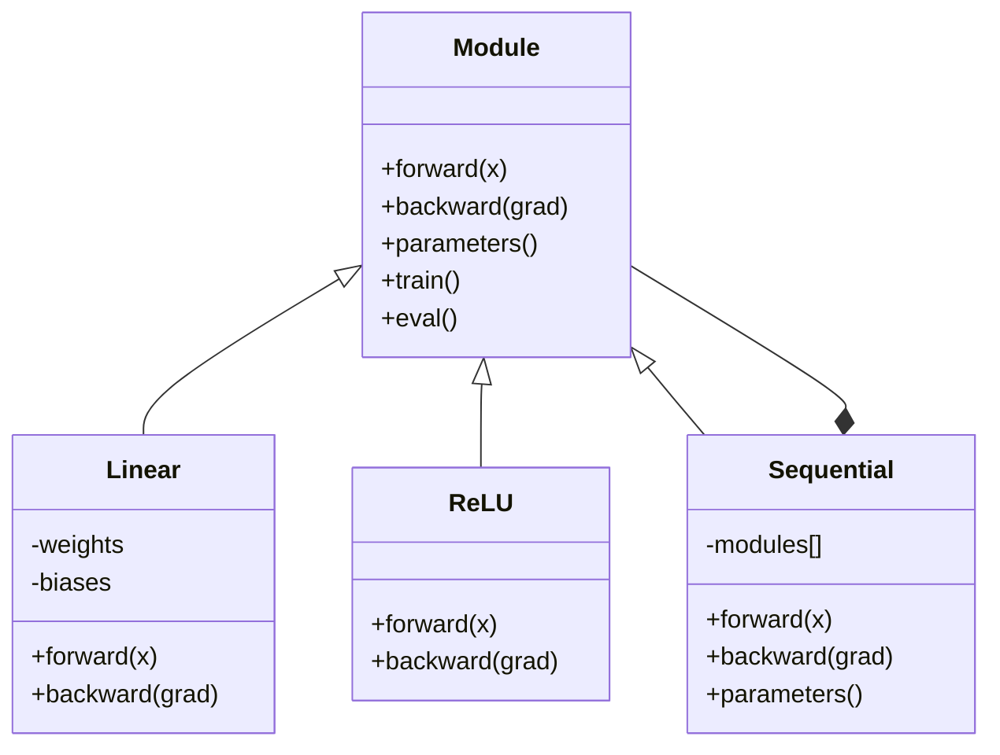

# Zbuduj swój własny mini-framework

> Zbudowałeś neurony, warstwy, sieci, propagację wsteczną, funkcje aktywacji, funkcje straty, optymalizatory, regularyzację, inicjalizację oraz harmonogramy szybkości uczenia. Wszystko jako odrębne elementy. Teraz połącz je razem w framework. Nie PyTorch. Nie TensorFlow. Twój.

**Typ:** Budowa
**Języki:** Python
**Wymagania wstępne:** Cała Faza 03 (Lekcje 01-09)
**Czas:** ~120 minut

## Cele nauki

- Zbuduj kompletny framework do głębokiego uczenia (~500 linii) z Module, Linear, ReLU, Sigmoid, Dropout, BatchNorm, Sequential, funkcjami straty, optymalizatorami i DataLoaderem
- Wyjaśnij abstrakcję Module (forward, backward, parameters) oraz dlaczego przełączanie między trybem train/eval jest niezbędne
- Połącz wszystkie komponenty w działającą pętlę treningową, która trenuje 4-warstwową sieć na zadaniu klasyfikacji okręgów
- Przypisz każdy komponent swojego frameworka do jego odpowiednika w PyTorch (nn.Module, nn.Sequential, optim.Adam, DataLoader)

## Problem

Masz dziesięć lekcji klocków konstrukcyjnych rozsianych po odrębnych plikach. Tutaj klasa `Value`, tam pętla treningowa, inicjalizacja wag w innym pliku, harmonogramy szybkości uczenia w jeszcze innym. Aby wytrenować sieć, kopiujesz i wklejasz fragmenty z pięciu różnych lekcji i łączysz je ręcznie.

To właśnie rozwiązują frameworki. PyTorch daje ci `nn.Module`, `nn.Sequential`, `optim.Adam`, `DataLoader` oraz wzorzec pętli treningowej, który łączy to wszystko razem. TensorFlow daje ci `keras.Layer`, `keras.Sequential`, `keras.optimizers.Adam`. To nie jest magia. To wzorce organizacyjne, które umożliwiają definiowanie, trenowanie i ewaluację sieci bez konieczności wymyślania na nowo całej instalacji za każdym razem.

Zbudujesz to samo w ~500 liniach Pythona. Bez numpy. Bez zewnętrznych zależności. Framework, który może zdefiniować każdą sieć typu feedforward, wytrenować ją za pomocą SGD lub Adam, podzielić dane na partie, zastosować dropout i normalizację wsadową (batch normalization), użyć dowolnej aktywacji oraz zaplanować szybkość uczenia.

Kiedy skończysz, będziesz rozumieć dokładnie, co się dzieje, gdy piszesz `model = nn.Sequential(...)` w PyTorch. Zrozumiesz, dlaczego istnieją `model.train()` i `model.eval()`. Zrozumiesz, dlaczego `optimizer.zero_grad()` jest odrębnym wywołaniem. Zrozumiesz to wszystko, ponieważ sam to zbudowałeś.

## Koncepcja

### Abstrakcja Module

Każda warstwa w PyTorch dziedziczy po `nn.Module`. Module ma trzy obowiązki:

1. **forward()** -- obliczenie wyjścia na podstawie wejść
2. **parameters()** -- zwrócenie wszystkich wag podlegających trenowaniu
3. **backward()** -- obliczenie gradientów (w PyTorch obsługiwane przez autograd, w naszym przypadku jawne)

Warstwa Linear jest Module. Aktywacja ReLU jest Module. Warstwa dropout jest Module. Warstwa normalizacji wsadowej jest Module. Wszystkie mają ten sam interfejs.

### Kontener Sequential

`nn.Sequential` łączy moduły w łańcuch. Przebieg w przód: dane przechodzą przez Moduł 1, potem Moduł 2, potem Moduł 3. Przebieg w tył: łańcuch w odwrotnym kierunku. Sam kontener jest Module -- ma forward(), parameters() i backward(). To wzorzec kompozytu: sekwencja Modułów sama jest Modułem.

### Tryb treningowy vs ewaluacyjny

Dropout losowo zeruje neurony podczas treningu, ale przepuszcza wszystko bez zmian podczas ewaluacji. Normalizacja wsadowa wykorzystuje statystyki partii podczas treningu, ale średnie bieżące (running averages) podczas ewaluacji. Metody `train()` i `eval()` przełączają to zachowanie. Każdy Module ma flagę `training`.

### Optymalizator

Optymalizator aktualizuje parametry na podstawie ich gradientów. SGD: `param -= lr * grad`. Adam: utrzymuje estymaty momentum i wariancji, a następnie aktualizuje. Optymalizator nie wie nic o architekturze sieci -- widzi jedynie płaską listę parametrów i ich gradientów.

### DataLoader

Podział na partie (batching) ma znaczenie z dwóch powodów. Pierwszy: nie da się zmieścić całego zbioru danych w pamięci dla dużych problemów. Drugi: stochastyczny spadek gradientu na mini-partiach wprowadza szum, który pomaga wyjść z lokalnych minimów. DataLoader dzieli dane na partie i opcjonalnie miesza je między epokami.

### Architektura frameworka



### Pętla treningowa



### Hierarchia Module



## Zbuduj to

### Krok 1: Klasa bazowa Module

Abstrakcyjny interfejs, który implementuje każda warstwa.

```python
class Module:
    def __init__(self):
        self.training = True

    def forward(self, x):
        raise NotImplementedError

    def backward(self, grad):
        raise NotImplementedError

    def parameters(self):
        return []

    def train(self):
        self.training = True

    def eval(self):
        self.training = False
```

### Krok 2: Warstwa Linear

Podstawowy element konstrukcyjny. Przechowuje wagi i biasy, oblicza Wx + b w przebiegu w przód oraz gradienty wag/wejścia w przebiegu w tył.

```python
import math
import random


class Linear(Module):
    def __init__(self, fan_in, fan_out):
        super().__init__()
        std = math.sqrt(2.0 / fan_in)
        self.weights = [[random.gauss(0, std) for _ in range(fan_in)] for _ in range(fan_out)]
        self.biases = [0.0] * fan_out
        self.weight_grads = [[0.0] * fan_in for _ in range(fan_out)]
        self.bias_grads = [0.0] * fan_out
        self.fan_in = fan_in
        self.fan_out = fan_out
        self.input = None

    def forward(self, x):
        self.input = x
        output = []
        for i in range(self.fan_out):
            val = self.biases[i]
            for j in range(self.fan_in):
                val += self.weights[i][j] * x[j]
            output.append(val)
        return output

    def backward(self, grad):
        input_grad = [0.0] * self.fan_in
        for i in range(self.fan_out):
            self.bias_grads[i] += grad[i]
            for j in range(self.fan_in):
                self.weight_grads[i][j] += grad[i] * self.input[j]
                input_grad[j] += grad[i] * self.weights[i][j]
        return input_grad

    def parameters(self):
        params = []
        for i in range(self.fan_out):
            for j in range(self.fan_in):
                params.append((self.weights, i, j, self.weight_grads))
            params.append((self.biases, i, None, self.bias_grads))
        return params
```

### Krok 3: Moduły aktywacji

ReLU, Sigmoid i Tanh jako Moduły. Każdy z nich zapisuje to, czego potrzebuje na potrzeby przebiegu w tył.

```python
class ReLU(Module):
    def __init__(self):
        super().__init__()
        self.mask = None

    def forward(self, x):
        self.mask = [1.0 if v > 0 else 0.0 for v in x]
        return [max(0.0, v) for v in x]

    def backward(self, grad):
        return [g * m for g, m in zip(grad, self.mask)]


class Sigmoid(Module):
    def __init__(self):
        super().__init__()
        self.output = None

    def forward(self, x):
        self.output = []
        for v in x:
            v = max(-500, min(500, v))
            self.output.append(1.0 / (1.0 + math.exp(-v)))
        return self.output

    def backward(self, grad):
        return [g * o * (1 - o) for g, o in zip(grad, self.output)]


class Tanh(Module):
    def __init__(self):
        super().__init__()
        self.output = None

    def forward(self, x):
        self.output = [math.tanh(v) for v in x]
        return self.output

    def backward(self, grad):
        return [g * (1 - o * o) for g, o in zip(grad, self.output)]
```

### Krok 4: Moduł Dropout

Losowo zeruje elementy podczas treningu. Skaluje pozostałe elementy o 1/(1-p), aby wartości oczekiwane pozostały niezmienione. Nie robi nic podczas ewaluacji.

```python
class Dropout(Module):
    def __init__(self, p=0.5):
        super().__init__()
        self.p = p
        self.mask = None

    def forward(self, x):
        if not self.training:
            return x
        self.mask = [0.0 if random.random() < self.p else 1.0 / (1 - self.p) for _ in x]
        return [v * m for v, m in zip(x, self.mask)]

    def backward(self, grad):
        if self.mask is None:
            return grad
        return [g * m for g, m in zip(grad, self.mask)]
```

### Krok 5: Moduł BatchNorm

Normalizuje aktywacje do zerowej średniej i jednostkowej wariancji per cecha, w ramach partii. Utrzymuje statystyki bieżące na potrzeby trybu ewaluacji.

```python
class BatchNorm(Module):
    def __init__(self, size, momentum=0.1, eps=1e-5):
        super().__init__()
        self.size = size
        self.gamma = [1.0] * size
        self.beta = [0.0] * size
        self.gamma_grads = [0.0] * size
        self.beta_grads = [0.0] * size
        self.running_mean = [0.0] * size
        self.running_var = [1.0] * size
        self.momentum = momentum
        self.eps = eps
        self.x_norm = None
        self.std_inv = None
        self.batch_input = None

    def forward_batch(self, batch):
        batch_size = len(batch)
        output_batch = []

        if self.training:
            mean = [0.0] * self.size
            for sample in batch:
                for j in range(self.size):
                    mean[j] += sample[j]
            mean = [m / batch_size for m in mean]

            var = [0.0] * self.size
            for sample in batch:
                for j in range(self.size):
                    var[j] += (sample[j] - mean[j]) ** 2
            var = [v / batch_size for v in var]

            self.std_inv = [1.0 / math.sqrt(v + self.eps) for v in var]

            self.x_norm = []
            self.batch_input = batch
            for sample in batch:
                normed = [(sample[j] - mean[j]) * self.std_inv[j] for j in range(self.size)]
                self.x_norm.append(normed)
                output = [self.gamma[j] * normed[j] + self.beta[j] for j in range(self.size)]
                output_batch.append(output)

            for j in range(self.size):
                self.running_mean[j] = (1 - self.momentum) * self.running_mean[j] + self.momentum * mean[j]
                self.running_var[j] = (1 - self.momentum) * self.running_var[j] + self.momentum * var[j]
        else:
            std_inv = [1.0 / math.sqrt(v + self.eps) for v in self.running_var]
            for sample in batch:
                normed = [(sample[j] - self.running_mean[j]) * std_inv[j] for j in range(self.size)]
                output = [self.gamma[j] * normed[j] + self.beta[j] for j in range(self.size)]
                output_batch.append(output)

        return output_batch

    def forward(self, x):
        result = self.forward_batch([x])
        return result[0]

    def backward(self, grad):
        if self.x_norm is None:
            return grad
        for j in range(self.size):
            self.gamma_grads[j] += self.x_norm[0][j] * grad[j]
            self.beta_grads[j] += grad[j]
        return [grad[j] * self.gamma[j] * self.std_inv[j] for j in range(self.size)]

    def parameters(self):
        params = []
        for j in range(self.size):
            params.append((self.gamma, j, None, self.gamma_grads))
            params.append((self.beta, j, None, self.beta_grads))
        return params
```

### Krok 6: Kontener Sequential

Łączy moduły w łańcuch. Przebieg w przód idzie od lewej do prawej, przebieg w tył od prawej do lewej.

```python
class Sequential(Module):
    def __init__(self, *modules):
        super().__init__()
        self.modules = list(modules)

    def forward(self, x):
        for module in self.modules:
            x = module.forward(x)
        return x

    def backward(self, grad):
        for module in reversed(self.modules):
            grad = module.backward(grad)
        return grad

    def parameters(self):
        params = []
        for module in self.modules:
            params.extend(module.parameters())
        return params

    def train(self):
        self.training = True
        for module in self.modules:
            module.train()

    def eval(self):
        self.training = False
        for module in self.modules:
            module.eval()
```

### Krok 7: Funkcje straty

MSE i binarna entropia krzyżowa (Binary Cross-Entropy). Każda zwraca wartość straty i udostępnia backward(), które zwraca gradient.

```python
class MSELoss:
    def __call__(self, predicted, target):
        self.predicted = predicted
        self.target = target
        n = len(predicted)
        self.loss = sum((p - t) ** 2 for p, t in zip(predicted, target)) / n
        return self.loss

    def backward(self):
        n = len(self.predicted)
        return [2 * (p - t) / n for p, t in zip(self.predicted, self.target)]


class BCELoss:
    def __call__(self, predicted, target):
        self.predicted = predicted
        self.target = target
        eps = 1e-7
        n = len(predicted)
        self.loss = 0
        for p, t in zip(predicted, target):
            p = max(eps, min(1 - eps, p))
            self.loss += -(t * math.log(p) + (1 - t) * math.log(1 - p))
        self.loss /= n
        return self.loss

    def backward(self):
        eps = 1e-7
        n = len(self.predicted)
        grads = []
        for p, t in zip(self.predicted, self.target):
            p = max(eps, min(1 - eps, p))
            grads.append((-t / p + (1 - t) / (1 - p)) / n)
        return grads
```

### Krok 8: Optymalizatory SGD i Adam

Oba przyjmują listę parametrów i aktualizują wagi na podstawie gradientów.

```python
class SGD:
    def __init__(self, parameters, lr=0.01):
        self.params = parameters
        self.lr = lr

    def step(self):
        for container, i, j, grad_container in self.params:
            if j is not None:
                container[i][j] -= self.lr * grad_container[i][j]
            else:
                container[i] -= self.lr * grad_container[i]

    def zero_grad(self):
        for container, i, j, grad_container in self.params:
            if j is not None:
                grad_container[i][j] = 0.0
            else:
                grad_container[i] = 0.0


class Adam:
    def __init__(self, parameters, lr=0.001, beta1=0.9, beta2=0.999, eps=1e-8):
        self.params = parameters
        self.lr = lr
        self.beta1 = beta1
        self.beta2 = beta2
        self.eps = eps
        self.t = 0
        self.m = [0.0] * len(parameters)
        self.v = [0.0] * len(parameters)

    def step(self):
        self.t += 1
        for idx, (container, i, j, grad_container) in enumerate(self.params):
            if j is not None:
                g = grad_container[i][j]
            else:
                g = grad_container[i]

            self.m[idx] = self.beta1 * self.m[idx] + (1 - self.beta1) * g
            self.v[idx] = self.beta2 * self.v[idx] + (1 - self.beta2) * g * g

            m_hat = self.m[idx] / (1 - self.beta1 ** self.t)
            v_hat = self.v[idx] / (1 - self.beta2 ** self.t)

            update = self.lr * m_hat / (math.sqrt(v_hat) + self.eps)

            if j is not None:
                container[i][j] -= update
            else:
                container[i] -= update

    def zero_grad(self):
        for container, i, j, grad_container in self.params:
            if j is not None:
                grad_container[i][j] = 0.0
            else:
                grad_container[i] = 0.0
```

### Krok 9: DataLoader

Dzieli dane na partie, opcjonalnie miesza je przy każdej epoce.

```python
class DataLoader:
    def __init__(self, data, batch_size=32, shuffle=True):
        self.data = data
        self.batch_size = batch_size
        self.shuffle = shuffle

    def __iter__(self):
        indices = list(range(len(self.data)))
        if self.shuffle:
            random.shuffle(indices)
        for start in range(0, len(indices), self.batch_size):
            batch_indices = indices[start:start + self.batch_size]
            batch = [self.data[i] for i in batch_indices]
            inputs = [item[0] for item in batch]
            targets = [item[1] for item in batch]
            yield inputs, targets

    def __len__(self):
        return (len(self.data) + self.batch_size - 1) // self.batch_size
```

### Krok 10: Wytrenuj 4-warstwową sieć na zadaniu klasyfikacji okręgów

Połącz wszystko razem. Zdefiniuj model, wybierz funkcję straty, wybierz optymalizator, uruchom pętlę treningową.

```python
def make_circle_data(n=500, seed=42):
    random.seed(seed)
    data = []
    for _ in range(n):
        x = random.uniform(-2, 2)
        y = random.uniform(-2, 2)
        label = 1.0 if x * x + y * y < 1.5 else 0.0
        data.append(([x, y], [label]))
    return data


def train():
    random.seed(42)

    model = Sequential(
        Linear(2, 16),
        ReLU(),
        Linear(16, 16),
        ReLU(),
        Linear(16, 8),
        ReLU(),
        Linear(8, 1),
        Sigmoid(),
    )

    criterion = BCELoss()
    optimizer = Adam(model.parameters(), lr=0.01)

    data = make_circle_data(500)
    split = int(len(data) * 0.8)
    train_data = data[:split]
    test_data = data[split:]

    loader = DataLoader(train_data, batch_size=16, shuffle=True)

    model.train()

    for epoch in range(100):
        total_loss = 0
        total_correct = 0
        total_samples = 0

        for batch_inputs, batch_targets in loader:
            batch_loss = 0
            for x, t in zip(batch_inputs, batch_targets):
                pred = model.forward(x)
                loss = criterion(pred, t)
                batch_loss += loss

                optimizer.zero_grad()
                grad = criterion.backward()
                model.backward(grad)
                optimizer.step()

                predicted_class = 1.0 if pred[0] >= 0.5 else 0.0
                if predicted_class == t[0]:
                    total_correct += 1
                total_samples += 1

            total_loss += batch_loss

        avg_loss = total_loss / total_samples
        accuracy = total_correct / total_samples * 100

        if epoch % 10 == 0 or epoch == 99:
            print(f"Epoch {epoch:3d} | Loss: {avg_loss:.6f} | Train Accuracy: {accuracy:.1f}%")

    model.eval()
    correct = 0
    for x, t in test_data:
        pred = model.forward(x)
        predicted_class = 1.0 if pred[0] >= 0.5 else 0.0
        if predicted_class == t[0]:
            correct += 1
    test_accuracy = correct / len(test_data) * 100
    print(f"\nTest Accuracy: {test_accuracy:.1f}% ({correct}/{len(test_data)})")

    return model, test_accuracy
```

## Użyj tego

Oto odpowiednik tego, co właśnie zbudowałeś, w PyTorch:

```python
import torch
import torch.nn as nn
from torch.utils.data import DataLoader, TensorDataset

model = nn.Sequential(
    nn.Linear(2, 16),
    nn.ReLU(),
    nn.Linear(16, 16),
    nn.ReLU(),
    nn.Linear(16, 8),
    nn.ReLU(),
    nn.Linear(8, 1),
    nn.Sigmoid(),
)

criterion = nn.BCELoss()
optimizer = torch.optim.Adam(model.parameters(), lr=0.01)

for epoch in range(100):
    model.train()
    for inputs, targets in dataloader:
        optimizer.zero_grad()
        predictions = model(inputs)
        loss = criterion(predictions, targets)
        loss.backward()
        optimizer.step()

    model.eval()
    with torch.no_grad():
        test_predictions = model(test_inputs)
```

Struktura jest identyczna. `Sequential`, `Linear`, `ReLU`, `Sigmoid`, `BCELoss`, `Adam`, `zero_grad`, `backward`, `step`, `train`, `eval`. Każda koncepcja mapuje się jeden do jednego. Różnica polega na tym, że PyTorch obsługuje autograd automatycznie (nie ma potrzeby implementowania backward() w każdym module), działa na GPU i jest optymalizowany przez lata. Ale szkielet jest taki sam.

Teraz, gdy zobaczysz kod PyTorch, będziesz wiedzieć dokładnie, co dzieje się w każdej linii. To zrozumienie jest celem tej lekcji.

## Dostawa

Ta lekcja produkuje:
- `outputs/prompt-framework-architect.md` -- prompt do projektowania architektur sieci neuronowych przy użyciu abstrakcji frameworka

## Ćwiczenia

1. Dodaj klasę `SoftmaxCrossEntropyLoss` do klasyfikacji wieloklasowej. Zastosuj softmax do predykcji, oblicz stratę cross-entropy i obsłuż połączony przebieg w tył. Przetestuj na zbiorze danych typu spirala z 3 klasami.

2. Zaimplementuj harmonogramowanie szybkości uczenia w optymalizatorze: dodaj metodę `set_lr()` i podłącz harmonogram kosinusowy z Lekcji 09. Wytrenuj klasyfikator okręgów z rozgrzewką (warmup) + kosinusem i porównaj z constant LR.

3. Dodaj metody `save()` i `load()` do Sequential, które serializują wszystkie wagi do pliku JSON i wczytują je z powrotem. Zweryfikuj, że wczytany model produkuje te same predykcje co oryginał.

4. Zaimplementuj weight decay (regularyzację L2) w optymalizatorze Adam. Dodaj parametr `weight_decay`, który zmniejsza wagi w kierunku zera w każdym kroku. Porównaj trening z decay=0 i decay=0.01.

5. Zastąp pętlę treningową działającą na pojedynczych próbkach właściwą akumulacją gradientów na mini-partiach: akumuluj gradienty dla wszystkich próbek w partii, następnie podziel przez rozmiar partii i wykonaj jeden krok optymalizatora. Zmierz, czy to zmienia szybkość zbieżności.

## Kluczowe terminy

| Termin | Co mówią ludzie | Co to faktycznie znaczy |
|------|----------------|----------------------|
| Module | "Warstwa" | Podstawowa abstrakcja w frameworku -- wszystko, co ma forward(), backward() i parameters() |
| Sequential | "Ułóż warstwy po kolei" | Kontener, który łączy moduły w łańcuch, stosując je w sekwencji dla przebiegu w przód i w odwrotnej kolejności dla przebiegu w tył |
| Forward pass (przebieg w przód) | "Uruchom sieć" | Obliczenie wyjścia poprzez przepuszczenie wejścia przez każdy moduł po kolei |
| Backward pass (przebieg w tył) | "Oblicz gradienty" | Propagacja gradientu straty przez każdy moduł w odwrotnym kierunku, aby obliczyć gradienty parametrów |
| Parameters (parametry) | "Wagi podlegające trenowaniu" | Wszystkie wartości w sieci, które optymalizator może aktualizować -- wagi i biasy |
| Optimizer (optymalizator) | "To, co aktualizuje wagi" | Algorytm, który wykorzystuje gradienty do aktualizacji parametrów, implementując SGD, Adam lub inne reguły |
| DataLoader | "To, co dostarcza dane" | Iterator, który dzieli zbiór danych na partie, opcjonalnie mieszając je między epokami |
| Training mode (tryb treningowy) | "model.train()" | Flaga, która włącza stochastyczne zachowania, takie jak dropout i normalizacja wsadowa ze statystykami partii |
| Evaluation mode (tryb ewaluacji) | "model.eval()" | Flaga, która wyłącza dropout i wykorzystuje statystyki bieżące dla normalizacji wsadowej |
| Zero grad | "Wyczyść gradienty" | Zresetowanie wszystkich gradientów parametrów do zera przed obliczeniem gradientów dla kolejnej partii |

## Dalsza lektura

- Paszke i in., "PyTorch: An Imperative Style, High-Performance Deep Learning Library" (2019) -- artykuł opisujący decyzje projektowe PyTorch
- Chollet, "Deep Learning with Python, Second Edition" (2021) -- Rozdział 3 opisuje wewnętrzne mechanizmy Keras z tą samą abstrakcją modułu/warstwy
- Johnson, "Tiny-DNN" (https://github.com/tiny-dnn/tiny-dnn) -- header-only framework do głębokiego uczenia w C++ pomagający zrozumieć wewnętrzne mechanizmy frameworków
