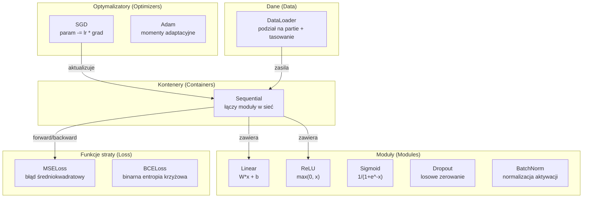
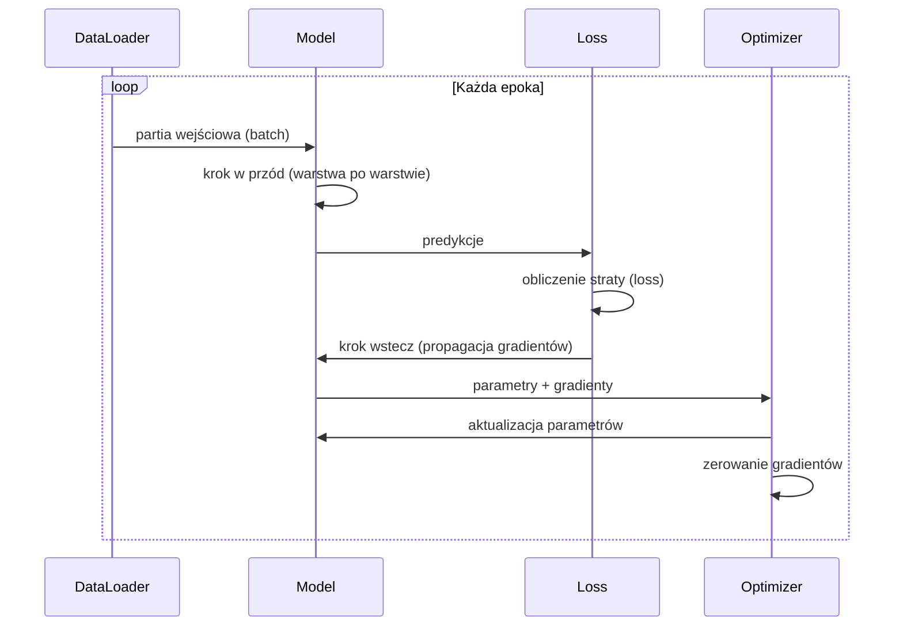
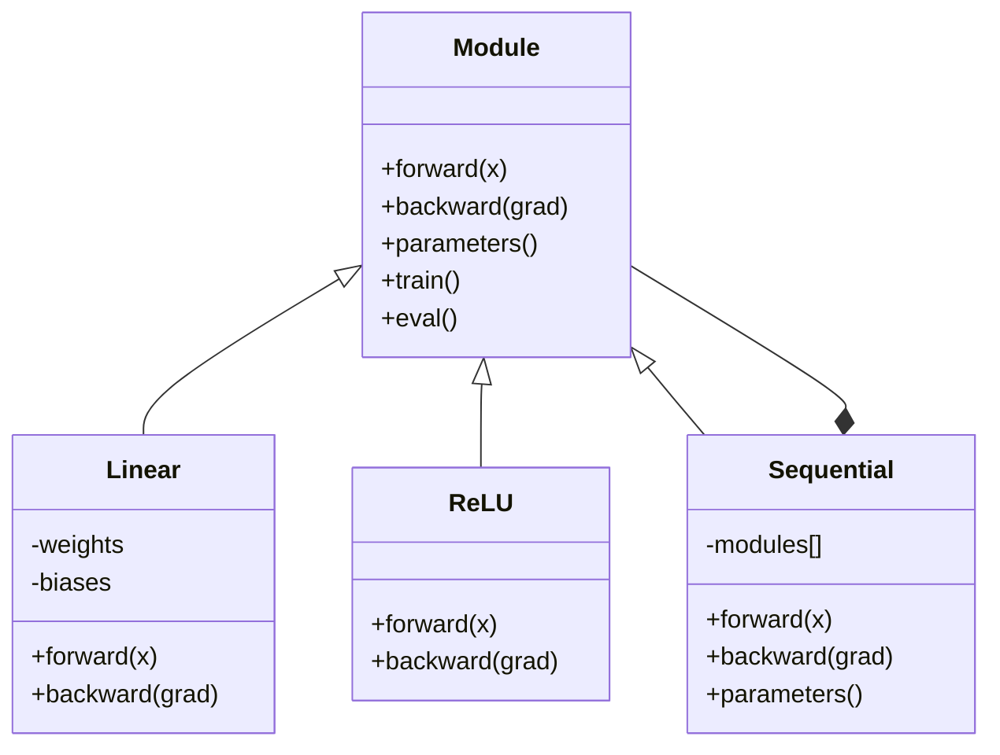

# Zbuduj własny mini-framework

> Zaimplementowałeś już neurony, warstwy, sieci, biasy, aktywacje, funkcje straty, optymalizatory, regularyzację, inicjalizację oraz harmonogramy LR. Wszystko to jako osobne, rozproszone elementy. Teraz połączymy je w jeden spójny framework. Nie PyTorch. Nie TensorFlow. Twój własny.

**Typ:** Kompilacja  
**Języki:** Python  
**Wymagania wstępne:** Wszystkie lekcje z fazy 03 (lekcje 01-09)  
**Czas:** ~120 minut  

## Cele kształcenia

- Zbudowanie kompletnej biblioteki (frameworka) głębokiego uczenia się (~500 linii kodu) zawierającej klasę bazową `Module`, warstwę `Linear`, aktywacje `ReLU` i `Sigmoid`, warstwy `Dropout` i `BatchNorm`, kontener `Sequential`, funkcje straty, optymalizatory oraz klasę `DataLoader`.
- Wyjaśnienie abstrakcji modułu (metody `forward`, `backward`, `parameters`) i zrozumienie, dlaczego niezbędne jest przełączanie trybów pracy sieci (`train` / `eval`).
- Połączenie wszystkich komponentów w działającą pętlę treningową, która uczy 4-warstwową sieć klasyfikacji punktów w zbiorze typu koło.
- Powiązanie każdego komponentu własnego frameworka z jego odpowiednikiem w PyTorch (`nn.Module`, `nn.Sequential`, `optim.Adam`, `DataLoader`).

## Problem

Praca z rozproszonymi komponentami bywa uciążliwa. Klasa `Value` znajduje się w jednym pliku, pętla treningowa w drugim, inicjalizacja wag w kolejnym, a harmonogramy współczynnika uczenia się w jeszcze innym. Aby wytrenować sieć, musisz kopiować i wklejać kod z pięciu różnych miejsc i ręcznie łączyć je ze sobą.

Tym właśnie zajmują się frameworki. PyTorch udostępnia klasy takie jak `nn.Module`, `nn.Sequential`, `optim.Adam` czy `DataLoader` oraz spójny wzorzec pętli treningowej. TensorFlow oferuje `keras.Layer`, `keras.Sequential` i `keras.optimizers.Adam`. Za tymi nazwami nie kryje się żadna magia – to po prostu dobrze zaprojektowane wzorce architektoniczne, które automatyzują powtarzalny kod (tzw. plumbing) i pozwalają skupić się na samym modelu.

W tej lekcji zbudujesz taki framework w około 500 liniach kodu w czystym Pythonie. Bez żadnych zewnętrznych bibliotek. Twój framework pozwoli na zdefiniowanie dowolnej sieci jednokierunkowej (feedforward), jej trening za pomocą SGD lub Adama, przetwarzanie danych w partiach (mini-batches), stosowanie technik regularyzacyjnych (Dropout i Batch Normalization), dobór dowolnych funkcji aktywacji i dynamiczną zmianę współczynnika uczenia się.

Po zakończeniu tej lekcji będziesz dokładnie wiedzieć, co dzieje się pod maską, gdy piszesz `model = nn.Sequential(...)` w PyTorch. Zrozumiesz rolę instrukcji `model.train()` i `model.eval()`, a także powód, dla którego `optimizer.zero_grad()` stanowi osobne wywołanie. Zrozumiesz to wszystko, ponieważ samodzielnie napiszesz każdą z tych linijek.

## Koncepcja

### Abstrakcja modułu (Module)

Każda warstwa w PyTorch dziedziczy po klasie `nn.Module`. Moduł ma trzy podstawowe zadania:

1. **forward()** – obliczenie wyniku działania na podstawie danych wejściowych.
2. **parameters()** – zwrócenie listy wszystkich trenowalnych parametrów (wag i biasów).
3. **backward()** – obliczenie gradientów (w PyTorch realizowane przez automatyczne różniczkowanie - autograd, w naszym frameworku zdefiniowane jawnie).

Zarówno warstwa liniowa, funkcja aktywacji ReLU, jak i warstwy Dropout czy BatchNorm są modułami korzystającymi z tego samego interfejsu.

### Kontener sekwencyjny (Sequential)

Klasa `nn.Sequential` łączy ze sobą moduły. W kroku w przód (forward pass) przekazuje dane kolejno z modułu 1 do 2, a następnie do 3. W kroku wstecz (backward pass) odwraca tę kolejność. Sam kontener również jest modułem – implementuje metody `forward()`, `parameters()` i `backward()`. To klasyczny wzorzec projektowy "Kompozyt" (Composite): sekwencja modułów sama w sobie stanowi moduł.

### Tryb treningu a tryb ewaluacji

Warstwa Dropout losowo wyklucza (zeruje) neurony podczas treningu, lecz w trakcie walidacji i testowania (ewaluacji) przekazuje wszystkie sygnały bez zmian. Normalizacja wsadowa (BatchNorm) podczas uczenia korzysta ze statystyk bieżącej partii danych, natomiast podczas ewaluacji używa średnich ruchomych obliczonych w czasie treningu. Wywołania `train()` i `eval()` służą właśnie do przełączania tego zachowania za pomocą wewnętrznej flagi stanu `training`.

### Optymalizator (Optimizer)

Optymalizator aktualizuje parametry modelu na podstawie obliczonych gradientów. W przypadku SGD aktualizacja ma postać: `param -= lr * grad`. Adam dodatkowo estymuje średnią i wariancję gradientów (momenty). Optymalizator nie musi znać topologii sieci – operuje jedynie na płaskiej liście parametrów oraz przypisanych do nich gradientów.

### DataLoader (Ładowanie danych)

Przetwarzanie danych w partiach (batching) jest kluczowe z dwóch powodów: pozwala na trenowanie modeli na zbiorach danych, które nie mieszczą się w pamięci operacyjnej, oraz wprowadza pożądany szum stochastyczny ułatwiający ucieczkę z minimów lokalnych. Klasa `DataLoader` odpowiada za podział zbioru danych na partie o zadanym rozmiarze oraz ich tasowanie przed każdą epoką.

### Architektura frameworka



### Pętla treningowa



### Hierarchia klas modułów



## Implementacja krok po kroku

### Krok 1: Klasa bazowa Module

Abstrakcyjny interfejs implementowany przez wszystkie komponenty sieci.

```python
class Module:
    def __init__(self):
        self.training = True

    def forward(self, x):
        raise NotImplementedError

    def backward(self, grad):
        raise NotImplementedError

    def parameters(self):
        return []

    def train(self):
        self.training = True

    def eval(self):
        self.training = False
```

### Krok 2: Warstwa liniowa (Linear)

Podstawowy moduł przechowujący wagi i biasy. Oblicza $W \cdot x + b$ w kroku w przód oraz gradienty wag, biasów i wejścia w kroku wstecz.

```python
import math
import random

class Linear(Module):
    def __init__(self, fan_in, fan_out):
        super().__init__()
        std = math.sqrt(2.0 / fan_in)
        self.weights = [[random.gauss(0, std) for _ in range(fan_in)] for _ in range(fan_out)]
        self.biases = [0.0] * fan_out
        self.weight_grads = [[0.0] * fan_in for _ in range(fan_out)]
        self.bias_grads = [0.0] * fan_out
        self.fan_in = fan_in
        self.fan_out = fan_out
        self.input = None

    def forward(self, x):
        self.input = x
        output = []
        for i in range(self.fan_out):
            val = self.biases[i]
            for j in range(self.fan_in):
                val += self.weights[i][j] * x[j]
            output.append(val)
        return output

    def backward(self, grad):
        input_grad = [0.0] * self.fan_in
        for i in range(self.fan_out):
            self.bias_grads[i] += grad[i]
            for j in range(self.fan_in):
                self.weight_grads[i][j] += grad[i] * self.input[j]
                input_grad[j] += grad[i] * self.weights[i][j]
        return input_grad

    def parameters(self):
        params = []
        for i in range(self.fan_out):
            for j in range(self.fan_in):
                params.append((self.weights, i, j, self.weight_grads))
            params.append((self.biases, i, None, self.bias_grads))
        return params
```

### Krok 3: Moduły aktywacyjne

Moduły `ReLU`, `Sigmoid` i `Tanh`. Każdy z nich zapisuje niezbędne stany pośrednie w celu poprawnego obliczenia gradientów w kroku wstecz.

```python
class ReLU(Module):
    def __init__(self):
        super().__init__()
        self.mask = None

    def forward(self, x):
        self.mask = [1.0 if v > 0 else 0.0 for v in x]
        return [max(0.0, v) for v in x]

    def backward(self, grad):
        return [g * m for g, m in zip(grad, self.mask)]

class Sigmoid(Module):
    def __init__(self):
        super().__init__()
        self.output = None

    def forward(self, x):
        self.output = []
        for v in x:
            v = max(-500, min(500, v))
            self.output.append(1.0 / (1.0 + math.exp(-v)))
        return self.output

    def backward(self, grad):
        return [g * o * (1 - o) for g, o in zip(grad, self.output)]

class Tanh(Module):
    def __init__(self):
        super().__init__()
        self.output = None

    def forward(self, x):
        self.output = [math.tanh(v) for v in x]
        return self.output

    def backward(self, grad):
        return [g * (1 - o * o) for g, o in zip(grad, self.output)]
```

### Krok 4: Moduł Dropout

Warstwa regularyzacyjna, która losowo zeruje wyjściowe wartości aktywacji podczas treningu. Pozostałe aktywacje są skalowane przez czynnik $1 / (1 - p)$ w celu zachowania ich wartości oczekiwanej. W trybie ewaluacji (`eval`) Dropout nie wykonuje żadnych modyfikacji.

```python
class Dropout(Module):
    def __init__(self, p=0.5):
        super().__init__()
        self.p = p
        self.mask = None

    def forward(self, x):
        if not self.training:
            return x
        self.mask = [0.0 if random.random() < self.p else 1.0 / (1 - self.p) for _ in x]
        return [v * m for v, m in zip(x, self.mask)]

    def backward(self, grad):
        if self.mask is None:
            return grad
        return [g * m for g, m in zip(grad, self.mask)]
```

### Krok 5: Moduł BatchNorm

Normalizuje aktywacje w obrębie partii (mini-batch), dążąc do zerowej średniej i jednostkowej wariancji dla każdej cechy. Przechowuje również średnie ruchome na potrzeby trybu ewaluacji.

```python
class BatchNorm(Module):
    def __init__(self, size, momentum=0.1, eps=1e-5):
        super().__init__()
        self.size = size
        self.gamma = [1.0] * size
        self.beta = [0.0] * size
        self.gamma_grads = [0.0] * size
        self.beta_grads = [0.0] * size
        self.running_mean = [0.0] * size
        self.running_var = [1.0] * size
        self.momentum = momentum
        self.eps = eps
        self.x_norm = None
        self.std_inv = None
        self.batch_input = None

    def forward_batch(self, batch):
        batch_size = len(batch)
        output_batch = []

        if self.training:
            mean = [0.0] * self.size
            for sample in batch:
                for j in range(self.size):
                    mean[j] += sample[j]
            mean = [m / batch_size for m in mean]

            var = [0.0] * self.size
            for sample in batch:
                for j in range(self.size):
                    var[j] += (sample[j] - mean[j]) ** 2
            var = [v / batch_size for v in var]

            self.std_inv = [1.0 / math.sqrt(v + self.eps) for v in var]

            self.x_norm = []
            self.batch_input = batch
            for sample in batch:
                normed = [(sample[j] - mean[j]) * self.std_inv[j] for j in range(self.size)]
                self.x_norm.append(normed)
                output = [self.gamma[j] * normed[j] + self.beta[j] for j in range(self.size)]
                output_batch.append(output)

            for j in range(self.size):
                self.running_mean[j] = (1 - self.momentum) * self.running_mean[j] + self.momentum * mean[j]
                self.running_var[j] = (1 - self.momentum) * self.running_var[j] + self.momentum * var[j]
        else:
            std_inv = [1.0 / math.sqrt(v + self.eps) for v in self.running_var]
            for sample in batch:
                normed = [(sample[j] - self.running_mean[j]) * std_inv[j] for j in range(self.size)]
                output = [self.gamma[j] * normed[j] + self.beta[j] for j in range(self.size)]
                output_batch.append(output)

        return output_batch

    def forward(self, x):
        result = self.forward_batch([x])
        return result[0]

    def backward(self, grad):
        if self.x_norm is None:
            return grad
        for j in range(self.size):
            self.gamma_grads[j] += self.x_norm[0][j] * grad[j]
            self.beta_grads[j] += grad[j]
        return [grad[j] * self.gamma[j] * self.std_inv[j] for j in range(self.size)]

    def parameters(self):
        params = []
        for j in range(self.size):
            params.append((self.gamma, j, None, self.gamma_grads))
            params.append((self.beta, j, None, self.beta_grads))
        return params
```

### Krok 6: Kontener sekwencyjny (Sequential)

Łączy moduły w łańcuch przetwarzania. W kroku w przód przechodzi od lewej do prawej, a w kroku wstecz – w odwrotnej kolejności.

```python
class Sequential(Module):
    def __init__(self, *modules):
        super().__init__()
        self.modules = list(modules)

    def forward(self, x):
        for module in self.modules:
            x = module.forward(x)
        return x

    def backward(self, grad):
        for module in reversed(self.modules):
            grad = module.backward(grad)
        return grad

    def parameters(self):
        params = []
        for module in self.modules:
            params.extend(module.parameters())
        return params

    def train(self):
        self.training = True
        for module in self.modules:
            module.train()

    def eval(self):
        self.training = False
        for module in self.modules:
            module.eval()
```

### Krok 7: Funkcje straty

Implementacje MSE (błąd średniokwadratowy) oraz BCE (binarna entropia krzyżowa). Każda z nich wyznacza wartość straty oraz implementuje metodę `backward()`.

```python
class MSELoss:
    def __call__(self, predicted, target):
        self.predicted = predicted
        self.target = target
        n = len(predicted)
        self.loss = sum((p - t) ** 2 for p, t in zip(predicted, target)) / n
        return self.loss

    def backward(self):
        n = len(self.predicted)
        return [2 * (p - t) / n for p, t in zip(self.predicted, self.target)]

class BCELoss:
    def __call__(self, predicted, target):
        self.predicted = predicted
        self.target = target
        eps = 1e-7
        n = len(predicted)
        self.loss = 0
        for p, t in zip(predicted, target):
            p = max(eps, min(1 - eps, p))
            self.loss += -(t * math.log(p) + (1 - t) * math.log(1 - p))
        self.loss /= n
        return self.loss

    def backward(self):
        eps = 1e-7
        n = len(self.predicted)
        grads = []
        for p, t in zip(self.predicted, self.target):
            p = max(eps, min(1 - eps, p))
            grads.append((-t / p + (1 - t) / (1 - p)) / n)
        return grads
```

### Krok 8: Optymalizatory SGD i Adam

Oba optymalizatory przyjmują listę parametrów i aktualizują je na podstawie zarejestrowanych gradientów.

```python
class SGD:
    def __init__(self, parameters, lr=0.01):
        self.params = parameters
        self.lr = lr

    def step(self):
        for container, i, j, grad_container in self.params:
            if j is not None:
                container[i][j] -= self.lr * grad_container[i][j]
            else:
                container[i] -= self.lr * grad_container[i]

    def zero_grad(self):
        for container, i, j, grad_container in self.params:
            if j is not None:
                grad_container[i][j] = 0.0
            else:
                grad_container[i] = 0.0

class Adam:
    def __init__(self, parameters, lr=0.001, beta1=0.9, beta2=0.999, eps=1e-8):
        self.params = parameters
        self.lr = lr
        self.beta1 = beta1
        self.beta2 = beta2
        self.eps = eps
        self.t = 0
        self.m = [0.0] * len(parameters)
        self.v = [0.0] * len(parameters)

    def step(self):
        self.t += 1
        for idx, (container, i, j, grad_container) in enumerate(self.params):
            if j is not None:
                g = grad_container[i][j]
            else:
                g = grad_container[i]

            self.m[idx] = self.beta1 * self.m[idx] + (1 - self.beta1) * g
            self.v[idx] = self.beta2 * self.v[idx] + (1 - self.beta2) * g * g

            m_hat = self.m[idx] / (1 - self.beta1 ** self.t)
            v_hat = self.v[idx] / (1 - self.beta2 ** self.t)

            update = self.lr * m_hat / (math.sqrt(v_hat) + self.eps)

            if j is not None:
                container[i][j] -= update
            else:
                container[i] -= update

    def zero_grad(self):
        for container, i, j, grad_container in self.params:
            if j is not None:
                grad_container[i][j] = 0.0
            else:
                grad_container[i] = 0.0
```

### Krok 9: DataLoader (Ładowanie danych)

Dzieli zbiór danych na minipartie i opcjonalnie miesza kolejność przykładów przed każdą epoką.

```python
class DataLoader:
    def __init__(self, data, batch_size=32, shuffle=True):
        self.data = data
        self.batch_size = batch_size
        self.shuffle = shuffle

    def __iter__(self):
        indices = list(range(len(self.data)))
        if self.shuffle:
            random.shuffle(indices)
        for start in range(0, len(indices), self.batch_size):
            batch_indices = indices[start:start + self.batch_size]
            batch = [self.data[i] for i in batch_indices]
            inputs = [item[0] for item in batch]
            targets = [item[1] for item in batch]
            yield inputs, targets

    def __len__(self):
        return (len(self.data) + self.batch_size - 1) // self.batch_size
```

### Krok 10: Trening 4-warstwowej sieci klasyfikacyjnej

Łączymy wszystkie elementy w kompletną aplikację: definiujemy strukturę sieci, funkcję straty oraz optymalizator, a następnie uruchamiamy właściwą pętlę uczenia.

```python
def make_circle_data(n=500, seed=42):
    random.seed(seed)
    data = []
    for _ in range(n):
        x = random.uniform(-2, 2)
        y = random.uniform(-2, 2)
        label = 1.0 if x * x + y * y < 1.5 else 0.0
        data.append(([x, y], [label]))
    return data

def train():
    random.seed(42)

    model = Sequential(
        Linear(2, 16),
        ReLU(),
        Linear(16, 16),
        ReLU(),
        Linear(16, 8),
        ReLU(),
        Linear(8, 1),
        Sigmoid(),
    )

    criterion = BCELoss()
    optimizer = Adam(model.parameters(), lr=0.01)

    data = make_circle_data(500)
    split = int(len(data) * 0.8)
    train_data = data[:split]
    test_data = data[split:]

    loader = DataLoader(train_data, batch_size=16, shuffle=True)

    model.train()

    for epoch in range(100):
        total_loss = 0
        total_correct = 0
        total_samples = 0

        for batch_inputs, batch_targets in loader:
            batch_loss = 0
            for x, t in zip(batch_inputs, batch_targets):
                pred = model.forward(x)
                loss = criterion(pred, t)
                batch_loss += loss

                optimizer.zero_grad()
                grad = criterion.backward()
                model.backward(grad)
                optimizer.step()

                predicted_class = 1.0 if pred[0] >= 0.5 else 0.0
                if predicted_class == t[0]:
                    total_correct += 1
                total_samples += 1

            total_loss += batch_loss

        avg_loss = total_loss / total_samples
        accuracy = total_correct / total_samples * 100

        if epoch % 10 == 0 or epoch == 99:
            print(f"Epoka {epoch:3d} | Strata: {avg_loss:.6f} | Dokładność treningu: {accuracy:.1f}%")

    model.eval()
    correct = 0
    for x, t in test_data:
        pred = model.forward(x)
        predicted_class = 1.0 if pred[0] >= 0.5 else 0.0
        if predicted_class == t[0]:
            correct += 1
    test_accuracy = correct / len(test_data) * 100
    print(f"\nDokładność testowa: {test_accuracy:.1f}% ({correct}/{len(test_data)})")

    return model, test_accuracy
```

## Wykorzystanie w bibliotece PyTorch

Oto odpowiednik zaimplementowanej struktury w bibliotece PyTorch:

```python
import torch
import torch.nn as nn
from torch.utils.data import DataLoader, TensorDataset

# Definicja identycznego modelu w PyTorch
model = nn.Sequential(
    nn.Linear(2, 16),
    nn.ReLU(),
    nn.Linear(16, 16),
    nn.ReLU(),
    nn.Linear(16, 8),
    nn.ReLU(),
    nn.Linear(8, 1),
    nn.Sigmoid(),
)

criterion = nn.BCELoss()
optimizer = torch.optim.Adam(model.parameters(), lr=0.01)

# Pętla treningowa
for epoch in range(100):
    model.train()
    for inputs, targets in dataloader:
        optimizer.zero_grad()
        predictions = model(inputs)
        loss = criterion(predictions, targets)
        loss.backward()
        optimizer.step()

    model.eval()
    with torch.no_grad():
        test_predictions = model(test_inputs)
```

Struktura kodu jest bliźniacza: `Sequential`, `Linear`, `ReLU`, `Sigmoid`, `BCELoss`, `Adam`, `zero_grad`, `backward`, `step`, `train`, `eval`. Każda koncepcja pokrywa się jeden do jednego. Główną różnicą jest to, że PyTorch automatycznie obsługuje autograd (brak potrzeby ręcznego kodowania metody `backward` w każdym module), wspiera obliczenia na GPU i został zoptymalizowany pod kątem wydajności. Zasadnicze fundamenty pozostają jednak bez zmian.

Teraz, patrząc na dowolny kod w PyTorch, będziesz precyzyjnie rozumieć mechanizmy kryjące się za każdą wywołaną metodą.

## Wyjście projektu

Ta lekcja zawiera:
- `outputs/prompt-framework-architect.md` – szablon monitu służący do projektowania architektur sieci neuronowych przy użyciu abstrakcji modułów.

## Zadania do samodzielnego wykonania

1. **Obsługa wielu klas:** Zaimplementuj klasę `SoftmaxCrossEntropyLoss` na potrzeby klasyfikacji wieloklasowej. Powinna ona aplikować funkcję Softmax, obliczać stratę entropii krzyżowej i realizować powiązany krok wstecz. Przetestuj rozwiązanie na zbiorze danych spirali z trzema klasami.
2. **Dynamiczny LR:** Wprowadź harmonogramowanie współczynnika uczenia się do optymalizatora: dodaj metodę `set_lr()` i połącz ją z wyżarzaniem cosinusowym z lekcji 09. Wytrenuj klasyfikator na zbiorze punktów (koło), stosując rozgrzewkę + cosinus, a następnie porównaj wyniki z treningiem przy stałej wartości LR.
3. **Serializacja modelu:** Zaimplementuj w klasie `Sequential` metody `save()` oraz `load()`, które serializują wagi modelu do formatu JSON i wczytują je ponownie. Upewnij się, że załadowany model daje identyczne predykcje jak wersja przed zapisem.
4. **Regularyzacja wag (Weight Decay):** Dodaj regularyzację L2 (Weight Decay) do optymalizatora Adam. Wprowadź parametr `weight_decay` zmniejszający wagi w kierunku zera w każdym kroku aktualizacji. Porównaj wyniki uczenia dla wartości `weight_decay` równej 0 oraz 0,01.
5. **Akumulacja gradientów w partii:** Zastąp aktualizację wag po każdym przykładzie akumulacją gradientów dla minipartii: zsumuj gradienty ze wszystkich próbek z partii, podziel sumę przez rozmiar partii, a następnie wykonaj pojedynczy krok optymalizatora. Sprawdź stochastyczny wpływ na szybkość zbieżności modelu.

## Słownik kluczowych pojęć

| Termin | Potoczne określenie | Co to dokładnie oznacza |
| :--- | :--- | :--- |
| **Moduł (Module)** | „Warstwa sieci” | Podstawowa klasa abstrakcyjna we frameworku, posiadająca metody `forward()`, `backward()` oraz `parameters()` |
| **Sequential** | „Kolejka warstw” | Kontener łączący moduły i wywołujący je kolejno: w przód (od lewej do prawej) i wstecz (od prawej do lewej) |
| **Przejście w przód (Forward Pass)** | „Uruchomienie sieci” | Obliczenie wartości wyjściowych poprzez sekwencyjne przekazywanie danych wejściowych przez każdy moduł |
| **Przejście wstecz (Backward Pass)** | „Propagacja gradientów” | Przekazywanie gradientu straty wstecz przez moduły w celu wyznaczenia gradientów parametrów |
| **Parametry (Parameters)** | „Trenowalne wagi” | Wszystkie wewnętrzne zmienne modelu (wagi i biasy), które mogą być aktualizowane przez optymalizator |
| **Optymalizator (Optimizer)** | „Algorytm aktualizacji wag” | Klasa wykorzystująca gradienty do modyfikacji parametrów modelu (np. za pomocą metod SGD lub Adam) |
| **DataLoader** | „Dozownik danych” | Iterator dzielący zbiór danych na partie i opcjonalnie tasujący przykłady przed każdą epoką |
| **Tryb treningu (Train Mode)** | `model.train()` | Flaga włączająca specyficzne zachowania stochastyczne, takie jak Dropout lub normalizacja BatchNorm na bazie statystyk bieżącej partii |
| **Tryb ewaluacji (Eval Mode)** | `model.eval()` | Flaga wyłączająca Dropout i konfigurująca BatchNorm do korzystania ze średnich ruchomych |
| **Zerowanie gradientów** | `zero_grad()` | Czyszczenie (zerowanie) gradientów parametrów przed przetworzeniem kolejnej partii danych w celu uniknięcia ich akumulacji |

## Literatura uzupełniająca

- Paszke i in., *„PyTorch: An Imperative Style, High-Performance Deep Learning Library”* (2019) – artykuł opisujący założenia projektowe biblioteki PyTorch.
- Chollet, *„Deep Learning with Python, Second Edition”* (2021) – Rozdział 3 zawiera szczegółowy opis wewnętrznych mechanizmów Keras z analogiczną abstrakcją warstw/modułów.
- Tiny-DNN (https://github.com/tiny-dnn/tiny-dnn) – lekki framework głębokiego uczenia w języku C++ (header-only), idealny do badania niskopoziomowych mechanizmów działania sieci.
