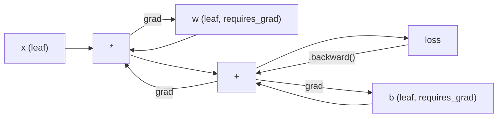
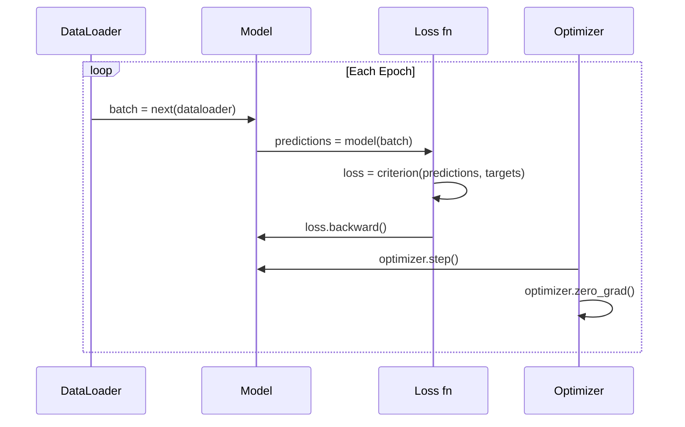

# Wprowadzenie do PyTorch

> Zbudowałeś silnik z tłoków i wałów korbowych. Teraz naucz się tego, którym naprawdę jeżdżą wszyscy.

**Typ:** Kompilacja
**Języki:** Python
**Wymagania wstępne:** Lekcja 03.10 (Zbuduj własny mini framework)
**Czas:** ~75 minut

## Cele nauczania

- Buduj i trenuj sieci neuronowe za pomocą nn.Module, nn.Sequential i autogradu PyTorch
- Użyj tensorów PyTorch, akceleracji GPU i standardowej pętli treningowej (zero_grad, do przodu, strata, do tyłu, krok)
- Konwertuj od podstaw komponenty mini frameworka na ich odpowiedniki w PyTorch
- Profiluj i porównuj prędkość uczenia się między frameworkiem opartym wyłącznie na Pythonie i PyTorch w ramach tego samego zadania

## Problem

Masz działający mini framework. Warstwy liniowe, ReLU, dropout, norma wsadowa, Adam, DataLoader, pętla treningowa. Uczy sieć 4-warstwową w zakresie problemu klasyfikacji okręgów w czystym Pythonie.

Jest także 500 razy wolniejszy niż PyTorch w przypadku tego samego problemu.

Twój mini framework przetwarza jedną próbkę na raz za pomocą zagnieżdżonych pętli Pythona. PyTorch wysyła te same operacje do zoptymalizowanych jąder C++/CUDA, które działają na GPU. Na pojedynczej karcie NVIDIA A100 firma PyTorch szkoli ResNet-50 (parametry 25,6 mln) w sieci ImageNet (1,28 mln obrazów) w około 6 godzin. Twojemu frameworkowi wykonanie tego samego zadania zajęłoby około 3000 godzin — gdyby najpierw nie zabrakło mu pamięci.

Prędkość nie jest jedyną różnicą. Twój framework nie obsługuje GPU. Brak automatycznego różnicowania - ręcznie napisałeś funkcję backward() dla każdego modułu. Brak serializacji. Brak szkoleń rozproszonych. Brak mieszanej precyzji. Nie ma możliwości debugowania przepływu gradientu bez instrukcji print.

PyTorch wypełnia każdą z tych luk. Robi to, zachowując dokładnie ten sam model mentalny, który już zbudowałeś: moduł, forward(), parametry(), backward(), optymalizator.step(). Pojęcia przekazują się jeden do jednego. Składnia jest prawie identyczna. Różnica polega na tym, że PyTorch łączy dekadę inżynierii systemów z tym samym interfejsem, który zaprojektowałeś od podstaw.

## Koncepcja

### Dlaczego PyTorch wygrał

W 2015 r. TensorFlow wymagał zdefiniowania statycznego wykresu obliczeniowego przed uruchomieniem czegokolwiek. Zbudowałeś wykres, skompilowałeś go, a następnie przepuściłeś przez niego dane. Debugowanie oznaczało wpatrywanie się w wizualizacje wykresów. Zmiana architektury oznaczała przebudowanie wykresu od zera.

PyTorch wystartował w 2017 roku z inną filozofią: gorliwą realizacją. Piszesz w Pythonie. Działa natychmiast. `y = model(x)` faktycznie oblicza y teraz, a nie „dodaje węzeł do wykresu, który obliczy y później”. Oznaczało to, że działały standardowe narzędzia do debugowania Pythona. print() zadziałało. pdb zadziałało. if/else w twoim podaniu do przodu zadziałało.

Do 2020 r. rynek przemówił. Udział PyTorch w artykułach naukowych dotyczących ML wzrósł z 7% (2017) do ponad 75% (2022). Meta, Google DeepMind, OpenAI, Anthropic i Hugging Face wykorzystują PyTorch jako podstawową platformę. W odpowiedzi TensorFlow 2.x przyjął gorliwe wykonanie - milczące przyznanie, że projekt PyTorch był poprawny.

Lekcja: związki doświadczenia programisty. Framework, który jest o 10% wolniejszy, ale o 50% szybszy w debugowaniu, wygrywa za każdym razem.

### Tensory

Tensor to wielowymiarowa tablica z trzema krytycznymi właściwościami: kształtem, typem i urządzeniem.

```python
import torch

x = torch.zeros(3, 4)           # shape: (3, 4), dtype: float32, device: cpu
x = torch.randn(2, 3, 224, 224) # batch of 2 RGB images, 224x224
x = torch.tensor([1, 2, 3])     # from a Python list
```

**Kształt** to wymiarowość. Skalar to kształt (), wektor to (n,), macierz to (m, n), partia obrazów to (partia, kanały, wysokość, szerokość).

**Dtype** kontroluje precyzję i pamięć.

| typ | Bity | Zakres | Przypadek użycia |
|-------|------|-------|---------|
| float32 | 32 | ~7 cyfr dziesiętnych | Domyślne szkolenie |
| pływak16 | 16 | ~3,3 cyfry dziesiętne | Mieszana precyzja |
| bfloat16 | 16 | Ten sam zakres co float32, mniejsza precyzja | Szkolenie LLM |
| int8 | 8 | -128 do 127 | Kwantowane wnioskowanie |

**Urządzenie** określa, gdzie mają miejsce obliczenia.

```python
device = torch.device("cuda" if torch.cuda.is_available() else "cpu")
x = torch.randn(3, 4, device=device)
x = x.to("cuda")
x = x.cpu()
```

Każda operacja wymaga wszystkich tensorów na tym samym urządzeniu. To błąd nr 1 wśród początkujących użytkowników PyTorcha: `RuntimeError: Expected all tensors to be on the same device`. Napraw to, przenosząc wszystko na to samo urządzenie przed obliczeniami.

**Przekształcanie** ma charakter ciągły — zmienia metadane, a nie dane.

```python
x = torch.randn(2, 3, 4)
x.view(2, 12)      # reshape to (2, 12) -- must be contiguous
x.reshape(6, 4)    # reshape to (6, 4) -- works always
x.permute(2, 0, 1) # reorder dimensions
x.unsqueeze(0)     # add dimension: (1, 2, 3, 4)
x.squeeze()        # remove size-1 dimensions
```

### Autograd

Twój mini framework wymagał implementacji funkcji backward() dla każdego modułu. PyTorch tego nie robi. Rejestruje każdą operację na tensorach w ukierunkowanym grafie acyklicznym (wykres obliczeniowy), a następnie przechodzi przez ten wykres w odwrotnej kolejności, aby automatycznie obliczyć gradienty.



Kluczowa różnica w stosunku do Twojego frameworka: PyTorch używa automatycznej porównywania opartej na taśmie. Każda operacja jest zapisywana na „taśmie” podczas przebiegu do przodu. Wywołanie `.backward()` powoduje odtworzenie taśmy w odwrotnej kolejności.

```python
x = torch.randn(3, requires_grad=True)
y = x ** 2 + 3 * x
z = y.sum()
z.backward()
print(x.grad)  # dz/dx = 2x + 3
```

Trzy zasady autogradu:

1. Tylko tensory liści z `requires_grad=True` gromadzą gradienty
2. Gradienty akumulują się domyślnie — wywołaj `optimizer.zero_grad()` przed każdym przejściem wstecz
3. `torch.no_grad()` wyłącza śledzenie gradientu (używaj podczas oceny)

### nn.Moduł

`nn.Module` to klasa bazowa dla każdego komponentu sieci neuronowej w PyTorch. Tę abstrakcję zbudowałeś już w Lekcji 10. Wersja PyTorcha dodaje automatyczną rejestrację parametrów, rekurencyjne wykrywanie modułów, zarządzanie urządzeniami i serializację stanu.

```python
import torch.nn as nn

class MLP(nn.Module):
    def __init__(self, input_dim, hidden_dim, output_dim):
        super().__init__()
        self.layer1 = nn.Linear(input_dim, hidden_dim)
        self.relu = nn.ReLU()
        self.layer2 = nn.Linear(hidden_dim, output_dim)

    def forward(self, x):
        x = self.layer1(x)
        x = self.relu(x)
        x = self.layer2(x)
        return x
```

Kiedy przypiszesz `nn.Module` lub `nn.Parameter` jako atrybut w `__init__`, PyTorch automatycznie go zarejestruje. `model.parameters()` rekurencyjnie zbiera każdy zarejestrowany parametr. Dlatego nigdy nie musisz ręcznie zbierać ciężarów, jak miało to miejsce w mini frameworku.

Kluczowe elementy konstrukcyjne:

| Moduł | Co to robi | Parametry |
|------------|------------|------------|
| nn.Liniowy(wejście, wyjście) | Wx + b | wejście*wyjście + wyjście |
| nn.Conv2d(in_ch, out_ch, k) | Splot 2D | in_ch*out_ch*k*k + out_ch |
| nn.BatchNorm1d(cechy) | Normalizuj aktywacje | 2 * funkcje |
| nn.Rezygnacja(p) | Losowe zerowanie | 0 |
| nn.ReLU() | maks.(0, x) | 0 |
| nn.GELU() | Liniowy błąd Gaussa | 0 |
| nn.Embedding(słownictwo, przyciemnienie) | Tabela przeglądowa | słownictwo * przyćmione |
| nn.LayerNorm(dim) | Normalizacja na próbkę | 2 * przyciemnienie |

### Funkcje strat i optymalizatory

PyTorch dostarcza gotowe do produkcji wersje wszystkiego, co zbudowałeś.

**Funkcje straty** (z `torch.nn`):

| Strata | Zadanie | Wejście |
|------|------|------|
| nn.MSELStrata() | Regresja | Dowolny kształt |
| nn.CrossEntropyLoss() | Klasyfikacja wieloklasowa | Logity (nie softmax) |
| nn.BCEWithLogitsLoss() | Klasyfikacja binarna | Logity (nie sigmoidalne) |
| nn.L1Strata() | Regresja (solidna) | Dowolny kształt |
| nn.CTCLoss() | Dopasowanie sekwencji | Zaloguj prawdopodobieństwa |

Uwaga: `CrossEntropyLoss` łączy wewnętrznie `LogSoftmax` + `NLLLoss`. Przekazuj surowe logity, a nie wyjścia softmax. Jest to częsty błąd, który po cichu powoduje nieprawidłowe gradienty.

**Optymalizatory** (z `torch.optim`):

| Optymalizator | Kiedy używać | Typowy LR |
|----------|------------|----------|
| SGD(parametry, lr, pęd) | CNN, dobrze dostrojone rurociągi | 0,01--0,1 |
| Adam(params, lr) | Domyślny punkt początkowy | 1e-3 |
| AdamW(params, lr, rozkład_wagi) | Transformatory, dostrajanie | 1e-4--1e-3 |
| LBFGS(parametry) | Mała skala, drugiego rzędu | 1,0 |

### Pętla treningowa

Każda pętla treningowa PyTorch przebiega według tego samego 5-etapowego schematu. Znasz to już z lekcji 10.



Wzór kanoniczny:

```python
for epoch in range(num_epochs):
    model.train()
    for inputs, targets in train_loader:
        inputs, targets = inputs.to(device), targets.to(device)
        optimizer.zero_grad()
        outputs = model(inputs)
        loss = criterion(outputs, targets)
        loss.backward()
        optimizer.step()
```

Pięć linii wewnątrz pętli wsadowej. Pięć linii, które trenowały GPT-4, Stable Diffusion i LLaMA. Architektura się zmienia. Dane się zmieniają. Te pięć linii tego nie robi.

### Zbiór danych i moduł ładujący dane

`Dataset` PyTorcha to klasa abstrakcyjna z dwiema metodami: `__len__` i `__getitem__`. `DataLoader` obejmuje przetwarzanie wsadowe, tasowanie i wieloprocesowe ładowanie danych.

```python
from torch.utils.data import Dataset, DataLoader

class MNISTDataset(Dataset):
    def __init__(self, images, labels):
        self.images = images
        self.labels = labels

    def __len__(self):
        return len(self.labels)

    def __getitem__(self, idx):
        return self.images[idx], self.labels[idx]

loader = DataLoader(dataset, batch_size=64, shuffle=True, num_workers=4)
```

`num_workers=4` uruchamia 4 procesy, które ładują dane równolegle, podczas gdy procesor graficzny uczy się w bieżącej partii. W przypadku obciążeń związanych z dyskiem (duże obrazy, dźwięk) samo to może podwoić prędkość uczenia.

### Szkolenie GPU

Przenoszenie modelu do GPU:

```python
device = torch.device("cuda" if torch.cuda.is_available() else "cpu")
model = model.to(device)
```

To rekurencyjnie przenosi każdy parametr i bufor do procesora graficznego. Następnie przesuwaj każdą partię podczas treningu:

```python
inputs, targets = inputs.to(device), targets.to(device)
```

**Mieszana precyzja** zmniejsza o połowę zużycie pamięci i podwaja przepustowość na nowoczesnych procesorach graficznych (A100, H100, RTX 4090), przechodząc do przodu/do tyłu w trybie float16, zachowując wagi główne w trybie float32:

```python
from torch.amp import autocast, GradScaler

scaler = GradScaler()
for inputs, targets in loader:
    with autocast(device_type="cuda"):
        outputs = model(inputs)
        loss = criterion(outputs, targets)
    scaler.scale(loss).backward()
    scaler.step(optimizer)
    scaler.update()
    optimizer.zero_grad()
```

### Porównanie: Mini Framework vs PyTorch vs JAX

| Funkcja | Mini Framework (L10) | PyTorch | JAX |
|--------|---------------------|---------|-----|
| Automatyczna różnica | Ręczne wstecz() | Autograd oparty na taśmie | Transformacje funkcjonalne |
| Wykonanie | Chętny (pętle Pythona) | Chętny (jądra C++) | Śledzenie + skompilowano JIT |
| Obsługa GPU | Nie | Tak (CUDA, ROCm, MPS) | Tak (CUDA, TPU) |
| Prędkość (MNIST MLP) | ~300 s/epokę | ~0,5 s/epokę | ~0,3 s/epokę |
| Układ modułowy | Klasa modułu niestandardowego | nn.Moduł | Funkcje bezstanowe (len/równonoc) |
| Debugowanie | drukuj() | print(), pdb, punkt przerwania() | Trudniej (śledzenie JIT przerywa drukowanie) |
| Ekosystem | Brak | Przytulająca twarz, błyskawica, Timm | Len, Optax, Orbax |
| Krzywa uczenia się | Zbudowałeś to | Umiarkowany | Stromy (paradygmat funkcjonalny) |
| Zastosowanie produkcyjne | Problemy z zabawkami | Meta, OpenAI, Anthropic, HF | Google DeepMind, Midjourney |

## Zbuduj to

3-warstwowy MLP trenowany na MNIST przy użyciu wyłącznie prymitywów PyTorch. Brak opakowań wysokiego poziomu. Nie `torchvision.datasets`. Sami pobieramy i analizujemy surowe dane.

### Krok 1: Załaduj MNIST z plików surowych

MNIST jest dostarczany w postaci 4 plików spakowanych w formacie gzip: obrazy szkoleniowe (60 000 x 28 x 28), etykiety szkoleniowe, obrazy testowe (10 000 x 28 x 28), etykiety testowe. Pobieramy je i analizujemy format binarny.

```python
import torch
import torch.nn as nn
import struct
import gzip
import urllib.request
import os

def download_mnist(path="./mnist_data"):
    base_url = "https://storage.googleapis.com/cvdf-datasets/mnist/"
    files = [
        "train-images-idx3-ubyte.gz",
        "train-labels-idx1-ubyte.gz",
        "t10k-images-idx3-ubyte.gz",
        "t10k-labels-idx1-ubyte.gz",
    ]
    os.makedirs(path, exist_ok=True)
    for f in files:
        filepath = os.path.join(path, f)
        if not os.path.exists(filepath):
            urllib.request.urlretrieve(base_url + f, filepath)

def load_images(filepath):
    with gzip.open(filepath, "rb") as f:
        magic, num, rows, cols = struct.unpack(">IIII", f.read(16))
        data = f.read()
        images = torch.frombuffer(bytearray(data), dtype=torch.uint8)
        images = images.reshape(num, rows * cols).float() / 255.0
    return images

def load_labels(filepath):
    with gzip.open(filepath, "rb") as f:
        magic, num = struct.unpack(">II", f.read(8))
        data = f.read()
        labels = torch.frombuffer(bytearray(data), dtype=torch.uint8).long()
    return labels
```

### Krok 2: Zdefiniuj model

3-warstwowy MLP: 784 -> 256 -> 128 -> 10. Aktywacje ReLU. Rezygnacja z regularyzacji. Brak norm wsadowych, aby było to proste.

```python
class MNISTModel(nn.Module):
    def __init__(self):
        super().__init__()
        self.net = nn.Sequential(
            nn.Linear(784, 256),
            nn.ReLU(),
            nn.Dropout(0.2),
            nn.Linear(256, 128),
            nn.ReLU(),
            nn.Dropout(0.2),
            nn.Linear(128, 10),
        )

    def forward(self, x):
        return self.net(x)
```

Warstwa wyjściowa tworzy 10 surowych logitów (po jednym na cyfrę). Żaden softmax — `CrossEntropyLoss` obsługuje to wewnętrznie.

Liczba parametrów: 784*256 + 256 + 256*128 + 128 + 128*10 + 10 = 235 146. Mały jak na współczesne standardy. Mały GPT-2 ma 124M. To trenuje w ciągu kilku sekund.

### Krok 3: Pętla treningowa

Kanoniczny wzór krok w przód – strata – krok w tył.

```python
def train_one_epoch(model, loader, criterion, optimizer, device):
    model.train()
    total_loss = 0
    correct = 0
    total = 0
    for images, labels in loader:
        images, labels = images.to(device), labels.to(device)
        optimizer.zero_grad()
        outputs = model(images)
        loss = criterion(outputs, labels)
        loss.backward()
        optimizer.step()
        total_loss += loss.item() * images.size(0)
        _, predicted = outputs.max(1)
        correct += predicted.eq(labels).sum().item()
        total += labels.size(0)
    return total_loss / total, correct / total

def evaluate(model, loader, criterion, device):
    model.eval()
    total_loss = 0
    correct = 0
    total = 0
    with torch.no_grad():
        for images, labels in loader:
            images, labels = images.to(device), labels.to(device)
            outputs = model(images)
            loss = criterion(outputs, labels)
            total_loss += loss.item() * images.size(0)
            _, predicted = outputs.max(1)
            correct += predicted.eq(labels).sum().item()
            total += labels.size(0)
    return total_loss / total, correct / total
```

Uwaga `torch.no_grad()` podczas oceny. Wyłącza to autograd, zmniejszając zużycie pamięci i przyspieszając wnioskowanie. Bez tego PyTorch tworzy wykres obliczeniowy, którego nigdy nie używasz.

### Krok 4: Połącz wszystko razem

```python
def main():
    device = torch.device("cuda" if torch.cuda.is_available() else "cpu")

    download_mnist()
    train_images = load_images("./mnist_data/train-images-idx3-ubyte.gz")
    train_labels = load_labels("./mnist_data/train-labels-idx1-ubyte.gz")
    test_images = load_images("./mnist_data/t10k-images-idx3-ubyte.gz")
    test_labels = load_labels("./mnist_data/t10k-labels-idx1-ubyte.gz")

    train_dataset = torch.utils.data.TensorDataset(train_images, train_labels)
    test_dataset = torch.utils.data.TensorDataset(test_images, test_labels)
    train_loader = torch.utils.data.DataLoader(
        train_dataset, batch_size=64, shuffle=True
    )
    test_loader = torch.utils.data.DataLoader(
        test_dataset, batch_size=256, shuffle=False
    )

    model = MNISTModel().to(device)
    criterion = nn.CrossEntropyLoss()
    optimizer = torch.optim.Adam(model.parameters(), lr=1e-3)

    num_params = sum(p.numel() for p in model.parameters())
    print(f"Device: {device}")
    print(f"Parameters: {num_params:,}")
    print(f"Train samples: {len(train_dataset):,}")
    print(f"Test samples: {len(test_dataset):,}")
    print()

    for epoch in range(10):
        train_loss, train_acc = train_one_epoch(
            model, train_loader, criterion, optimizer, device
        )
        test_loss, test_acc = evaluate(
            model, test_loader, criterion, device
        )
        print(
            f"Epoch {epoch+1:2d} | "
            f"Train Loss: {train_loss:.4f} | Train Acc: {train_acc:.4f} | "
            f"Test Loss: {test_loss:.4f} | Test Acc: {test_acc:.4f}"
        )

    torch.save(model.state_dict(), "mnist_mlp.pt")
    print(f"\nModel saved to mnist_mlp.pt")
    print(f"Final test accuracy: {test_acc:.4f}")
```

Oczekiwany wynik po 10 epokach: dokładność testu ~97,8%. Czas szkolenia na procesorze: ~30 sekund. Na GPU: ~5 sekund. Na Twoim mini frameworku o tej samej architekturze: ~45 minut.

## Użyj tego

### Szybkie porównanie: Mini Framework kontra PyTorch

| Mini Framework (lekcja 10) | PyTorch |
|--------------------------|---------|
| `model = Sequential(Linear(784, 256), ReLU(), ...)` | `model = nn.Sequential(nn.Linear(784, 256), nn.ReLU(), ...)` |
| `pred = model.forward(x)` | `pred = model(x)` |
| `optimizer.zero_grad()` | `optimizer.zero_grad()` |
| `grad = criterion.backward()` następnie `model.backward(grad)` | `loss.backward()` |
| `optimizer.step()` | `optimizer.step()` |
| Brak procesora graficznego | `model.to("cuda")` |
| Ręczne przewijanie do tyłu dla każdego modułu | Autograd zajmuje się wszystkim |

Interfejs jest prawie identyczny. Różnica polega na tym, co znajduje się pod maską.

### Zapisywanie i ładowanie modeli

```python
torch.save(model.state_dict(), "model.pt")

model = MNISTModel()
model.load_state_dict(torch.load("model.pt", weights_only=True))
model.eval()
```

Zawsze zapisuj `state_dict()` (słownik parametrów), a nie obiekt modelu. Zapisywanie obiektu modelu wykorzystuje opcję pickle, która psuje się podczas refaktoryzacji kodu. Nakazy stanowe są przenośne.

### Planowanie szybkości uczenia się

```python
scheduler = torch.optim.lr_scheduler.CosineAnnealingLR(
    optimizer, T_max=10
)
for epoch in range(10):
    train_one_epoch(model, train_loader, criterion, optimizer, device)
    scheduler.step()
```

PyTorch dostarcza ponad 15 programów planujących: StepLR, ExponentialLR, CosineAnnealingLR, OneCycleLR, RedukcyjneLROnPlateau. Wszystkie podłączają się do tego samego interfejsu optymalizatora.

## Wyślij to

Ta lekcja generuje dwa artefakty:

- `outputs/prompt-pytorch-debugger.md` – monit o diagnozowanie typowych błędów w szkoleniu PyTorch
- `outputs/skill-pytorch-patterns.md` — odniesienie do umiejętności w zakresie wzorców szkoleniowych PyTorch

## Ćwiczenia

1. **Dodaj normalizację wsadową.** Wstaw `nn.BatchNorm1d` po każdej warstwie liniowej (przed aktywacją). Porównaj dokładność testu i szybkość treningu z wersją tylko dla osób, które porzuciły naukę. Norma partii powinna osiągnąć 98%+ w mniejszej liczbie epok.

2. **Zaimplementuj narzędzie do wyszukiwania szybkości uczenia się.** Trenuj przez jedną epokę z wykładniczo rosnącym współczynnikiem uczenia się (od 1e-7 do 1.0). Strata działki vs LR. Optymalny LR występuje tuż przed tym, jak strata zaczyna rosnąć. Użyj tego, aby wybrać lepszy LR dla modelu MNIST.

3. **Port do GPU z mieszaną precyzją.** Dodaj `torch.amp.autocast` i `GradScaler` do pętli szkoleniowej. Zmierz przepustowość (próbki/sekundę) z mieszaną precyzją i bez niej na GPU. Na A100 spodziewaj się ~2x przyspieszenia.

4. **Utwórz własny zestaw danych.** Pobierz Fashion-MNIST (ten sam format co MNIST, ale z elementami odzieży). Zaimplementuj klasę `FashionMNISTDataset(Dataset)` z klasą `__getitem__` i `__len__`. Trenuj ten sam MLP i porównuj dokładność. Moda-MNIST jest trudniejsza – spodziewaj się ~88% vs ~98%.

5. **Zastąp Adama SGD + pęd.** Trenuj z `SGD(params, lr=0.01, momentum=0.9)`. Porównaj krzywe zbieżności. Następnie dodaj moduł planujący `CosineAnnealingLR` i sprawdź, czy SGD dogoni Adama w epoce 10.

## Kluczowe terminy

| Termin | Co ludzie mówią | Co to właściwie oznacza |
|------|----------------|----------------------|
| Tensor | „Tablica wielowymiarowa” | Wpisana tablica obsługująca urządzenia z obsługą automatycznego różnicowania wbudowaną w każdą operację |
| Autograd | „Automatyczne podparcie” | System oparty na taśmach, który rejestruje operacje podczas przejścia do przodu, a następnie odtwarza je w odwrotnej kolejności, aby obliczyć dokładne nachylenia |
| nn.Moduł | „Warstwa” | Klasa bazowa dla dowolnego różniczkowalnego bloku obliczeniowego - rejestruje parametry, obsługuje zagnieżdżanie, obsługuje tryby train/eval |
| stan_dykt | „Wagi modelu” | OrderedDict mapujący nazwy parametrów na tensory — przenośna, nadająca się do serializacji reprezentacja wyuczonego modelu |
| .wstecz() | „Oblicz gradienty” | Przemierzaj wykres obliczeniowy w odwrotnej kolejności, obliczając i akumulując gradienty dla każdego tensora liścia za pomocą require_grad=True |
| .do(urządzenia) | „Przenieś do GPU” | Rekurencyjnie przesyłaj wszystkie parametry i bufory do określonego urządzenia (CPU, CUDA, MPS) |
| Moduł ładowania danych | „Potok danych” | Iterator, który grupuje, tasuje i opcjonalnie równolegle ładuje dane ze zbioru danych |
| Mieszana precyzja | „Użyj float16” | Trenuj z pływakiem 16 do przodu/do tyłu, aby uzyskać prędkość, zachowując główne ciężary float 32 w celu zapewnienia stabilności numerycznej |
| Chętna egzekucja | „Uruchom teraz” | Operacje są wykonywane natychmiast po wywołaniu, bez odkładania ich na późniejszy etap kompilacji — podstawowy wybór projektu, który odróżnia PyTorch od TF 1.x |
| stopień_zero | „Zresetuj gradienty” | Ustaw wszystkie gradienty parametrów na zero przed następnym przejściem wstecz, ponieważ PyTorch domyślnie gromadzi gradienty |

## Dalsze czytanie

– Paszke i in., „PyTorch: An Imperative Style, High-Performance Deep Learning Library” (2019) – oryginalny artykuł wyjaśniający kompromisy projektowe PyTorch
- Poradniki PyTorch: „Nauka PyTorch z przykładami” (https://pytorch.org/tutorials/beginner/pytorch_with_examples.html) — oficjalna ścieżka od tensorów do nn.Module
- Przewodnik dostrajania wydajności PyTorch (https://pytorch.org/tutorials/recipes/recipes/tuning_guide.html) - precyzja mieszana, procesy robocze DataLoader, przypięta pamięć i inne optymalizacje produkcyjne
— Horace He, „Making Deep Learning Go Brrrr” (https://horace.io/brrr_intro.html) — dlaczego szkolenie GPU jest szybkie dzięki strategiom optymalizacji specyficznym dla PyTorch