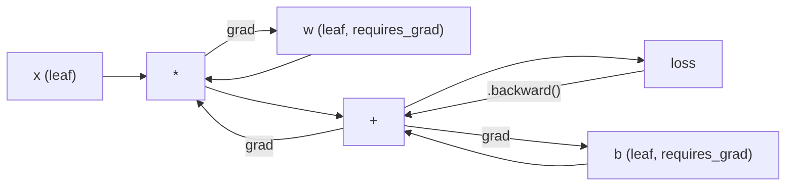
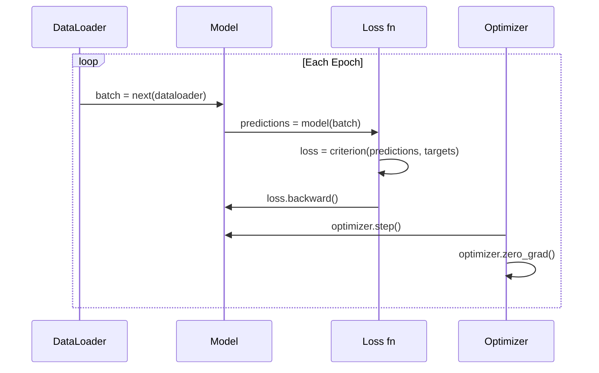

# Wprowadzenie do PyTorch

> Zbudowałeś silnik z pistonów i wałów korbowych. Teraz poznaj ten, którym faktycznie wszyscy jeżdżą.

**Typ:** Build
**Języki:** Python
**Wymagania wstępne:** Lekcja 03.10 (Build Your Own Mini Framework)
**Czas:** ~75 minut

## Cele nauki

- Budowanie i trenowanie sieci neuronowych przy użyciu `nn.Module`, `nn.Sequential` i autograd w PyTorch
- Wykorzystanie tensorów PyTorch, akceleracji GPU oraz standardowej pętli treningowej (zero_grad, forward, loss, backward, step)
- Przekształcenie komponentów Twojego mini frameworka napisanego od zera na ich odpowiedniki w PyTorch
- Profilowanie i porównanie prędkości treningu Twojego frameworka w czystym Pythonie i PyTorch na tym samym zadaniu

## Problem

Masz działający mini framework. Warstwy liniowe, ReLU, dropout, batch norm, Adam, DataLoader, pętla treningowa. Trenuje on 4-warstwową sieć na problemie klasyfikacji okręgów w czystym Pythonie.

Jest też 500 razy wolniejszy niż PyTorch na tym samym problemie.

Twój mini framework przetwarza jedną próbkę na raz, korzystając z zagnieżdżonych pętli w Pythonie. PyTorch przekazuje te same operacje do zoptymalizowanych jąder C++/CUDA, działających na GPU. Na pojedynczym NVIDIA A100, PyTorch trenuje ResNet-50 (25,6 mln parametrów) na ImageNet (1,28 mln obrazów) w około 6 godzin. Twój framework zająłby na tym samym zadaniu około 3000 godzin -- o ile wcześniej nie zabrakłoby pamięci.

Prędkość to nie jedyna różnica. Twój framework nie ma obsługi GPU. Nie ma automatycznego różnicowania -- backward() musiałeś napisać ręcznie dla każdego modułu. Nie ma serializacji. Nie ma treningu rozproszonego. Nie ma mixed precision. Nie ma sposobu na debugowanie przepływu gradientów bez instrukcji print.

PyTorch wypełnia każdą z tych luk. I robi to, zachowując ten sam model mentalny, który już zbudowałeś: Module, forward(), parameters(), backward(), optimizer.step(). Koncepcje przenoszą się jeden do jednego. Składnia jest praktycznie identyczna. Różnica polega na tym, że PyTorch owija dekadę inżynierii systemowej w ten sam interfejs, który zaprojektowałeś od zera.

## Koncepcja

### Czemu PyTorch wygrał

W 2015 roku TensorFlow wymagał zdefiniowania statycznego grafu obliczeń przed uruchomieniem czegokolwiek. Budowałeś graf, kompilowałeś go, a następnie przepuszczałeś przez niego dane. Debugowanie polegało na wpatrywaniu się w wizualizacje grafów. Zmiana architektury oznaczała przebudowę grafu od zera.

PyTorch wystartował w 2017 roku z inną filozofią: eager execution (wykonanie chętne). Piszesz Python. Wykonuje się natychmiast. `y = model(x)` faktycznie oblicza y w tym momencie, a nie "dodaje węzeł do grafu, który obliczy y później". To oznaczało, że standardowe narzędzia debugujące Pythona działały. print() działało. pdb działało. if/else w forward pass działało.

Do 2020 roku rynek przemówił. Udział PyTorch w pracach badawczych ML wzrósł z 7% (2017) do ponad 75% (2022). Meta, Google DeepMind, OpenAI, Anthropic i Hugging Face wszyscy używają PyTorch jako głównego frameworka. TensorFlow 2.x w odpowiedzi przyjął eager execution -- niewypowiedziane przyznanie, że projekt PyTorch był poprawny.

Wniosek: doświadczenie programisty się kumuluje. Framework, który jest o 10% wolniejszy, ale o 50% łatwiejszy do debugowania, wygrywa za każdym razem.

### Tensory

Tensor to wielowymiarowa tablica z trzema krytycznymi właściwościami: shape (kształt), dtype (typ danych) i device (urządzenie).

```python
import torch

x = torch.zeros(3, 4)           # shape: (3, 4), dtype: float32, device: cpu
x = torch.randn(2, 3, 224, 224) # batch of 2 RGB images, 224x224
x = torch.tensor([1, 2, 3])     # from a Python list
```

**Shape** to wymiarowość. Skalar ma shape (), wektor (n,), macierz (m, n), a batch obrazów (batch, channels, height, width).

**Dtype** kontroluje precyzję i zużycie pamięci.

| dtype | Bity | Zakres | Zastosowanie |
|-------|------|-------|----------|
| float32 | 32 | ~7 cyfr dziesiętnych | Domyślny dla treningu |
| float16 | 16 | ~3,3 cyfr dziesiętnych | Mixed precision |
| bfloat16 | 16 | Taki zakres jak float32, mniejsza precyzja | Trening LLM |
| int8 | 8 | -128 do 127 | Skwantyzowana inferencja |

**Device** określa, gdzie odbywają się obliczenia.

```python
device = torch.device("cuda" if torch.cuda.is_available() else "cpu")
x = torch.randn(3, 4, device=device)
x = x.to("cuda")
x = x.cpu()
```

Każda operacja wymaga, by wszystkie tensory znajdowały się na tym samym urządzeniu. To błąd numer 1, na który trafiają początkujący w PyTorch: `RuntimeError: Expected all tensors to be on the same device`. Napraw to, przenosząc wszystko na to samo urządzenie przed obliczeniami.

**Reshaping (zmiana kształtu)** odbywa się w czasie stałym -- zmienia metadane, nie same dane.

```python
x = torch.randn(2, 3, 4)
x.view(2, 12)      # reshape to (2, 12) -- must be contiguous
x.reshape(6, 4)    # reshape to (6, 4) -- works always
x.permute(2, 0, 1) # reorder dimensions
x.unsqueeze(0)     # add dimension: (1, 2, 3, 4)
x.squeeze()        # remove size-1 dimensions
```

### Autograd

Twój mini framework wymagał implementacji backward() dla każdego modułu. PyTorch tego nie wymaga. Zapisuje każdą operację na tensorach do skierowanego grafu acyklicznego (graf obliczeniowy), a następnie przechodzi przez ten graf w odwrotnym kierunku, aby automatycznie obliczyć gradienty.



Kluczowa różnica względem Twojego frameworka: PyTorch używa autodiff opartego na "taśmie" (tape-based). Każda operacja jest dopisywana do "taśmy" w trakcie forward pass. Wywołanie `.backward()` odtwarza taśmę w odwrotnym kierunku.

```python
x = torch.randn(3, requires_grad=True)
y = x ** 2 + 3 * x
z = y.sum()
z.backward()
print(x.grad)  # dz/dx = 2x + 3
```

Trzy zasady autograd:

1. Tylko tensory-listki (leaf tensors) z `requires_grad=True` akumulują gradienty
2. Gradienty domyślnie się kumulują -- wywołaj `optimizer.zero_grad()` przed każdym backward pass
3. `torch.no_grad()` wyłącza śledzenie gradientów (używaj podczas ewaluacji)

### nn.Module

`nn.Module` to klasa bazowa dla każdego komponentu sieci neuronowej w PyTorch. Tę abstrakcję już zbudowałeś w Lekcji 10. Wersja PyTorch dodaje automatyczną rejestrację parametrów, rekursywne wykrywanie modułów, zarządzanie urządzeniami oraz serializację state dict.

```python
import torch.nn as nn

class MLP(nn.Module):
    def __init__(self, input_dim, hidden_dim, output_dim):
        super().__init__()
        self.layer1 = nn.Linear(input_dim, hidden_dim)
        self.relu = nn.ReLU()
        self.layer2 = nn.Linear(hidden_dim, output_dim)

    def forward(self, x):
        x = self.layer1(x)
        x = self.relu(x)
        x = self.layer2(x)
        return x
```

Kiedy przypisujesz `nn.Module` lub `nn.Parameter` jako atrybut w `__init__`, PyTorch automatycznie go rejestruje. `model.parameters()` rekursywnie zbiera każdy zarejestrowany parametr. Dlatego nigdy nie musisz ręcznie zbierać wag, tak jak robiłeś to w mini frameworku.

Kluczowe komponenty:

| Moduł | Co robi | Parametry |
|--------|-------------|------------|
| nn.Linear(in, out) | Wx + b | in*out + out |
| nn.Conv2d(in_ch, out_ch, k) | Konwolucja 2D | in_ch*out_ch*k*k + out_ch |
| nn.BatchNorm1d(features) | Normalizacja aktywacji | 2 * features |
| nn.Dropout(p) | Losowe zerowanie | 0 |
| nn.ReLU() | max(0, x) | 0 |
| nn.GELU() | Gaussian error linear | 0 |
| nn.Embedding(vocab, dim) | Tabela mapowania (lookup table) | vocab * dim |
| nn.LayerNorm(dim) | Normalizacja per-sample | 2 * dim |

### Funkcje straty i optymalizatory

PyTorch dostarcza produkcyjne wersje wszystkiego, co zbudowałeś.

**Funkcje straty** (z `torch.nn`):

| Funkcja straty | Zadanie | Wejście |
|------|------|-------|
| nn.MSELoss() | Regresja | Każdy kształt |
| nn.CrossEntropyLoss() | Klasyfikacja wieloklasowa | Logity (nie softmax) |
| nn.BCEWithLogitsLoss() | Klasyfikacja binarna | Logity (nie sigmoid) |
| nn.L1Loss() | Regresja (odporna) | Każdy kształt |
| nn.CTCLoss() | Wyrównanie sekwencji | Logarytmy prawdopodobieństw |

Uwaga: `CrossEntropyLoss` wewnętrznie łączy `LogSoftmax` + `NLLLoss`. Przekazuj surowe logity, nie wyniki softmax. To częsty błąd, który po cichu produkuje niewłaściwe gradienty.

**Optymalizatory** (z `torch.optim`):

| Optymalizator | Kiedy stosować | Typowy LR |
|-----------|-------------|-----------|
| SGD(params, lr, momentum) | CNN-y, dobrze dostrojone pipeline'y | 0,01--0,1 |
| Adam(params, lr) | Domyślny punkt startowy | 1e-3 |
| AdamW(params, lr, weight_decay) | Transformery, fine-tuning | 1e-4--1e-3 |
| LBFGS(params) | Małe skale, drugiego rzędu | 1,0 |

### Pętla treningowa

Każda pętla treningowa w PyTorch działa według tego samego 5-etapowego wzorca. Znasz go już z Lekcji 10.



Kanoniczny wzorzec:

```python
for epoch in range(num_epochs):
    model.train()
    for inputs, targets in train_loader:
        inputs, targets = inputs.to(device), targets.to(device)
        optimizer.zero_grad()
        outputs = model(inputs)
        loss = criterion(outputs, targets)
        loss.backward()
        optimizer.step()
```

Pięć linii wewnątrz pętli batchowej. Pięć linii, które wytrenowały GPT-4, Stable Diffusion i LLaMA. Architektura się zmienia. Dane się zmieniają. Te pięć linii nie.

### Dataset i DataLoader

`Dataset` w PyTorch to klasa abstrakcyjna z dwiema metodami: `__len__` i `__getitem__`. `DataLoader` owija ją batchowaniem, mieszaniem (shuffling) oraz wieloprocesowym wczytywaniem danych.

```python
from torch.utils.data import Dataset, DataLoader

class MNISTDataset(Dataset):
    def __init__(self, images, labels):
        self.images = images
        self.labels = labels

    def __len__(self):
        return len(self.labels)

    def __getitem__(self, idx):
        return self.images[idx], self.labels[idx]

loader = DataLoader(dataset, batch_size=64, shuffle=True, num_workers=4)
```

`num_workers=4` tworzy 4 procesy, które wczytują dane równolegle, podczas gdy GPU trenuje na aktualnym batchu. Przy obciążeniach związanych z dyskiem (duże obrazy, audio) samo to może podwoić prędkość treningu.

### Trening na GPU

Przeniesienie modelu na GPU:

```python
device = torch.device("cuda" if torch.cuda.is_available() else "cpu")
model = model.to(device)
```

To rekursywnie przenosi każdy parametr i bufor na GPU. Następnie przenoś każdy batch w trakcie treningu:

```python
inputs, targets = inputs.to(device), targets.to(device)
```

**Mixed precision** zmniejsza zużycie pamięci o połowę i podwaja przepustowość na nowoczesnych GPU (A100, H100, RTX 4090), wykonując forward/backward w float16, jednocześnie zachowując główne wagi w float32:

```python
from torch.amp import autocast, GradScaler

scaler = GradScaler()
for inputs, targets in loader:
    with autocast(device_type="cuda"):
        outputs = model(inputs)
        loss = criterion(outputs, targets)
    scaler.scale(loss).backward()
    scaler.step(optimizer)
    scaler.update()
    optimizer.zero_grad()
```

### Porównanie: Mini Framework vs PyTorch vs JAX

| Cecha | Mini Framework (L10) | PyTorch | JAX |
|---------|---------------------|---------|-----|
| Autodiff | Ręczny backward() | Autograd oparty na taśmie | Funkcyjne transformacje |
| Wykonanie | Eager (pętle Python) | Eager (jądra C++) | Trasowane + kompilowane JIT |
| Wsparcie GPU | Nie | Tak (CUDA, ROCm, MPS) | Tak (CUDA, TPU) |
| Prędkość (MNIST MLP) | ~300s/epokę | ~0,5s/epokę | ~0,3s/epokę |
| System modułów | Własna klasa Module | nn.Module | Bezstanowe funkcje (Flax/Equinox) |
| Debugowanie | print() | print(), pdb, breakpoint() | Trudniejsze (JIT tracing łamie print) |
| Ekosystem | Brak | Hugging Face, Lightning, timm | Flax, Optax, Orbax |
| Krzywa uczenia | Sam to zbudowałeś | Umiarkowana | Wysoka (paradygmat funkcyjny) |
| Zastosowanie produkcyjne | Problemy zabawkowe | Meta, OpenAI, Anthropic, HF | Google DeepMind, Midjourney |

## Zbuduj to

3-warstwowy MLP wytrenowany na MNIST przy użyciu tylko prymitywów PyTorch. Bez wysokopoziomowych wrapperów. Bez `torchvision.datasets`. Surowe dane pobieramy i parsujemy sami.

### Krok 1: Wczytaj MNIST z surowych plików

MNIST jest dostarczany jako 4 spakowane gzipem pliki: obrazy treningowe (60 000 x 28 x 28), etykiety treningowe, obrazy testowe (10 000 x 28 x 28), etykiety testowe. Pobieramy je i parsujemy format binarny.

```python
import torch
import torch.nn as nn
import struct
import gzip
import urllib.request
import os

def download_mnist(path="./mnist_data"):
    base_url = "https://storage.googleapis.com/cvdf-datasets/mnist/"
    files = [
        "train-images-idx3-ubyte.gz",
        "train-labels-idx1-ubyte.gz",
        "t10k-images-idx3-ubyte.gz",
        "t10k-labels-idx1-ubyte.gz",
    ]
    os.makedirs(path, exist_ok=True)
    for f in files:
        filepath = os.path.join(path, f)
        if not os.path.exists(filepath):
            urllib.request.urlretrieve(base_url + f, filepath)

def load_images(filepath):
    with gzip.open(filepath, "rb") as f:
        magic, num, rows, cols = struct.unpack(">IIII", f.read(16))
        data = f.read()
        images = torch.frombuffer(bytearray(data), dtype=torch.uint8)
        images = images.reshape(num, rows * cols).float() / 255.0
    return images

def load_labels(filepath):
    with gzip.open(filepath, "rb") as f:
        magic, num = struct.unpack(">II", f.read(8))
        data = f.read()
        labels = torch.frombuffer(bytearray(data), dtype=torch.uint8).long()
    return labels
```

### Krok 2: Zdefiniuj model

3-warstwowy MLP: 784 -> 256 -> 128 -> 10. Aktywacje ReLU. Dropout do regularyzacji. Brak batch norm, aby zachować prostotę.

```python
class MNISTModel(nn.Module):
    def __init__(self):
        super().__init__()
        self.net = nn.Sequential(
            nn.Linear(784, 256),
            nn.ReLU(),
            nn.Dropout(0.2),
            nn.Linear(256, 128),
            nn.ReLU(),
            nn.Dropout(0.2),
            nn.Linear(128, 10),
        )

    def forward(self, x):
        return self.net(x)
```

Warstwa wyjściowa produkuje 10 surowych logitów (jeden na cyfrę). Bez softmax -- `CrossEntropyLoss` obsługuje to wewnętrznie.

Liczba parametrów: 784*256 + 256 + 256*128 + 128 + 128*10 + 10 = 235 146. Bardzo mało według dzisiejszych standardów. GPT-2 small ma 124M. Trenuje się to w ciągu kilku sekund.

### Krok 3: Pętla treningowa

Kanoniczny wzorzec forward-loss-backward-step.

```python
def train_one_epoch(model, loader, criterion, optimizer, device):
    model.train()
    total_loss = 0
    correct = 0
    total = 0
    for images, labels in loader:
        images, labels = images.to(device), labels.to(device)
        optimizer.zero_grad()
        outputs = model(images)
        loss = criterion(outputs, labels)
        loss.backward()
        optimizer.step()
        total_loss += loss.item() * images.size(0)
        _, predicted = outputs.max(1)
        correct += predicted.eq(labels).sum().item()
        total += labels.size(0)
    return total_loss / total, correct / total


def evaluate(model, loader, criterion, device):
    model.eval()
    total_loss = 0
    correct = 0
    total = 0
    with torch.no_grad():
        for images, labels in loader:
            images, labels = images.to(device), labels.to(device)
            outputs = model(images)
            loss = criterion(outputs, labels)
            total_loss += loss.item() * images.size(0)
            _, predicted = outputs.max(1)
            correct += predicted.eq(labels).sum().item()
            total += labels.size(0)
    return total_loss / total, correct / total
```

Zwróć uwagę na `torch.no_grad()` podczas ewaluacji. Wyłącza to autograd, zmniejszając zużycie pamięci i przyspieszając inferencję. Bez tego PyTorch budowałby graf obliczeniowy, którego nigdy nie użyjesz.

### Krok 4: Złóż wszystko razem

```python
def main():
    device = torch.device("cuda" if torch.cuda.is_available() else "cpu")

    download_mnist()
    train_images = load_images("./mnist_data/train-images-idx3-ubyte.gz")
    train_labels = load_labels("./mnist_data/train-labels-idx1-ubyte.gz")
    test_images = load_images("./mnist_data/t10k-images-idx3-ubyte.gz")
    test_labels = load_labels("./mnist_data/t10k-labels-idx1-ubyte.gz")

    train_dataset = torch.utils.data.TensorDataset(train_images, train_labels)
    test_dataset = torch.utils.data.TensorDataset(test_images, test_labels)
    train_loader = torch.utils.data.DataLoader(
        train_dataset, batch_size=64, shuffle=True
    )
    test_loader = torch.utils.data.DataLoader(
        test_dataset, batch_size=256, shuffle=False
    )

    model = MNISTModel().to(device)
    criterion = nn.CrossEntropyLoss()
    optimizer = torch.optim.Adam(model.parameters(), lr=1e-3)

    num_params = sum(p.numel() for p in model.parameters())
    print(f"Device: {device}")
    print(f"Parameters: {num_params:,}")
    print(f"Train samples: {len(train_dataset):,}")
    print(f"Test samples: {len(test_dataset):,}")
    print()

    for epoch in range(10):
        train_loss, train_acc = train_one_epoch(
            model, train_loader, criterion, optimizer, device
        )
        test_loss, test_acc = evaluate(
            model, test_loader, criterion, device
        )
        print(
            f"Epoch {epoch+1:2d} | "
            f"Train Loss: {train_loss:.4f} | Train Acc: {train_acc:.4f} | "
            f"Test Loss: {test_loss:.4f} | Test Acc: {test_acc:.4f}"
        )

    torch.save(model.state_dict(), "mnist_mlp.pt")
    print(f"\nModel saved to mnist_mlp.pt")
    print(f"Final test accuracy: {test_acc:.4f}")
```

Oczekiwany wynik po 10 epokach: ~97,8% dokładności na zbiorze testowym. Czas treningu na CPU: ~30 sekund. Na GPU: ~5 sekund. Na Twoim mini frameworku z tą samą architekturą: ~45 minut.

## Użyj tego

### Szybkie porównanie: Mini Framework vs PyTorch

| Mini Framework (Lekcja 10) | PyTorch |
|---------------------------|---------|
| `model = Sequential(Linear(784, 256), ReLU(), ...)` | `model = nn.Sequential(nn.Linear(784, 256), nn.ReLU(), ...)` |
| `pred = model.forward(x)` | `pred = model(x)` |
| `optimizer.zero_grad()` | `optimizer.zero_grad()` |
| `grad = criterion.backward()` then `model.backward(grad)` | `loss.backward()` |
| `optimizer.step()` | `optimizer.step()` |
| Brak GPU | `model.to("cuda")` |
| Ręczny backward dla każdego modułu | Autograd obsługuje wszystko |

Interfejs jest praktycznie identyczny. Różnica jest we wszystkim, co znajduje się pod maską.

### Zapisywanie i wczytywanie modeli

```python
torch.save(model.state_dict(), "model.pt")

model = MNISTModel()
model.load_state_dict(torch.load("model.pt", weights_only=True))
model.eval()
```

Zawsze zapisuj `state_dict()` (słownik parametrów), nie sam obiekt modelu. Zapisywanie obiektu modelu wykorzystuje pickle, co się załamuje przy refaktoryzacji kodu. State dict są przenośne.

### Planowanie współczynnika uczenia (Learning Rate Scheduling)

```python
scheduler = torch.optim.lr_scheduler.CosineAnnealingLR(
    optimizer, T_max=10
)
for epoch in range(10):
    train_one_epoch(model, train_loader, criterion, optimizer, device)
    scheduler.step()
```

PyTorch dostarcza ponad 15 schedulerów: StepLR, ExponentialLR, CosineAnnealingLR, OneCycleLR, ReduceLROnPlateau. Wszystkie podłączają się do tego samego interfejsu optymalizatora.

## Wypchnij to

Ta lekcja produkuje dwa artefakty:

- `outputs/prompt-pytorch-debugger.md` -- prompt do diagnozowania częstych błędów treningu w PyTorch
- `outputs/skill-pytorch-patterns.md` -- referencja umiejętności dla wzorców treningowych PyTorch

## Ćwiczenia

1. **Dodaj normalizację batchową.** Wstaw `nn.BatchNorm1d` po każdej warstwie liniowej (przed aktywacją). Porównaj dokładność testową i prędkość treningu z wersją wykorzystującą tylko dropout. Batch norm powinien osiągnąć 98%+ w mniejszej liczbie epok.

2. **Zaimplementuj wyszukiwacz współczynnika uczenia (learning rate finder).** Trenuj jedną epokę z wykładniczo rosnącym learning rate (od 1e-7 do 1,0). Wykreśl loss względem LR. Optymalny LR jest tuż przed momentem, gdy loss zaczyna rosnąć. Wykorzystaj to, aby wybrać lepszy LR dla modelu MNIST.

3. **Przenieś na GPU z mixed precision.** Dodaj `torch.amp.autocast` i `GradScaler` do pętli treningowej. Zmierz przepustowość (próbki/sekundę) z mixed precision i bez na GPU. Na A100 oczekuj ~2-krotnego przyspieszenia.

4. **Zbuduj własny Dataset.** Pobierz Fashion-MNIST (ten sam format co MNIST, ale z elementami ubrań). Zaimplementuj klasę `FashionMNISTDataset(Dataset)` z `__getitem__` i `__len__`. Wytrenuj ten sam MLP i porównaj dokładność. Fashion-MNIST jest trudniejszy -- oczekuj ~88% w porównaniu do ~98%.

5. **Zamień Adam na SGD + momentum.** Trenuj z `SGD(params, lr=0.01, momentum=0.9)`. Porównaj krzywe zbieżności. Następnie dodaj scheduler `CosineAnnealingLR` i sprawdź, czy SGD dorówna Adamowi do epoki 10.

## Kluczowe terminy

| Termin | Co się mówi | Co to faktycznie oznacza |
|------|----------------|----------------------|
| Tensor | "Wielowymiarowa tablica" | Typowana, świadoma urządzenia tablica z automatycznym różnicowaniem wbudowanym w każdą operację |
| Autograd | "Automatyczny backprop" | System oparty na "taśmie", który zapisuje operacje podczas forward pass, a następnie odtwarza je w odwrotnym kierunku, aby obliczyć dokładne gradienty |
| nn.Module | "Warstwa" | Klasa bazowa dla każdego różniczkowalnego bloku obliczeniowego -- rejestruje parametry, wspiera zagnieżdżanie, obsługuje tryby train/eval |
| state_dict | "Wagi modelu" | OrderedDict mapujący nazwy parametrów na tensory -- przenośna, serializowalna reprezentacja wytrenowanego modelu |
| .backward() | "Oblicz gradienty" | Przejście przez graf obliczeniowy w odwrotnym kierunku, obliczanie i akumulowanie gradientów dla każdego tensora-listka z requires_grad=True |
| .to(device) | "Przenieś na GPU" | Rekursywne przeniesienie wszystkich parametrów i buforów na wskazane urządzenie (CPU, CUDA, MPS) |
| DataLoader | "Pipeline danych" | Iterator, który batchuje, miesza i opcjonalnie zrównolegla wczytywanie danych z Dataset |
| Mixed precision | "Użyj float16" | Trening z forward/backward w float16 dla szybkości, przy zachowaniu głównych wag w float32 dla stabilności numerycznej |
| Eager execution | "Wykonaj to teraz" | Operacje wykonują się natychmiast po wywołaniu, bez odkładania do późniejszego etapu kompilacji -- kluczowa decyzja projektowa odróżniająca PyTorch od TF 1.x |
| zero_grad | "Resetuj gradienty" | Wyzeruj gradienty wszystkich parametrów przed kolejnym backward pass, ponieważ PyTorch domyślnie kumuluje gradienty |

## Dalsza lektura

- Paszke i in., "PyTorch: An Imperative Style, High-Performance Deep Learning Library" (2019) -- oryginalna praca wyjaśniająca kompromisy projektowe PyTorch
- PyTorch Tutorials: "Learning PyTorch with Examples" (https://pytorch.org/tutorials/beginner/pytorch_with_examples.html) -- oficjalna ścieżka od tensorów do nn.Module
- PyTorch Performance Tuning Guide (https://pytorch.org/tutorials/recipes/recipes/tuning_guide.html) -- mixed precision, workery DataLoader, pinned memory i inne optymalizacje produkcyjne
- Horace He, "Making Deep Learning Go Brrrr" (https://horace.io/brrr_intro.html) -- dlaczego trening na GPU jest szybki, wraz ze strategiami optymalizacji specyficznymi dla PyTorch
