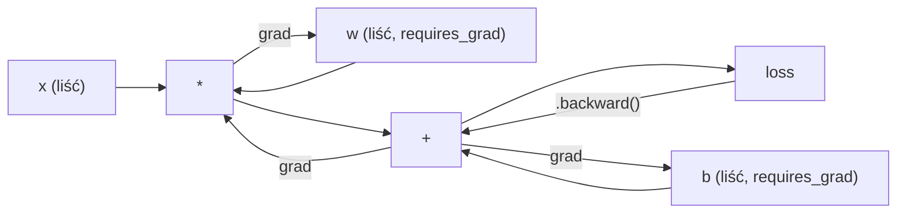
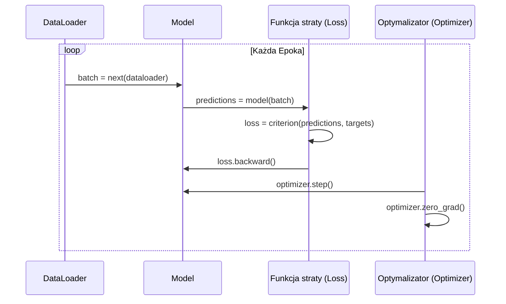

# Wprowadzenie do PyTorch

> Zbudowałeś silnik z tłoków i wałów korbowych. Teraz naucz się prowadzić to, czym naprawdę jeżdżą wszyscy.

**Typ:** Zrozumienie
**Języki:** Python
**Wymagania wstępne:** Lekcja 03.10 (Budowa własnego mini-frameworka)
**Czas:** ~75 minut

## Cele nauczania

- Budowanie i trenowanie sieci neuronowych za pomocą `nn.Module`, `nn.Sequential` oraz autogradu z PyTorch.
- Wykorzystywanie tensorów PyTorch, akceleracji GPU i standardowej pętli treningowej (zero_grad, forward, loss, backward, step).
- Konwersja komponentów mini-frameworka napisanego od zera na ich odpowiedniki w PyTorch.
- Profilowanie i porównywanie szybkości uczenia w czystym Pythonie względem PyTorch dla tego samego zadania.

## Problem

Masz działający mini-framework. Posiada warstwy liniowe, ReLU, dropout, batch norm, optymalizator Adam, DataLoader oraz pętlę treningową. Skutecznie trenuje 4-warstwową sieć do rozwiązania problemu klasyfikacji punktów w okręgach, używając czystego Pythona.

Jest on jednak również 500 razy wolniejszy niż PyTorch w przypadku tego samego problemu.

Twój mini-framework przetwarza jedną próbkę na raz za pomocą zagnieżdżonych pętli w Pythonie. PyTorch przekazuje te same operacje do zoptymalizowanych kerneli C++/CUDA, które działają na karcie graficznej (GPU). Na pojedynczym GPU NVIDIA A100 PyTorch trenuje ResNet-50 (25,6 mln parametrów) na zbiorze ImageNet (1,28 mln obrazów) w około 6 godzin. Wykonanie tego samego zadania przez Twój framework trwałoby około 3000 godzin — i to przy założeniu, że wcześniej nie zabrakłoby mu pamięci.

Szybkość nie jest jedyną różnicą. Twój framework nie obsługuje układów GPU. Brak mu automatycznego różniczkowania (automatycznie liczonego gradientu) — dla każdego modułu musiałeś ręcznie napisać funkcję `backward()`. Brak serializacji. Brak treningu rozproszonego (distributed training). Brak wsparcia dla mieszanej precyzji (mixed precision). Brak możliwości debugowania przepływu gradientów bez używania licznych instrukcji `print`.

PyTorch wypełnia każdą z tych luk. Robi to, zachowując dokładnie ten sam model mentalny, który zbudowałeś do tej pory: `module`, `forward()`, `parameters()`, `backward()`, `optimizer.step()`. Pojęcia przekładają się w stosunku jeden do jednego. Składnia jest niemal identyczna. Różnica polega na tym, że PyTorch łączy dekadę osiągnięć inżynierii systemów z tym samym interfejsem, który sam zaprojektowałeś.

## Koncepcja

### Dlaczego PyTorch wygrał

W 2015 roku TensorFlow wymagał zdefiniowania statycznego grafu obliczeniowego, zanim możliwe było uruchomienie czegokolwiek. Tworzyło się graf, kompilowało go, a następnie przesyłało przez niego dane. Debugowanie wiązało się ze wpatrywaniem w wizualizacje grafów. Zmiana architektury wymagała przebudowania grafu od podstaw.

W 2017 roku pojawił się PyTorch z zupełnie inną filozofią: wykonywaniem zachłannym (eager execution). Piszesz w Pythonie. Działa to natychmiast. `y = model(x)` od razu oblicza wartość `y`, a nie „dodaje węzeł do grafu, który obliczy `y` później”. Oznaczało to, że do debugowania mogłeś użyć standardowych narzędzi Pythona. Zadziałało `print()`. Zadziałało `pdb`. Użycie zwykłych instrukcji warunkowych (`if/else`) w metodzie `forward` po prostu działało.

Do 2020 roku rynek podjął decyzję. Udział PyTorch w pracach naukowych z zakresu uczenia maszynowego wzrósł z 7% (w 2017) do ponad 75% (w 2022). Meta, Google DeepMind, OpenAI, Anthropic i Hugging Face wykorzystują PyTorch jako swoją bazową platformę. W odpowiedzi na to, TensorFlow 2.x również wprowadziło eager execution — co było cichym przyznaniem racji, że architektura PyTorch okazała się słuszna.

Lekcja: liczy się doświadczenie programisty (Developer Experience). Framework, który jest o 10% wolniejszy, ale pozwala na 50% szybsze debugowanie, zawsze wygra.

### Tensory

Tensor to wielowymiarowa tablica o trzech kluczowych właściwościach: kształcie (shape), typie danych (dtype) i urządzeniu (device).

```python
import torch

x = torch.zeros(3, 4)           # kształt: (3, 4), dtype: float32, urządzenie: cpu
x = torch.randn(2, 3, 224, 224) # partia (batch) 2 obrazów RGB 224x224
x = torch.tensor([1, 2, 3])     # utworzenie z listy w Pythonie
```

**Kształt (shape)** określa wymiarowość. Skalar ma kształt `()`, wektor `(n,)`, macierz `(m, n)`, a partia obrazów `(batch, kanały, wysokość, szerokość)`.

**Typ danych (dtype)** kontroluje precyzję i zużycie pamięci.

| Dtype | Bity | Zakres | Zastosowanie |
|-------|------|-------|---------|
| float32 | 32 | ~7 cyfr znaczących dziesiętnych | Domyślne wartości przy trenowaniu |
| float16 | 16 | ~3,3 cyfr dziesiętnych | Trening z mieszaną precyzją |
| bfloat16 | 16 | Zakres podobny do float32, mniejsza precyzja | Trenowanie LLM |
| int8 | 8 | -128 do 127 | Skwantowane wnioskowanie (inference) |

**Urządzenie (device)** decyduje, gdzie odbywają się obliczenia.

```python
device = torch.device("cuda" if torch.cuda.is_available() else "cpu")
x = torch.randn(3, 4, device=device)
x = x.to("cuda") # Przeniesienie na GPU
x = x.cpu()      # Przeniesienie na CPU
```

Wszystkie operacje wymagają, aby poszczególne tensory znajdowały się na tym samym urządzeniu. Jest to najczęstszy błąd u początkujących użytkowników PyTorch: `RuntimeError: Expected all tensors to be on the same device`. By go naprawić, zawsze przenoś wszystkie zmienne na właściwe urządzenie przed wykonaniem obliczeń.

**Przekształcanie** działa płynnie — modyfikowane są metadane bez zmiany samych danych w pamięci.

```python
x = torch.randn(2, 3, 4)
x.view(2, 12)      # zmienia kształt na (2, 12) -- pamięć musi być ciągła (contiguous)
x.reshape(6, 4)    # zmienia kształt na (6, 4) -- działa zawsze
x.permute(2, 0, 1) # zamienia miejscami wymiary
x.unsqueeze(0)     # dodaje nowy wymiar: (1, 2, 3, 4)
x.squeeze()        # usuwa wymiary o rozmiarze 1
```

### Autograd

Twój mini-framework wymuszał implementację funkcji `backward()` dla każdego z modułów. W PyTorch nie jest to konieczne. Rejestruje on wszystkie operacje na tensorach w ukierunkowanym grafie acyklicznym (grafie obliczeniowym), a potem przechodzi przez ten graf w odwrotnej kolejności (od tyłu), automatycznie obliczając przy tym wszystkie gradienty.



Kluczowa różnica względem własnego frameworka: PyTorch używa systemu bazującego na taśmie obliczeniowej (tape-based autograd). Każda operacja jest "zapisywana na taśmę" podczas fazy forward. Wywołanie `.backward()` po prostu przewija tę "taśmę" wstecz.

```python
x = torch.randn(3, requires_grad=True)
y = x ** 2 + 3 * x
z = y.sum()
z.backward()
print(x.grad)  # dz/dx = 2x + 3
```

Trzy najważniejsze zasady działania autogradu:
1. Tylko tensory-liście z opcją `requires_grad=True` będą gromadzić gradienty.
2. Gradienty domyślnie się akumulują, dlatego należy wywoływać `optimizer.zero_grad()` przed każdą nową iteracją wsteczną.
3. Konstrukcja `torch.no_grad()` wyłącza śledzenie gradientów (używana głównie podczas ewaluacji i wnioskowania).

### nn.Module

`nn.Module` to podstawowa klasa dla wszystkich elementów sieci neuronowych w PyTorch. Tę abstrakcyjną strukturę poznałeś już w Lekcji 10. Wersja PyTorch dodatkowo zapewnia zautomatyzowaną rejestrację parametrów, rekurencyjne odkrywanie podmodułów, sprawne zarządzanie urządzeniami (CPU/GPU) i mechanizmy serializacji modeli.

```python
import torch.nn as nn

class MLP(nn.Module):
    def __init__(self, input_dim, hidden_dim, output_dim):
        super().__init__()
        self.layer1 = nn.Linear(input_dim, hidden_dim)
        self.relu = nn.ReLU()
        self.layer2 = nn.Linear(hidden_dim, output_dim)

    def forward(self, x):
        x = self.layer1(x)
        x = self.relu(x)
        x = self.layer2(x)
        return x
```

Kiedy przypiszesz moduł `nn.Module` albo wektor `nn.Parameter` jako atrybut w ciele konstruktora `__init__`, PyTorch automatycznie go zarejestruje. Wywołanie metody `model.parameters()` sprawnie i rekurencyjnie pozbiera wszystkie takie zarejestrowane parametry. Dzięki temu nigdy więcej nie będziesz musiał ich zliczać ręcznie.

Kluczowe moduły wbudowane:

| Moduł | Co robi | Parametry |
|------------|------------|------------|
| nn.Linear(in, out) | Wx + b | in*out + out |
| nn.Conv2d(in_ch, out_ch, k) | Splot dwuwymiarowy (2D) | in_ch*out_ch*k*k + out_ch |
| nn.BatchNorm1d(features) | Normalizacja cech wewnątrz batcha | 2 * features |
| nn.Dropout(p) | Losowe zerowanie wejść | 0 |
| nn.ReLU() | max(0, x) | 0 |
| nn.GELU() | Gaussian Error Linear Unit | 0 |
| nn.Embedding(vocab, dim) | Warstwa słownikowa / lookup table | vocab * dim |
| nn.LayerNorm(dim) | Normalizacja na poziomie próbki | 2 * dim |

### Funkcje straty i optymalizatory

PyTorch oferuje sprawdzone, produkcyjne wersje wszystkiego, co musiałeś wcześniej budować samodzielnie.

**Funkcje straty** (z modułu `torch.nn`):

| Funkcja | Zadanie | Kształt wejściowy |
|------|------|------|
| nn.MSELoss() | Regresja | Dowolny wymiar |
| nn.CrossEntropyLoss() | Klasyfikacja wieloklasowa | Logity (bez softmax) |
| nn.BCEWithLogitsLoss() | Klasyfikacja binarna | Logity (bez sigmoidy) |
| nn.L1Loss() | Regresja (odporna na wartości odstające) | Dowolny wymiar |
| nn.CTCLoss() | Wyrównywanie sekwencji (Connectionist Temporal Classification) | Log-prawdopodobieństwa |

**Ważne uwaga:** `CrossEntropyLoss` wewnętrznie wykonuje u siebie funkcje `LogSoftmax` połączone z `NLLLoss`. Powinieneś zawsze przekazywać do niej **surowe logity**, a nie wyjścia po przejściu przez Softmax. Przekazanie wartości po przeliczeniu Softmax to częsty błąd, po cichu dający niewłaściwe wartości gradientu.

**Optymalizatory** (z modułu `torch.optim`):

| Optymalizator | Zastosowanie | Typowy współczynnik uczenia (LR) |
|----------|------------|----------|
| SGD(params, lr, momentum) | Sieci konwolucyjne (CNN), starannie dopracowane systemy | 0.01 -- 0.1 |
| Adam(params, lr) | Bardzo dobry domyślny punkt wyjścia | 1e-3 |
| AdamW(params, lr, weight_decay)| Modele oparte o Transformatory, fine-tuning | 1e-4 -- 1e-3 |
| LBFGS(params) | Bardzo mała skala, algorytm 2-go rzędu | 1.0 |

### Pętla treningowa

Pętla treningowa każdej sieci bazuje w PyTorch w zasadzie na tym samym pięcioetapowym wzorcu, z którym miałeś już do czynienia w Lekcji 10.



Klasyczny wzorzec:

```python
for epoch in range(num_epochs):
    model.train() # Ustawia model w tryb treningowy
    for inputs, targets in train_loader:
        inputs, targets = inputs.to(device), targets.to(device)
        optimizer.zero_grad()
        outputs = model(inputs)
        loss = criterion(outputs, targets)
        loss.backward()
        optimizer.step()
```

Zaledwie pięć linijek kodu ukrytych w zagnieżdżonej pętli. Tych samych pięć linii użyto do wyuczenia i powstania sieci takich jak GPT-4, Stable Diffusion czy LLaMA. Architektura bywa różna. Same zbiory danych się zmieniają. Owe pięć linijek pozostaje niezmiennych.

### Dataset i DataLoader

Klasa `Dataset` to abstrakt oferujący tylko dwie podstawowe metody: `__len__` oraz `__getitem__`. Odpowiedzialnością klasy `DataLoader` staje się pobieranie owych próbek i tworzenie na ich podstawie paczek treningowych (batchów), ich tasowanie oraz ładowanie wieloprocesorowe w tle.

```python
from torch.utils.data import Dataset, DataLoader

class MNISTDataset(Dataset):
    def __init__(self, images, labels):
        self.images = images
        self.labels = labels

    def __len__(self):
        return len(self.labels)

    def __getitem__(self, idx):
        return self.images[idx], self.labels[idx]

loader = DataLoader(dataset, batch_size=64, shuffle=True, num_workers=4)
```

Wskazanie `num_workers=4` angażuje 4 różne procesy i rozpoczyna równoległe pobieranie obrazów w tym samym czasie, podczas gdy karta graficzna oblicza bieżącą ich partię. W kontekście przetwarzania dużych obrazów czy zadań audio na dysku potrafi to nawet dwukrotnie skrócić niezbędny czas szkolenia i przyspieszyć pętlę uczenia modelu.

### Trenowanie na GPU

Wrzucenie modelu na układ graficzny (GPU) wygląda tak:

```python
device = torch.device("cuda" if torch.cuda.is_available() else "cpu")
model = model.to(device)
```

Wywołuje to rekursywne przypisanie każdego buforku i własności do zasobów grafiki. Następnie podczas właściwego szkolenia musisz jeszcze przesuwać ku karcie kolejne przetwarzane partie:

```python
inputs, targets = inputs.to(device), targets.to(device)
```

Wykorzystanie mechanizmu **mieszanej precyzji** potrafi znacznie zmniejszyć o połowę pożeranie układów RAM karty oraz wyraźnie skrócić operacje dla nowoczesnych architektur NVIDIA (takich jak A100, H100, ale też zwykłego RTX 4090). Obliczania warstwy na wpół naprzemiennie realizuje on na 16-bitowych wektorach (`float16`), za to sam gradient odzwierciedla bezpiecznie wyższą i stałą jakość zapisaną w starym 32-bitowym standardzie:

```python
from torch.amp import autocast, GradScaler

scaler = GradScaler()
for inputs, targets in loader:
    with autocast(device_type="cuda"):
        outputs = model(inputs)
        loss = criterion(outputs, targets)
    
    # Skalujemy stratę przed backpropem i wykonujemy step z użyciem scarlera
    scaler.scale(loss).backward()
    scaler.step(optimizer)
    scaler.update()
    optimizer.zero_grad()
```

### Podsumowanie różnic: Własny Mini-Framework, PyTorch, JAX

| Cecha | Mini Framework (Lekcja 10) | PyTorch | JAX |
|--------|---------------------|---------|-----|
| Automatyczne różniczkowanie | Ręczne kodowanie `.backward()` | Autograd (działający w tle z grafem w oparciu o taśmy) | Transformacje funkcyjne (vmap/grad/jit) |
| Sposób wykonywania | Zwykły, eager execution (pętle Pythona) | Eager execution (C++ w tle dla grafu) | Model bazujący na śledzeniu oraz kompilacji just-in-time (JIT) |
| Obsługa sprzętu (GPU) | Nie | Tak (obsługuje CUDA, ROCm, na najnowszych MACach także MPS) | Tak (wsparcie TPU, czy architektur CUDA) |
| Szybkość działania sieci dla MNIST | Bardzo powolne (~300 s/epokę) | Szybkie (~0.5 s/epokę) | Błyskawiczne (~0.3 s/epokę po pierwszej) |
| Organizacja działania modułów | Indywidualna klasa dla sieci | Słynny interfejs bazowy klas `nn.Module` | Brak stanów w metodach (w ogólnej architekturze tj. Flax/Haiku zależy m.in. od słowników) |
| Debugowanie sieci / błędów | Zwykłe `print()` | Świetne wsparcie z wykorzystaniem `print()`, `pdb`, interakcji w IDE czy `.breakpoint()` | Często bardzo trudne w śledzeniu, kompilacja psuje zachowania w Pythonie czy `print` |
| Ekosystem bibliotek | Brak | Bardzo dojrzały i gigantyczny - HuggingFace, PyTorch Lightning czy środowisko klasyfikacji obrazów Timm | Stale i mocno ewoluujący (Flax, Optax czy wsparcie dystrybucji z Orbax) |
| Próg wejścia (krzywa uczenia) | Idealny w celu poznania koncepcji | Łatwy / umiarkowany na starcie | Wymagający (głównie ze względu na czysto funkcyjny paradygmat języka/podejścia) |
| Dominujące zaplecze rynkowe | Edukacja i proste eksperymenty (toy examples) | Zastępowanie na rynku (HuggingFace/LLaMA/badania od firm np. Anthropic/Meta) | Częste na poletku badań Google (Midjourney na start i gigantyczne LLMs przy klastrach Google) |

## Stwórz to w praktyce

Spróbuj zbudować i zastosować prostą strukturę architektury MLP składającej się dokładnie z 3-warstw wykorzystując przy tym jedynie skromne, najbardziej bazowe funkcje paczki. Do wytrenowania użyj zbioru danych MNIST, ale uwaga — pobierania musisz dokonać poprzez wbudowane funkcje bez stosowania prostego `torchvision.datasets`. 

### Krok 1: Wczytanie i przetwarzanie oryginalnego zbioru

MNIST udostępnia bazowy korpus poprzez cztery skompresowane odpowiednio przy użyciu GZIP pliki. Pozostaje tylko zaaranżować stosowne funkcje dekodujące poszczególne bajty by przygotować materiał.

```python
import torch
import torch.nn as nn
import struct
import gzip
import urllib.request
import os

def download_mnist(path="./mnist_data"):
    base_url = "https://storage.googleapis.com/cvdf-datasets/mnist/"
    files = [
        "train-images-idx3-ubyte.gz",
        "train-labels-idx1-ubyte.gz",
        "t10k-images-idx3-ubyte.gz",
        "t10k-labels-idx1-ubyte.gz",
    ]
    os.makedirs(path, exist_ok=True)
    for f in files:
        filepath = os.path.join(path, f)
        if not os.path.exists(filepath):
            urllib.request.urlretrieve(base_url + f, filepath)

def load_images(filepath):
    with gzip.open(filepath, "rb") as f:
        magic, num, rows, cols = struct.unpack(">IIII", f.read(16))
        data = f.read()
        images = torch.frombuffer(bytearray(data), dtype=torch.uint8)
        images = images.reshape(num, rows * cols).float() / 255.0
    return images

def load_labels(filepath):
    with gzip.open(filepath, "rb") as f:
        magic, num = struct.unpack(">II", f.read(8))
        data = f.read()
        labels = torch.frombuffer(bytearray(data), dtype=torch.uint8).long()
    return labels
```

### Krok 2: Konstruowanie modelu i sieci (MLP)

Konstrukcja 3-warstwowa zakłada warstwę wejściową zmniejszającą o 784 neurony wymiar dla 256. Następnie do 128 wraz w z wyjściową klasy liczącą jedynie 10 (odpowiadających różnym cyfrom od zera do dziewięciu). W charakterze formy nieliniowej wykorzystamy uniwersalne ReLU (dodatkowo jako pewien mechanizm prewencyjnego zabezpieczenia się przed "overfitingiem" wstawiamy drobną dawkę losowego wyłączania wezłów — Dropout). Brak form normy w celu ułatwienia prezentacji.

```python
class MNISTModel(nn.Module):
    def __init__(self):
        super().__init__()
        self.net = nn.Sequential(
            nn.Linear(784, 256),
            nn.ReLU(),
            nn.Dropout(0.2),
            nn.Linear(256, 128),
            nn.ReLU(),
            nn.Dropout(0.2),
            nn.Linear(128, 10),
        )

    def forward(self, x):
        return self.net(x)
```

Zwróć uwagę - warstwa wyjściowa nie wykonuje operacji softmax na tensorze a generuje na wyjściu surowe wartości logitowe i zaledwie 10-wymiarowy wskaźnik do nich (na poszczególną klasę z klasyfikacji w zadaniu). Jest to celowe. Wywołany w pętli optymalizator `CrossEntropyLoss` przeprowadza takie przeliczenie stabilniej, wewnętrznie uwzględniając mechanikę zabezpieczającą dla prawdopodobieństwa podczas samego przeliczania logarytmu. 

Liczba wykorzystywanych parametrów po takim ułożeniu wynosi dokładnie: 784*256 + 256 + 256*128 + 128 + 128*10 + 10 = co daję pulę blisko 235 146 trenowalnych wartości zmiennoprzecinkowych do poprawienia w iteracjach epok uczenia na GPU, i będzie stanowiła jedynie promil i margines potrzeb obliczeniowych dla standardowych wdrożeń wielkoskalowych systemów (mały model open-source LLM taki jak chociażby GPT-2 korzystał blisko ok. 124 milionów) a na układach GPU proces i optymalizacja powinna odbywać tu w mgnieniu chwili.

### Krok 3: Określenie mechanizmu uczenia modelu (właściwa iteracyjna pętla sieciowa) 

Dla PyTorcha i wielu jemu podobnych form uczenia najistotniejsze pozostaje zachowanie rytmu - wykonanie operacji "kroku z próbkami danych", obarczonego wynikiem funkcji celu do modyfikacji oraz przeskalowanie do wstecz - tzw. backprop ("odpytywanie ze śledzenia w pamięci operacji").

```python
def train_one_epoch(model, loader, criterion, optimizer, device):
    model.train() # Ważne żeby włączyć proces obliczeń i warstwy dropoutu do funkcjonowania dla backpropa w czasie aktualnej pętli iteracji sieci dla modeli (lub tzw batch norm).
    total_loss = 0
    correct = 0
    total = 0
    for images, labels in loader:
        images, labels = images.to(device), labels.to(device)
        
        optimizer.zero_grad() # Zerowanie zaległości starych gradientów - bardzo często pomijany etap sprawiający mnóstwo początkowych niedogodności ze starymi "śmieciami gradientowymi z ubiegłych epok trenowanych u optymalizatorów".
        
        outputs = model(images)
        loss = criterion(outputs, labels) # Kryterium z uwzględnieniem CrossEntropy i poprawności (wynikające z przekazania wartości labels jak parametr i wskazania go w funkcji celu z tensorami operowanymi - "to wyjście" względem "to spodziewana etykieta w sieciach" )
        
        loss.backward()
        optimizer.step()
        
        total_loss += loss.item() * images.size(0)
        _, predicted = outputs.max(1)
        correct += predicted.eq(labels).sum().item()
        total += labels.size(0)
        
    return total_loss / total, correct / total

def evaluate(model, loader, criterion, device):
    model.eval() # Ważne wyłączenie aktywacji sieci względem procesów wstecz (np dropout dla testów przewidywalności predykcji zostaje zablokowany jako dezaktywujący uczenie się w fazie i zablokowujący się mechanizmy w ewaluowaniu modelów - i oceny i generacji na "gotowym modelu lub wnioskującym silniku testowym predykcji" po skończeniu etapu - ewaluacja i ewaluacja do oceny strat na testach testów z wykorzystaniem w celach poznawczych statystyk ewaluacji i predykcji/statystyk testów)
    total_loss = 0
    correct = 0
    total = 0
    with torch.no_grad(): # Zapobiega niepożądanemu naliczaniu autogradów grafu. Optymalizuje ślad działania pamięci oraz samego wnioskowania
        for images, labels in loader:
            images, labels = images.to(device), labels.to(device)
            outputs = model(images)
            loss = criterion(outputs, labels)
            
            total_loss += loss.item() * images.size(0)
            _, predicted = outputs.max(1)
            correct += predicted.eq(labels).sum().item()
            total += labels.size(0)
            
    return total_loss / total, correct / total
```

### Krok 4: Wypełnij całość układankę i zbierz ze sobą w jeden korpus pliku jako uruchomienie modelu

```python
def main():
    device = torch.device("cuda" if torch.cuda.is_available() else "cpu")

    download_mnist()
    train_images = load_images("./mnist_data/train-images-idx3-ubyte.gz")
    train_labels = load_labels("./mnist_data/train-labels-idx1-ubyte.gz")
    test_images = load_images("./mnist_data/t10k-images-idx3-ubyte.gz")
    test_labels = load_labels("./mnist_data/t10k-labels-idx1-ubyte.gz")

    train_dataset = torch.utils.data.TensorDataset(train_images, train_labels)
    test_dataset = torch.utils.data.TensorDataset(test_images, test_labels)
    
    # Tworzenie "Rurociągu" ładującego paczki z użyciem zdefiniowanego Datasetów. Usprawnia pobór i losuje w paczkach poszczególne wielkości pobrania próbek
    train_loader = torch.utils.data.DataLoader(
        train_dataset, batch_size=64, shuffle=True
    )
    test_loader = torch.utils.data.DataLoader(
        test_dataset, batch_size=256, shuffle=False
    )

    model = MNISTModel().to(device)
    criterion = nn.CrossEntropyLoss()
    optimizer = torch.optim.Adam(model.parameters(), lr=1e-3)

    num_params = sum(p.numel() for p in model.parameters())
    print(f"Urządzenie (Device): {device}")
    print(f"Liczba parametrów: {num_params:,}")
    print(f"Próbki do treningu: {len(train_dataset):,}")
    print(f"Próbki testowe: {len(test_dataset):,}")
    print()

    for epoch in range(10):
        train_loss, train_acc = train_one_epoch(
            model, train_loader, criterion, optimizer, device
        )
        test_loss, test_acc = evaluate(
            model, test_loader, criterion, device
        )
        print(
            f"Epoka {epoch+1:2d} | "
            f"Strata trenin: {train_loss:.4f} | Dokł. trenin: {train_acc:.4f} | "
            f"Strata testowa: {test_loss:.4f} | Dokł. testowa: {test_acc:.4f}"
        )

    # Zapisz słownik parametrów (weights)
    torch.save(model.state_dict(), "mnist_mlp.pt")
    print(f"\nZapisano model do mnist_mlp.pt")
    print(f"Ostateczna precyzja ewaluacji: {test_acc:.4f}")

if __name__ == "__main__":
    main()
```

Oczekiwany wskaźnik poprawności i osiągniętych rezultatów ze sprawdzonego dla sieci testu oscylować ma po około 10 etapach wykonania kodu na zadowalająco precyzyjne 97,8% dla całości zbioru ewaluacyjnego na wyjściu sieci. Trening na szybkim CPU zajmie dla tego wariantu 30 sekund działania skryptu, natomiast sprzętowy narzut karty będzie mijał się tu z czasem około zaledwie niecałych paru zaledwie sekund wykonanych dla wszystkich procesów liczenia po pełnej przepustowości dla procesora w graficznej, gdy zaledwie w 45 pełnych min. zmagań do tych samych cyfr musiałeś wykazać przed tym wszystkim własnego odpowiednika architektury stworzonego manualnie.

## Użyj tego

### Szybkie podsumowanie: Twój pierwszy Mini-Framework kontra nowy potężny PyTorch

| Mini Framework (Zbudowany wcześniej w ramach zajęć) | Nowy PyTorch |
|--------------------------|---------|
| `model = Sequential(Linear(784, 256), ReLU(), ...)` | `model = nn.Sequential(nn.Linear(784, 256), nn.ReLU(), ...)` |
| `pred = model.forward(x)` | `pred = model(x)` |
| `optimizer.zero_grad()` | `optimizer.zero_grad()` |
| `grad = criterion.backward()` następnie `model.backward(grad)` | `loss.backward()` |
| `optimizer.step()` | `optimizer.step()` |
| Absolutnie żadnego zaplecza czy integracji GPU | Wykonuje się na urządzeniu poprzez zaledwie pojedyncze przypisanie parametrów na akcelerator z użyciem `.to("cuda")` czy też `to(device)` dla poszczególnych komponentów |
| Ręczne dopisywanie wzorów pochodnych propagacji z warstwą "na twardo" pod maską | Rozwiązuje na żywo (autograd wspiera samodzielnie grafy, uciążliwość kodów propagacji nie stwarza trudności matematykom) |

### Proces wgrywania (zapis i ładowanie modeli)

Najważniejszą wytyczną przy zarządzaniu zapisanymi stanami uczenia powinno zawsze być utrzymanie zapisu za pośrednictwem parametru ze statusem stanu `state_dict()` po obiektowej wygenerowanej metodzie jako forma słownika, którego zasoby to "gotowy przepis wyciągów stanu modelu i wartości liczbowych oraz atrybutów wag": 

```python
# Tak - bezpiecznie zapisuje strukturę jako stany sieci
torch.save(model.state_dict(), "model.pt")

# Kiedy indziej potem bezpiecznie ładuje stan modelu pod architekturę bez niespodzianek ze środowiskiem (tzw. "pickle problem")
model = MNISTModel()
model.load_state_dict(torch.load("model.pt", weights_only=True))
model.eval() # Ważne po pobraniu! Należy niezwłocznie przypiąć w rygor testowania, bo wczytanie przywróciło by go z bazowych stanów.
```

Kluczem unikania i ochrony własnej bazy kodów, przy zmianach w repozytoriach i plikach Pythona od samych twórców i niepożądanymi skutkami na pickle pozostaje używanie form "nie z serializowanej architektury", po to by przy migracji pliki nie kruszyły się bez problemu na nowych wydaniach paczek po pewnych poprawkach kodu dla samej biblioteki we frameworku! Zawsze stosuj stan atrybutu (słownik modeli ze zdefiniowanymi typami)! 

### Dynamiczny cykl ustalania zmian (Schedule) dla parametrów (LR - wsp. uczenia)

Bardzo przydatne narzędzie planowania, czy harmonogramowania zmiany parametrów uczenia dla poszczególnych modyfikacji LR w sieci z uwzględnieniem np "odpadania krzywej współczynnika z cosinusowym spłaszczaniem", czyli np. tzw modulowaniem LR. Ulepsza proces podchodzenia powoli w dół gradientami dla osiągnięcia bezpiecznych głębin optymalizacji w czasie. 

```python
scheduler = torch.optim.lr_scheduler.CosineAnnealingLR(
    optimizer, T_max=10
)
for epoch in range(10):
    train_one_epoch(model, train_loader, criterion, optimizer, device)
    scheduler.step() # Przystosuj zmiany harmonogramu dla nowej epoki
```

Biblioteki w PyTorch i `torch.optim` oferują standardowo w asortymencie całe spektrum i 15 opcji wspieranych takich interfejsów (najczęściej wybieranymi pozostają te do wygładzeń lub z redukcją: StepLR, ExponentialLR, ReduceLROnPlateau czy OneCycleLR). Wszystkie zawsze płynnie podpinane pozostają ze startowymi wariacjami interfejsów po bazowych konfiguracjach inicjalnych przypisanych i przydzielonych klasą Optimizer. 


## Do oddania

Lekcja ta generuje pliki (tworzące artefakty edukacyjne do załączenia w toku):

- `outputs/prompt-pytorch-debugger.md` – Szablon pomagający wykrywać błędne operacje w debugerze PyTorch.
- `outputs/skill-pytorch-patterns.md` — Biblioteka dobrych, uznanych we wdrożeniach wzorców architektonicznych i standardów programowania modeli w PyTorchu.


## Ćwiczenia dodatkowe do rozwiązania we własnym zakresie

1. **Wdrożenie form normalizacji wsadowych na danych i wynikach - BatchNorm**. Rozbuduj kod i dodaj parametry od `nn.BatchNorm1d` tuż po inicjowanych przydzieleniach i blokach obliczeń sieci od każdego `nn.Linear()` i ich operacjach i przejściach warstwy z sygnałem (a stricte i przed blokiem aktywacyjnym z samego w sobie). Przetestuj przy nowych danych zachowanie uczenia się i zauważalne lepsze przyśpieszenia uczenia względem modelu na samym klasycznym i losowym trybie drop-out'ów i jego regularyzacji. Prawidłowo skorygowana partia będzie sprawniej i szybciej domykać próg aż ponad blisko 98%+ punktów klasyfikacji z wyników predykcji po nieco krótszym już i odczuwalnie mniejszym narzucie przebiegów dla każdej poszczególnej ilości na wybraną epokę nauki.
2. **Harmonogram z mechaniką szybkiego sprawdzania i szukania tempa wyliczania współczynnika na LR (LR Finder)**. Dopisz metodę która wyśledzi, zwizualizuje oraz wytyczy optymalne dla Twoich hiper-parametrów optymalne drogi i proces w epoce przez stopniowe wrzucanie wartości, logarytmicznie eskalując wartość od bliskiego i płaskiego parametru (zaledwie po 1e-7 do wielkich wręcz do 1.0 skali). Podziel z logarytmem. Punkt załamania po utracie kontroli straty przed pikiem, staje się najlepszym kompromisem dla wartości dopuszczenia współczynnika uczenia dla Twojego zmontowanego pod te eksperymenty MLP MNIST!
3. **Mieszana i elastyczna precyzja pamięci dla treningu (w GPU z Mixed Precision)**. Przyspiesz trenowanie dodając i uruchamiając moduły pod obsługę `torch.amp.autocast` oraz funkcjonalności operowania "wagami po połówce - skalarami z klasą" dla `GradScaler`. Przyspieszenie powinno podwoić przerób po włączeniu testów w porównaniu dla tej samej paczki bez użycia metody. Zważ na ilość zyskanego zwrotu.
4. **Załadowanie całkowicie dedykowanej paczki**. Rozpocznij treningi pod innym datasetem na test dla klasy ze zbiorów "Fashion-MNIST" (ta sama ilość oraz rozdzielczość formatowania plików dla danych, ale inne dane dla wejścia wizualnego na klasy klasyfikacji, czyli różne zdjęcia elementów ze znanej garderoby!). Należy skonfigurować nową własną klasę od `Dataset` implementując jej wywołania z użyciem dunder metody pod klasy interfejsów w `__getitem__` oraz `__len__`. Trening powinien być odczuwalnie trudniejszy względem czcionek i wyników. Różnica i strata jakości spadnie poniżej (ok ~88% trafień względem prostszego, ok 98% wyniku testu odczytu ręcznych liter przed momentem)! 
5. **Implementacja starszych tradycji u optymalizatorów uczenia - z powrotem przejść należy na SGD z dodanym mechanizmem Momentum dla wag**. Przystosuj swój moduł i pętlę uczenia po wymianie optymalizatora o nazwie Adam, klasycznym mechanizmem w wariancie wykorzystania stochastycznego gradientu po zmianach konfiguracyjnych w trybach działania modyfikujących na: `SGD(params, lr=0.01, momentum=0.9)`. Skonfrontuj zbieżność oraz zestaw tempo opadania obok krzywych po Adamie! Dopełnij operację dopisaniem dedykowanego CosineAnnealingLR w wariancie harmonogramowania ubytku tempa parametru nauki po współczynniku.

## Ważne nowo poznane słownictwo w cyklu

| Hasło do słownika pojęć PyTorcha | Popularne określenia zastępcze lub żargon (co mówi na to świat lub badacz na co dzień) | Interpretacja oraz co termin i określenie fachowe ściśle objaśnia i precyzuje przy definicji |
|------|----------------|----------------------|
| Tensor (Tensory) | „Tablice wymiarowe” | Operująca jako zadeklarowany element programowy w ustrukturyzowanej wielowymiarowości (z tablicy), stanowiąca w swojej wewnętrznej budowie pełne narzędzia interakcji jako typ dla obsługiwania zdefiniowanych urządzeń po sprzęcie (np z użyciem dla CPU/GPU) po ich obliczenia z opcjonalnie zaimplementowaną formą w locie po zaimplementowanym auto zróżnicowaniu dla wyliczenia skalarów w grafach wbudowanym pod operację. |
| Autograd i system w tle | "Baza automatyczna na różniczkowania z podpięciem na back-propagate" | Oparty najczęściej poprzez "pamięć w systemie i model z rejestratorami na taśmach" z wygenerowaniem wstępnym pod obliczony ciąg przebiegających i zdefiniowanych u modelu struktur sieci operacji (za moment podawanych i wrzuconych w sieć jako krok dla warstw forward-pass) oraz używany jako pamięć operacyjna wektorowa na potrzebę odpytania "do tyłu od ogona wyników" z użyciem w wyliczaniu dokładnej odwróconej relacji dla każdego gradienta. |
| Klasa po strukturach `nn.Module` | "Warstwa bazowa", "Narzędzie abstrakcyjne pod sieć" | Narzędzie podstawowych i bazowych abstrakcji w projektowaniu bloków obliczeniowych budowy warstwy obliczeń operujących na modelu dla systemu do zarejestrowywania, aktualizowania po gradientach różniczkowalnych form parametrów operowanych na wektorowych wariantach. |
| Typ w słowniku `state_dict` | "Gotowy model do zapisów dla wag po operacjach i treningu" | Bezpiecznie po uporządkowaniu przez mapowany porządek z typem w formie w OrderedDict dla przeniesienia i utrwalenia wyników pracy w z serializowanych procesach gotowych reprezentantów map z wynikowych tablic tensorowych od warstwy na wagi z wynikowych po nazwach. |
| Instrukcja w pętli wywoływana jako funkcja dla wstecznej poprawki: `.backward()` | "Pora wyliczyć nachylenia od gradientów" | Instrukcja wymuszenia dla systemu aby przetworzyć drzewo i odpytać na z góry ustalonym wektorze od tyłu wykres wyuczonej sieci (tzw compute graf) ze żądaniem sumujących i aktualizowanych na nowo modyfikacji gradientów na wariantów tensorów jako argument od wejściowych zmiennych z parametrem na tryb "require_grad=True". |
| Wrzucenie parametru instrukcji po modyfikatorach do wykonania w sprzęcie z akceleratorami po `.to(device)` | "Zrzut na obróbkę do silnika procesorów na platformy od producenta (GPU)" | Oddelegowanie w proces wewnątrz modułu przypisania i rekurencyjnie wykonanej modyfikacji aby bufory wywołały przypisywania parametrów i zmiennych, po wykonania na docelowym i specyficznie obranym do celu sprzęcie i interfejsach operacyjnych z procesorów jak CUDA pod NVIDIA, dla ogólnych CPU z operacyjnymi czy też interfejsy Apple do architektury arm poprzez MPS. |
| DataLoader czyli klasa po zbiorze | "Twój taśmociąg danych w architekturze", czasem również "Data-Pipeline z procesu" | Systematyzujący paczki po wejściu z korpusami lub iterujący pod zestaw klas generator ładujący dane w system z uwzględnianiem operacji porządkowych od zrównoleglenia i tasowań od procesów na próbki z Dataset. |
| Przelicznik o mieszanej wariacji typów liczb u "Mieszanej precyzji" (Mixed Precision) | "Trening na wejściach i odpytywaniach po mniejszej klasie pod połówki floatów jako np w 16" (tzw "Zejście pod 16 tkę") | System użycia na szybsze trenowanie za wykorzystaniem lżejszych standardów jako zmiennoprzecinkowe typy mniejszych precyzji (`float16`) do rzutowań przy procesach i do propagacjach sygnałów w przód lub w ubytkach od zaplecza z wstecz - pozwalając utrzymać tempo za mniejszy udział zużytej w pamięci, jednak pod warunkiem bezkompromisowej dbałości operacyjnej na przeliczonym wyniku bazowego w formie tzw wagi master utrzymanej z zapisanym wysoce precyzyjnym zapisie na standardowych formach dla stabilnego i pewnego poziomu liczbowego (`float32`). |
| System trybu w podejściu pod zdefiniowane jako tryb dla "zachłannej obróbki na wykonywaniu" tj "Eager execution" | "Zrób to i odpalaj mi to bezpośrednio!" (lub niekompilowany stan wywołania w czasie komend pod natychmiastowe przetworzenie bez weryfikacji drzew na potem) | Realizacja skryptowa wykonywalna bez rezerwacji ujęć pod plany i odwlekania czy generowania na z góry całego narzutu procedury pod cały kod z ustrukturyzowania w formach na skompilowanych fazach operacji w graf - podejścia o fundamentalnych różnicowych pod pojęciami u twórców za odróżnieniem go do mechanizmów zaplecza dawnych koncepcji we TF z 1.x i różnego rodzaju kompilatów w podejściach u starszych tworzących oprogramowania i algorytmy obliczeniowe za tamtych minionych po dzisiejszych trendów generacji projektów. |
| Oczyszczanie przed ponowieniem i optymalizacje wraz od `.zero_grad()` na gradientach z buforów w obrocie operacyjnym iteracji epoki po sieciach i wag. | "Wyzeruj narosłe gradienty po starych przebiegach na procesach sieciowych". | Zabezpieczanie procesu pętlowego poprzez prewencyjne ustawienie w blokach przed inicjacją zwrotów dla zaktualizowania propagacji gradientów przed ich akumulacją narosłą, która to jest zawsze domyślnym stanem i funkcjonalnym założonym jako operacyjnie użyty i standardowy w trybach operacyjnych PyTorcha! |

## Lektury do poczytania dalej w temacie po ukończeniu materiałów w bazie.

- Opracowanie klasyka jako zarys do budowy całości: Paszke i in., „PyTorch: An Imperative Style, High-Performance Deep Learning Library” (2019 r.) – To oryginalny wyczerpujący i znany dokument badawczy autorów i zespołu pod okiem współtwórców wyjaśniający dylematy po kompromisach dla podjętych decyzjach w sprawach projektu dla platformy.
- Przepisy o wdrażaniu tutoriale z podstaw od twórców frameworków ze stajni pod: „Nauka PyTorch z przykładami” (https://pytorch.org/tutorials/beginner/pytorch_with_examples.html) — czyli ugruntowana standardowa już oficjalnie wytyczana z baz i materiałami prosta, ale skuteczna dydaktycznie merytorycznie droga oraz cykl od gołych form obliczeniowych na wektorach tensorów aż na implementacje architektoniczne klas od wejściowych interfejsów jako strukturyzacja po klasie od wejścia w użycie obiektowych komponentów budowy klasy bazowej w `nn.Module`.
- Książki optymalizacyjne wydajności do zaimplementowanych i poprawnych nawyków, instruktaże (https://pytorch.org/tutorials/recipes/recipes/tuning_guide.html) - na co po zapleczach zwrócić wagę w precyzjach po zastosowaniach u standardów jako przeliczanie mieszanej jakości na procesory robocze pod moduły z DataLoadery poprzez procesowane czy też wyzwania od sprzętu, ujęcia o "przypinanej po modułach procesora do GPU rzutu do użycia dla po pinowaniu pamięciowych instrukcjach i modułów dla sprzętu", wraz dodatkowo z informacjami i zestawami od zaawansowanych zagadnień z optymalizacji przy wyjściu komercyjnie - pod produkcje docelowych gotowych wdrożeń dla aplikacji z sieciami w praktyce zawodowej.
- Blogi optymalizacyjne z cyklami: wpis edukacyjno/wyjaśniający po architekturze zjawisk operacyjnych sprzętu autorstwa od pasjonata sprzętowego inżyniera z zespołu Mety od optymalizatora jako publikacja i blog o haśle wpisu: Horace He, „Making Deep Learning Go Brrrr” (https://horace.io/brrr_intro.html) — materiał omawiający pod kątem detali dlaczego procesy w szkoleniowych fazach na najszybszych klastrach GPU do platform obliczeniowych i kart graficznych pędzą niezmordowanie przy stosowanych strategiach zrównoleglających tak świetnie po dedykowanych metodach dostrojonych wraz po specyfice rozwiązań wbudowanych dla PyTorcha ze stosami pod kompilacje oraz kerneli niskopoziomowymi!
