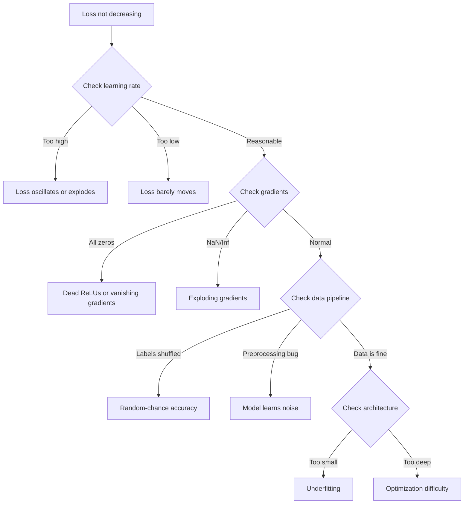
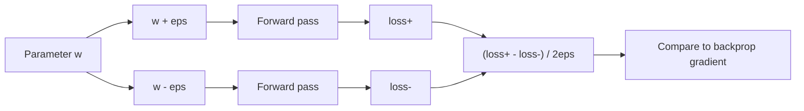
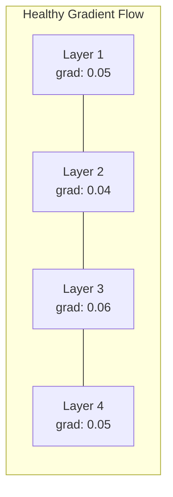
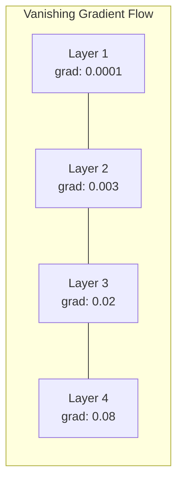
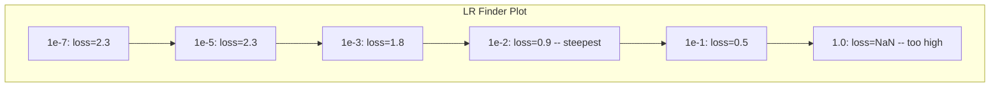

# Debugowanie sieci neuronowych

> Twoja sieć się skompilowała. Działa. Wyprodukowała liczbę. Liczba jest błędna i nic się nie wysypało. Witaj w najtrudniejszym rodzaju debugowania -- takim, w którym nie ma komunikatu o błędzie.

**Typ:** Praktyka
**Języki:** Python, PyTorch
**Wymagania wstępne:** Faza 03, lekcje 01-10 (zwłaszcza propagacja wsteczna, funkcje straty, optymalizatory)
**Czas:** ~90 minut

## Cele nauki

- Diagnozowanie typowych awarii sieci neuronowych (NaN w stracie, płaska krzywa straty, przeuczenie, oscylacje) za pomocą systematycznych strategii debugowania
- Zastosowanie techniki "overfit one batch" (przeuczenie na jednej partii) do weryfikacji, że architektura modelu i pętla treningowa są poprawne
- Inspekcja wielkości gradientów, rozkładów aktywacji i norm wag w celu identyfikacji problemów z zanikającymi/eksplodującymi gradientami
- Zbudowanie listy kontrolnej debugowania obejmującej potok danych, architekturę modelu, funkcję straty, optymalizator i problemy ze współczynnikiem uczenia

## Problem

Tradycyjne oprogramowanie ulega awarii, gdy jest uszkodzone. Wskaźnik null zgłasza wyjątek. Niezgodność typów kończy się błędem już na etapie kompilacji. Błąd "off-by-one" produkuje wynik, który jest wyraźnie błędny.

Sieci neuronowe nie dają nam tego luksusu.

Uszkodzona sieć neuronowa wykonuje się do końca, wypisuje wartość straty i generuje predykcje. Strata może się zmniejszać. Predykcje mogą wyglądać sensownie. Ale model jest po cichu błędny -- uczy się "skrótów", zapamiętuje szum albo zbiega do bezużytecznego minimum lokalnego. Badacze z Google oszacowali, że 60-70% czasu poświęconego na debugowanie ML idzie na "ciche" błędy, które nie generują żadnych komunikatów o błędach, ale degradują jakość modelu.

Różnica między działającym modelem a uszkodzonym to często jedna źle umieszczona linia: brakujące `zero_grad()`, transponowany wymiar, współczynnik uczenia 10x za duży lub za mały. Kanoniczny "Recipe for Training Neural Networks" (2019) zaczyna się od stwierdzenia: "Najczęstsze błędy w sieciach neuronowych to błędy, które nie powodują awarii."

Ta lekcja uczy, jak znajdować takie błędy.

## Koncepcja

### Sposób myślenia w debugowaniu

Zapomnij o debugowaniu metodą "print i módl się". Debugowanie sieci neuronowych wymaga systematycznego podejścia, ponieważ pętla zwrotna jest wolna (minuty do godzin na jeden przebieg treningowy), a symptomy są niejednoznaczne (zła strata może oznaczać 20 różnych rzeczy).

Złota zasada: **zacznij od prostego rozwiązania, dodawaj złożoność po jednym elemencie naraz i weryfikuj każdy element niezależnie.**



### Symptom 1: Strata nie spada

To najczęstsza skarga. Pętla treningowa działa, epoki mijają, a strata pozostaje płaska albo gwałtownie oscyluje.

**Niewłaściwy współczynnik uczenia.** Za wysoki: strata oscyluje albo skacze do NaN. Za niski: strata spada tak wolno, że wydaje się płaska. Dla Adama zacznij od 1e-3. Dla SGD zacznij od 1e-1 lub 1e-2. Zawsze wypróbuj 3 współczynniki uczenia różniące się 10-krotnie (np. 1e-2, 1e-3, 1e-4), zanim wnioskujesz, że problem jest gdzie indziej.

**Martwe ReLU.** Jeśli neuron ReLU otrzymuje dużą ujemną wartość wejściową, zwraca 0, a jego gradient wynosi 0. Już nigdy się nie aktywuje. Jeśli wystarczająco dużo neuronów "umiera", sieć nie może się uczyć. Sprawdź: wypisz frakcję aktywacji, które są dokładnie 0 po każdej warstwie ReLU. Jeśli >50% jest martwych, przejdź na LeakyReLU albo zmniejsz współczynnik uczenia.

**Zanikające gradienty.** W głębokich sieciach z aktywacjami sigmoid lub tanh gradienty zmniejszają się wykładniczo podczas propagacji wstecznej. Gdy docierają do pierwszej warstwy, są ~0. Pierwsze warstwy przestają się uczyć. Rozwiązanie: użyj ReLU/GELU, dodaj połączenia rezydualne (residual) albo użyj normalizacji wsadowej (batch normalization).

**Eksplodujące gradienty.** Odwrotny problem -- gradienty rosną wykładniczo. Częste w RNN-ach i bardzo głębokich sieciach. Strata skacze do NaN. Rozwiązanie: przycinanie gradientów (`torch.nn.utils.clip_grad_norm_`), niższy współczynnik uczenia albo dodanie normalizacji.

### Symptom 2: Strata spada, ale model jest zły

Strata spada. Dokładność na zbiorze treningowym osiąga 99%. Ale dokładność na zbiorze testowym to 55%. Albo model produkuje absurdalne wyniki na rzeczywistych danych.

**Przeuczenie (overfitting).** Model zapamiętuje dane treningowe, zamiast uczyć się wzorców. Różnica między stratą treningową i walidacyjną rośnie z czasem. Rozwiązanie: więcej danych, dropout, weight decay, wczesne zatrzymanie (early stopping), augmentacja danych.

**Wyciek danych (data leakage).** Dane testowe przeciekły do treningu. Dokładność jest podejrzanie wysoka. Częste przyczyny: przemieszanie (shuffling) przed podziałem, przetwarzanie wstępne ze statystykami z całego zbioru danych, duplikaty próbek między podziałami. Rozwiązanie: podziel najpierw, przetwórz potem, sprawdź duplikaty.

**Błędy etykiet.** 5-10% etykiet w większości rzeczywistych zbiorów danych jest błędnych (Northcutt i in., 2021 -- "Pervasive Label Errors in Test Sets"). Model uczy się szumu. Rozwiązanie: użyj confident learning, aby znaleźć i poprawić błędnie oznaczone przykłady, albo użyj loss truncation, aby ignorować próbki o wysokiej stracie.

### Symptom 3: NaN lub Inf w stracie

Wartość straty staje się `nan` lub `inf`. Trening jest martwy.

**Współczynnik uczenia za wysoki.** Aktualizacje gradientu tak bardzo "przestrzeliwują" cel, że wagi eksplodują. Rozwiązanie: zmniejsz 10-krotnie.

**log(0) lub log(liczby ujemnej).** Funkcja straty cross-entropy oblicza `log(p)`. Jeśli model zwraca prawdopodobieństwo dokładnie 0 lub ujemne, logarytm eksploduje. Rozwiązanie: ogranicz predykcje do `[eps, 1-eps]`, gdzie `eps=1e-7`.

**Dzielenie przez zero.** Normalizacja wsadowa dzieli przez odchylenie standardowe. Wsad o stałych wartościach ma std=0. Rozwiązanie: dodaj epsilon do mianownika (PyTorch robi to domyślnie, ale własne implementacje mogą tego nie robić).

**Przepełnienie numeryczne.** Duże aktywacje przekazane do `exp()` produkują Inf. Softmax jest na to szczególnie podatny. Rozwiązanie: odejmij maksimum przed potęgowaniem (trik log-sum-exp).

### Technika 1: Sprawdzanie gradientów (gradient checking)

Porównaj swoje analityczne gradienty (z backpropagacji) z gradientami numerycznymi (z różnic skończonych). Jeśli się nie zgadzają, twój przebieg wsteczny ma błąd.

Gradient numeryczny dla parametru `w`:

```
grad_numerical = (loss(w + eps) - loss(w - eps)) / (2 * eps)
```

Miara zgodności (różnica relatywna):

```
rel_diff = |grad_analytical - grad_numerical| / max(|grad_analytical|, |grad_numerical|, 1e-8)
```

Jeśli `rel_diff < 1e-5`: poprawnie. Jeśli `rel_diff > 1e-3`: prawie na pewno błąd.



### Technika 2: Statystyki aktywacji

Monitoruj średnią i odchylenie standardowe aktywacji po każdej warstwie podczas treningu. Zdrowe sieci utrzymują aktywacje ze średnią bliską 0 i odchyleniem standardowym bliskim 1 (po normalizacji) albo przynajmniej ograniczone.

| Wskaźnik zdrowia | Średnia | Odch. std. | Diagnoza |
|-----------------|------|-----|-----------|
| Zdrowa | ~0 | ~1 | Sieć uczy się normalnie |
| Wysycona (saturated) | >>0 lub <<0 | ~0 | Aktywacje zablokowane na ekstremalnych wartościach |
| Martwa | 0 | 0 | Neurony są martwe (wszystko zera) |
| Eksplodująca | >>10 | >>10 | Aktywacje rosną bez ograniczeń |

### Technika 3: Wizualizacja przepływu gradientów

Narysuj wykres średniej wielkości gradientu dla każdej warstwy. W zdrowej sieci wielkości gradientów powinny być z grubsza podobne we wszystkich warstwach. Jeśli pierwsze warstwy mają gradienty 1000x mniejsze niż późniejsze, masz zanikające gradienty.





### Technika 4: Test overfit-one-batch

Najważniejsza pojedyncza technika debugowania w deep learningu.

Weź jedną małą partię (8-32 próbki). Trenuj na niej przez 100+ iteracji. Strata powinna spaść praktycznie do zera, a dokładność treningowa powinna osiągnąć 100%. Jeśli tak się nie stanie, twój model albo pętla treningowa ma fundamentalny błąd -- nie przechodź do pełnego treningu.

Ten test wykrywa:
- Uszkodzone funkcje straty
- Uszkodzone przebiegi wsteczne (backward passes)
- Architekturę za małą, by reprezentować dane
- Optymalizator niepodłączony do parametrów modelu
- Niewspółosiowe dane i etykiety

To zajmuje 30 sekund i oszczędza godziny debugowania pełnych przebiegów treningowych.

### Technika 5: Wyszukiwanie współczynnika uczenia (LR finder)

Leslie Smith (2017) zaproponował przeszukiwanie współczynnika uczenia od bardzo małego (1e-7) do bardzo dużego (10) w trakcie jednej epoki, rejestrując stratę. Narysuj wykres straty względem współczynnika uczenia. Optymalny współczynnik uczenia jest z grubsza 10x mniejszy niż wartość, przy której strata zaczyna spadać najszybciej.



Najlepszy LR w tym przykładzie: ~1e-3 (jeden rząd wielkości przed najbardziej "stromym" punktem).

### Częste błędy w PyTorch

To błędy, które pożerają najwięcej zbiorowych godzin w społeczności PyTorch:

| Błąd | Symptom | Rozwiązanie |
|-----|---------|-----|
| Zapomnienie `optimizer.zero_grad()` | Gradienty się kumulują między partiami, strata oscyluje | Dodaj `optimizer.zero_grad()` przed `loss.backward()` |
| Zapomnienie `model.eval()` przy testowaniu | Dropout i batch norm zachowują się inaczej, dokładność testowa zmienia się między uruchomieniami | Dodaj `model.eval()` i `torch.no_grad()` |
| Niewłaściwe wymiary tensorów | Ciche broadcastowanie produkuje błędne wyniki, brak błędu | Wypisuj wymiary po każdej operacji podczas debugowania |
| Niezgodność CPU/GPU | `RuntimeError: expected CUDA tensor` | Użyj `.to(device)` na modelu I na danych |
| Brak odłączania (detach) tensorów | Graf obliczeń rośnie w nieskończoność, OOM | Użyj `.detach()` lub `with torch.no_grad()` |
| Operacje in-place łamiące autograd | `RuntimeError: modified by in-place operation` | Zamień `x += 1` na `x = x + 1` |
| Dane niezormalizowane | Strata zablokowana na poziomie przypadkowej zgadywanki | Znormalizuj wejścia do średnia=0, std=1 |
| Etykiety o niewłaściwym typie (dtype) | Cross-entropy oczekuje `Long`, otrzymuje `Float` | Rzutuj etykiety: `labels.long()` |

### Główna tabela debugowania

| Symptom | Prawdopodobna przyczyna | Pierwsza rzecz do sprawdzenia |
|---------|-------------|-------------------|
| Strata zablokowana na -log(1/num_classes) | Model przewiduje rozkład jednorodny | Sprawdź potok danych, zweryfikuj zgodność etykiet z wejściami |
| Strata NaN po kilku krokach | Współczynnik uczenia za wysoki | Zmniejsz LR 10x |
| Strata NaN od razu | log(0) lub dzielenie przez zero | Dodaj epsilon do operacji log/dzielenia |
| Strata gwałtownie oscyluje | LR za wysoki lub batch size za mały | Zmniejsz LR, zwiększ batch size |
| Strata spada, a potem osiąga plateau | LR za wysoki dla fazy fine-tuningu | Dodaj harmonogram LR (cosine lub step decay) |
| Wysoka dokładność treningowa, niska testowa | Przeuczenie | Dodaj dropout, weight decay, więcej danych |
| Dokładność treningowa = testowa = przypadek | Model niczego się nie uczy | Wykonaj test overfit-one-batch |
| Dokładność treningowa = testowa, ale obie niskie | Niedouczenie (underfitting) | Większy model, więcej warstw, więcej cech |
| Wszystkie gradienty równe zero | Martwe ReLU lub odłączony graf obliczeń | Przejdź na LeakyReLU, sprawdź `.requires_grad` |
| Brak pamięci podczas treningu | Batch za duży lub graf nieuwolniony | Zmniejsz batch size, użyj `torch.no_grad()` dla ewaluacji |

## Zbuduj to

Zestaw diagnostyczny, który monitoruje aktywacje, gradienty i krzywe straty. Świadomie zepsujesz sieć i użyjesz zestawu narzędzi do zdiagnozowania każdego problemu.

### Krok 1: Klasa NetworkDebugger

Podłącza się do modelu PyTorch za pomocą hooków, aby rejestrować statystyki aktywacji i gradientów dla każdej warstwy.

```python
import torch
import torch.nn as nn
import math


class NetworkDebugger:
    def __init__(self, model):
        self.model = model
        self.activation_stats = {}
        self.gradient_stats = {}
        self.loss_history = []
        self.lr_losses = []
        self.hooks = []
        self._register_hooks()

    def _register_hooks(self):
        for name, module in self.model.named_modules():
            if isinstance(module, (nn.Linear, nn.Conv2d, nn.ReLU, nn.LeakyReLU)):
                hook = module.register_forward_hook(self._make_activation_hook(name))
                self.hooks.append(hook)
                hook = module.register_full_backward_hook(self._make_gradient_hook(name))
                self.hooks.append(hook)

    def _make_activation_hook(self, name):
        def hook(module, input, output):
            with torch.no_grad():
                out = output.detach().float()
                self.activation_stats[name] = {
                    "mean": out.mean().item(),
                    "std": out.std().item(),
                    "fraction_zero": (out == 0).float().mean().item(),
                    "min": out.min().item(),
                    "max": out.max().item(),
                }
        return hook

    def _make_gradient_hook(self, name):
        def hook(module, grad_input, grad_output):
            if grad_output[0] is not None:
                with torch.no_grad():
                    grad = grad_output[0].detach().float()
                    self.gradient_stats[name] = {
                        "mean": grad.mean().item(),
                        "std": grad.std().item(),
                        "abs_mean": grad.abs().mean().item(),
                        "max": grad.abs().max().item(),
                    }
        return hook

    def record_loss(self, loss_value):
        self.loss_history.append(loss_value)

    def check_loss_health(self):
        if len(self.loss_history) < 2:
            return "NOT_ENOUGH_DATA"
        recent = self.loss_history[-10:]
        if any(math.isnan(v) or math.isinf(v) for v in recent):
            return "NAN_OR_INF"
        if len(self.loss_history) >= 20:
            first_half = sum(self.loss_history[:10]) / 10
            second_half = sum(self.loss_history[-10:]) / 10
            if second_half >= first_half * 0.99:
                return "NOT_DECREASING"
        if len(recent) >= 5:
            diffs = [recent[i+1] - recent[i] for i in range(len(recent)-1)]
            if max(diffs) - min(diffs) > 2 * abs(sum(diffs) / len(diffs)):
                return "OSCILLATING"
        return "HEALTHY"

    def check_activations(self):
        issues = []
        for name, stats in self.activation_stats.items():
            if stats["fraction_zero"] > 0.5:
                issues.append(f"DEAD_NEURONS: {name} has {stats['fraction_zero']:.0%} zero activations")
            if abs(stats["mean"]) > 10:
                issues.append(f"EXPLODING_ACTIVATIONS: {name} mean={stats['mean']:.2f}")
            if stats["std"] < 1e-6:
                issues.append(f"COLLAPSED_ACTIVATIONS: {name} std={stats['std']:.2e}")
        return issues if issues else ["HEALTHY"]

    def check_gradients(self):
        issues = []
        grad_magnitudes = []
        for name, stats in self.gradient_stats.items():
            grad_magnitudes.append((name, stats["abs_mean"]))
            if stats["abs_mean"] < 1e-7:
                issues.append(f"VANISHING_GRADIENT: {name} abs_mean={stats['abs_mean']:.2e}")
            if stats["abs_mean"] > 100:
                issues.append(f"EXPLODING_GRADIENT: {name} abs_mean={stats['abs_mean']:.2e}")
        if len(grad_magnitudes) >= 2:
            first_mag = grad_magnitudes[0][1]
            last_mag = grad_magnitudes[-1][1]
            if last_mag > 0 and first_mag / last_mag > 100:
                issues.append(f"GRADIENT_RATIO: first/last = {first_mag/last_mag:.0f}x (vanishing)")
        return issues if issues else ["HEALTHY"]

    def print_report(self):
        print("\n=== NETWORK DEBUGGER REPORT ===")
        print(f"\nLoss health: {self.check_loss_health()}")
        if self.loss_history:
            print(f"  Last 5 losses: {[f'{v:.4f}' for v in self.loss_history[-5:]]}")
        print("\nActivation diagnostics:")
        for item in self.check_activations():
            print(f"  {item}")
        print("\nGradient diagnostics:")
        for item in self.check_gradients():
            print(f"  {item}")
        print("\nPer-layer activation stats:")
        for name, stats in self.activation_stats.items():
            print(f"  {name}: mean={stats['mean']:.4f} std={stats['std']:.4f} zero={stats['fraction_zero']:.1%}")
        print("\nPer-layer gradient stats:")
        for name, stats in self.gradient_stats.items():
            print(f"  {name}: abs_mean={stats['abs_mean']:.2e} max={stats['max']:.2e}")

    def remove_hooks(self):
        for hook in self.hooks:
            hook.remove()
        self.hooks.clear()
```

### Krok 2: Test overfit-one-batch

```python
def overfit_one_batch(model, x_batch, y_batch, criterion, lr=0.01, steps=200):
    optimizer = torch.optim.Adam(model.parameters(), lr=lr)
    model.train()
    print("\n=== OVERFIT ONE BATCH TEST ===")
    print(f"Batch size: {x_batch.shape[0]}, Steps: {steps}")

    for step in range(steps):
        optimizer.zero_grad()
        output = model(x_batch)
        loss = criterion(output, y_batch)
        loss.backward()
        optimizer.step()

        if step % 50 == 0 or step == steps - 1:
            with torch.no_grad():
                preds = (output > 0).float() if output.shape[-1] == 1 else output.argmax(dim=1)
                targets = y_batch if y_batch.dim() == 1 else y_batch.squeeze()
                acc = (preds.squeeze() == targets).float().mean().item()
            print(f"  Step {step:3d} | Loss: {loss.item():.6f} | Accuracy: {acc:.1%}")

    final_loss = loss.item()
    if final_loss > 0.1:
        print(f"\n  FAIL: Loss did not converge ({final_loss:.4f}). Model or training loop is broken.")
        return False
    print(f"\n  PASS: Loss converged to {final_loss:.6f}")
    return True
```

### Krok 3: Wyszukiwanie współczynnika uczenia

```python
def find_learning_rate(model, x_data, y_data, criterion, start_lr=1e-7, end_lr=10, steps=100):
    import copy
    original_state = copy.deepcopy(model.state_dict())
    optimizer = torch.optim.SGD(model.parameters(), lr=start_lr)
    lr_mult = (end_lr / start_lr) ** (1 / steps)

    model.train()
    results = []
    best_loss = float("inf")
    current_lr = start_lr

    print("\n=== LEARNING RATE FINDER ===")

    for step in range(steps):
        optimizer.zero_grad()
        output = model(x_data)
        loss = criterion(output, y_data)

        if math.isnan(loss.item()) or loss.item() > best_loss * 10:
            break

        best_loss = min(best_loss, loss.item())
        results.append((current_lr, loss.item()))

        loss.backward()
        optimizer.step()

        current_lr *= lr_mult
        for param_group in optimizer.param_groups:
            param_group["lr"] = current_lr

    model.load_state_dict(original_state)

    if len(results) < 10:
        print("  Could not complete LR sweep -- loss diverged too quickly")
        return results

    min_loss_idx = min(range(len(results)), key=lambda i: results[i][1])
    suggested_lr = results[max(0, min_loss_idx - 10)][0]

    print(f"  Swept {len(results)} steps from {start_lr:.0e} to {results[-1][0]:.0e}")
    print(f"  Minimum loss {results[min_loss_idx][1]:.4f} at lr={results[min_loss_idx][0]:.2e}")
    print(f"  Suggested learning rate: {suggested_lr:.2e}")

    return results
```

### Krok 4: Sprawdzanie gradientów

```python
def _flat_to_multi_index(flat_idx, shape):
    multi_idx = []
    remaining = flat_idx
    for dim in reversed(shape):
        multi_idx.insert(0, remaining % dim)
        remaining //= dim
    return tuple(multi_idx)


def gradient_check(model, x, y, criterion, eps=1e-4):
    model.train()
    x_double = x.double()
    y_double = y.double()
    model_double = model.double()

    print("\n=== GRADIENT CHECK ===")
    overall_max_diff = 0
    checked = 0

    for name, param in model_double.named_parameters():
        if not param.requires_grad:
            continue

        layer_max_diff = 0

        model_double.zero_grad()
        output = model_double(x_double)
        loss = criterion(output, y_double)
        loss.backward()
        analytical_grad = param.grad.clone()

        num_checks = min(5, param.numel())
        for i in range(num_checks):
            idx = _flat_to_multi_index(i, param.shape)
            original = param.data[idx].item()

            param.data[idx] = original + eps
            with torch.no_grad():
                loss_plus = criterion(model_double(x_double), y_double).item()

            param.data[idx] = original - eps
            with torch.no_grad():
                loss_minus = criterion(model_double(x_double), y_double).item()

            param.data[idx] = original

            numerical = (loss_plus - loss_minus) / (2 * eps)
            analytical = analytical_grad[idx].item()

            denom = max(abs(numerical), abs(analytical), 1e-8)
            rel_diff = abs(numerical - analytical) / denom

            layer_max_diff = max(layer_max_diff, rel_diff)
            checked += 1

        overall_max_diff = max(overall_max_diff, layer_max_diff)
        status = "OK" if layer_max_diff < 1e-5 else "MISMATCH"
        print(f"  {name}: max_rel_diff={layer_max_diff:.2e} [{status}]")

    model.float()

    print(f"\n  Checked {checked} parameters")
    if overall_max_diff < 1e-5:
        print("  PASS: Gradients match (rel_diff < 1e-5)")
    elif overall_max_diff < 1e-3:
        print("  WARN: Small differences (1e-5 < rel_diff < 1e-3)")
    else:
        print("  FAIL: Gradient mismatch detected (rel_diff > 1e-3)")
    return overall_max_diff
```

### Krok 5: Świadomie zepsute sieci

Teraz zastosuj zestaw narzędzi do zepsutych sieci i zdiagnozuj każdą z nich.

```python
def demo_broken_networks():
    torch.manual_seed(42)
    x = torch.randn(64, 10)
    y = (x[:, 0] > 0).long()

    print("\n" + "=" * 60)
    print("BUG 1: Learning rate too high (lr=10)")
    print("=" * 60)
    model1 = nn.Sequential(nn.Linear(10, 32), nn.ReLU(), nn.Linear(32, 2))
    debugger1 = NetworkDebugger(model1)
    optimizer1 = torch.optim.SGD(model1.parameters(), lr=10.0)
    criterion = nn.CrossEntropyLoss()
    for step in range(20):
        optimizer1.zero_grad()
        out = model1(x)
        loss = criterion(out, y)
        debugger1.record_loss(loss.item())
        loss.backward()
        optimizer1.step()
    debugger1.print_report()
    debugger1.remove_hooks()

    print("\n" + "=" * 60)
    print("BUG 2: Dead ReLUs from bad initialization")
    print("=" * 60)
    model2 = nn.Sequential(nn.Linear(10, 32), nn.ReLU(), nn.Linear(32, 32), nn.ReLU(), nn.Linear(32, 2))
    with torch.no_grad():
        for m in model2.modules():
            if isinstance(m, nn.Linear):
                m.weight.fill_(-1.0)
                m.bias.fill_(-5.0)
    debugger2 = NetworkDebugger(model2)
    optimizer2 = torch.optim.Adam(model2.parameters(), lr=1e-3)
    for step in range(50):
        optimizer2.zero_grad()
        out = model2(x)
        loss = criterion(out, y)
        debugger2.record_loss(loss.item())
        loss.backward()
        optimizer2.step()
    debugger2.print_report()
    debugger2.remove_hooks()

    print("\n" + "=" * 60)
    print("BUG 3: Missing zero_grad (gradients accumulate)")
    print("=" * 60)
    model3 = nn.Sequential(nn.Linear(10, 32), nn.ReLU(), nn.Linear(32, 2))
    debugger3 = NetworkDebugger(model3)
    optimizer3 = torch.optim.SGD(model3.parameters(), lr=0.01)
    for step in range(50):
        out = model3(x)
        loss = criterion(out, y)
        debugger3.record_loss(loss.item())
        loss.backward()
        optimizer3.step()
    debugger3.print_report()
    debugger3.remove_hooks()

    print("\n" + "=" * 60)
    print("HEALTHY NETWORK: Correct setup for comparison")
    print("=" * 60)
    model_good = nn.Sequential(nn.Linear(10, 32), nn.ReLU(), nn.Linear(32, 2))
    debugger_good = NetworkDebugger(model_good)
    optimizer_good = torch.optim.Adam(model_good.parameters(), lr=1e-3)
    for step in range(50):
        optimizer_good.zero_grad()
        out = model_good(x)
        loss = criterion(out, y)
        debugger_good.record_loss(loss.item())
        loss.backward()
        optimizer_good.step()
    debugger_good.print_report()
    debugger_good.remove_hooks()

    print("\n" + "=" * 60)
    print("OVERFIT-ONE-BATCH TEST (healthy model)")
    print("=" * 60)
    model_test = nn.Sequential(nn.Linear(10, 32), nn.ReLU(), nn.Linear(32, 2))
    overfit_one_batch(model_test, x[:8], y[:8], criterion)

    print("\n" + "=" * 60)
    print("LEARNING RATE FINDER")
    print("=" * 60)
    model_lr = nn.Sequential(nn.Linear(10, 32), nn.ReLU(), nn.Linear(32, 2))
    find_learning_rate(model_lr, x, y, criterion)

    print("\n" + "=" * 60)
    print("GRADIENT CHECK")
    print("=" * 60)
    model_grad = nn.Sequential(nn.Linear(10, 8), nn.ReLU(), nn.Linear(8, 2))
    gradient_check(model_grad, x[:4], y[:4], criterion)
```

## Użyj tego

### Wbudowane narzędzia PyTorch

```python
import torch
import torch.nn as nn

model = nn.Sequential(
    nn.Linear(768, 256),
    nn.ReLU(),
    nn.Linear(256, 10),
)

with torch.autograd.detect_anomaly():
    output = model(input_tensor)
    loss = criterion(output, target)
    loss.backward()

for name, param in model.named_parameters():
    if param.grad is not None:
        print(f"{name}: grad_mean={param.grad.abs().mean():.2e}")
```

### Integracja z Weights & Biases

```python
import wandb

wandb.init(project="debug-training")

for epoch in range(100):
    loss = train_one_epoch()
    wandb.log({
        "loss": loss,
        "lr": optimizer.param_groups[0]["lr"],
        "grad_norm": torch.nn.utils.clip_grad_norm_(model.parameters(), float("inf")),
    })

    for name, param in model.named_parameters():
        if param.grad is not None:
            wandb.log({f"grad/{name}": wandb.Histogram(param.grad.cpu().numpy())})
```

### TensorBoard

```python
from torch.utils.tensorboard import SummaryWriter

writer = SummaryWriter("runs/debug_experiment")

for epoch in range(100):
    loss = train_one_epoch()
    writer.add_scalar("Loss/train", loss, epoch)

    for name, param in model.named_parameters():
        writer.add_histogram(f"weights/{name}", param, epoch)
        if param.grad is not None:
            writer.add_histogram(f"gradients/{name}", param.grad, epoch)
```

### Lista kontrolna debugowania (przed pełnym treningiem)

1. Wykonaj test overfit-one-batch. Jeśli się nie powiedzie, zatrzymaj się.
2. Wypisz podsumowanie modelu -- zweryfikuj, że liczba parametrów jest rozsądna.
3. Wykonaj jeden przebieg w przód (forward pass) na losowych danych -- sprawdź kształt wyjścia.
4. Trenuj przez 5 epok -- zweryfikuj, że strata spada.
5. Sprawdź statystyki aktywacji -- brak martwych warstw, brak eksplozji.
6. Sprawdź przepływ gradientów -- brak zanikania, brak eksplozji.
7. Zweryfikuj potok danych -- wypisz 5 losowych próbek z etykietami.

## Wypuść to

Ta lekcja tworzy:
- `outputs/prompt-nn-debugger.md` -- prompt do diagnozowania awarii treningu sieci neuronowych
- `outputs/skill-debug-checklist.md` -- listę kontrolną w formie drzewa decyzyjnego do debugowania problemów treningowych

Kluczowe wzorce wdrożeniowe dla debugowania:
- Dodaj hooki monitorujące do produkcyjnych skryptów treningowych
- Loguj statystyki aktywacji i gradientów do W&B lub TensorBoard co N kroków
- Zaimplementuj automatyczne alerty dla straty NaN, martwych neuronów (>80% zer) lub eksplozji gradientów
- Zawsze wykonuj test overfit-one-batch przy zmianie architektury lub potoku danych

## Ćwiczenia

1. **Dodaj detektor eksplodujących gradientów.** Zmodyfikuj `NetworkDebugger`, aby wykrywał, kiedy gradienty przekraczają próg, i automatycznie sugerował wartość przycinania gradientów (gradient clipping). Przetestuj na 20-warstwowej sieci bez normalizacji.

2. **Zbuduj "wskrzeszacza" martwych neuronów.** Napisz funkcję, która identyfikuje martwe neurony ReLU (zawsze zwracające 0) i reinicjalizuje ich wagi wejściowe za pomocą inicjalizacji Kaiminga. Pokaż, że to przywraca do działania sieć, w której >70% neuronów jest martwych.

3. **Zaimplementuj wyszukiwanie współczynnika uczenia z wykresem.** Rozszerz `find_learning_rate`, aby zapisywało wyniki jako CSV, i napisz osobny skrypt, który odczytuje CSV i wyświetla wykres LR vs strata za pomocą matplotlib. Zidentyfikuj optymalny LR dla ResNet-18 na CIFAR-10.

4. **Stwórz walidator potoku danych.** Napisz funkcję, która sprawdza: duplikaty próbek między podziałami train/test, niezbalansowanie rozkładu etykiet (stosunek >10:1), normalizację wejść (średnia bliska 0, std bliskie 1) oraz wartości NaN/Inf w danych. Uruchom ją na świadomie uszkodzonym zbiorze danych.

5. **Debuguj rzeczywistą awarię.** Weź mini-framework z lekcji 10, wprowadź subtelny błąd (np. transponuj macierz wag w przebiegu wstecznym) i użyj sprawdzania gradientów, aby zlokalizować, który parametr ma nieprawidłowe gradienty. Udokumentuj proces debugowania.

## Kluczowe terminy

| Termin | Co mówią ludzie | Co to faktycznie znaczy |
|------|----------------|----------------------|
| Silent bug (cichy błąd) | "Działa, ale daje złe wyniki" | Błąd, który nie generuje błędu, ale degraduje jakość modelu -- dominujący sposób awarii w ML |
| Dead ReLU (martwy ReLU) | "Neurony zginęły" | Neuron ReLU, którego wejście jest zawsze ujemne, więc zwraca 0 i na zawsze otrzymuje gradient 0 |
| Vanishing gradients (zanikające gradienty) | "Pierwsze warstwy przestają się uczyć" | Gradienty zmniejszają się wykładniczo wraz z warstwami, przez co wagi w pierwszych warstwach są praktycznie zamrożone |
| Exploding gradients (eksplodujące gradienty) | "Strata poszła do NaN" | Gradienty rosną wykładniczo wraz z warstwami, powodując aktualizacje wag tak duże, że przepełniają zakres liczbowy |
| Gradient checking (sprawdzanie gradientów) | "Zweryfikuj, że backprop jest poprawny" | Porównanie analitycznych gradientów z backpropagacji z gradientami numerycznymi z różnic skończonych |
| Overfit-one-batch | "Najważniejszy test debugowania" | Trening na jednej małej partii, aby zweryfikować, że model MOŻE się uczyć -- jeśli nie może, coś jest fundamentalnie zepsute |
| LR finder (wyszukiwanie LR) | "Przeszukaj, aby znaleźć właściwy współczynnik uczenia" | Wykładnicze zwiększanie współczynnika uczenia w trakcie jednej epoki i wybranie wartości tuż przed rozbieżnością straty |
| Data leakage (wyciek danych) | "Dane testowe przeciekły do treningu" | Sytuacja, w której informacje ze zbioru testowego zanieczyszczają trening, dając sztucznie zawyżoną dokładność |
| Activation statistics (statystyki aktywacji) | "Monitoruj zdrowie warstw" | Śledzenie średniej, odchylenia standardowego i frakcji zer wyjścia każdej warstwy w celu wykrycia martwych, wysyconych lub eksplodujących neuronów |
| Gradient clipping (przycinanie gradientów) | "Ogranicz wielkość gradientu" | Skalowanie gradientów w dół, gdy ich norma przekracza próg, co zapobiega eksplodującym aktualizacjom wag |

## Dalsze materiały

- Smith, "Cyclical Learning Rates for Training Neural Networks" (2017) -- artykuł wprowadzający test zakresu współczynnika uczenia (LR finder)
- Northcutt i in., "Pervasive Label Errors in Test Sets Destabilize Machine Learning Benchmarks" (2021) -- pokazuje, że 3-6% etykiet w ImageNet, CIFAR-10 i innych dużych benchmarkach jest błędnych
- Zhang i in., "Understanding Deep Learning Requires Rethinking Generalization" (2017) -- artykuł pokazujący, że sieci neuronowe mogą zapamiętywać losowe etykiety, co wyjaśnia, czemu działa test overfit-one-batch
- Dokumentacja PyTorch dotycząca `torch.autograd.detect_anomaly` i `torch.autograd.set_detect_anomaly` dla wbudowanego wykrywania NaN/Inf
