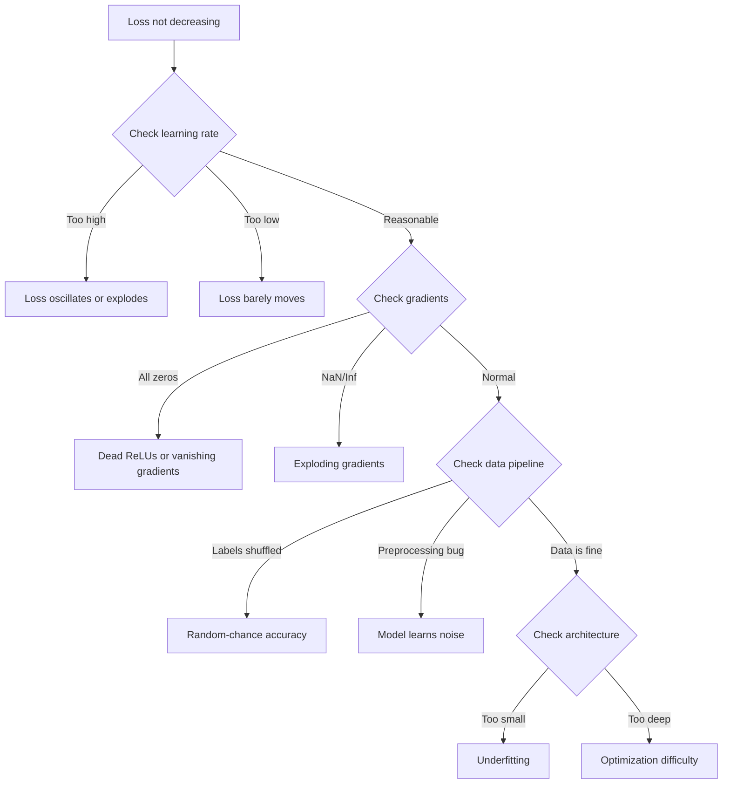
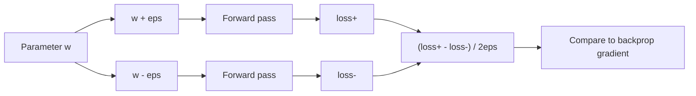
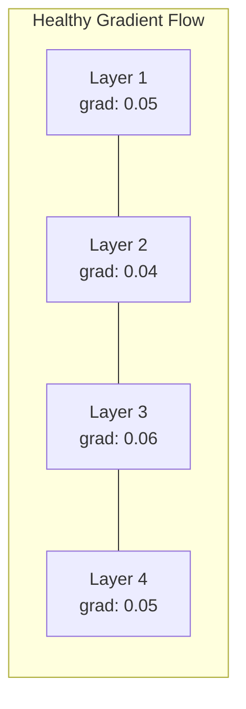
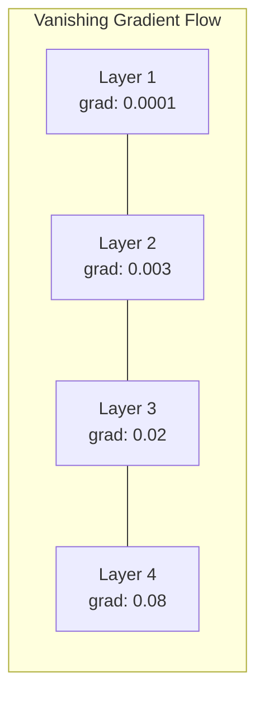
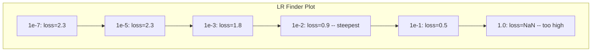

# Debugowanie sieci neuronowych

> Twoja sieć została skompilowana. Pobiegło. Wyprodukowało numer. Numer jest błędny i nic się nie zawiesiło. Witamy w najtrudniejszym rodzaju debugowania — takim, w którym nie pojawia się żaden komunikat o błędzie.

**Typ:** Ćwicz
**Języki:** Python, PyTorch
**Wymagania wstępne:** Faza 03, lekcje 01-10 (szczególnie propagacja wsteczna, funkcje strat, optymalizatory)
**Czas:** ~90 minut

## Cele nauczania

- Diagnozuj typowe awarie sieci neuronowych (utrata NaN, płaska krzywa strat, nadmierne dopasowanie, oscylacje) za pomocą systematycznych strategii debugowania
- Zastosuj technikę „przeciążenia jednej partii”, aby sprawdzić, czy architektura modelu i pętla treningowa są prawidłowe
- Sprawdź wielkość gradientu, rozkład aktywacji i normy wagowe, aby zidentyfikować problemy ze znikającym/eksplodującym gradientem
- Zbuduj listę kontrolną debugowania obejmującą potok danych, architekturę modelu, funkcję straty, optymalizator i problemy z szybkością uczenia się

## Problem

Tradycyjne oprogramowanie ulega awarii, gdy jest uszkodzone. Wskaźnik zerowy zgłasza wyjątek. Niezgodność typu kończy się niepowodzeniem w czasie kompilacji. Błąd typu off-by-one daje wyraźnie błędny wynik.

Sieci neuronowe nie dają takiego luksusu.

Uszkodzona sieć neuronowa działa do końca, drukuje wartość straty i generuje prognozy. Strata może się zmniejszyć. Przewidywania mogą wydawać się prawdopodobne. Ale model jest po cichu błędny – uczy się skrótów, zapamiętuje dźwięki lub skupia się na bezużytecznym lokalnym minimum. Badacze Google oszacowali, że 60–70% czasu debugowania ML pochłaniają „ciche” błędy, które nie powodują błędów, ale pogarszają jakość modelu.

Różnica między działającym modelem a uszkodzonym to często pojedyncza źle umieszczona linia: brakujący `zero_grad()`, transponowany wymiar, 10-krotny spadek szybkości uczenia się. kanoniczny „Przepis na szkolenie sieci neuronowych” (2019) rozpoczyna się następującym stwierdzeniem: „Najczęstsze błędy sieci neuronowych to błędy, które się nie zawieszają”.

Ta lekcja nauczy Cię znajdować te błędy.

## Koncepcja

### Nastawienie na debugowanie

Zapomnij o debugowaniu typu „drukuj i módl się”. Debugowanie sieci neuronowej wymaga systematycznego podejścia, ponieważ pętla sprzężenia zwrotnego jest powolna (od minut do godzin na przebieg treningowy), a objawy są niejednoznaczne (poważna strata może oznaczać 20 różnych rzeczy).

Złota zasada: **zacznij od prostego, dodawaj złożoność jeden element na raz i sprawdzaj każdy element niezależnie.**



### Objaw 1: Strata nie maleje

To najczęstsza skarga. Pętla treningowa biegnie, mijają epoki, a strata pozostaje stała lub gwałtownie oscyluje.

**Zły współczynnik uczenia.** Zbyt wysoki: strata oscyluje lub skacze do NaN. Zbyt niska: strata maleje tak wolno, że wygląda płasko. Dla Adama zacznij od 1e-3. W przypadku SGD zacznij od 1e-1 lub 1e-2. Zawsze wypróbuj 3 szybkości uczenia się, obejmujące 10 razy każdy (np. 1e-2, 1e-3, 1e-4), zanim dojdziesz do wniosku, że coś innego jest nie tak.

**Martwe ReLU.** Jeśli neuron ReLU otrzyma duży ujemny sygnał wejściowy, na wyjściu wyświetli się 0, a jego gradient będzie wynosić 0. Nigdy więcej się nie aktywuje. Jeśli umrze wystarczająca liczba neuronów, sieć nie będzie mogła się uczyć. Sprawdź: wypisz ułamek aktywacji, który wynosi dokładnie 0 po każdej warstwie ReLU. Jeśli >50% nie żyje, przełącz się na LeakyReLU lub zmniejsz tempo uczenia się.

**Zanikające gradienty.** W głębokich sieciach z aktywacją sigmoidalną lub tanh, gradienty kurczą się wykładniczo w miarę propagacji wstecz. Zanim dotrą do pierwszej warstwy, ich wartość wynosi ~0. Pierwsze warstwy przestają się uczyć. Poprawka: użyj ReLU/GELU, dodaj pozostałe połączenia lub użyj normalizacji wsadowej.

**Wybuchające gradienty.** Problem odwrotny – gradienty rosną wykładniczo. Powszechne w sieciach RNN i bardzo głębokich sieciach. Strata skacze do NaN. Poprawka: obcinanie gradientu (`torch.nn.utils.clip_grad_norm_`), zmniejsz szybkość uczenia się lub dodaj normalizację.

### Objaw 2: Strata maleje, ale model jest zły

Strata maleje. Dokładność treningu sięga 99%. Ale dokładność testu wynosi 55%. Lub model generuje bezsensowne wyniki na podstawie rzeczywistych danych.

**Nadmierne dopasowanie.** Model zapamiętuje dane treningowe zamiast wzorców uczenia się. Z biegiem czasu zwiększa się różnica między szkoleniem a utratą walidacji. Poprawka: więcej danych, rezygnacja z transmisji, spadek wagi, wcześniejsze zatrzymanie, zwiększenie ilości danych.

**Wyciek danych.** Dane testowe wyciekły do ​​treningu. Dokładność jest podejrzanie wysoka. Typowe przyczyny: tasowanie przed podziałem, wstępne przetwarzanie ze statystykami z pełnego zbioru danych, duplikowanie próbek w ramach podziałów. Poprawka: najpierw podziel, następnie przetwórz wstępnie, sprawdź duplikaty.

**Błędy w etykietach.** 5–10% etykiet w większości rzeczywistych zbiorów danych jest błędnych (Northcutt i in., 2021 – „Pervasive Label Errors in Test Sets”). Model uczy się hałasu. Napraw: wykorzystaj pewność uczenia się, aby znaleźć i naprawić błędnie oznaczone przykłady, lub użyj obcięcia strat, aby zignorować próbki o dużych stratach.

### Objaw 3: Strata NaN lub Inf

Wartość straty to `nan` lub `inf`. Trening jest martwy.

**Zbyt wysoki współczynnik uczenia się.** Aktualizacje gradientu przekraczają tak bardzo, że ciężary eksplodują. Poprawka: zmniejsz o 10x.

**log(0) lub log(ujemny).** Obliczenia strat krzyżowych entropii `log(p)`. Jeśli Twój model wyświetli dokładnie 0 lub ujemne prawdopodobieństwo, dziennik eksploduje. Poprawka: zablokuj przewidywania do `[eps, 1-eps]`, gdzie `eps=1e-7`.

**Podział przez zero.** Normalizacja wsadowa dzieli się przez odchylenie standardowe. Partia o stałych wartościach ma std=0. Poprawka: dodaj epsilon do mianownika (PyTorch robi to domyślnie, ale niestandardowe implementacje mogą nie).

**Przepełnienie liczbowe.** Duże aktywacje wprowadzone do `exp()` generują Inf. Szczególnie podatny jest Softmax. Poprawka: odejmij maksimum przed potęgowaniem (sztuczka log-sum-exp).

### Technika 1: Sprawdzanie gradientu

Porównaj swoje gradienty analityczne (z podpórek) z gradientami numerycznymi (z różnic skończonych). Jeśli się nie zgodzą, Twoje podanie do tyłu zawiera błąd.

Gradient numeryczny dla parametru `w`:

```
grad_numerical = (loss(w + eps) - loss(w - eps)) / (2 * eps)
```

Metryka zgodności (różnica względna):

```
rel_diff = |grad_analytical - grad_numerical| / max(|grad_analytical|, |grad_numerical|, 1e-8)
```

Jeśli `rel_diff < 1e-5`: poprawne. Jeśli `rel_diff > 1e-3`: prawie na pewno jest to błąd.



### Technika 2: Statystyki aktywacji

Podczas treningu monitoruj średnią i odchylenie standardowe aktywacji po każdej warstwie. Zdrowe sieci utrzymują aktywacje ze średnią bliską 0 i std bliską 1 (po normalizacji) lub co najmniej ograniczoną.

| Wskaźnik zdrowia | Znaczy | standardowe | Diagnoza |
|----------------|------|-----|----------|
| Zdrowy | ~0 | ~1 | Sieć uczy się normalnie |
| Nasycone | >>0 lub <<0 | ~0 | Aktywacje utknęły na wartościach ekstremalnych |
| Martwy | 0 | 0 | Neurony są martwe (wszystkie zera) |
| Eksploduje | >>10 | >>10 | Aktywacje rosną bez ograniczeń |

### Technika 3: Wizualizacja przepływu gradientowego

Narysuj średnią wielkość gradientu dla każdej warstwy. W sprawnej sieci wielkości gradientów powinny być mniej więcej podobne we wszystkich warstwach. Jeśli wczesne warstwy mają gradienty 1000 razy mniejsze niż późniejsze, mamy do czynienia z gradientami zanikającymi.





### Technika 4: Test nadmiernego dopasowania jednej partii

Najważniejsza technika debugowania w głębokim uczeniu się.

Weź jedną małą partię (8-32 próbki). Trenuj na nim przez ponad 100 iteracji. Strata powinna spaść prawie do zera, a dokładność treningu powinna osiągnąć 100%. Jeżeli tak nie jest, w Twoim modelu lub pętli treningowej występuje zasadniczy błąd — nie przystępuj do pełnego treningu.

Ten test łapie:
- Uszkodzone funkcje straty
- Złamane podania do tyłu
- Architektura zbyt mała, aby reprezentować dane
- Optymalizator nie jest podłączony do parametrów modelu
- Dane i etykiety są źle wyrównane

Uruchomienie zajmuje 30 sekund i pozwala zaoszczędzić godziny debugowania pełnych przebiegów treningowych.

### Technika 5: Wyszukiwarka szybkości uczenia się

Leslie Smith (2017) zaproponował zmianę tempa uczenia się z bardzo małego (1e-7) do bardzo dużego (10) w ciągu jednej epoki, rejestrując stratę. Utrata fabuły a szybkość uczenia się. Optymalna szybkość uczenia się jest w przybliżeniu 10 razy mniejsza niż szybkość, przy której strata zaczyna się najszybciej zmniejszać.



Najlepszy LR w tym przykładzie: ~1e-3 (jeden rząd wielkości przed najbardziej stromym punktem).

### Typowe błędy PyTorcha

Oto błędy, które marnują najwięcej godzin w społeczności PyTorch:

| Błąd | Objaw | Napraw |
|-----|---------|-----|
| Zapominanie `optimizer.zero_grad()` | Gradienty kumulują się w partiach, straty oscylują | Dodaj `optimizer.zero_grad()` przed `loss.backward()` |
| Zapominanie `model.eval()` w czasie testu | Normy dotyczące porzucenia i partii zachowują się inaczej, dokładność testu różni się w zależności od serii | Dodaj `model.eval()` i `torch.no_grad()` |
| Złe kształty tensora | Ciche nadawanie daje błędne wyniki, nie ma błędu | Drukuj kształty po każdej operacji podczas debugowania |
| Niedopasowanie procesora/GPU | `RuntimeError: expected CUDA tensor` | Użyj `.to(device)` na modelu ORAZ danych |
| Nie odłączanie tensorów | Wykres obliczeniowy rośnie w nieskończoność, OOM | Użyj `.detach()` lub `with torch.no_grad()` |
| Operacje na miejscu przerywające autograd | `RuntimeError: modified by in-place operation` | Zamień `x += 1` na `x = x + 1` |
| Dane nieznormalizowane | Strata utknęła na poziomie losowej szansy | Normalizuj dane wejściowe na średnią=0, std=1 |
| Etykiety jako błędny typ | Entropia krzyżowa oczekuje `Long`, otrzymała `Float` | Etykiety obsady: `labels.long()` |

### Główna tabela debugowania

| Objaw | Prawdopodobna przyczyna | Pierwszą rzeczą, którą należy spróbować |
|--------|------------|--------------------------------|
| Strata utknęła na -log(1/num_classes) | Model przewidujący rozkład równomierny | Sprawdź potok danych, sprawdź, czy etykiety pasują do danych wejściowych |
| Strata NaN po kilku krokach | Zbyt wysoka szybkość uczenia się | Zmniejsz LR o 10x |
| Strata NaN natychmiast | log(0) lub dzielenie przez zero | Dodaj epsilon do operacji log/dzielenia |
| Strata oscyluje dziko | LR za wysoki lub wielkość partii za mała | Zmniejsz LR, zwiększ wielkość partii |
| Strata malejąca, a następnie plateau | LR za wysoki dla fazy dostrajania | Dodaj harmonogram LR (rozpad cosinusowy lub krokowy) |
| Trening zgodnie z wysokim poziomem, test z niskim poziomem | Nadmierne dopasowanie | Dodaj porzucenie, spadek masy ciała, więcej danych |
| Szkolenie acc = test acc = szansa | Modelka niczego się nie uczy | Uruchom test nadmiernego dopasowania w jednej partii |
| Trening wg = test wg, ale oba niskie | Niedopasowanie | Większy model, więcej warstw, więcej funkcji |
| Gradienty wszystkie zerowe | Martwe ReLU lub odłączony wykres obliczeniowy | Przełącz na LeakyReLU, sprawdź `.requires_grad` |
| Brak pamięci podczas treningu | Partia jest zbyt duża lub wykres nie jest zwolniony | Zmniejsz rozmiar partii, użyj `torch.no_grad()` dla eval |

## Zbuduj to

Zestaw narzędzi diagnostycznych, który monitoruje aktywacje, gradienty i krzywe strat. Celowo uszkodzisz sieć i użyjesz zestawu narzędzi do zdiagnozowania każdego problemu.

### Krok 1: Klasa NetworkDebugger

Łączy się z modelem PyTorch w celu rejestrowania statystyk aktywacji i gradientu na warstwę.

```python
import torch
import torch.nn as nn
import math

class NetworkDebugger:
    def __init__(self, model):
        self.model = model
        self.activation_stats = {}
        self.gradient_stats = {}
        self.loss_history = []
        self.lr_losses = []
        self.hooks = []
        self._register_hooks()

    def _register_hooks(self):
        for name, module in self.model.named_modules():
            if isinstance(module, (nn.Linear, nn.Conv2d, nn.ReLU, nn.LeakyReLU)):
                hook = module.register_forward_hook(self._make_activation_hook(name))
                self.hooks.append(hook)
                hook = module.register_full_backward_hook(self._make_gradient_hook(name))
                self.hooks.append(hook)

    def _make_activation_hook(self, name):
        def hook(module, input, output):
            with torch.no_grad():
                out = output.detach().float()
                self.activation_stats[name] = {
                    "mean": out.mean().item(),
                    "std": out.std().item(),
                    "fraction_zero": (out == 0).float().mean().item(),
                    "min": out.min().item(),
                    "max": out.max().item(),
                }
        return hook

    def _make_gradient_hook(self, name):
        def hook(module, grad_input, grad_output):
            if grad_output[0] is not None:
                with torch.no_grad():
                    grad = grad_output[0].detach().float()
                    self.gradient_stats[name] = {
                        "mean": grad.mean().item(),
                        "std": grad.std().item(),
                        "abs_mean": grad.abs().mean().item(),
                        "max": grad.abs().max().item(),
                    }
        return hook

    def record_loss(self, loss_value):
        self.loss_history.append(loss_value)

    def check_loss_health(self):
        if len(self.loss_history) < 2:
            return "NOT_ENOUGH_DATA"
        recent = self.loss_history[-10:]
        if any(math.isnan(v) or math.isinf(v) for v in recent):
            return "NAN_OR_INF"
        if len(self.loss_history) >= 20:
            first_half = sum(self.loss_history[:10]) / 10
            second_half = sum(self.loss_history[-10:]) / 10
            if second_half >= first_half * 0.99:
                return "NOT_DECREASING"
        if len(recent) >= 5:
            diffs = [recent[i+1] - recent[i] for i in range(len(recent)-1)]
            if max(diffs) - min(diffs) > 2 * abs(sum(diffs) / len(diffs)):
                return "OSCILLATING"
        return "HEALTHY"

    def check_activations(self):
        issues = []
        for name, stats in self.activation_stats.items():
            if stats["fraction_zero"] > 0.5:
                issues.append(f"DEAD_NEURONS: {name} has {stats['fraction_zero']:.0%} zero activations")
            if abs(stats["mean"]) > 10:
                issues.append(f"EXPLODING_ACTIVATIONS: {name} mean={stats['mean']:.2f}")
            if stats["std"] < 1e-6:
                issues.append(f"COLLAPSED_ACTIVATIONS: {name} std={stats['std']:.2e}")
        return issues if issues else ["HEALTHY"]

    def check_gradients(self):
        issues = []
        grad_magnitudes = []
        for name, stats in self.gradient_stats.items():
            grad_magnitudes.append((name, stats["abs_mean"]))
            if stats["abs_mean"] < 1e-7:
                issues.append(f"VANISHING_GRADIENT: {name} abs_mean={stats['abs_mean']:.2e}")
            if stats["abs_mean"] > 100:
                issues.append(f"EXPLODING_GRADIENT: {name} abs_mean={stats['abs_mean']:.2e}")
        if len(grad_magnitudes) >= 2:
            first_mag = grad_magnitudes[0][1]
            last_mag = grad_magnitudes[-1][1]
            if last_mag > 0 and first_mag / last_mag > 100:
                issues.append(f"GRADIENT_RATIO: first/last = {first_mag/last_mag:.0f}x (vanishing)")
        return issues if issues else ["HEALTHY"]

    def print_report(self):
        print("\n=== NETWORK DEBUGGER REPORT ===")
        print(f"\nLoss health: {self.check_loss_health()}")
        if self.loss_history:
            print(f"  Last 5 losses: {[f'{v:.4f}' for v in self.loss_history[-5:]]}")
        print("\nActivation diagnostics:")
        for item in self.check_activations():
            print(f"  {item}")
        print("\nGradient diagnostics:")
        for item in self.check_gradients():
            print(f"  {item}")
        print("\nPer-layer activation stats:")
        for name, stats in self.activation_stats.items():
            print(f"  {name}: mean={stats['mean']:.4f} std={stats['std']:.4f} zero={stats['fraction_zero']:.1%}")
        print("\nPer-layer gradient stats:")
        for name, stats in self.gradient_stats.items():
            print(f"  {name}: abs_mean={stats['abs_mean']:.2e} max={stats['max']:.2e}")

    def remove_hooks(self):
        for hook in self.hooks:
            hook.remove()
        self.hooks.clear()
```

### Krok 2: Test nadmiernego dopasowania jednej partii

```python
def overfit_one_batch(model, x_batch, y_batch, criterion, lr=0.01, steps=200):
    optimizer = torch.optim.Adam(model.parameters(), lr=lr)
    model.train()
    print("\n=== OVERFIT ONE BATCH TEST ===")
    print(f"Batch size: {x_batch.shape[0]}, Steps: {steps}")

    for step in range(steps):
        optimizer.zero_grad()
        output = model(x_batch)
        loss = criterion(output, y_batch)
        loss.backward()
        optimizer.step()

        if step % 50 == 0 or step == steps - 1:
            with torch.no_grad():
                preds = (output > 0).float() if output.shape[-1] == 1 else output.argmax(dim=1)
                targets = y_batch if y_batch.dim() == 1 else y_batch.squeeze()
                acc = (preds.squeeze() == targets).float().mean().item()
            print(f"  Step {step:3d} | Loss: {loss.item():.6f} | Accuracy: {acc:.1%}")

    final_loss = loss.item()
    if final_loss > 0.1:
        print(f"\n  FAIL: Loss did not converge ({final_loss:.4f}). Model or training loop is broken.")
        return False
    print(f"\n  PASS: Loss converged to {final_loss:.6f}")
    return True
```

### Krok 3: Wyszukiwarka szybkości uczenia się

```python
def find_learning_rate(model, x_data, y_data, criterion, start_lr=1e-7, end_lr=10, steps=100):
    import copy
    original_state = copy.deepcopy(model.state_dict())
    optimizer = torch.optim.SGD(model.parameters(), lr=start_lr)
    lr_mult = (end_lr / start_lr) ** (1 / steps)

    model.train()
    results = []
    best_loss = float("inf")
    current_lr = start_lr

    print("\n=== LEARNING RATE FINDER ===")

    for step in range(steps):
        optimizer.zero_grad()
        output = model(x_data)
        loss = criterion(output, y_data)

        if math.isnan(loss.item()) or loss.item() > best_loss * 10:
            break

        best_loss = min(best_loss, loss.item())
        results.append((current_lr, loss.item()))

        loss.backward()
        optimizer.step()

        current_lr *= lr_mult
        for param_group in optimizer.param_groups:
            param_group["lr"] = current_lr

    model.load_state_dict(original_state)

    if len(results) < 10:
        print("  Could not complete LR sweep -- loss diverged too quickly")
        return results

    min_loss_idx = min(range(len(results)), key=lambda i: results[i][1])
    suggested_lr = results[max(0, min_loss_idx - 10)][0]

    print(f"  Swept {len(results)} steps from {start_lr:.0e} to {results[-1][0]:.0e}")
    print(f"  Minimum loss {results[min_loss_idx][1]:.4f} at lr={results[min_loss_idx][0]:.2e}")
    print(f"  Suggested learning rate: {suggested_lr:.2e}")

    return results
```

### Krok 4: Sprawdzanie gradientu

```python
def _flat_to_multi_index(flat_idx, shape):
    multi_idx = []
    remaining = flat_idx
    for dim in reversed(shape):
        multi_idx.insert(0, remaining % dim)
        remaining //= dim
    return tuple(multi_idx)

def gradient_check(model, x, y, criterion, eps=1e-4):
    model.train()
    x_double = x.double()
    y_double = y.double()
    model_double = model.double()

    print("\n=== GRADIENT CHECK ===")
    overall_max_diff = 0
    checked = 0

    for name, param in model_double.named_parameters():
        if not param.requires_grad:
            continue

        layer_max_diff = 0

        model_double.zero_grad()
        output = model_double(x_double)
        loss = criterion(output, y_double)
        loss.backward()
        analytical_grad = param.grad.clone()

        num_checks = min(5, param.numel())
        for i in range(num_checks):
            idx = _flat_to_multi_index(i, param.shape)
            original = param.data[idx].item()

            param.data[idx] = original + eps
            with torch.no_grad():
                loss_plus = criterion(model_double(x_double), y_double).item()

            param.data[idx] = original - eps
            with torch.no_grad():
                loss_minus = criterion(model_double(x_double), y_double).item()

            param.data[idx] = original

            numerical = (loss_plus - loss_minus) / (2 * eps)
            analytical = analytical_grad[idx].item()

            denom = max(abs(numerical), abs(analytical), 1e-8)
            rel_diff = abs(numerical - analytical) / denom

            layer_max_diff = max(layer_max_diff, rel_diff)
            checked += 1

        overall_max_diff = max(overall_max_diff, layer_max_diff)
        status = "OK" if layer_max_diff < 1e-5 else "MISMATCH"
        print(f"  {name}: max_rel_diff={layer_max_diff:.2e} [{status}]")

    model.float()

    print(f"\n  Checked {checked} parameters")
    if overall_max_diff < 1e-5:
        print("  PASS: Gradients match (rel_diff < 1e-5)")
    elif overall_max_diff < 1e-3:
        print("  WARN: Small differences (1e-5 < rel_diff < 1e-3)")
    else:
        print("  FAIL: Gradient mismatch detected (rel_diff > 1e-3)")
    return overall_max_diff
```

### Krok 5: Celowo uszkodzone sieci

Teraz zastosuj zestaw narzędzi do uszkodzonych sieci i zdiagnozuj każdą z nich.

```python
def demo_broken_networks():
    torch.manual_seed(42)
    x = torch.randn(64, 10)
    y = (x[:, 0] > 0).long()

    print("\n" + "=" * 60)
    print("BUG 1: Learning rate too high (lr=10)")
    print("=" * 60)
    model1 = nn.Sequential(nn.Linear(10, 32), nn.ReLU(), nn.Linear(32, 2))
    debugger1 = NetworkDebugger(model1)
    optimizer1 = torch.optim.SGD(model1.parameters(), lr=10.0)
    criterion = nn.CrossEntropyLoss()
    for step in range(20):
        optimizer1.zero_grad()
        out = model1(x)
        loss = criterion(out, y)
        debugger1.record_loss(loss.item())
        loss.backward()
        optimizer1.step()
    debugger1.print_report()
    debugger1.remove_hooks()

    print("\n" + "=" * 60)
    print("BUG 2: Dead ReLUs from bad initialization")
    print("=" * 60)
    model2 = nn.Sequential(nn.Linear(10, 32), nn.ReLU(), nn.Linear(32, 32), nn.ReLU(), nn.Linear(32, 2))
    with torch.no_grad():
        for m in model2.modules():
            if isinstance(m, nn.Linear):
                m.weight.fill_(-1.0)
                m.bias.fill_(-5.0)
    debugger2 = NetworkDebugger(model2)
    optimizer2 = torch.optim.Adam(model2.parameters(), lr=1e-3)
    for step in range(50):
        optimizer2.zero_grad()
        out = model2(x)
        loss = criterion(out, y)
        debugger2.record_loss(loss.item())
        loss.backward()
        optimizer2.step()
    debugger2.print_report()
    debugger2.remove_hooks()

    print("\n" + "=" * 60)
    print("BUG 3: Missing zero_grad (gradients accumulate)")
    print("=" * 60)
    model3 = nn.Sequential(nn.Linear(10, 32), nn.ReLU(), nn.Linear(32, 2))
    debugger3 = NetworkDebugger(model3)
    optimizer3 = torch.optim.SGD(model3.parameters(), lr=0.01)
    for step in range(50):
        out = model3(x)
        loss = criterion(out, y)
        debugger3.record_loss(loss.item())
        loss.backward()
        optimizer3.step()
    debugger3.print_report()
    debugger3.remove_hooks()

    print("\n" + "=" * 60)
    print("HEALTHY NETWORK: Correct setup for comparison")
    print("=" * 60)
    model_good = nn.Sequential(nn.Linear(10, 32), nn.ReLU(), nn.Linear(32, 2))
    debugger_good = NetworkDebugger(model_good)
    optimizer_good = torch.optim.Adam(model_good.parameters(), lr=1e-3)
    for step in range(50):
        optimizer_good.zero_grad()
        out = model_good(x)
        loss = criterion(out, y)
        debugger_good.record_loss(loss.item())
        loss.backward()
        optimizer_good.step()
    debugger_good.print_report()
    debugger_good.remove_hooks()

    print("\n" + "=" * 60)
    print("OVERFIT-ONE-BATCH TEST (healthy model)")
    print("=" * 60)
    model_test = nn.Sequential(nn.Linear(10, 32), nn.ReLU(), nn.Linear(32, 2))
    overfit_one_batch(model_test, x[:8], y[:8], criterion)

    print("\n" + "=" * 60)
    print("LEARNING RATE FINDER")
    print("=" * 60)
    model_lr = nn.Sequential(nn.Linear(10, 32), nn.ReLU(), nn.Linear(32, 2))
    find_learning_rate(model_lr, x, y, criterion)

    print("\n" + "=" * 60)
    print("GRADIENT CHECK")
    print("=" * 60)
    model_grad = nn.Sequential(nn.Linear(10, 8), nn.ReLU(), nn.Linear(8, 2))
    gradient_check(model_grad, x[:4], y[:4], criterion)
```

## Użyj tego

### Wbudowane narzędzia PyTorch

```python
import torch
import torch.nn as nn

model = nn.Sequential(
    nn.Linear(768, 256),
    nn.ReLU(),
    nn.Linear(256, 10),
)

with torch.autograd.detect_anomaly():
    output = model(input_tensor)
    loss = criterion(output, target)
    loss.backward()

for name, param in model.named_parameters():
    if param.grad is not None:
        print(f"{name}: grad_mean={param.grad.abs().mean():.2e}")
```

### Integracja wag i odchyleń

```python
import wandb

wandb.init(project="debug-training")

for epoch in range(100):
    loss = train_one_epoch()
    wandb.log({
        "loss": loss,
        "lr": optimizer.param_groups[0]["lr"],
        "grad_norm": torch.nn.utils.clip_grad_norm_(model.parameters(), float("inf")),
    })

    for name, param in model.named_parameters():
        if param.grad is not None:
            wandb.log({f"grad/{name}": wandb.Histogram(param.grad.cpu().numpy())})
```

### Płyta Tensor

```python
from torch.utils.tensorboard import SummaryWriter

writer = SummaryWriter("runs/debug_experiment")

for epoch in range(100):
    loss = train_one_epoch()
    writer.add_scalar("Loss/train", loss, epoch)

    for name, param in model.named_parameters():
        writer.add_histogram(f"weights/{name}", param, epoch)
        if param.grad is not None:
            writer.add_histogram(f"gradients/{name}", param.grad, epoch)
```

### Lista kontrolna debugowania (przed pełnym szkoleniem)

1. Przeprowadź test nadmiernego dopasowania w jednej partii. Jeśli się nie uda, przestań.
2. Wydrukuj podsumowanie modelu – sprawdź, czy liczba parametrów jest rozsądna.
3. Uruchom pojedynczy przebieg do przodu z losowymi danymi - sprawdź kształt wyjściowy.
4. Trenuj przez 5 epok – sprawdź zmniejszenie strat.
5. Sprawdź statystyki aktywacji – żadnych martwych warstw, żadnych eksplozji.
6. Sprawdź przepływ gradientowy – czy nie znika, czy nie eksploduje.
7. Zweryfikuj potok danych — wydrukuj 5 losowych próbek z etykietami.

## Wyślij to

Ta lekcja daje:
- `outputs/prompt-nn-debugger.md` – monit o diagnozowanie błędów uczenia sieci neuronowej
- `outputs/skill-debug-checklist.md` – lista kontrolna drzewa decyzyjnego do debugowania problemów szkoleniowych

Kluczowe wzorce wdrażania debugowania:
- Dodaj haki monitorujące do skryptów szkoleniowych produkcji
- Rejestruj statystyki aktywacji i gradientu w W&B lub TensorBoard co N kroków
- Wdrożenie automatycznych alertów o utracie NaN, martwych neuronach (>80% zera) lub eksplozji gradientu
- Zawsze uruchamiaj test overfit-one-batch przy zmianie architektury lub potoków danych

## Ćwiczenia

1. **Dodaj detektor eksplodującego gradientu.** Zmodyfikuj `NetworkDebugger`, aby wykrywać, kiedy gradienty przekraczają próg i automatycznie sugerować wartość obcinania gradientu. Przetestuj go w sieci 20-warstwowej bez normalizacji.

2. **Zbuduj resurrektor martwych neuronów.** Napisz funkcję, która identyfikuje martwe neurony ReLU (zawsze wyświetlając 0) i ponownie inicjuje ich przychodzące wagi za pomocą inicjalizacji Kaiming. Pokaż, że przywraca to sieć, w której ponad 70% neuronów jest martwych.

3. **Zaimplementuj narzędzie do wyszukiwania szybkości uczenia się z kreśleniem.** Rozszerz `find_learning_rate`, aby zapisać wyniki jako plik CSV i napisz oddzielny skrypt, który odczyta plik CSV i wyświetli krzywą LR vs stratę za pomocą matplotlib. Zidentyfikuj optymalny LR dla ResNet-18 na CIFAR-10.

4. **Utwórz walidator potoku danych.** Napisz funkcję sprawdzającą: duplikaty próbek w podziale pociągów/testów, brak równowagi dystrybucji etykiet (stosunek> 10:1), normalizację danych wejściowych (średnia bliska 0, std bliska 1) i wartości NaN/Inf w danych. Uruchom go na celowo uszkodzonym zestawie danych.

5. **Debugowanie prawdziwej awarii.** Weź mini-framework z lekcji 10, wprowadź subtelny błąd (np. transponuj macierz wag do tyłu) i użyj sprawdzania gradientu, aby dokładnie zlokalizować, który parametr ma nieprawidłowe gradienty. Udokumentuj proces debugowania.

## Kluczowe terminy

| Termin | Co ludzie mówią | Co to właściwie oznacza |
|------|----------------|----------------------|
| Cichy błąd | „Działa, ale daje złe wyniki” | Błąd, który nie generuje błędu, ale pogarsza jakość modelu — dominujący tryb awarii w ML |
| Martwy ReLU | „Neurony umarły” | Neuron ReLU, którego wejście jest zawsze ujemne, więc wyprowadza 0 i otrzymuje stale gradient 0
| Znikające gradienty | „Wczesne warstwy przestają się uczyć” | Gradienty kurczą się wykładniczo w warstwach, powodując skuteczne zamrożenie ciężarów we wczesnych warstwach
| Eksplodujące gradienty | „Przegrana przypadła NaN” | Gradienty rosną wykładniczo przez warstwy, powodując aktualizacje wagi tak duże, że przepełniają |
| Sprawdzanie gradientu | „Sprawdź, czy podpora jest poprawna” | Porównanie gradientów analitycznych z podłoża do gradientów numerycznych z różnic skończonych |
| Overfit-jedna-partia | „Najważniejszy test debugowania” | Szkolenie na pojedynczej małej partii w celu sprawdzenia modelu MOŻE się uczyć -- jeśli nie może, coś jest zasadniczo uszkodzone |
| Wyszukiwarka LR | „Przeszukaj, aby znaleźć odpowiednią szybkość uczenia się” | Wykładnicze zwiększanie tempa uczenia się w jednej epoce i wybieranie tempa tuż przed rozbieżnością strat |
| Wyciek danych | „Dane testowe wyciekły do ​​treningu” | Gdy informacje ze zbioru testowego zanieczyszczają trening, powodując sztucznie wysoką dokładność |
| Statystyki aktywacji | „Monitoruj stan warstwy” | Śledzenie średniej, standardowej i zerowej części wyjścia każdej warstwy w celu wykrycia martwych, nasyconych lub eksplodujących neuronów |
| Przycinanie gradientu | „Ogranicz wielkość gradientu” | Skalowanie gradientów w dół, gdy ich norma przekracza próg, zapobiegając eksplozjom aktualizacji gradientów |

## Dalsze czytanie

- Smith, „Cyclical Learning Rates for Training Neural Networks” (2017) – artykuł wprowadzający do testu zakresu szybkości uczenia się (wyszukiwarka LR)
— Northcutt i in., „Pervasive Label Errors in Test Sets Destabilize Machine Learning Benchmarks” (2021) — pokazuje, że 3–6% etykiet w ImageNet, CIFAR-10 i innych głównych testach porównawczych jest błędnych
– Zhang i in., „Understanding Deep Learning Requires Rethinking Generalization” (2017) – artykuł pokazujący, że sieci neuronowe potrafią zapamiętywać losowe etykiety, dlatego działa test overfit-one-batch
- Dokumentacja PyTorch dotycząca `torch.autograd.detect_anomaly` i `torch.autograd.set_detect_anomaly` dla wbudowanego wykrywania NaN/Inf