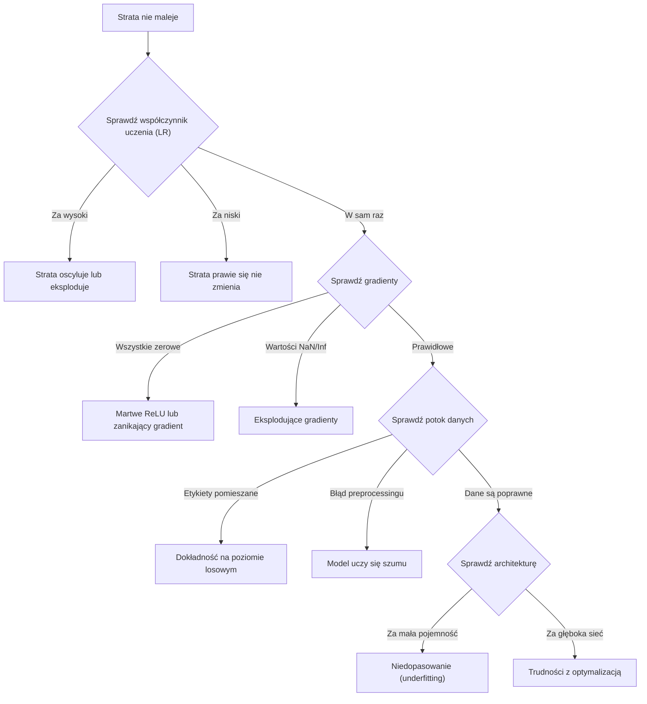
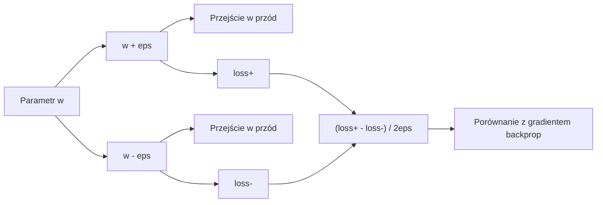
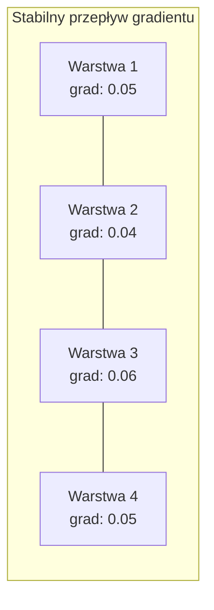
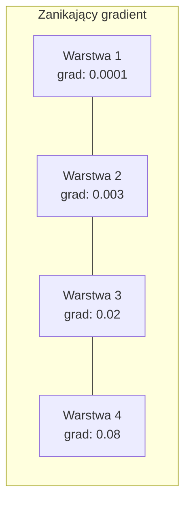
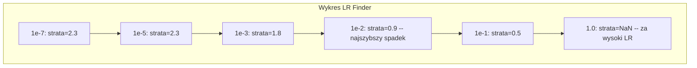

# Debugowanie sieci neuronowych

> Twoja sieć została pomyślnie skompilowana. Uruchomiła się. Wypluła jakąś wartość straty. Wynik jest jednak ewidentnie błędny, mimo że program nie zgłosił żadnego błędu. Witamy w świecie debugowania sieci neuronowych – najtrudniejszym typie debugowania, w którym nie pojawiają się żadne komunikaty o błędach.

**Typ:** Ćwiczenie  
**Języki:** Python, PyTorch  
**Wymagania wstępne:** Faza 03, lekcje 01-10 (w szczególności propagacja wsteczna, funkcje straty, optymalizatory)  
**Czas:** ~90 minut  

## Cele kształcenia

- Diagnozowanie typowych błędów w treningu sieci neuronowych (strata NaN, zatrzymanie spadku straty, przeuczenie/overfitting, oscylacje) przy użyciu systematycznych strategii diagnostycznych.
- Zastosowanie techniki „przeuczenia na pojedynczej partii” (overfitting one batch) w celu weryfikacji poprawności architektury modelu oraz pętli treningowej.
- Analiza wielkości gradientów, rozkładów aktywacji oraz norm wag w celu identyfikacji problemów z zanikającym lub eksplodującym gradientem.
- Opracowanie kompleksowej listy kontrolnej debugowania obejmującej potok danych, architekturę modelu, funkcję straty, optymalizator oraz dobór współczynnika uczenia się.

## Problem

Tradycyjne programy ulegają awarii w sposób jawny. Odwołanie do pustego wskaźnika (null pointer) zgłasza wyjątek. Niezgodność typów powoduje błąd kompilacji. Błąd przesunięcia o jeden (off-by-one error) daje od razu niepoprawny wynik w testach jednostkowych.

Sieci neuronowe nie oferują takiego luksusu.

Błędnie zaimplementowana sieć neuronowa przejdzie pętlę treningową do końca, wypisze wartości straty i wygeneruje predykcje. Strata może nawet maleć, a predykcje mogą wyglądać na prawdopodobne. Model jest jednak po cichu uszkodzony – może uczyć się fałszywych korelacji, zapamiętywać szum w danych lub utknąć w bezużytecznym minimum lokalnym. Badacze z Google szacują, że aż 60–70% czasu poświęcanego na debugowanie systemów uczenia maszynowego pochłaniają właśnie takie „ciche” błędy, które nie powodują zatrzymania programu, lecz drastycznie pogarszają jakość modelu.

Różnica między działającym a uszkodzonym modelem to często jedna drobna pomyłka w kodzie: brak wywołania `zero_grad()`, pomylone osie tensora czy źle dobrana wartość współczynnika uczenia się. Kanoniczny artykuł Andreja Karpathy'ego *„A Recipe for Training Neural Networks”* (2019) zaczyna się od słów: „Najczęstsze błędy sieci neuronowych to błędy, które nie powodują awarii programu”.

W tej lekcji nauczysz się identyfikować i naprawiać te błędy.

## Koncepcja

### Systematyczne podejście do debugowania

Zapomnij o chaotycznym dodawaniu instrukcji `print` i liczeniu na szczęście. Debugowanie sieci neuronowych wymaga ustrukturyzowanego podejścia, ponieważ pętla informacji zwrotnej jest powolna (trening może trwać od kilku minut do wielu godzin), a objawy bywają niejednoznaczne (wysoka strata może mieć 20 różnych przyczyn).

Złota zasada: **zacznij od najprostszego wariantu, dodawaj złożoność krok po kroku i weryfikuj każdy komponent niezależnie.**



### Objaw 1: Strata (loss) nie maleje

To najczęstszy problem. Pętla treningowa działa, epoki mijają, a strata stoi w miejscu lub gwałtownie oscyluje.

**Źle dobrany współczynnik uczenia się (learning rate, LR).** Zbyt wysoki: strata drastycznie oscyluje lub generuje wartości NaN. Zbyt niski: strata maleje tak powoli, że jej wykres wydaje się całkowicie płaski. Pracując z Adamem, zacznij od wartości 1e-3. W przypadku SGD zacznij od 1e-1 lub 1e-2. Zawsze przetestuj 3 skrajne wartości LR różniące się o rząd wielkości (np. 1e-2, 1e-3, 1e-4) zanim uznasz, że problem leży gdzie indziej.

**Martwe neurony ReLU.** Jeśli neuron z funkcją aktywacji ReLU otrzyma ujemną wartość na wejściu, jego wyjściem staje się 0, a gradient również zeruje się. Taki neuron traci zdolność do aktualizacji wag w krokach wstecz. Gdy zjawisko to dotknie zbyt wielu neuronów, sieć przestaje się uczyć. Diagnostyka: monitoruj odsetek zerowych aktywacji po każdej warstwie ReLU. Jeśli przekracza on 50%, zmień funkcję aktywacji na LeakyReLU lub obniż współczynnik uczenia się.

**Zanikające gradienty.** W głębokich sieciach korzystających z aktywacji sigmoidalnej lub tanh gradienty maleją wykładniczo podczas propagacji wstecznej. Zanim dotrą do początkowych warstw, ich wartości są bliskie zera, co wstrzymuje proces ich uczenia. Rozwiązanie: zastosuj aktywacje ReLU/GELU, dodaj połączenia skrótowe (residual connections) lub użyj normalizacji wsadowej (BatchNorm).

**Eksplodujące gradienty.** Problem odwrotny – gradienty rosną wykładniczo z każdą warstwą. Zjawisko to występuje często w sieciach RNN i bardzo głębokich strukturach. Strata gwałtownie rośnie i osiąga wartość NaN. Rozwiązanie: zastosuj przycinanie gradientów (gradient clipping za pomocą `torch.nn.utils.clip_grad_norm_`), zmniejsz współczynnik uczenia się lub dodaj warstwy normalizacji.

### Objaw 2: Strata maleje, ale model działa słabo

Strata treningowa maleje, a dokładność na zbiorze uczącym sięga 99%, lecz na zbiorze testowym wynosi zaledwie 55% lub model generuje niespójne wyniki na danych rzeczywistych.

**Przeuczenie (overfitting).** Model zapamiętuje cechy konkretnych przykładów ze zbioru treningowego zamiast uczyć się ogólnych reguł. Różnica między stratą treningową a walidacyjną stale rośnie. Rozwiązanie: pozyskaj więcej danych, zastosuj Dropout, spadek wag (weight decay), technikę wczesnego zatrzymania (early stopping) lub augmentację danych.

**Wyciek danych (data leakage).** Informacje ze zbioru testowego przedostały się do zbioru treningowego. Wyniki modelu są podejrzanie wysokie. Typowe przyczyny: tasowanie całego zbioru przed podziałem na części, wyznaczanie statystyk preprocessingu (średnia, wariancja) na pełnym zbiorze danych zamiast wyłącznie na treningowym, występowanie zduplikowanych próbek w obu zbiorach. Rozwiązanie: najpierw podziel zbiór, a dopiero potem wykonaj preprocessing; zweryfikuj unikalność próbek.

**Błędy w etykietowaniu danych (label noise).** W rzeczywistych zbiorach danych nawet 5–10% etykiet bywa błędnych (zob. Northcutt i in., 2021 – *„Pervasive Label Errors in Test Sets”*). Model próbuje uczyć się szumu. Rozwiązanie: zastosuj algorytmy wyszukiwania błędów w etykietach (np. cleanlab) lub zignoruj próbki o nienaturalnie wysokiej wartości straty.

### Objaw 3: Strata NaN lub Inf

Wartość straty wynosi `nan` lub `inf`. Proces uczenia zostaje przerwany.

**Zbyt wysoki współczynnik uczenia się.** Kroki optymalizatora są tak duże, że wagi rosną do nieskończoności. Rozwiązanie: zmniejsz LR 10-krotnie.

**log(0) lub log(wartość ujemna).** Funkcja straty CrossEntropyLoss oblicza wartość $\log(p)$. Jeśli model zwróci prawdopodobieństwo dokładnie równe 0 lub wartość ujemną, funkcja logarytmu wygeneruje nieskończoność. Rozwiązanie: ogranicz (clamp) wartości prawdopodobieństw do bezpiecznego przedziału `[eps, 1-eps]`, np. dla `eps=1e-7`.

**Dzielenie przez zero.** Normalizacja wsadowa dzieli wartości przez odchylenie standardowe. Jeśli cała partia danych ma identyczne wartości cechy, odchylenie standardowe wynosi 0. Rozwiązanie: dodaj małą stałą (epsilon) do mianownika (PyTorch realizuje to automatycznie, ale w niestandardowych implementacjach należy o tym pamiętać).

**Przepełnienie numeryczne (numerical overflow).** Duże wartości wejściowe przekazywane do funkcji wykładniczej `exp()` (np. wewnątrz Softmaxa) generują wartość `inf`. Rozwiązanie: zastosuj bezpieczną wersję Softmaxa poprzez odjęcie wartości maksymalnej przed potęgowaniem (sztuczka LogSumExp).

### Technika 1: Sprawdzanie gradientów (Gradient Checking)

Porównaj gradienty obliczone analitycznie (za pomocą wstecznej propagacji) z gradientami numerycznymi (wyznaczonymi metodą różnic skończonych). Jeśli wartości się różnią, Twój kod kroku wstecz zawiera błąd.

Gradient numeryczny dla parametru $w$:

$$grad_{numerical} = \frac{loss(w + \epsilon) - loss(w - \epsilon)}{2\epsilon}$$

Różnica względna (relative difference):

$$rel\_diff = \frac{|grad_{analytical} - grad_{numerical}|}{\max(|grad_{analytical}|, |grad_{numerical}|, 10^{-8})}$$

Jeśli $rel\_diff < 10^{-5}$, obliczenia są poprawne. Jeśli $rel\_diff > 10^{-3}$, w kodzie wstecznej propagacji prawie na pewno znajduje się błąd.



### Technika 2: Analiza statystyk aktywacji

Podczas treningu monitoruj średnią oraz odchylenie standardowe aktywacji na wyjściu każdej warstwy. Prawidłowo działająca sieć utrzymuje aktywacje o średniej bliskiej 0 i odchyleniu standardowym zbliżonym do 1 (dzięki normalizacji) lub przynajmniej w stabilnych, ograniczonych przedziałach.

| Stan warstwy | Średnia (mean) | Odchylenie stand. (std) | Diagnoza |
| :--- | :--- | :--- | :--- |
| **Stabilny** | ~0 | ~1 | Sieć uczy się prawidłowo |
| **Nasycenie** | $\gg 0$ lub $\ll 0$ | ~0 | Aktywacje nasyciły się na skrajnych wartościach funkcji aktywacji |
| **Martwy** | 0 | 0 | Warstwa jest nieaktywna (same zera) |
| **Eksplozja** | $\gg 10$ | $\gg 10$ | Aktywacje rosną bez ograniczeń |

### Technika 3: Wizualizacja przepływu gradientów

Analizuj średnie wartości gradientów dla każdej warstwy. W stabilnej sieci ich amplituda powinna być na zbliżonym poziomie w całej sieci. Jeśli gradienty początkowych warstw są tysiąckrotnie mniejsze niż warstw końcowych, mamy do czynienia z problemem zanikającego gradientu.





### Technika 4: Test przeuczenia na pojedynczej partii (Overfit One Batch)

To najważniejsza i najszybsza technika debugowania w głębokim uczeniu.

Wytnij ze zbioru danych jedną małą partię (np. 8–32 przykłady) i trenuj na niej model przez około 100–200 iteracji. Strata powinna spaść niemal do zera, a dokładność treningowa osiągnąć 100%. Jeśli tak się nie stanie, w architekturze modelu lub pętli treningowej występuje krytyczny błąd strukturalny – nie ma sensu uruchamiać pełnego uczenia.

Test ten pozwala natychmiast wykryć:
- Błędne implementacje funkcji straty.
- Błędy w ręcznie pisanych krokach wstecznych (`backward`).
- Za małą pojemność sieci w stosunku do złożoności zadania.
- Brak powiązania parametrów modelu z optymalizatorem.
- Błędne dopasowanie etykiet do danych wejściowych.

Uruchomienie tego testu zajmuje kilkanaście sekund, a pozwala zaoszczędzić wiele godzin bezcelowych treningów.

### Technika 5: Wyszukiwanie współczynnika uczenia się (LR Finder)

Metoda Lesliego Smitha (2017) polega na przeprowadzeniu krótkiego treningu próbnego (np. przez jedną epokę), w którym współczynnik uczenia się jest zwiększany wykładniczo od bardzo małej wartości (np. 1e-7) do bardzo dużej (np. 10). Rejestrujemy stratę dla każdej wartości LR. Optymalny bazowy współczynnik uczenia się leży zazwyczaj o jeden rząd wielkości (10-krotnie) poniżej punktu, w którym spadek wartości straty jest najszybszy.



Rekomendowany LR w tym przykładzie: ~1e-3.

### Najczęstsze błędy w PyTorch

Oto błędy implementacyjne, które najczęściej marnują czas programistów w PyTorch:

| Błąd | Objaw | Rozwiązanie |
| :--- | :--- | :--- |
| Brak wywołania `optimizer.zero_grad()` | Gradienty akumulują się z partii na partię, strata oscyluje | Wywołaj `optimizer.zero_grad()` przed `loss.backward()` |
| Brak wywołania `model.eval()` przy teście | Dropout i BatchNorm działają w trybie treningowym, dając zaniżone wyniki testu | Używaj `model.eval()` oraz bloku `with torch.no_grad():` |
| Błędne wymiary tensorów | Rozgłaszanie (broadcasting) cicho dopasowuje wymiary, prowadząc do złych obliczeń | Dodaj wyświetlanie kształtów tensorów (`print(x.shape)`) na etapach pośrednich |
| Niezgodność urządzeń (CPU vs GPU) | `RuntimeError: expected CUDA tensor...` | Przenieś model ORAZ dane na to samo urządzenie za pomocą `.to(device)` |
| Brak odłączania tensorów od grafu | Graf obliczeniowy rośnie w nieskończoność w pętli walidacji, powodując błąd OOM | Zapisuj metryki za pomocą `loss.item()` lub `.detach()` |
| Operacje w miejscu (in-place) zaburzające autograd | `RuntimeError: modified by in-place operation` | Zastąp operacje modyfikujące obiekt (np. `x += y`) operacjami zwracającymi nowy obiekt (`x = x + y`) |
| Dane wejściowe bez normalizacji | Strata zatrzymuje się na poziomie losowym | Zadbaj o preprocessing (średnia=0, odchylenie standardowe=1) |
| Niepoprawny typ danych etykiet | CrossEntropyLoss oczekuje typu `Long`, a otrzymuje `Float` | Zrzutuj etykiety: `labels.long()` |

## Tabela diagnostyczna

| Objaw | Prawdopodobna przyczyna | Pierwszy krok diagnostyczny |
| :--- | :--- | :--- |
| Strata zatrzymuje się na poziomie $-\ln(1/\text{num\_classes})$ | Model dokonuje losowych predykcji | Sprawdź poprawność wczytywania danych i dopasowania etykiet do wejść |
| Strata wynosi NaN po kilku krokach | Zbyt wysoki współczynnik uczenia się | Zmniejsz LR 10-krotnie |
| Strata wynosi NaN natychmiast | Dzielenie przez zero lub log(0) | Sprawdź operacje dzielenia oraz logarytmowania, dodaj małą stałą $\epsilon$ |
| Strata gwałtownie oscyluje | Za wysoki LR lub za mały rozmiar partii | Zmniejsz LR lub zwiększ rozmiar partii (batch size) |
| Strata maleje, a następnie szybko osiąga plateau | Za wysoki LR w późniejszej fazie treningu | Zastosuj harmonogram zmniejszania LR (np. cosinusowy lub krokowy) |
| Dokładność treningowa wysoka, walidacyjna niska | Przeuczenie (overfitting) | Zastosuj Dropout, L2 (weight decay) lub zwiększ zbiór danych |
| Dokładność treningowa i testowa na poziomie losowym | Model nie uczy się w ogóle | Uruchom test przeuczenia na pojedynczej partii (overfit one batch) |
| Dokładność treningowa i testowa stabilne, ale niskie | Zbyt mała pojemność modelu (underfitting) | Zwiększ model (dodaj warstwy lub zwiększ rozmiar warstw ukrytych) |
| Wszystkie gradienty są równe zero | Martwe ReLU lub przerwany graf obliczeniowy | Zmień aktywację na LeakyReLU, upewnij się, że nie odłączyłeś parametrów od grafu |
| Brak pamięci GPU podczas treningu (OOM) | Za duży rozmiar partii lub wyciek pamięci grafu | Zmniejsz batch size, upewnij się, że używasz `.item()` do zapisu straty |

## Implementacja krok po kroku

Stworzymy zestaw narzędzi diagnostycznych pozwalających na monitorowanie aktywacji, gradientów oraz dynamiki straty. Następnie celowo uszkodzimy sieć neuronową i użyjemy przygotowanych narzędzi do zdiagnozowania problemów.

### Krok 1: Klasa NetworkDebugger

Klasa rejestrująca statystyki aktywacji oraz gradientów na poziomie poszczególnych warstw za pomocą mechanizmu uchwytów (hooks) w PyTorch.

```python
import torch
import torch.nn as nn
import math

class NetworkDebugger:
    def __init__(self, model):
        self.model = model
        self.activation_stats = {}
        self.gradient_stats = {}
        self.loss_history = []
        self.lr_losses = []
        self.hooks = []
        self._register_hooks()

    def _register_hooks(self):
        for name, module in self.model.named_modules():
            if isinstance(module, (nn.Linear, nn.Conv2d, nn.ReLU, nn.LeakyReLU)):
                hook = module.register_forward_hook(self._make_activation_hook(name))
                self.hooks.append(hook)
                hook = module.register_full_backward_hook(self._make_gradient_hook(name))
                self.hooks.append(hook)

    def _make_activation_hook(self, name):
        def hook(module, input, output):
            with torch.no_grad():
                out = output.detach().float()
                self.activation_stats[name] = {
                    "mean": out.mean().item(),
                    "std": out.std().item(),
                    "fraction_zero": (out == 0).float().mean().item(),
                    "min": out.min().item(),
                    "max": out.max().item(),
                }
        return hook

    def _make_gradient_hook(self, name):
        def hook(module, grad_input, grad_output):
            if grad_output[0] is not None:
                with torch.no_grad():
                    grad = grad_output[0].detach().float()
                    self.gradient_stats[name] = {
                        "mean": grad.mean().item(),
                        "std": grad.std().item(),
                        "abs_mean": grad.abs().mean().item(),
                        "max": grad.abs().max().item(),
                    }
        return hook

    def record_loss(self, loss_value):
        self.loss_history.append(loss_value)

    def check_loss_health(self):
        if len(self.loss_history) < 2:
            return "NOT_ENOUGH_DATA"
        recent = self.loss_history[-10:]
        if any(math.isnan(v) or math.isinf(v) for v in recent):
            return "NAN_OR_INF"
        if len(self.loss_history) >= 20:
            first_half = sum(self.loss_history[:10]) / 10
            second_half = sum(self.loss_history[-10:]) / 10
            if second_half >= first_half * 0.99:
                return "NOT_DECREASING"
        if len(recent) >= 5:
            diffs = [recent[i+1] - recent[i] for i in range(len(recent)-1)]
            if max(diffs) - min(diffs) > 2 * abs(sum(diffs) / len(diffs)):
                return "OSCILLATING"
        return "HEALTHY"

    def check_activations(self):
        issues = []
        for name, stats in self.activation_stats.items():
            if stats["fraction_zero"] > 0.5:
                issues.append(f"DEAD_NEURONS: {name} ma {stats['fraction_zero']:.0%} zerowych aktywacji")
            if abs(stats["mean"]) > 10:
                issues.append(f"EXPLODING_ACTIVATIONS: {name} średnia={stats['mean']:.2f}")
            if stats["std"] < 1e-6:
                issues.append(f"COLLAPSED_ACTIVATIONS: {name} std={stats['std']:.2e}")
        return issues if issues else ["HEALTHY"]

    def check_gradients(self):
        issues = []
        grad_magnitudes = []
        for name, stats in self.gradient_stats.items():
            grad_magnitudes.append((name, stats["abs_mean"]))
            if stats["abs_mean"] < 1e-7:
                issues.append(f"VANISHING_GRADIENT: {name} abs_mean={stats['abs_mean']:.2e}")
            if stats["abs_mean"] > 100:
                issues.append(f"EXPLODING_GRADIENT: {name} abs_mean={stats['abs_mean']:.2e}")
        if len(grad_magnitudes) >= 2:
            first_mag = grad_magnitudes[0][1]
            last_mag = grad_magnitudes[-1][1]
            if last_mag > 0 and first_mag / last_mag > 100:
                issues.append(f"GRADIENT_RATIO: pierwsza/ostatnia warstwa = {first_mag/last_mag:.0f}x (zanikający)")
        return issues if issues else ["HEALTHY"]

    def print_report(self):
        print("\n=== RAPORT DIAGNOSTYCZNY SIECI ===")
        print(f"\nStan straty: {self.check_loss_health()}")
        if self.loss_history:
            print(f"  Ostatnie 5 wartości straty: {[f'{v:.4f}' for v in self.loss_history[-5:]]}")
        print("\nDiagnostyka aktywacji:")
        for item in self.check_activations():
            print(f"  {item}")
        print("\nDiagnostyka gradientów:")
        for item in self.check_gradients():
            print(f"  {item}")
        print("\nStatystyki aktywacji na warstwę:")
        for name, stats in self.activation_stats.items():
            print(f"  {name}: mean={stats['mean']:.4f} std={stats['std']:.4f} zero={stats['fraction_zero']:.1%}")
        print("\nStatystyki gradientów na warstwę:")
        for name, stats in self.gradient_stats.items():
            print(f"  {name}: abs_mean={stats['abs_mean']:.2e} max={stats['max']:.2e}")

    def remove_hooks(self):
        for hook in self.hooks:
            hook.remove()
        self.hooks.clear()
```

### Krok 2: Test przeuczenia na pojedynczej partii (Overfit One Batch)

```python
def overfit_one_batch(model, x_batch, y_batch, criterion, lr=0.01, steps=200):
    optimizer = torch.optim.Adam(model.parameters(), lr=lr)
    model.train()
    print("\n=== TEST OVERFIT ONE BATCH ===")
    print(f"Rozmiar partii: {x_batch.shape[0]}, Kroki: {steps}")

    for step in range(steps):
        optimizer.zero_grad()
        output = model(x_batch)
        loss = criterion(output, y_batch)
        loss.backward()
        optimizer.step()

        if step % 50 == 0 or step == steps - 1:
            with torch.no_grad():
                preds = (output > 0).float() if output.shape[-1] == 1 else output.argmax(dim=1)
                targets = y_batch if y_batch.dim() == 1 else y_batch.squeeze()
                acc = (preds.squeeze() == targets).float().mean().item()
            print(f"  Krok {step:3d} | Strata: {loss.item():.6f} | Dokładność: {acc:.1%}")

    final_loss = loss.item()
    if final_loss > 0.1:
        print(f"\n  BŁĄD: Strata nie osiągnęła zbieżności ({final_loss:.4f}). Model lub pętla treningowa są uszkodzone.")
        return False
    print(f"\n  SUKCES: Strata zbiegła do poziomu {final_loss:.6f}")
    return True
```

### Krok 3: Wyszukiwarka współczynnika uczenia się (LR Finder)

```python
def find_learning_rate(model, x_data, y_data, criterion, start_lr=1e-7, end_lr=10, steps=100):
    import copy
    original_state = copy.deepcopy(model.state_dict())
    optimizer = torch.optim.SGD(model.parameters(), lr=start_lr)
    lr_mult = (end_lr / start_lr) ** (1 / steps)

    model.train()
    results = []
    best_loss = float("inf")
    current_lr = start_lr

    print("\n=== WYSZUKIWARKA WSPÓŁCZYNNIKA UCZENIA (LR FINDER) ===")

    for step in range(steps):
        optimizer.zero_grad()
        output = model(x_data)
        loss = criterion(output, y_data)

        if math.isnan(loss.item()) or loss.item() > best_loss * 10:
            break

        best_loss = min(best_loss, loss.item())
        results.append((current_lr, loss.item()))

        loss.backward()
        optimizer.step()

        current_lr *= lr_mult
        for param_group in optimizer.param_groups:
            param_group["lr"] = current_lr

    model.load_state_dict(original_state)

    if len(results) < 10:
        print("  Nie udało się przeprowadzić pełnego testu LR – strata zbyt szybko osiągnęła wartość NaN/Inf")
        return results

    min_loss_idx = min(range(len(results)), key=lambda i: results[i][1])
    suggested_lr = results[max(0, min_loss_idx - 10)][0]

    print(f"  Wykonano {len(results)} kroków w przedziale od {start_lr:.0e} do {results[-1][0]:.0e}")
    print(f"  Minimalna strata: {results[min_loss_idx][1]:.4f} przy lr={results[min_loss_idx][0]:.2e}")
    print(f"  Sugerowany współczynnik uczenia się: {suggested_lr:.2e}")

    return results
```

### Krok 4: Sprawdzanie gradientów (Gradient Checking)

```python
def _flat_to_multi_index(flat_idx, shape):
    multi_idx = []
    remaining = flat_idx
    for dim in reversed(shape):
        multi_idx.insert(0, remaining % dim)
        remaining //= dim
    return tuple(multi_idx)

def gradient_check(model, x, y, criterion, eps=1e-4):
    model.train()
    x_double = x.double()
    y_double = y.double()
    model_double = model.double()

    print("\n=== GRADIENT CHECK ===")
    overall_max_diff = 0
    checked = 0

    for name, param in model_double.named_parameters():
        if not param.requires_grad:
            continue

        layer_max_diff = 0

        model_double.zero_grad()
        output = model_double(x_double)
        loss = criterion(output, y_double)
        loss.backward()
        analytical_grad = param.grad.clone()

        num_checks = min(5, param.numel())
        for i in range(num_checks):
            idx = _flat_to_multi_index(i, param.shape)
            original = param.data[idx].item()

            param.data[idx] = original + eps
            with torch.no_grad():
                loss_plus = criterion(model_double(x_double), y_double).item()

            param.data[idx] = original - eps
            with torch.no_grad():
                loss_minus = criterion(model_double(x_double), y_double).item()

            param.data[idx] = original

            numerical = (loss_plus - loss_minus) / (2 * eps)
            analytical = analytical_grad[idx].item()

            denom = max(abs(numerical), abs(analytical), 1e-8)
            rel_diff = abs(numerical - analytical) / denom

            layer_max_diff = max(layer_max_diff, rel_diff)
            checked += 1

        overall_max_diff = max(overall_max_diff, layer_max_diff)
        status = "OK" if layer_max_diff < 1e-5 else "NIEZGODNOŚĆ"
        print(f"  {name}: max_rel_diff={layer_max_diff:.2e} [{status}]")

    model.float()

    print(f"\n  Sprawdzono {checked} parametrów")
    if overall_max_diff < 1e-5:
        print("  SUKCES: Gradienty są zgodne (rel_diff < 1e-5)")
    elif overall_max_diff < 1e-3:
        print("  OSTRZEŻENIE: Wykryto drobne różnice (1e-5 < rel_diff < 1e-3)")
    else:
        print("  BŁĄD: Wykryto niezgodność gradientów (rel_diff > 1e-3)")
    return overall_max_diff
```

### Krok 5: Prezentacja błędów (demo na celowo uszkodzonych sieciach)

```python
def demo_broken_networks():
    torch.manual_seed(42)
    x = torch.randn(64, 10)
    y = (x[:, 0] > 0).long()

    print("\n" + "=" * 60)
    print("BŁĄD 1: Za wysoki współczynnik uczenia się (lr=10)")
    print("=" * 60)
    model1 = nn.Sequential(nn.Linear(10, 32), nn.ReLU(), nn.Linear(32, 2))
    debugger1 = NetworkDebugger(model1)
    optimizer1 = torch.optim.SGD(model1.parameters(), lr=10.0)
    criterion = nn.CrossEntropyLoss()
    for step in range(20):
        optimizer1.zero_grad()
        out = model1(x)
        loss = criterion(out, y)
        debugger1.record_loss(loss.item())
        loss.backward()
        optimizer1.step()
    debugger1.print_report()
    debugger1.remove_hooks()

    print("\n" + "=" * 60)
    print("BŁĄD 2: Martwe ReLU przez wadliwą inicjalizację")
    print("=" * 60)
    model2 = nn.Sequential(nn.Linear(10, 32), nn.ReLU(), nn.Linear(32, 32), nn.ReLU(), nn.Linear(32, 2))
    with torch.no_grad():
        for m in model2.modules():
            if isinstance(m, nn.Linear):
                m.weight.fill_(-1.0)
                m.bias.fill_(-5.0)
    debugger2 = NetworkDebugger(model2)
    optimizer2 = torch.optim.Adam(model2.parameters(), lr=1e-3)
    for step in range(50):
        optimizer2.zero_grad()
        out = model2(x)
        loss = criterion(out, y)
        debugger2.record_loss(loss.item())
        loss.backward()
        optimizer2.step()
    debugger2.print_report()
    debugger2.remove_hooks()

    print("\n" + "=" * 60)
    print("BŁĄD 3: Brak wywołania zero_grad() (akumulacja gradientów)")
    print("=" * 60)
    model3 = nn.Sequential(nn.Linear(10, 32), nn.ReLU(), nn.Linear(32, 2))
    debugger3 = NetworkDebugger(model3)
    optimizer3 = torch.optim.SGD(model3.parameters(), lr=0.01)
    for step in range(50):
        out = model3(x)
        loss = criterion(out, y)
        debugger3.record_loss(loss.item())
        loss.backward()
        optimizer3.step()
    debugger3.print_report()
    debugger3.remove_hooks()

    print("\n" + "=" * 60)
    print("POPRAWNA SIEĆ: Konfiguracja referencyjna")
    print("=" * 60)
    model_good = nn.Sequential(nn.Linear(10, 32), nn.ReLU(), nn.Linear(32, 2))
    debugger_good = NetworkDebugger(model_good)
    optimizer_good = torch.optim.Adam(model_good.parameters(), lr=1e-3)
    for step in range(50):
        optimizer_good.zero_grad()
        out = model_good(x)
        loss = criterion(out, y)
        debugger_good.record_loss(loss.item())
        loss.backward()
        optimizer_good.step()
    debugger_good.print_report()
    debugger_good.remove_hooks()

    print("\n" + "=" * 60)
    print("TEST OVERFIT-ONE-BATCH (poprawny model)")
    print("=" * 60)
    model_test = nn.Sequential(nn.Linear(10, 32), nn.ReLU(), nn.Linear(32, 2))
    overfit_one_batch(model_test, x[:8], y[:8], criterion)

    print("\n" + "=" * 60)
    print("WYSZUKIWARKA WSPÓŁCZYNNIKA UCZENIA (LR FINDER)")
    print("=" * 60)
    model_lr = nn.Sequential(nn.Linear(10, 32), nn.ReLU(), nn.Linear(32, 2))
    find_learning_rate(model_lr, x, y, criterion)

    print("\n" + "=" * 60)
    print("SPRAWDZENIE GRADIENTÓW (GRADIENT CHECK)")
    print("=" * 60)
    model_grad = nn.Sequential(nn.Linear(10, 8), nn.ReLU(), nn.Linear(8, 2))
    gradient_check(model_grad, x[:4], y[:4], criterion)
```

## Wykorzystanie w środowisku produkcyjnym

### Wbudowane narzędzia diagnostyczne PyTorch

```python
import torch
import torch.nn as nn

model = nn.Sequential(
    nn.Linear(768, 256),
    nn.ReLU(),
    nn.Linear(256, 10),
)

# Wykrywanie anomalii w czasie wstecznej propagacji
with torch.autograd.detect_anomaly():
    output = model(input_tensor)
    loss = criterion(output, target)
    loss.backward()

# Ręczna inspekcja średnich gradientów
for name, param in model.named_parameters():
    if param.grad is not None:
        print(f"{name}: grad_mean={param.grad.abs().mean():.2e}")
```

### Integracja z Weights & Biases (W&B)

```python
import wandb

wandb.init(project="debug-training")

for epoch in range(100):
    loss = train_one_epoch()
    # Logowanie podstawowych metryk
    wandb.log({
        "loss": loss,
        "lr": optimizer.param_groups[0]["lr"],
        "grad_norm": torch.nn.utils.clip_grad_norm_(model.parameters(), float("inf")),
    })

    # Logowanie histogramów gradientów na poziomie warstw
    for name, param in model.named_parameters():
        if param.grad is not None:
            wandb.log({f"grad/{name}": wandb.Histogram(param.grad.cpu().numpy())})
```

### Monitorowanie w TensorBoard

```python
from torch.utils.tensorboard import SummaryWriter

writer = SummaryWriter("runs/debug_experiment")

for epoch in range(100):
    loss = train_one_epoch()
    writer.add_scalar("Loss/train", loss, epoch)

    # Monitorowanie dystrybucji wag i gradientów
    for name, param in model.named_parameters():
        writer.add_histogram(f"weights/{name}", param, epoch)
        if param.grad is not None:
            writer.add_histogram(f"gradients/{name}", param.grad, epoch)
```

### Lista kontrolna debugowania (Przed rozpoczęciem pełnego uczenia)

1. **Uruchom test overfit-one-batch**. Jeśli strata nie spada do zera, wstrzymaj dalsze kroki i zlokalizuj błąd.
2. **Wyświetl podsumowanie parametrów modelu** (np. za pomocą `torchsummary` lub `torchinfo`) – sprawdź, czy struktura i rozmiary są logiczne.
3. **Uruchom pojedynczy krok w przód** z losowymi danymi – upewnij się, że kształt tensora wyjściowego jest prawidłowy.
4. **Wytrenuj model przez 5 epok** – upewnij się, że strata wykazuje trend spadkowy.
5. **Przeanalizuj statystyki aktywacji** – upewnij się, że nie występują martwe warstwy ani eksplodujące wartości.
6. **Sprawdź przepływ gradientów** – upewnij się, że wartości gradientów nie zanikają ani nie rosną bez kontroli.
7. **Zweryfikuj potok danych** – wyświetl 5 losowych próbek wraz z przypisanymi do nich etykietami, aby wykluczyć ich błędne dopasowanie.

## Efekty lekcji

Ta lekcja dostarcza:
- `outputs/prompt-nn-debugger.md` – szablon monitu służący do diagnozowania błędów uczenia sieci neuronowych.
- `outputs/skill-debug-checklist.md` – checklistę diagnostyczną w formie drzewa decyzyjnego.

Kluczowe nawyki w pracy badawczej:
- Dodawaj mechanizmy rejestracji statystyk (hooks) do skryptów produkcyjnych.
- Zapisuj statystyki aktywacji i gradientów w systemach TensorBoard/W&B co określony przedział kroków.
- Ustawiaj automatyczne alerty (np. przy wartości straty NaN, wykryciu martwych neuronów lub skokach normy gradientu).
- Zawsze przeprowadzaj test overfittingu na pojedynczej partii danych przed uruchomieniem długotrwałego procesu uczenia.

## Zadania do samodzielnego wykonania

1. **Detektor anomalii gradientowych:** Zmodyfikuj klasę `NetworkDebugger` tak, aby automatycznie wykrywała przekroczenie dopuszczalnych norm gradientów i sugerowała optymalną wartość parametru przycinania gradientów (gradient clipping). Przetestuj implementację na 20-warstwowej sieci bez warstw normalizujących.
2. **Algorytm regeneracji martwych neuronów:** Napisz funkcję, która znajduje martwe neurony ReLU (zwracające stale 0) i ponownie inicjuje wagi wejściowe tych neuronów przy użyciu metody He (Kaiming). Wykaż skuteczność tej operacji w sieci, w której sztucznie uszkodzono ponad 70% aktywacji.
3. **Automatyczne wykreślanie krzywej LR:** Rozbuduj funkcję `find_learning_rate` o możliwość zapisu wyników do pliku CSV oraz stwórz skrypt wczytujący te dane i generujący wykres zależności straty od LR za pomocą biblioteki matplotlib. Wyznacz optymalny LR dla modelu ResNet-18 trenowanego na zbiorze CIFAR-10.
4. **Walidator potoku wczytywania danych:** Napisz funkcję automatycznie sprawdzającą zbiór danych pod kątem: obecności duplikatów próbek w podziale na zbiór treningowy/testowy, znacznego niezbalansowania klas (stosunek powyżej 10:1), prawidłowości normalizacji wejść (średnia ~0, std ~1) oraz obecności anomalii NaN/Inf w danych.
5. **Debugowanie awarii mini-frameworka:** Wprowadź celowy, drobny błąd w kodzie mini-frameworka z lekcji 10 (np. transpozycja macierzy wag w kroku wstecz) i użyj modułu sprawdzania gradientów (gradient check) do precyzyjnego wskazania miejsca wystąpienia usterki. Udokumentuj proces debugowania.

## Słownik kluczowych pojęć

| Termin | Potoczne określenie | Co to dokładnie oznacza |
| :--- | :--- | :--- |
| **Cichy błąd (Silent Bug)** | „Uruchamia się, ale słabo uczy” | Błąd w kodzie ML, który nie powoduje awarii programu, lecz degraduje jakość predykcji modelu |
| **Martwy neuron ReLU (Dead ReLU)** | „Neuron obumarł” | Neuron z aktywacją ReLU, który otrzymuje ujemne wartości wejściowe, zwracając 0 i blokując dalszą propagację gradientów |
| **Zanikający gradient (Vanishing Gradient)** | „Sieć przestała się uczyć na początku” | Wykładnicze zmniejszanie się gradientów w drodze od wyjścia do wejścia sieci, uniemożliwiające naukę początkowych warstw |
| **Eksplodujący gradient (Exploding Gradient)** | „Strata wyskoczyła do NaN” | Wykładniczy wzrost wartości gradientów przez kolejne warstwy, prowadzący do destabilizacji wag sieci |
| **Sprawdzanie gradientów (Gradient Check)** | „Weryfikacja kroku wstecz” | Numeryczna weryfikacja poprawności gradientów analitycznych za pomocą metody różnic skończonych |
| **Przeuczenie partii (Overfit One Batch)** | „Test zdrowego modelu” | Próba nauczenia sieci na małym wycinku danych w celu szybkiej walidacji pętli uczenia i architektury |
| **Wyszukiwarka LR (LR Finder)** | „Skaner optymalnego LR” | Krótki przebieg z rosnącym wykładniczo LR w celu zidentyfikowania progu stabilności uczenia |
| **Wyciek danych (Data Leakage)** | „Wyciek testu do treningu” | Przedostanie się informacji ze zbioru testowego/walidacyjnego do treningowego, fałszujące metryki skuteczności |
| **Statystyki aktywacji** | „Zdrowie warstwy” | Śledzenie średniej, odchylenia standardowego oraz stopnia wygaszenia wyjść warstw w trakcie treningu |
| **Przycinanie gradientów (Gradient Clipping)** | „Klimatyzacja dla gradientu” | Skalowanie gradientów w dół, gdy ich norma przekroczy zadany próg stabilności |

## Literatura uzupełniająca

- Leslie Smith, *„Cyclical Learning Rates for Training Neural Networks”* (2017) – oryginalna publikacja wprowadzająca technikę LR Finder.
- Northcutt i in., *„Pervasive Label Errors in Test Sets Destabilize Machine Learning Benchmarks”* (2021) – analiza wykazująca, że od 3% do 6% etykiet w popularnych zbiorach danych (ImageNet, CIFAR-10) zawiera błędy.
- Zhang i in., *„Understanding Deep Learning Requires Rethinking Generalization”* (2017) – praca wykazująca zdolność sieci neuronowych do zapamiętywania losowych etykiet (co stanowi podstawę testu overfit-one-batch).
- Dokumentacja PyTorch dla modułów `torch.autograd.detect_anomaly` oraz `torch.autograd.set_detect_anomaly` przeznaczonych do automatycznego wykrywania błędów obliczeniowych.
