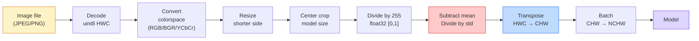
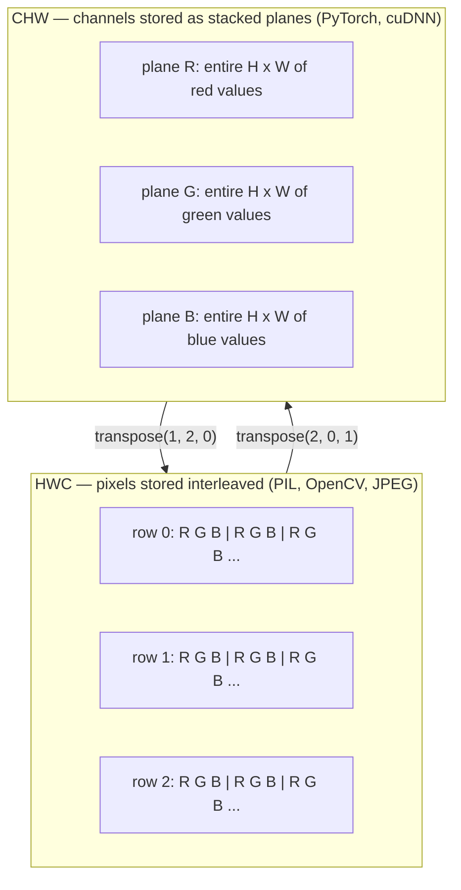

# Podstawy obrazów — piksele, kanały, przestrzenie kolorów

> Obraz to tensor próbek światła. Każdy model wizyjny, z którego kiedykolwiek skorzystasz, zaczyna się od tego jednego faktu.

**Typ:** Build
**Języki:** Python
**Wymagania wstępne:** Faza 1 Lekcja 12 (Operacje na tensorach), Faza 3 Lekcja 11 (Wprowadzenie do PyTorch)
**Czas:** ~45 minut

## Cele nauki

- Wyjaśnić, jak ciągła scena zostaje zdyskretyzowana na piksele i czemu decyzje dotyczące próbkowania/kwantyzacji wyznaczają górną granicę możliwości każdego modelu zbudowanego na tych danych
- Wczytywać, wycinać fragmenty i inspekcjonować obrazy jako tablice NumPy oraz swobodnie przełączać się między układami HWC i CHW
- Konwertować między RGB, skalą szarości, HSV i YCbCr oraz wyjaśnić, dlaczego każda z tych przestrzeni kolorów istnieje
- Stosować przetwarzanie wstępne na poziomie pikseli (normalizacja, standaryzacja, zmiana rozmiaru, channel-first) zgodnie z tym, czego oczekuje torchvision

## Problem

Każda praca naukowa, którą przeczytasz, każda wytrenowana waga, którą pobierzesz, każde API wizyjne, które wywołasz, zakłada konkretne kodowanie wejścia. Podaj obraz `uint8`, gdy model oczekuje `float32`, a on i tak zadziała — i po cichu wyprodukuje śmieci. Podaj BGR sieci wytrenowanej na RGB i dokładność spada o dziesięć punktów. Podaj modelowi dane w układzie channels-last, gdy oczekuje channels-first, a pierwsza warstwa konwolucyjna potraktuje wysokość jako kanał cech. Nic z tego nie zgłosi błędu. To po prostu psuje twoje metryki i spędzasz tydzień, szukając błędu, który tkwi w sposobie wczytania pliku.

Splot (convolution) nie jest skomplikowany, gdy już wiesz, po czym się przesuwa. Trudność polega na tym, że „obraz" oznacza coś innego dla kamery, dekodera JPEG, PIL, OpenCV, torchvision i jądra CUDA. Każdy z tych stosów ma własną kolejność osi, zakres bajtów i konwencję kanałów. Inżynier wizyjny, który nie odróżnia tych konwencji od siebie, wypuszcza zepsute pipeline'y.

Ta lekcja ustawia fundament, na którym może się oprzeć reszta fazy. Na końcu będziesz wiedzieć, czym jest piksel, czemu na piksel przypadają trzy liczby, a nie jedna, co naprawdę robi „normalizacja ze statystykami ImageNet" i jak przechodzić między dwoma lub trzema układami, które przyjmuje za pewnik każda inna lekcja w tej fazie.

## Koncepcja

### Cały pipeline przetwarzania wstępnego w skrócie

Każdy produkcyjny system wizyjny to ta sama sekwencja odwracalnych transformacji. Pomyl jeden krok i model widzi inne dane wejściowe niż te, na których był trenowany.



Dwa czerwone i niebieskie pola to miejsca, w których kryje się 80% niemych błędów: brak standaryzacji i niewłaściwy układ osi.

### Piksel to próbka, nie kwadrat

Sensor kamery zlicza fotony padające na siatkę maleńkich detektorów. Każdy detektor zbiera światło przez fragment sekundy i emituje napięcie proporcjonalne do liczby trafiających w niego fotonów. Sensor następnie dyskretyzuje to napięcie do liczby całkowitej. Jeden detektor staje się jednym pikselem.

```
Continuous scene                 Sensor grid                     Digital image
(infinite detail)                (H x W detectors)               (H x W integers)

    ~~~~~                        +--+--+--+--+--+                 210 198 180 155 120
   ~   ~   ~                     |  |  |  |  |  |                 205 195 178 152 118
  ~ light ~      ---->           +--+--+--+--+--+     ---->       200 190 175 150 115
   ~~~~~                         |  |  |  |  |  |                 195 185 170 148 112
                                 +--+--+--+--+--+                 188 180 165 145 108
```

Na tym etapie zapadają dwie decyzje, które wyznaczają górną granicę dla wszystkiego, co następuje:

- **Próbkowanie przestrzenne** decyduje, ile detektorów przypada na stopień kąta widzenia scenny. Za mało, i krawędzie stają się postrzępione (aliasing). Za wiele, i eksplodują wymagania pamięciowe i obliczeniowe.
- **Kwantyzacja intensywności** decyduje, jak drobno dzielone jest napięcie na przedziały. 8 bitów daje 256 poziomów i jest standardem dla wyświetlaczy. 10, 12, 16 bitów dają gładsze gradienty i mają znaczenie w obrazowaniu medycznym, HDR i pipeline'ach surowych danych z sensora (raw).

Piksel nie jest kolorowym kwadratem o powierzchni. To pojedynczy pomiar. Kiedy zmieniasz rozmiar obrazu lub go obracasz, ponownie próbkujesz tę siatkę pomiarów.

### Czemu trzy kanały

Jeden detektor zlicza fotony z całego widzialnego spektrum — to skala szarości. Aby uzyskać kolor, sensor pokrywa siatkę mozaiką filtrów czerwonych, zielonych i niebieskich. Po demozaikowaniu każde miejsce przestrzenne ma trzy liczby całkowite: odpowiedź pobliskiego detektora z filtrem czerwonym, zielonym i niebieskim. Te trzy liczby to trójka RGB piksela.

```
One pixel in memory:

    (R, G, B) = (210, 140, 30)   <- reddish-orange

An H x W RGB image:

    shape (H, W, 3)     stored as   H rows of W pixels of 3 values
                                    each in [0, 255] for uint8
```

Trzy to nie jest magiczna liczba. Kamery głębi dodają kanał Z. Satelity dodają pasma w podczerwieni i ultrafiolecie. Skany medyczne często mają jeden kanał (rentgen, CT) lub wiele (hiperspektralne). Liczba kanałów to ostatnia osia; warstwy konwolucyjne uczą się mieszać dane wzdłuż niej.

### Dwie konwencje układu: HWC i CHW

Ten sam tensor, dwa porządki. Każda biblioteka wybiera jeden.

```
HWC (height, width, channels)           CHW (channels, height, width)

   W ->                                    H ->
  +-----+-----+-----+                     +-----+-----+
H |R G B|R G B|R G B|                   C |R R R R R R|
| +-----+-----+-----+                   | +-----+-----+
v |R G B|R G B|R G B|                   v |G G G G G G|
  +-----+-----+-----+                     +-----+-----+
                                          |B B B B B B|
                                          +-----+-----+

   PIL, OpenCV, matplotlib,              PyTorch, most deep learning
   almost every image file on disk       frameworks, cuDNN kernels
```

CHW istnieje, ponieważ jądra splotu przesuwają się po osiach H i W. Trzymanie osi kanałów na początku oznacza, że każde jądro widzi spójną płaszczyznę 2D na kanał, co dobrze wektoryzuje obliczenia. Formaty na dysku zachowują HWC, bo to odpowiada sposobowi, w jaki linie skanowania wychodzą z sensora.

Konwersja jednolinijkowa, którą napiszesz tysiąc razy:

```
img_chw = img_hwc.transpose(2, 0, 1)      # NumPy
img_chw = img_hwc.permute(2, 0, 1)        # PyTorch tensor
```

Układ pamięci, zwizualizowany:



### Zakresy bajtów i typ danych

Dominują trzy konwencje:

| Konwencja | dtype | Zakres | Gdzie ją spotkasz |
|------------|-------|-------|------------------|
| Surowa (Raw) | `uint8` | [0, 255] | Pliki na dysku, PIL, wyjście OpenCV |
| Znormalizowana | `float32` | [0.0, 1.0] | Po `img.astype('float32') / 255` |
| Standaryzowana | `float32` | w przybliżeniu [-2, +2] | Po odjęciu średniej i podzieleniu przez odchylenie standardowe |

Sieci konwolucyjne były trenowane na danych standaryzowanych. Statystyki ImageNet `mean=[0.485, 0.456, 0.406]`, `std=[0.229, 0.224, 0.225]` to arytmetyczna średnia i odchylenie standardowe trzech kanałów obliczone na całym zbiorze treningowym ImageNet, na pikselach znormalizowanych do [0, 1]. Podanie surowego `uint8` do modelu, który oczekuje standaryzowanego float, to najczęstszy niemy błąd w praktycznej wizji komputerowej.

### Przestrzenie kolorów i dlaczego istnieją

RGB to format przechwytywania, ale nie zawsze jest najużyteczniejszą reprezentacją dla modelu.

```
 RGB               HSV                       YCbCr / YUV

 R red             H hue (angle 0-360)       Y luminance (brightness)
 G green           S saturation (0-1)        Cb chroma blue-yellow
 B blue            V value/brightness (0-1)  Cr chroma red-green

 Linear to         Separates color from      Separates brightness from
 sensor output     brightness. Useful for    color. JPEG and most video
                   color thresholding, UI    codecs compress the chroma
                   sliders, simple filters   channels harder because the
                                             human eye is less sensitive
                                             to chroma detail than to Y.
```

Dla większości nowoczesnych CNN podajesz RGB. Inne przestrzenie napotkasz przy:

- **HSV** — klasyczny kod CV, segmentacja na podstawie kolorów, balans bieli.
- **YCbCr** — odczyt wewnętrznej struktury JPEG, pipeline'y wideo, modele super-resolution operujące tylko na kanale Y.
- **Skala szarości** — OCR, modele dokumentów, każdy przypadek, gdzie kolor jest zmienną zakłócającą, a nie sygnałem.

Skala szarości z RGB to ważona suma, nie średnia, bo ludzkie oko jest bardziej czułe na zieleń niż na czerwień lub niebieski:

```
Y = 0.299 R + 0.587 G + 0.114 B       (ITU-R BT.601, the classic weights)
```

### Współczynnik proporcji, zmiana rozmiaru i interpolacja

Każdy model ma stały rozmiar wejścia (224x224 dla większości klasyfikatorów ImageNet, 384x384 lub 512x512 dla nowoczesnych detektorów). Twoje obrazy rzadko mu odpowiadają. Trzy istotne wybory dotyczące zmiany rozmiaru:

- **Zmiana rozmiaru krótszej strony, potem przycięcie centralne** — standardowa receptura ImageNet. Zachowuje współczynnik proporcji, odrzuca pas pikseli na krawędzi.
- **Zmiana rozmiaru z dopełnieniem (pad)** — zachowuje współczynnik proporcji i każdy piksel, dodaje czarne pasy. Standard dla detekcji i OCR.
- **Zmiana rozmiaru wprost do celu** — rozciąga obraz. Niskim kosztem, zniekształca geometrię, dla wielu zadań klasyfikacji jest to wystarczające.

Metoda interpolacji decyduje, jak są obliczane piksele pośrednie, gdy nowa siatka nie pokrywa się ze starą:

```
Nearest neighbour     fastest, blocky, only choice for masks/labels
Bilinear              fast, smooth, default for most image resizing
Bicubic               slower, sharper on upscaling
Lanczos               slowest, best quality, used for final display
```

Praktyczna zasada: bilinear do treningu, bicubic lub lanczos dla materiałów, na które będziesz patrzeć, nearest dla wszystkiego zawierającego całkowite identyfikatory klas.

## Zbuduj to

### Krok 1: Wczytaj obraz i zbadaj jego shape

Użyj Pillow, aby wczytać dowolny JPEG lub PNG, przekonwertować na NumPy i wypisać, co otrzymałeś. Dla deterministycznego przykładu działającego offline, wygeneruj go syntetycznie.

```python
import numpy as np
from PIL import Image

def synthetic_rgb(h=128, w=192, seed=0):
    rng = np.random.default_rng(seed)
    yy, xx = np.meshgrid(np.linspace(0, 1, h), np.linspace(0, 1, w), indexing="ij")
    r = (np.sin(xx * 6) * 0.5 + 0.5) * 255
    g = yy * 255
    b = (1 - yy) * xx * 255
    rgb = np.stack([r, g, b], axis=-1) + rng.normal(0, 6, (h, w, 3))
    return np.clip(rgb, 0, 255).astype(np.uint8)

arr = synthetic_rgb()
# Or load from disk:
# arr = np.asarray(Image.open("your_image.jpg").convert("RGB"))

print(f"type:   {type(arr).__name__}")
print(f"dtype:  {arr.dtype}")
print(f"shape:  {arr.shape}     # (H, W, C)")
print(f"min:    {arr.min()}")
print(f"max:    {arr.max()}")
print(f"pixel at (0, 0): {arr[0, 0]}")
```

Oczekiwany wynik: `shape: (H, W, 3)`, `dtype: uint8`, zakres `[0, 255]`. To kanoniczna reprezentacja na dysku, niezależnie od tego, czy bajty pochodzą z kamery, dekodera JPEG czy generatora syntetycznego.

### Krok 2: Rozdziel kanały i zmień układ osi

Wyodrębnij R, G, B osobno, a następnie przekonwertuj z HWC na CHW dla PyTorch.

```python
R = arr[:, :, 0]
G = arr[:, :, 1]
B = arr[:, :, 2]
print(f"R shape: {R.shape}, mean: {R.mean():.1f}")
print(f"G shape: {G.shape}, mean: {G.mean():.1f}")
print(f"B shape: {B.shape}, mean: {B.mean():.1f}")

arr_chw = arr.transpose(2, 0, 1)
print(f"\nHWC shape: {arr.shape}")
print(f"CHW shape: {arr_chw.shape}")
```

Trzy płaszczyzny w skali szarości, jedna na kanał. CHW po prostu zmienia porządek osi; kopiowanie danych nie jest ściśle wymagane, gdy układ pamięci to umożliwia.

### Krok 3: Konwersje do skali szarości i HSV

Skala szarości jako suma ważona, a następnie ręczna konwersja RGB-do-HSV.

```python
def rgb_to_grayscale(rgb):
    weights = np.array([0.299, 0.587, 0.114], dtype=np.float32)
    return (rgb.astype(np.float32) @ weights).astype(np.uint8)

def rgb_to_hsv(rgb):
    rgb_f = rgb.astype(np.float32) / 255.0
    r, g, b = rgb_f[..., 0], rgb_f[..., 1], rgb_f[..., 2]
    cmax = np.max(rgb_f, axis=-1)
    cmin = np.min(rgb_f, axis=-1)
    delta = cmax - cmin

    h = np.zeros_like(cmax)
    mask = delta > 0
    rmax = mask & (cmax == r)
    gmax = mask & (cmax == g)
    bmax = mask & (cmax == b)
    h[rmax] = ((g[rmax] - b[rmax]) / delta[rmax]) % 6
    h[gmax] = ((b[gmax] - r[gmax]) / delta[gmax]) + 2
    h[bmax] = ((r[bmax] - g[bmax]) / delta[bmax]) + 4
    h = h * 60.0

    s = np.where(cmax > 0, delta / cmax, 0)
    v = cmax
    return np.stack([h, s, v], axis=-1)

gray = rgb_to_grayscale(arr)
hsv = rgb_to_hsv(arr)
print(f"gray shape: {gray.shape}, range: [{gray.min()}, {gray.max()}]")
print(f"hsv   shape: {hsv.shape}")
print(f"hue range: [{hsv[..., 0].min():.1f}, {hsv[..., 0].max():.1f}] degrees")
print(f"sat range: [{hsv[..., 1].min():.2f}, {hsv[..., 1].max():.2f}]")
print(f"val range: [{hsv[..., 2].min():.2f}, {hsv[..., 2].max():.2f}]")
```

Hue wychodzi w stopniach, saturation i value w [0, 1]. To odpowiada konwencji OpenCV `hsv_full`.

### Krok 4: Normalizacja, standaryzacja i odwrócenie operacji

Przejdź od surowych bajtów do dokładnego tensora, jakiego oczekuje wytrenowany model ImageNet, a następnie z powrotem.

```python
mean = np.array([0.485, 0.456, 0.406], dtype=np.float32)
std = np.array([0.229, 0.224, 0.225], dtype=np.float32)

def preprocess_imagenet(rgb_uint8):
    x = rgb_uint8.astype(np.float32) / 255.0
    x = (x - mean) / std
    x = x.transpose(2, 0, 1)
    return x

def deprocess_imagenet(chw_float32):
    x = chw_float32.transpose(1, 2, 0)
    x = x * std + mean
    x = np.clip(x * 255.0, 0, 255).astype(np.uint8)
    return x

x = preprocess_imagenet(arr)
print(f"preprocessed shape: {x.shape}     # (C, H, W)")
print(f"preprocessed dtype: {x.dtype}")
print(f"preprocessed mean per channel:  {x.mean(axis=(1, 2)).round(3)}")
print(f"preprocessed std  per channel:  {x.std(axis=(1, 2)).round(3)}")

roundtrip = deprocess_imagenet(x)
max_diff = np.abs(roundtrip.astype(int) - arr.astype(int)).max()
print(f"roundtrip max pixel diff: {max_diff}    # should be 0 or 1")
```

Średnia dla każdego kanału powinna być bliska zeru, odchylenie standardowe bliskie jedności. Para preprocess/deprocess to dokładnie to, co robi pod maską każde wywołanie `transforms.Normalize` z torchvision.

### Krok 5: Zmiana rozmiaru za pomocą trzech metod interpolacji

Porównaj nearest, bilinear i bicubic na powiększeniu, aby różnica była widoczna.

```python
target = (arr.shape[0] * 3, arr.shape[1] * 3)

nearest = np.asarray(Image.fromarray(arr).resize(target[::-1], Image.NEAREST))
bilinear = np.asarray(Image.fromarray(arr).resize(target[::-1], Image.BILINEAR))
bicubic = np.asarray(Image.fromarray(arr).resize(target[::-1], Image.BICUBIC))

def local_roughness(x):
    gy = np.diff(x.astype(float), axis=0)
    gx = np.diff(x.astype(float), axis=1)
    return float(np.abs(gy).mean() + np.abs(gx).mean())

for name, out in [("nearest", nearest), ("bilinear", bilinear), ("bicubic", bicubic)]:
    print(f"{name:>8}  shape={out.shape}  roughness={local_roughness(out):6.2f}")
```

Nearest osiąga najwyższy wynik chropowatości, bo zachowuje ostre krawędzie. Bilinear jest najgładszy. Bicubic znajduje się pomiędzy, zachowując odczuwaną ostrość bez schodkowych artefaktów.

## Wykorzystaj to

`torchvision.transforms` zbiera wszystko powyższe w jeden składalny pipeline. Poniższy kod reprodukuje dokładnie to, co robi `preprocess_imagenet`, plus zmianę rozmiaru i przycięcie.

```python
import torch
from torchvision import transforms
from PIL import Image

img = Image.fromarray(synthetic_rgb(256, 256))

pipeline = transforms.Compose([
    transforms.Resize(256),
    transforms.CenterCrop(224),
    transforms.ToTensor(),
    transforms.Normalize(mean=[0.485, 0.456, 0.406], std=[0.229, 0.224, 0.225]),
])

x = pipeline(img)
print(f"tensor type:  {type(x).__name__}")
print(f"tensor dtype: {x.dtype}")
print(f"tensor shape: {tuple(x.shape)}      # (C, H, W)")
print(f"per-channel mean: {x.mean(dim=(1, 2)).tolist()}")
print(f"per-channel std:  {x.std(dim=(1, 2)).tolist()}")

batch = x.unsqueeze(0)
print(f"\nbatched shape: {tuple(batch.shape)}   # (N, C, H, W) — ready for a model")
```

Cztery kroki, w tej dokładnej kolejności: `Resize(256)` skaluje krótszą stronę do 256; `CenterCrop(224)` wycina fragment 224x224 ze środka; `ToTensor()` dzieli przez 255 i zamienia HWC na CHW; `Normalize` odejmuje średnią ImageNet i dzieli przez odchylenie standardowe. Odwrócenie tej kolejności po cichu zmienia to, co trafia do modelu.

## Wypchnij to

Ta lekcja tworzy:

- `outputs/prompt-vision-preprocessing-audit.md` — prompt, który zamienia kartę modelu lub kartę zbioru danych w listę kontrolną dokładnych inwariantów przetwarzania wstępnego, których musi przestrzegać zespół.
- `outputs/skill-image-tensor-inspector.md` — skill, który dla dowolnego tensora lub tablicy w kształcie obrazu zgłasza dtype, układ osi, zakres oraz to, czy dane wyglądają na surowe, znormalizowane czy standaryzowane.

## Zadania

1. **(Łatwe)** Wczytaj plik JPEG za pomocą OpenCV (`cv2.imread`) i za pomocą Pillow. Wypisz oba shape oraz piksel w `(0, 0)`. Wyjaśnij różnicę w kolejności kanałów, a następnie napisz jednolinijkową konwersję, która sprawi, że tablica z OpenCV będzie identyczna z tablicą z Pillow.
2. **(Średnie)** Napisz `standardize(img, mean, std)` i jej odwrotność, które razem przechodzą test `roundtrip_max_diff <= 1` na dowolnym obrazie uint8. Twoje funkcje muszą działać na pojedynczym obrazie w układzie HWC oraz na batchu w układzie NCHW przy tym samym wywołaniu.
3. **(Trudne)** Weź trzykanałowy tensor standaryzowany według ImageNet i przepuść go przez splot 1x1, który uczy się ważonej mieszanki RGB do jednego kanału skali szarości. Zainicjalizuj wagi jako `[0.299, 0.587, 0.114]`, zamroź je i zweryfikuj, że wynik zgadza się z twoją ręczną funkcją `rgb_to_grayscale` z dokładnością do błędu zmiennoprzecinkowego. Jakie inne klasyczne transformacje przestrzeni kolorów można zapisać jako splot 1x1?

## Kluczowe terminy

| Termin | Co się mówi | Co to naprawdę znaczy |
|------|----------------|----------------------|
| Piksel (Pixel) | „Kolorowy kwadrat" | Jedna próbka intensywności światła w jednym punkcie siatki — trzy liczby dla koloru, jedna dla skali szarości |
| Kanał (Channel) | „Kolor" | Jedna z równoległych siatek przestrzennych ułożonych w tensor obrazu; ostatnia osia w HWC, pierwsza w CHW |
| HWC / CHW | „Shape" | Porządki osi dla tensora obrazu; dysk i PIL używają HWC, PyTorch i cuDNN używają CHW |
| Normalizacja (Normalize) | „Przeskaluj obraz" | Podzielenie przez 255, aby piksele znalazły się w [0, 1] — konieczne, ale niewystarczające |
| Standaryzacja (Standardize) | „Wycentruj na zero" | Odjęcie średniej i podzielenie przez odchylenie standardowe dla każdego kanału, tak aby rozkład danych wejściowych odpowiadał temu, na czym trenowano model |
| Konwersja do skali szarości | „Uśrednij kanały" | Suma ważona o współczynnikach 0.299/0.587/0.114, odpowiadająca ludzkiej percepcji luminancji |
| Interpolacja | „Jak resize wybiera piksele" | Reguła decydująca o wartościach wyjściowych, gdy nowa siatka nie pokrywa się ze starą — nearest dla etykiet, bilinear do treningu, bicubic do wyświetlania |
| Współczynnik proporcji (Aspect ratio) | „Szerokość przez wysokość" | Stosunek odróżniający „resize i pad" od „resize i rozciągnięcie" |

## Dalsza lektura

- [Charles Poynton — A Guided Tour of Color Space](https://poynton.ca/PDFs/Guided_tour.pdf) — najprzejrzystsze techniczne opracowanie tego, czemu istnieje tak wiele przestrzeni kolorów i kiedy każda z nich ma znaczenie
- [PyTorch Vision Transforms Docs](https://pytorch.org/vision/stable/transforms.html) — pełny pipeline transformacji, które będziesz faktycznie składać w produkcji
- [How JPEG Works (Colt McAnlis)](https://www.youtube.com/watch?v=F1kYBnY6mwg) — przenikliwy wizualny przegląd subsamplingu chrominancji, DCT i tego, czemu JPEG koduje YCbCr, a nie RGB
- [ImageNet Preprocessing Conventions (torchvision models)](https://pytorch.org/vision/stable/models.html) — źródło prawdy dla `mean=[0.485, 0.456, 0.406]` i tego, czemu każdy model w zoo tego oczekuje
