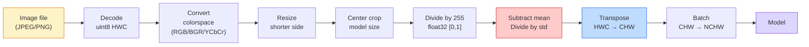
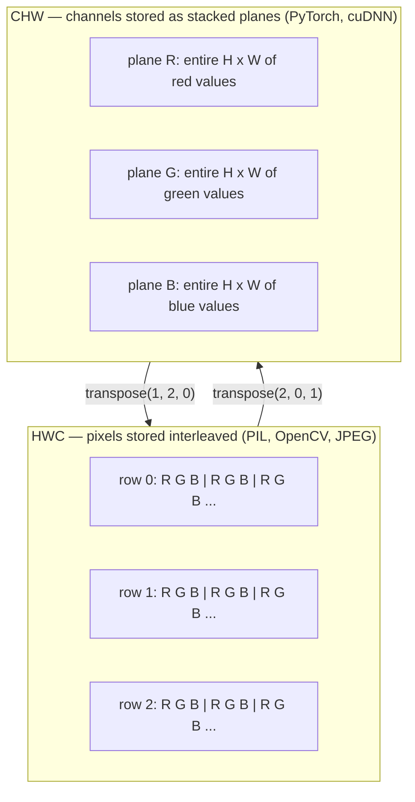

# Podstawy obrazu — piksele, kanały, przestrzenie kolorów

> Obraz jest tensorem próbek światła. Każdy model widzenia, jakiego kiedykolwiek będziesz używać, zaczyna się od tego jednego faktu.

**Typ:** Kompilacja
**Języki:** Python
**Wymagania wstępne:** Faza 1, lekcja 12 (Operacje tensorowe), Faza 3, lekcja 11 (Wprowadzenie do PyTorch)
**Czas:** ~45 minut

## Cele nauczania

- Wyjaśnij, w jaki sposób ciągła scena jest dyskretyzowana na piksele i dlaczego decyzje dotyczące próbkowania/kwantyzacji wyznaczają pułap dla każdego dalszego modelu
- Czytaj, wycinaj i sprawdzaj obrazy jako tablice NumPy i płynnie przełączaj się między układami HWC i CHW
- Konwertuj pomiędzy RGB, skalą szarości, HSV i YCbCr i uzasadnij, dlaczego istnieje każda przestrzeń kolorów
- Zastosuj przetwarzanie wstępne na poziomie pikseli (normalizacja, standaryzacja, zmiana rozmiaru, najpierw kanał) dokładnie tak, jak tego oczekuje Torchvision

## Problem

Każdy artykuł, który przeczytasz, każdy wstępnie wytrenowany ciężar, który pobierzesz, każdy interfejs API systemu wizyjnego, do którego zadzwonisz, zakłada określone kodowanie danych wejściowych. Przekaż obraz `uint8` tam, gdzie model chce `float32` i nadal będzie działał — i po cichu będzie generować śmieci. Podaj BGR do sieci wyszkolonej na RGB, a dokładność spadnie o dziesięć punktów. Podaj dane wejściowe modelu „ostatni kanał”, gdy oczekuje, że kanały będą „pierwsze”, a pierwsza warstwa konwersji traktuje wysokość jako kanał fabularny. Nic z tego nie powoduje błędu. To po prostu rujnuje Twoje dane i spędzasz tydzień na polowaniu na błąd związany ze sposobem załadowania pliku.

Splot nie jest skomplikowany, jeśli wiesz, po czym się przesuwa. Najtrudniejsze jest to, że „obraz” oznacza co innego niż kamera, dekoder JPEG, PIL, OpenCV, torchvision i jądro CUDA. Każdy stos ma swoją własną kolejność osi, zakres bajtów i konwencję kanałów. Inżynier wizjoner, który nie potrafi utrzymać uszkodzonych rurociągów na prostych statkach.

Ta lekcja stanowi podstawę, dzięki czemu można na niej budować resztę fazy. Na koniec będziesz wiedział, czym jest piksel, dlaczego na piksel przypadają trzy liczby zamiast jednej, do czego właściwie służy „normalizacja za pomocą statystyk ImageNet” i jak poruszać się pomiędzy dwoma lub trzema układami, które będą zakładane podczas każdej innej lekcji w tej fazie.

## Koncepcja

### Pełny potok przetwarzania wstępnego w skrócie

Każdy system wizji produkcji to ta sama sekwencja odwracalnych transformacji. Zrób jeden krok źle, a model zobaczy inne dane wejściowe niż ten, na którym był trenowany.



W dwóch czerwonych i niebieskich polach znajduje się 80% cichych awarii: brak standaryzacji i niewłaściwy układ.

### Piksel to próbka, a nie kwadrat

Czujnik kamery zlicza fotony, które lądują na siatce maleńkich detektorów. Każdy detektor integruje światło przez ułamek sekundy i emituje napięcie proporcjonalne do liczby trafionych fotonów. Następnie czujnik dyskretyzuje to napięcie na liczbę całkowitą. Jeden detektor staje się jednym pikselem.

```
Continuous scene                 Sensor grid                     Digital image
(infinite detail)                (H x W detectors)               (H x W integers)

    ~~~~~                        +--+--+--+--+--+                 210 198 180 155 120
   ~   ~   ~                     |  |  |  |  |  |                 205 195 178 152 118
  ~ light ~      ---->           +--+--+--+--+--+     ---->       200 190 175 150 115
   ~~~~~                         |  |  |  |  |  |                 195 185 170 148 112
                                 +--+--+--+--+--+                 188 180 165 145 108
```

Na tym etapie mają miejsce dwie możliwości i wiążą się one z mocowaniem sufitu na całej długości strumienia:

- **Próbkowanie przestrzenne** decyduje o liczbie detektorów na stopień sceny. Za mało i krawędzie stają się postrzępione (aliasing). Za dużo, a pamięć i obliczenia eksplodują.
- **Kwantyzacja intensywności** decyduje o tym, jak dokładnie podzielone jest napięcie. 8 bitów daje 256 poziomów i jest standardem do wyświetlania. 10, 12, 16 bitów zapewnia gładsze gradienty i materię w obrazowaniu medycznym, HDR i surowych rurociągach czujników.

Piksel nie jest kolorowym kwadratem z polem. Jest to pojedynczy pomiar. Zmiana rozmiaru lub obracanie powoduje ponowne próbkowanie siatki pomiarowej.

### Dlaczego trzy kanały

Jeden detektor zlicza fotony w całym widmie widzialnym, czyli w skali szarości. Aby uzyskać kolor, czujnik pokrywa siatkę mozaiką filtrów czerwonego, zielonego i niebieskiego. Po demozaice każda lokalizacja przestrzenna ma trzy liczby całkowite: odpowiedź detektora z filtrem czerwonym, filtrowana na zielono i pobliski filtr z filtrem niebieskim. Te trzy liczby całkowite to trójka RGB piksela.

```
One pixel in memory:

    (R, G, B) = (210, 140, 30)   <- reddish-orange

An H x W RGB image:

    shape (H, W, 3)     stored as   H rows of W pixels of 3 values
                                    each in [0, 255] for uint8
```

Trójka to nie magia. Kamery głębi dodają kanał Z. Satelity dodają pasma podczerwieni i ultrafioletu. Skany medyczne często mają jeden kanał (rentgen, tomografia komputerowa) lub wiele (hiperspektralny). Liczba kanałów to ostatnia oś; warstwy konw. uczą się w nich mieszać.

### Dwie konwencje układu: HWC i CHW

Ten sam tensor, dwa porządki. Każda biblioteka wybiera jedną.

```
HWC (height, width, channels)           CHW (channels, height, width)

   W ->                                    H ->
  +-----+-----+-----+                     +-----+-----+
H |R G B|R G B|R G B|                   C |R R R R R R|
| +-----+-----+-----+                   | +-----+-----+
v |R G B|R G B|R G B|                   v |G G G G G G|
  +-----+-----+-----+                     +-----+-----+
                                          |B B B B B B|
                                          +-----+-----+

   PIL, OpenCV, matplotlib,              PyTorch, most deep learning
   almost every image file on disk       frameworks, cuDNN kernels
```

CHW istnieje, ponieważ jądra splotu przesuwają się w poprzek H i W. Utrzymanie osi kanału na pierwszym miejscu oznacza, że każde jądro widzi ciągłą płaszczyznę 2D na kanał, co zapewnia czystą wektoryzację. Formaty dysków zachowują HWC, ponieważ odpowiada to sposobowi, w jaki linie skanowania wychodzą z czujnika.

Konwersja jednowierszowa, którą wpiszesz tysiąc razy:

```
img_chw = img_hwc.transpose(2, 0, 1)      # NumPy
img_chw = img_hwc.permute(2, 0, 1)        # PyTorch tensor
```

Układ pamięci, wizualizowany:



### Zakresy bajtów i typ

Dominują trzy konwencje:

| Konwencja | typ | Zakres | Gdzie to widzisz |
|------------|-------|------|--------------------------------|
| Surowe | `uint8` | [0, 255] | Pliki na dysku, PIL, wyjście OpenCV |
| Znormalizowany | `float32` | [0,0, 1,0] | Po `img.astype('float32') / 255` |
| standaryzowane | `float32` | mniej więcej [-2, +2] | Po odjęciu średniej i podzieleniu przez std |

Sieci splotowe trenowano na standardowych danych wejściowych. Statystyki ImageNet `mean=[0.485, 0.456, 0.406]`, `std=[0.229, 0.224, 0.225]` to średnia arytmetyczna i odchylenie standardowe trzech kanałów w pełnym zestawie szkoleniowym ImageNet, obliczone dla [0, 1] znormalizowanych pikseli. Wprowadzanie surowego `uint8` do modelu, który oczekuje standardowego pływania, jest najczęstszą cichą awarią w wizji stosowanej.

### Przestrzenie kolorów i dlaczego istnieją

RGB to format przechwytywania, ale nie zawsze jest to najbardziej użyteczna reprezentacja modelu.

```
 RGB               HSV                       YCbCr / YUV

 R red             H hue (angle 0-360)       Y luminance (brightness)
 G green           S saturation (0-1)        Cb chroma blue-yellow
 B blue            V value/brightness (0-1)  Cr chroma red-green

 Linear to         Separates color from      Separates brightness from
 sensor output     brightness. Useful for    color. JPEG and most video
                   color thresholding, UI    codecs compress the chroma
                   sliders, simple filters   channels harder because the
                                             human eye is less sensitive
                                             to chroma detail than to Y.
```

W przypadku większości nowoczesnych CNN zasilasz RGB. Spotykasz inne przestrzenie, gdy:

- **HSV** — klasyczny kod CV, segmentacja na podstawie kolorów, balans bieli.
- **YCbCr** — odczyt plików wewnętrznych JPEG, potoków wideo, modeli o super rozdzielczości, które działają tylko na Y.
- **Skala szarości** — OCR, modele dokumentów, wszędzie tam, gdzie kolor jest uciążliwą zmienną, a nie sygnałem.

Skala szarości z RGB to suma ważona, a nie średnia, ponieważ ludzkie oko jest bardziej wrażliwe na zieleń niż na czerwień czy błękit:

```
Y = 0.299 R + 0.587 G + 0.114 B       (ITU-R BT.601, the classic weights)
```

### Proporcje, zmiana rozmiaru i interpolacja

Każdy model ma stały rozmiar wejściowy (224x224 dla większości klasyfikatorów ImageNet, 384x384 lub 512x512 dla nowoczesnych detektorów). Twoje obrazy rzadko do siebie pasują. Trzy opcje zmiany rozmiaru, które mają znaczenie:

- **Zmień rozmiar krótszego boku, a następnie wyśrodkuj** — standardowy przepis ImageNet. Zachowuje proporcje, wyrzuca pasek pikseli krawędziowych.
- **Zmień rozmiar i uzupełnij** — zachowuje proporcje i każdy piksel, dodaje czarne paski. Standard wykrywania i OCR.
- **Zmień rozmiar bezpośrednio do celu** — rozciąga obraz. Tani, zniekształca geometrię, odpowiedni do wielu zadań klasyfikacyjnych.

Metoda interpolacji decyduje o sposobie obliczania pikseli pośrednich, gdy nowa siatka nie pokrywa się ze starą:

```
Nearest neighbour     fastest, blocky, only choice for masks/labels
Bilinear              fast, smooth, default for most image resizing
Bicubic               slower, sharper on upscaling
Lanczos               slowest, best quality, used for final display
```

Ogólna zasada: dwuliniowy do treningu, dwusześcienny lub lanczos do zasobów, na które będziesz patrzeć, najbliższy dla wszystkiego, co zawiera identyfikatory klas całkowitych.

## Zbuduj to

### Krok 1: Załaduj obraz i sprawdź jego kształt

Użyj Pillow, aby załadować dowolny plik JPEG lub PNG, przekonwertować na NumPy i wydrukować to, co masz. Aby uzyskać deterministyczny przykład działający w trybie offline, zsyntetyzuj jeden.

```python
import numpy as np
from PIL import Image

def synthetic_rgb(h=128, w=192, seed=0):
    rng = np.random.default_rng(seed)
    yy, xx = np.meshgrid(np.linspace(0, 1, h), np.linspace(0, 1, w), indexing="ij")
    r = (np.sin(xx * 6) * 0.5 + 0.5) * 255
    g = yy * 255
    b = (1 - yy) * xx * 255
    rgb = np.stack([r, g, b], axis=-1) + rng.normal(0, 6, (h, w, 3))
    return np.clip(rgb, 0, 255).astype(np.uint8)

arr = synthetic_rgb()
# Or load from disk:
# arr = np.asarray(Image.open("your_image.jpg").convert("RGB"))

print(f"type:   {type(arr).__name__}")
print(f"dtype:  {arr.dtype}")
print(f"shape:  {arr.shape}     # (H, W, C)")
print(f"min:    {arr.min()}")
print(f"max:    {arr.max()}")
print(f"pixel at (0, 0): {arr[0, 0]}")
```

Oczekiwany wynik: `shape: (H, W, 3)`, `dtype: uint8`, zakres `[0, 255]`. Jest to kanoniczna reprezentacja na dysku, niezależnie od tego, czy bajty pochodzą z kamery, dekodera JPEG, czy generatora syntetycznego.

### Krok 2: Podziel kanały i zmień układ

Wyciągnij osobno R, G, B, a następnie przekonwertuj z HWC na CHW dla PyTorch.

```python
R = arr[:, :, 0]
G = arr[:, :, 1]
B = arr[:, :, 2]
print(f"R shape: {R.shape}, mean: {R.mean():.1f}")
print(f"G shape: {G.shape}, mean: {G.mean():.1f}")
print(f"B shape: {B.shape}, mean: {B.mean():.1f}")

arr_chw = arr.transpose(2, 0, 1)
print(f"\nHWC shape: {arr.shape}")
print(f"CHW shape: {arr_chw.shape}")
```

Trzy płaszczyzny skali szarości, po jednej na kanał. CHW po prostu zmienia kolejność osi; kopiowanie danych nie jest ściśle wymagane, jeśli pozwala na to układ pamięci.

### Krok 3: Konwersja skali szarości i HSV

Skala szarości z sumą ważoną, a następnie ręczna zmiana RGB na HSV.

```python
def rgb_to_grayscale(rgb):
    weights = np.array([0.299, 0.587, 0.114], dtype=np.float32)
    return (rgb.astype(np.float32) @ weights).astype(np.uint8)

def rgb_to_hsv(rgb):
    rgb_f = rgb.astype(np.float32) / 255.0
    r, g, b = rgb_f[..., 0], rgb_f[..., 1], rgb_f[..., 2]
    cmax = np.max(rgb_f, axis=-1)
    cmin = np.min(rgb_f, axis=-1)
    delta = cmax - cmin

    h = np.zeros_like(cmax)
    mask = delta > 0
    rmax = mask & (cmax == r)
    gmax = mask & (cmax == g)
    bmax = mask & (cmax == b)
    h[rmax] = ((g[rmax] - b[rmax]) / delta[rmax]) % 6
    h[gmax] = ((b[gmax] - r[gmax]) / delta[gmax]) + 2
    h[bmax] = ((r[bmax] - g[bmax]) / delta[bmax]) + 4
    h = h * 60.0

    s = np.where(cmax > 0, delta / cmax, 0)
    v = cmax
    return np.stack([h, s, v], axis=-1)

gray = rgb_to_grayscale(arr)
hsv = rgb_to_hsv(arr)
print(f"gray shape: {gray.shape}, range: [{gray.min()}, {gray.max()}]")
print(f"hsv   shape: {hsv.shape}")
print(f"hue range: [{hsv[..., 0].min():.1f}, {hsv[..., 0].max():.1f}] degrees")
print(f"sat range: [{hsv[..., 1].min():.2f}, {hsv[..., 1].max():.2f}]")
print(f"val range: [{hsv[..., 2].min():.2f}, {hsv[..., 2].max():.2f}]")
```

Odcień jest podawany w stopniach, nasyceniu i wartości w [0, 1]. Jest to zgodne z konwencją OpenCV `hsv_full`.

### Krok 4: Normalizuj, standaryzuj i odwróć to

Przejdź od surowych bajtów do dokładnego tensora, jakiego oczekuje wstępnie wytrenowany model ImageNet, a następnie z powrotem.

```python
mean = np.array([0.485, 0.456, 0.406], dtype=np.float32)
std = np.array([0.229, 0.224, 0.225], dtype=np.float32)

def preprocess_imagenet(rgb_uint8):
    x = rgb_uint8.astype(np.float32) / 255.0
    x = (x - mean) / std
    x = x.transpose(2, 0, 1)
    return x

def deprocess_imagenet(chw_float32):
    x = chw_float32.transpose(1, 2, 0)
    x = x * std + mean
    x = np.clip(x * 255.0, 0, 255).astype(np.uint8)
    return x

x = preprocess_imagenet(arr)
print(f"preprocessed shape: {x.shape}     # (C, H, W)")
print(f"preprocessed dtype: {x.dtype}")
print(f"preprocessed mean per channel:  {x.mean(axis=(1, 2)).round(3)}")
print(f"preprocessed std  per channel:  {x.std(axis=(1, 2)).round(3)}")

roundtrip = deprocess_imagenet(x)
max_diff = np.abs(roundtrip.astype(int) - arr.astype(int)).max()
print(f"roundtrip max pixel diff: {max_diff}    # should be 0 or 1")
```

Średnia na kanał powinna być bliska zeru, standardowo bliska jedności. Para preprocess/deprocess jest dokładnie tym, co pod maską robi każde wywołanie Torchvision `transforms.Normalize`.

### Krok 5: Zmień rozmiar za pomocą trzech metod interpolacji

Porównaj najbliższe, dwuliniowe i dwusześcienne w wyższej skali, aby różnica była widoczna.

```python
target = (arr.shape[0] * 3, arr.shape[1] * 3)

nearest = np.asarray(Image.fromarray(arr).resize(target[::-1], Image.NEAREST))
bilinear = np.asarray(Image.fromarray(arr).resize(target[::-1], Image.BILINEAR))
bicubic = np.asarray(Image.fromarray(arr).resize(target[::-1], Image.BICUBIC))

def local_roughness(x):
    gy = np.diff(x.astype(float), axis=0)
    gx = np.diff(x.astype(float), axis=1)
    return float(np.abs(gy).mean() + np.abs(gx).mean())

for name, out in [("nearest", nearest), ("bilinear", bilinear), ("bicubic", bicubic)]:
    print(f"{name:>8}  shape={out.shape}  roughness={local_roughness(out):6.2f}")
```

Nearest osiąga najwyższe wyniki w zakresie chropowatości, ponieważ utrzymuje twarde krawędzie. Dwuliniowy jest najpłynniejszy. Bicubic znajduje się pomiędzy, zachowując postrzeganą ostrość bez artefaktów na schodach.

## Użyj tego

`torchvision.transforms` łączy wszystko powyżej w jeden możliwy do komponowania potok. Poniższy kod dokładnie odtwarza to, co robi `preprocess_imagenet`, a także zmienia rozmiar i przycina.

```python
import torch
from torchvision import transforms
from PIL import Image

img = Image.fromarray(synthetic_rgb(256, 256))

pipeline = transforms.Compose([
    transforms.Resize(256),
    transforms.CenterCrop(224),
    transforms.ToTensor(),
    transforms.Normalize(mean=[0.485, 0.456, 0.406], std=[0.229, 0.224, 0.225]),
])

x = pipeline(img)
print(f"tensor type:  {type(x).__name__}")
print(f"tensor dtype: {x.dtype}")
print(f"tensor shape: {tuple(x.shape)}      # (C, H, W)")
print(f"per-channel mean: {x.mean(dim=(1, 2)).tolist()}")
print(f"per-channel std:  {x.std(dim=(1, 2)).tolist()}")

batch = x.unsqueeze(0)
print(f"\nbatched shape: {tuple(batch.shape)}   # (N, C, H, W) — ready for a model")
```

Cztery kroki, w dokładnie tej kolejności: `Resize(256)` skaluje krótszy bok do 256; `CenterCrop(224)` pobiera łatkę o wymiarach 224x224 od środka; `ToTensor()` dzieli przez 255 i zamienia HWC na CHW; `Normalize` odejmuje średnią ImageNet i dzieli przez std. Odwrócenie tej kolejności powoduje cichą zmianę tego, co dociera do modelu.

## Wyślij to

Ta lekcja daje:

- `outputs/prompt-vision-preprocessing-audit.md` — podpowiedź, która zamienia dowolną kartę modelu lub kartę zbioru danych w listę kontrolną dokładnych niezmienników przetwarzania wstępnego, których zespół musi przestrzegać.
- `outputs/skill-image-tensor-inspector.md` — umiejętność, która, biorąc pod uwagę dowolny tensor lub tablicę w kształcie obrazu, raportuje typ, układ, zakres oraz to, czy wygląda surowo, znormalizowany czy ustandaryzowany.

## Ćwiczenia

1. **(Łatwy)** Załaduj plik JPEG za pomocą OpenCV (`cv2.imread`) i Pillow. Wydrukuj oba kształty i piksel w miejscu `(0, 0)`. Wyjaśnij różnicę w kolejności kanałów, a następnie napisz jednowierszową konwersję, która sprawi, że tablica OpenCV będzie identyczna z tablicą Pillow.
2. **(Medium)** Napisz `standardize(img, mean, std)` i jego odwrotność, które razem przejdą test `roundtrip_max_diff <= 1` na dowolnym obrazie uint8. Twoje funkcje muszą działać na pojedynczym obrazie w HWC i na partii w NCHW z tym samym wywołaniem.
3. **(Trudny)** Weź 3-kanałowy tensor standaryzowany przez ImageNet i przeprowadź go przez konwersję 1x1, która uczy się ważonej mieszanki RGB w pojedynczym kanale skali szarości. Zainicjuj wagi do `[0.299, 0.587, 0.114]`, zamroź je i sprawdź, czy dane wyjściowe odpowiadają instrukcji `rgb_to_grayscale` z dokładnością do błędu zmiennoprzecinkowego. Jakie inne klasyczne transformacje przestrzeni kolorów można zapisać jako sploty 1x1?

## Kluczowe terminy

| Termin | Co ludzie mówią | Co to właściwie oznacza |
|------|----------------|----------------------|
| Piksel | „Kolorowy kwadrat” | Jedna próbka natężenia światła w jednym miejscu siatki — trzy liczby dla koloru, jedna dla skali szarości |
| Kanał | „Kolor” | Jedna z równoległych siatek przestrzennych ułożonych w tensor obrazu; ostatnia oś w HWC, pierwsza w CHW |
| HWC / CHW | „Kształt” | Porządkowanie osi tensora obrazu; dysk i PIL używają HWC, PyTorch i cuDNN używają CHW |
| Normalizuj | „Skaluj obraz” | Podziel przez 255, aby piksele znajdowały się w [0, 1] — konieczne, ale niewystarczające |
| Standaryzacja | „Zero-centrum” | Odejmij średnią i podziel przez std na kanał, tak aby rozkład wejściowy odpowiadał temu, na czym uczono model |
| Konwersja skali szarości | „Uśrednij kanały” | Suma ważona o współczynnikach 0,299/0,587/0,114, która odpowiada ludzkiemu postrzeganiu luminancji |
| Interpolacja | „Jak zmiana rozmiaru wybiera piksele” | Reguła decydująca o wartościach wyjściowych, gdy nowa siatka nie pokrywa się ze starą — najbliższa dla etykiet, dwuliniowa dla uczenia, dwusześcienna dla wyświetlania |
| Proporcje | „Szerokość nad wysokością” | Współczynnik odróżniający „zmianę rozmiaru i uzupełnienie” od „zmiany rozmiaru i rozciągnięcie” |

## Dalsze czytanie

– [Charles Poynton — wycieczka z przewodnikiem po przestrzeni kolorów](https://poynton.ca/PDFs/Guided_tour.pdf) — najbardziej przejrzyste techniczne wyjaśnienie, dlaczego istnieje tak wiele przestrzeni kolorów i kiedy każda z nich ma znaczenie
– [Dokumentacja PyTorch Vision Transforms](https://pytorch.org/vision/stable/transforms.html) — pełny zestaw transformacji, które faktycznie skomponujesz w środowisku produkcyjnym
– [How JPEG Works (Colt McAnlis)](https://www.youtube.com/watch?v=F1kYBnY6mwg) – wyraźna wizualna prezentacja podpróbkowania chrominancji, DCT i tego, dlaczego JPEG koduje YCbCr zamiast RGB
– [Konwencje przetwarzania wstępnego ImageNet (modele Torchvision)](https://pytorch.org/vision/stable/models.html) — źródło prawdy o `mean=[0.485, 0.456, 0.406]` i dlaczego każdy model w zoo tego oczekuje