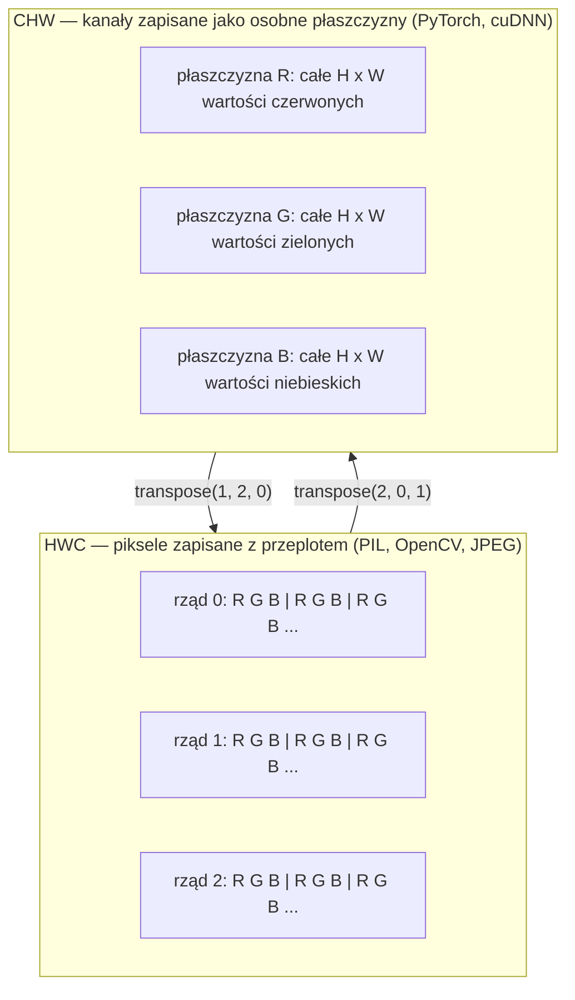

# Podstawy obrazu — piksele, kanały, przestrzenie barw

> Obraz to tensor próbek światła. Każdy model wizyjny, z którym kiedykolwiek będziesz pracować, opiera się na tym prostym fakcie.

**Typ:** Kompilacja
**Języki:** Python
**Wymagania wstępne:** Faza 1, lekcja 12 (Operacje tensorowe), Faza 3, lekcja 11 (Wprowadzenie do PyTorch)
**Czas:** ~45 minut

## Cele nauczania

- Wyjaśnienie, w jaki sposób ciągła scena jest dyskretyzowana na piksele i dlaczego decyzje dotyczące próbkowania oraz kwantyzacji wyznaczają ostateczny pułap możliwości każdego późniejszego modelu.
- Czytanie, kadrowanie i analizowanie obrazów jako tablic NumPy oraz swobodne przełączanie się między układami HWC i CHW.
- Konwersja między przestrzeniami RGB, skalą szarości, HSV oraz YCbCr i zrozumienie, dlaczego każda z nich istnieje.
- Stosowanie wstępnego przetwarzania na poziomie pikseli (normalizacja, standaryzacja, zmiana rozmiaru, układ "kanały na początku") dokładnie w sposób oczekiwany przez bibliotekę Torchvision.

## Problem

Każdy artykuł, który przeczytasz, każde pobrane wstępnie wytrenowane wagi i każde wywołane API systemu wizyjnego zakładają określone kodowanie danych wejściowych. Przekaż obraz w formacie `uint8` tam, gdzie model oczekuje `float32`, a nadal będzie on działał — ale po cichu wygeneruje bezużyteczne wyniki. Przekaż obraz w formacie BGR do sieci trenowanej na RGB, a jej dokładność spadnie o kilkadziesiąt procent. Podaj do modelu dane w formacie "kanały na końcu", gdy oczekuje układu "kanały na początku", a pierwsza warstwa splotowa potraktuje wysokość jako liczbę cech (kanałów). Żaden z tych błędów nie wyrzuci wyjątku w kodzie. Zrujnują one jedynie Twoje dane, przez co spędzisz tydzień na poszukiwaniu błędu, który okazał się niewłaściwym sposobem wczytania pliku.

Splot nie jest skomplikowany, pod warunkiem że wiesz, po czym dokładnie się porusza. Najtrudniejsze jest to, że termin "obraz" oznacza coś innego dla aparatu, dekodera JPEG, biblioteki PIL, OpenCV, torchvision oraz jądra CUDA. Każdy stos technologiczny ma własną kolejność osi, zakres wartości i konwencję kanałów. Inżynier systemów wizyjnych, który nie potrafi utrzymać integralności danych w prostych potokach przetwarzania, ma poważny problem.

Ta lekcja kładzie fundamenty, na których opierać się będzie reszta tego etapu nauki. Po jej ukończeniu będziesz wiedzieć, czym dokładnie jest piksel, dlaczego opisują go trzy liczby, a nie jedna, na czym w rzeczywistości polega "normalizacja przy użyciu statystyk ImageNet" oraz jak sprawnie przechodzić między układami wymiarów, których będą wymagały od Ciebie inne lekcje w tej fazie.

## Koncepcja

### Pełny potok przetwarzania wstępnego w skrócie

Każdy produkcyjny system wizyjny to sekwencja takich samych, odwracalnych transformacji. Wystarczy jeden błędny krok, a model otrzyma inne dane wejściowe niż te, na których był trenowany.

```mermaid
flowchart LR
    A["Plik obrazu<br/>(JPEG/PNG)"] --> B["Dekodowanie<br/>uint8 HWC"]
    B --> C["Konwersja<br/>przestrzeni barw<br/>(RGB/BGR/YCbCr)"]
    C --> D["Zmiana rozmiaru<br/>krótszego boku"]
    D --> E["Centralne kadrowanie<br/>rozmiar modelu"]
    E --> F["Podział przez 255<br/>float32 [0,1]"]
    F --> G["Odjęcie średniej<br/>Podział przez std"]
    G --> H["Transpozycja<br/>HWC → CHW"]
    H --> I["Batching<br/>CHW → NCHW"]
    I --> J["Model"]

    style A fill:#fef3c7,stroke:#d97706
    style J fill:#ddd6fe,stroke:#7c3aed
    style G fill:#fecaca,stroke:#dc2626
    style H fill:#bfdbfe,stroke:#2563eb
```



W czerwonych i niebieskich polach kryje się 80% cichych błędów: brak odpowiedniej standaryzacji oraz niewłaściwy układ osi.

### Piksel to próbka, a nie kwadrat

Matryca aparatu zlicza fotony padające na siatkę mikroskopijnych detektorów. Każdy z nich rejestruje światło przez ułamek sekundy i emituje napięcie proporcjonalne do liczby przechwyconych fotonów. Następnie czujnik dyskretyzuje to napięcie, zamieniając je na liczbę całkowitą. Jeden detektor odpowiada jednemu pikselowi.

```
Ciągła scena                     Siatka czujnika                   Obraz cyfrowy
(nieskończona szczegółowość)     (H x W detektorów)                (H x W liczb całkowitych)

    ~~~~~                        +--+--+--+--+--+                 210 198 180 155 120
   ~   ~   ~                     |  |  |  |  |  |                 205 195 178 152 118
  ~ światło ~    ---->           +--+--+--+--+--+     ---->       200 190 175 150 115
   ~~~~~                         |  |  |  |  |  |                 195 185 170 148 112
                                 +--+--+--+--+--+                 188 180 165 145 108
```

Na tym etapie podejmuje się dwie kluczowe decyzje, które na stałe określają górną granicę możliwości systemu:

- **Próbkowanie przestrzenne** decyduje o liczbie detektorów na dany obszar sceny. Jeśli jest ich za mało, krawędzie stają się poszarpane (zjawisko aliasingu). Zbyt duża ich liczba powoduje drastyczny wzrost zapotrzebowania na pamięć i moc obliczeniową.
- **Kwantyzacja intensywności** określa, z jaką precyzją mierzone jest napięcie. Rozdzielczość 8-bitowa daje 256 poziomów i jest standardem w wyświetlaczach. Rozdzielczości 10, 12, a nawet 16 bitów zapewniają gładsze gradienty, co ma ogromne znaczenie w obrazowaniu medycznym, technologii HDR oraz przy przetwarzaniu plików RAW.

Piksel to nie jest po prostu pokolorowany kwadracik. To pojedynczy pomiar. Zmiana rozmiaru lub obrót obrazu polega na ponownym próbkowaniu (resamplingu) tej siatki pomiarów.

### Dlaczego istnieją trzy kanały?

Pojedynczy detektor zlicza fotony w całym paśmie światła widzialnego, co daje obraz w skali szarości. Aby uzyskać kolor, matrycę pokrywa się mozaiką filtrów: czerwonych, zielonych i niebieskich (filtr Bayera). Po procesie demozaikowania (interpolacji) każdemu punktowi w przestrzeni przyporządkowane są trzy liczby całkowite: wynik z filtra czerwonego, z zielonego oraz z pobliskiego filtra niebieskiego. Te trzy wartości tworzą piksel RGB.

```
Jeden piksel w pamięci:

    (R, G, B) = (210, 140, 30)   <- czerwono-pomarańczowy

Obraz RGB o wymiarach H x W:

    Kształt (H, W, 3)     zapisany jako:   H rzędów pikseli W o 3 wartościach
                                           każda z przedziału [0, 255] dla typu uint8
```

Trójka RGB nie jest regułą uniwersalną. Kamery głębi dodają kanał Z. Satelity wyposażone są w pasma podczerwone i ultrafioletowe. Skany medyczne często posiadają tylko jeden kanał (rentgen, tomografia komputerowa) lub wiele kanałów (obrazowanie hiperspektralne). Liczba kanałów to po prostu ostatnia oś tensora; warstwy splotowe uczą się, jak mieszać i interpretować zawarte w nich informacje.

### Dwie konwencje układu: HWC i CHW

Ten sam tensor, dwie różne kolejności wymiarów. Każda biblioteka preferuje jedną z nich.

```
HWC (wysokość, szerokość, kanały)       CHW (kanały, wysokość, szerokość)

   W ->                                    H ->
  +-----+-----+-----+                     +-----+-----+
H |R G B|R G B|R G B|                   C |R R R R R R|
| +-----+-----+-----+                   | +-----+-----+
v |R G B|R G B|R G B|                   v |G G G G G G|
  +-----+-----+-----+                     +-----+-----+
                                          |B B B B B B|
                                          +-----+-----+

   PIL, OpenCV, matplotlib,              PyTorch, większość frameworków 
   niemal każdy plik na dysku            Deep Learning, jądra cuDNN
```

Układ CHW istnieje, ponieważ jądra splotowe przemieszczają się po osiach H i W. Umieszczenie osi kanałów na początku sprawia, że każde jądro ma do dyspozycji ciągłą płaszczyznę 2D dla każdego kanału, co umożliwia optymalną wektoryzację obliczeń. Formaty zapisu na dysku (JPEG, PNG) stosują układ HWC, co odpowiada sekwencji pikseli skanowanych z matrycy aparatu.

Oto jednolinijkowa konwersja, której będziesz używać bezustannie:

```python
img_chw = img_hwc.transpose(2, 0, 1)      # NumPy
img_chw = img_hwc.permute(2, 0, 1)        # PyTorch tensor
```

Wizualizacja układu pamięci:



### Typy danych i zakresy wartości

Wyróżniamy trzy główne konwencje:

| Konwencja | Typ | Zakres | Gdzie występuje |
|------------|-------|------|--------------------------------|
| Surowa | `uint8` | [0, 255] | Pliki na dysku, PIL, wyjście z OpenCV |
| Znormalizowana | `float32` | [0.0, 1.0] | Po zastosowaniu `img.astype('float32') / 255` |
| Ustandaryzowana | `float32` | Mniej więcej [-2, +2] | Po odjęciu średniej i podzieleniu przez odchylenie standardowe |

Konwolucyjne sieci neuronowe (CNN) są najczęściej trenowane na ustandaryzowanych danych wejściowych. Statystyki z zestawu ImageNet — `mean=[0.485, 0.456, 0.406]` oraz `std=[0.229, 0.224, 0.225]` — to po prostu średnia arytmetyczna i odchylenie standardowe każdego kanału dla całego zbioru treningowego, obliczone na znormalizowanych pikselach z przedziału [0, 1]. Przekazanie surowego obrazu `uint8` do modelu, który oczekuje standaryzowanych danych `float32`, jest najczęstszą przyczyną cichych awarii w systemach wizyjnych.

### Przestrzenie barw i powody ich stosowania

RGB to naturalny format rejestracji obrazu, ale nie zawsze jest on najbardziej użyteczny dla modeli uczenia maszynowego.

```
 RGB               HSV                       YCbCr / YUV

 R czerwony        H odcień (kąt 0-360)      Y luminancja (jasność)
 G zielony         S nasycenie (0-1)         Cb chrominancja żółto-niebieska
 B niebieski       V jasność/wartość (0-1)   Cr chrominancja czerwono-zielona

 Naturalny format  Oddziela kolor od         Oddziela jasność od koloru. 
 zapisu czujnika.  jasności. Przydatne do    JPEG i większość kodeków wideo 
                   progowania kolorów,       silniej kompresują kanały barwy,
                   suwaków interfejsu i      ponieważ oko ludzkie jest mniej 
                   prostych filtrów.         wrażliwe na szczegóły koloru 
                                             niż na samą jasność (Y).
```

Do większości współczesnych sieci CNN podaje się po prostu wejście RGB. Z innymi przestrzeniami barw spotkasz się w przypadku:

- **HSV** — Klasycznych algorytmów wizji komputerowej, segmentacji kolorów i korekcji balansu bieli.
- **YCbCr** — Wewnętrznego dekodowania formatu JPEG, potoków wideo oraz modeli super-rozdzielczości, które operują wyłącznie na kanale jasności (Y).
- **Skali szarości** — OCR (rozpoznawanie tekstu), przetwarzania dokumentów oraz wszędzie tam, gdzie kolor stanowi jedynie zbędny szum zamiast informacji.

Skala szarości to średnia ważona, a nie zwykła średnia kanałów RGB. Wynika to z faktu, że ludzkie oko jest znacznie bardziej wrażliwe na kolor zielony niż czerwony czy niebieski:

```
Y = 0.299 * R + 0.587 * G + 0.114 * B       (Zalecenie ITU-R BT.601, klasyczne wagi)
```

### Proporcje, zmiana rozmiaru i interpolacja

Każdy model oczekuje wejścia o stałym rozmiarze (zazwyczaj 224x224 dla klasyfikatorów ImageNet, 384x384 lub 512x512 dla współczesnych modeli detekcji). Twoje dane rzadko odpowiadają temu rozmiarowi. Istnieją trzy główne metody rozwiązania tego problemu:

- **Zmiana rozmiaru z zachowaniem proporcji i centralne kadrowanie** — Standardowe rozwiązanie dla modeli ImageNet. Zachowuje proporcje, ale ucina marginesy obrazu.
- **Zmiana rozmiaru z dopełnieniem (padding)** — Zachowuje proporcje i cały obraz, wypełniając puste przestrzenie czarnymi pasami (letterboxing). Powszechnie stosowane w detekcji obiektów i systemach OCR.
- **Bezpośrednie skalowanie (rozciąganie)** — Modyfikuje obraz zniekształcając jego geometrię, ale jest tanie obliczeniowo i wystarczające dla niektórych zadań klasyfikacyjnych.

Metoda interpolacji określa w jaki sposób wyliczane są wartości pikseli podczas zmiany wymiarów siatki:

```
Najbliższy sąsiad (Nearest)  Najszybsza, pikselowa, używana wyłącznie dla masek i etykiet
Dwuliniowa (Bilinear)        Szybka, gładka, domyślna do większości zastosowań zmiany rozmiaru
Dwusześcienna (Bicubic)      Wolniejsza, oferuje ostrzejsze obrazy przy powiększaniu
Lanczos                      Najwolniejsza, najwyższa jakość, zazwyczaj używana przy wyświetlaniu
```

Złota zasada: stosuj interpolację dwuliniową (`bilinear`) podczas treningu modelu, dwusześcienną (`bicubic`) lub `lanczos` dla obrazów dla użytkowników końcowych, oraz najbliższego sąsiada (`nearest`) w przypadku modyfikowania masek lub segmentacji zawierających klasy w formacie całkowitoliczbowym.

## Zbuduj to

### Krok 1: Wczytaj obraz i sprawdź jego kształt

Użyj biblioteki Pillow, aby wczytać plik JPEG lub PNG, przekonwertuj go na macierz NumPy i wyświetl informacje. Poniższy kod syntetyzuje obraz testowy, aby uruchamiał się deterministycznie i bez dostępu do sieci.

```python
import numpy as np
from PIL import Image

def synthetic_rgb(h=128, w=192, seed=0):
    rng = np.random.default_rng(seed)
    yy, xx = np.meshgrid(np.linspace(0, 1, h), np.linspace(0, 1, w), indexing="ij")
    r = (np.sin(xx * 6) * 0.5 + 0.5) * 255
    g = yy * 255
    b = (1 - yy) * xx * 255
    rgb = np.stack([r, g, b], axis=-1) + rng.normal(0, 6, (h, w, 3))
    return np.clip(rgb, 0, 255).astype(np.uint8)

arr = synthetic_rgb()
# Aby załadować obraz z dysku:
# arr = np.asarray(Image.open("twoj_obraz.jpg").convert("RGB"))

print(f"Typ:   {type(arr).__name__}")
print(f"Dtype: {arr.dtype}")
print(f"Kształt: {arr.shape}     # (H, W, C)")
print(f"Min:     {arr.min()}")
print(f"Max:     {arr.max()}")
print(f"Piksel w punkcie (0, 0): {arr[0, 0]}")
```

Spodziewany wynik: kształt `(H, W, 3)`, typ danych `uint8`, przedział `[0, 255]`. Jest to standardowa reprezentacja obrazu w pamięci, niezależnie od tego czy dane pochodzą bezpośrednio z aparatu, dekodera JPEG czy syntezatora obrazów.

### Krok 2: Rozdziel kanały i zmień układ

Wyodrębnij kanały R, G i B osobno, a następnie dokonaj konwersji układu HWC na CHW zgodnego z wymogami PyTorch.

```python
R = arr[:, :, 0]
G = arr[:, :, 1]
B = arr[:, :, 2]
print(f"Kształt R: {R.shape}, średnia: {R.mean():.1f}")
print(f"Kształt G: {G.shape}, średnia: {G.mean():.1f}")
print(f"Kształt B: {B.shape}, średnia: {B.mean():.1f}")

arr_chw = arr.transpose(2, 0, 1)
print(f"\nKształt HWC: {arr.shape}")
print(f"Kształt CHW: {arr_chw.shape}")
```

Wynikiem będą trzy płaszczyzny w skali szarości. Układ CHW zaledwie rearanżuje osie tensora; rzeczywiste kopiowanie pamięci często nie jest konieczne, jeśli jej ułożenie na to pozwala.

### Krok 3: Konwersja do skali szarości i HSV

Przetransformuj obraz do skali szarości przy użyciu sumy ważonej, a następnie ręcznie wylicz przekształcenie RGB na format HSV.

```python
def rgb_to_grayscale(rgb):
    weights = np.array([0.299, 0.587, 0.114], dtype=np.float32)
    return (rgb.astype(np.float32) @ weights).astype(np.uint8)

def rgb_to_hsv(rgb):
    rgb_f = rgb.astype(np.float32) / 255.0
    r, g, b = rgb_f[..., 0], rgb_f[..., 1], rgb_f[..., 2]
    cmax = np.max(rgb_f, axis=-1)
    cmin = np.min(rgb_f, axis=-1)
    delta = cmax - cmin

    h = np.zeros_like(cmax)
    mask = delta > 0
    rmax = mask & (cmax == r)
    gmax = mask & (cmax == g)
    bmax = mask & (cmax == b)
    h[rmax] = ((g[rmax] - b[rmax]) / delta[rmax]) % 6
    h[gmax] = ((b[gmax] - r[gmax]) / delta[gmax]) + 2
    h[bmax] = ((r[bmax] - g[bmax]) / delta[bmax]) + 4
    h = h * 60.0

    s = np.where(cmax > 0, delta / cmax, 0)
    v = cmax
    return np.stack([h, s, v], axis=-1)

gray = rgb_to_grayscale(arr)
hsv = rgb_to_hsv(arr)
print(f"Kształt gray: {gray.shape}, przedział: [{gray.min()}, {gray.max()}]")
print(f"Kształt HSV:  {hsv.shape}")
print(f"Przedział odcienia (hue): [{hsv[..., 0].min():.1f}, {hsv[..., 0].max():.1f}] stopni")
print(f"Przedział nasycenia (sat):[{hsv[..., 1].min():.2f}, {hsv[..., 1].max():.2f}]")
print(f"Przedział wartości (val): [{hsv[..., 2].min():.2f}, {hsv[..., 2].max():.2f}]")
```

Odcień wyliczany jest w stopniach, natomiast wartości nasycenia i jasności znormalizowane są do przedziału `[0, 1]`. Taka implementacja pokrywa się z wynikami uzyskiwanymi z konwencji OpenCV `hsv_full`.

### Krok 4: Normalizacja, standaryzacja i powrót

Zmień format pliku od surowych bajtów do dokładnie ustrukturyzowanego tensora jakiego oczekiwałby model sieci ImageNet, a następnie wykonaj proces odwrotny.

```python
mean = np.array([0.485, 0.456, 0.406], dtype=np.float32)
std = np.array([0.229, 0.224, 0.225], dtype=np.float32)

def preprocess_imagenet(rgb_uint8):
    x = rgb_uint8.astype(np.float32) / 255.0
    x = (x - mean) / std
    x = x.transpose(2, 0, 1)
    return x

def deprocess_imagenet(chw_float32):
    x = chw_float32.transpose(1, 2, 0)
    x = x * std + mean
    x = np.clip(x * 255.0, 0, 255).astype(np.uint8)
    return x

x = preprocess_imagenet(arr)
print(f"Kształt po przetworzeniu: {x.shape}     # (C, H, W)")
print(f"Typ danych (dtype):       {x.dtype}")
print(f"Średnia na kanał:         {x.mean(axis=(1, 2)).round(3)}")
print(f"Odchylenie na kanał:      {x.std(axis=(1, 2)).round(3)}")

roundtrip = deprocess_imagenet(x)
max_diff = np.abs(roundtrip.astype(int) - arr.astype(int)).max()
print(f"Maksymalna różnica pikseli po powrocie: {max_diff}    # powinno być 0 lub 1")
```

Średnia na każdym kanale powinna być zbliżona do zera, a odchylenie standardowe bliskie wartości `1`. Para funkcji *preprocess/deprocess* to dokładny odpowiednik tego co dzieje się za kulisami w kodzie Torchvision (metoda `transforms.Normalize`).

### Krok 5: Zmiana rozmiaru i interpolacja

Porównaj interpolację nabliższego sąsiada (nearest), dwuliniową (bilinear) oraz dwusześcienną (bicubic) przy powiększaniu obrazu, w celu unaocznienia różnic.

```python
target = (arr.shape[0] * 3, arr.shape[1] * 3)

nearest = np.asarray(Image.fromarray(arr).resize(target[::-1], Image.NEAREST))
bilinear = np.asarray(Image.fromarray(arr).resize(target[::-1], Image.BILINEAR))
bicubic = np.asarray(Image.fromarray(arr).resize(target[::-1], Image.BICUBIC))

def local_roughness(x):
    gy = np.diff(x.astype(float), axis=0)
    gx = np.diff(x.astype(float), axis=1)
    return float(np.abs(gy).mean() + np.abs(gx).mean())

for name, out in [("nearest", nearest), ("bilinear", bilinear), ("bicubic", bicubic)]:
    print(f"{name:>8}  kształt={out.shape}  szorstkość={local_roughness(out):6.2f}")
```

Interpolacja `nearest` generuje wyższe poziomy "szorstkości" z uwagi na ostre krawędzie. Najbardziej łagodne efekty daje filtr `bilinear`. Natomiast `bicubic` znajduje złoty środek zachowując ostrość detali bez efektu schodków (aliasingu).

## Jak z tego korzystać?

`torchvision.transforms` zbiera i grupuje wszystkie wyżej opisane etapy w spójny rurociąg (potok). Poniższy kod całkowicie powiela wcześniejsze zaimplementowanie `preprocess_imagenet`, rozszerzając je dodatkowo o skalowanie i przycinanie.

```python
import torch
from torchvision import transforms
from PIL import Image

img = Image.fromarray(synthetic_rgb(256, 256))

pipeline = transforms.Compose([
    transforms.Resize(256),
    transforms.CenterCrop(224),
    transforms.ToTensor(),
    transforms.Normalize(mean=[0.485, 0.456, 0.406], std=[0.229, 0.224, 0.225]),
])

x = pipeline(img)
print(f"Typ tensora:  {type(x).__name__}")
print(f"Dtype tensora: {x.dtype}")
print(f"Kształt:       {tuple(x.shape)}      # (C, H, W)")
print(f"Średnia na kanał: {x.mean(dim=(1, 2)).tolist()}")
print(f"Odchylenie na kanał:  {x.std(dim=(1, 2)).tolist()}")

batch = x.unsqueeze(0)
print(f"\nKształt partii (batch): {tuple(batch.shape)}   # (N, C, H, W) — gotowe dla modelu")
```

Cztery etapy odtwarzane zawsze w tym samym porządku: `Resize(256)` skaluje krótszą krawędź na wymiar 256; `CenterCrop(224)` pobiera odpowiednią próbkę 224x224 z centrum obszaru; `ToTensor()` dzieli otrzymane wartości przez 255 oraz ulega modyfikacji HWC do CHW; Na samym końcu `Normalize` oblicza odjęcie średniej zbioru ImageNet oraz podzielenie danych przez jego odchylenie standardowe. Zmiana sekwencji któregokolwiek z powyższych poleceń prowadzi bezpośrednio do milczącego błędu.

## Wyślij to

Po tej lekcji uzyskasz:

- `outputs/prompt-vision-preprocessing-audit.md` — Prompt pozwalający zamienić dowolną dokumentację czy kartę modelu w dedykowaną listę niezbędnych weryfikacji warunków wstępnych w potokach modelu widzenia.
- `outputs/skill-image-tensor-inspector.md` — Skrypt / gotową funkcję pozwalającą w dowolnym momencie wylistować typ, układ i zakres dowolnego tensora w kontekście tego, czy są to dane znormalizowane czy odpowiednio zstandaryzowane.

## Ćwiczenia

1. **(Łatwy)** Wczytaj JPEG stosując zarówno OpenCV (`cv2.imread`) jak i bibliotekę Pillow. Wylistuj oba wymiary oraz pobierz pixel znajdujący się pod `(0, 0)`. Zweryfikuj i uzasadnij w jaki sposób następuje rearanżacja barw, po czym dokonaj transformacji struktury generowanej w bibliotece OpenCV za pomocą pojedynczej formuły na odpowiednik natywny dla Pillow.
2. **(Średni)** Napisz funkcję `standardize(img, mean, std)` oraz odpowiadającą jej odwrotność. Twoje środowisko powinno potwierdzić działanie przechodząc z wynikiem testu `roundtrip_max_diff <= 1` przy wejściu formatu `uint8`. Twój kod powinen działać spójnie podczas wywołania zarówno na pojedynczym pliku `HWC`, jak i pakiecie wsadowym `NCHW`.
3. **(Trudny)** Weź ustandaryzowany za pomocą ImageNet tensor (3 kanały) i wkomponuj go w warstwę konwolucji wymiaru `1x1` która adaptuje proces odszukiwania właściwej średniej uśrednionego kanału szarości. Skompiluj startowe wartości wektora `[0.299, 0.587, 0.114]`, zamroź ich wagę i upewnij się czy model odpowiada wariantowi manualnego wykorzystywania narzędzia z `rgb_to_grayscale` tolerując zmiennoprzecinkowe defekty z dokładnością konwersji do wyliczonego zapisu. Wskazówka: Jakie inne matryce transformacji kolorów da się zastosować pod postacią operacji macierzowej filtru splotowego 1x1?

## Kluczowe pojęcia

| Termin | Co ludzie mówią | Co to właściwie oznacza |
|------|----------------|----------------------|
| Piksel | „Kolorowy kwadrat” | Jedna próbka pomiaru natężenia fal światła na połączonej matrycy – standardowo to odpowiednio połączony ciąg trzech liczb w przypadku koloru, i jeden wskaźnik wartości szarości |
| Kanał | „Kolor” | Pojedyncza, ciągła w czasie struktura przestrzenna zapisana jako zintegrowany z obrazem tensor; na finiszu staje się ostatnią ze współrzędnych osi ujęcia HWC, jednakże zawsze dominuje jako początkowa oś w logice systemu CHW |
| HWC / CHW | „Kształt” | Ścisła kategoryzacja logiki przyporządkowania elementów wewnątrz zbiorów osi tensora; pamięć masowa i natywne rozwiązania wykorzystują głównie standard HWC, a frameworki Pytorch i akceleratory (np. cuDNN) operują na schemacie strukturalnym CHW |
| Normalizacja | „Skalowanie obrazu” | Rozdzielenie wartości wejściowych matrycy poprzez ułamek podzielny wielkości `255`, uzyskując optymalny wektor przedziałów w przestrzeni wartości domkniętych `[0, 1]` |
| Standaryzacja | „Ośrodkowanie zera” | Średnia pomniejszająca na bazowych liczbach oddzielonego wektora kanałów podzielona za pośrednictwem wartości ustandaryzowanych; konieczna do zagwarantowania modelowi pracy z pożądaną spójną specyfikacją parametrów treningowych |
| Skala szarości | „Uśrednienie kanałów” | Specyficzna waga adaptacyjna w postaci składowych proporcjonalnych 0,299/0,587/0,114. Koreluje ściśle bezpośrednio ze sposobem reakcji siatkówki ludzkiego oka do poziomu luminancji wizualnej otoczenia zewnętrznego |
| Interpolacja | „Jak skalowanie dobiera piksele” | Matematyczny schemat algorytmicznego przewidywania ostatecznej składowej dla wartości wyjściowej po przetransferowaniu ze starej struktury wymiarowej; od natywnie najszybszej wartości do dokładnego modelowania obrazów pod postacią graficzną typu bicubic |
| Proporcje (Aspect ratio)| „Szerokość względem wysokości” | Kontekst opisujący odpowiednie formaty skali przy których ostatecznie w wyniku procesu wykończeniowego odtwarza się odpowiednią strukturę "rozszerzania formatu i uśredniania detali" |

## Dalsza lektura

– [Charles Poynton — wycieczka z przewodnikiem po przestrzeni kolorów](https://poynton.ca/PDFs/Guided_tour.pdf) — niezwykle zwięzłe i obiektywne merytoryczne objaśnienie wdrożonych dotychczas przestrzeni barwnych i powodów dla których warto zwrócić uwagę na daną technikę
– [Dokumentacja PyTorch Vision Transforms](https://pytorch.org/vision/stable/transforms.html) — dedykowany zestaw transformatorów dla biblioteki Torch przeznaczony pod wdrożenia rynkowe
– [How JPEG Works (Colt McAnlis)](https://www.youtube.com/watch?v=F1kYBnY6mwg) – wizualna i obiektywna demonstracja wpływu podpróbkowania kanału barwy chrominancji oraz transformaty w schemacie YCbCr kontra RGB w architekturze logiki budowy środowiska formatu pliku typu JPEG
– [Konwencje przetwarzania wstępnego ImageNet (modele Torchvision)](https://pytorch.org/vision/stable/models.html) — ostateczne repozytorium informacyjne udostępniające wskaźnik danych parametrycznych wyciągających średnie standaryzacyjne o wielkościach typu `mean=[0.485, 0.456, 0.406]`
