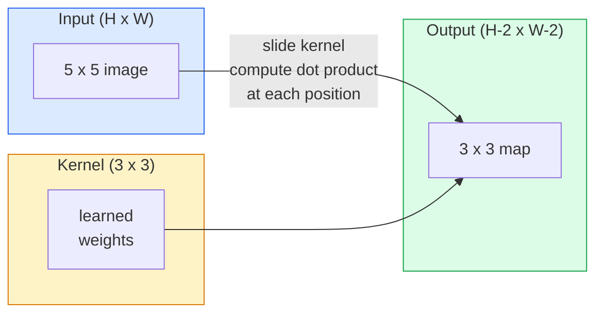
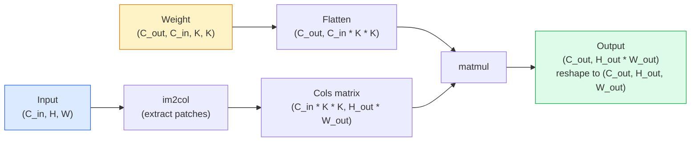

# Konwolucje od podstaw

> Konwolucja to maleńka warstwa gęsta, którą przesuwa się po obrazie, dzieląc te same wagi w każdej lokalizacji.

**Typ:** Build
**Języki:** Python
**Wymagania wstępne:** Faza 3 (Deep Learning Core), Faza 4 Lekcja 01 (Podstawy obrazu)
**Czas:** ~75 minut

## Cele nauki

- Zaimplementuj konwolucję 2D od podstaw przy użyciu wyłącznie NumPy, w tym wersję z zagnieżdżonymi pętlami oraz zwektoryzowaną wersję `im2col`
- Oblicz rozmiar przestrzenny wyjścia dla każdej kombinacji rozmiaru wejścia, rozmiaru jądra, paddingu i stride'u oraz uzasadnij wzór `(H - K + 2P) / S + 1`
- Zaprojektuj ręcznie jądra (edge, blur, sharpen, Sobel) i wyjaśnij, dlaczego każde z nich generuje taki wzorzec aktywacji
- Złóż konwolucje w ekstraktor cech i połącz głębokość stosu z rozmiarem pola recepcyjnego

## Problem

Warstwa w pełni połączona na obrazie RGB 224x224 wymagałaby 224 * 224 * 3 = 150 528 wag wejściowych na neuron. Jedna warstwa skryta z 1000 jednostkami to już 150 milionów parametrów — zanim nauczyłeś się czegokolwiek użytecznego. Co gorsza, taka warstwa nie ma pojęcia, że pies w lewym górnym rogu i pies w prawym dolnym rogu to ten sam wzorzec. Traktuje każdą pozycję pikselową jako niezależną, co jest zupełnie błędne dla obrazów: przesunięcie kota o trzy piksele nie powinno zmuszać sieci do ponownego nauczenia się tego pojęcia.

Dwie właściwości, których potrzebuje model obrazu, to **ekwiwariancja translacyjna** (wyjście przesuwa się, gdy przesuwa się wejście) oraz **dzielenie parametrów** (ten sam detektor cech działa wszędzie). Warstwy gęste nie dają ani jednej, ani drugiej. Konwolucja daje obie za darmo.

Konwolucja nie została wynaleziona dla deep learningu. To ta sama operacja, która stoi za kompresją JPEG, rozmyciem Gaussa w Photoshopie, detekcją krawędzi w wizji przemysłowej i każdym filtrem audio, jaki kiedykolwiek wypuszczono. Powodem, dla którego CNN-y dominowały w ImageNet od 2012 do 2020 roku, jest to, że konwolucja jest prawidłowym priorem dla danych, w których bliskie wartości są ze sobą powiązane, a ten sam wzorzec może pojawić się gdziekolwiek.

## Koncepcja

### Jedno jądro, przesuwane

Konwolucja 2D bierze małą macierz wag zwaną jądrem (lub filtrem), przesuwa ją po wejściu i w każdej lokalizacji oblicza sumę iloczynów element-po-elemencie. Ta suma staje się jednym pikselem wyjściowym.



Konkretny przykład 3x3 na wejściu 5x5 (bez paddingu, stride 1):

```
Input X (5 x 5):                Kernel W (3 x 3):

  1  2  0  1  2                   1  0 -1
  0  1  3  1  0                   2  0 -2
  2  1  0  2  1                   1  0 -1
  1  0  2  1  3
  2  1  1  0  1

The kernel slides across every valid 3 x 3 window. Output Y is 3 x 3:

 Y[0,0] = sum( W * X[0:3, 0:3] )
 Y[0,1] = sum( W * X[0:3, 1:4] )
 Y[0,2] = sum( W * X[0:3, 2:5] )
 Y[1,0] = sum( W * X[1:4, 0:3] )
 ... and so on
```

Ten jeden wzór — **dzielone wagi, lokalność, okno przesuwne** — to cała idea. Wszystko inne to księgowość.

### Wzór na rozmiar wyjścia

Mając rozmiar przestrzenny wejścia `H`, rozmiar jądra `K`, padding `P`, stride `S`:

```
H_out = floor( (H - K + 2P) / S ) + 1
```

Zapamiętaj to. Będziesz to obliczać dziesiątki razy w każdej architekturze.

| Scenariusz | H | K | P | S | H_out |
|----------|---|---|---|---|-------|
| Konwolucja valid, brak paddingu | 32 | 3 | 0 | 1 | 30 |
| Konwolucja same (zachowuje rozmiar) | 32 | 3 | 1 | 1 | 32 |
| Downsampling o 2 | 32 | 3 | 1 | 2 | 16 |
| Pooling 2x2 | 32 | 2 | 0 | 2 | 16 |
| Duże pole recepcyjne | 32 | 7 | 3 | 2 | 16 |

"Same padding" oznacza wybranie P tak, aby H_out == H, gdy S == 1. Dla nieparzystego K to P = (K - 1) / 2. Właśnie dlatego jądra 3x3 dominują — to najmniejsze nieparzyste jądro, które wciąż ma centrum.

### Padding

Bez paddingu każda konwolucja zmniejsza mapę cech. Złóż 20 takich warstw, a Twój obraz 224x224 zmieni się w 184x184, co marnuje moc obliczeniową na granicach i komplikuje połączenia rezydualne wymagające zgodnych kształtów.

```
Zero padding (P = 1) on a 5 x 5 input:

  0  0  0  0  0  0  0
  0  1  2  0  1  2  0
  0  0  1  3  1  0  0
  0  2  1  0  2  1  0       Now the kernel can centre on pixel
  0  1  0  2  1  3  0       (0, 0) and still have three rows and
  0  2  1  1  0  1  0       three columns of values to multiply.
  0  0  0  0  0  0  0
```

Tryby, które napotkasz w praktyce: `zero` (najpopularniejszy), `reflect` (odbicie krawędzi, zapobiega ostrym granicom w modelach generatywnych), `replicate` (kopiowanie krawędzi), `circular` (zawijanie, używane w problemach toroidalnych).

### Stride

Stride to wielkość kroku przesunięcia. `stride=1` to wartość domyślna. `stride=2` zmniejsza wymiary przestrzenne o połowę i jest klasycznym sposobem na downsampling wewnątrz CNN bez osobnej warstwy pooling — każda nowoczesna architektura (ResNet, ConvNeXt, MobileNet) gdzieś używa konwolucji ze stride zamiast max-pool.

```
Stride 1 on a 5 x 5 input, 3 x 3 kernel:

  starts: (0,0) (0,1) (0,2)        -> output row 0
          (1,0) (1,1) (1,2)        -> output row 1
          (2,0) (2,1) (2,2)        -> output row 2

  Output: 3 x 3

Stride 2 on the same input:

  starts: (0,0) (0,2)              -> output row 0
          (2,0) (2,2)              -> output row 1

  Output: 2 x 2
```

### Wiele kanałów wejściowych

Prawdziwe obrazy mają trzy kanały. Konwolucja 3x3 na wejściu RGB to w rzeczywistości wolumen 3x3x3: jeden plasterek 3x3 na każdy kanał wejściowy. W każdej pozycji przestrzennej mnożysz i sumujesz po wszystkich trzech plasterkach i dodajesz bias.

```
Input:   (C_in,  H,  W)        3 x 5 x 5
Kernel:  (C_in,  K,  K)        3 x 3 x 3 (one kernel)
Output:  (1,     H', W')       2D map

For a layer that produces C_out output channels, you stack C_out kernels:

Weight:  (C_out, C_in, K, K)   e.g. 64 x 3 x 3 x 3
Output:  (C_out, H', W')       64 x 3 x 3

Parameter count: C_out * C_in * K * K + C_out   (the + C_out is biases)
```

Ta ostatnia linia jest tą, którą będziesz obliczać podczas planowania modelu. Konwolucja 3x3 o 64 kanałach na wejściu o 3 kanałach ma `64 * 3 * 3 * 3 + 64 = 1 792` parametrów. Tanio.

### Trik im2col

Zagnieżdżone pętle są łatwe do odczytania, ale wolne. GPU chcą dużych mnożeń macierzowych. Trik: spłaszcz każde okno pola recepcyjnego wejścia do jednej kolumny dużej macierzy, spłaszcz jądro do wiersza, a cała konwolucja staje się jednym matmulem.



Każda produkcyjna implementacja konwolucji jest pewną wariacją tego podejścia plus triki cache-tiling (direct conv, Winograd, FFT conv dla dużych jąder). Zrozum im2col i zrozumiesz całą resztę.

### Pole recepcyjne

Pojedyncza konwolucja 3x3 patrzy na 9 pikseli wejściowych. Złóż dwie konwolucje 3x3, a neuron w drugiej warstwie patrzy na 5x5 pikseli wejściowych. Trzy konwolucje 3x3 dają 7x7. Ogólnie:

```
RF after L stacked K x K convs (stride 1) = 1 + L * (K - 1)

With strides:   RF grows multiplicatively with stride along each layer.
```

Cały powód, dla którego "3x3 wszędzie" działa (VGG, ResNet, ConvNeXt), jest taki, że dwie konwolucje 3x3 widzą ten sam obszar wejścia co jedna konwolucja 5x5, ale z mniejszą liczbą parametrów i dodatkową nieliniowością pomiędzy nimi.

## Zbuduj to

### Krok 1: Dopełnij tablicę (padding)

Zacznij od najmniejszego prymitywu: funkcji, która dopełnia zerami wokół tablicy H x W.

```python
import numpy as np

def pad2d(x, p):
    if p == 0:
        return x
    h, w = x.shape[-2:]
    out = np.zeros(x.shape[:-2] + (h + 2 * p, w + 2 * p), dtype=x.dtype)
    out[..., p:p + h, p:p + w] = x
    return out

x = np.arange(9).reshape(3, 3)
print(x)
print()
print(pad2d(x, 1))
```

Trik z osiami końcowymi `x.shape[:-2]` oznacza, że ta sama funkcja działa dla `(H, W)`, `(C, H, W)` lub `(N, C, H, W)` bez żadnych modyfikacji.

### Krok 2: Konwolucja 2D z zagnieżdżonymi pętlami

Implementacja referencyjna — wolna, ale jednoznaczna. To jest właśnie to, co `torch.nn.functional.conv2d` robi w zasadzie.

```python
def conv2d_naive(x, w, b=None, stride=1, padding=0):
    c_in, h, w_in = x.shape
    c_out, c_in_w, kh, kw = w.shape
    assert c_in == c_in_w

    x_pad = pad2d(x, padding)
    h_out = (h + 2 * padding - kh) // stride + 1
    w_out = (w_in + 2 * padding - kw) // stride + 1

    out = np.zeros((c_out, h_out, w_out), dtype=np.float32)
    for oc in range(c_out):
        for i in range(h_out):
            for j in range(w_out):
                hs = i * stride
                ws = j * stride
                patch = x_pad[:, hs:hs + kh, ws:ws + kw]
                out[oc, i, j] = np.sum(patch * w[oc])
        if b is not None:
            out[oc] += b[oc]
    return out
```

Cztery zagnieżdżone pętle (kanał wyjściowy, wiersz, kolumna, plus niejawna suma po C_in, kh, kw). To jest grunt prawdy, względem którego będziesz sprawdzać każdą szybszą implementację.

### Krok 3: Weryfikacja za pomocą ręcznie zaprojektowanego jądra

Zbuduj jądro Sobela wertykalnego, zastosuj je na syntetycznym obrazie schodkowym i obserwuj, jak pionowa krawędź się zapala.

```python
def synthetic_step_image():
    img = np.zeros((1, 16, 16), dtype=np.float32)
    img[:, :, 8:] = 1.0
    return img

sobel_x = np.array([
    [[-1, 0, 1],
     [-2, 0, 2],
     [-1, 0, 1]]
], dtype=np.float32)[None]

x = synthetic_step_image()
y = conv2d_naive(x, sobel_x, padding=1)
print(y[0].round(1))
```

Oczekuj dużych wartości pozytywnych w kolumnie 7 (wzrost jasności od lewej do prawej) i zer wszędzie indziej. Ten jeden print to Twój sanity check, że matematyka jest poprawna.

### Krok 4: im2col

Zamień każde okno o rozmiarze jądra w wejściu na kolumnę macierzy. Dla `C_in=3, K=3` każda kolumna to 27 liczb.

```python
def im2col(x, kh, kw, stride=1, padding=0):
    c_in, h, w = x.shape
    x_pad = pad2d(x, padding)
    h_out = (h + 2 * padding - kh) // stride + 1
    w_out = (w + 2 * padding - kw) // stride + 1

    cols = np.zeros((c_in * kh * kw, h_out * w_out), dtype=x.dtype)
    col = 0
    for i in range(h_out):
        for j in range(w_out):
            hs = i * stride
            ws = j * stride
            patch = x_pad[:, hs:hs + kh, ws:ws + kw]
            cols[:, col] = patch.reshape(-1)
            col += 1
    return cols, h_out, w_out
```

To wciąż pętla w Pythonie, ale teraz ciężka praca będzie jednym zwektoryzowanym matmulem.

### Krok 5: Szybka konwolucja przez im2col + matmul

Zamień poczwórną pętlę na jedno mnożenie macierzowe.

```python
def conv2d_im2col(x, w, b=None, stride=1, padding=0):
    c_out, c_in, kh, kw = w.shape
    cols, h_out, w_out = im2col(x, kh, kw, stride, padding)
    w_flat = w.reshape(c_out, -1)
    out = w_flat @ cols
    if b is not None:
        out += b[:, None]
    return out.reshape(c_out, h_out, w_out)
```

Sprawdzenie poprawności: uruchom obie implementacje i porównaj.

```python
rng = np.random.default_rng(0)
x = rng.normal(0, 1, (3, 16, 16)).astype(np.float32)
w = rng.normal(0, 1, (8, 3, 3, 3)).astype(np.float32)
b = rng.normal(0, 1, (8,)).astype(np.float32)

y_naive = conv2d_naive(x, w, b, padding=1)
y_im2col = conv2d_im2col(x, w, b, padding=1)

print(f"max abs diff: {np.max(np.abs(y_naive - y_im2col)):.2e}")
```

`max abs diff` powinno wynosić około `1e-5` — różnica wynika z kolejności akumulacji zmiennoprzecinkowej, nie z błędu.

### Krok 6: Bank ręcznie zaprojektowanych jąder

Pięć filtrów, które pokazują, co potrafi wyrazić jedna warstwa konwolucyjna przed jakimkolwiek treningiem.

```python
KERNELS = {
    "identity": np.array([[0, 0, 0], [0, 1, 0], [0, 0, 0]], dtype=np.float32),
    "blur_3x3": np.ones((3, 3), dtype=np.float32) / 9.0,
    "sharpen": np.array([[0, -1, 0], [-1, 5, -1], [0, -1, 0]], dtype=np.float32),
    "sobel_x": np.array([[-1, 0, 1], [-2, 0, 2], [-1, 0, 1]], dtype=np.float32),
    "sobel_y": np.array([[-1, -2, -1], [0, 0, 0], [1, 2, 1]], dtype=np.float32),
}

def apply_kernel(img2d, kernel):
    x = img2d[None].astype(np.float32)
    w = kernel[None, None]
    return conv2d_im2col(x, w, padding=1)[0]
```

Zastosowane na dowolnym obrazie w skali szarości: blur wygładza, sharpen wyostrza krawędzie, sobel-x zapala pionowe krawędzie, a sobel-y zapala krawędzie horyzontalne. To dokładnie te wzorce, które *pierwsza* wytrenowana warstwa konwolucyjna w AlexNet i VGG ostatecznie nauczyła się wykrywać — ponieważ dobry model obrazu potrzebuje detektorów krawędzi i blobów niezależnie od tego, jakie zadanie pojawi się później.

## Zastosuj to

`nn.Conv2d` z PyTorch otacza tę samą operację autogradem, kernelami CUDA i optymalizacją cuDNN. Semantyka kształtów jest identyczna.

```python
import torch
import torch.nn as nn

conv = nn.Conv2d(in_channels=3, out_channels=64, kernel_size=3, stride=1, padding=1)
print(conv)
print(f"weight shape: {tuple(conv.weight.shape)}   # (C_out, C_in, K, K)")
print(f"bias shape:   {tuple(conv.bias.shape)}")
print(f"param count:  {sum(p.numel() for p in conv.parameters())}")

x = torch.randn(8, 3, 224, 224)
y = conv(x)
print(f"\ninput  shape: {tuple(x.shape)}")
print(f"output shape: {tuple(y.shape)}")
```

Zamień `padding=1` na `padding=0`, a wyjście spadnie do 222x222. Zamień `stride=1` na `stride=2`, a spadnie do 112x112. Ten sam wzór, który zapamiętałeś powyżej.

## Dostarcz to

Ta lekcja produkuje:

- `outputs/prompt-cnn-architect.md` — prompt, który mając rozmiar wejścia, budżet parametrów i docelowe pole recepcyjne, projektuje stos warstw `Conv2d` z odpowiednimi K/S/P na każdym kroku.
- `outputs/skill-conv-shape-calculator.md` — skill, który przechodzi przez specyfikację sieci warstwa po warstwie i zwraca kształt wyjścia, pole recepcyjne oraz liczbę parametrów dla każdego bloku.

## Ćwiczenia

1. **(Łatwe)** Mając wejście w skali szarości 128x128 oraz stos `[Conv3x3(s=1,p=1), Conv3x3(s=2,p=1), Conv3x3(s=1,p=1), Conv3x3(s=2,p=1)]`, oblicz ręcznie rozmiar przestrzenny wyjścia oraz pole recepcyjne na każdej warstwie. Zweryfikuj za pomocą `nn.Sequential` z atrapowymi konwolucjami w PyTorch.
2. **(Średnie)** Rozszerz `conv2d_naive` i `conv2d_im2col`, aby przyjmowały argument `groups`. Pokaż, że `groups=C_in=C_out` reprodukuje konwolucję depthwise i że jej liczba parametrów to `C * K * K` zamiast `C * C * K * K`.
3. **(Trudne)** Zaimplementuj ręcznie wsteczną propagację dla `conv2d_im2col`: mając gradient wyjścia, oblicz gradient `x` i `w`. Zweryfikuj względem `torch.autograd.grad` na tych samych wejściach i wagach. Trik: gradientem im2col jest `col2im`, i musi on akumulować nakładające się okna.

## Kluczowe terminy

| Termin | Co się mówi | Co to faktycznie znaczy |
|------|----------------|----------------------|
| Konwolucja | "Przesuwanie filtru" | Uczony iloczyn skalarny zastosowany w każdej lokalizacji przestrzennej z dzielonymi wagami; matematycznie jest to korelacja wzajemna, ale wszyscy nazywają to konwolucją |
| Jądro / filtr | "Detektor cech" | Mały tensor wag o kształcie (C_in, K, K), którego iloczyn skalarny z oknem wejścia produkuje jeden piksel wyjściowy |
| Stride | "Jak duży skok wykonujesz" | Wielkość kroku między kolejnymi umieszczeniami jądra; stride 2 zmniejsza o połowę każdy wymiar przestrzenny |
| Padding | "Zera na krawędziach" | Dodatkowe wartości dodane wokół wejścia, aby jądro mogło centrować się na pikselach granicznych; padding `same` zachowuje rozmiar wyjścia równy rozmiarowi wejścia |
| Pole recepcyjne | "Ile widzi neuron" | Fragment oryginalnego wejścia, od którego zależy dana aktywacja wyjściowa, rosnący z głębokością i stride'em |
| im2col | "Trik GEMM" | Przekształcenie każdego okna pola recepcyjnego w kolumny, tak aby konwolucja stała się jednym dużym mnożeniem macierzowym — jądro każdej szybkiej implementacji konwolucji |
| Konwolucja depthwise | "Jedno jądro na kanał" | Konwolucja z `groups == C_in`, obliczająca każdy kanał wyjściowy tylko z odpowiadającego mu kanału wejściowego; podstawa MobileNet i ConvNeXt |
| Ekwiwariancja translacyjna | "Przesunięcie na wejściu, przesunięcie na wyjściu" | Właściwość, że przesunięcie wejścia o k pikseli przesuwa wyjście o k pikseli; pojawia się za darmo wraz z dzielonymi wagami |

## Dalsza lektura

- [A guide to convolution arithmetic for deep learning (Dumoulin & Visin, 2016)](https://arxiv.org/abs/1603.07285) — definitywne diagramy paddingu/stride/dylatacji, które każdy kurs po cichu kopiuje
- [CS231n: Convolutional Neural Networks for Visual Recognition](https://cs231n.github.io/convolutional-networks/) — kanoniczne notatki z wykładów, w tym oryginalne wyjaśnienie im2col
- [The Annotated ConvNet (fast.ai)](https://nbviewer.org/github/fastai/fastbook/blob/master/13_convolutions.ipynb) — notebook prowadzący od ręcznej konwolucji do wytrenowanego klasyfikatora cyfr
- [Receptive Field Arithmetic for CNNs (Dang Ha The Hien)](https://distill.pub/2019/computing-receptive-fields/) — interaktywny wyjaśniacz obliczeń pola recepcyjnego o jakości publikacji naukowej
