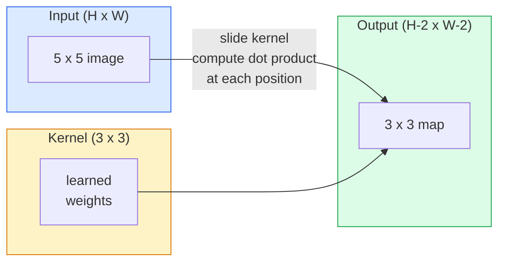
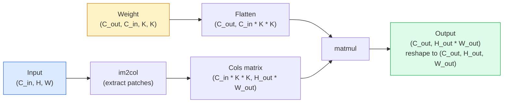

# Sploty od podstaw

> Splot to niewielka, gęsta warstwa przesuwana po obrazie, mająca w każdym miejscu tę samą wagę.

**Typ:** Kompilacja
**Języki:** Python
**Wymagania wstępne:** Faza 3 (Podstawy głębokiego uczenia się), Faza 4 Lekcja 01 (Podstawy obrazu)
**Czas:** ~75 minut

## Cele nauczania

- Zaimplementuj splot 2D od zera, używając tylko NumPy, łącznie z wersją z zagnieżdżoną pętlą i wersją wektorową `im2col`
- Oblicz wyjściowy rozmiar przestrzenny dla dowolnej kombinacji rozmiaru wejściowego, rozmiaru jądra, dopełnienia i kroku oraz uzasadnij formułę `(H - K + 2P) / S + 1`
- Ręcznie projektuj jądra (krawędź, rozmycie, wyostrzenie, Sobel) i wyjaśnij, dlaczego każdy z nich generuje taki sam wzór aktywacji
- Ułóż sploty w ekstraktorze cech i połącz głębokość stosu z rozmiarem pola recepcyjnego

## Problem

W pełni połączona warstwa na obrazie RGB o wymiarach 224x224 wymagałaby 224 * 224 * 3 = 150 528 wag wejściowych na neuron. Pojedyncza warstwa ukryta zawierająca 1000 jednostek to już 150 milionów parametrów — zanim nauczysz się czegoś przydatnego. Co gorsza, ta warstwa nie ma pojęcia, że ​​pies w lewym górnym rogu i pies w prawym dolnym rogu to ten sam wzór. Traktuje każdą pozycję piksela jako niezależną, co jest całkowicie błędne w przypadku obrazów: przełożenie kota o trzy piksele nie powinno zmuszać sieci do ponownego nauczenia się tej koncepcji.

Dwie właściwości, których potrzebuje model obrazu, to **równoważność translacji** (wyjście zmienia się wraz z przesunięciem wejścia) i **wspólność parametrów** (wszędzie działa ten sam detektor cech). Gęste warstwy nie dają żadnego efektu. Convolution daje jedno i drugie za darmo.

Splot nie został wymyślony do głębokiego uczenia się. Jest to ta sama operacja, która zapewnia kompresję JPEG, rozmycie gaussowskie w Photoshopie, wykrywanie krawędzi w wizji przemysłowej i każdy dostępny na rynku filtr audio. Powodem, dla którego CNN zdominowały ImageNet w latach 2012–2020, jest to, że splot jest właściwym poprzedzaniem danych, w przypadku których pobliskie wartości są powiązane i ten sam wzorzec może pojawić się w dowolnym miejscu.

## Koncepcja

### Jedno jądro, przesuwane

Splot 2D pobiera macierz o małej wadze zwaną jądrem (lub filtrem), przesuwa ją po wejściu i w każdym miejscu oblicza sumę iloczynów elementarnych. Suma ta staje się jednym pikselem wyjściowym.



Konkretny przykład 3x3 na wejściu 5x5 (bez dopełnienia, krok 1):

```
Input X (5 x 5):                Kernel W (3 x 3):

  1  2  0  1  2                   1  0 -1
  0  1  3  1  0                   2  0 -2
  2  1  0  2  1                   1  0 -1
  1  0  2  1  3
  2  1  1  0  1

The kernel slides across every valid 3 x 3 window. Output Y is 3 x 3:

 Y[0,0] = sum( W * X[0:3, 0:3] )
 Y[0,1] = sum( W * X[0:3, 1:4] )
 Y[0,2] = sum( W * X[0:3, 2:5] )
 Y[1,0] = sum( W * X[1:4, 0:3] )
 ... and so on
```

Ta jedna formuła — **wspólne wagi, lokalizacja, przesuwane okno** — to cały pomysł. Cała reszta to księgowość.

### Formuła rozmiaru wyjściowego

Biorąc pod uwagę wejściowy rozmiar przestrzenny `H`, rozmiar jądra `K`, dopełnienie `P`, krok `S`:

```
H_out = floor( (H - K + 2P) / S ) + 1
```

Zapamiętaj to. Obliczysz to dziesiątki razy dla każdej architektury.

| Scenariusz | H. | K | P | S | H_out |
|---------|---|---|---|---|-------|
| Prawidłowa konwersja, bez dopełnienia | 32 | 3 | 0 | 1 | 30 |
| Ta sama konw. (zachowuje rozmiar) | 32 | 3 | 1 | 1 | 32 |
| Zmniejsz próbkę o 2 | 32 | 3 | 1 | 2 | 16 |
| Basen 2x2 | 32 | 2 | 0 | 2 | 16 |
| Duże pole recepcyjne | 32 | 7 | 3 | 2 | 16 |

„To samo wypełnienie” oznacza wybranie P tak, że H_out == H, gdy S == 1. Dla nieparzystego K, czyli P = (K - 1) / 2. Dlatego dominują jądra 3x3 — są najmniejszym nieparzystym jądrem, które wciąż ma środek.

### Wyściółka

Bez dopełnienia każdy splot zmniejsza mapę obiektów. Ułóż 20 z nich, a obraz o wymiarach 224 x 224 zmieni się na 184 x 184, co marnuje obliczenia na granicy i komplikuje pozostałe połączenia, które wymagają pasujących kształtów.

```
Zero padding (P = 1) on a 5 x 5 input:

  0  0  0  0  0  0  0
  0  1  2  0  1  2  0
  0  0  1  3  1  0  0
  0  2  1  0  2  1  0       Now the kernel can centre on pixel
  0  1  0  2  1  3  0       (0, 0) and still have three rows and
  0  2  1  1  0  1  0       three columns of values to multiply.
  0  0  0  0  0  0  0
```

Tryby, które spotykasz w praktyce: `zero` (najczęściej), `reflect` (odbicie lustrzane krawędzi, unika twardych krawędzi w modelach generatywnych), `replicate` (skopiuj krawędź), `circular` (zawijanie, używane w problemach toroidalnych).

### Krok

Krok to wielkość kroku slajdu. Wartość domyślna to `stride=1`. `stride=2` zmniejsza o połowę wymiary przestrzenne i jest klasycznym sposobem próbkowania w dół w CNN bez oddzielnej warstwy łączenia — każda nowoczesna architektura (ResNet, ConvNeXt, MobileNet) wykorzystuje gdzieś konwersje krokowe zamiast maksymalnej puli.

```
Stride 1 on a 5 x 5 input, 3 x 3 kernel:

  starts: (0,0) (0,1) (0,2)        -> output row 0
          (1,0) (1,1) (1,2)        -> output row 1
          (2,0) (2,1) (2,2)        -> output row 2

  Output: 3 x 3

Stride 2 on the same input:

  starts: (0,0) (0,2)              -> output row 0
          (2,0) (2,2)              -> output row 1

  Output: 2 x 2
```

### Wiele kanałów wejściowych

Prawdziwe obrazy mają trzy kanały. Splot 3x3 na wejściu RGB to w rzeczywistości objętość 3x3x3: jeden plasterek 3x3 na kanał wejściowy. W każdej pozycji przestrzennej mnożysz i sumujesz wszystkie trzy wycinki i dodajesz odchylenie.

```
Input:   (C_in,  H,  W)        3 x 5 x 5
Kernel:  (C_in,  K,  K)        3 x 3 x 3 (one kernel)
Output:  (1,     H', W')       2D map

For a layer that produces C_out output channels, you stack C_out kernels:

Weight:  (C_out, C_in, K, K)   e.g. 64 x 3 x 3 x 3
Output:  (C_out, H', W')       64 x 3 x 3

Parameter count: C_out * C_in * K * K + C_out   (the + C_out is biases)
```

Ta ostatnia linia jest tą, którą obliczysz podczas planowania modelu. 64-kanałowa konwersja 3x3 na 3-kanałowym wejściu ma parametry `64 * 3 * 3 * 3 + 64 = 1,792`. Tani.

### Sztuczka z im2colem

Zagnieżdżone pętle są łatwe do odczytania, ale powolne. Procesory graficzne wymagają dużych mnożników macierzy. Sztuczka: spłaszcz każde okno pola recepcyjnego danych wejściowych w jedną kolumnę dużej macierzy, spłaszcz jądro w wiersz, a cały splot stanie się pojedynczym matmulem.



Każda implementacja konwersji produkcyjnej jest pewnym wariantem tego plus sztuczki z kafelkowaniem pamięci podręcznej (konwersja bezpośrednia, konwersja Winograd, konwersja FFT dla dużych jąder). Zrozum im2col, a zrozumiesz rdzeń.

### Pole odbiorcze

Pojedyncza konwersja 3x3 uwzględnia 9 pikseli wejściowych. Ułóż dwie konwersje 3x3, a neuron w drugiej warstwie patrzy na piksele wejściowe 5x5. Trzy konwersje 3x3 dają 7x7. Ogólnie:

```
RF after L stacked K x K convs (stride 1) = 1 + L * (K - 1)

With strides:   RF grows multiplicatively with stride along each layer.
```

Jedynym powodem, dla którego opcja „3x3 aż do końca” działa (VGG, ResNet, ConvNeXt), jest to, że dwie konwersje 3x3 widzą ten sam obszar wejściowy co jedna konwersja 5x5, ale z mniejszą liczbą parametrów i dodatkową nieliniowością pomiędzy nimi.

## Zbuduj to

### Krok 1: Uzupełnij tablicę

Zacznij od najmniejszego prymitywu: funkcji, która uzupełnia zerami wokół tablicy H x W.

```python
import numpy as np

def pad2d(x, p):
    if p == 0:
        return x
    h, w = x.shape[-2:]
    out = np.zeros(x.shape[:-2] + (h + 2 * p, w + 2 * p), dtype=x.dtype)
    out[..., p:p + h, p:p + w] = x
    return out

x = np.arange(9).reshape(3, 3)
print(x)
print()
print(pad2d(x, 1))
```

Sztuczka z osiami końcowymi `x.shape[:-2]` oznacza, że ta sama funkcja działa na `(H, W)`, `(C, H, W)` lub `(N, C, H, W)` bez modyfikacji.

### Krok 2: Splot 2D z zagnieżdżonymi pętlami

Implementacja referencyjna — powolna, ale jednoznaczna. Zasadniczo właśnie to robi `torch.nn.functional.conv2d`.

```python
def conv2d_naive(x, w, b=None, stride=1, padding=0):
    c_in, h, w_in = x.shape
    c_out, c_in_w, kh, kw = w.shape
    assert c_in == c_in_w

    x_pad = pad2d(x, padding)
    h_out = (h + 2 * padding - kh) // stride + 1
    w_out = (w_in + 2 * padding - kw) // stride + 1

    out = np.zeros((c_out, h_out, w_out), dtype=np.float32)
    for oc in range(c_out):
        for i in range(h_out):
            for j in range(w_out):
                hs = i * stride
                ws = j * stride
                patch = x_pad[:, hs:hs + kh, ws:ws + kw]
                out[oc, i, j] = np.sum(patch * w[oc])
        if b is not None:
            out[oc] += b[oc]
    return out
```

Cztery zagnieżdżone pętle (kanał wyjściowy, wiersz, kolumna plus ukryta suma po C_in, kh, kw). To podstawowa prawda, z którą będziesz sprawdzać każdą szybszą implementację.

### Krok 3: Weryfikacja za pomocą ręcznie zaprojektowanego jądra

Zbuduj pionowe jądro Sobela, zastosuj je do syntetycznego obrazu stopnia i obserwuj, jak rozjaśnia się pionowa krawędź.

```python
def synthetic_step_image():
    img = np.zeros((1, 16, 16), dtype=np.float32)
    img[:, :, 8:] = 1.0
    return img

sobel_x = np.array([
    [[-1, 0, 1],
     [-2, 0, 2],
     [-1, 0, 1]]
], dtype=np.float32)[None]

x = synthetic_step_image()
y = conv2d_naive(x, sobel_x, padding=1)
print(y[0].round(1))
```

Spodziewaj się dużych wartości dodatnich w kolumnie 7 (wzrost jasności od lewej do prawej) i zer wszędzie indziej. Ten pojedynczy odcisk jest dowodem na to, że matematyka jest właściwa.

### Krok 4: im2col

Konwertuj każde okno wielkości jądra na wejściu na kolumnę macierzy. W przypadku `C_in=3, K=3` każda kolumna zawiera 27 liczb.

```python
def im2col(x, kh, kw, stride=1, padding=0):
    c_in, h, w = x.shape
    x_pad = pad2d(x, padding)
    h_out = (h + 2 * padding - kh) // stride + 1
    w_out = (w + 2 * padding - kw) // stride + 1

    cols = np.zeros((c_in * kh * kw, h_out * w_out), dtype=x.dtype)
    col = 0
    for i in range(h_out):
        for j in range(w_out):
            hs = i * stride
            ws = j * stride
            patch = x_pad[:, hs:hs + kh, ws:ws + kw]
            cols[:, col] = patch.reshape(-1)
            col += 1
    return cols, h_out, w_out
```

Nadal jest to pętla w Pythonie, ale teraz głównym zadaniem będzie pojedynczy wektoryzowany matmul.

### Krok 5: Szybka konwersja przez im2col + matmul

Zamień poczwórną pętlę na jedno mnożenie macierzy.

```python
def conv2d_im2col(x, w, b=None, stride=1, padding=0):
    c_out, c_in, kh, kw = w.shape
    cols, h_out, w_out = im2col(x, kh, kw, stride, padding)
    w_flat = w.reshape(c_out, -1)
    out = w_flat @ cols
    if b is not None:
        out += b[:, None]
    return out.reshape(c_out, h_out, w_out)
```

Kontrola poprawności: uruchom obie implementacje i porównaj.

```python
rng = np.random.default_rng(0)
x = rng.normal(0, 1, (3, 16, 16)).astype(np.float32)
w = rng.normal(0, 1, (8, 3, 3, 3)).astype(np.float32)
b = rng.normal(0, 1, (8,)).astype(np.float32)

y_naive = conv2d_naive(x, w, b, padding=1)
y_im2col = conv2d_im2col(x, w, b, padding=1)

print(f"max abs diff: {np.max(np.abs(y_naive - y_im2col)):.2e}")
```

Wartość `max abs diff` powinna wynosić około `1e-5` — różnica polega na kolejności akumulacji zmiennoprzecinkowej, a nie na błędzie.

### Krok 6: Bank ręcznie zaprojektowanych jąder

Pięć filtrów, które pokazują, co może wyrazić pojedyncza warstwa konwersji przed jakimkolwiek treningiem.

```python
KERNELS = {
    "identity": np.array([[0, 0, 0], [0, 1, 0], [0, 0, 0]], dtype=np.float32),
    "blur_3x3": np.ones((3, 3), dtype=np.float32) / 9.0,
    "sharpen": np.array([[0, -1, 0], [-1, 5, -1], [0, -1, 0]], dtype=np.float32),
    "sobel_x": np.array([[-1, 0, 1], [-2, 0, 2], [-1, 0, 1]], dtype=np.float32),
    "sobel_y": np.array([[-1, -2, -1], [0, 0, 0], [1, 2, 1]], dtype=np.float32),
}

def apply_kernel(img2d, kernel):
    x = img2d[None].astype(np.float32)
    w = kernel[None, None]
    return conv2d_im2col(x, w, padding=1)[0]
```

Zastosowany do dowolnego obrazu w skali szarości, rozmycie łagodzi, wyostrza krawędzie, Sobel-x oświetla pionowe krawędzie, Sobel-y rozjaśnia poziome krawędzie. To są dokładnie te wzorce, których nauczyła się *pierwsza* przeszkolona warstwa konwersji w AlexNet i VGG — ponieważ dobry model obrazu wymaga detektorów krawędzi i plam, niezależnie od tego, jakie zadanie nastąpi później.

## Użyj tego

`nn.Conv2d` PyTorch obejmuje tę samą operację z autogradem, jądrami CUDA i optymalizacją cuDNN. Semantyka kształtu jest identyczna.

```python
import torch
import torch.nn as nn

conv = nn.Conv2d(in_channels=3, out_channels=64, kernel_size=3, stride=1, padding=1)
print(conv)
print(f"weight shape: {tuple(conv.weight.shape)}   # (C_out, C_in, K, K)")
print(f"bias shape:   {tuple(conv.bias.shape)}")
print(f"param count:  {sum(p.numel() for p in conv.parameters())}")

x = torch.randn(8, 3, 224, 224)
y = conv(x)
print(f"\ninput  shape: {tuple(x.shape)}")
print(f"output shape: {tuple(y.shape)}")
```

Zamień `padding=1` na `padding=0`, a rozmiar wyjściowy spadnie do 222x222. Zamień `stride=1` na `stride=2`, a rozmiar spadnie do 112x112. Ta sama formuła, którą zapamiętałeś powyżej.

## Wyślij to

Ta lekcja daje:

- `outputs/prompt-cnn-architect.md` — podpowiedź, która biorąc pod uwagę rozmiar wejściowy, budżet parametrów i docelowe pole recepcyjne, projektuje stos warstw `Conv2d` z właściwymi K/S/P na każdym kroku.
- `outputs/skill-conv-shape-calculator.md` — umiejętność przeglądania specyfikacji sieci warstwa po warstwie i zwracania kształtu wyjściowego, pola recepcyjnego i liczby parametrów dla każdego bloku.

## Ćwiczenia

1. **(Łatwe)** Biorąc pod uwagę dane wejściowe w skali szarości 128x128 i stos `[Conv3x3(s=1,p=1), Conv3x3(s=2,p=1), Conv3x3(s=1,p=1), Conv3x3(s=2,p=1)]`, ręcznie oblicz wyjściowy rozmiar przestrzenny i pole recepcyjne w każdej warstwie. Zweryfikuj za pomocą PyTorch `nn.Sequential` fikcyjnych konwersji.
2. **(Średni)** Rozszerz `conv2d_naive` i `conv2d_im2col`, aby zaakceptować argument `groups`. Pokaż, że `groups=C_in=C_out` odtwarza splot wgłębny i że liczba jego parametrów wynosi `C * K * K` zamiast `C * C * K * K`.
3. **(Trudne)** Zaimplementuj ręcznie przejście wstecz `conv2d_im2col`: biorąc pod uwagę gradient wyjścia, oblicz gradient `x` i `w`. Sprawdź względem `torch.autograd.grad` dla tych samych danych wejściowych i wag. Sztuczka: gradient im2col wynosi `col2im` i musi gromadzić nakładające się okna.

## Kluczowe terminy

| Termin | Co ludzie mówią | Co to właściwie oznacza |
|------|----------------|----------------------|
| Splot | „Przesuwanie filtra” | Uczący się iloczyn skalarny stosowany w każdym miejscu przestrzennym ze wspólnymi wagami; matematycznie jest to korelacja krzyżowa, ale wszyscy nazywają to splotem |
| Jądro / filtr | „Detektor cech” | Mały tensor kształtu (C_in, K, K), którego iloczyn skalarny z oknem wejściowym daje jeden piksel wyjściowy |
| Krok | „Jak daleko skaczesz” | Rozmiar kroku pomiędzy kolejnymi umiejscowieniami jądra; krok 2 połówki każdego wymiaru przestrzennego |
| Wyściółka | „Zera na krawędziach” | Dodatkowe wartości dodane wokół wejścia, aby jądro mogło wyśrodkować się na pikselach granicznych; `same` dopełnienie utrzymuje rozmiar wyjściowy równy rozmiarowi wejściowemu |
| Pole recepcyjne | „Ile neuron widzi” | Fragment pierwotnego sygnału wejściowego, od którego zależy aktywacja danego wyjścia, rosnący wraz z głębokością i krokiem |
| im2col | „Sztuczka GEMM” | Przestawianie każdego okna receptywnego w kolumny, tak aby splot stał się jednym wielkim mnożeniem macierzy — rdzeń każdego jądra szybkiej konwersji |
| Konw. wgłębna | „Jedno jądro na kanał” | Konwencja z `groups == C_in`, obliczająca każdy kanał wyjściowy tylko na podstawie pasującego kanału wejściowego; szkielet MobileNet i ConvNeXt |
| Równoważność tłumaczeniowa | „Wsuń, przesuń” | Właściwość polegająca na tym, że przesunięcie wejścia o k pikseli przesuwa wynik o k pikseli; przychodzi za darmo ze wspólnymi ciężarkami |

## Dalsze czytanie

- [Przewodnik po arytmetyce splotów w głębokim uczeniu się (Dumoulin i Visin, 2016)](https://arxiv.org/abs/1603.07285) — ostateczne diagramy dopełniania/kroku/dylatacji, które po cichu kopiuje każdy kurs
- [CS231n: Konwolucyjne sieci neuronowe do rozpoznawania wizualnego](https://cs231n.github.io/convolutional-networks/) — kanoniczne notatki z wykładów, w tym oryginalne wyjaśnienia im2col
- [The Annotated ConvNet (fast.ai)](https://nbviewer.org/github/fastai/fastbook/blob/master/13_convolutions.ipynb) — notatnik, który przechodzi od ręcznego splotu do wyszkolonego klasyfikatora cyfr
– [Arytmetyka pola recepcyjnego dla CNN (Dang Ha The Hien)](https://distill.pub/2019/computing-receptive-fields/) — interaktywne objaśnienie obliczeń pola recepcyjnego o jakości papierowej