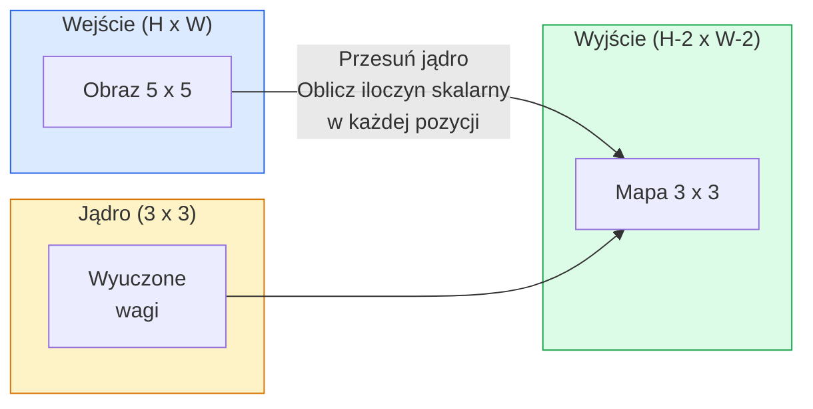
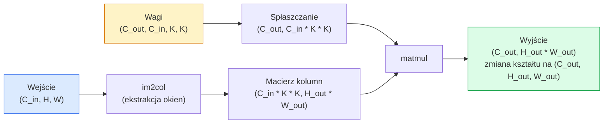

# Sploty od podstaw

> Splot to niewielka, gęsta warstwa przesuwana po obrazie, współdzieląca te same wagi w każdym miejscu.

**Typ:** Kompilacja
**Języki:** Python
**Wymagania wstępne:** Faza 3 (Podstawy głębokiego uczenia), Faza 4 Lekcja 01 (Podstawy obrazu)
**Czas:** ~75 minut

## Cele nauczania

- Zaimplementowanie splotu (konwolucji) 2D od zera przy użyciu wyłącznie biblioteki NumPy, zarówno w wersji z zagnieżdżonymi pętlami, jak i w wektoryzowanej wersji `im2col`.
- Obliczanie wyjściowego rozmiaru przestrzennego dla dowolnej kombinacji wejścia, wielkości jądra, dopełnienia (padding) i kroku (stride), a także uzasadnienie wzoru `(H - K + 2P) / S + 1`.
- Ręczne projektowanie jąder (wykrywanie krawędzi, rozmycie, wyostrzanie, filtr Sobela) i wyjaśnienie, dlaczego tworzą one odpowiednie wzorce aktywacji.
- Układanie splotów w kaskadowy ekstraktor cech (feature extractor) i powiązanie głębokości sieci z rozmiarem pola recepcyjnego.

## Problem

W pełni połączona (gęsta) warstwa dla obrazu RGB o wymiarach 224x224 wymagałaby 224 * 224 * 3 = 150 528 wag wejściowych dla każdego pojedynczego neuronu. Pojedyncza warstwa ukryta zawierająca 1000 neuronów to już 150 milionów parametrów — i to zanim sieć w ogóle zacznie uczyć się czegokolwiek przydatnego. Co gorsza, taka warstwa zupełnie nie rozumie faktu, że pies w lewym górnym rogu obrazu to ten sam pies, co w prawym dolnym rogu. Traktuje każdy piksel jako całkowicie niezależny, co w przypadku obrazów jest podejściem fundamentalnie błędnym: przesunięcie kota o trzy piksele w bok nie powinno zmuszać sieci do uczenia się koncepcji "kota" od nowa.

Dwie kluczowe właściwości, których potrzebuje model przetwarzający obrazy, to **równoważność translacji** (przesunięcie na wejściu skutkuje adekwatnym przesunięciem na wyjściu) oraz **współdzielenie parametrów** (ten sam detektor cech uruchamiany jest wszędzie). Gęste warstwy nie dają nam żadnej z tych rzeczy. Operacja splotu daje obie – całkowicie za darmo.

Splot nie został wymyślony na potrzeby głębokiego uczenia. To ta sama matematyczna operacja, która napędza algorytmy kompresji JPEG, rozmycie gaussowskie w Photoshopie, detekcję krawędzi w wizji maszynowej czy większość filtrów audio. Powodem, dla którego konwolucyjne sieci neuronowe (CNN) zdominowały wyzwanie ImageNet w latach 2012–2020, jest fakt, że splot stanowi idealne uwarunkowanie wstępne (prior) dla danych, w których sąsiadujące wartości są ze sobą silnie skorelowane, a dany wzorzec może pojawić się w dowolnym miejscu.

## Koncepcja

### Jedno jądro, przesuwane po wejściu

Splot 2D polega na wzięciu małej macierzy wag, nazywanej jądrem (lub filtrem), przesuwaniu jej wzdłuż wejścia i obliczaniu sumy iloczynów elementarnych w każdym położeniu. Wynikiem tej sumy jest zawsze jeden piksel w mapie wyjściowej.



Konkretny przykład z jądrem 3x3 na wejściu 5x5 (bez dopełnienia, krok 1):

```
Wejście X (5 x 5):              Jądro W (3 x 3):

  1  2  0  1  2                   1  0 -1
  0  1  3  1  0                   2  0 -2
  2  1  0  2  1                   1  0 -1
  1  0  2  1  3
  2  1  1  0  1

Jądro ślizga się po każdym prawidłowym oknie 3 x 3. Wyjście Y ma wymiar 3 x 3:

 Y[0,0] = sum( W * X[0:3, 0:3] )
 Y[0,1] = sum( W * X[0:3, 1:4] )
 Y[0,2] = sum( W * X[0:3, 2:5] )
 Y[1,0] = sum( W * X[1:4, 0:3] )
 ... i tak dalej
```

Ta jedna koncepcja — **współdzielone wagi, uwzględnianie lokalizacji, przesuwane okno** — to wszystko. Cała reszta to jedynie księgowość tensorowa.

### Formuła na rozmiar wyjściowy

Znając wejściowy rozmiar przestrzenny `H`, rozmiar jądra `K`, rozmiar dopełnienia zerami `P` (padding) oraz wartość kroku `S` (stride):

```
H_out = floor( (H - K + 2P) / S ) + 1
```

Zapamiętaj ten wzór. Będziesz z niego korzystać setki razy przy projektowaniu różnych architektur.

| Scenariusz | H | K | P | S | H_out |
|---------|---|---|---|---|-------|
| Prawidłowy splot, bez dopełnienia (valid) | 32 | 3 | 0 | 1 | 30 |
| Ten sam splot (zachowuje rozmiar, same) | 32 | 3 | 1 | 1 | 32 |
| Redukcja rozdzielczości o połowę | 32 | 3 | 1 | 2 | 16 |
| Pooling 2x2 (łączenie) | 32 | 2 | 0 | 2 | 16 |
| Duże pole recepcyjne | 32 | 7 | 3 | 2 | 16 |

„To samo dopełnienie” (same padding) oznacza taki dobór P, przy którym `H_out == H`, gdy `S == 1`. Dla każdego nieparzystego rozmiaru `K` wynosi on po prostu `P = (K - 1) / 2`. To właśnie dlatego filtry 3x3 całkowicie dominują głębokie uczenie — są najmniejszym nieparzystym jądrem posiadającym jednoznaczny środek.

### Dopełnienie (Padding)

Bez stosowania dopełnienia każdy kolejny splot powoli konsumuje i zmniejsza rozmiar mapy cech. Jeśli ułożysz kaskadowo 20 takich warstw, obraz 224x224 skurczy się do rozmiaru 184x184. Marnuje to moc obliczeniową na obsługę krawędzi obrazu i drastycznie komplikuje wdrażanie połączeń resztkowych (skip connections), które wymagają precyzyjnie pasujących kształtów.

```
Dopełnienie zerami (zero padding, P = 1) na wejściu 5 x 5:

  0  0  0  0  0  0  0
  0  1  2  0  1  2  0
  0  0  1  3  1  0  0
  0  2  1  0  2  1  0       Teraz jądro może wyśrodkować się na oryginalnym pikselu
  0  1  0  2  1  3  0       (0, 0) i nadal dysponować trzema wierszami
  0  2  1  1  0  1  0       oraz trzema kolumnami do pomnożenia.
  0  0  0  0  0  0  0
```

Tryby uzupełniania, z jakimi spotkasz w praktyce: `zero` (najpopularniejszy, po prostu zera), `reflect` (odbicie lustrzane krawędzi, zapobiega ostrym zmianom kontrastu i artefaktom w modelach generatywnych), `replicate` (skopiowanie pikseli na brzegu), `circular` (zawijanie krawędzi tzn. góra styka się z dołem, najczęściej w problemach mapowań sferycznych).

### Krok (Stride)

Krok to zdefiniowana długość "skoku" przesuwanego okna jądra. Domyślna wartość to `stride=1`. Zastosowanie `stride=2` redukuje wymiary przestrzenne wejścia o połowę. Jest to klasyczny sposób próbkowania w dół (downsamplingu) w sieciach CNN, zastępujący osobne warstwy "max pooling". Każda z nowoczesnych architektur (ResNet, ConvNeXt, MobileNet) powszechnie stosuje konwolucje krokowe.

```
Krok 1 (Stride 1) na wejściu 5 x 5, jądro 3 x 3:

  start:  (0,0) (0,1) (0,2)        -> generuje wiersz 0 na wyjściu
          (1,0) (1,1) (1,2)        -> generuje wiersz 1 na wyjściu
          (2,0) (2,1) (2,2)        -> generuje wiersz 2 na wyjściu

  Wyjście: 3 x 3

Krok 2 (Stride 2) na tym samym wejściu:

  start:  (0,0) (0,2)              -> generuje wiersz 0 na wyjściu
          (2,0) (2,2)              -> generuje wiersz 1 na wyjściu

  Wyjście: 2 x 2
```

### Wiele kanałów wejściowych

Prawdziwe obrazy posiadają trzy kanały (RGB). Zastosowanie splotu 3x3 na obrazie wejściowym RGB wymaga w rzeczywistości tensora wag o wymiarach 3x3x3: jeden wycinek wymiaru 3x3 dla każdego kanału wejściowego. W każdej pozycji przestrzennej modelu operacja splotu mnoży i dodaje do siebie wszystkie trzy kanały jednocześnie (wraz z dodaniem wagi odchylenia `bias`).

```
Wejście: (C_in,  H,  W)        3 x 5 x 5
Jądro:   (C_in,  K,  K)        3 x 3 x 3 (jedno jądro splotu)
Wyjście: (1,     H', W')       pojedyncza mapa 2D

Dla warstwy, która ma generować C_out kanałów wyjściowych, powielasz ten proces:

Wagi:    (C_out, C_in, K, K)   np. 64 x 3 x 3 x 3
Wyjście: (C_out, H', W')       64 x 3 x 3

Liczba parametrów: C_out * C_in * K * K + C_out   (+ C_out to wagi odchylenia)
```

Tę ostatnią formułę wykorzystasz wielokrotnie podczas optymalizowania pamięci architektury modelu. 64-kanałowy splot 3x3 operujący na 3-kanałowym wejściu obrazu będzie potrzebował zaledwie `64 * 3 * 3 * 3 + 64 = 1792` parametrów sieci. Bardzo tanio.

### Sztuczka z im2col

Korzystanie z wielu zagnieżdżonych pętli jest czytelne dla inżyniera, ale niezmiernie wolne obliczeniowo. Akceleratory typu GPU wymagają do pełnej utylizacji potężnych i spójnych macierzy do przemnożenia. Rozwiązanie to słynny algorytm spłaszczający każde możliwe do odwiedzenia położenie jądra (jako wektor kolumnowy) obok siebie na wielkiej płaskiej macierzy; analogicznie jądro spłaszczane jest na wiersz. W ten sposób proces splotu sprowadza się do jednej gigantycznej operacji wielokrotnego mnożenia macierzowego (matmul / GEMM).



Każda produkcyjna implementacja operacji konwolucji to pewien wariant powyższego procesu, połączony z technicznymi sztuczkami i podziałem (tilingiem) na pamięć podręczną (np. splot bezpośredni, Winograd, konwolucja za pomocą FFT w celu wsparcia ogromnych wymiarów jąder). Zrozum mechanikę im2col, a będziesz w pełni rozumiał rdzeń tej technologii.

### Pole recepcyjne (Receptive Field)

Pojedyncza warstwa filtru 3x3 przetwarza zaledwie 9 pikseli oryginalnego obrazu. Połączenie drugiej warstwy konwolucji wymiaru 3x3 na wyniku poprzedniej sprawia, że neuron nowej warstwy "widzi" informacje odpowiadające obszarowi o wielkości 5x5 pikseli wejściowych. Warstwa trzecia to 7x7. Zależność rośnie linearnie:

```
Pole recepcyjne po zastosowaniu L nałożonych warstw wymiaru K x K (przy kroku = 1) = 1 + L * (K - 1)

Gdy krok (stride) wynosi więcej niż 1: Zasięg pola percepcyjnego skaluje się w modelu multiplikatywnie.
```

Głównym powodem, przez który metoda "stackowania samych jąder 3x3 do oporu" stała się niezwykle skuteczna w najpopularniejszych klasyfikatorach (VGG, ResNet, ConvNeXt), jest to, że dwa sploty 3x3 "widzą" identyczny logicznie fragment wejścia co potężny, pojedynczy filtr wymiaru 5x5, jednak wymagają drastycznie mniejszej liczby parametrów wagi, dodając zarazem w międzyczasie niezwykle potrzebną dodatkową nieliniowość.

## Zbuduj to

### Krok 1: Dopełnij tablicę (Padding)

Zacznij od najmniejszego potrzebnego prymitywu: uniwersalnej funkcji dołączającej niezbędne zera na granicach wokół macierzy układu H x W.

```python
import numpy as np

def pad2d(x, p):
    if p == 0:
        return x
    h, w = x.shape[-2:]
    out = np.zeros(x.shape[:-2] + (h + 2 * p, w + 2 * p), dtype=x.dtype)
    out[..., p:p + h, p:p + w] = x
    return out

x = np.arange(9).reshape(3, 3)
print(x)
print()
print(pad2d(x, 1))
```

Sztuczka z operowaniem na końcowych osiach `x.shape[:-2]` sprawia, że jedno wywołanie operuje poprawnie zarówno na strukturze wejściowej `(H, W)`, `(C, H, W)` czy standardowym paczkowanym tensorze `(N, C, H, W)` bez potrzeby rearanżacji.

### Krok 2: Konwolucja 2D za pomocą zagnieżdżonych pętli

Standardowa referencyjna i jednoznacznie powolna implementacja procesu. Niemniej matematycznie pokrywa się 1:1 z architekturą instrukcji `torch.nn.functional.conv2d`.

```python
def conv2d_naive(x, w, b=None, stride=1, padding=0):
    c_in, h, w_in = x.shape
    c_out, c_in_w, kh, kw = w.shape
    assert c_in == c_in_w

    x_pad = pad2d(x, padding)
    h_out = (h + 2 * padding - kh) // stride + 1
    w_out = (w_in + 2 * padding - kw) // stride + 1

    out = np.zeros((c_out, h_out, w_out), dtype=np.float32)
    for oc in range(c_out):
        for i in range(h_out):
            for j in range(w_out):
                hs = i * stride
                ws = j * stride
                patch = x_pad[:, hs:hs + kh, ws:ws + kw]
                out[oc, i, j] = np.sum(patch * w[oc])
        if b is not None:
            out[oc] += b[oc]
    return out
```

Mechanizm składa się z czterech zagnieżdżonych w sobie na wylot pętli (odpowiedzialnych za kanał wyjściowy, wysokość i szerokość - rzędy wzdłużne), z zakodowaną cicho pod powierzchnią redukcją w numpy za pośrednictwem parametru wejściowego (`np.sum` to po cichu `C_in`, `kh`, i `kw`). Będzie to "prawda obiektywna", posłuży do debugowania implementacji szybszego algorytmu.

### Krok 3: Weryfikacja działania przy użyciu ręcznego filtra

Napisz kod generujący własnoręczny pionowy filtr krawędziowy (tzw. detektor Sobela), wdróż go na syntetycznym ujęciu obrazującym pionową granicę pikseli i weryfikuj proces nasilania się siły aktywacji.

```python
def synthetic_step_image():
    img = np.zeros((1, 16, 16), dtype=np.float32)
    img[:, :, 8:] = 1.0
    return img

sobel_x = np.array([
    [[-1, 0, 1],
     [-2, 0, 2],
     [-1, 0, 1]]
], dtype=np.float32)[None]

x = synthetic_step_image()
y = conv2d_naive(x, sobel_x, padding=1)
print(y[0].round(1))
```

Będziesz mógł zaobserwować skomasowany rząd sporych dodatnich wskaźników aktywacji usadowionych w sekcji kolumny 7 (zmiana gradientu światła z poziomu absolutnego zera do 100 procent z lewej do prawej), naokoło uświadczając wyłącznie zera. Ten banalny ułamek wyjściowy to ostateczny certyfikat, potwierdzający odpowiednie ukierunkowanie implementacji wzorów matematycznych.

### Krok 4: Implementacja mechaniki im2col

Wydziel logicznie każde nakładające się okienko wektora dla rozmiaru jądra ze zbioru danych wejściowych i rzutuj go na potężną i samodzielną kolumnę. Z perspektywy operacyjnej, przy inicjowaniu `C_in=3, K=3` otrzymasz wymiar kolumnowy zajęty odpowiednio przez 27 niezależnych numerów zmiennoprzecinkowych.

```python
def im2col(x, kh, kw, stride=1, padding=0):
    c_in, h, w = x.shape
    x_pad = pad2d(x, padding)
    h_out = (h + 2 * padding - kh) // stride + 1
    w_out = (w + 2 * padding - kw) // stride + 1

    cols = np.zeros((c_in * kh * kw, h_out * w_out), dtype=x.dtype)
    col = 0
    for i in range(h_out):
        for j in range(w_out):
            hs = i * stride
            ws = j * stride
            patch = x_pad[:, hs:hs + kh, ws:ws + kw]
            cols[:, col] = patch.reshape(-1)
            col += 1
    return cols, h_out, w_out
```

Jest to w teorii w dalszym ciągu operacja polegająca na cyklicznym zapętleniu interpretera powolnego skryptu (w domyślnym CPython), jednak dzięki architekturze przygotujesz proces pod błyskawiczne zwielokrotnione matmule.

### Krok 5: Akceleracja algorytmiczna splotu na bazie im2col + matmul

Wykorzystaj nową architekturę do kompresji zagnieżdżenia pętli, sprowadzając system do pojedynczego masowego przemnażania wierszy i kolumn.

```python
def conv2d_im2col(x, w, b=None, stride=1, padding=0):
    c_out, c_in, kh, kw = w.shape
    cols, h_out, w_out = im2col(x, kh, kw, stride, padding)
    w_flat = w.reshape(c_out, -1)
    out = w_flat @ cols
    if b is not None:
        out += b[:, None]
    return out.reshape(c_out, h_out, w_out)
```

Test diagnostyczny poprawności rozwiązania: odpal naraz oba układy badając różnice uzyskanych statystyk.

```python
rng = np.random.default_rng(0)
x = rng.normal(0, 1, (3, 16, 16)).astype(np.float32)
w = rng.normal(0, 1, (8, 3, 3, 3)).astype(np.float32)
b = rng.normal(0, 1, (8,)).astype(np.float32)

y_naive = conv2d_naive(x, w, b, padding=1)
y_im2col = conv2d_im2col(x, w, b, padding=1)

print(f"maksymalna różnica absolutna: {np.max(np.abs(y_naive - y_im2col)):.2e}")
```

Wartosc "max abs diff" wyniesie przypuszczalnie marginalną barierę `1e-5` — błąd precyzji w strukturze zmiennoprzecinkowej wywołany samą logiką sumowania. Wynik jest bezbłędny matematycznie.

### Krok 6: Gotowa biblioteka podręczna manualnych jąder

Standardowy podręcznikowy zakres modyfikatorów, demonstracja kompetencji potężnej ujednoliconej warstwy klasycznej, pre-inicjalizowanej przed jakimkolwiek etapem wdrożenia uczenia maszynowego.

```python
KERNELS = {
    "identity": np.array([[0, 0, 0], [0, 1, 0], [0, 0, 0]], dtype=np.float32),
    "blur_3x3": np.ones((3, 3), dtype=np.float32) / 9.0,
    "sharpen": np.array([[0, -1, 0], [-1, 5, -1], [0, -1, 0]], dtype=np.float32),
    "sobel_x": np.array([[-1, 0, 1], [-2, 0, 2], [-1, 0, 1]], dtype=np.float32),
    "sobel_y": np.array([[-1, -2, -1], [0, 0, 0], [1, 2, 1]], dtype=np.float32),
}

def apply_kernel(img2d, kernel):
    x = img2d[None].astype(np.float32)
    w = kernel[None, None]
    return conv2d_im2col(x, w, padding=1)[0]
```

Podczas przeliczenia względem dowolnie zainicjowanego ujęcia w szarości, filtr blur zamazał i uśrednił obrys; wyostrzający zidentyfikował ułożenie pikseli; detektor X Sobela precyzyjnie zarejestrował punkty przerwania orientacji horyzontalnej pionowo, a z kolei wariant Y odseparował obrysy z układu X poziomo. Omawiane rozwiązania są bezpośrednią, precyzyjną próbką detektorów wyuczonych automatycznie przez inicjalizującą architekturę klasycznych sieci AlexNet i VGG - fundamentalnych detektorów ułożenia, których system wizji jest w obowiązku zidentyfikować w każdym możliwym scenariuszu obrazowania, przed kontynuacją procesu optymalizacji.

## Zastosowanie

Metoda PyTorch `nn.Conv2d` wywołuje w pełni odpowiednik logiki powiązanej z mechanizmem automatycznego liczenia wstecz (autogradem), optymalizując w sposób zaawansowany proces wektorowy komend cuDNN z zaplecza GPU. Semantyka zarządzająca modelowaniem kształtów matematycznych pozostaje nieruszona.

```python
import torch
import torch.nn as nn

conv = nn.Conv2d(in_channels=3, out_channels=64, kernel_size=3, stride=1, padding=1)
print(conv)
print(f"kształt wagi: {tuple(conv.weight.shape)}   # (C_out, C_in, K, K)")
print(f"kształt biasu:   {tuple(conv.bias.shape)}")
print(f"liczba parametrów:  {sum(p.numel() for p in conv.parameters())}")

x = torch.randn(8, 3, 224, 224)
y = conv(x)
print(f"\nkształt na wejściu: {tuple(x.shape)}")
print(f"kształt na wyjściu: {tuple(y.shape)}")
```

Podmień parametr wejściowy `padding=1` na domyślny `padding=0`, a wymiar w wynikowym tensorze w sposób matematycznie wymuszony ulegnie kompresji z pułapu początkowego do struktury 222x222. Zmień na `stride=2` i proporcjonalnie wylądujesz przy rozdzielczości sieci w wysokości 112x112 pikseli. Powyższy kalkulator sprawdza matematykę bazową.

## Co stworzyłeś?

Powyższy blok gwarantuje nabycie poniższych zasobów:

- `outputs/prompt-cnn-architect.md` — Instrukcja do AI (prompt) zdolna rozplanować schemat wymiarowy modelu, wyliczając optymalny limit i ułożenie budżetu parametrów przy uwzględnieniu docelowego rozstawu wielkości okna sieci - narzucając docelowe proporcje i warstwy K/S/P w strukturach klas C/C++.
- `outputs/skill-conv-shape-calculator.md` — Przepustowy kalkulator warstw sieci z wyjściem w postaci skryptu ułatwiającego przeliczenia precyzyjnych kształtów wyjściowych modułów.

## Ćwiczenia sprawdzające

1. **(Wersja Podstawowa)** Opierając bazę na strukturze 128x128 operującej przy jednym kanale (szarość) wylicz krok i wielkość mapowania przy parametrach: `[Conv3x3(s=1,p=1), Conv3x3(s=2,p=1), Conv3x3(s=1,p=1), Conv3x3(s=2,p=1)]`. Upewnij się czy twoja manualna matematyka zbiega się 1:1 testem poprzez bibliotekę `nn.Sequential` rzucającą testowy mock splotu.
2. **(Zrównoważone)** Dodaj brakujący odpowiednik logiki z parametrem `groups` wykorzystując kod w funkcjach `conv2d_naive` / `conv2d_im2col`. Dokonaj sprawdzenia czy przypisanie równania `groups=C_in=C_out` pokrywa się 1:1 koncepcją separacji tzw. (splotem głębokim / depthwise convolution) i gwarantuje poprawną wielkość redukcji do wzoru `C * K * K` z potężnego modelu początkowego o zasobach wagowych w proporcji `C * C * K * K`.
3. **(Pionierskie wyzwanie)** Zaimplementuj wektor przejścia logarytmu na wstecz, odtwarzając `conv2d_im2col`: kalkulując w dół z logarytmem wyjściowym w stronę modyfikowania wagi ujęcia `x` jak również wag zmiennych `w`. Potwierdź skuteczność obliczeniową opierając architekturę na standardowym odwołaniu Pytorch tzn `torch.autograd.grad`. Hint: ułóż system przy wykorzystaniu implementacyjnym gradientowego odpowiednika mechanizmu okienek z bazy `col2im`.

## Słownik terminologii biznesowej

| Kategoria | Potoczne rozumienie | Ścisły obiektywny aspekt |
|------|----------------|----------------------|
| Splot (Convolution)| „Przesuwanie filtra” | Moduł operacji iloczynu z parametrem wyuczonym; kalkulacja polegająca na logice współdzielenia i zliczania zjawisk punktów korelowanych statystycznie, pomimo iż to stricte korelacja krzyżowa nazywana bywa splotem |
| Jądro / filtr (Kernel)| „Wykrywacz cech / wzorów” | Wycinek o konkretnych gabarytach w postaci małego ułożonego modułu tensora. Iloczyn wektorowy wymiarów okna pozwala zidentyfikować pożądane matematyczne zjawisko jako pojedynczy, uśredniony "pixel na wyjściu" |
| Krok (Stride)| „Wielkość kroku” | Jednostka długości odpowiadająca za skalę ruchu modułu skanującego między konkretnymi sektorami mapowanymi na matrycy. Zastosowanie wymiaru tzn: dwukrotności kroku narzuca matematyczny odpowiednik uśrednienia (próbkowania dół - downsampling) wymiarów osiowych matryc |
| Dopełnienie (Padding)| „Dodawanie zer na brzegach” | Opcjonalny komponent kompensujący luki krawędziowe wejściowe, umożliwiający w ten sam spójny punkt widzenia, swobodne lokowanie filtra przez krawędź skanowanego układu tensora. Wymóg zachowania rozdzielczości formatu "same padding" niweluje konieczność drastycznego cięcia geometrii oryginalnego kształtu |
| Pole percepcyjne | „Odległość widzenia algorytmu neuronowego” | Ilościowa liczba pierwotnych współrzędnych przestrzeni (pikseli z obrazka), z którymi w sposób ścisły uwiązane są modyfikowane informacje sieci nowej fali sieci konwolucyjnej rosnące drastycznie głęboko lub potęgowane przez długość stawianego "kroku" (stride) |
| im2col | „Sztuczka przyspieszania matmula” | Metoda przeorientowania trójwymiarowych płaszczyzn nakładających się okien na sekwencję standardowych rzutowanych wektorowych kolumn w dużej płaskiej nowej strukturze. Umożliwiająca akceleratorom sprzętowym masowe mnożenie matrycowe z jednego powielonego ułożenia, optymalizujące mechanikę przeliczeniową do wytycznych optymalizatorów GEMM (General Matrix Multiply) |
| Konwolucja głęboka (Depthwise conv)| „Ekskluzywny dedykowany oddzielny kanał filtrujący” | Mechanizm omijający powielanie splotów - oddelegowujący do pracy dedykowane parametry tzn: `groups == C_in`. Opcja umożliwiająca rozbicie kosztownego mnożenia po 3 złączonych formatach naraz na osobne warstwy wyliczane po jednej w stosunku do struktury z wyjściem w macierzy. Słupek oparcia nowszych potężnych algorytmów optymalizacyjnych z MobileNet i ConvNeXt na czele |
| Ekwipotencja translacyjna (Translation equivariance)| „Tłumaczenie przesunięciem” | Parametr matematyczny algorytmu dowodzący tego faktu w systemie o zdefiniowanej skali modyfikacji: zmiana współrzędnych na płaszczyźnie logicznie generuje przesunięcie wzorca na tym samym ułożeniu przestrzennego wyjścia |

## Dokumentacja badawcza z zewnątrz środowiska (linki anglojęzyczne)

- [A guide to convolution arithmetic for deep learning (Vincent Dumoulin and Francesco Visin, 2016)](https://arxiv.org/abs/1603.07285) — Fundamenty matematyczne z ostatecznie potwierdzonym opisowym wzorem obliczeniowym z ilustracjami wyjaśniającymi logikę paddingu i wymiarów "kroku" i rozszerzania dylatacyjnego "kroku" kopiowane po cichu do setek innych komercyjnych szkoleń.
- [CS231n: Convolutional Neural Networks for Visual Recognition](https://cs231n.github.io/convolutional-networks/) — Najstarszy oficjalnie darmowy kanoniczny wyciek z sal prelekcyjnych prestiżowych uczelni - objaśniający precyzyjnie matematykę i algorytm spłaszczający na bazie ujęć im2col.
- [The Annotated ConvNet (fast.ai)](https://nbviewer.org/github/fastai/fastbook/blob/master/13_convolutions.ipynb) — Interaktywny i funkcjonalny edytor notebookowy w trybie zintegrowanego przewodnika, przekuwający od absolutnych podstaw ręczny skrypt, aż do w pełni świadomego oprogramowania dedykowanego w formie wykrywacza form cyfrowych.
- [Computing Receptive Field Arithmetic for CNNs (Dang Ha The Hien)](https://distill.pub/2019/computing-receptive-fields/) — Ostateczne potwierdzone, oprawione pod rygor artykułów naukowych, z interaktywnymi wykresami ułożenie logiki wizualizującej sposób matematycznego formowania zasięgów pol widzenia dla neuronów z modelu.
