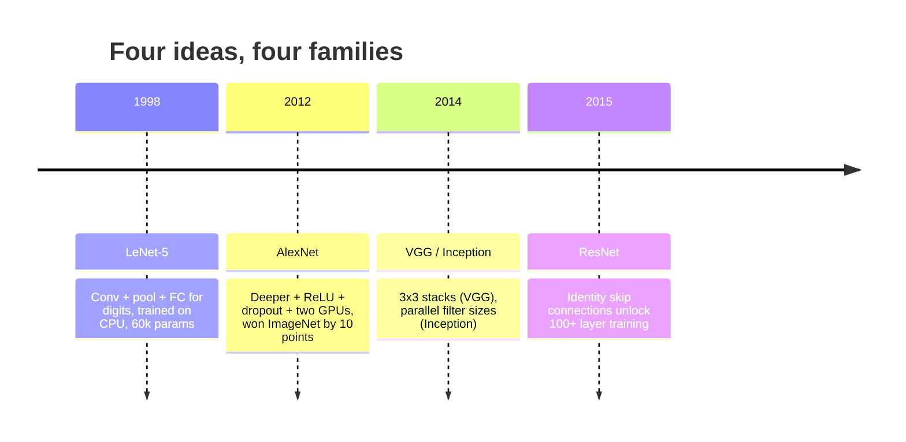
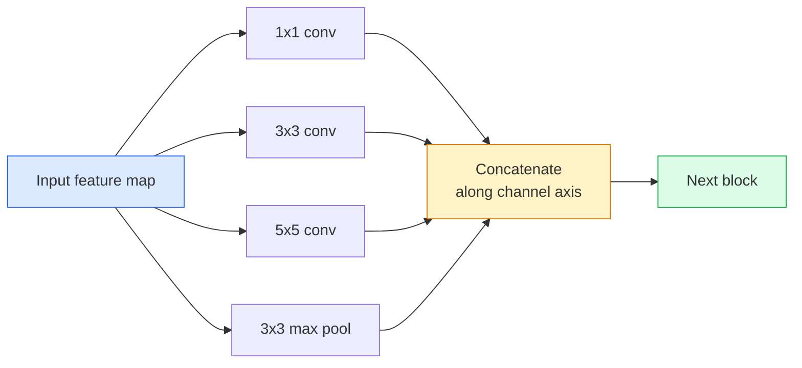

# CNN-y — od LeNet do ResNet

> Każda istotna sieć CNN ostatnich trzydziestu lat to ten sam przepis konwolucja–nieliniowość–zmniejszenie rozmiaru, do którego dodano jeden nowy element. Poznaj te idee po kolei.

**Typ:** Nauka + Budowanie
**Języki:** Python
**Wymagania wstępne:** Faza 3 Lekcja 11 (PyTorch), Faza 4 Lekcja 01 (Podstawy obrazów), Faza 4 Lekcja 02 (Konwolucje od podstaw)
**Czas:** ~75 minut

## Cele nauki

- Prześledzić architektoniczną linię rozwoju LeNet-5 -> AlexNet -> VGG -> Inception -> ResNet i wskazać jedną nową ideę, jaką wniosła każda z tych rodzin
- Zaimplementować LeNet-5, blok w stylu VGG oraz blok ResNet BasicBlock w PyTorch, każdy w mniej niż 40 liniach
- Wyjaśnić, dlaczego połączenia rezydualne zmieniają 1000-warstwową sieć z niemożliwej do wytrenowania w najnowocześniejszą
- Odczytać współczesny szkielet (ResNet-18, ResNet-50) i przewidzieć kształt wyjścia, pole recepcyjne oraz liczbę parametrów, zanim zajrzysz do kodu źródłowego

## Problem

W 2011 roku najlepszy klasyfikator ImageNet osiągał około 74% dokładności top-5. W 2012 roku AlexNet uzyskał 85%. W 2015 roku ResNet osiągnął 96%. Bez nowych danych. Bez nowej generacji GPU. Te zyski wynikały z idei architektonicznych. Praktykujący inżynier wizyjny musi wiedzieć, która idea pochodzi z którego artykułu, ponieważ każdy produkcyjny szkielet, który wdrożysz w 2026 roku, jest rekombinacją tych samych elementów — a także ponieważ te idee nieustannie przenikają między dziedzinami: konwolucje grupowe przeszły z CNN-ów do transformerów, połączenia rezydualne przeszły z ResNet do każdego istniejącego LLM-a, normalizacja wsadowa (batch normalisation) żyje w modelach dyfuzyjnych.

Studiowanie tych sieci w porządku chronologicznym uodparnia cię również na popularny błąd: sięganie po największy dostępny model, gdy sieć rozmiaru LeNet rozwiązałaby problem. MNIST nie potrzebuje ResNet-a. Znajomość krzywej skalowania każdej rodziny mówi ci, gdzie na niej usiąść.

## Koncepcja

### Cztery idee, które zmieniły wizję komputerową



Nic innego w klasycznej wizji komputerowej nie miało takiego znaczenia jak te cztery przełomy.

### LeNet-5 (1998)

Rozpoznawacz cyfr autorstwa Yanna LeCuna. 60 000 parametrów. Dwa bloki konwolucja-pooling, dwie warstwy w pełni połączone, aktywacje tanh. Zdefiniował szablon, który dziedziczy każda CNN:

```
input (1, 32, 32)
  conv 5x5 -> (6, 28, 28)
  avg pool 2x2 -> (6, 14, 14)
  conv 5x5 -> (16, 10, 10)
  avg pool 2x2 -> (16, 5, 5)
  flatten -> 400
  dense -> 120
  dense -> 84
  dense -> 10
```

Wszystko, co współczesny świat nazywa CNN — alternujące konwolucje i zmniejszanie rozmiaru zasilające małą głowicę klasyfikacyjną — to LeNet z większą liczbą warstw, większymi kanałami i lepszymi funkcjami aktywacji.

### AlexNet (2012)

Trzy zmiany, które razem przełamały ImageNet:

1. **ReLU** zamiast tanh. Gradienty nie zanikają. Trenowanie przyspiesza około sześciokrotnie.
2. **Dropout** w głowicy w pełni połączonej. Regularyzacja staje się warstwą, nie sztuczką.
3. **Głębokość i szerokość**. Pięć warstw konwolucyjnych, trzy warstwy gęste, 60M parametrów, trenowane na dwóch GPU z modelem podzielonym między nimi.

Rysunek 2 z artykułu wciąż pokazuje podział na GPU jako dwa równoległe potoki. Ta równoległość była obejściem sprzętowym, nie wglądem architektonicznym — ale trzy idee powyżej wciąż są obecne w każdym modelu, którego używasz.

### VGG (2014)

VGG zadało pytanie: co się stanie, jeśli będziesz używać tylko konwolucji 3x3 i pójdziesz głęboko?

```
stack:   conv 3x3 -> conv 3x3 -> pool 2x2
repeat:  16 or 19 conv layers
```

Dwie konwolucje 3x3 widzą ten sam obszar wejściowy 5x5 co jedna konwolucja 5x5, ale przy mniejszej liczbie parametrów (2*9*C^2 = 18C^2 wobec 25*C^2) i z dodatkowym ReLU pomiędzy nimi. VGG przekształciło tę obserwację w całą architekturę. Prostota — jeden typ bloku, powtarzany — uczyniła ją punktem odniesienia dla wszystkiego, co nastąpiło później.

Koszt: 138M parametrów, wolne trenowanie, drogie wnioskowanie.

### Inception (2014, ten sam rok)

Odpowiedzią Google na pytanie „jakiego rozmiaru jądra (kernela) powinienem użyć?” było: wszystkich, równolegle.



Każda gałąź specjalizuje się — 1x1 do mieszania kanałów, 3x3 do lokalnych tekstur, 5x5 do większych wzorców, pooling do cech niezmienniczych względem przesunięcia — a konkatenacja pozwala następnej warstwie wybrać tę gałąź, która jest przydatna. Inception v1 używał konwolucji 1x1 wewnątrz każdej gałęzi jako wąskiego gardła (bottleneck), aby utrzymać liczbę parametrów w rozsądnych granicach.

### Problem degradacji

Do 2015 roku VGG-19 działało, a VGG-32 nie. Głębokość miała pomagać, ale po przekroczeniu ~20 warstw zarówno strata treningowa, jak i testowa pogarszały się. To nie jest przeuczenie. To optymalizator nie mogący znaleźć użytecznych wag, ponieważ gradienty zmniejszają się multiplikatywnie przez każdą warstwę.

```
Plain deep network:
  y = f_L( f_{L-1}( ... f_1(x) ... ) )

Gradient wrt early layer:
  dL/dW_1 = dL/dy * df_L/df_{L-1} * ... * df_2/df_1 * df_1/dW_1

Each multiplicative term has magnitude roughly (weight magnitude) * (activation gain).
Stack 100 of them with gains < 1 and the gradient is effectively zero.
```

VGG działało przy 19 warstwach, ponieważ normalizacja wsadowa (opublikowana w tym samym czasie) utrzymywała aktywacje w dobrze wyskalowanym zakresie. Ale nawet normalizacja wsadowa nie była w stanie uratować głębokości powyżej ok. 30 warstw.

### ResNet (2015)

He, Zhang, Ren i Sun zaproponowali jedną zmianę, która naprawiła wszystko:

```
standard block:   y = F(x)
residual block:   y = F(x) + x
```

`+ x` oznacza, że warstwa może zawsze wybrać nic nie robić, sprowadzając `F(x)` do zera. 1000-warstwowy ResNet jest teraz w najgorszym przypadku tak słaby jak sieć jednowarstwowa, ponieważ każdy dodatkowy blok ma trywialną „klapę bezpieczeństwa”. Przy takiej gwarancji optymalizator jest gotów uczynić każdy blok *odrobinę* przydatnym — a odrobina użyteczności, złożona 100 razy, daje wynik na poziomie state-of-the-art.


Dwa warianty tego bloku pojawiają się wszędzie:

- **BasicBlock** (ResNet-18, ResNet-34): dwie konwolucje 3x3, skip wokół obu.
- **Bottleneck** (ResNet-50, -101, -152): 1x1 redukujące, 3x3 w środku, 1x1 zwiększające, skip wokół całej trójki. Tańszy, gdy liczba kanałów jest duża.

Gdy połączenie skip musi przekroczyć downsampling (stride=2), ścieżka identyczna jest zastępowana konwolucją 1x1 ze stride=2, aby dopasować kształty.

### Dlaczego połączenia rezydualne mają znaczenie poza wizją komputerową

Ta idea nie dotyczyła tylko klasyfikacji obrazów. Dotyczyła przekształcenia głębokich sieci z „skrzyżuj palce i licz, że gradienty przetrwają” w niezawodne, skalowalne narzędzie inżynierskie. Każdy transformer, o którym przeczytasz w następnej fazie, ma w każdym swoim bloku dokładnie to samo połączenie skip. Bez ResNet-a nie istniałby GPT.

## Zbuduj to

### Krok 1: LeNet-5

Minimalna, wierna LeNet. Aktywacje tanh, average pooling. Jedynym ustępstwem na rzecz nowoczesności jest to, że dalej używamy `nn.CrossEntropyLoss` zamiast oryginalnych połączeń gaussowskich.

```python
import torch
import torch.nn as nn
import torch.nn.functional as F

class LeNet5(nn.Module):
    def __init__(self, num_classes=10):
        super().__init__()
        self.conv1 = nn.Conv2d(1, 6, kernel_size=5)
        self.conv2 = nn.Conv2d(6, 16, kernel_size=5)
        self.pool = nn.AvgPool2d(2)
        self.fc1 = nn.Linear(16 * 5 * 5, 120)
        self.fc2 = nn.Linear(120, 84)
        self.fc3 = nn.Linear(84, num_classes)

    def forward(self, x):
        x = self.pool(torch.tanh(self.conv1(x)))
        x = self.pool(torch.tanh(self.conv2(x)))
        x = torch.flatten(x, 1)
        x = torch.tanh(self.fc1(x))
        x = torch.tanh(self.fc2(x))
        return self.fc3(x)

net = LeNet5()
x = torch.randn(1, 1, 32, 32)
print(f"output: {net(x).shape}")
print(f"params: {sum(p.numel() for p in net.parameters()):,}")
```

Oczekiwany wynik: `output: torch.Size([1, 10])`, `params: 61,706`. To cały klasyfikator cyfr, który zapoczątkował współczesną wizję komputerową.

### Krok 2: Blok VGG

Jeden, wielokrotnie używany blok: dwie konwolucje 3x3, ReLU, normalizacja wsadowa, max pooling.

```python
class VGGBlock(nn.Module):
    def __init__(self, in_c, out_c):
        super().__init__()
        self.conv1 = nn.Conv2d(in_c, out_c, kernel_size=3, padding=1)
        self.bn1 = nn.BatchNorm2d(out_c)
        self.conv2 = nn.Conv2d(out_c, out_c, kernel_size=3, padding=1)
        self.bn2 = nn.BatchNorm2d(out_c)
        self.pool = nn.MaxPool2d(2)

    def forward(self, x):
        x = F.relu(self.bn1(self.conv1(x)))
        x = F.relu(self.bn2(self.conv2(x)))
        return self.pool(x)

class MiniVGG(nn.Module):
    def __init__(self, num_classes=10):
        super().__init__()
        self.stack = nn.Sequential(
            VGGBlock(3, 32),
            VGGBlock(32, 64),
            VGGBlock(64, 128),
        )
        self.head = nn.Sequential(
            nn.AdaptiveAvgPool2d(1),
            nn.Flatten(),
            nn.Linear(128, num_classes),
        )

    def forward(self, x):
        return self.head(self.stack(x))

net = MiniVGG()
x = torch.randn(1, 3, 32, 32)
print(f"output: {net(x).shape}")
print(f"params: {sum(p.numel() for p in net.parameters()):,}")
```

Trzy bloki VGG na wejściu o rozmiarze CIFAR, adaptacyjny pooling, jedna warstwa liniowa. ~290k parametrów. W zupełności wystarczająco dla CIFAR-10.

### Krok 3: Blok ResNet BasicBlock

Podstawowy blok budulcowy ResNet-18 i ResNet-34.

```python
class BasicBlock(nn.Module):
    def __init__(self, in_c, out_c, stride=1):
        super().__init__()
        self.conv1 = nn.Conv2d(in_c, out_c, kernel_size=3, stride=stride, padding=1, bias=False)
        self.bn1 = nn.BatchNorm2d(out_c)
        self.conv2 = nn.Conv2d(out_c, out_c, kernel_size=3, stride=1, padding=1, bias=False)
        self.bn2 = nn.BatchNorm2d(out_c)
        if stride != 1 or in_c != out_c:
            self.shortcut = nn.Sequential(
                nn.Conv2d(in_c, out_c, kernel_size=1, stride=stride, bias=False),
                nn.BatchNorm2d(out_c),
            )
        else:
            self.shortcut = nn.Identity()

    def forward(self, x):
        out = F.relu(self.bn1(self.conv1(x)))
        out = self.bn2(self.conv2(out))
        out = out + self.shortcut(x)
        return F.relu(out)
```

`bias=False` w warstwach konwolucyjnych to konwencja związana z normalizacją wsadową — parametr beta w BN już obsługuje przesunięcie (bias), więc dodatkowe noszenie bias konwolucji byłoby marnotrawstwem. `shortcut` potrzebuje rzeczywistej konwolucji tylko wtedy, gdy zmienia się stride lub liczba kanałów; w przeciwnym razie jest to operacja identycznościowa (no-op).

### Krok 4: Mały ResNet

Złóż cztery grupy bloków BasicBlock, aby uzyskać działający ResNet dla wejść o rozmiarze CIFAR.

```python
class TinyResNet(nn.Module):
    def __init__(self, num_classes=10):
        super().__init__()
        self.stem = nn.Sequential(
            nn.Conv2d(3, 32, kernel_size=3, stride=1, padding=1, bias=False),
            nn.BatchNorm2d(32),
            nn.ReLU(inplace=True),
        )
        self.layer1 = self._make_group(32, 32, num_blocks=2, stride=1)
        self.layer2 = self._make_group(32, 64, num_blocks=2, stride=2)
        self.layer3 = self._make_group(64, 128, num_blocks=2, stride=2)
        self.layer4 = self._make_group(128, 256, num_blocks=2, stride=2)
        self.head = nn.Sequential(
            nn.AdaptiveAvgPool2d(1),
            nn.Flatten(),
            nn.Linear(256, num_classes),
        )

    def _make_group(self, in_c, out_c, num_blocks, stride):
        blocks = [BasicBlock(in_c, out_c, stride=stride)]
        for _ in range(num_blocks - 1):
            blocks.append(BasicBlock(out_c, out_c, stride=1))
        return nn.Sequential(*blocks)

    def forward(self, x):
        x = self.stem(x)
        x = self.layer1(x)
        x = self.layer2(x)
        x = self.layer3(x)
        x = self.layer4(x)
        return self.head(x)

net = TinyResNet()
x = torch.randn(1, 3, 32, 32)
print(f"output: {net(x).shape}")
print(f"params: {sum(p.numel() for p in net.parameters()):,}")
```

Cztery grupy po dwa bloki każda. Stride 2 na początku grup 2, 3 i 4. Liczba kanałów podwaja się przy każdym downsamplingu. Około 2,8M parametrów. To standardowy przepis, który skaluje się płynnie do ResNet-152.

### Krok 5: Porównanie efektywności parametry-do-cech

Przepuść to samo wejście przez wszystkie trzy sieci i porównaj liczby parametrów.

```python
def summary(name, net, x):
    y = net(x)
    params = sum(p.numel() for p in net.parameters())
    print(f"{name:12s}  input {tuple(x.shape)} -> output {tuple(y.shape)}  params {params:>10,}")

x = torch.randn(1, 3, 32, 32)
summary("LeNet5",     LeNet5(),       torch.randn(1, 1, 32, 32))
summary("MiniVGG",    MiniVGG(),      x)
summary("TinyResNet", TinyResNet(),   x)
```

Trzy modele, trzy epoki, trzy rzędy wielkości w liczbie parametrów. Dla dokładności na CIFAR-10 potrzebujesz w przybliżeniu: LeNet 60%, MiniVGG 89%, TinyResNet 93% po kilku epokach treningu.

## Zastosuj to

`torchvision.models` daje ci wstępnie wytrenowane wersje wszystkich powyższych modeli. Sygnatura wywołania jest identyczna we wszystkich rodzinach, co jest właśnie sensem abstrakcji szkieletu (backbone).

```python
from torchvision.models import resnet18, ResNet18_Weights, vgg16, VGG16_Weights

r18 = resnet18(weights=ResNet18_Weights.IMAGENET1K_V1)
r18.eval()

print(f"ResNet-18 params: {sum(p.numel() for p in r18.parameters()):,}")
print(r18.layer1[0])
print()

v16 = vgg16(weights=VGG16_Weights.IMAGENET1K_V1)
v16.eval()
print(f"VGG-16   params: {sum(p.numel() for p in v16.parameters()):,}")
```

ResNet-18 ma 11,7M parametrów. VGG-16 ma 138M. Podobna dokładność top-1 na ImageNet (69,8% wobec 71,6%). Połączenia rezydualne dają ci 12-krotny zysk w efektywności parametrów. To właśnie dlaczego warianty ResNet dominowały od 2016 roku, aż do pojawienia się ViT w 2021 roku — i wciąż dominują w rzeczywistych zastosowaniach produkcyjnych, gdzie ograniczeniem jest moc obliczeniowa.

W transfer learningu przepis jest zawsze ten sam: wczytaj wstępnie wytrenowany model, zamroź szkielet, zastąp głowicę klasyfikacyjną.

```python
for p in r18.parameters():
    p.requires_grad = False
r18.fc = nn.Linear(r18.fc.in_features, 10)
```

Trzy linijki. Masz teraz 10-klasowy klasyfikator CIFAR, który dziedziczy reprezentacje, za które zapłacił ImageNet.

## Dostarcz to

Ta lekcja tworzy:

- `outputs/prompt-backbone-selector.md` — prompt, który wybiera odpowiednią rodzinę CNN (LeNet/VGG/ResNet/MobileNet/ConvNeXt) na podstawie zadania, rozmiaru zbioru danych i budżetu obliczeniowego.
- `outputs/skill-residual-block-reviewer.md` — skill, który czyta moduł PyTorch i wskazuje błędy w połączeniach skip (brak shortcut przy zmianie stride, kolejność aktywacji w shortcut, umiejscowienie BN względem dodawania).

## Ćwiczenia

1. **(Łatwe)** Policz ręcznie parametry dla `TinyResNet` warstwa po warstwie. Porównaj wynik z `sum(p.numel() for p in net.parameters())`. Gdzie idzie większość budżetu parametrów — konwolucje, BN, czy głowica klasyfikacyjna?
2. **(Średnie)** Zaimplementuj blok Bottleneck (1x1 -> 3x3 -> 1x1 ze skip) i użyj go do zbudowania sieci w stylu ResNet-50 dla CIFAR. Porównaj liczbę parametrów z `TinyResNet`.
3. **(Trudne)** Usuń połączenie skip z `BasicBlock`, wytrenuj 34-blokową sieć „płaską” (plain) oraz 34-blokowy ResNet na CIFAR-10, każdy przez 10 epok. Narysuj wykres straty treningowej w funkcji epoki dla obu sieci. Odtwórz wynik z Rysunku 1 w pracy He et al., gdzie płaska głęboka sieć zbiega do wyższej straty niż jej płytszy odpowiednik.

## Kluczowe terminy

| Termin | Co się mówi | Co to faktycznie znaczy |
|------|----------------|----------------------|
| Backbone (szkielet) | „Model” | Stos bloków konwolucyjnych, który produkuje mapę cech podawaną do głowicy zadania |
| Połączenie rezydualne (residual connection) | „Połączenie skip” | `y = F(x) + x`; pozwala optymalizatorowi nauczyć się odwzorowania identycznościowego, ustawiając F na zero, co umożliwia trenowanie sieci o dowolnej głębokości |
| BasicBlock | „Dwie konwolucje 3x3 ze skip” | Blok budulcowy ResNet-18/34: conv-BN-ReLU-conv-BN-dodawanie-ReLU |
| Bottleneck | „1x1 redukcja, 3x3, 1x1 zwiększenie” | Blok ResNet-50/101/152; tani przy dużej liczbie kanałów, ponieważ konwolucja 3x3 działa na zredukowanej szerokości |
| Problem degradacji | „Głębiej znaczy gorzej” | Po przekroczeniu ~20 płaskich warstw konwolucyjnych zarówno błąd treningowy, jak i testowy rosną; rozwiązaniem są połączenia rezydualne, nie więcej danych |
| Stem (trzon) | „Pierwsza warstwa” | Początkowa konwolucja, która przekształca wejście 3-kanałowe w podstawową szerokość cech; zazwyczaj 7x7 stride 2 dla ImageNet, 3x3 stride 1 dla CIFAR |
| Head (głowica) | „Klasyfikator” | Warstwy po ostatnim bloku szkieletu: adaptacyjny pooling, flatten, warstwy liniowe |
| Transfer learning | „Wstępnie wytrenowane wagi” | Wczytanie szkieletu wytrenowanego na ImageNet i dostrojenie tylko głowicy do swojego zadania |

## Dalsza lektura

- [Deep Residual Learning for Image Recognition (He et al., 2015)](https://arxiv.org/abs/1512.03385) — artykuł o ResNet; każdy rysunek jest warty przestudiowania
- [Very Deep Convolutional Networks (Simonyan & Zisserman, 2014)](https://arxiv.org/abs/1409.1556) — artykuł o VGG; wciąż najlepsze źródło na temat „dlaczego 3x3”
- [ImageNet Classification with Deep CNNs (Krizhevsky et al., 2012)](https://papers.nips.cc/paper_files/paper/2012/hash/c399862d3b9d6b76c8436e924a68c45b-Abstract.html) — AlexNet; artykuł, który zakończył erę ręcznie projektowanych cech
- [Going Deeper with Convolutions (Szegedy et al., 2014)](https://arxiv.org/abs/1409.4842) — Inception v1; idea równoległych filtrów, która wciąż pojawia się w wizyjnych transformerach
