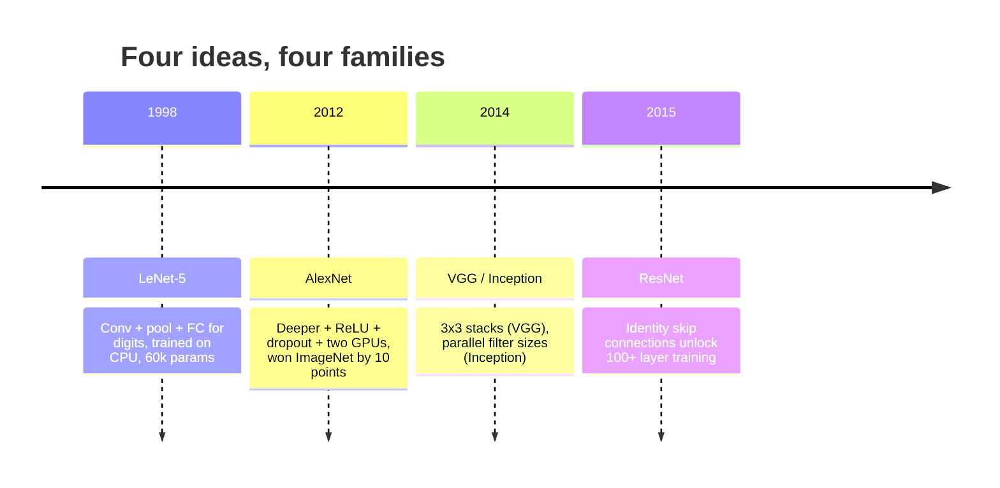
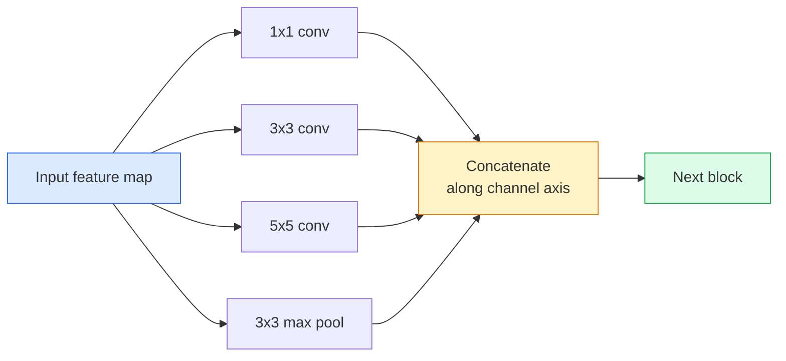
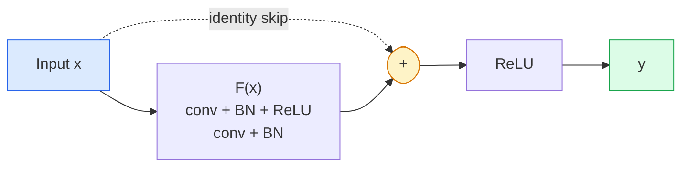

# CNN — LeNet do ResNet

> Każda większa CNN ostatnich trzydziestu lat stosuje ten sam przepis na konwersję – nieliniowość – próbkowanie w dół, z jednym nowym pomysłem. Naucz się pomysłów w kolejności.

**Typ:** Ucz się + Buduj
**Języki:** Python
**Wymagania wstępne:** Faza 3 Lekcja 11 (PyTorch), Faza 4 Lekcja 01 (Podstawy obrazu), Faza 4 Lekcja 02 (Skręcenia od podstaw)
**Czas:** ~75 minut

## Cele nauczania

- Prześledź linię architektoniczną LeNet-5 -> AlexNet -> VGG -> Incepcja -> ResNet i podaj nowy pomysł, który wniosła każda rodzina
- Zaimplementuj LeNet-5, blok w stylu VGG i ResNet BasicBlock w PyTorch, każdy poniżej 40 linii
- Wyjaśnij, dlaczego resztkowe połączenia zmieniają 1000-warstwową sieć z niemożliwej do szkolenia w najnowocześniejszą
- Przeczytaj nowoczesny szkielet (ResNet-18, ResNet-50) i przewiduj jego kształt wyjściowy, pole odbiorcze i liczbę parametrów przed spojrzeniem na źródło

## Problem

W 2011 r. najlepszy klasyfikator ImageNet uzyskał około 74% dokładności w pierwszej piątce. W 2012 roku AlexNet uzyskał 85%. W 2015 roku ResNet uzyskał 96%. Brak nowych danych. Brak nowej generacji procesorów graficznych. Zyski pochodziły z pomysłów architektonicznych. Pracujący inżynier ds. wizji musi wiedzieć, który pomysł pochodzi z której gazety, ponieważ każdy szkielet produkcyjny, który wyślesz w 2026 r., jest rekombinacją tych samych elementów, a także ponieważ pomysły ciągle się przenoszą: zgrupowane konwersje przeszły z CNN do transformatorów, resztkowe połączenia przeszły z ResNet do wszystkich istniejących LLM, normalizacja partii funkcjonuje w modelach dyfuzyjnych.

Porządne przestudiowanie tych sieci uodpornia Cię również na powszechny błąd: sięgnięcie po największy dostępny model, gdy sieć wielkości LeNet rozwiązałaby problem. MNIST nie potrzebuje ResNet. Znajomość krzywej skalowania każdej rodziny podpowiada, gdzie na niej usiąść.

## Koncepcja

### Cztery pomysły, które zmieniły wizję



Nic innego w klasycznej wizji nie liczyło się tak bardzo, jak te cztery skoki.

### LeNet-5 (1998)

Rozpoznawanie cyfr Yanna LeCuna. 60 000 parametrów. Dwa bloki puli konwersji, dwie w pełni połączone warstwy, aktywacje tanh. Zdefiniował szablon, który dziedziczy każde CNN:

```
input (1, 32, 32)
  conv 5x5 -> (6, 28, 28)
  avg pool 2x2 -> (6, 14, 14)
  conv 5x5 -> (16, 10, 10)
  avg pool 2x2 -> (16, 5, 5)
  flatten -> 400
  dense -> 120
  dense -> 84
  dense -> 10
```

Wszystko, co współczesny świat nazywa CNN – naprzemienne sploty i próbkowanie zasilane przez małą głowicę klasyfikatora – to LeNet z większą liczbą warstw, większymi kanałami i lepszymi aktywacjami.

### AlexNet (2012)

Trzy zmiany, które razem zepsuły ImageNet:

1. **ReLU** zamiast tanh. Gradienty przestają znikać. Trening przyspiesza sześciokrotnie.
2. **Zanik** w całkowicie podłączonej głowicy. Regularyzacja staje się warstwą, a nie sztuczką.
3. **Głębokość i szerokość**. Pięć warstw konwulsyjnych, trzy warstwy gęste, parametry 60M, trenowane na dwóch procesorach graficznych z podzielonym na nie modelem.

Rysunek 2 w artykule nadal pokazuje podział procesora graficznego na dwa równoległe strumienie. Ta równoległość była rozwiązaniem sprzętowym, a nie spostrzeżeniem architektonicznym — ale trzy powyższe pomysły są nadal obecne w każdym używanym modelu.

### VGG (2014)

VGG zapytał: co się stanie, jeśli użyjesz tylko zwojów 3x3 i zejdziesz głęboko?

```
stack:   conv 3x3 -> conv 3x3 -> pool 2x2
repeat:  16 or 19 conv layers
```

Dwie konwersje 3x3 widzą ten sam obszar wejściowy 5x5, co jedna konwersja 5x5, ale z mniejszą liczbą parametrów (2*9*C^2 = 18C^2 vs 25*C^2) i dodatkową ReLU pomiędzy nimi. VGG przekształciło tę obserwację w całą architekturę. Prostota — jeden typ bloku, powtarzalny — uczyniła z niego punkt odniesienia dla wszystkiego, co nastąpiło później.

Koszt: parametry 138M, powolne w uczeniu, drogie przy wnioskowaniu.

### Incepcja (2014, ten sam rok)

Odpowiedź Google na pytanie „jakiego rozmiaru jądra powinienem użyć?” było: wszystkie, równolegle.



Każda gałąź się specjalizuje — 1x1 w miksowaniu kanałów, 3x3 w przypadku tekstur lokalnych, 5x5 w przypadku większych wzorów, łączenie w przypadku funkcji niezmiennych przy przesunięciu - a konkat pozwala następnej warstwie wybrać dowolną gałąź, która jest przydatna. Incepcja v1 wykorzystywała zwoje 1x1 wewnątrz każdej gałęzi jako wąskie gardło, aby utrzymać prawidłową liczbę parametrów.

### Problem degradacji

Do 2015 roku VGG-19 działał, a VGG-32 nie. Głębokość miała pomóc, ale po ~20 warstwach zarówno straty podczas treningu, jak i testów uległy pogorszeniu. To nie jest nadmierne dopasowanie. Oznacza to, że optymalizator nie znajduje użytecznych wag, ponieważ gradienty kurczą się multiplikatywnie w każdej warstwie.

```
Plain deep network:
  y = f_L( f_{L-1}( ... f_1(x) ... ) )

Gradient wrt early layer:
  dL/dW_1 = dL/dy * df_L/df_{L-1} * ... * df_2/df_1 * df_1/dW_1

Each multiplicative term has magnitude roughly (weight magnitude) * (activation gain).
Stack 100 of them with gains < 1 and the gradient is effectively zero.
```

VGG pracowało na 19 warstwach, ponieważ norma wsadowa (opublikowana jednocześnie) zapewniała odpowiednią skalę aktywacji. Ale nawet norma wsadowa nie była w stanie uratować głębokości przekraczającej 30 warstw.

### ResNet (2015)

On, Zhang, Ren i Sun zaproponowali jedną zmianę, która wszystko naprawiła:

```
standard block:   y = F(x)
residual block:   y = F(x) + x
```

Wartość `+ x` oznacza, że warstwa może zawsze nie robić nic, ustawiając `F(x)` na zero. 1000-warstwowa sieć ResNet jest obecnie co najwyżej tak samo zła jak sieć 1-warstwowa, ponieważ każdy dodatkowy blok ma trywialny luk ratunkowy. Mając tę ​​gwarancję, optymalizator jest skłonny uczynić każdy blok *trochę* użytecznym — a nieco użyteczny, ułożony 100 razy, jest najnowocześniejszy.



Wszędzie pojawiają się dwa warianty bloku:

- **BasicBlock** (ResNet-18, ResNet-34): dwie konwersje 3x3, pomiń obie.
- **Wąskie gardło** (ResNet-50, -101, -152): 1x1 w dół, 3x3 w środku, 1x1 w górę, pomiń trio. Tańsze, gdy liczba kanałów jest duża.

Kiedy pominięcie musi przekroczyć próbkę w dół (krok=2), ścieżka tożsamości zostaje zastąpiona konwersją 1x1 krok=2 w celu dopasowania kształtów.

### Dlaczego pozostałości mają znaczenie poza zasięgiem wzroku

Pomysł tak naprawdę nie dotyczył klasyfikacji obrazów. Chodziło o przekształcenie głębokich sieci z „trzeba trzymać kciuki i mieć nadzieję, że gradienty przetrwają” w niezawodne, skalowalne narzędzie inżynieryjne. Każdy transformator, o którym przeczytasz o następnej fazie, ma dokładnie takie samo połączenie pomijane w każdym bloku. Bez ResNet nie ma GPT.

## Zbuduj to

### Krok 1: LeNet-5

Minimalny, wierny LeNet. Aktywacje Tanha, średnie łączenie. Jedynym ustępstwem na rzecz nowoczesności jest to, że zamiast oryginalnych połączeń Gaussa używamy `nn.CrossEntropyLoss` poniżej.

```python
import torch
import torch.nn as nn
import torch.nn.functional as F

class LeNet5(nn.Module):
    def __init__(self, num_classes=10):
        super().__init__()
        self.conv1 = nn.Conv2d(1, 6, kernel_size=5)
        self.conv2 = nn.Conv2d(6, 16, kernel_size=5)
        self.pool = nn.AvgPool2d(2)
        self.fc1 = nn.Linear(16 * 5 * 5, 120)
        self.fc2 = nn.Linear(120, 84)
        self.fc3 = nn.Linear(84, num_classes)

    def forward(self, x):
        x = self.pool(torch.tanh(self.conv1(x)))
        x = self.pool(torch.tanh(self.conv2(x)))
        x = torch.flatten(x, 1)
        x = torch.tanh(self.fc1(x))
        x = torch.tanh(self.fc2(x))
        return self.fc3(x)

net = LeNet5()
x = torch.randn(1, 1, 32, 32)
print(f"output: {net(x).shape}")
print(f"params: {sum(p.numel() for p in net.parameters()):,}")
```

Oczekiwany wynik: `output: torch.Size([1, 10])`, `params: 61,706`. To jest cały klasyfikator cyfr, który zapoczątkował współczesną wizję.

### Krok 2: Blok VGG

Jeden blok wielokrotnego użytku: dwie konwersje 3x3, ReLU, norma wsadowa, maksymalna pula.

```python
class VGGBlock(nn.Module):
    def __init__(self, in_c, out_c):
        super().__init__()
        self.conv1 = nn.Conv2d(in_c, out_c, kernel_size=3, padding=1)
        self.bn1 = nn.BatchNorm2d(out_c)
        self.conv2 = nn.Conv2d(out_c, out_c, kernel_size=3, padding=1)
        self.bn2 = nn.BatchNorm2d(out_c)
        self.pool = nn.MaxPool2d(2)

    def forward(self, x):
        x = F.relu(self.bn1(self.conv1(x)))
        x = F.relu(self.bn2(self.conv2(x)))
        return self.pool(x)

class MiniVGG(nn.Module):
    def __init__(self, num_classes=10):
        super().__init__()
        self.stack = nn.Sequential(
            VGGBlock(3, 32),
            VGGBlock(32, 64),
            VGGBlock(64, 128),
        )
        self.head = nn.Sequential(
            nn.AdaptiveAvgPool2d(1),
            nn.Flatten(),
            nn.Linear(128, num_classes),
        )

    def forward(self, x):
        return self.head(self.stack(x))

net = MiniVGG()
x = torch.randn(1, 3, 32, 32)
print(f"output: {net(x).shape}")
print(f"params: {sum(p.numel() for p in net.parameters()):,}")
```

Trzy bloki VGG na wejściu wielkości CIFAR, pula adaptacyjna, jedna warstwa liniowa. ~290 tys. parametrów. Dużo jak na CIFAR-10.

### Krok 3: Blok ResNet BasicBlock

Podstawowy element konstrukcyjny ResNet-18 i ResNet-34.

```python
class BasicBlock(nn.Module):
    def __init__(self, in_c, out_c, stride=1):
        super().__init__()
        self.conv1 = nn.Conv2d(in_c, out_c, kernel_size=3, stride=stride, padding=1, bias=False)
        self.bn1 = nn.BatchNorm2d(out_c)
        self.conv2 = nn.Conv2d(out_c, out_c, kernel_size=3, stride=1, padding=1, bias=False)
        self.bn2 = nn.BatchNorm2d(out_c)
        if stride != 1 or in_c != out_c:
            self.shortcut = nn.Sequential(
                nn.Conv2d(in_c, out_c, kernel_size=1, stride=stride, bias=False),
                nn.BatchNorm2d(out_c),
            )
        else:
            self.shortcut = nn.Identity()

    def forward(self, x):
        out = F.relu(self.bn1(self.conv1(x)))
        out = self.bn2(self.conv2(out))
        out = out + self.shortcut(x)
        return F.relu(out)
```

`bias=False` w warstwach konwersji to konwencja dotycząca normy wsadowej — parametr beta BN już obsługuje obciążenie, więc przenoszenie również odchylenia od konwersji jest marnotrawstwem. `shortcut` potrzebuje prawdziwej konwersji tylko wtedy, gdy zmienia się liczba kroków lub kanałów; w przeciwnym razie jest to tożsamość bez opcji.

### Krok 4: Mały ResNet

Ułóż cztery grupy BasicBlocków, aby uzyskać działającą sieć ResNet dla wejść wielkości CIFAR.

```python
class TinyResNet(nn.Module):
    def __init__(self, num_classes=10):
        super().__init__()
        self.stem = nn.Sequential(
            nn.Conv2d(3, 32, kernel_size=3, stride=1, padding=1, bias=False),
            nn.BatchNorm2d(32),
            nn.ReLU(inplace=True),
        )
        self.layer1 = self._make_group(32, 32, num_blocks=2, stride=1)
        self.layer2 = self._make_group(32, 64, num_blocks=2, stride=2)
        self.layer3 = self._make_group(64, 128, num_blocks=2, stride=2)
        self.layer4 = self._make_group(128, 256, num_blocks=2, stride=2)
        self.head = nn.Sequential(
            nn.AdaptiveAvgPool2d(1),
            nn.Flatten(),
            nn.Linear(256, num_classes),
        )

    def _make_group(self, in_c, out_c, num_blocks, stride):
        blocks = [BasicBlock(in_c, out_c, stride=stride)]
        for _ in range(num_blocks - 1):
            blocks.append(BasicBlock(out_c, out_c, stride=1))
        return nn.Sequential(*blocks)

    def forward(self, x):
        x = self.stem(x)
        x = self.layer1(x)
        x = self.layer2(x)
        x = self.layer3(x)
        x = self.layer4(x)
        return self.head(x)

net = TinyResNet()
x = torch.randn(1, 3, 32, 32)
print(f"output: {net(x).shape}")
print(f"params: {sum(p.numel() for p in net.parameters()):,}")
```

Cztery grupy po dwa bloki każda. Krok 2 na początku grup 2, 3, 4. Liczba kanałów podwaja się przy każdym próbkowaniu w dół. Około 2,8 mln parametrów. Jest to standardowy przepis, który można skalować aż do ResNet-152.

### Krok 5: Porównanie wydajności parametrów i funkcji

Uruchom te same dane wejściowe we wszystkich trzech sieciach i porównaj liczbę parametrów.

```python
def summary(name, net, x):
    y = net(x)
    params = sum(p.numel() for p in net.parameters())
    print(f"{name:12s}  input {tuple(x.shape)} -> output {tuple(y.shape)}  params {params:>10,}")

x = torch.randn(1, 3, 32, 32)
summary("LeNet5",     LeNet5(),       torch.randn(1, 1, 32, 32))
summary("MiniVGG",    MiniVGG(),      x)
summary("TinyResNet", TinyResNet(),   x)
```

Trzy modele, trzy epoki, trzy rzędy wielkości liczby parametrów. Do dokładności CIFAR-10 potrzeba mniej więcej: LeNet 60%, MiniVGG 89%, TinyResNet 93% po kilku epokach treningu.

## Użyj tego

`torchvision.models` udostępnia wstępnie wyszkolone wersje wszystkich powyższych. Sygnatura wywołania jest identyczna we wszystkich rodzinach, co jest dokładnie punktem abstrakcji szkieletu.

```python
from torchvision.models import resnet18, ResNet18_Weights, vgg16, VGG16_Weights

r18 = resnet18(weights=ResNet18_Weights.IMAGENET1K_V1)
r18.eval()

print(f"ResNet-18 params: {sum(p.numel() for p in r18.parameters()):,}")
print(r18.layer1[0])
print()

v16 = vgg16(weights=VGG16_Weights.IMAGENET1K_V1)
v16.eval()
print(f"VGG-16   params: {sum(p.numel() for p in v16.parameters()):,}")
```

ResNet-18 ma parametry 11,7M. VGG-16 ma 138M. Podobna dokładność pierwszego miejsca w ImageNet (69,8% w porównaniu z 71,6%). Resztkowe połączenia zapewniają 12-krotną wydajność w zakresie parametrów. Właśnie dlatego warianty ResNet dominowały od 2016 r. do pojawienia się ViT w 2021 r. i nadal dominują w rzeczywistych wdrożeniach, w których ograniczeniem są obliczenia.

W przypadku uczenia transferowego przepis jest zawsze ten sam: załaduj wstępnie przeszkolony, zamroź szkielet, wymień głowicę klasyfikatora.

```python
for p in r18.parameters():
    p.requires_grad = False
r18.fc = nn.Linear(r18.fc.in_features, 10)
```

Trzy linie. Masz teraz 10-klasowy klasyfikator CIFAR, który dziedziczy reprezentacje, za które zapłacił ImageNet.

## Wyślij to

Ta lekcja daje:

- `outputs/prompt-backbone-selector.md` — podpowiedź, która wybiera właściwą rodzinę CNN (LeNet/VGG/ResNet/MobileNet/ConvNeXt) pod kątem zadania, rozmiaru zbioru danych i budżetu obliczeniowego.
- `outputs/skill-residual-block-reviewer.md` — umiejętność odczytująca moduł PyTorch i sygnalizująca błędy związane z pominięciem połączenia (brak skrótu przy zmianie kroku, kolejność aktywacji skrótu, położenie BN względem dodawania).

## Ćwiczenia

1. **(Łatwe)** Zlicz ręcznie parametry `TinyResNet` warstwa po warstwie. Porównaj z `sum(p.numel() for p in net.parameters())`. Gdzie trafia większość budżetu parametrów – konwersje, BN czy głowa klasyfikatora?
2. **(Średni)** Zaimplementuj blok wąskiego gardła (1x1 -> 3x3 -> 1x1 z pominięciem) i użyj go do zbudowania sieci w stylu ResNet-50 dla CIFAR. Porównaj parametry z `TinyResNet`.
3. **(Trudne)** Usuń połączenie pomijane z `BasicBlock`, naucz 34-blokową „zwykłą” sieć i 34-blokową sieć ResNet na CIFAR-10 przez 10 epok każda. Narysuj stratę w treningu w zależności od epoki dla obu. Odtwórz He et al. Rysunek 1 przedstawia wynik, w którym zwykła głęboka sieć zbiega się, powodując większe straty niż jej płytsza bliźniaczka.

## Kluczowe terminy

| Termin | Co ludzie mówią | Co to właściwie oznacza |
|------|----------------|----------------------|
| Kręgosłup | „Modelka” | Stos bloków splotowych tworzący mapę funkcji przekazywaną do głowy zadania |
| Połączenie resztkowe | „Pomiń połączenie” | `y = F(x) + x`; pozwala optymalizatorowi nauczyć się tożsamości, ustawiając F na zero, co umożliwia wytrenowanie dowolnej głębokości |
| PodstawowyBlok | „Dwie konwersacje 3x3 z pominięciem” | Element konstrukcyjny ResNet-18/34: conv-BN-ReLU-conv-BN-add-ReLU |
| Wąskie gardło | „1x1 w dół, 3x3, 1x1 w górę” | Blok ResNet-50/101/152; tani przy dużej liczbie kanałów, ponieważ 3x3 działa na zmniejszonej szerokości |
| Problem degradacji | „Głęboko znaczy gorzej” | Po około 20 zwykłych warstwach konwersji wzrastają błędy zarówno podczas treningu, jak i testu; rozwiązany przez resztkowe połączenia, a nie przez więcej danych |
| Łodyga | „Pierwsza warstwa” | Początkowa konwersja, która konwertuje 3-kanałowe wejście na szerokość elementu bazowego; zwykle 7x7 krok 2 dla ImageNet, 3x3 krok 1 dla CIFAR |
| Głowa | „Klasyfikator” | Warstwy po ostatnim bloku szkieletowym: pula adaptacyjna, spłaszczenie, liniowość |
| Przenieś naukę | „Wstępnie wytrenowane ciężary” | Ładowanie szkieletu wytrenowanego w ImageNet i dostrajanie tylko głowy do zadania |

## Dalsze czytanie

- [Deep Residual Learning for Image Recognition (He et al., 2015)](https://arxiv.org/abs/1512.03385) — artykuł ResNet; każda liczba jest warta przestudiowania
- [Very Deep Convolutional Networks (Simonyan i Zisserman, 2014)] (https://arxiv.org/abs/1409.1556) – artykuł VGG; wciąż najlepsze odniesienie do „dlaczego 3x3”
- [Klasyfikacja ImageNet z głębokimi CNN (Krizhevsky i in., 2012)](https://papers.nips.cc/paper_files/paper/2012/hash/c399862d3b9d6b76c8436e924a68c45b-Abstract.html) — AlexNet; papier, który zakończył erę rękodzieła
- [Going Deeper with Convolutions (Szegedy et al., 2014)](https://arxiv.org/abs/1409.4842) — Incepcja v1; pomysł filtra równoległego, który wciąż pojawia się w transformatorach wizyjnych