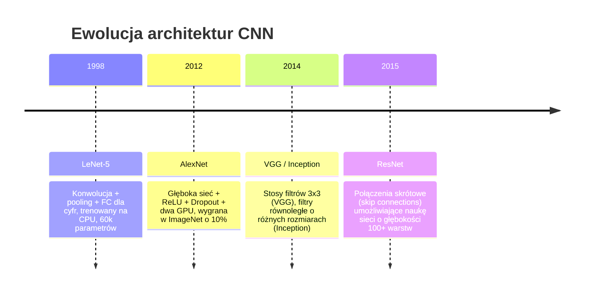
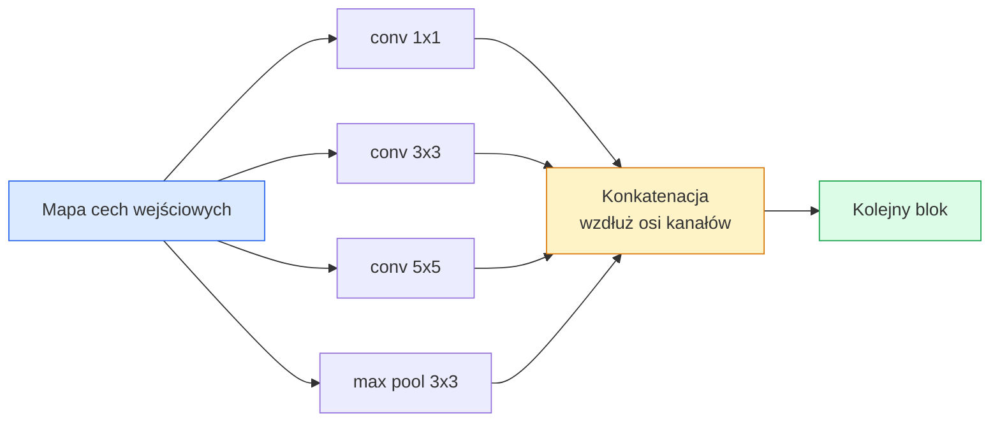
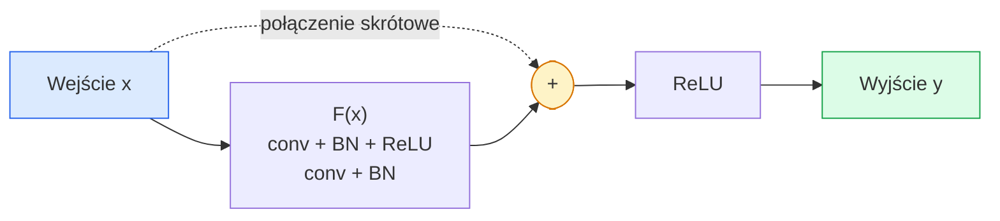

# CNN — od LeNet do ResNet

> Każda wiodąca architektura CNN stworzona w ciągu ostatnich trzydziestu lat wykorzystuje ten sam podstawowy schemat: konwolucja – nieliniowość – pooling (próbkowanie w dół), wzbogacony o jedną nową koncepcję. Poznaj te idee w kolejności ich powstawania.

**Typ:** Teoria + Implementacja  
**Języki:** Python, PyTorch  
**Wymagania wstępne:** Faza 3 Lekcja 11 (PyTorch), Faza 4 Lekcja 01 (Podstawy przetwarzania obrazu), Faza 4 Lekcja 02 (Konwolucje od zera)  
**Czas:** ~75 minut  

## Cele kształcenia

- Prześledzenie ewolucji architektonicznej: LeNet-5 -> AlexNet -> VGG -> Inception -> ResNet oraz wskazanie innowacji wniesionej przez każdą z tych rodzin.
- Zaimplementowanie modeli LeNet-5, bloku w stylu VGG oraz bloku BasicBlock z ResNet w PyTorch (każdy w niespełna 40 liniach kodu).
- Wyjaśnienie, dlaczego połączenia skrótowe (residual/skip connections) pozwalają na bezproblemowe uczenie sieci o głębokości nawet 1000 warstw.
- Analiza struktury modeli (ResNet-18, ResNet-50) oraz wyznaczanie ich wymiarów wyjściowych, pola receptywnego (receptive field) i liczby parametrów przed analizą kodu źródłowego.

## Problem

W 2011 roku najlepsze klasyfikatory na zbiorze ImageNet osiągały dokładność typu top-5 na poziomie około 74%. W 2012 roku model AlexNet osiągnął 85%, a w 2015 roku ResNet przekroczył próg 96%. Wyniki te osiągnięto bez modyfikacji zbioru danych czy rewolucji sprzętowej. Skok jakościowy wynikał wyłącznie z innowacji architektonicznych.

Inżynier zajmujący się wizją komputerową musi znać te kamienie milowe. Każda nowoczesna sieć wysyłana na produkcję to kombinacja tych samych, sprawdzonych bloków. Co więcej, koncepcje te stale migrują między dziedzinami: konwolucje grupowane (grouped convolutions) trafiły z CNN do Transformerów, połączenia skrótowe z ResNet stanowią fundament wszystkich modeli LLM, a normalizacja wsadowa (BatchNorm) jest powszechnie stosowana w modelach dyfuzyjnych.

Zrozumienie tych architektur chroni również przed częstym błędem: sięganiem po ogromne modele w sytuacjach, gdy problem rozwiązałaby sieć wielkości klasycznego LeNet. MNIST nie potrzebuje ResNetu. Znajomość charakterystyki poszczególnych rodzin pozwala na optymalny dobór modelu do skali problemu.

## Koncepcja

### Cztery kroki milowe wizji komputerowej



Te cztery architektury zdefiniowały współczesną wizję komputerową.

### LeNet-5 (1998)

Stworzona przez Yanna LeCuna sieć do rozpoznawania pisma odręcznego. Posiada 60 000 parametrów, dwa bloki konwolucyjno-poolingowe, dwie warstwy w pełni połączone oraz aktywacje tanh. Zdefiniowała szablon struktury sieci CNN stosowany do dziś:

```
wejście (1, 32, 32)
  conv 5x5 -> (6, 28, 28)
  avg pool 2x2 -> (6, 14, 14)
  conv 5x5 -> (16, 10, 10)
  avg pool 2x2 -> (16, 5, 5)
  flatten -> 400
  dense -> 120
  dense -> 84
  dense -> 10
```

Współczesne sieci CNN (naprzemienne konwolucje i pooling zwieńczone głowicą klasyfikacyjną) to w gruncie rzeczy rozwinięcie schematu LeNet o większą liczbę warstw, szersze kanały i lepsze funkcje aktywacji.

### AlexNet (2012)

Trzy kluczowe modyfikacje, które zrewolucjonizowały wyniki na zbiorze ImageNet:

1. **Funkcja ReLU** zamiast tanh: zapobiega nasycaniu się gradientów i przyspiesza uczenie około 6-krotnie.
2. **Dropout** w głowicy klasyfikatora: regularyzacja staje się jawnym komponentem sieci.
3. **Zwiększenie skali**: pięć warstw konwolucyjnych, trzy warstwy w pełni połączone, 60 milionów parametrów, uczenie rozproszone na dwóch procesorach GPU.

Oryginalny schemat sieci w artykule pokazywał podział obliczeń na dwa strumienie GPU – było to rozwiązanie czysto inżynieryjne, podyktowane ówczesnymi ograniczeniami sprzętowymi, jednak same zasady projektowania do dziś pozostają aktualne.

### VGG (2014)

Autorzy VGG postawili pytanie: co się stanie, jeśli uprościmy architekturę, stosując wyłącznie filtry o rozmiarze $3 \times 3$, i zwiększymy głębokość sieci?

```
Blok podstawowy:  conv 3x3 -> conv 3x3 -> pool 2x2
Struktura:        16 lub 19 warstw konwolucyjnych
```

Dwie następujące po sobie konwolucje $3 \times 3$ mają takie samo pole receptywne (receptive field) jak jedna konwolucja $5 \times 5$, ale wymagają mniejszej liczby parametrów ($2 \cdot 9 \cdot C^2 = 18C^2$ w porównaniu do $25C^2$) i wprowadzają dodatkową nieliniowość ReLU pomiędzy nimi. VGG sprowadziło tę koncepcję do powtarzalnego bloku, tworząc uniwersalny punkt odniesienia w badaniach nad wizją komputerową.

Wada: model o rozmiarze 138M parametrów jest kosztowny obliczeniowo i pamięciowo zarówno podczas treningu, jak i wnioskowania.

### Inception (2014)

Google odpowiedziało na pytanie o optymalny rozmiar filtra konwolucyjnego w inny sposób: zastosujmy filtry o różnych rozmiarach równolegle w ramach jednego bloku.



Każda gałąź bloku Inception specjalizuje się w innych cechach: 1x1 miesza kanały, 3x3 skupia się na lokalnych teksturach, 5x5 wychwytuje większe kształty, a pooling zapewnia niezmienność przesunięcia (translation invariance). Łączenie (konkatenacja) pozwala kolejnej warstwie wybrać najbardziej przydatne informacje. Wersja v1 wprowadziła konwolucje 1x1 przed filtrami większymi w celu redukcji wymiarowości i ograniczenia kosztu parametrycznego.

### Problem degradacji (Degradation Problem)

Do 2015 roku okazywało się, że o ile sieć VGG-19 działa poprawnie, o tyle wariant VGG-32 uczy się znacznie gorzej. Po przekroczeniu około 20 warstw wartość straty na zbiorze treningowym i testowym zaczynała rosnąć. Nie był to problem przeuczenia (overfittingu), lecz trudność optymalizacyjna – gradienty maleją iloczynowo z każdą kolejną warstwą.

```
Zwykła głęboka sieć:
  y = f_L( f_{L-1}( ... f_1(x) ... ) )

Gradient względem początkowej warstwy:
  dL/dW_1 = dL/dy * df_L/df_{L-1} * ... * df_2/df_1 * df_1/dW_1
```

Każdy składnik iloczynu zależy od wag i pochodnej funkcji aktywacji. Jeśli ich amplituda jest mniejsza niż 1, gradient dla początkowych warstw drastycznie zanika do zera. W sieciach VGG sytuację ratował BatchNorm (zapewniający odpowiednią skalę aktywacji), ale nawet on nie pozwalał na stabilną naukę sieci głębszych niż 30 warstw.

### ResNet (2015)

Kaiming He i jego zespół zaproponowali proste, ale rewolucyjne rozwiązanie:

```
Zwykły blok:  y = F(x)
Blok ResNet:  y = F(x) + x
```

Operacja `+ x` gwarantuje, że warstwa może w najgorszym wypadku przekazać sygnał wejściowy bez zmian, jeśli blok $F(x)$ zostanie wyzerowany. Dzięki temu sieć o głębokości 1000 warstw nie jest trudniejsza w optymalizacji niż sieć jednowarstwowa. Mając taką gwarancję matematyczną, optymalizator może dostosować wagi każdego bloku tak, aby wnosiły one niewielką, ale stabilną poprawę jakości.



W architekturze ResNet najczęściej występują dwa rodzaje bloków:

- **BasicBlock** (ResNet-18, ResNet-34): dwie konwolucje $3 \times 3$ z połączeniem skrótowym nad nimi.
- **Bottleneck** (ResNet-50, -101, -152): sekwencja konwolucji 1x1 (redukcja kanałów) -> 3x3 -> 1x1 (odtworzenie kanałów) z połączeniem skrótowym. Rozwiązanie to jest znacznie tańsze obliczeniowo przy dużej liczbie kanałów.

Gdy połączenie skrótowe musi przejść przez operację próbkowania w dół (stride=2), ścieżka tożsamości jest zastępowana konwolucją 1x1 o kroku stride=2 w celu dopasowania wymiarów tensorów.

### Dlaczego ResNet zmienił wszystko

Koncepcja ta wykracza daleko poza klasyfikację obrazów. Pozwoliła na przejście od intuicyjnego projektowania głębokich sieci do skalowalnych i przewidywalnych systemów inżynieryjnych. Każdy współczesny model typu Transformer posiada dokładnie takie same połączenia skrótowe (skip connections) w każdym bloku. Bez ResNetu stworzenie modeli takich jak GPT czy Claude byłoby niemożliwe.

## Implementacja krok po kroku

### Krok 1: Model LeNet-5

Klasyczna implementacja sieci LeNet-5. Stosujemy oryginalne aktywacje tanh oraz pooling średni (Average Pooling). Jedynym nowoczesnym uproszczeniem jest użycie standardowej funkcji straty `nn.CrossEntropyLoss` na wyjściu.

```python
import torch
import torch.nn as nn
import torch.nn.functional as F

class LeNet5(nn.Module):
    def __init__(self, num_classes=10):
        super().__init__()
        self.conv1 = nn.Conv2d(1, 6, kernel_size=5)
        self.conv2 = nn.Conv2d(6, 16, kernel_size=5)
        self.pool = nn.AvgPool2d(2)
        self.fc1 = nn.Linear(16 * 5 * 5, 120)
        self.fc2 = nn.Linear(120, 84)
        self.fc3 = nn.Linear(84, num_classes)

    def forward(self, x):
        x = self.pool(torch.tanh(self.conv1(x)))
        x = self.pool(torch.tanh(self.conv2(x)))
        x = torch.flatten(x, 1)
        x = torch.tanh(self.fc1(x))
        x = torch.tanh(self.fc2(x))
        return self.fc3(x)

net = LeNet5()
x = torch.randn(1, 1, 32, 32)
print(f"Wyjście LeNet-5: {net(x).shape}")
print(f"Parametry LeNet-5: {sum(p.numel() for p in net.parameters()):,}")
```

Oczekiwane wartości: kształt wyjściowy `torch.Size([1, 10])`, liczba parametrów `61,706`.

### Krok 2: Konstrukcja bloku VGG

Uniwersalny, powtarzalny blok: dwie konwolucje 3x3 z dopełnieniem (padding=1), BatchNorm oraz Max Pooling.

```python
class VGGBlock(nn.Module):
    def __init__(self, in_c, out_c):
        super().__init__()
        self.conv1 = nn.Conv2d(in_c, out_c, kernel_size=3, padding=1)
        self.bn1 = nn.BatchNorm2d(out_c)
        self.conv2 = nn.Conv2d(out_c, out_c, kernel_size=3, padding=1)
        self.bn2 = nn.BatchNorm2d(out_c)
        self.pool = nn.MaxPool2d(2)

    def forward(self, x):
        x = F.relu(self.bn1(self.conv1(x)))
        x = F.relu(self.bn2(self.conv2(x)))
        return self.pool(x)

class MiniVGG(nn.Module):
    def __init__(self, num_classes=10):
        super().__init__()
        self.stack = nn.Sequential(
            VGGBlock(3, 32),
            VGGBlock(32, 64),
            VGGBlock(64, 128),
        )
        self.head = nn.Sequential(
            nn.AdaptiveAvgPool2d(1),
            nn.Flatten(),
            nn.Linear(128, num_classes),
        )

    def forward(self, x):
        return self.head(self.stack(x))

net = MiniVGG()
x = torch.randn(1, 3, 32, 32)
print(f"Wyjście MiniVGG: {net(x).shape}")
print(f"Parametry MiniVGG: {sum(p.numel() for p in net.parameters()):,}")
```

Model MiniVGG składający się z trzech bloków dla danych o wymiarach CIFAR posiada około 290 000 parametrów.

### Krok 3: Implementacja bloku BasicBlock z ResNet

Podstawowy budulec sieci ResNet-18 i ResNet-34.

```python
class BasicBlock(nn.Module):
    def __init__(self, in_c, out_c, stride=1):
        super().__init__()
        self.conv1 = nn.Conv2d(in_c, out_c, kernel_size=3, stride=stride, padding=1, bias=False)
        self.bn1 = nn.BatchNorm2d(out_c)
        self.conv2 = nn.Conv2d(out_c, out_c, kernel_size=3, stride=1, padding=1, bias=False)
        self.bn2 = nn.BatchNorm2d(out_c)
        
        if stride != 1 or in_c != out_c:
            self.shortcut = nn.Sequential(
                nn.Conv2d(in_c, out_c, kernel_size=1, stride=stride, bias=False),
                nn.BatchNorm2d(out_c),
            )
        else:
            self.shortcut = nn.Identity()

    def forward(self, x):
        out = F.relu(self.bn1(self.conv1(x)))
        out = self.bn2(self.conv2(out))
        out = out + self.shortcut(x)
        return F.relu(out)
```

Wartość `bias=False` w warstwach konwolucyjnych jest standardową praktyką przy stosowaniu BatchNorm – normalizacja i tak wyzeruje bias konwolucji, a jej własny parametr przesunięcia (beta) przejmie tę rolę. Ścieżka omijająca `shortcut` wykonuje konwolucję 1x1 tylko wtedy, gdy zmienia się rozmiar przestrzenny (stride) lub liczba kanałów; w pozostałych przypadkach jest to tożsamość (`nn.Identity`).

### Krok 4: Konstrukcja małej sieci ResNet (TinyResNet)

Połączymy bloki `BasicBlock` w grupy, aby uzyskać sieć dopasowaną do wymiarów CIFAR.

```python
class TinyResNet(nn.Module):
    def __init__(self, num_classes=10):
        super().__init__()
        self.stem = nn.Sequential(
            nn.Conv2d(3, 32, kernel_size=3, stride=1, padding=1, bias=False),
            nn.BatchNorm2d(32),
            nn.ReLU(inplace=True),
        )
        self.layer1 = self._make_group(32, 32, num_blocks=2, stride=1)
        self.layer2 = self._make_group(32, 64, num_blocks=2, stride=2)
        self.layer3 = self._make_group(64, 128, num_blocks=2, stride=2)
        self.layer4 = self._make_group(128, 256, num_blocks=2, stride=2)
        self.head = nn.Sequential(
            nn.AdaptiveAvgPool2d(1),
            nn.Flatten(),
            nn.Linear(256, num_classes),
        )

    def _make_group(self, in_c, out_c, num_blocks, stride):
        blocks = [BasicBlock(in_c, out_c, stride=stride)]
        for _ in range(num_blocks - 1):
            blocks.append(BasicBlock(out_c, out_c, stride=1))
        return nn.Sequential(*blocks)

    def forward(self, x):
        x = self.stem(x)
        x = self.layer1(x)
        x = self.layer2(x)
        x = self.layer3(x)
        x = self.layer4(x)
        return self.head(x)

net = TinyResNet()
x = torch.randn(1, 3, 32, 32)
print(f"Wyjście TinyResNet: {net(x).shape}")
print(f"Parametry TinyResNet: {sum(p.numel() for p in net.parameters()):,}")
```

Model TinyResNet posiada 4 grupy po 2 bloki (łącznie 8 bloków podstawowych). Liczba kanałów podwaja się przy każdym próbkowaniu w dół (stride=2). Całość liczy około 2,8 mln parametrów. Ten sam schemat skaluje się bezpośrednio do pełnych modeli ResNet-18/34.

### Krok 5: Zestawienie porównawcze modeli

```python
def summary(name, net, x):
    y = net(x)
    params = sum(p.numel() for p in net.parameters())
    print(f"{name:12s}  wejście {tuple(x.shape)} -> wyjście {tuple(y.shape)}  parametry {params:>10,}")

x = torch.randn(1, 3, 32, 32)
summary("LeNet5",     LeNet5(),       torch.randn(1, 1, 32, 32))
summary("MiniVGG",    MiniVGG(),      x)
summary("TinyResNet", TinyResNet(),   x)
```

Trzy modele reprezentują różne filozofie projektowe i różnią się o rzędy wielkości pod kątem liczby parametrów. Dokładność na zbiorze CIFAR-10 po kilku epokach uczenia wynosi odpowiednio: LeNet ~60%, MiniVGG ~89%, TinyResNet ~93%.

## Wykorzystanie w bibliotece torchvision

Moduł `torchvision.models` udostępnia gotowe, wstępnie wytrenowane wersje wszystkich klasycznych sieci. Ich interfejs jest zunifikowany, co pozwala na łatwą zmianę modelu bazowego (backbone):

```python
from torchvision.models import resnet18, ResNet18_Weights, vgg16, VGG16_Weights

r18 = resnet18(weights=ResNet18_Weights.IMAGENET1K_V1)
r18.eval()
print(f"Parametry ResNet-18: {sum(p.numel() for p in r18.parameters()):,}")
print(r18.layer1[0])

v16 = vgg16(weights=VGG16_Weights.IMAGENET1K_V1)
v16.eval()
print(f"Parametry VGG-16:   {sum(p.numel() for p in v16.parameters()):,}")
```

ResNet-18 ma 11,7M parametrów, a VGG-16 aż 138M, mimo że osiągają zbliżoną dokładność na zbiorze ImageNet (odpowiednio 69,8% oraz 71,6%). Połączenia skrótowe w ResNet zapewniają ponad 10-krotnie większą efektywność parametryczną. To powód, dla którego warianty ResNet zdominowały zastosowania komercyjne i wdrożenia na urządzeniach o ograniczonych zasobach obliczeniowych.

W uczeniu transferowym (Transfer Learning) schemat postępowania jest powtarzalny: wczytaj model, zamroź ekstraktor cech, zamień głowicę klasyfikacyjną:

```python
# Zamrożenie wag ekstraktora cech
for p in r18.parameters():
    p.requires_grad = False

# Zastąpienie ostatniej warstwy nową, dopasowaną do liczby klas (np. 10 dla CIFAR)
r18.fc = nn.Linear(r18.fc.in_features, 10)
```

## Wyjście projektu

Ta lekcja dostarcza:
- `outputs/prompt-backbone-selector.md` – szablon monitu ułatwiający dobór optymalnej architektury (backbone) dla konkretnego zadania, skali danych i budżetu sprzętowego.
- `outputs/skill-residual-block-reviewer.md` – narzędzie do weryfikacji poprawności implementacji bloków resztkowych (sprawdzanie poprawności połączeń skrótowych, kolejności BatchNorm i aktywacji).

## Zadania do samodzielnego wykonania

1. **Ręczna analiza parametrów**: Oblicz ręcznie liczbę parametrów modelu `TinyResNet` warstwa po warstwie i porównaj wynik z wyjściem funkcji `sum(p.numel() for p in net.parameters())`. Zidentyfikuj, gdzie alokowana jest największa część budżetu parametrów (warstwy konwolucyjne, BatchNorm czy głowica liniowa).
2. **Implementacja bloku Bottleneck**: Zaimplementuj blok Bottleneck (konwolucje 1x1 -> 3x3 -> 1x1 z połączeniem skrótowym) i zbuduj na jego bazie sieć o strukturze ResNet-50 dostosowaną do zbioru CIFAR. Porównaj liczbę parametrów z TinyResNet.
3. **Eksperyment z degradacją sieci**: Usuń połączenia skrótowe (skip connections) z klasy `BasicBlock`. Wytrenuj 34-warstwową „zwykłą” sieć konwolucyjną (plain network) oraz 34-warstwową sieć ResNet na zbiorze CIFAR-10 przez 10 epok. Wykreśl wartości straty treningowej dla obu wariantów w funkcji epoki. Odtwórz wynik z Rysunku 1 w artykule Kaiminga He i zaobserwuj, jak głęboka sieć bez połączeń skrótowych uczy się gorzej od swojej płytszej wersji.

## Słownik kluczowych pojęć

| Termin | Potoczne określenie | Co to dokładnie oznacza |
| :--- | :--- | :--- |
| **Backbone (Szkielet sieci)** | „Ekstraktor cech” | Główny stos warstw konwolucyjnych odpowiedzialny za przetwarzanie wejścia w gęstą mapę cech |
| **Połączenie skrótowe (Skip / Residual Connection)** | „Ominięcie warstwy” | Operacja $y = F(x) + x$, umożliwiająca bezpośredni przepływ gradientów wstecz i eliminująca problem degradacji |
| **BasicBlock** | „Klasyczny blok ResNet” | Podstawowy blok sieci ResNet-18/34 realizujący sekwencję: conv-BN-ReLU-conv-BN-add-ReLU |
| **Bottleneck** | „Blok z wąskim gardłem” | Trzywarstwowy blok stosowany w ResNet-50+: conv1x1 (redukcja kanałów) - conv3x3 - conv1x1 (odtworzenie kanałów) |
| **Problem degradacji** | „Głębsza sieć działa gorzej” | Spadek dokładności i trudności optymalizacyjne w głębokich sieciach bez połączeń omijających |
| **Blok początkowy (Stem)** | „Wejście sieci” | Pierwsze warstwy sieci redukujące wymiar przestrzenny i mapujące wejściowe 3 kanały RGB do szerokości szkieletu |
| **Głowica (Head)** | „Klasyfikator” | Końcowe warstwy sieci (Pooling, spłaszczenie, warstwa liniowa) generujące ostateczne predykcje |
| **Uczenie transferowe (Transfer Learning)** | „Dostrajanie modelu” | Praktyka polegająca na wykorzystaniu wag wyszkolonych na dużym zbiorze (np. ImageNet) do nowego zadania |

## Literatura uzupełniająca

- Kaiming He i in., *„Deep Residual Learning for Image Recognition”* (2015) – oryginalna publikacja prezentująca architekturę ResNet (kluczowa lektura).
- Simonyan & Zisserman, *„Very Deep Convolutional Networks for Large-Scale Image Recognition”* (2014) – opis sieci VGG, zawierający uzasadnienie dla stosowania filtrów o rozmiarze $3 \times 3$.
- Krizhevsky i in., *„ImageNet Classification with Deep Convolutional Neural Networks”* (2012) – opis modelu AlexNet, który zapoczątkował erę dominacji głębokiego uczenia.
- Szegedy i in., *„Going Deeper with Convolutions”* (2014) – publikacja wprowadzająca architekturę Inception v1.
