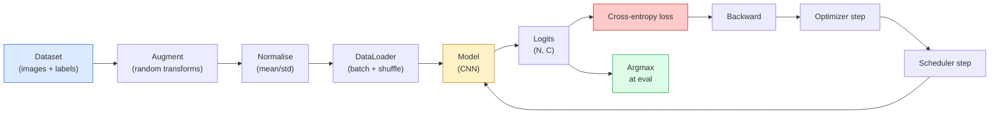

# Klasyfikacja obrazów

> Klasyfikator to funkcja z pikseli do rozkładu prawdopodobieństwa nad klasami. Wszystko inne to instalacja wodno-kanalizacyjna.

**Typ:** Build
**Języki:** Python
**Wymagania wstępne:** Faza 2 Lekcja 09 (Ewaluacja modeli), Faza 3 Lekcja 10 (Mini Framework), Faza 4 Lekcja 03 (CNN)
**Czas:** ~75 minut

## Cele nauki

- Zbudowanie kompletnego potoku klasyfikacji obrazów na CIFAR-10: zbiór danych, augmentacja, model, pętla treningowa, ewaluacja
- Wyjaśnienie roli każdego komponentu (dataloader, funkcja straty, optymalizator, scheduler, augmentacja) i przewidzenie, jak zepsucie któregokolwiek z nich objawia się na krzywej straty
- Implementacja mixup, cutout i label smoothing od zera oraz uzasadnienie, kiedy warto je dodać
- Czytanie macierzy konfuzji oraz tabeli precyzji/czułości per klasa, aby diagnozować problemy zbioru danych i modelu poza zagregowaną dokładnością

## Problem

Każde zadanie wizyjne, które trafia do produkcji, sprowadza się na pewnym poziomie do klasyfikacji obrazów. Detekcja klasyfikuje regiony. Segmentacja klasyfikuje piksele. Wyszukiwanie (retrieval) rankinguje na podstawie podobieństwa do centroidów klas. Zrobienie klasyfikacji dobrze — pętla danych, polityka augmentacji, funkcja straty, ewaluacja — to umiejętność, która przenosi się na każde inne zadanie w tej fazie.

Większość błędów w klasyfikacji nie leży w modelu. Żyją w potoku danych: zepsuta normalizacja, nieprzemieszany (unshuffled) zbiór treningowy, augmentacja, która zniekształca etykiety, podział walidacyjny zanieczyszczony danymi treningowymi, learning rate, który po cichu rozjeżdża się po epoce 30. CNN, który z poprawną konfiguracją uzyskałby 93% na CIFAR-10, z zepsutą konfiguracją zwykle uzyskuje 70-75%, a krzywa straty cały czas wygląda wiarygodnie.

Ta lekcja okabluje cały potok ręcznie, tak aby każda część była możliwa do zbadania. Nie użyjesz niczego z `torchvision.datasets`, co mogłoby ukryć błąd.

## Koncepcja

### Potok klasyfikacji



Każda linia w tej pętli to miejsce, w którym może żyć błąd. Cross-entropy przyjmuje surowe logity, nie wyniki softmax, więc jakiekolwiek `model(x).softmax()` przed obliczeniem straty po cichu liczy niewłaściwy gradient. Augmentacje stosuje się tylko do wejść, nie do etykiet — z wyjątkiem mixup, który miesza obie rzeczy. `optimizer.zero_grad()` musi się wykonać raz na krok; pominięcie go akumuluje gradienty i wygląda jak dziko niestabilny learning rate. Każdy z tych błędów wypłaszcza krzywą uczenia bez wyrzucenia żadnego błędu (error).

### Cross-entropy, logity i softmax

Klasyfikator produkuje `C` liczb na obraz, zwanych logitami. Zastosowanie softmax przekształca je w rozkład prawdopodobieństwa:

```
softmax(z)_i = exp(z_i) / sum_j exp(z_j)
```

Cross-entropy mierzy ujemny logarytm prawdopodobieństwa poprawnej klasy:

```
CE(z, y) = -log( softmax(z)_y )
        = -z_y + log( sum_j exp(z_j) )
```

Forma po prawej stronie jest numerycznie stabilna (log-sum-exp). `nn.CrossEntropyLoss` w PyTorchu łączy softmax i NLL w jednej operacji i przyjmuje surowe logity bezpośrednio. Samodzielne zastosowanie softmax przed tym jest prawie zawsze błędem — obliczasz log(softmax(softmax(z))), wielkość bez sensu.

### Dlaczego augmentacja działa

CNN ma indukcyjny bias dla translacji (z dzielenia wag), ale nie ma wbudowanej niezmienniczości względem kadrowania, odbić, jittera kolorów czy okluzji. Jedynym sposobem nauczenia go tych niezmienniczości jest pokazanie mu pikseli, które te niezmienniczości wymuszają. Każda losowa transformacja podczas treningu jest sposobem powiedzenia: "te dwa obrazy mają tę samą etykietę; nauczcie się cech, które ignorują tę różnicę."

```
Original crop:  "dog facing left"
Flip:           "dog facing right"       <- same label, different pixels
Rotate(+15):    "dog, slight tilt"
Colour jitter:  "dog in warmer light"
RandomErasing:  "dog with patch missing"
```

Zasada: augmentacja musi zachowywać etykietę. Cutout i rotacja na cyfrze mogą zmienić "6" w "9"; dla takiego zbioru danych używa się mniejszych zakresów rotacji i wybiera augmentacje respektujące niezmienniczości specyficzne dla cyfr.

### Mixup i cutmix

Zwykła augmentacja przekształca piksele, ale zachowuje etykiety jako one-hot. **Mixup** i **cutmix** łamią tę zasadę, interpolując obie rzeczy.

```
Mixup:
  lambda ~ Beta(a, a)
  x = lambda * x_i + (1 - lambda) * x_j
  y = lambda * y_i + (1 - lambda) * y_j

Cutmix:
  paste a random rectangle of x_j into x_i
  y = area-weighted mix of y_i and y_j
```

Dlaczego to pomaga: model przestaje zapamiętywać szpiczaste cele one-hot i uczy się interpolować między klasami. Strata treningowa rośnie, dokładność testowa rośnie. To jednorazowo najtańsza poprawa odporności (robustness), jaką można zastosować do każdego klasyfikatora.

### Label smoothing

Kuzyn mixup. Zamiast trenować względem `[0, 0, 1, 0, 0]`, trenujesz względem `[eps/C, eps/C, 1-eps, eps/C, eps/C]` dla małego `eps`, np. 0.1. Powstrzymuje model przed produkowaniem dowolnie ostrych logitów i poprawia kalibrację praktycznie bezkosztowo. Wbudowane w `nn.CrossEntropyLoss(label_smoothing=0.1)` od PyTorch 1.10.

### Ewaluacja poza dokładnością

Zagregowana dokładność maskuje niezbalansowanie. Binarny klasyfikator 90-10, który zawsze przewiduje klasę większościową, uzyskuje 90%. Narzędzia, które faktycznie mówią, co się dzieje:

- **Dokładność per klasa** — jedna liczba na klasę; natychmiast ujawnia słabo działające kategorie.
- **Macierz konfuzji** — siatka C x C, gdzie wiersz i, kolumna j = liczba przykładów prawdziwej klasy i przewidzianych jako klasa j; przekątna to poprawne predykcje, elementy poza przekątną to miejsca, gdzie żyje twój model.
- **Top-1 / Top-5** — czy poprawna klasa jest w 1 lub 5 najlepszych predykcjach; Top-5 ma znaczenie dla ImageNet, bo klasy takie jak "Norwich terrier" vs "Norfolk terrier" są naprawdę niejednoznaczne.
- **Kalibracja (ECE)** — czy predykcja z pewnością 0.8 jest poprawna w 80% przypadków? Współczesne sieci są systematycznie nadmiernie pewne (over-confident); fix poprzez temperature scaling lub label smoothing.

## Zbuduj to

### Krok 1: Deterministyczny syntetyczny zbiór danych

CIFAR-10 leży na dysku. Aby ta lekcja była powtarzalna i szybka, budujemy syntetyczny zbiór danych, który wygląda jak CIFAR — obrazy RGB 32x32 ze strukturą specyficzną dla klasy, którą model musi się nauczyć. Dokładnie ten sam potok działa bez zmian na prawdziwym CIFAR-10.

```python
import numpy as np
import torch
from torch.utils.data import Dataset


def synthetic_cifar(num_per_class=1000, num_classes=10, seed=0):
    rng = np.random.default_rng(seed)
    X = []
    Y = []
    for c in range(num_classes):
        centre = rng.uniform(0, 1, (3,))
        freq = 2 + c
        for _ in range(num_per_class):
            yy, xx = np.meshgrid(np.linspace(0, 1, 32), np.linspace(0, 1, 32), indexing="ij")
            r = np.sin(xx * freq) * 0.5 + centre[0]
            g = np.cos(yy * freq) * 0.5 + centre[1]
            b = (xx + yy) * 0.5 * centre[2]
            img = np.stack([r, g, b], axis=-1)
            img += rng.normal(0, 0.08, img.shape)
            img = np.clip(img, 0, 1)
            X.append(img.astype(np.float32))
            Y.append(c)
    X = np.stack(X)
    Y = np.array(Y)
    idx = rng.permutation(len(X))
    return X[idx], Y[idx]


class ArrayDataset(Dataset):
    def __init__(self, X, Y, transform=None):
        self.X = X
        self.Y = Y
        self.transform = transform

    def __len__(self):
        return len(self.X)

    def __getitem__(self, i):
        img = self.X[i]
        if self.transform is not None:
            img = self.transform(img)
        img = torch.from_numpy(img).permute(2, 0, 1)
        return img, int(self.Y[i])
```

Każda klasa ma własną paletę kolorów i wzorzec częstotliwości, plus szum gaussowski, aby zmusić model do nauczenia się sygnału, a nie zapamiętywania pikseli. Dziesięć klas, tysiąc obrazów każda, przemieszane (permuted).

### Krok 2: Normalizacja i augmentacja

Dwie transformacje, które ma każdy potok wizyjny.

```python
def standardize(mean, std):
    mean = np.array(mean, dtype=np.float32)
    std = np.array(std, dtype=np.float32)
    def _fn(img):
        return (img - mean) / std
    return _fn


def random_hflip(p=0.5):
    def _fn(img):
        if np.random.random() < p:
            return img[:, ::-1, :].copy()
        return img
    return _fn


def random_crop(pad=4):
    def _fn(img):
        h, w = img.shape[:2]
        padded = np.pad(img, ((pad, pad), (pad, pad), (0, 0)), mode="reflect")
        y = np.random.randint(0, 2 * pad)
        x = np.random.randint(0, 2 * pad)
        return padded[y:y + h, x:x + w, :]
    return _fn


def compose(*fns):
    def _fn(img):
        for fn in fns:
            img = fn(img)
        return img
    return _fn
```

Padding przez odbicie (reflect) przed kadrowaniem, nie padding zerami, bo czarne ramki są sygnałem, który model nauczyłby się ignorować w nieprzydatny sposób.

### Krok 3: Mixup

Miesza dwa obrazy i dwie etykiety wewnątrz kroku treningowego. Zaimplementowane jako transformacja na batchu, więc żyje przy przejściu w przód (forward pass), a nie w zbiorze danych.

```python
def mixup_batch(x, y, num_classes, alpha=0.2):
    if alpha <= 0:
        return x, torch.nn.functional.one_hot(y, num_classes).float()
    lam = float(np.random.beta(alpha, alpha))
    idx = torch.randperm(x.size(0), device=x.device)
    x_mixed = lam * x + (1 - lam) * x[idx]
    y_onehot = torch.nn.functional.one_hot(y, num_classes).float()
    y_mixed = lam * y_onehot + (1 - lam) * y_onehot[idx]
    return x_mixed, y_mixed


def soft_cross_entropy(logits, soft_targets):
    log_probs = torch.log_softmax(logits, dim=-1)
    return -(soft_targets * log_probs).sum(dim=-1).mean()
```

`soft_cross_entropy` to cross-entropy względem rozkładu miękkich etykiet (soft-label). Sprowadza się do zwykłego przypadku one-hot, gdy cel jest dokładnie one-hot.

### Krok 4: Pętla treningowa

Kompletna receptura: jedno przejście po danych, gradienty raz na batch, scheduler wykonywany raz na epokę.

```python
import torch
import torch.nn as nn
from torch.utils.data import DataLoader
from torch.optim import SGD
from torch.optim.lr_scheduler import CosineAnnealingLR

def train_one_epoch(model, loader, optimizer, device, num_classes, use_mixup=True):
    model.train()
    total, correct, loss_sum = 0, 0, 0.0
    for x, y in loader:
        x, y = x.to(device), y.to(device)
        if use_mixup:
            x_m, y_soft = mixup_batch(x, y, num_classes)
            logits = model(x_m)
            loss = soft_cross_entropy(logits, y_soft)
        else:
            logits = model(x)
            loss = nn.functional.cross_entropy(logits, y, label_smoothing=0.1)
        optimizer.zero_grad()
        loss.backward()
        optimizer.step()
        loss_sum += loss.item() * x.size(0)
        total += x.size(0)
        # Training accuracy vs the un-mixed labels `y` is only an approximation
        # when mixup is on (the model saw soft targets, not y). Treat it as a
        # rough progress signal; rely on val accuracy for real performance.
        with torch.no_grad():
            pred = logits.argmax(dim=-1)
            correct += (pred == y).sum().item()
    return loss_sum / total, correct / total


@torch.no_grad()
def evaluate(model, loader, device, num_classes):
    model.eval()
    total, correct = 0, 0
    loss_sum = 0.0
    cm = torch.zeros(num_classes, num_classes, dtype=torch.long)
    for x, y in loader:
        x, y = x.to(device), y.to(device)
        logits = model(x)
        loss = nn.functional.cross_entropy(logits, y)
        pred = logits.argmax(dim=-1)
        for t, p in zip(y.cpu(), pred.cpu()):
            cm[t, p] += 1
        loss_sum += loss.item() * x.size(0)
        total += x.size(0)
        correct += (pred == y).sum().item()
    return loss_sum / total, correct / total, cm
```

Pięć inwariantów, które sprawdzasz każdym razem, gdy piszesz pętlę treningową:

1. `model.train()` przed treningiem, `model.eval()` przed ewaluacją — odwraca zachowanie dropout i batchnorm.
2. `.zero_grad()` przed `.backward()`.
3. `.item()` przy akumulowaniu metryk, żeby nic nie przetrzymywało grafu obliczeń.
4. `@torch.no_grad()` podczas ewaluacji — oszczędza pamięć i czas, zapobiega subtelnym wypadkom.
5. Argmax na surowych logitach, nie na softmax — ten sam wynik, jedna operacja mniej.

### Krok 5: Złóż to w całość

Użyj `TinyResNet` z poprzedniej lekcji, treniuj kilka epok, oceń.

```python
from main import synthetic_cifar, ArrayDataset
from main import standardize, random_hflip, random_crop, compose
from main import mixup_batch, soft_cross_entropy
from main import train_one_epoch, evaluate
# TinyResNet comes from the previous lesson (03-cnns-lenet-to-resnet).
# Adjust the import path to wherever you stored the previous lesson's code.
from cnns_lenet_to_resnet import TinyResNet  # example placeholder

X, Y = synthetic_cifar(num_per_class=500)
split = int(0.9 * len(X))
X_train, Y_train = X[:split], Y[:split]
X_val, Y_val = X[split:], Y[split:]

mean = [0.5, 0.5, 0.5]
std = [0.25, 0.25, 0.25]
train_tf = compose(random_hflip(), random_crop(pad=4), standardize(mean, std))
eval_tf = standardize(mean, std)

train_ds = ArrayDataset(X_train, Y_train, transform=train_tf)
val_ds = ArrayDataset(X_val, Y_val, transform=eval_tf)

train_loader = DataLoader(train_ds, batch_size=128, shuffle=True, num_workers=0)
val_loader = DataLoader(val_ds, batch_size=256, shuffle=False, num_workers=0)

device = "cuda" if torch.cuda.is_available() else "cpu"
model = TinyResNet(num_classes=10).to(device)
optimizer = SGD(model.parameters(), lr=0.1, momentum=0.9, weight_decay=5e-4, nesterov=True)
scheduler = CosineAnnealingLR(optimizer, T_max=10)

for epoch in range(10):
    tr_loss, tr_acc = train_one_epoch(model, train_loader, optimizer, device, 10, use_mixup=True)
    va_loss, va_acc, _ = evaluate(model, val_loader, device, 10)
    scheduler.step()
    print(f"epoch {epoch:2d}  lr {scheduler.get_last_lr()[0]:.4f}  "
          f"train {tr_loss:.3f}/{tr_acc:.3f}  val {va_loss:.3f}/{va_acc:.3f}")
```

Na syntetycznym zbiorze danych pozwala to osiągnąć prawie idealną dokładność walidacyjną w ciągu pięciu epok, co jest tu istotne: potok jest poprawny, model może nauczyć się tego, czego da się nauczyć. Zamień zbiór danych na prawdziwy CIFAR-10 i ta sama pętla wytrenuje się do ~90% bez zmian.

### Krok 6: Czytanie macierzy konfuzji

Sama dokładność nigdy nie mówi, gdzie model zawodzi. Macierz konfuzji mówi.

```python
def print_confusion(cm, labels=None):
    c = cm.shape[0]
    labels = labels or [str(i) for i in range(c)]
    print(f"{'':>6}" + "".join(f"{l:>5}" for l in labels))
    for i in range(c):
        row = cm[i].tolist()
        print(f"{labels[i]:>6}" + "".join(f"{v:>5}" for v in row))
    print()
    tp = cm.diag().float()
    fp = cm.sum(dim=0).float() - tp
    fn = cm.sum(dim=1).float() - tp
    prec = tp / (tp + fp).clamp_min(1)
    rec = tp / (tp + fn).clamp_min(1)
    f1 = 2 * prec * rec / (prec + rec).clamp_min(1e-9)
    for i in range(c):
        print(f"{labels[i]:>6}  prec {prec[i]:.3f}  rec {rec[i]:.3f}  f1 {f1[i]:.3f}")

_, _, cm = evaluate(model, val_loader, device, 10)
print_confusion(cm)
```

Wiersze to prawdziwe klasy, kolumny to predykcje. Klaster liczności poza przekątną między klasami 3 i 5 oznacza, że model myli te dwie klasy, co daje punkt wyjścia do ukierunkowanego zbierania danych albo augmentacji specyficznej dla danej klasy.

## Wykorzystaj to

`torchvision` opakowuje wszystko powyżej w idiomatyczne komponenty. Dla prawdziwego CIFAR-10 cały potok to cztery linie plus pętla treningowa.

```python
from torchvision.datasets import CIFAR10
from torchvision.transforms import Compose, RandomCrop, RandomHorizontalFlip, ToTensor, Normalize

mean = (0.4914, 0.4822, 0.4465)
std = (0.2470, 0.2435, 0.2616)
train_tf = Compose([
    RandomCrop(32, padding=4, padding_mode="reflect"),
    RandomHorizontalFlip(),
    ToTensor(),
    Normalize(mean, std),
])
eval_tf = Compose([ToTensor(), Normalize(mean, std)])

train_ds = CIFAR10(root="./data", train=True,  download=True, transform=train_tf)
val_ds   = CIFAR10(root="./data", train=False, download=True, transform=eval_tf)
```

Dwie rzeczy do zauważenia: średnia/odchylenie standardowe są **specyficzne dla zbioru danych** — obliczone na zbiorze treningowym CIFAR-10, nie ImageNet — a padding przez odbicie jest domyślną polityką kadrowania przyjętą przez społeczność. Skopiowanie tutaj statystyk z ImageNet to wyciek dokładności o ~1%, którego nikt nie wychwyci, aż ktoś zaprofiluje model.

## Wypchnij to (Ship It)

Ta lekcja produkuje:

- `outputs/prompt-classifier-pipeline-auditor.md` — prompt, który audytuje skrypt treningowy pod kątem pięciu inwariantów powyżej i wskazuje pierwsze naruszenie.
- `outputs/skill-classification-diagnostics.md` — skill, który, mając macierz konfuzji i listę nazw klas, podsumowuje błędy per klasa i proponuje jedną najbardziej wpływową poprawkę.

## Ćwiczenia

1. **(Łatwe)** Wytreniuj ten sam model z mixup i bez mixup na pięć epok na syntetycznym zbiorze danych. Wykreśl stratę treningową i walidacyjną dla obu. Wyjaśnij, dlaczego strata treningowa z mixup jest wyższa, a dokładność walidacyjna jest podobna lub lepsza.
2. **(Średnie)** Zaimplementuj Cutout — wyzeruj losowy kwadrat 8x8 w każdym obrazie treningowym — i przeprowadź ablację dla: bez augmentacji, hflip+crop, hflip+crop+cutout, hflip+crop+mixup. Zaraportuj dokładność walidacyjną dla każdej konfiguracji.
3. **(Trudne)** Zbuduj potok dla CIFAR-100 (100 klas, ten sam rozmiar wejścia) i odtwórz przebieg treningowy ResNet-34 z dokładnością do 1% od publikowanych wyników. Dodatkowo: przeskanuj trzy learning rate'y i dwa weight decay, loguj do lokalnego CSV, wyprodukuj finalną tabelę najważniejszych konfuzji z macierzy konfuzji.

## Kluczowe terminy

| Term | Co się mówi | Co to faktycznie znaczy |
|------|----------------|----------------------|
| Logity (Logits) | "Surowe wyjścia" | Wektor C liczb na obraz przed softmax; cross-entropy oczekuje ich, nie wartości po softmax |
| Cross-entropy | "Funkcja straty" | Ujemny logarytm prawdopodobieństwa poprawnej klasy; łączy log-softmax i NLL w jednej stabilnej operacji |
| DataLoader | "Ten, co robi batche" | Opakowuje zbiór danych z przemieszaniem (shuffling), batchowaniem i (opcjonalnym) ładowaniem wieloprocesowym; obwiniany za połowę błędów treningowych |
| Augmentacja | "Losowe transformacje" | Każda transformacja na poziomie pikseli podczas treningu, która zachowuje etykietę; uczy niezmienniczości, których CNN nie ma natywnie |
| Mixup / Cutmix | "Zmiksuj dwa obrazy" | Mieszaj zarówno wejścia, jak i etykiety, aby klasyfikator nauczył się gładkich interpolacji zamiast ostrych granic |
| Label smoothing | "Mniej ostre cele" | Zastąp one-hot przez (1-eps, eps/(C-1), ...); poprawia kalibrację i nieznacznie zwiększa dokładność |
| Top-k accuracy | "Top-5" | Poprawna klasa znajduje się w k predykcjach o najwyższym prawdopodobieństwie; używane w zbiorach danych z naprawdę niejednoznacznymi klasami |
| Macierz konfuzji | "Gdzie żyją błędy" | Tabela C x C, gdzie wpis (i, j) liczy obrazy prawdziwej klasy i przewidziane jako j; przekątna jest poprawna, elementy poza przekątną mówią, co naprawić |

## Dalsze materiały

- [CS231n: Training Neural Networks](https://cs231n.github.io/neural-networks-3/) — wciąż najjaśniejszy przegląd potoku treningowego na jednej stronie
- [Bag of Tricks for Image Classification (He et al., 2019)](https://arxiv.org/abs/1812.01187) — każdy mały trik, który razem dodaje 3-4% do dokładności ResNet na ImageNet
- [mixup: Beyond Empirical Risk Minimization (Zhang et al., 2017)](https://arxiv.org/abs/1710.09412) — oryginalny artykuł o mixup; trzy strony teorii plus przekonujące eksperymenty
- [Why temperature scaling matters (Guo et al., 2017)](https://arxiv.org/abs/1706.04599) — artykuł, który udowodnił, że współczesne sieci są źle skalibrowane i naprawił to jednym parametrem skalarnym
