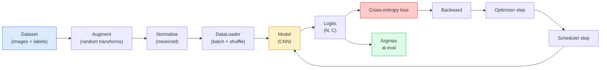

# Klasyfikacja obrazu

> Klasyfikator jest funkcją od pikseli do rozkładu prawdopodobieństwa w klasach. Cała reszta to hydraulika.

**Typ:** Kompilacja
**Języki:** Python
**Wymagania wstępne:** Faza 2, lekcja 09 (ocena modelu), faza 3, lekcja 10 (Mini Framework), faza 4, lekcja 03 (CNN)
**Czas:** ~75 minut

## Cele nauczania

- Zbuduj kompleksowy potok klasyfikacji obrazów w CIFAR-10: zbiór danych, powiększanie, model, pętla szkoleniowa, ocena
- Wyjaśnij rolę każdego komponentu (ładowanie danych, utrata, optymalizator, planista, rozszerzenie) i przewiduj, jak uszkodzenie któregokolwiek z nich przejawia się na krzywej strat
- Wprowadź od podstaw miksowanie, wycinanie i wygładzanie etykiet i uzasadnij, kiedy warto dodać każdy z nich
- Przeczytaj matrycę zamieszania i tabelę precyzji/przypominania dla poszczególnych klas, aby zdiagnozować awarie zbioru danych i modelu wykraczające poza zagregowaną dokładność

## Problem

Każde zadanie związane z wizją sprowadza się na pewnym poziomie do klasyfikacji obrazu. Wykrywanie klasyfikuje regiony. Segmentacja klasyfikuje piksele. Odzyskiwanie klasyfikuje się według podobieństwa do centroidów klas. Właściwa klasyfikacja – pętla zbioru danych, polityka powiększania, utrata, ocena – to umiejętność, która przekłada się na każde inne zadanie na tym etapie.

Większość błędów klasyfikacji nie występuje w modelu. Żyją w przygotowaniu: przerwana normalizacja, niezmieszany zbiór treningowy, wzmocnienie zniekształcające etykiety, podział walidacji zanieczyszczony danymi szkoleniowymi, tempo uczenia się, które po 30. epoce dyskretnie odbiega od normy. CNN, która przy prawidłowej konfiguracji osiągnęłaby 93% na CIFAR-10, zwykle osiąga 70–75% przy zepsutej, a krzywa strat przez cały czas wygląda wiarygodnie.

W tej lekcji cały rurociąg jest łączony ręcznie, dzięki czemu każdą część można sprawdzić. Nie będziesz używać niczego z `torchvision.datasets`, które mogłoby ukryć błąd.

## Koncepcja

### Potok klasyfikacji



Każda linia w tej pętli jest miejscem, w którym może zamieszkać błąd. Entropia krzyżowa pobiera surowe logity, a nie dane wyjściowe softmax, więc każdy `model(x).softmax()` przed stratą po cichu oblicza niewłaściwy gradient. Ulepszenia dotyczą tylko danych wejściowych, a nie etykiet — z wyjątkiem miksowania, które łączy oba elementy. `optimizer.zero_grad()` musi nastąpić raz na krok; pominięcie go powoduje akumulację gradientów i wygląda na szalenie niestabilne tempo uczenia się. Każdy z tych błędów spłaszcza krzywą uczenia się bez powodowania błędu.

### Entropia krzyżowa, logity i softmax

Klasyfikator generuje `C` liczby na obraz zwane logitami. Zastosowanie softmax przekształca je w rozkład prawdopodobieństwa:

```
softmax(z)_i = exp(z_i) / sum_j exp(z_j)
```

Entropia krzyżowa mierzy logarytm ujemny prawdopodobieństwa właściwej klasy:

```
CE(z, y) = -log( softmax(z)_y )
        = -z_y + log( sum_j exp(z_j) )
```

Postać prawostronna jest postacią stabilną numerycznie (log-sum-exp). `nn.CrossEntropyLoss` PyTorch łączy softmax + NLL w jednej operacji i bezpośrednio pobiera surowe logity. Samodzielne zastosowanie softmaxu prawie zawsze jest błędem — obliczasz log(softmax(softmax(z))), bezsensowną wielkość.

### Dlaczego powiększanie działa

CNN ma indukcyjne nastawienie do tłumaczenia (od podziału wagi), ale nie ma wbudowanej niezmienności w przypadku kadrowania, odwracania, drgań kolorów lub okluzji. Jedynym sposobem nauczenia go tych niezmienności jest pokazanie pikseli, które je ćwiczą. Każda losowa transformacja podczas uczenia jest sposobem na powiedzenie: „te dwa obrazy mają tę samą etykietę; poznaj cechy, które ignorują różnicę”.

```
Original crop:  "dog facing left"
Flip:           "dog facing right"       <- same label, different pixels
Rotate(+15):    "dog, slight tilt"
Colour jitter:  "dog in warmer light"
RandomErasing:  "dog with patch missing"
```

Zasada: powiększanie musi zachować etykietę. Wycięcie i obrót cyfry może zamienić „6” w „9”; w przypadku tego zbioru danych używasz mniejszych zakresów rotacji i wybierasz rozszerzenia, które uwzględniają niezmienność specyficzną dla cyfr.

### Miksowanie i wycinanie miksów

Zwykłe powiększanie przekształca piksele, ale utrzymuje wysoką temperaturę etykiet. **Mixup** i **cutmix** rozbijają to, interpolując oba.

```
Mixup:
  lambda ~ Beta(a, a)
  x = lambda * x_i + (1 - lambda) * x_j
  y = lambda * y_i + (1 - lambda) * y_j

Cutmix:
  paste a random rectangle of x_j into x_i
  y = area-weighted mix of y_i and y_j
```

Dlaczego to pomaga: model przestaje zapamiętywać kolczaste, jedno-gorące cele i uczy się interpolować między klasami. Rosną straty w treningu, rośnie dokładność testów. Jest to najtańsze i najtańsze ulepszenie niezawodności dla dowolnego klasyfikatora.

### Wygładzanie etykiet

Kuzyn pomieszania. Zamiast trenować z `[0, 0, 1, 0, 0]`, trenuj z `[eps/C, eps/C, 1-eps, eps/C, eps/C]` przez mały `eps`, np. 0,1. Powstrzymuje model przed wytwarzaniem dowolnie ostrych logitów i poprawia kalibrację niemal bez żadnych kosztów. Wbudowane w `nn.CrossEntropyLoss(label_smoothing=0.1)` od wersji PyTorch 1.10.

### Ocena wykraczająca poza dokładność

Łączna dokładność ukrywa brak równowagi. Klasyfikator binarny 90-10, który zawsze przewiduje klasę większościową, uzyskuje wynik 90%. Narzędzia, które faktycznie powiedzą Ci, co się dzieje:

- **Dokładność na klasę** — jedna liczba na klasę; natychmiast wyłaniają się kategorie o słabszych wynikach.
- **Macierz zamieszania** — siatka C x C z wierszem i kolumna j = liczba prawdziwej klasy i przewidywanej jako klasa j; przekątna jest prawidłowa, poza przekątną znajdują się miejsca, w których mieszka model.
- **Top-1 / Top-5** — czy właściwa klasa znajduje się w pierwszej 1, czy w pierwszej 5 prognoz; Pięć najważniejszych ma znaczenie dla ImageNet, ponieważ klasy takie jak „Norwich terrier” czy „Norfolk terrier” są naprawdę niejednoznaczne.
- **Kalibracja (ECE)** — czy przewidywana pewność na poziomie 0,8 zapewnia poprawność w 80% przypadków? Nowoczesne sieci są systematycznie nadmiernie pewne siebie; napraw za pomocą skalowania temperatury lub wygładzania etykiet.

## Zbuduj to

### Krok 1: Deterministyczny syntetyczny zbiór danych

CIFAR-10 żyje na dysku. Aby uczynić tę lekcję powtarzalną i szybką, budujemy syntetyczny zbiór danych, który wygląda jak CIFAR — obrazy RGB 32x32 ze strukturą specyficzną dla klasy, której model musi się nauczyć. Dokładnie ten sam rurociąg działa bez zmian na prawdziwym CIFAR-10.

```python
import numpy as np
import torch
from torch.utils.data import Dataset

def synthetic_cifar(num_per_class=1000, num_classes=10, seed=0):
    rng = np.random.default_rng(seed)
    X = []
    Y = []
    for c in range(num_classes):
        centre = rng.uniform(0, 1, (3,))
        freq = 2 + c
        for _ in range(num_per_class):
            yy, xx = np.meshgrid(np.linspace(0, 1, 32), np.linspace(0, 1, 32), indexing="ij")
            r = np.sin(xx * freq) * 0.5 + centre[0]
            g = np.cos(yy * freq) * 0.5 + centre[1]
            b = (xx + yy) * 0.5 * centre[2]
            img = np.stack([r, g, b], axis=-1)
            img += rng.normal(0, 0.08, img.shape)
            img = np.clip(img, 0, 1)
            X.append(img.astype(np.float32))
            Y.append(c)
    X = np.stack(X)
    Y = np.array(Y)
    idx = rng.permutation(len(X))
    return X[idx], Y[idx]

class ArrayDataset(Dataset):
    def __init__(self, X, Y, transform=None):
        self.X = X
        self.Y = Y
        self.transform = transform

    def __len__(self):
        return len(self.X)

    def __getitem__(self, i):
        img = self.X[i]
        if self.transform is not None:
            img = self.transform(img)
        img = torch.from_numpy(img).permute(2, 0, 1)
        return img, int(self.Y[i])
```

Każda klasa otrzymuje własną paletę kolorów i wzór częstotliwości, a także szum Gaussa, aby zmusić model do uczenia się sygnału, a nie zapamiętywania pikseli. Dziesięć klas, po tysiąc obrazów każda, permutowanych.

### Krok 2: Normalizacja i wzmacnianie

Te dwie transformacje są dostępne w każdym rurociągu wizyjnym.

```python
def standardize(mean, std):
    mean = np.array(mean, dtype=np.float32)
    std = np.array(std, dtype=np.float32)
    def _fn(img):
        return (img - mean) / std
    return _fn

def random_hflip(p=0.5):
    def _fn(img):
        if np.random.random() < p:
            return img[:, ::-1, :].copy()
        return img
    return _fn

def random_crop(pad=4):
    def _fn(img):
        h, w = img.shape[:2]
        padded = np.pad(img, ((pad, pad), (pad, pad), (0, 0)), mode="reflect")
        y = np.random.randint(0, 2 * pad)
        x = np.random.randint(0, 2 * pad)
        return padded[y:y + h, x:x + w, :]
    return _fn

def compose(*fns):
    def _fn(img):
        for fn in fns:
            img = fn(img)
        return img
    return _fn
```

Podkładka refleksyjna przed przycięciem, a nie podkładka zerowa, ponieważ czarne obramowania to sygnał, który model nauczyłby się ignorować w nieprzydatny sposób.

### Krok 3: Mieszanie

Łączy dwa obrazy i dwie etykiety na etapie uczenia. Zaimplementowano jako transformację wsadową, więc znajduje się obok przebiegu w przód, a nie wewnątrz zbioru danych.

```python
def mixup_batch(x, y, num_classes, alpha=0.2):
    if alpha <= 0:
        return x, torch.nn.functional.one_hot(y, num_classes).float()
    lam = float(np.random.beta(alpha, alpha))
    idx = torch.randperm(x.size(0), device=x.device)
    x_mixed = lam * x + (1 - lam) * x[idx]
    y_onehot = torch.nn.functional.one_hot(y, num_classes).float()
    y_mixed = lam * y_onehot + (1 - lam) * y_onehot[idx]
    return x_mixed, y_mixed

def soft_cross_entropy(logits, soft_targets):
    log_probs = torch.log_softmax(logits, dim=-1)
    return -(soft_targets * log_probs).sum(dim=-1).mean()
```

`soft_cross_entropy` to entropia krzyżowa względem dystrybucji z miękką etykietą. Sprowadza się to do zwykłego przypadku z jedną gorącą temperaturą, gdy cel jest dokładnie o jedną gorącą.

### Krok 4: Pętla treningowa

Kompletny przepis: jedno przejście danych, gradienty raz na partię, krok planujący raz na epokę.

```python
import torch
import torch.nn as nn
from torch.utils.data import DataLoader
from torch.optim import SGD
from torch.optim.lr_scheduler import CosineAnnealingLR

def train_one_epoch(model, loader, optimizer, device, num_classes, use_mixup=True):
    model.train()
    total, correct, loss_sum = 0, 0, 0.0
    for x, y in loader:
        x, y = x.to(device), y.to(device)
        if use_mixup:
            x_m, y_soft = mixup_batch(x, y, num_classes)
            logits = model(x_m)
            loss = soft_cross_entropy(logits, y_soft)
        else:
            logits = model(x)
            loss = nn.functional.cross_entropy(logits, y, label_smoothing=0.1)
        optimizer.zero_grad()
        loss.backward()
        optimizer.step()
        loss_sum += loss.item() * x.size(0)
        total += x.size(0)
        # Training accuracy vs the un-mixed labels `y` is only an approximation
        # when mixup is on (the model saw soft targets, not y). Treat it as a
        # rough progress signal; rely on val accuracy for real performance.
        with torch.no_grad():
            pred = logits.argmax(dim=-1)
            correct += (pred == y).sum().item()
    return loss_sum / total, correct / total

@torch.no_grad()
def evaluate(model, loader, device, num_classes):
    model.eval()
    total, correct = 0, 0
    loss_sum = 0.0
    cm = torch.zeros(num_classes, num_classes, dtype=torch.long)
    for x, y in loader:
        x, y = x.to(device), y.to(device)
        logits = model(x)
        loss = nn.functional.cross_entropy(logits, y)
        pred = logits.argmax(dim=-1)
        for t, p in zip(y.cpu(), pred.cpu()):
            cm[t, p] += 1
        loss_sum += loss.item() * x.size(0)
        total += x.size(0)
        correct += (pred == y).sum().item()
    return loss_sum / total, correct / total, cm
```

Pięć niezmienników, które sprawdzasz za każdym razem, gdy piszesz pętlę treningową:

1. `model.train()` przed szkoleniem, `model.eval()` przed oceną — odwraca zachowanie typu dropout i normalność wsadowa.
2. `.zero_grad()` przed `.backward()`.
3. `.item()` podczas gromadzenia metryk, tak aby nic nie utrzymywało wykresu obliczeń przy życiu.
4. `@torch.no_grad()` podczas oceny — oszczędza pamięć i czas, zapobiega subtelnym wypadkom.
5. Argmax w porównaniu z surowymi logitami, a nie softmax — ten sam wynik, o jedną operację mniej.

### Krok 5: Złóż to w całość

Skorzystaj z `TinyResNet` z poprzedniej lekcji, trenuj przez kilka epok, oceniaj.

```python
from main import synthetic_cifar, ArrayDataset
from main import standardize, random_hflip, random_crop, compose
from main import mixup_batch, soft_cross_entropy
from main import train_one_epoch, evaluate
# TinyResNet comes from the previous lesson (03-cnns-lenet-to-resnet).
# Adjust the import path to wherever you stored the previous lesson's code.
from cnns_lenet_to_resnet import TinyResNet  # example placeholder

X, Y = synthetic_cifar(num_per_class=500)
split = int(0.9 * len(X))
X_train, Y_train = X[:split], Y[:split]
X_val, Y_val = X[split:], Y[split:]

mean = [0.5, 0.5, 0.5]
std = [0.25, 0.25, 0.25]
train_tf = compose(random_hflip(), random_crop(pad=4), standardize(mean, std))
eval_tf = standardize(mean, std)

train_ds = ArrayDataset(X_train, Y_train, transform=train_tf)
val_ds = ArrayDataset(X_val, Y_val, transform=eval_tf)

train_loader = DataLoader(train_ds, batch_size=128, shuffle=True, num_workers=0)
val_loader = DataLoader(val_ds, batch_size=256, shuffle=False, num_workers=0)

device = "cuda" if torch.cuda.is_available() else "cpu"
model = TinyResNet(num_classes=10).to(device)
optimizer = SGD(model.parameters(), lr=0.1, momentum=0.9, weight_decay=5e-4, nesterov=True)
scheduler = CosineAnnealingLR(optimizer, T_max=10)

for epoch in range(10):
    tr_loss, tr_acc = train_one_epoch(model, train_loader, optimizer, device, 10, use_mixup=True)
    va_loss, va_acc, _ = evaluate(model, val_loader, device, 10)
    scheduler.step()
    print(f"epoch {epoch:2d}  lr {scheduler.get_last_lr()[0]:.4f}  "
          f"train {tr_loss:.3f}/{tr_acc:.3f}  val {va_loss:.3f}/{va_acc:.3f}")
```

W przypadku syntetycznego zbioru danych dokładność walidacji w ciągu pięciu epok jest niemal idealna i o to właśnie chodzi: potok jest prawidłowy, model może się nauczyć tego, czego można się nauczyć. Zamień zestaw danych na prawdziwy CIFAR-10 i te same pociągi pętlowe do ~ 90% bez zmian.

### Krok 6: Przeczytaj matrycę zamieszania

Sama dokładność nigdy nie powie Ci, gdzie model zawodzi. Matryca zamieszania tak.

```python
def print_confusion(cm, labels=None):
    c = cm.shape[0]
    labels = labels or [str(i) for i in range(c)]
    print(f"{'':>6}" + "".join(f"{l:>5}" for l in labels))
    for i in range(c):
        row = cm[i].tolist()
        print(f"{labels[i]:>6}" + "".join(f"{v:>5}" for v in row))
    print()
    tp = cm.diag().float()
    fp = cm.sum(dim=0).float() - tp
    fn = cm.sum(dim=1).float() - tp
    prec = tp / (tp + fp).clamp_min(1)
    rec = tp / (tp + fn).clamp_min(1)
    f1 = 2 * prec * rec / (prec + rec).clamp_min(1e-9)
    for i in range(c):
        print(f"{labels[i]:>6}  prec {prec[i]:.3f}  rec {rec[i]:.3f}  f1 {f1[i]:.3f}")

_, _, cm = evaluate(model, val_loader, device, 10)
print_confusion(cm)
```

Wiersze to prawdziwe klasy, kolumny to przewidywania. Klaster zliczeń niediagonalnych pomiędzy klasami 3 i 5 oznacza, że ​​model myli te dwie wartości i daje punkt wyjścia do ukierunkowanego gromadzenia danych lub wzmacniania specyficznego dla klasy.

## Użyj tego

`torchvision` pakuje wszystko powyżej w komponenty idiomatyczne. W przypadku prawdziwego CIFAR-10 pełny rurociąg składa się z czterech linii plus pętla treningowa.

```python
from torchvision.datasets import CIFAR10
from torchvision.transforms import Compose, RandomCrop, RandomHorizontalFlip, ToTensor, Normalize

mean = (0.4914, 0.4822, 0.4465)
std = (0.2470, 0.2435, 0.2616)
train_tf = Compose([
    RandomCrop(32, padding=4, padding_mode="reflect"),
    RandomHorizontalFlip(),
    ToTensor(),
    Normalize(mean, std),
])
eval_tf = Compose([ToTensor(), Normalize(mean, std)])

train_ds = CIFAR10(root="./data", train=True,  download=True, transform=train_tf)
val_ds   = CIFAR10(root="./data", train=False, download=True, transform=eval_tf)
```

Warto zwrócić uwagę na dwie rzeczy: średnia/standard jest **specyficzna dla zbioru danych** — obliczona na zestawie szkoleniowym CIFAR-10, a nie na ImageNet — a podkładka odzwierciedlająca jest domyślną polityką przycinania społeczności. Kopiowanie i wklejanie statystyk ImageNet to ~1% wyciek dokładności, którego nikt nie wyłapie, dopóki ktoś nie sprofiluje modelu.

## Wyślij to

Ta lekcja daje:

- `outputs/prompt-classifier-pipeline-auditor.md` — monit, który sprawdza skrypt szkoleniowy pod kątem pięciu powyższych niezmienników i ujawnia pierwsze naruszenie.
- `outputs/skill-classification-diagnostics.md` — umiejętność, która, biorąc pod uwagę matrycę zamieszania i listę nazw klas, podsumowuje błędy w poszczególnych klasach i proponuje pojedynczą najskuteczniejszą poprawkę.

## Ćwiczenia

1. **(Łatwy)** Trenuj ten sam model z mieszaniem i bez niego przez pięć epok na syntetycznym zbiorze danych. Wykres utraty pociągu i wartości dla obu. Wyjaśnij, dlaczego utrata pociągu w wyniku pomieszania jest większa, a dokładność wartości jest podobna lub lepsza.
2. **(Średni)** Zastosuj wycięcie — wyzeruj losowy kwadrat 8x8 na każdym obrazie treningowym — i wykonaj ablację lub brak wzmacniania, hflip+crop, hflip+crop+cutout, hflip+crop+mixup. Zgłoś dokładność wartości dla każdego.
3. **(Trudny)** Zbuduj potok CIFAR-100 (100 klas, ten sam rozmiar danych wejściowych) i odtwórz przebieg szkoleniowy ResNet-34 z dokładnością do 1% opublikowanej dokładności. Dodatki: przejrzyj trzy szybkości uczenia się i dwa zaniki masy, zaloguj się do lokalnego pliku CSV, utwórz ostateczną tabelę macierzy zamieszania z najważniejszymi pomyłkami.

## Kluczowe terminy

| Termin | Co ludzie mówią | Co to właściwie oznacza |
|------|----------------|----------------------|
| Logity | „Surowe wyniki” | Wektor liczb C na obraz sprzed softmax; entropia krzyżowa oczekuje tych, a nie wartości softmax |
| Entropia krzyżowa | „Strata” | Ujemne log-prawdopodobieństwo właściwej klasy; łączy log-softmax i NLL w jedną stabilną operację |
| Moduł ładowania danych | „Dozownik” | Opakowuje zestaw danych za pomocą tasowania, przetwarzania wsadowego i (opcjonalnie) ładowania przez wielu pracowników; zostaje obwiniony za połowę błędów szkoleniowych |
| Zwiększenie | „Losowe transformacje” | Dowolna transformacja na poziomie piksela w czasie szkolenia, która zachowuje etykietę; uczy niezmienności, których CNN nie ma natywnie |
| Mixup / Cutmix | „Połącz dwa obrazy” | Połącz zarówno dane wejściowe, jak i etykiety, aby klasyfikator nauczył się płynnych interpolacji zamiast twardych granic
| Wygładzanie etykiet | „Miękkie cele” | Zamień jeden gorący na (1-eps, eps/(C-1), ...); poprawia kalibrację i nieznacznie zwiększa dokładność |
| Dokładność najwyższej k | „Top-5” | Prawidłowa klasa znajduje się w k przewidywań o najwyższym prawdopodobieństwie; używane w zbiorach danych z rzeczywiście niejednoznacznymi klasami |
| Matryca zamieszania | „Gdzie żyją błędy” | Tabela C x C, w której wpis (i, j) zlicza obrazy prawdziwej klasy i przewidywanej jako j; przekątna jest właściwa, przekątna mówi ci, co poprawić |

## Dalsze czytanie

— [CS231n: Szkolenie sieci neuronowych](https://cs231n.github.io/neural-networks-3/) — wciąż najbardziej przejrzysty przegląd procesu uczenia na jednej stronie
– [Zestaw sztuczek do klasyfikacji obrazów (He et al., 2019)](https://arxiv.org/abs/1812.01187) — każda mała sztuczka, która razem dodaje 3–4% dokładności ResNet w ImageNet
- [miks: Beyond Empirical Risk Minimization (Zhang et al., 2017)](https://arxiv.org/abs/1710.09412) — oryginalny dokument dotyczący pomieszania; trzy strony teorii plus przekonujące eksperymenty
- [Dlaczego skalowanie temperatury ma znaczenie (Guo et al., 2017)](https://arxiv.org/abs/1706.04599) — artykuł, w którym udowodniono, że współczesne sieci są źle skalibrowane i naprawiono to za pomocą jednego parametru skalarnego