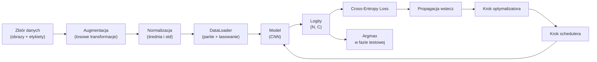

# Klasyfikacja obrazu

> Klasyfikator to matematyczna funkcja mapująca piksele wejściowe na rozkład prawdopodobieństwa przynależności do klas. Cała reszta to jedynie kod pomocniczy.

**Typ:** Projekt  
**Języki:** Python, PyTorch  
**Wymagania wstępne:** Faza 2 Lekcja 09 (Ocena modelu), Faza 3 Lekcja 10 (Własny mini-framework), Faza 4 Lekcja 03 (CNN)  
**Czas:** ~75 minut  

## Cele kształcenia

- Zbudowanie od zera kompletnego potoku klasyfikacji obrazów na zbiorze CIFAR-10: od wczytywania danych i ich augmentacji, przez definicję modelu i pętlę treningową, aż po ewaluację.
- Wyjaśnienie roli każdego komponentu (DataLoader, funkcja straty, optymalizator, scheduler, augmentacja) oraz zrozumienie, jak uszkodzenie dowolnego z nich wpływa na dynamikę krzywej straty.
- Implementacja od podstaw technik regularyzacyjnych: Mixup, CutOut oraz wygładzania etykiet (label smoothing), wraz z uzasadnieniem ich stosowania.
- Analiza macierzy pomyłek (confusion matrix) oraz tabeli precyzji (precision) i czułości (recall) dla poszczególnych klas w celu dokładnej diagnostyki słabości modelu wykraczającej poza ogólną dokładność (accuracy).

## Problem

Większość zadań wizyjnych na pewnym poziomie sprowadza się do klasyfikacji obrazu. Detekcja obiektów klasyfikuje wycięte obszary. Segmentacja klasyfikuje pojedyncze piksele. Wyszukiwanie obrazów klasyfikuje przykłady na podstawie odległości do centroidów klas. Dlatego umiejętność poprawnego zaprojektowania procesu klasyfikacji (DataLoader, augmentacja, strata, ocena) bezpośrednio przekłada się na skuteczność w innych obszarach wizji komputerowej.

Większość błędów w klasyfikacji nie dotyczy architektury samego modelu. Tkwią one w przygotowaniu danych: błędna normalizacja wejść, brak tasowania zbioru treningowego, zbyt agresywne augmentacje niszczące etykiety, wyciek danych (data leakage) ze zbioru walidacyjnego do treningowego czy zły dobór harmonogramu uczenia. Model CNN, który przy prawidłowej konfiguracji osiągnąłby 93% dokładności na zbiorze CIFAR-10, przy wadliwym potoku osiągnie zaledwie 70–75%, chociaż jego krzywa straty w czasie treningu może wyglądać całkowicie naturalnie.

W tej lekcji połączysz cały potok ręcznie, aby móc prześledzić i zweryfikować poprawność działania każdego elementu. Nie będziemy korzystać z gotowych klas `torchvision.datasets`, które mogłyby ukryć potencjalne błędy implementacyjne.

## Koncepcja

### Schemat potoku klasyfikacji



Każdy etap tego potoku to miejsce potencjalnego błędu. Funkcja `CrossEntropyLoss` w PyTorch oczekuje surowych logitów, a nie wartości po funkcji Softmax. Każde błędne wywołanie `model(x).softmax()` przed obliczeniem straty prowadzi do cichego wyznaczania niepoprawnych gradientów. Standardowe augmentacje modyfikują wyłącznie dane wejściowe, nie wpływając na etykiety – wyjątkiem są techniki takie jak Mixup, które interpolują oba te elementy. Wywołanie `optimizer.zero_grad()` musi nastąpić dokładnie raz na krok optymalizatora; jego pominięcie spowoduje akumulację gradientów, co objawia się niestabilnością procesu uczenia. Każdy z tych błędów spłaszcza krzywą uczenia się bez zgłaszania błędów w kodzie.

### Entropia krzyżowa, logity i softmax

Klasyfikator generuje $C$ wartości dla każdego obrazu, zwanych logitami. Funkcja Softmax przekształca te logity w rozkład prawdopodobieństwa:

$$\text{softmax}(z)_i = \frac{e^{z_i}}{\sum_j e^{z_j}}$$

Funkcja binarnej entropii krzyżowej mierzy ujemny logarytm prawdopodobieństwa przypisanego do poprawnej klasy $y$:

$$\text{CE}(z, y) = -\log(\text{softmax}(z)_y) = -z_y + \log\left(\sum_j e^{z_j}\right)$$

Prawa strona tego równania reprezentuje stabilną numerycznie postać tej funkcji (sztuczka LogSumExp). Klasa `nn.CrossEntropyLoss` z biblioteki PyTorch łączy Softmax i ujemną wiarygodność logarytmiczną (NLL) w jedną stabilną operację, przyjmując bezpośrednio surowe logity. Ręczne stosowanie funkcji softmax przed przekazaniem wyników do tej straty jest błędem, ponieważ prowadzi do bezużytecznego wyliczania wartości $\log(\text{softmax}(\text{softmax}(z)))$.

### Dlaczego augmentacja danych działa

Sieci CNN posiadają silne skrzywienie indukcyjne (inductive bias) w postaci niezmienności na przesunięcia przestrzenne (dzięki współdzieleniu wag w warstwach konwolucyjnych), jednak nie mają wbudowanej odporności na obracanie, kadrowanie, odwracanie, fluktuacje kolorów czy częściowe przesłonięcia (occlusion). Jedynym sposobem na nauczenie sieci tych niezmienności jest pokazanie jej odpowiednio zmodyfikowanych przykładów. Każda losowa transformacja podczas treningu uczy model ignorowania nieistotnych zmiennych przy zachowaniu tej samej etykiety.

```
Oryginalny obraz:  "pies skierowany w lewo"
Lustrzane odbicie: "pies skierowany w prawo"    <- ta sama etykieta, inne piksele
Obrót o +15 stopni: "pies lekko przechylony"
Fluktuacja koloru: "pies w ciepłym oświetleniu"
Usuwanie (Cutout): "pies z zasłoniętym fragmentem"
```

Złota zasada: augmentacja musi zachować klasę obiektu. Przykładowo, agresywne obracanie lub kadrowanie cyfry może zamienić „6” w „9”. Dla takich zbiorów danych należy stosować mniejsze zakresy transformacji, uwzględniając specyfikę klasyfikowanych obiektów.

### Mixup oraz CutMix

Standardowa augmentacja przekształca wyłącznie piksele obrazu, zachowując etykiety one-hot. Techniki **Mixup** oraz **CutMix** modyfikują zarówno obrazy, jak i odpowiadające im etykiety, stosując interpolację.

```
Mixup:
  wylosuj lambda ~ Beta(alpha, alpha)
  x = lambda * x_i + (1 - lambda) * x_j
  y = lambda * y_i + (1 - lambda) * y_j

CutMix:
  wklej losowy prostokątny wycinek z obrazu x_j do x_i
  y = proporcjonalny miks etykiet y_i i y_j na podstawie pola powierzchni wycinka
```

Dzięki temu model przestaje dążyć do generowania skrajnie pewnych predykcji typu one-hot i uczy się interpolować granice decyzyjne między klasami. Strata na zbiorze treningowym może wzrosnąć, lecz bezpośrednim efektem jest lepsza generalizacja na zbiorze testowym. To jedna z najprostszych metod poprawy stabilności klasyfikatorów.

### Wygładzanie etykiet (Label Smoothing)

Metoda pokrewna do Mixup. Zamiast uczyć model na etykietach one-hot typu `[0, 0, 1, 0, 0]`, cel przyjmuje postać `[eps/C, eps/C, 1-eps, eps/C, eps/C]` dla małego parametru $\epsilon$ (np. 0,1). Zapobiega to dążeniu modelu do generowania nieskończenie dużych logitów i poprawia kalibrację sieci. W bibliotece PyTorch od wersji 1.10 opcja ta jest bezpośrednio wbudowana w `nn.CrossEntropyLoss(label_smoothing=0.1)`.

### Ewaluacja poza prostą dokładnością (Accuracy)

Zagregowana dokładność może ukrywać poważne problemy ze zbilansowaniem klas. W zbiorze, gdzie 90% przykładów należy do klasy A, klasyfikator, który zawsze przewiduje klasę A, osiągnie 90% dokładności. Narzędzia pozwalające na głębszą diagnostykę to:

- **Dokładność dla poszczególnych klas (per-class accuracy)**: procent poprawnych wskazań dla każdej klasy z osobna.
- **Macierz pomyłek (confusion matrix)**: macierz o wymiarach $C \times C$, gdzie element $(i, j)$ oznacza liczbę przypadków, w których rzeczywista klasa $i$ została zaklasyfikowana jako klasa $j$. Wartości na przekątnej oznaczają poprawne predykcje, natomiast wartości poza nią wskazują na konkretne pomyłki modelu.
- **Top-1 / Top-5 Accuracy**: określa, czy poprawna klasa znalazła się odpowiednio na pierwszym miejscu lub w grupie 5 najwyższych prawdopodobieństw. Metryka Top-5 ma duże znaczenie na zbiorach typu ImageNet, gdzie niektóre klasy (np. różne rasy psów) są bardzo podobne.
- **Kalibracja (metryka ECE)**: odpowiada na pytanie, czy predykcja o pewności (confidence) równej 0.8 przekłada się na poprawność w 80% przypadków. Nowoczesne sieci wykazują tendencję do zbytniej pewności siebie (overconfidence); można to skorygować za pomocą skalowania temperatury (temperature scaling) lub wygładzania etykiet.

## Implementacja krok po kroku

### Krok 1: Syntetyczny zbiór danych o kontrolowanej strukturze

W celu zapewnienia powtarzalności i szybkości testów, wygenerujemy syntetyczny zbiór danych naśladujący strukturę CIFAR-10. Będą to obrazy RGB o wymiarach $32 \times 32$ ze strukturą geometryczno-kolorystyczną przypisaną do każdej z 10 klas. Ten sam kod potoku danych można bez zmian zastosować do rzeczywistego zbioru CIFAR-10.

```python
import numpy as np
import torch
from torch.utils.data import Dataset

def synthetic_cifar(num_per_class=1000, num_classes=10, seed=0):
    rng = np.random.default_rng(seed)
    X = []
    Y = []
    for c in range(num_classes):
        centre = rng.uniform(0, 1, (3,))
        freq = 2 + c
        for _ in range(num_per_class):
            yy, xx = np.meshgrid(np.linspace(0, 1, 32), np.linspace(0, 1, 32), indexing="ij")
            r = np.sin(xx * freq) * 0.5 + centre[0]
            g = np.cos(yy * freq) * 0.5 + centre[1]
            b = (xx + yy) * 0.5 * centre[2]
            img = np.stack([r, g, b], axis=-1)
            img += rng.normal(0, 0.08, img.shape)
            img = np.clip(img, 0, 1)
            X.append(img.astype(np.float32))
            Y.append(c)
    X = np.stack(X)
    Y = np.array(Y)
    idx = rng.permutation(len(X))
    return X[idx], Y[idx]

class ArrayDataset(Dataset):
    def __init__(self, X, Y, transform=None):
        self.X = X
        self.Y = Y
        self.transform = transform

    def __len__(self):
        return len(self.X)

    def __getitem__(self, i):
        img = self.X[i]
        if self.transform is not None:
            img = self.transform(img)
        img = torch.from_numpy(img).permute(2, 0, 1)
        return img, int(self.Y[i])
```

Każda klasa otrzymuje charakterystyczną dla siebie paletę i częstotliwość przestrzenną wzoru wraz z szumem Gaussa, co zmusza model do uczenia się rzeczywistych cech zamiast zapamiętywania konkretnych pikseli.

### Krok 2: Normalizacja i augmentacja danych

Implementacja podstawowych transformacji obrazu przy użyciu operacji na tablicach NumPy.

```python
def standardize(mean, std):
    mean = np.array(mean, dtype=np.float32)
    std = np.array(std, dtype=np.float32)
    def _fn(img):
        return (img - mean) / std
    return _fn

def random_hflip(p=0.5):
    def _fn(img):
        if np.random.random() < p:
            return img[:, ::-1, :].copy()
        return img
    return _fn

def random_crop(pad=4):
    def _fn(img):
        h, w = img.shape[:2]
        padded = np.pad(img, ((pad, pad), (pad, pad), (0, 0)), mode="reflect")
        y = np.random.randint(0, 2 * pad)
        x = np.random.randint(0, 2 * pad)
        return padded[y:y + h, x:x + w, :]
    return _fn

def compose(*fns):
    def _fn(img):
        for fn in fns:
            img = fn(img)
        return img
    return _fn
```

Stosujemy dopełnienie lustrzane (reflect padding) przed kadrowaniem, ponieważ wypełnienie zerami (czarne ramki) tworzy sztuczne krawędzie, które model próbowałby zinterpretować.

### Krok 3: Implementacja techniki Mixup

Miksowanie obrazów oraz ich etykiet w obrębie partii (batch) danych.

```python
def mixup_batch(x, y, num_classes, alpha=0.2):
    if alpha <= 0:
        return x, torch.nn.functional.one_hot(y, num_classes).float()
    lam = float(np.random.beta(alpha, alpha))
    idx = torch.randperm(x.size(0), device=x.device)
    x_mixed = lam * x + (1 - lam) * x[idx]
    y_onehot = torch.nn.functional.one_hot(y, num_classes).float()
    y_mixed = lam * y_onehot + (1 - lam) * y_onehot[idx]
    return x_mixed, y_mixed

def soft_cross_entropy(logits, soft_targets):
    log_probs = torch.log_softmax(logits, dim=-1)
    return -(soft_targets * log_probs).sum(dim=-1).mean()
```

Funkcja `soft_cross_entropy` oblicza stratę entropii krzyżowej dla celów podanych jako rozkłady prawdopodobieństwa (soft targets).

### Krok 4: Pętla uczenia oraz ewaluacji

Pętla treningowa z jawnie zdefiniowanymi krokami optymalizacji i aktualizacji parametrów.

```python
import torch
import torch.nn as nn
from torch.utils.data import DataLoader
from torch.optim import SGD
from torch.optim.lr_scheduler import CosineAnnealingLR

def train_one_epoch(model, loader, optimizer, device, num_classes, use_mixup=True):
    model.train()
    total, correct, loss_sum = 0, 0, 0.0
    for x, y in loader:
        x, y = x.to(device), y.to(device)
        if use_mixup:
            x_m, y_soft = mixup_batch(x, y, num_classes)
            logits = model(x_m)
            loss = soft_cross_entropy(logits, y_soft)
        else:
            logits = model(x)
            loss = nn.functional.cross_entropy(logits, y, label_smoothing=0.1)
        
        optimizer.zero_grad()
        loss.backward()
        optimizer.step()
        
        loss_sum += loss.item() * x.size(0)
        total += x.size(0)
        
        with torch.no_grad():
            pred = logits.argmax(dim=-1)
            correct += (pred == y).sum().item()
            
    return loss_sum / total, correct / total

@torch.no_grad()
def evaluate(model, loader, device, num_classes):
    model.eval()
    total, correct = 0, 0
    loss_sum = 0.0
    cm = torch.zeros(num_classes, num_classes, dtype=torch.long)
    for x, y in loader:
        x, y = x.to(device), y.to(device)
        logits = model(x)
        loss = nn.functional.cross_entropy(logits, y)
        pred = logits.argmax(dim=-1)
        for t, p in zip(y.cpu(), pred.cpu()):
            cm[t, p] += 1
        loss_sum += loss.item() * x.size(0)
        total += x.size(0)
        correct += (pred == y).sum().item()
    return loss_sum / total, correct / total, cm
```

Pamiętaj o kluczowych zasadach pisania pętli treningowych w PyTorch:
1. Zawsze wywołuj `model.train()` przed treningiem i `model.eval()` przed walidacją/testem.
2. Wywołuj `.zero_grad()` przed krokiem `.backward()`.
3. Używaj `.item()` przy wyciąganiu wartości straty do statystyk, aby zapobiec wyciekom pamięci.
4. Używaj `@torch.no_grad()` podczas ewaluacji.
5. Wyznaczaj predykcje za pomocą `argmax` bezpośrednio na surowych logitach (Softmax jest zbędny).

### Krok 5: Uruchomienie potoku treningowego

Użyjemy modelu `TinyResNet` z poprzedniej lekcji do przeprowadzenia procesu uczenia.

```python
# Przygotowanie danych
X, Y = synthetic_cifar(num_per_class=500)
split = int(0.9 * len(X))
X_train, Y_train = X[:split], Y[:split]
X_val, Y_val = X[split:], Y[split:]

mean = [0.5, 0.5, 0.5]
std = [0.25, 0.25, 0.25]
train_tf = compose(random_hflip(), random_crop(pad=4), standardize(mean, std))
eval_tf = standardize(mean, std)

train_ds = ArrayDataset(X_train, Y_train, transform=train_tf)
val_ds = ArrayDataset(X_val, Y_val, transform=eval_tf)

train_loader = DataLoader(train_ds, batch_size=128, shuffle=True, num_workers=0)
val_loader = DataLoader(val_ds, batch_size=256, shuffle=False, num_workers=0)

device = "cuda" if torch.cuda.is_available() else "cpu"
model = TinyResNet(num_classes=10).to(device)
optimizer = SGD(model.parameters(), lr=0.1, momentum=0.9, weight_decay=5e-4, nesterov=True)
scheduler = CosineAnnealingLR(optimizer, T_max=10)

for epoch in range(10):
    tr_loss, tr_acc = train_one_epoch(model, train_loader, optimizer, device, 10, use_mixup=True)
    va_loss, va_acc, _ = evaluate(model, val_loader, device, 10)
    scheduler.step()
    print(f"Epoka {epoch:2d}  lr {scheduler.get_last_lr()[0]:.4f}  "
          f"train {tr_loss:.3f}/{tr_acc:.3f}  val {va_loss:.3f}/{va_acc:.3f}")
```

Dla danych syntetycznych dokładność walidacji szybko osiąga wysokie wartości, co potwierdza, że model uczy się zdefiniowanych cech, a cały potok danych działa poprawnie.

### Krok 6: Generowanie macierzy pomyłek i raportu klasyfikacyjnego

```python
def print_confusion(cm, labels=None):
    c = cm.shape[0]
    labels = labels or [str(i) for i in range(c)]
    print(f"{'':>6}" + "".join(f"{l:>5}" for l in labels))
    for i in range(c):
        row = cm[i].tolist()
        print(f"{labels[i]:>6}" + "".join(f"{v:>5}" for v in row))
    print()
    
    tp = cm.diag().float()
    fp = cm.sum(dim=0).float() - tp
    fn = cm.sum(dim=1).float() - tp
    
    prec = tp / (tp + fp).clamp_min(1)
    rec = tp / (tp + fn).clamp_min(1)
    f1 = 2 * prec * rec / (prec + rec).clamp_min(1e-9)
    
    for i in range(c):
        print(f"{labels[i]:>6}  precyzja (prec) {prec[i]:.3f}  czułość (rec) {rec[i]:.3f}  f1 {f1[i]:.3f}")

_, _, cm = evaluate(model, val_loader, device, 10)
print_confusion(cm)
```

Wiersze macierzy oznaczają klasy rzeczywiste, natomiast kolumny – klasy przewidywane. Skupiska wartości poza główną przekątną wskazują na to, które klasy model systematycznie ze sobą myli.

## Użycie gotowych komponentów z biblioteki torchvision

Biblioteka `torchvision` pozwala na szybką konfigurację potoku dla rzeczywistego zbioru CIFAR-10:

```python
from torchvision.datasets import CIFAR10
from torchvision.transforms import Compose, RandomCrop, RandomHorizontalFlip, ToTensor, Normalize

mean = (0.4914, 0.4822, 0.4465)
std = (0.2470, 0.2435, 0.2616)

train_tf = Compose([
    RandomCrop(32, padding=4, padding_mode="reflect"),
    RandomHorizontalFlip(),
    ToTensor(),
    Normalize(mean, std),
])

eval_tf = Compose([ToTensor(), Normalize(mean, std)])

train_ds = CIFAR10(root="./data", train=True, download=True, transform=train_tf)
val_ds = CIFAR10(root="./data", train=False, download=True, transform=eval_tf)
```

Wartości średniej (`mean`) i odchylenia standardowego (`std`) są wyliczone bezpośrednio na zbiorze treningowym CIFAR-10, a nie zapożyczone z ImageNetu. Kopiowanie statystyk z ImageNetu dla innych zbiorów danych jest częstym niedopatrzeniem i może prowadzić do spadku dokładności modelu o około 1%.

## Wyjście projektu

Ta lekcja dostarcza:
- `outputs/prompt-classifier-pipeline-auditor.md` – szablon monitu służący do audytu skryptów treningowych pod kątem poprawności pętli uczenia i pipeline'u danych.
- `outputs/skill-classification-diagnostics.md` – moduł diagnostyczny, który na podstawie macierzy pomyłek analizuje błędy i sugeruje optymalne kroki naprawcze.

## Zadania do samodzielnego wykonania

1. **Analiza wpływu techniki Mixup**: Wytrenuj model z włączoną techniką Mixup oraz bez niej przez 5 epok na syntetycznym zbiorze danych. Wykreśl wartości straty dla obu wariantów w czasie treningu. Wyjaśnij, dlaczego strata treningowa przy zastosowaniu Mixup jest wyższa, podczas gdy dokładność walidacyjna jest na zbliżonym lub wyższym poziomie.
2. **Badanie ablacyjne technik regularyzacji**: Zaimplementuj technikę Cutout (wyzerowanie losowego obszaru o wymiarach $8 \times 8$ pikseli). Przeprowadź badanie ablacyjne (ablation study) porównujące wyniki dla wariantów: brak augmentacji, standardowe augmentacje (hflip+crop), hflip+crop+cutout oraz hflip+crop+mixup. Zapisz i porównaj dokładność walidacyjną.
3. **Trening na zbiorze CIFAR-100**: Zbuduj potok treningowy dla zbioru CIFAR-100 (100 klas) i wytrenuj model ResNet-34 tak, aby zbliżyć się do opublikowanych wyników (z dokładnością do 1%). Zweryfikuj wpływ co najmniej trzech wartości współczynnika uczenia się (LR) oraz dwóch wartości spadku wag (weight decay). Wygeneruj raport zawierający macierz pomyłek dla najczęściej mylonych klas.

## Słownik kluczowych pojęć

| Termin | Potoczne określenie | Co to dokładnie oznacza |
| :--- | :--- | :--- |
| **Logity (Logits)** | „Surowe wyjście sieci” | Wektor wartości wyjściowych modelu przed nałożeniem funkcji Softmax. Funkcje straty w PyTorch oczekują bezpośrednio logitów |
| **Entropia krzyżowa (Cross-Entropy Loss)** | „Funkcja straty” | Miara rozbieżności między rzeczywistym a przewidywanym rozkładem prawdopodobieństwa klas |
| **DataLoader** | „Dozownik danych” | Klasa PyTorch odpowiedzialna za partowanie, tasowanie i wielowątkowe wczytywanie danych ze zbioru |
| **Augmentacja danych** | „Rozszerzanie danych” | Generowanie nowych wariantów obrazów treningowych za pomocą losowych przekształceń (np. obrót, kadrowanie) przy zachowaniu oryginalnej klasy |
| **Mixup / CutMix** | „Miksowanie obrazów” | Techniki polegające na liniowym łączeniu (Mixup) lub wycinaniu i wklejaniu fragmentów obrazów (CutMix) wraz z odpowiednią interpolacją etykiet |
| **Wygładzanie etykiet (Label Smoothing)** | „Miękkie cele” | Technika modyfikowania etykiet one-hot w celu zapobiegania nadmiernej pewności siebie (overconfidence) modelu |
| **Macierz pomyłek (Confusion Matrix)** | „Tabela błędów” | Macierz kwadratowa o wymiarach równych liczbie klas, ułatwiająca analizę tego, które klasy są ze sobą najczęściej mylone |
